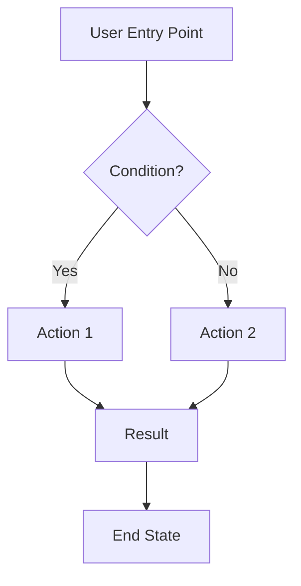

# Product Design Requirements (PDR)

## {Feature Name}

**Date**: YYYY-MM-DD
**Status**: Draft | In Review | Approved | In Progress | Completed
**Priority**: P0 (Critical) | P1 (High) | P2 (Medium) | P3 (Low)
**Owner**: {Name/Team}
**Feature Type**: New Feature | Enhancement | Bug Fix | Refactor

---

## 1. Overview

### 1.1 Problem Statement

{Clear, concise description of the problem we're solving. Why does this matter? Who is affected?}

**Context:**

- {Business context}
- {Technical context}
- {User context}

### 1.2 Goals & Success Metrics

**Primary Goal:**
{Main objective of this feature}

**Success Metrics:**

- **Metric 1**: {Description} - Target: {Value}
  - How measured: {Method}
- **Metric 2**: {Description} - Target: {Value}
  - How measured: {Method}
- **Metric 3**: {Description} - Target: {Value}
  - How measured: {Method}

### 1.3 Non-Goals

{What we explicitly won't do in this iteration}

- {Non-goal 1}
- {Non-goal 2}
- {Non-goal 3}

---

## 2. User Stories

### US-001: {User Story Title}

**As a** {user type/role}
**I want to** {action/capability}
**So that** {benefit/value}

**Priority**: P0 | P1 | P2 | P3

**Acceptance Criteria**:

- [ ] **AC-001**: {Specific, testable criterion}
  - Given: {precondition}
  - When: {action}
  - Then: {expected result}

- [ ] **AC-002**: {Specific, testable criterion}
  - Given: {precondition}
  - When: {action}
  - Then: {expected result}

- [ ] **AC-003**: {Specific, testable criterion}
  - Given: {precondition}
  - When: {action}
  - Then: {expected result}

**Edge Cases:**

- {Edge case 1 and how to handle it}
- {Edge case 2 and how to handle it}

---

### US-002: {User Story Title}

**As a** {user type/role}
**I want to** {action/capability}
**So that** {benefit/value}

**Priority**: P0 | P1 | P2 | P3

**Acceptance Criteria**:

- [ ] **AC-001**: {Specific, testable criterion}
- [ ] **AC-002**: {Specific, testable criterion}
- [ ] **AC-003**: {Specific, testable criterion}

---

### US-003: {User Story Title}

{Continue with additional user stories as needed}

---

## 3. Design & Mockups

### 3.1 User Flow Diagram

**Description:**
{Explain the user flow in detail}

### 3.2 User Interface Design

<!--
NOTE: This section can include AI-generated mockups for complex UI flows.
Use the ux-ui-designer agent's MockupGenerator to create visual mockups when:
- The UI flow is complex (multi-step processes, dashboards)
- The interaction pattern is novel or hard to describe in text
- Specific layout/spacing requirements need visualization
- User explicitly requests visual mockups

Always include a descriptive caption explaining what the mockup shows.
Failed mockup generation should NOT block PDR creation - fall back to text wireframes.
-->

#### {Screen/Feature Name}

<!-- EXAMPLE: AI-Generated Mockup Reference -->

*Desktop mockup showing {brief description of what's in the mockup}. {Key design decisions or highlights}.*

**Key Elements:**

- **{Section 1}**: {Description and purpose}
- **{Section 2}**: {Description and purpose}
- **{Section 3}**: {Description and purpose}

**Interaction Flow:**

1. {Step 1 and what happens}
2. {Step 2 and what happens}
3. {Step 3 and what happens}

<!-- EXAMPLE: Mobile Variant -->

*Mobile-optimized version with {responsive adaptations}. Touch-friendly targets (minimum 44x44px).*

**Mobile-Specific Adaptations:**

- {Adaptation 1}
- {Adaptation 2}
- {Adaptation 3}

<!-- Alternative: Text-based wireframe if mockup not needed -->

#### Desktop View

- **Location**: {Link to Figma/image or describe}
- **Key Elements**:
  - {Element 1 and its purpose}
  - {Element 2 and its purpose}
  - {Element 3 and its purpose}

#### Tablet View

- **Location**: {Link to Figma/image or describe}
- **Responsive Changes**:
  - {Change 1}
  - {Change 2}

#### Mobile View

- **Location**: {Link to Figma/image or describe}
- **Mobile-Specific Features**:
  - {Feature 1}
  - {Feature 2}

### 3.3 Component Specifications

<!--
NOTE: For complex custom components, consider generating a mockup to show:
- Exact layout and spacing
- Different states (default, hover, active, disabled, error, loading)
- Responsive behavior across breakpoints

Simple standard components (buttons, inputs) don't need mockups.
-->

#### {Screen/Component Name}

<!-- EXAMPLE: Component with visual mockup -->

*Component mockup showing all interactive states: default, hover, active, disabled, error, and loading.*

- **Location**: {Link to mockup or Figma}
- **Description**: {What this component does}
- **States**:
  - **Default**: {Appearance and behavior}
  - **Hover**: {Visual feedback}
  - **Active/Focus**: {Visual feedback}
  - **Disabled**: {Appearance}
  - **Error**: {Error indication}
  - **Loading**: {Loading state}
- **Interactive Elements**:
  - {Element 1}: {Behavior}
  - {Element 2}: {Behavior}
  - {Element 3}: {Behavior}

<!-- Alternative: Text-based specification -->

#### Component 2: {Component Name}

{Continue with additional components/screens}

**Mockup Usage Guidelines:**

- **When to include mockups**: Complex flows, novel patterns, specific layout requirements, user request
- **When to skip mockups**: Simple layouts, standard components, unclear requirements
- **Caption format**: `` + italic caption
- **File location**: `./mockups/` folder in session directory
- **Naming convention**: `{feature}-{device}-YYYYMMDD-HHMMSS.png`
- **Cost awareness**: Use judiciously (2-4 key mockups per feature, flux-schnell model default)
- **Fallback**: Always have text wireframes as backup if generation fails

### 3.4 UI Components

| Component | Description | Behavior | States |
|-----------|-------------|----------|--------|
| {Component Name} | {What it displays} | {How it behaves} | Default, Hover, Active, Disabled, Error |
| {Component Name} | {What it displays} | {How it behaves} | Default, Loading, Success, Error |

**Component Details:**

- **Component 1**: {Detailed description, props, variants}
- **Component 2**: {Detailed description, props, variants}

---

## 4. Technical Constraints

### 4.1 Performance Requirements

**Page Load Time:**

- Desktop: < {X} seconds
- Mobile: < {Y} seconds

**API Response Time:**

- Critical endpoints: < {X} ms
- Standard endpoints: < {Y} ms

**Database Query Time:**

- Simple queries: < {X} ms
- Complex queries: < {Y} ms

**Bundle Size:**

- JavaScript: < {X} KB
- CSS: < {Y} KB

**Other Performance Metrics:**

- {Metric 1}: {Target}
- {Metric 2}: {Target}

### 4.2 Security Requirements

**Authentication:**

- Required: Yes | No
- Level: {Public | User | Admin | Custom}
- Provider: {Clerk | Custom}

**Authorization:**

- Who can access: {Roles/permissions}
- Who can modify: {Roles/permissions}
- Who can delete: {Roles/permissions}

**Data Privacy:**

- PII involved: Yes | No
- Data classification: Public | Internal | Confidential | Restricted
- Compliance: {GDPR | CCPA | etc. if applicable}
- Encryption: {At rest | In transit | Both}

**Input Validation:**

- Client-side: {Required validations}
- Server-side: {Required validations}
- Sanitization: {XSS | SQL Injection | etc.}

**Rate Limiting:**

- API calls: {X} requests per {time period}
- User actions: {Y} actions per {time period}

### 4.3 Accessibility Requirements

**WCAG Level**: A | AA | AAA

**Required Support:**

- [ ] Keyboard navigation (Tab, Enter, Esc, Arrow keys)
- [ ] Screen reader compatibility (NVDA, JAWS, VoiceOver)
- [ ] Focus indicators visible
- [ ] Color contrast ratio ≥ 4.5:1 (AA) or ≥ 7:1 (AAA)
- [ ] Alt text for all images
- [ ] ARIA labels where needed
- [ ] Form labels properly associated
- [ ] Error messages accessible

**Exceptions:**
{Any exceptions and justification}

### 4.4 Browser/Device Support

**Desktop Browsers:**

- Chrome: {Minimum version}
- Firefox: {Minimum version}
- Safari: {Minimum version}
- Edge: {Minimum version}

**Mobile Devices:**

- iOS: {Minimum version}
- Android: {Minimum version}

**Screen Sizes:**

- Mobile: 320px - 767px
- Tablet: 768px - 1023px
- Desktop: 1024px+

---

## 5. Dependencies & Integrations

### 5.1 Internal Dependencies

| Package/Service | Version | Why Needed | Impact if Unavailable |
|----------------|---------|------------|----------------------|
| @repo/db | {version} | {reason} | {impact} |
| @repo/schemas | {version} | {reason} | {impact} |
| {service} | {version} | {reason} | {impact} |

### 5.2 External Dependencies

| Service/API | Version | Why Needed | Rate Limits | Fallback |
|-------------|---------|------------|-------------|----------|
| {API name} | {version} | {reason} | {limits} | {fallback plan} |
| {Service} | {version} | {reason} | {limits} | {fallback plan} |

### 5.3 New Dependencies

**Packages to Add:**

- {package-name}: {version} - {reason} - {bundle size impact}

**Justification:**
{Why these dependencies are necessary and alternatives considered}

---

## 6. Risks & Mitigations

| Risk | Impact | Probability | Mitigation Strategy | Owner |
|------|--------|-------------|-------------------|-------|
| {Risk description} | High/Med/Low | High/Med/Low | {How we'll handle it} | {Who} |
| {Database performance degradation} | High | Medium | {Add indexes, optimize queries, implement caching} | {DB Engineer} |
| {Third-party API unavailable} | High | Low | {Implement retry logic, fallback service, graceful degradation} | {Backend Dev} |

**Risk Details:**

### Risk 1: {Risk Name}

- **Description**: {Detailed description}
- **Impact if occurs**: {What happens}
- **Mitigation**: {Specific steps}
- **Monitoring**: {How we'll detect it}

### Risk 2: {Risk Name}

{Continue with additional risks}

---

## 7. Out of Scope / Future Work

**Explicitly Out of Scope:**

- {Feature/improvement for later - reason why}
- {Feature/improvement for later - reason why}

**Future Enhancements:**

- {Enhancement 1 - when we might do it}
- {Enhancement 2 - when we might do it}

**Technical Debt Created:**

- {Known debt item 1 - plan to address}
- {Known debt item 2 - plan to address}

---

## 8. Testing Strategy

### 8.1 Test Coverage Requirements

- Unit tests: 90%+ coverage
- Integration tests: Critical paths
- E2E tests: Main user flows

### 8.2 Test Scenarios

**Unit Tests:**

- {Scenario 1}
- {Scenario 2}

**Integration Tests:**

- {Scenario 1}
- {Scenario 2}

**E2E Tests:**

- {User flow 1}
- {User flow 2}

### 8.3 Performance Testing

- Load test: {X} concurrent users
- Stress test: {Y} concurrent users
- Endurance test: {Z} hours

---

## 9. Documentation Requirements

**Documentation to Create/Update:**

- [ ] API documentation (OpenAPI)
- [ ] Component usage guide
- [ ] User guide (if user-facing)
- [ ] Deployment guide (if infrastructure changes)
- [ ] Architecture decision record (if architectural changes)

---

## 10. Deployment Plan

**Deployment Type**: Big Bang | Phased Rollout | Feature Flag | Blue-Green

**Rollout Plan:**

1. {Step 1}
2. {Step 2}
3. {Step 3}

**Rollback Plan:**

- Trigger: {What indicates we need to rollback}
- Steps: {How to rollback}
- Data: {How to handle data created during deployment}

**Feature Flags:**

- {Flag name}: {Purpose}

---

## 11. Related Documents

**Planning Documents:**

- [Technical Analysis](./tech-analysis.md) - Technical implementation details
- [TODOs & Progress](./TODOs.md) - Task breakdown and progress tracking

**Design Documents:**

- Mockups: {Link to Figma/design tool}
- User flows: {Link to diagrams}
- Wireframes: {Link to wireframes}

**Technical Documents:**

- Architecture decisions: {Link if applicable}
- API specifications: {Link if applicable}

**External References:**

- {Reference 1}
- {Reference 2}

---

## 12. Stakeholder Sign-Off

| Role | Name | Status | Date | Comments |
|------|------|--------|------|----------|
| Product Owner | {Name} | Pending/Approved | YYYY-MM-DD | {Comments} |
| Tech Lead | {Name} | Pending/Approved | YYYY-MM-DD | {Comments} |
| UX Designer | {Name} | Pending/Approved | YYYY-MM-DD | {Comments} |
| Security | {Name} | Pending/Approved | YYYY-MM-DD | {Comments} |

---

## 13. Changelog

| Date | Author | Changes | Version |
|------|--------|---------|---------|
| YYYY-MM-DD | {Name} | Initial draft | 0.1 |
| YYYY-MM-DD | {Name} | Added acceptance criteria | 0.2 |
| YYYY-MM-DD | {Name} | Updated mockups | 0.3 |
| YYYY-MM-DD | {Name} | Approved for implementation | 1.0 |

---

## 14. Questions & Answers

**Q1**: {Question}
**A1**: {Answer} - {Date} - {Who answered}

**Q2**: {Question}
**A2**: {Answer} - {Date} - {Who answered}

---

## Notes

**General Notes:**
{Any additional context, decisions, or information that doesn't fit elsewhere}

**Meeting Notes:**

- {Date}: {Key decisions from meeting}
- {Date}: {Key decisions from meeting}

---

**Status**: This PDR is {Draft/In Review/Approved/In Progress/Completed}
**Next Actions**: {What needs to happen next}
**Owner**: {Who is responsible for next steps}
