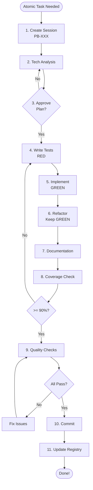

# Atomic Task Protocol (Level 2 Workflow)

## Overview

**Purpose**: Structured workflow for bugfixes and small features requiring planning but not full PDR

**Scope**: 30 minutes - 3 hours, 2-10 files, low-medium risk
**Overhead**: Moderate (simplified tech analysis, no PDR)
**Risk Level**: Low to Medium

## When to Use Level 2 (Atomic Task)

Use this workflow for changes that meet **MOST** criteria:

### Qualifying Criteria ✅

- **Time**: 30 minutes - 3 hours to complete
- **Scope**: 2-10 files affected
- **Risk**: Low to medium (bugfixes, small features, targeted refactors)
- **Impact**: Functional changes but well-contained
- **Testing**: New tests required
- **Planning**: Some design decisions needed (but not architectural)

### Qualifying Examples

**Bugfixes:**

- ✅ **Fix validation error** in booking form
- ✅ **Correct calculation bug** in pricing logic
- ✅ **Fix race condition** in state updates
- ✅ **Repair broken API endpoint**
- ✅ **Fix authentication edge case**
- ✅ **Correct data transformation bug**

**Small Features:**

- ✅ **Add search filter** to existing list
- ✅ **Add sorting option** to table
- ✅ **Implement pagination** on results
- ✅ **Add export button** to dashboard
- ✅ **Add validation rule** to form
- ✅ **Implement loading state** for async operation

**Small Refactors:**

- ✅ **Extract reusable component** from page
- ✅ **Consolidate duplicate code** (2-3 files)
- ✅ **Rename for clarity** (affecting multiple files)
- ✅ **Optimize database query** (single endpoint)
- ✅ **Add error boundary** to component tree
- ✅ **Improve type safety** in module

### Non-Qualifying Examples (Use Different Level)

**Too Small (Use Level 1):**

- ❌ Typo fixes
- ❌ Formatting only
- ❌ Documentation updates
- ❌ Single file changes < 30 min

**Too Large (Use Level 3):**

- ❌ New major features
- ❌ Database schema changes
- ❌ API contract changes
- ❌ Architecture changes
- ❌ Multi-day features
- ❌ Requires full PDR

## PB-XXX Code System

### Code Format

**Pattern**: `PB-XXX` (Patch/Bugfix - Number)

**Examples:**

- `PB-001` - First bugfix
- `PB-042` - 42nd bugfix/small feature
- `PB-125` - 125th atomic task

### Registry File

**Location**: `.claude/sessions/atomic-tasks/REGISTRY.md`

**Format:**

```markdown
# Atomic Tasks Registry

## Active Tasks

| Code | Title | Type | Status | Started | Assignee |
|------|-------|------|--------|---------|----------|
| PB-001 | Fix booking validation | Bug | In Progress | 2024-02-01 | @hono-engineer |
| PB-002 | Add search to entitys | Feature | Planning | 2024-02-01 | @astro-engineer |

## Completed Tasks

| Code | Title | Type | Completed | Time Spent | Files Changed |
|------|-------|------|-----------|------------|---------------|
| PB-000 | Example bugfix | Bug | 2024-01-31 | 2h | 3 |
```

### Session Structure

```
.claude/sessions/atomic-tasks/
├── REGISTRY.md                    # Master registry
├── PB-001-fix-booking-validation/
│   ├── tech-analysis.md          # Simplified planning
│   └── .checkpoint.json          # Progress tracking
├── PB-002-add-search/
│   ├── tech-analysis.md
│   └── .checkpoint.json
└── ...
```

## 11-Step Workflow

### Step 1: Create Atomic Task Session 📁

**Objective**: Initialize task tracking

**Actions:**

1. **Get next PB code:**

   ```bash
   # Check REGISTRY.md for last code
   # Increment by 1
   ```

2. **Create session directory:**

   ```bash
   mkdir -p .claude/sessions/atomic-tasks/PB-XXX-task-name
   ```

3. **Register in REGISTRY.md:**

   ```markdown
   | PB-XXX | Task title | Type | Not Started | YYYY-MM-DD | @assignee |
   ```

4. **Create checkpoint:**

   ```json
   {
     "taskCode": "PB-XXX",
     "taskName": "Task Name",
     "type": "bug|feature|refactor",
     "phase": "planning",
     "started": "2024-02-01T10:00:00Z"
   }
   ```

**Output**: Task session initialized

---

### Step 2: Create Simplified Tech Analysis 📝

**Objective**: Plan the implementation (no PDR needed)

**Template**: `.claude/sessions/atomic-tasks/PB-XXX/tech-analysis.md`

```markdown
# PB-XXX: [Task Title]

## Type
- [ ] Bug
- [ ] Small Feature  
- [ ] Small Refactor

## Problem Statement

[Brief description of the bug/feature/refactor need]

## Current Behavior (for bugs)

[What's happening now]

## Expected Behavior

[What should happen]

## Root Cause Analysis (for bugs)

[Why is this happening]

## Proposed Solution

### Approach

[High-level approach]

### Files to Change

1. `path/to/file1.ts` - [What changes]
2. `path/to/file2.ts` - [What changes]
3. `path/to/file3.test.ts` - [Test changes]

### Implementation Steps

1. [ ] Step 1
2. [ ] Step 2
3. [ ] Step 3

## Technical Considerations

- **Risk Level**: Low | Medium
- **Breaking Changes**: Yes | No
- **Database Impact**: Yes | No
- **API Changes**: Yes | No
- **Dependencies**: [Any new dependencies]

## Testing Strategy

- [ ] Unit tests for [component/function]
- [ ] Integration tests for [flow]
- [ ] Manual testing steps

## Edge Cases

1. [Edge case 1]
2. [Edge case 2]

## Time Estimate

**Estimated**: X hours
**Actual**: [Fill after completion]

## Acceptance Criteria

- [ ] Criterion 1
- [ ] Criterion 2
- [ ] Criterion 3
- [ ] Tests passing
- [ ] No regressions
```

**Actions:**

1. Fill out template
2. Keep it concise (1-2 pages max)
3. Focus on implementation details
4. Identify risks

**Output**: Tech analysis document

---

### Step 3: Review & Approve Plan 👀

**Objective**: Validate approach before implementation

**Actions:**

1. **Self-review:**
   - Is approach sound?
   - Are files identified?
   - Are risks assessed?
   - Is time estimate realistic?

2. **Get approval (if working with team):**
   - Share tech-analysis.md
   - Discuss approach
   - Adjust if needed

3. **Commit planning docs:**

   ```bash
   git add .claude/sessions/atomic-tasks/PB-XXX/
   git commit -m "docs(PB-XXX): add tech analysis for [task]"
   ```

**Output**: Approved plan

---

### Step 4: Write Tests First (TDD) 🧪

**Objective**: Define expected behavior through tests

**Actions:**

1. **Write failing tests:**

   ```typescript
   // RED: Write test that fails
   describe('BookingValidation', () => {
     it('should reject past check-in dates', () => {
       const result = validateBooking({
         checkIn: '2020-01-01',
         checkOut: '2020-01-05'
       });
       expect(result.valid).toBe(false);
       expect(result.errors).toContain('Check-in date cannot be in the past');
     });
   });
   ```

2. **Run tests - verify they fail:**

   ```bash
   pnpm test
   # Should see RED (failing)
   ```

3. **Commit red tests:**

   ```bash
   git add test/
   git commit -m "test(PB-XXX): add failing tests for [feature]"
   ```

**Output**: Failing tests committed

---

### Step 5: Implement Solution (Make Tests Green) ✅

**Objective**: Write minimum code to pass tests

**Actions:**

1. **Implement changes:**
   - Follow tech-analysis.md plan
   - Keep changes focused
   - One file at a time
   - Commit incrementally

2. **Make tests pass:**

   ```bash
   pnpm test
   # Should see GREEN (passing)
   ```

3. **Verify no regressions:**

   ```bash
   pnpm test        # All tests
   pnpm typecheck   # TypeScript
   pnpm lint        # Linting
   ```

**Output**: Working implementation

---

### Step 6: Refactor (Keep Tests Green) 🔧

**Objective**: Improve code quality while maintaining functionality

**Actions:**

1. **Refactor for quality:**
   - Remove duplication
   - Improve names
   - Extract methods
   - Optimize logic

2. **Keep tests green:**

   ```bash
   pnpm test  # After each refactor
   ```

3. **Follow patterns:**
   - Use established patterns
   - Match existing code style
   - Apply SOLID principles

**Output**: Refactored, clean code

---

### Step 7: Add Documentation 📚

**Objective**: Document changes for future maintenance

**Actions:**

1. **Code documentation:**

   ```typescript
   /**
    * Validates booking dates ensuring check-in is not in the past
    * and check-out is after check-in
    * 
    * @param booking - Booking data to validate
    * @returns Validation result with errors if invalid
    * 
    * @example
    * ```ts
    * const result = validateBooking({
    *   checkIn: '2024-02-01',
    *   checkOut: '2024-02-05'
    * });
    * ```
    */
   export function validateBooking(booking: BookingInput): ValidationResult {
     // ...
   }
   ```

2. **Update README if needed**
3. **Add comments for complex logic**

**Output**: Documented code

---

### Step 8: Test Coverage Check 📊

**Objective**: Ensure 90%+ coverage

**Actions:**

1. **Run coverage:**

   ```bash
   pnpm test:coverage
   ```

2. **Check results:**
   - Aim for >= 90% line coverage
   - Aim for >= 85% branch coverage
   - Ensure all edge cases tested

3. **Add missing tests if needed**

**Validation:**

- [ ] Line coverage >= 90%
- [ ] Branch coverage >= 85%
- [ ] All edge cases covered
- [ ] No untested error paths

**Output**: Comprehensive test coverage

---

### Step 9: Quality Checks ✔️

**Objective**: Validate all quality gates pass

**Actions:**

1. **Run all checks:**

   ```bash
   pnpm lint          # Linting
   pnpm typecheck     # TypeScript
   pnpm test          # Tests
   pnpm test:coverage # Coverage
   ```

2. **Manual testing:**
   - Test happy path
   - Test edge cases
   - Test error scenarios
   - Test UI if applicable

3. **Fix any issues found**

**💡 Consider Using Specialized Agents or Skills:**

For complex atomic tasks, consider delegating quality checks:

- **`qa-engineer` agent** - Comprehensive testing validation (if task has complex test scenarios)
- **`tech-lead` with `security-audit` skill** - Security review (if task touches auth, data validation, or sensitive operations)
- **`tech-lead` with `performance-audit` skill** - Performance analysis (if task affects queries, rendering, or data processing)

**When to use specialized checks:**

- Task involves authentication/authorization → security-audit skill
- Task modifies database queries → performance-audit skill
- Task adds API endpoints with validation → security-audit skill
- Task has complex business logic → qa-engineer agent
- Task affects performance-critical paths → performance-audit skill

**Example:**

```text
This task adds user input validation with sanitization.
I'll coordinate with tech-lead to run security-audit skill for injection vulnerabilities.
```

**Validation:**

- [ ] Lint passing
- [ ] TypeCheck passing
- [ ] Tests passing
- [ ] Coverage >= 90%
- [ ] Manual testing successful
- [ ] No console errors/warnings
- [ ] Specialized agent review (if needed)

**Output**: All quality checks passing

---

### Step 10: Commit with Conventional Message 📝

**Objective**: Create clean, descriptive commits

**🔥 CRITICAL: Only Commit Task-Related Files**

Before creating commits, verify which files to include:

```bash
git status --short
```

**Rule:** ONLY include files modified during THIS atomic task.

If `git status` shows unrelated modified files:

- ❌ **DO NOT** include them in this commit
- ❌ **DO NOT** use `git add .` or `git add -A`
- ✅ **ONLY** use `git add <specific-file>` for task files
- ⚠️ **WARN** user about unrelated changes

**Example:**

```bash
# Atomic Task: PB-001 "Fix booking validation"
# git status shows:
M packages/service-core/src/booking.service.ts  ← INCLUDE (this task)
M packages/service-core/test/booking.test.ts    ← INCLUDE (this task)
M packages/api/routes/user.ts                   ← EXCLUDE (different task)
M .env.local                                     ← EXCLUDE (local config)

# CORRECT - Only task files:
git add packages/service-core/src/booking.service.ts
git add packages/service-core/test/booking.test.ts
git commit -m "fix(PB-001): prevent booking with past check-in dates..."

# WRONG - Would include unrelated files:
git add .  # ❌ Don't do this!
```

**If unrelated files detected:**

```text
⚠️ Warning: I found modified files NOT related to PB-001:
- packages/api/routes/user.ts (different task)
- .env.local (local configuration)

I will ONLY commit files related to PB-001.
Unrelated files will remain uncommitted.

Proceeding with PB-001 files only. Continue? (yes/no)
```

---

**Commit Message Format:**

```
<type>(PB-XXX): <description>

- Change 1
- Change 2
- Change 3

Closes #issue-number
```

**Types:**

- `fix` - Bug fixes
- `feat` - New features
- `refactor` - Code refactoring

**Examples:**

```bash
# Bugfix
git commit -m "fix(PB-001): prevent booking with past check-in dates

- Add date validation in validateBooking function
- Add tests for past date scenarios
- Update error messages for clarity

Fixes #456"

# Small feature
git commit -m "feat(PB-002): add search to entity list

- Add search input component
- Implement client-side filtering
- Add debounce for performance
- Add tests for search functionality

Closes #457"

# Refactor
git commit -m "refactor(PB-003): extract BookingCard component

- Create reusable BookingCard component
- Update BookingList to use BookingCard
- Add tests for BookingCard
- Improve type safety

Closes #458"
```

**Output**: Clean, conventional commits

---

### Step 11: Update State & Close Task ✅

**Objective**: Mark task complete and track metrics

**🔥 CRITICAL: Update ALL State Files**

When completing an atomic task, you MUST update all state tracking:

**Actions:**

1. **Update tech-analysis.md:**

   ```markdown
   ## Time Estimate
   **Estimated**: 2 hours
   **Actual**: 2.5 hours

   ## Completion
   **Status**: ✅ Completed
   **Date**: 2024-02-01
   **Files Changed**: 4
   **Lines Added**: 156
   **Lines Removed**: 42
   ```

2. **Update REGISTRY.md:**

   ```markdown
   ## Completed Tasks
   | PB-001 | Fix booking validation | Bug | 2024-02-01 | 2.5h | 4 |
   ```

3. **Update .checkpoint.json:**

   ```json
   {
     "taskCode": "PB-001",
     "phase": "completed",
     "completed": "2024-02-01T15:30:00Z",
     "timeSpent": "2.5h",
     "filesChanged": 4,
     "progress": {
       "total": 1,
       "completed": 1,
       "percentage": 100
     }
   }
   ```

4. **If Part of Larger Planning Session:**

   If this atomic task is a subtask of a feature planning session:

   a. **Update TODOs.md** in planning session:

   ```markdown
   - [x] **[2h]** PB-001: Fix booking validation
     - Completed: 2024-02-01
     - Actual time: 2.5h
     - Files: 4
   ```

   b. **Update planning .checkpoint.json**:

   ```json
   {
     "tasks": {
       "PB-001": {
         "status": "completed",
         "completed": "2024-02-01T15:30:00Z"
       }
     },
     "progress": {
       "total": 45,
       "completed": 13,
       "percentage": 28.9
     }
   }
   ```

   c. **Update .github-workflow/tracking.json**:

   ```json
   {
     "issues": {
       "HOSP-124": {
         "status": "done",
         "linearId": "abc-123-def",
         "lastSync": "2024-02-01T15:30:00Z"
       }
     }
   }
   ```

5. **Commit state updates:**

   ```bash
   # For standalone atomic task
   git add .claude/sessions/atomic-tasks/PB-001/
   git commit -m "docs(PB-001): mark task complete"

   # If part of planning session
   git add .claude/sessions/planning/{feature}/TODOs.md
   git add .claude/sessions/planning/{feature}/.checkpoint.json
   git add .github-workflow/tracking.json
   git commit -m "docs: update planning state for PB-001 completion"
   ```

**State Files Checklist:**

- [ ] tech-analysis.md updated (atomic task)
- [ ] REGISTRY.md updated (atomic task)
- [ ] .checkpoint.json updated (atomic task)
- [ ] TODOs.md updated (if part of planning)
- [ ] Planning .checkpoint.json updated (if part of planning)
- [ ] .github-workflow/tracking.json updated (if part of planning)
- [ ] Changes committed

**Output**: Task completed and all state tracking updated

---

## Workflow Summary



## Time Breakdown

Total: **30 minutes - 3 hours**

1. Create session: **5 min**
2. Tech analysis: **15-30 min**
3. Review & approve: **5-10 min**
4. Write tests (RED): **15-30 min**
5. Implement (GREEN): **30 min - 1.5h**
6. Refactor: **15-30 min**
7. Documentation: **10-15 min**
8. Coverage check: **5-10 min**
9. Quality checks: **10-15 min**
10. Commit: **5 min**
11. Update registry: **5 min**

## Examples

### Example 1: Bugfix - Booking Validation

**PB-001: Fix booking validation allowing past dates**

**Problem:**
Users can book entitys with check-in dates in the past.

**Tech Analysis:**

```markdown
## Root Cause
Missing date validation in `validateBooking` function

## Solution
Add date validation checking `checkIn >= today`

## Files to Change
- `packages/service-core/src/booking/validators.ts`
- `packages/service-core/test/booking/validators.test.ts`
```

**Implementation:**

1. Write test expecting past dates to fail
2. Add validation: `if (checkIn < today) throw ValidationError`
3. Refactor for clarity
4. Document function
5. Commit with `fix(PB-001)`

**Time**: 1.5 hours

---

### Example 2: Small Feature - Search Filter

**PB-002: Add search to entity list**

**Feature:**
Allow users to search entitys by name/location

**Tech Analysis:**

```markdown
## Approach
Client-side search with debounce

## Files to Change
- `apps/web/src/components/EntityList.tsx` - Add search input
- `apps/web/src/hooks/useEntitySearch.ts` - Search logic
- `apps/web/src/components/SearchInput.tsx` - Reusable component

## Implementation
1. Create SearchInput component
2. Create useEntitySearch hook with debounce
3. Update EntityList to use search
4. Add tests
```

**Implementation:**

1. Write tests for search functionality
2. Create SearchInput component
3. Implement useEntitySearch with debounce
4. Integrate into EntityList
5. Commit with `feat(PB-002)`

**Time**: 2.5 hours

---

### Example 3: Small Refactor - Extract Component

**PB-003: Extract BookingCard from BookingList**

**Refactor:**
BookingList component has duplicate card rendering logic

**Tech Analysis:**

```markdown
## Goal
Extract reusable BookingCard component

## Files to Change
- `apps/web/src/components/BookingList.tsx` - Use BookingCard
- `apps/web/src/components/BookingCard.tsx` - New component
- `apps/web/src/components/BookingCard.test.tsx` - Tests

## Benefits
- Reusability
- Better separation of concerns
- Easier testing
```

**Implementation:**

1. Write tests for BookingCard
2. Create BookingCard component
3. Update BookingList to use BookingCard
4. Verify no visual changes
5. Commit with `refactor(PB-003)`

**Time**: 2 hours

---

## When Atomic Task Becomes Bigger

**Signs you need Level 3 workflow:**

- ⚠️ Taking > 3 hours
- ⚠️ More than 10 files affected
- ⚠️ Architectural decisions needed
- ⚠️ Database schema changes
- ⚠️ API contract changes
- ⚠️ Multiple features bundled
- ⚠️ Requires stakeholder input
- ⚠️ Full PDR needed

**Action**: Stop and switch to Level 3 (Feature Planning)

## Best Practices

1. **Keep It Atomic**: One logical change per task
2. **Follow TDD**: Always RED → GREEN → REFACTOR
3. **Time Box**: If > 3h, split into multiple tasks
4. **Document Decisions**: Tech analysis is your planning doc
5. **Test Thoroughly**: >= 90% coverage required
6. **Commit Often**: Incremental commits preferred
7. **Update Registry**: Track all tasks
8. **Learn & Improve**: Note actual vs estimated time

## Anti-Patterns ❌

- ❌ **Skipping Tests**: "I'll add tests later"
- ❌ **No Planning**: "This is simple, I don't need tech-analysis"
- ❌ **Scope Creep**: "While I'm here, I'll also fix..."
- ❌ **No Registry**: Not tracking tasks
- ❌ **Poor Commits**: "fix stuff"
- ❌ **Skipping Quality**: "Tests are optional"
- ❌ **Wrong Level**: Using Level 2 for Level 1 or 3 tasks

## Decision Tree Integration

When in doubt, use the [Workflow Decision Tree](./decision-tree.md):

```
Is it 30min-3h, 2-10 files, low-medium risk?
├─ Yes → Level 2 (Atomic Task) ✅
└─ No → Check Level 1 or Level 3 criteria
```

## Related Documentation

- [Workflow Decision Tree](./decision-tree.md) - Choose workflow level
- [Quick Fix Protocol](./quick-fix-protocol.md) - Level 1 workflow
- [TDD Methodology Skill](../../skills/patterns/tdd-methodology.md) - TDD approach
- [Git Commit Helper Skill](../../skills/git/git-commit-helper.md) - Conventional commits

## Notes

- **Always use TDD**: RED-GREEN-REFACTOR cycle
- **Track in Registry**: All atomic tasks logged
- **Simplified Planning**: Tech analysis only, no PDR
- **Quality Gates**: All checks must pass
- **90% Coverage**: Non-negotiable minimum
- **Incremental Commits**: Commit working states
- **PB-XXX Codes**: Sequential numbering

**Remember**: Atomic tasks are focused, well-planned, and thoroughly tested. If it's getting complex, use Level 3.
