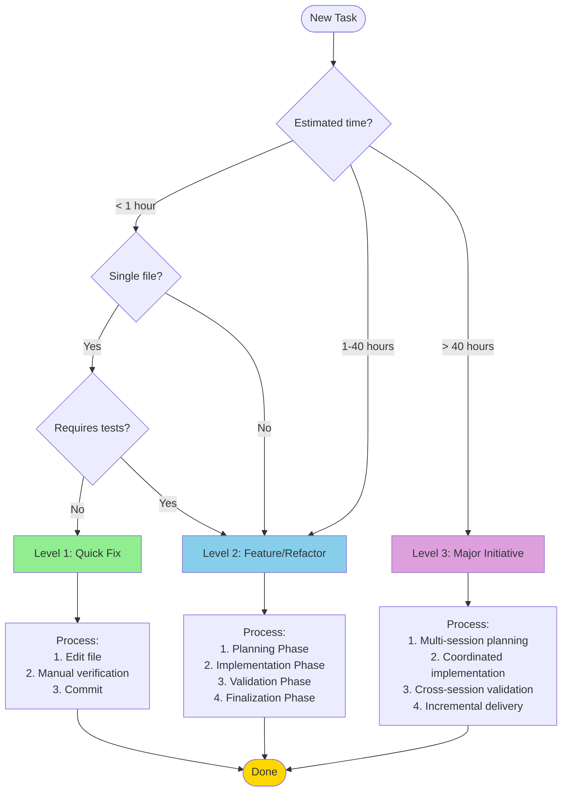

# Workflow Decision Tree

Decision framework for selecting the appropriate workflow level based on task characteristics.

---

## Decision Diagram



---

## Level 1: Quick Fix

### When to Use

**Time estimate:** < 1 hour

**Characteristics:**

- Single file modification
- No new tests required (or trivial test update)
- Minimal risk
- No architectural impact
- Isolated change

### Examples

✅ **Good candidates:**

- Fix typo in documentation
- Update dependency version in package.json
- Adjust CSS styling
- Correct variable name
- Fix broken link

❌ **Not suitable:**

- Changes requiring new tests
- Multi-file modifications
- Database schema changes
- API contract modifications

### Process

```
1. Make change directly
2. Manual verification
3. Commit with conventional message
```

**Commands:** None required (direct editing)

**Duration:** 5-60 minutes

---

## Level 2: Feature/Refactor

### When to Use

**Time estimate:** 1-40 hours

**Characteristics:**

- Requires planning and design
- Multiple files affected
- New tests required
- Moderate complexity
- Clear scope and requirements

### Examples

✅ **Good candidates:**

- New API endpoint with CRUD operations
- Refactor service layer to use dependency injection
- Add authentication to existing feature
- Create new UI component with tests
- Database schema migration

❌ **Not suitable:**

- Simple one-line fixes (use Level 1)
- Massive refactoring spanning 50+ files (use Level 3)
- Changes without clear requirements

### Process

#### Phase 1: Planning (20% of time)

**Goal:** Create comprehensive plan

**Steps:**

1. Run `/start-feature-plan` or `/start-refactor-plan`
2. `product-functional` agent creates PDR.md
   - User stories
   - Mockups (if applicable)
   - Acceptance criteria
3. `product-technical` agent creates tech-analysis.md
   - Architecture decisions
   - Tech stack choices
   - Implementation approach
   - Task breakdown
4. Create TODOs.md with atomized tasks (≤ 4h each)
5. User approval

**Deliverables:**

- PDR.md
- tech-analysis.md
- TODOs.md
- .checkpoint.json

#### Phase 2: Implementation (60% of time)

**Goal:** Build feature following TDD

**Steps:**

1. For each task in TODOs.md:
   - **RED:** Write failing test
   - **GREEN:** Implement minimum code
   - **REFACTOR:** Improve while tests pass
2. Update .checkpoint.json after each task
3. Commit incrementally (1 commit per task or logical group)

**Key practices:**

- Follow existing patterns exactly
- Maintain 90% test coverage
- Document with JSDoc (English)
- Run lint/typecheck frequently

#### Phase 3: Validation (15% of time)

**Goal:** Ensure quality standards

**Steps:**

1. Run `/quality-check`:
   - Lint (Biome) - stops on error
   - Type check - stops on error
   - Tests - stops on error
   - Code review - reports all
   - Security review - reports all
   - Performance review - reports all
2. Invoke `qa-engineer` with acceptance criteria
3. Fix any issues
4. Invoke `tech-lead` for global review

#### Phase 4: Finalization (5% of time)

**Goal:** Document and prepare for merge

**Steps:**

1. Invoke `tech-writer` to update documentation
2. Run `/commit` to generate conventional commits
3. Review and approve commits
4. Optionally create PR with `/create-pr`

**Deliverables:**

- Tested, documented code
- Conventional commits
- Updated docs
- PR (optional)

**Commands:**

- `/start-feature-plan` or `/start-refactor-plan`
- `/quality-check`
- `/commit`

**Duration:** 1-40 hours (typically 4-24 hours)

---

## Level 3: Major Initiative

### When to Use

**Time estimate:** > 40 hours

**Characteristics:**

- Large, multi-faceted effort
- Multiple planning sessions
- Cross-cutting concerns
- Architectural significance
- Requires coordination
- Phased delivery

### Examples

✅ **Good candidates:**

- Complete authentication system (OAuth, JWT, permissions)
- Migrate database from PostgreSQL to different provider
- Rewrite frontend from React to Vue
- Implement multi-tenancy
- Build admin dashboard from scratch

❌ **Not suitable:**

- Tasks that can be completed in one session (use Level 2)
- Poorly defined initiatives without clear goals

### Process

#### Planning Stage

**Goal:** Define scope, phases, and dependencies

**Steps:**

1. Break initiative into multiple planning sessions
2. For each session:
   - Create separate planning session (PF-XXX)
   - Define clear scope and boundaries
   - Identify dependencies on other sessions
3. Establish delivery milestones
4. Coordinate order of execution

**Example breakdown:**

```
Initiative: Complete Auth System (80 hours)

Session 1: PF-010 - Core Auth (15h)
├── User registration
├── Login/logout
└── Session management

Session 2: PF-011 - OAuth Integration (20h)
├── Google OAuth
├── GitHub OAuth
└── Token management

Session 3: PF-012 - Permissions System (25h)
├── Role-based access control
├── Resource permissions
└── Permission middleware

Session 4: PF-013 - Admin Interface (20h)
├── User management UI
├── Role assignment
└── Audit logs
```

#### Execution Stage

**Goal:** Implement each session using Level 2 workflow

**Steps:**

1. Execute each planning session in order
2. Use Level 2 (4-phase) workflow for each session
3. Maintain cross-session references in PDR.md
4. Update global progress tracking

#### Integration Stage

**Goal:** Ensure all parts work together

**Steps:**

1. Run integration tests across sessions
2. Validate cross-session dependencies
3. Perform end-to-end testing
4. Document complete system

**Commands:** Same as Level 2, repeated for each session

**Duration:** 40+ hours (typically 40-200 hours)

---

## Decision Factors Reference

### Time Estimation

| Duration | Level | Notes |
|----------|-------|-------|
| < 1 hour | Level 1 | Quick fixes only |
| 1-4 hours | Level 2 | Single planning session, 2-3 tasks |
| 4-16 hours | Level 2 | Standard feature, 4-8 tasks |
| 16-40 hours | Level 2 | Complex feature, 8-20 tasks |
| 40-80 hours | Level 3 | 2-3 planning sessions |
| 80-200 hours | Level 3 | 4-10 planning sessions |
| > 200 hours | Level 3 | Major initiative, careful planning |

### Complexity Indicators

**Low complexity** (→ Level 1):

- Single file
- No tests needed
- No dependencies
- Trivial change

**Medium complexity** (→ Level 2):

- 2-10 files
- New tests required
- Some dependencies
- Clear requirements

**High complexity** (→ Level 3):

- 20+ files
- Complex test scenarios
- Many dependencies
- Architectural impact

### Risk Assessment

**Low risk** (→ Level 1):

- No production impact
- Easy to rollback
- Isolated change
- No breaking changes

**Medium risk** (→ Level 2):

- Controlled production impact
- Reversible with effort
- Localized changes
- Backward compatible

**High risk** (→ Level 3):

- Significant production impact
- Difficult to rollback
- System-wide changes
- Potential breaking changes

---

## Common Scenarios

### Scenario 1: Documentation Update

**Task:** Update README with new API endpoint documentation

**Analysis:**

- Time: 15 minutes
- Files: 1 (README.md)
- Tests: None needed
- Risk: Low

**Decision:** Level 1 (Quick Fix)

### Scenario 2: New API Endpoint

**Task:** Create /api/users/:id/profile endpoint with tests

**Analysis:**

- Time: 6 hours
- Files: 5 (route, service, model, test, schema)
- Tests: Unit + Integration required
- Risk: Medium

**Decision:** Level 2 (Feature)

### Scenario 3: Authentication System

**Task:** Implement complete auth with OAuth, JWT, permissions

**Analysis:**

- Time: 80 hours
- Files: 50+
- Tests: Comprehensive suite
- Risk: High

**Decision:** Level 3 (Major Initiative)

- Break into 4 sessions
- Each session uses Level 2 workflow
- Coordinate dependencies

---

## Special Cases

### Uncertain Scope

**If you're unsure of the time estimate:**

1. Start with Level 2 planning phase
2. Create PDR and tech analysis
3. Do task breakdown
4. Re-evaluate based on task count and hours
5. If > 40 hours, convert to Level 3

### Emergency Fixes

**For critical production issues:**

1. Use Level 1 for immediate hotfix
2. Follow up with Level 2 for comprehensive fix
3. Document in separate planning session

### Experimental Work

**For proof-of-concept or spikes:**

1. Time-box to 4-8 hours
2. Use Level 2 with minimal planning
3. Decision point after POC:
   - Discard (learning captured)
   - Formalize with full Level 2
   - Expand to Level 3

---

## Decision Checklist

Before starting, answer these questions:

- [ ] What is the estimated time? (< 1h, 1-40h, > 40h)
- [ ] How many files will be modified? (1, 2-10, 20+)
- [ ] Are new tests required? (None, Some, Extensive)
- [ ] What is the risk level? (Low, Medium, High)
- [ ] Is the scope clear? (Yes, Mostly, No)
- [ ] Are there dependencies on other work? (None, Few, Many)

Based on answers:

- **Mostly Low/None/Yes/1:** Level 1
- **Mostly Medium/Some/2-10:** Level 2
- **Mostly High/Extensive/20+:** Level 3

---

## Visual Summary

| Criteria | Level 1 | Level 2 | Level 3 |
|----------|---------|---------|---------|
| **Time** | < 1h | 1-40h | > 40h |
| **Files** | 1 | 2-10 | 20+ |
| **Tests** | None/Trivial | Required | Comprehensive |
| **Planning** | None | PDR + Tech Analysis | Multi-session |
| **Risk** | Low | Medium | High |
| **Phases** | 1 | 4 | 4 × N sessions |
| **Commands** | None | `/start-*-plan`, `/quality-check` | Coordinated Level 2 |

---

Last updated: 2025-10-31
