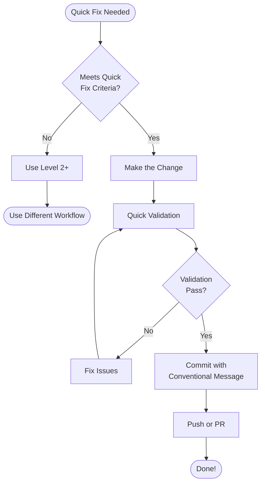

# Quick Fix Protocol (Level 1 Workflow)

## Overview

**Purpose**: Streamlined workflow for trivial changes that require minimal overhead

**Scope**: < 30 minutes, 1-2 files, very low risk
**Overhead**: Minimal (no planning documents required)
**Risk Level**: Very Low

## When to Use Level 1 (Quick Fix)

Use this workflow for changes that meet **ALL** criteria:

### Qualifying Criteria ✅

- **Time**: < 30 minutes to complete
- **Scope**: 1-2 files maximum
- **Risk**: Very low (typos, formatting, doc updates)
- **Impact**: No functional changes to business logic
- **Testing**: No new tests required
- **Planning**: No design decisions needed

### Qualifying Examples

- ✅ **Typo fixes** in code comments, strings, or documentation
- ✅ **Style tweaks** (formatting, whitespace, linting fixes)
- ✅ **Documentation updates** (README, comments, JSDoc)
- ✅ **Import organization** (unused imports, alphabetizing)
- ✅ **Config adjustments** (environment variables, build settings)
- ✅ **Markdown formatting** (running `pnpm format:md`)
- ✅ **Dependency version bumps** (patch updates only)
- ✅ **Log message improvements**
- ✅ **Error message clarifications**
- ✅ **Variable/function renames** (single file, no breaking changes)

### Non-Qualifying Examples (Use Higher Level)

- ❌ Bug fixes that change logic
- ❌ New features (even small ones)
- ❌ Database schema changes
- ❌ API contract changes
- ❌ Performance optimizations
- ❌ Security fixes
- ❌ Refactoring multiple files
- ❌ Breaking changes
- ❌ Dependency major/minor updates
- ❌ Anything requiring testing

## 6-Step Workflow

### Step 1: Verify Quick Fix Criteria ✅

**Objective**: Confirm change qualifies for Level 1

**Actions:**

1. Review qualifying criteria above
2. Estimate time to complete (must be < 30 min)
3. Count affected files (must be 1-2)
4. Assess risk (must be very low)
5. Check if tests needed (must be no)

**Decision:**

- ✅ **All criteria met** → Proceed with Quick Fix
- ❌ **Any criterion not met** → Use Level 2 or higher

**Output**: Confirmed as Quick Fix

---

### Step 2: Make the Change 🛠️

**Objective**: Implement the trivial change

**Actions:**

1. Open file(s) in editor
2. Make the change
3. Save file(s)
4. **No need for**:
   - Planning documents
   - Design discussions
   - Test creation
   - Complex analysis

**Best Practices:**

- Keep change minimal and focused
- Don't expand scope during implementation
- If you discover more issues, handle separately

**Output**: Changed file(s)

---

### Step 3: Quick Validation ✔️

**Objective**: Verify change doesn't break anything

**Actions:**

1. **For code changes:**

   ```bash
   pnpm typecheck    # TypeScript validation
   pnpm lint         # Linting check
   ```

2. **For markdown changes:**

   ```bash
   pnpm format:md    # Auto-format markdown
   ```

3. **Visual check:**
   - Review diff
   - Confirm no unintended changes
   - Verify formatting looks good

**Validation:**

- [ ] TypeCheck passes (if code)
- [ ] Lint passes (if code)
- [ ] Markdown formatted (if docs)
- [ ] Diff looks correct
- [ ] No unintended changes

**Output**: Validated change

---

### Step 4: Commit with Conventional Message 📝

**Objective**: Create clean, descriptive commit

**Commit Format:**

```
<type>(<scope>): <description>

[optional body]
```

**Common Types for Quick Fixes:**

- `docs` - Documentation changes
- `style` - Code formatting, whitespace
- `chore` - Dependency updates, config tweaks
- `fix` - Typo fixes in code/strings

**Examples:**

```bash
# Typo fix in comment
git commit -m "docs: fix typo in BookingService comment"

# Formatting fix
git commit -m "style: fix indentation in booking.model.ts"

# Documentation update
git commit -m "docs: update installation instructions in README"

# Config tweak
git commit -m "chore: update NODE_ENV in .env.example"

# Import cleanup
git commit -m "style: remove unused imports from api routes"
```

#### 🔥 CRITICAL: Only Commit Quick Fix Files

Before committing, verify which files to include:

```bash
git status --short
```

**Rule:** ONLY include the file(s) modified for THIS quick fix.

If other files are modified:

- ❌ **DO NOT** use `git add .` or `git add -A`
- ✅ **ONLY** add the specific quick fix file(s)
- ⚠️ **WARN** user if unrelated files exist

**Example:**

```bash
# Quick Fix: Fix typo in comment
# git status shows:
M packages/db/src/booking.model.ts  ← INCLUDE (typo fix)
M packages/api/routes/user.ts       ← EXCLUDE (different work)
M .env.local                         ← EXCLUDE (local config)

# CORRECT:
git add packages/db/src/booking.model.ts
git commit -m "docs: fix typo in BookingModel comment"

# WRONG:
git add .  # ❌ Would include unrelated files!
```

**If unrelated files detected:**

```text
⚠️ Warning: Other modified files detected:
- packages/api/routes/user.ts
- .env.local

I will ONLY commit the quick fix file.
Continue? (yes/no)
```

---

**Actions:**

```bash
# Stage ONLY quick fix files (specific paths)
git add <file-with-quick-fix>

# Commit with message
git commit -m "<type>(<scope>): <description>"
```

**Validation:**

- [ ] Message follows conventional commits
- [ ] Type appropriate for change
- [ ] Description clear and concise
- [ ] Scope specified if applicable

**Output**: Clean commit

---

### Step 5: Push (if working alone) or Create PR (if team) 🚀

**Objective**: Share change with team or deploy

**If Working Alone:**

```bash
# Push directly to main (if permitted)
git push origin main
```

**Push to Repository:**

```bash
# Push directly to main (current workflow)
git push origin main
```

**Documentation Template for Quick Fixes:**

```markdown
## Quick Fix

**What**: <Brief description>
**Why**: <Reason for change>
**Files**: <List of 1-2 files>

**Validation**:
- [x] TypeCheck passing
- [x] Lint passing
- [x] Markdown formatted (if applicable)

**Risk**: Very Low
**Time**: < 30 minutes
```

**Output**: Change pushed/PR created

---

### Step 6: Done ✅

**Objective**: Close the loop

**Actions:**

- Mark task as complete
- No retrospective needed
- No design review needed

**⚠️ If Part of Planning Session:**

If this quick fix is part of a larger feature planning session (rare):

1. **Update TODOs.md** - Mark subtask as `[x]`
2. **Update .checkpoint.json** - Update progress counter
3. **Update .github-workflow/tracking.json** - Sync with GitHub if applicable

**Example:**

```markdown
- [x] **[10min]** Fix typo in BookingService JSDoc
  - Completed: 2024-01-15
  - Actual time: 5min
```

**Most Quick Fixes:** Standalone changes, no planning docs to update

**Celebration**: 🎉 Quick fix completed!

---

## Workflow Summary



## Time Breakdown

Total: **< 30 minutes**

1. Verify criteria: **1-2 min**
2. Make change: **5-15 min**
3. Quick validation: **2-5 min**
4. Commit: **1-2 min**
5. Push/PR: **1-2 min**
6. Done: **instant**

## Examples

### Example 1: Typo Fix in Code Comment

**Change:**

```typescript
// Before
// Retrun the user's bookings
export function getUserBookings(userId: string) {
  // ...
}

// After
// Return the user's bookings
export function getUserBookings(userId: string) {
  // ...
}
```

**Workflow:**

1. ✅ Criteria: Typo, 1 file, < 1 min, no tests
2. 🛠️ Fix: Change "Retrun" → "Return"
3. ✔️ Validate: No typecheck/lint needed (comment only)
4. 📝 Commit: `docs: fix typo in getUserBookings comment`
5. 🚀 Push: Direct push
6. ✅ Done!

---

### Example 2: Markdown Formatting

**Change:**

```bash
pnpm format:md
```

**Workflow:**

1. ✅ Criteria: Formatting, multiple docs, < 5 min, automated
2. 🛠️ Fix: Run formatter
3. ✔️ Validate: Review diff
4. 📝 Commit: `style: format markdown files with prettier`
5. 🚀 Push: Direct push
6. ✅ Done!

---

### Example 3: Environment Variable Update

**Change:**

```env
# Before
DATABASE_URL=postgres://localhost:5432/project

# After
DATABASE_URL=postgres://localhost:5432/project_dev
```

**Workflow:**

1. ✅ Criteria: Config, 1 file, < 2 min, no code change
2. 🛠️ Fix: Update DB name
3. ✔️ Validate: Visual check
4. 📝 Commit: `chore: update DATABASE_URL in .env.example`
5. 🚀 Push: Direct push
6. ✅ Done!

---

### Example 4: Import Organization

**Change:**

```typescript
// Before
import { z } from 'zod';
import { BookingService } from './booking.service';
import { User } from '@repo/db';
import { validateBooking } from './validators';

// After
import { z } from 'zod';
import { User } from '@repo/db';
import { BookingService } from './booking.service';
import { validateBooking } from './validators';
```

**Workflow:**

1. ✅ Criteria: Style, 1 file, < 5 min, auto-sorted
2. 🛠️ Fix: Alphabetize imports
3. ✔️ Validate: `pnpm typecheck && pnpm lint`
4. 📝 Commit: `style: alphabetize imports in booking.controller.ts`
5. 🚀 Push: Direct push
6. ✅ Done!

---

## When Quick Fix Becomes Something Bigger

**Signs you need a higher level workflow:**

- ⚠️ Change taking > 30 minutes
- ⚠️ More than 2 files affected
- ⚠️ Need to write tests
- ⚠️ Requires design decisions
- ⚠️ Logic changes needed
- ⚠️ Breaking changes discovered
- ⚠️ Multiple related issues found

**Action**: Stop and switch to appropriate workflow level

## Best Practices

1. **Stay Focused**: Don't expand scope during quick fix
2. **Time Box**: If > 30 min, stop and reassess
3. **File Limit**: If > 2 files, it's not a quick fix
4. **No Feature Creep**: Resist urge to "fix other things"
5. **Commit Often**: One quick fix per commit
6. **Clear Messages**: Descriptive commit messages
7. **Validate Always**: Even trivial changes get validated
8. **Know When to Stop**: Recognize when level changes needed

## Anti-Patterns ❌

- ❌ **Scope Creep**: "While I'm here, I'll also..."
- ❌ **Bundling**: Multiple unrelated fixes in one commit
- ❌ **Skipping Validation**: "It's just a typo, no need to check"
- ❌ **Vague Commits**: "fix: updates"
- ❌ **Continuing Beyond 30 Min**: "Almost done..."
- ❌ **Breaking Changes**: "Just a small API tweak..."
- ❌ **Testing Avoidance**: "Don't need tests for this..."

## Decision Tree Integration

When in doubt, use the [Workflow Decision Tree](./decision-tree.md):

```
Is it < 30 min, 1-2 files, very low risk?
├─ Yes → Level 1 (Quick Fix) ✅
└─ No → Check Level 2 criteria
```

## Related Documentation

- [Workflow Decision Tree](./decision-tree.md) - Choose correct workflow level
- [Atomic Task Protocol](./atomic-task-protocol.md) - Level 2 workflow
- [Git Commit Helper Skill](../../skills/git/git-commit-helper.md) - Conventional commits

## Notes

- **No Planning Required**: Quick fixes bypass planning phase
- **No Design Review**: Changes too trivial for review
- **No Testing**: Changes don't affect functionality
- **Direct Push OK**: If working alone and permitted
- **Always Validate**: Even trivial changes get typecheck/lint
- **When Uncertain**: Use higher level workflow

**Remember**: When in doubt, it's not a quick fix. Use Level 2 or higher.
