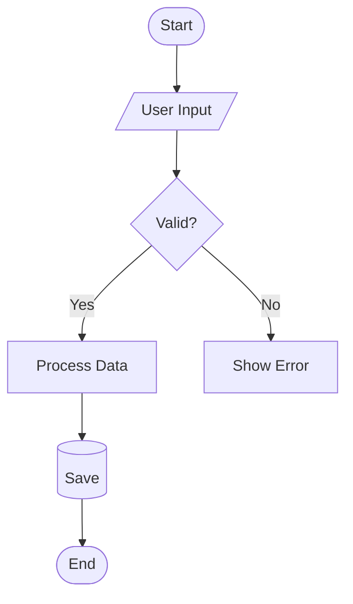
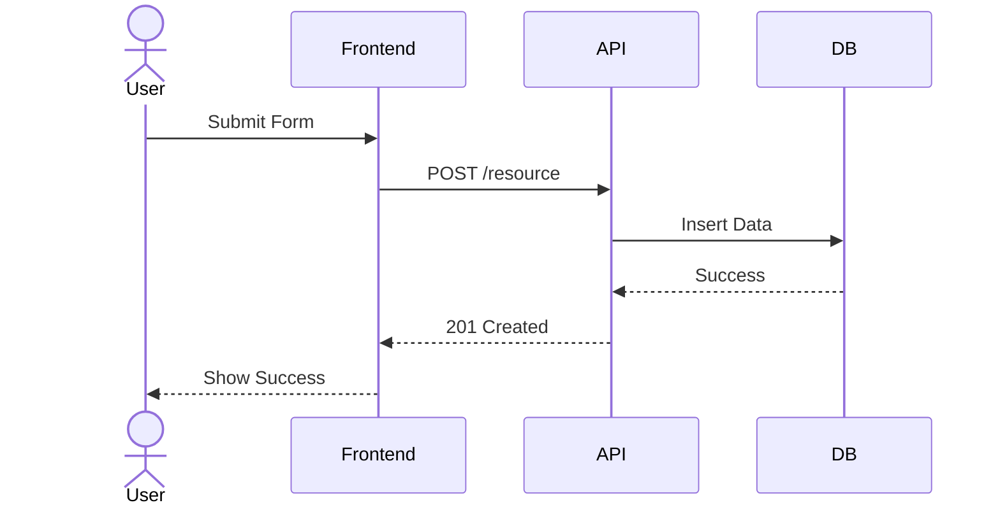
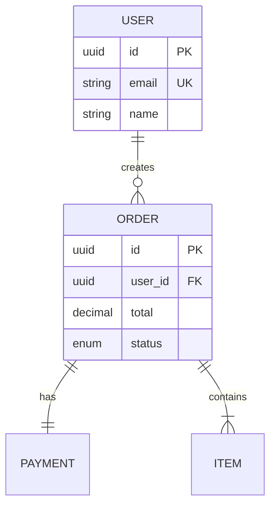
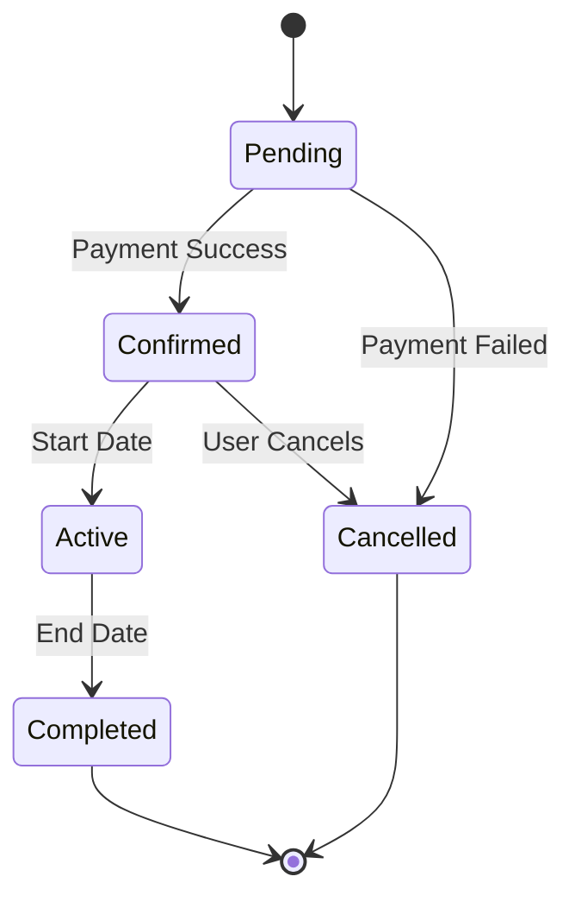
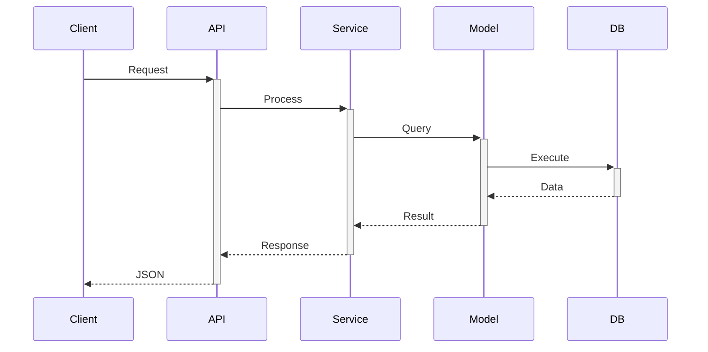
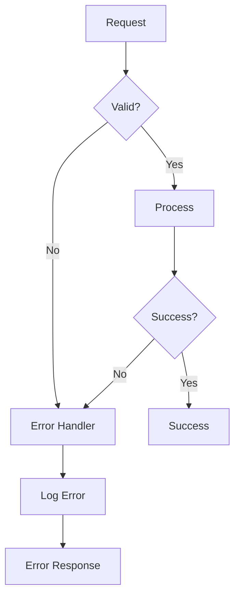
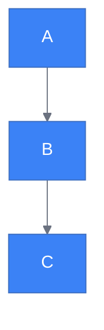
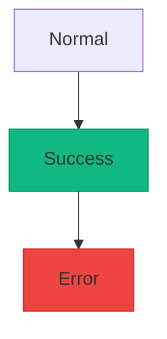

# Mermaid Diagram Specialist

## ⚙️ Configuration

| Setting | Description | Example |
|---------|-------------|---------|
| `diagram_style` | Theme and color scheme | `base`, `dark`, `forest`, `neutral` |
| `primary_color` | Main color for nodes | `#3B82F6` (blue) |
| `default_direction` | Default flow direction | `TD` (top-down), `LR` (left-right) |
| `max_nodes` | Max nodes per diagram | `20` for readability |
| `line_style` | Connection line style | `solid`, `dotted`, `curved` |

## Purpose

Create technical diagrams using Mermaid syntax for documentation, architecture visualization, and process mapping. Supports flowcharts, sequence diagrams, ERDs, C4 diagrams, state machines, and more.

## Capabilities

- Flowcharts for decision flows and processes
- Sequence diagrams for API interactions
- ERDs for database schemas
- C4 diagrams for architecture levels
- State diagrams for lifecycle visualization
- Class diagrams for object design
- Gantt charts for timelines

## Diagram Types

### Flowchart

**Use for**: Process flows, decision trees, algorithms

**Node shapes**: `[Rectangle]`, `([Rounded])`, `{Diamond}`, `[/Parallelogram/]`, `[(Database)]`

### Sequence Diagram

**Use for**: API flows, message passing, system interactions

### ERD (Entity Relationship)

**Use for**: Database schemas, data models

**Relationships**: `||--||` (one-to-one), `||--o{` (one-to-many), `}o--o{` (many-to-many)

### State Diagram

**Use for**: Lifecycle management, status transitions

## Best Practices

| Practice | Description |
|----------|-------------|
| **Simplicity** | Keep diagrams under configured max nodes |
| **Direction** | Use consistent flow direction per diagram type |
| **Labels** | Clear, descriptive labels for all elements |
| **Grouping** | Use subgraphs to organize related elements |
| **Colors** | Apply theme consistently across diagrams |
| **Testing** | Verify rendering in target markdown viewer |

## Common Patterns

### API Request Flow

### Error Handling

## Styling

Apply theme configuration:

Use class styling:

## Checklist

- [ ] Diagram type appropriate for content
- [ ] All nodes clearly labeled
- [ ] Relationships accurate
- [ ] Theme colors configured
- [ ] Renders correctly in markdown
- [ ] Complexity within limits
- [ ] Direction consistent
