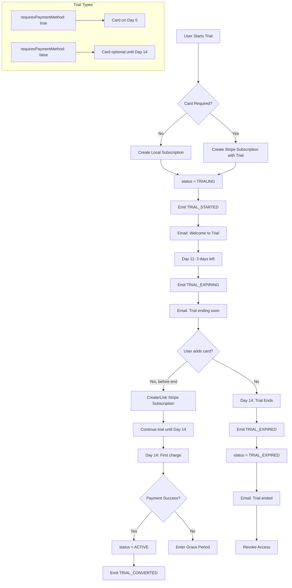
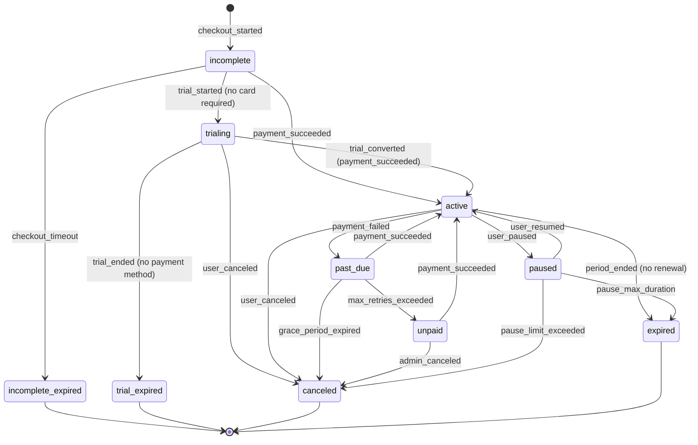
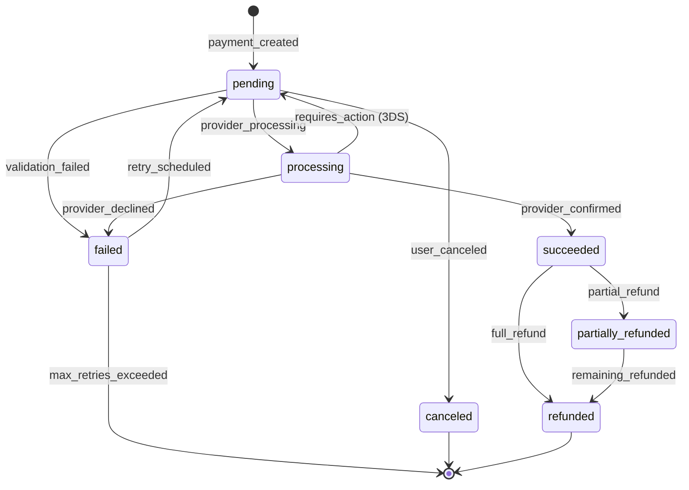
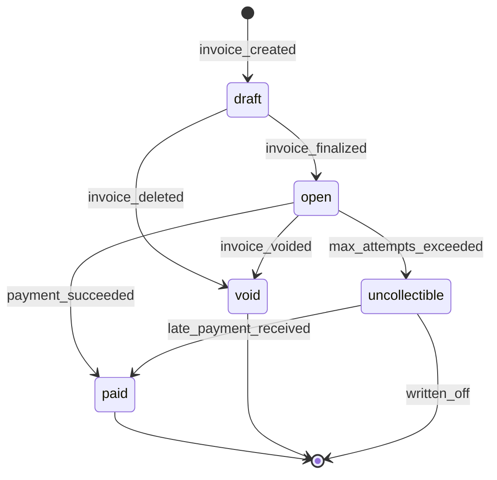
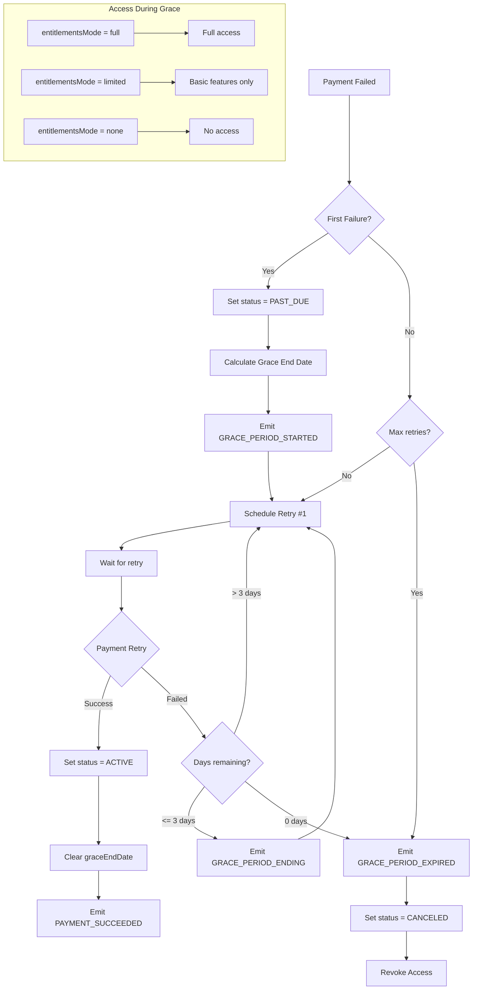
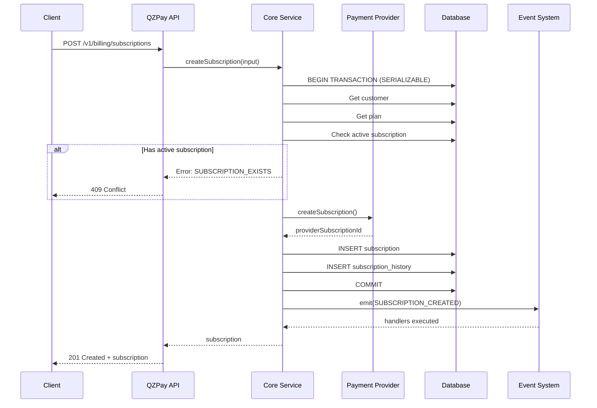
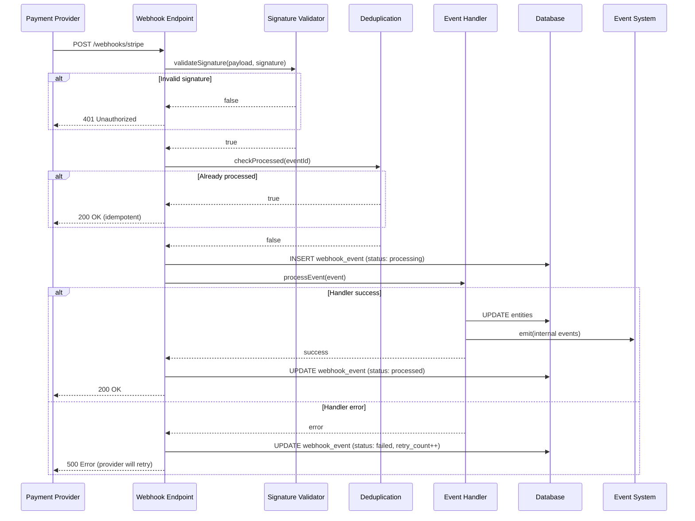
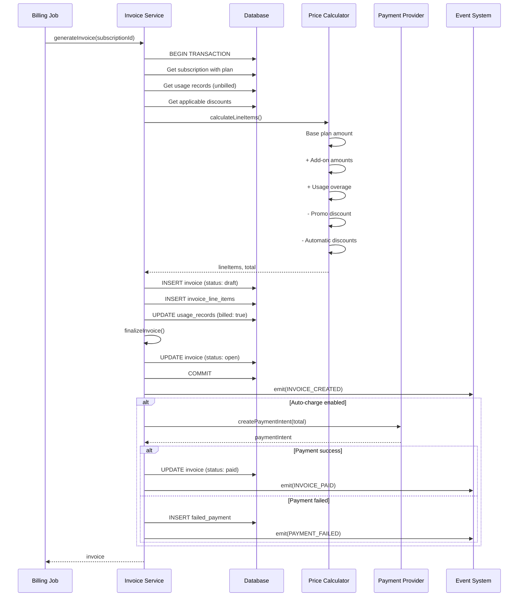
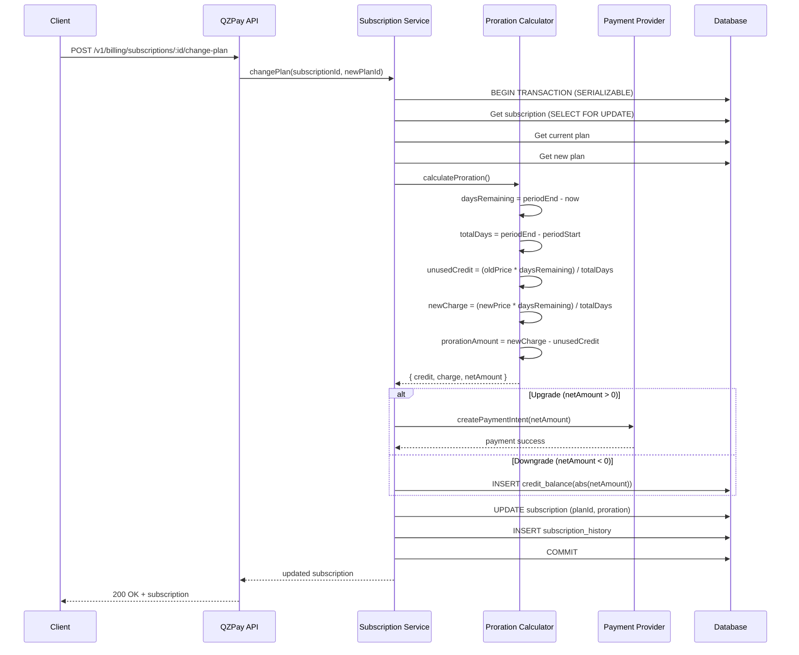
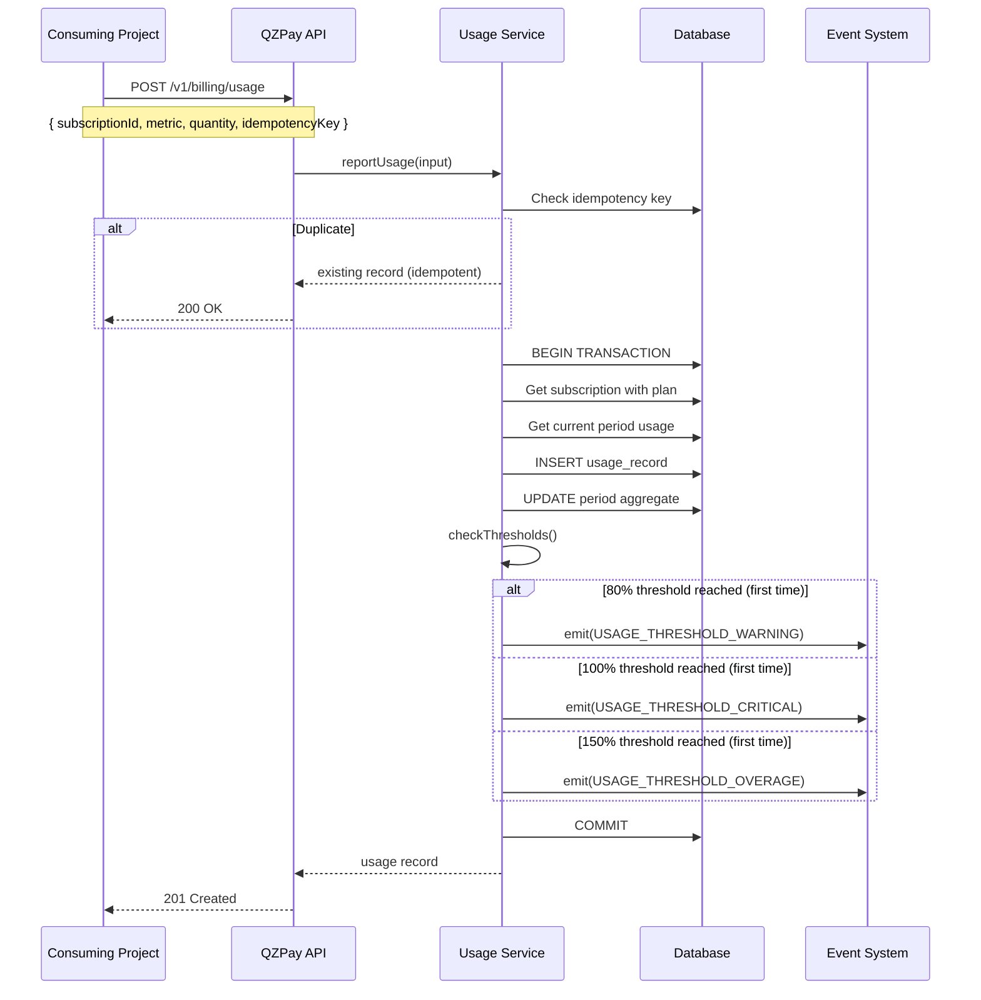

# Technical Architecture

## Overview

@qazuor/qzpay follows a modular, adapter-based architecture that enables maximum flexibility while maintaining a clean, consistent API.

```
┌─────────────────────────────────────────────────────────────────────────┐
│                           Consumer Application                          │
│                    (NestJS, Hono, Express, TanStack, etc.)              │
└───────────────────────────────────┬─────────────────────────────────────┘
                                    │
                    ┌───────────────▼───────────────┐
                    │     Framework Adapter Layer    │
                    │   (Hono, NestJS, Express...)   │
                    └───────────────┬───────────────┘
                                    │
┌───────────────────────────────────▼───────────────────────────────────┐
│                                                                        │
│                        @qazuor/qzpay-core                           │
│                                                                        │
│  ┌────────────────────────────────────────────────────────────────┐   │
│  │                     QZPayBillingSystem                      │   │
│  │  ┌─────────────┐ ┌─────────────┐ ┌─────────────┐ ┌───────────┐ │   │
│  │  │  Customers  │ │Subscriptions│ │  Payments   │ │ Invoices  │ │   │
│  │  └─────────────┘ └─────────────┘ └─────────────┘ └───────────┘ │   │
│  │  ┌─────────────┐ ┌─────────────┐ ┌─────────────┐ ┌───────────┐ │   │
│  │  │ PromoCodes  │ │ Marketplace │ │  Checkout   │ │  Metrics  │ │   │
│  │  └─────────────┘ └─────────────┘ └─────────────┘ └───────────┘ │   │
│  │  ┌─────────────┐ ┌─────────────┐ ┌─────────────┐               │   │
│  │  │    Jobs     │ │   Events    │ │Entitlements │               │   │
│  │  └─────────────┘ └─────────────┘ └─────────────┘               │   │
│  └────────────────────────────────────────────────────────────────┘   │
│                                    │                                   │
│                    ┌───────────────┴───────────────┐                   │
│                    │        Adapter Interfaces      │                   │
│                    └───────────────┬───────────────┘                   │
│                                    │                                   │
└────────────────────────────────────┼───────────────────────────────────┘
                                     │
           ┌─────────────────────────┼─────────────────────────┐
           │                         │                         │
           ▼                         ▼                         ▼
┌─────────────────────┐   ┌─────────────────────┐   ┌─────────────────────┐
│   Payment Adapter   │   │   Storage Adapter   │   │    Email Adapter    │
│  ┌───────────────┐  │   │  ┌───────────────┐  │   │  ┌───────────────┐  │
│  │    Stripe     │  │   │  │    Drizzle    │  │   │  │    Resend     │  │
│  ├───────────────┤  │   │  ├───────────────┤  │   │  ├───────────────┤  │
│  │  MercadoPago  │  │   │  │    Prisma     │  │   │  │   SendGrid    │  │
│  ├───────────────┤  │   │  ├───────────────┤  │   │  ├───────────────┤  │
│  │ BankTransfer  │  │   │  │    Custom     │  │   │  │    Custom     │  │
│  └───────────────┘  │   │  └───────────────┘  │   │  └───────────────┘  │
└─────────────────────┘   └─────────────────────┘   └─────────────────────┘
```

---

## Key Design Decisions

### 1. Exported Constants, Enums, and Types

All comparisons use exported constants to avoid magic strings:

```typescript
// packages/core/src/constants/index.ts
export const QZPaySubscriptionStatus = {
  ACTIVE: 'active',
  TRIALING: 'trialing',
  PAST_DUE: 'past_due',
  CANCELED: 'canceled',
  UNPAID: 'unpaid',
  PAUSED: 'paused',
} as const;

export const QZPayPaymentStatus = {
  PENDING: 'pending',
  PROCESSING: 'processing',
  SUCCEEDED: 'succeeded',
  FAILED: 'failed',
  REFUNDED: 'refunded',
  PARTIALLY_REFUNDED: 'partially_refunded',
} as const;

export const QZPayCheckoutMode = {
  EMBEDDED: 'embedded',
  HOSTED: 'hosted',
} as const;

export const QZPayCurrency = {
  USD: 'USD',
  EUR: 'EUR',
  ARS: 'ARS',
  BRL: 'BRL',
  MXN: 'MXN',
} as const;

export const QZPayBillingInterval = {
  DAY: 'day',
  WEEK: 'week',
  MONTH: 'month',
  YEAR: 'year',
} as const;

// Discount Types - Base constant with shared discount types
export const QZPayDiscountTypeBase = {
  PERCENTAGE: 'percentage',
  FIXED_AMOUNT: 'fixed_amount',
  FREE_PERIOD: 'free_period',
  REDUCED_PERIOD: 'reduced_period',
} as const;

// Promo Code Types - For manual discount codes applied by customers
export const QZPayPromoCodeType = {
  ...QZPayDiscountTypeBase,
  TRIAL_EXTENSION: 'trial_extension',
} as const;

// Automatic Discount Types - For system-applied discounts based on rules
export const QZPayAutomaticDiscountType = {
  ...QZPayDiscountTypeBase,
  VOLUME: 'volume',
  AMOUNT_THRESHOLD: 'amount_threshold',
  FREE_SHIPPING: 'free_shipping',
} as const;

// Unified Discount Type - For generic discount handling (accepts any type)
export const QZPayDiscountType = {
  ...QZPayPromoCodeType,
  ...QZPayAutomaticDiscountType,
} as const;

export const QZPayNotificationMode = {
  PACKAGE_ONLY: 'package_only',
  EVENTS_ONLY: 'events_only',
  HYBRID: 'hybrid',
} as const;

// Proration Behavior - Defines when plan change takes effect
export const QZPayProrationBehavior = {
  /** Apply change immediately with prorated charges/credits */
  IMMEDIATELY: 'immediately',
  /** Apply change at next billing period (no proration) */
  NEXT_PERIOD: 'next_period',
  /** No proration calculation (for free tier or admin overrides) */
  NONE: 'none',
} as const;

// Cancel At - Defines when subscription cancellation takes effect
export const QZPayCancelAt = {
  /** Cancel immediately, access ends now */
  IMMEDIATELY: 'immediately',
  /** Cancel at period end, access continues until then */
  PERIOD_END: 'period_end',
  /** Cancel at trial end, access continues until trial ends (only valid during trial) */
  TRIAL_END: 'trial_end',
} as const;

// Events (for billing.on() and email overrides)
// See PDR.md section 8.2 "Event Master Table" for complete documentation
export const QZPayBillingEvent = {
  // Customer events
  CUSTOMER_CREATED: 'customer.created',
  CUSTOMER_UPDATED: 'customer.updated',
  CUSTOMER_DELETED: 'customer.deleted',
  CUSTOMER_MERGED: 'customer.merged',

  // Subscriptions - General
  SUBSCRIPTION_CREATED: 'subscription.created',
  SUBSCRIPTION_ACTIVATED: 'subscription.activated',
  SUBSCRIPTION_UPDATED: 'subscription.updated',
  SUBSCRIPTION_CANCELED: 'subscription.canceled',
  SUBSCRIPTION_RENEWED: 'subscription.renewed',
  SUBSCRIPTION_AUTO_CANCELLED: 'subscription.auto_cancelled',
  SUBSCRIPTION_PAUSED: 'subscription.paused',
  SUBSCRIPTION_RESUMED: 'subscription.resumed',
  SUBSCRIPTION_EXPIRING: 'subscription.expiring',
  SUBSCRIPTION_EXPIRED: 'subscription.expired',
  QUANTITY_UPDATED: 'subscription.quantity_updated',
  ADDON_ADDED: 'subscription.addon_added',
  ADDON_REMOVED: 'subscription.addon_removed',

  // Subscriptions - Plan Changes (2 events always fired together)
  // When a plan change occurs, PLAN_CHANGED fires ALWAYS, plus ONE of the specific events below.
  // This allows: (1) generic tracking with PLAN_CHANGED, (2) specific handling with UPGRADED/DOWNGRADED/LATERAL
  /**
   * Fired on EVERY plan change (always). Use for generic plan change tracking.
   * Always accompanied by one of: UPGRADED, DOWNGRADED, or PLAN_LATERAL.
   */
  PLAN_CHANGED: 'subscription.plan_changed',
  /**
   * Fired when subscription moves to a higher-priced plan.
   * Price comparison based on monthly equivalent (yearly/12 for annual plans).
   * Always fired together with PLAN_CHANGED.
   */
  SUBSCRIPTION_UPGRADED: 'subscription.upgraded',
  /**
   * Fired when subscription moves to a lower-priced plan.
   * Price comparison based on monthly equivalent (yearly/12 for annual plans).
   * Always fired together with PLAN_CHANGED.
   */
  SUBSCRIPTION_DOWNGRADED: 'subscription.downgraded',
  /**
   * Fired when subscription moves to a different plan with same monthly price.
   * Example: switching between plans with different features but same cost.
   * Always fired together with PLAN_CHANGED.
   */
  SUBSCRIPTION_PLAN_LATERAL: 'subscription.plan_lateral',

  // Trials
  TRIAL_STARTED: 'subscription.trial.started',
  TRIAL_EXPIRING: 'subscription.trial.expiring',
  TRIAL_EXPIRED: 'subscription.trial.expired',
  TRIAL_CONVERTED: 'subscription.trial.converted',
  /** Fired when user cancels during trial WITHOUT payment method (immediate cancellation) */
  TRIAL_CANCELED: 'subscription.trial.canceled',

  // Free access
  FREE_ACCESS_GRANTED: 'subscription.free_access.granted',
  FREE_ACCESS_REVOKED: 'subscription.free_access.revoked',
  FREE_ACCESS_EXPIRING: 'subscription.free_access.expiring',

  // Usage events (hybrid architecture)
  // Real-time tracking is project's responsibility. These fire when project reports usage.
  /** Fired when project reports usage via billing.usage.report() */
  USAGE_REPORTED: 'usage.reported',
  /** Fired when reported usage reaches warning threshold (default 80%) */
  USAGE_THRESHOLD_WARNING: 'usage.threshold.warning',
  /** Fired when reported usage reaches critical threshold (default 100%) */
  USAGE_THRESHOLD_CRITICAL: 'usage.threshold.critical',
  /** Fired when reported usage reaches overage threshold (default 150%) */
  USAGE_THRESHOLD_OVERAGE: 'usage.threshold.overage',
  /** Fired when usage counters reset for new billing period */
  USAGE_PERIOD_RESET: 'usage.period.reset',
  /** Fired when overage charges are calculated at period end */
  USAGE_OVERAGE_CALCULATED: 'usage.overage.calculated',
  /** Fired when overage charges are successfully billed */
  USAGE_OVERAGE_BILLED: 'usage.overage.billed',

  // Payments
  PAYMENT_PENDING: 'payment.pending',
  PAYMENT_PROCESSING: 'payment.processing',
  PAYMENT_SUCCEEDED: 'payment.succeeded',
  PAYMENT_FAILED: 'payment.failed',
  PAYMENT_REFUNDED: 'payment.refunded',
  PAYMENT_PARTIALLY_REFUNDED: 'payment.partially_refunded',
  PAYMENT_DISPUTED: 'payment.disputed',
  PAYMENT_REQUIRES_ACTION: 'payment.requires_action',
  PAYMENT_RETRY_SCHEDULED: 'payment.retry_scheduled',

  // Invoices
  INVOICE_CREATED: 'invoice.created',
  INVOICE_PAID: 'invoice.paid',
  INVOICE_PAYMENT_FAILED: 'invoice.payment_failed',
  INVOICE_OVERDUE: 'invoice.overdue',
  INVOICE_VOIDED: 'invoice.voided',

  // Grace period
  GRACE_PERIOD_STARTED: 'subscription.grace_period.started',
  GRACE_PERIOD_ENDING: 'subscription.grace_period.ending',
  GRACE_PERIOD_EXPIRED: 'subscription.grace_period.expired',

  // Usage & Metering (see PDR.md:13977-13992 for naming clarification)
  // USAGE_THRESHOLD_* events are for usage-based BILLING thresholds (80%, 100%, 150%)
  USAGE_THRESHOLD_WARNING: 'usage.threshold.warning',   // 80% of included
  USAGE_THRESHOLD_CRITICAL: 'usage.threshold.critical', // 100% of included
  USAGE_THRESHOLD_OVERAGE: 'usage.threshold.overage',   // 150% of included
  USAGE_REPORTED: 'usage.reported',
  USAGE_PERIOD_RESET: 'usage.period.reset',
  USAGE_OVERAGE_CALCULATED: 'usage.overage.calculated',
  USAGE_OVERAGE_BILLED: 'usage.overage.billed',

  // Entitlement and Limit Events (hybrid architecture - project provides counts)
  /** Fired when checkLimit() returns allowed: false */
  LIMIT_CHECK_FAILED: 'limit.check.failed',
  /** Fired when overage is detected during plan change (downgrade) */
  LIMIT_OVERAGE_DETECTED: 'limit.overage.detected',
  /** Fired when grace period starts for limit overage */
  LIMIT_OVERAGE_GRACE_STARTED: 'limit.overage.grace_started',
  /** Fired during grace period as reminder */
  LIMIT_OVERAGE_REMINDER: 'limit.overage.reminder',
  /** Fired when user resolves overage manually (before enforcement) */
  LIMIT_OVERAGE_RESOLVED: 'limit.overage.resolved',
  /** Fired when grace period ends and enforcement is applied */
  LIMIT_OVERAGE_ENFORCED: 'limit.overage.enforced',
  /** Fired when entitlement check returns false (optional, for audit) */
  ENTITLEMENT_CHECK_DENIED: 'entitlement.check.denied',

  // Promo codes
  PROMO_CODE_APPLIED: 'promo_code.applied',
  PROMO_CODE_EXPIRED: 'promo_code.expired',
  PROMO_CODE_LIMIT_REACHED: 'promo_code.limit_reached',
  PROMO_CODE_CREATED: 'promo_code.created',

  // Automatic discounts (rule-based discounts that apply automatically)
  /** Fired when an admin creates a new automatic discount rule */
  AUTOMATIC_DISCOUNT_CREATED: 'automatic_discount.created',
  /** Fired when an automatic discount is successfully applied to a purchase */
  AUTOMATIC_DISCOUNT_APPLIED: 'automatic_discount.applied',
  /** Fired when an automatic discount was evaluated but conditions not met */
  AUTOMATIC_DISCOUNT_EVALUATED: 'automatic_discount.evaluated',
  /** Fired when an admin updates an automatic discount rule */
  AUTOMATIC_DISCOUNT_UPDATED: 'automatic_discount.updated',
  /** Fired when an automatic discount is deactivated (manually or expired) */
  AUTOMATIC_DISCOUNT_DEACTIVATED: 'automatic_discount.deactivated',
  /** Fired when multiple discounts conflict due to stacking rules */
  DISCOUNT_STACKING_CONFLICT: 'discount.stacking_conflict',

  // Customer discounts (permanent discounts assigned to specific customers)
  CUSTOMER_DISCOUNT_SET: 'customer.discount_set',
  CUSTOMER_DISCOUNT_REMOVED: 'customer.discount_removed',

  // Card/Payment methods
  CARD_EXPIRING: 'payment_method.card_expiring',
  CARD_EXPIRED: 'payment_method.card_expired',
  PAYMENT_METHOD_ADDED: 'payment_method.added',
  PAYMENT_METHOD_REMOVED: 'payment_method.removed',
  PAYMENT_METHOD_DEFAULT_CHANGED: 'payment_method.default_changed',

  // Bank transfers
  BANK_TRANSFER_PENDING: 'bank_transfer.pending',
  BANK_TRANSFER_REMINDER: 'bank_transfer.reminder',
  BANK_TRANSFER_VALIDATED: 'bank_transfer.validated',
  BANK_TRANSFER_EXPIRED: 'bank_transfer.expired',

  // Checkout
  CHECKOUT_STARTED: 'checkout.started',
  CHECKOUT_COMPLETED: 'checkout.completed',
  CHECKOUT_ABANDONED: 'checkout.abandoned',
  CHECKOUT_EXPIRED: 'checkout.expired',

  // Marketplace - Vendor lifecycle
  VENDOR_CREATED: 'marketplace.vendor.created',
  VENDOR_ONBOARDING_STARTED: 'marketplace.vendor.onboarding_started',
  VENDOR_ONBOARDING_COMPLETED: 'marketplace.vendor.onboarding_completed',
  VENDOR_ONBOARDING_FAILED: 'marketplace.vendor.onboarding_failed',
  VENDOR_PAYOUT_CREATED: 'marketplace.payout.created',
  VENDOR_PAYOUT_PAID: 'marketplace.payout.paid',
  VENDOR_PAYOUT_FAILED: 'marketplace.payout.failed',
  SPLIT_PAYMENT_COMPLETED: 'marketplace.split_payment.completed',

  // Marketplace - Vendor commission
  VENDOR_COMMISSION_CHANGED: 'marketplace.vendor.commission_changed',
  VENDOR_COMMISSION_SCHEDULED: 'marketplace.vendor.commission_scheduled',
  VENDOR_REFUND_PROCESSED: 'marketplace.vendor.refund_processed',
  VENDOR_TIER_UPGRADED: 'marketplace.vendor.tier_upgraded',
  VENDOR_TIER_DOWNGRADED: 'marketplace.vendor.tier_downgraded',
  VENDOR_BALANCE_NEGATIVE: 'marketplace.vendor.balance_negative',

  // Webhooks
  WEBHOOK_RECEIVED: 'webhook.received',
  WEBHOOK_PROCESSED: 'webhook.processed',
  WEBHOOK_FAILED: 'webhook.failed',
  WEBHOOK_SIGNATURE_INVALID: 'webhook.signature_invalid',
  WEBHOOK_ENTITY_NOT_FOUND: 'webhook.entity_not_found',
  WEBHOOK_REPLAYED: 'webhook.replayed',
  WEBHOOK_REPLAY_FAILED: 'webhook.replay_failed',

  // Jobs
  JOB_STARTED: 'job.started',
  JOB_COMPLETED: 'job.completed',
  JOB_FAILED: 'job.failed',

  // Security & Fraud
  FRAUD_DETECTED: 'security.fraud_detected',
  FRAUD_REVIEW_REQUIRED: 'security.fraud_review_required',
  FRAUD_CLEARED: 'security.fraud_cleared',
  RATE_LIMIT_EXCEEDED: 'security.rate_limit_exceeded',

  // Infrastructure
  CIRCUIT_BREAKER_OPENED: 'infrastructure.circuit_breaker_opened',
  CIRCUIT_BREAKER_CLOSED: 'infrastructure.circuit_breaker_closed',
  CIRCUIT_BREAKER_HALF_OPEN: 'infrastructure.circuit_breaker_half_open',
  EMAIL_SEND_FAILED: 'infrastructure.email_send_failed',
  PROVIDER_ERROR: 'infrastructure.provider_error',
} as const;

// TypeScript types derived from constants
export type QZPaySubscriptionStatusType = typeof QZPaySubscriptionStatus[keyof typeof QZPaySubscriptionStatus];
export type QZPayPaymentStatusType = typeof QZPayPaymentStatus[keyof typeof QZPayPaymentStatus];
export type QZPayBillingEventType = typeof QZPayBillingEvent[keyof typeof QZPayBillingEvent];
export type QZPayBillingIntervalType = typeof QZPayBillingInterval[keyof typeof QZPayBillingInterval];
export type QZPayCheckoutModeType = typeof QZPayCheckoutMode[keyof typeof QZPayCheckoutMode];
export type QZPayCurrencyType = typeof QZPayCurrency[keyof typeof QZPayCurrency];
export type QZPayDiscountTypeBaseType = typeof QZPayDiscountTypeBase[keyof typeof QZPayDiscountTypeBase];
export type QZPayPromoCodeTypeType = typeof QZPayPromoCodeType[keyof typeof QZPayPromoCodeType];
export type QZPayAutomaticDiscountTypeType = typeof QZPayAutomaticDiscountType[keyof typeof QZPayAutomaticDiscountType];
export type QZPayDiscountTypeType = typeof QZPayDiscountType[keyof typeof QZPayDiscountType];
export type QZPayNotificationModeType = typeof QZPayNotificationMode[keyof typeof QZPayNotificationMode];
export type QZPayProrationBehaviorType = typeof QZPayProrationBehavior[keyof typeof QZPayProrationBehavior];
export type QZPayCancelAtType = typeof QZPayCancelAt[keyof typeof QZPayCancelAt];
```

**Usage in projects:**

```typescript
import {
  QZPaySubscriptionStatus,
  QZPayBillingEvent,
  QZPayCurrency,
  QZPayCheckoutMode,
} from '@qazuor/qzpay-core';

// Configuration
const billing = new createQZPayBilling({
  currency: { base: QZPayCurrency.USD },
  checkout: { mode: QZPayCheckoutMode.EMBEDDED },
  // ...
});

// Event handlers
billing.on(QZPayBillingEvent.SUBSCRIPTION_CREATED, async (event) => {
  // ...
});

billing.on(QZPayBillingEvent.TRIAL_EXPIRED, async (event) => {
  // ...
});

// Status comparisons (NEVER use strings directly)
if (subscription.status === QZPaySubscriptionStatus.ACTIVE) {
  // ...
}
```

---

### 2. Entitlements and Limits System

Separate boolean features (entitlements) from numeric limits:

```typescript
// packages/core/src/types/entitlements.types.ts

/**
 * QZPayEntitlements are boolean features that a plan grants access to
 */
export interface QZPayEntitlements {
  // Feature access (boolean)
  canAccessAnalytics: boolean;
  canAccessPrioritySupport: boolean;
  canAccessApi: boolean;
  canExportData: boolean;
  canUseCustomBranding: boolean;
  canInviteTeamMembers: boolean;
  canUseIntegrations: boolean;
  // Add project-specific entitlements
  [key: string]: boolean;
}

/**
 * QZPayLimits are numeric restrictions within the plan
 * -1 means unlimited
 */
export interface QZPayLimits {
  // Numeric limits
  maxProperties: number;        // HOSPEDA
  maxPhotosPerProperty: number; // HOSPEDA
  maxBots: number;              // Asist.IA
  maxMessagesPerMonth: number;  // Asist.IA
  maxProducts: number;          // GEMFolio
  maxStorageMb: number;
  maxTeamMembers: number;
  maxApiRequestsPerDay: number;
  // Add project-specific limits
  [key: string]: number;
}

/**
 * Plan definition with entitlements and limits
 */
export interface QZPayPlanDefinition {
  id: string;
  name: string;
  description: string;

  // Pricing
  prices: {
    [interval in QZPayBillingIntervalType]?: {
      amount: number;
      currency: string;
    };
  };

  // What the plan grants
  entitlements: Partial<QZPayEntitlements>;
  limits: Partial<QZPayLimits>;

  // Usage-based billing (optional)
  // See PDR.md Section 3.2.1 for complete documentation
  usage?: QZPayPlanUsageConfig;

  // Trial configuration (optional)
  trial?: {
    days: number;
    requiresPaymentMethod: boolean; // NEW: false = no card required
  };

  // Metadata
  metadata?: Record<string, unknown>;
}

/**
 * Usage-based billing configuration for a plan.
 * Metrics are strings defined by the consuming project (any string is valid).
 *
 * Architecture: Hybrid approach
 * - Project: Real-time tracking in own storage, limit enforcement
 * - Package: Store reported usage, calculate overages, bill customers
 */
export interface QZPayPlanUsageConfig {
  [metricName: string]: QZPayUsageMetricConfig;
}

export interface QZPayUsageMetricConfig {
  /** Quantity included in base plan price (no additional charge) */
  included: number;

  /** Price in cents per unit of overage */
  overageRate: number;

  /**
   * Unit size for overage calculation.
   * Example: unit=100 means charge per 100 units over limit.
   * Default: 1
   */
  unit?: number;

  /**
   * How to handle limit enforcement (INFORMATIONAL - package does NOT enforce).
   * - 'none': No limit, bill all usage as overage
   * - 'soft': Allow overage, bill at overage rate
   * - 'hard': Project should block when limit reached
   * Default: 'soft'
   */
  limitType?: 'none' | 'soft' | 'hard';

  /** Display name for invoices and UI */
  displayName?: string;
}

/**
 * Usage record reported by consuming project.
 */
export interface QZPayUsageRecord {
  /** Metric name (any string defined by project) */
  metric: string;

  /** Quantity to add to current billing period */
  quantity: number;

  /** When usage occurred (default: now) */
  timestamp?: Date;

  /** Idempotency key to prevent duplicate reports */
  idempotencyKey?: string;
}

/**
 * Usage summary for a metric in a billing period.
 */
export interface QZPayUsageMetricSummary {
  /** Total quantity reported this period */
  quantity: number;

  /** Included quantity from plan (0 if metric not in plan) */
  included: number;

  /** Overage quantity (max(0, quantity - included)) */
  overage: number;

  /** Overage amount in cents */
  overageAmount: number;

  /** Percentage of included used (can exceed 100%) */
  percentUsed: number;
}

/**
 * Usage alert configuration.
 */
export interface QZPayUsageAlertConfig {
  /** Enable usage alerts (default: true) */
  enabled: boolean;

  /** Thresholds as percentages of included amount */
  thresholds: {
    warning?: number;   // Default: 80
    critical?: number;  // Default: 100
    overage?: number;   // Default: 150
  };
}

// ============================================
// LIMIT VALIDATION TYPES (Hybrid Architecture)
// ============================================

/**
 * How to handle limit overages after downgrades.
 */
export const QZPayOverageHandlingMode = {
  /** User has N days to reduce usage (default) */
  GRACE_PERIOD: 'grace_period',
  /** Block new resource creation immediately */
  IMMEDIATE_BLOCK: 'immediate_block',
  /** Allow continued access, show upgrade prompts */
  SOFT_LIMIT: 'soft_limit',
  /** Auto-archive oldest over-limit resources */
  ENFORCE_ARCHIVE: 'enforce_archive',
} as const;

export type QZPayOverageHandlingModeType =
  typeof QZPayOverageHandlingMode[keyof typeof QZPayOverageHandlingMode];

/**
 * Input for checkLimit() method.
 * Project provides current resource count, package compares against plan limit.
 */
export interface QZPayLimitCheckInput {
  /** Subscription ID to check */
  subscriptionId: string;
  /** Limit key to check (e.g., 'maxProjects') */
  limitKey: string;
  /** Current count of resources (provided by project) */
  currentCount: number;
  /** Amount to add (default: 1) */
  increment?: number;
}

/**
 * Result from checkLimit() method.
 */
export interface QZPayLimitCheckResult {
  /** Whether the operation is allowed */
  allowed: boolean;
  /** Current count (echo of input) */
  current: number;
  /** Plan limit value (-1 if unlimited) */
  limit: number;
  /** Remaining capacity (Infinity if unlimited) */
  remaining: number;
  /** Percentage of limit used (0 if unlimited) */
  percentUsed: number;
  /** Reason if not allowed (null if allowed) */
  reason: string | null;
  /** Suggested upgrade plan if blocked (optional) */
  suggestedPlan?: string;
}

/**
 * Input for checkOverage() method.
 */
export interface QZPayOverageCheckInput {
  /** Subscription ID */
  subscriptionId: string;
  /** New plan ID to check against */
  newPlanId?: string;
  /** Current resource counts by limit key */
  currentCounts: Record<string, number>;
}

/**
 * Result from checkOverage() method.
 */
export interface QZPayOverageCheckResult {
  /** Whether any limit is exceeded */
  hasOverage: boolean;
  /** Sum of all overage amounts */
  totalOverage: number;
  /** List of limit keys with overage */
  affectedLimits: string[];
  /** Detailed overage by limit key */
  metrics: Record<string, QZPayOverageMetric>;
}

/**
 * Overage detail for a single limit.
 */
export interface QZPayOverageMetric {
  limitKey: string;
  displayName?: string;
  current: number;
  limit: number;
  overage: number;
  percentOver: number;
}

/**
 * Overage details stored on subscription during grace period.
 */
export interface QZPayOverageDetails {
  detectedAt: Date;
  graceStartedAt?: Date;
  enforcementDate?: Date;
  graceDaysRemaining: number | null;
  affectedLimits: string[];
  metrics: Record<string, QZPayOverageMetric>;
  handlingMode: QZPayOverageHandlingModeType;
}

/**
 * Configuration for overage handling behavior.
 */
export interface QZPayOverageHandlingConfig {
  /** How to handle overage (default: 'grace_period') */
  mode: QZPayOverageHandlingModeType;
  /** Days in grace period (default: 7) */
  gracePeriodDays: number;
  /** Days before enforcement to send reminders (default: [5, 3, 1]) */
  notifyDaysBeforeEnforcement: number[];
  /** Auto-archive oldest resources when enforced (default: false) */
  autoArchiveOldest: boolean;
  /** Block creation while in overage (default: true) */
  blockCreationDuringOverage: boolean;
  /** Emit ENTITLEMENT_CHECK_DENIED events (default: false) */
  emitDeniedEvents?: boolean;
}
```

**Plan definition example:**

```typescript
import { QZPayBillingInterval } from '@qazuor/qzpay-core';

export const HOSPEDA_PLANS: QZPayPlanDefinition[] = [
  {
    id: 'free',
    name: 'Free',
    description: 'Para empezar a explorar',
    prices: {
      [QZPayBillingInterval.MONTH]: { amount: 0, currency: 'USD' },
      [QZPayBillingInterval.YEAR]: { amount: 0, currency: 'USD' },
    },
    entitlements: {
      canAccessAnalytics: false,
      canAccessPrioritySupport: false,
      canExportData: false,
    },
    limits: {
      maxProperties: 1,
      maxPhotosPerProperty: 5,
    },
  },
  {
    id: 'pro',
    name: 'Profesional',
    description: 'Para propietarios serios',
    prices: {
      [QZPayBillingInterval.MONTH]: { amount: 2900, currency: 'USD' },
      [QZPayBillingInterval.YEAR]: { amount: 29000, currency: 'USD' },
    },
    entitlements: {
      canAccessAnalytics: true,
      canAccessPrioritySupport: false,
      canExportData: true,
    },
    limits: {
      maxProperties: 10,
      maxPhotosPerProperty: 20,
    },
    // Usage-based billing (optional)
    // Project tracks usage in real-time, reports to qzpay for billing
    usage: {
      api_requests: {
        included: 10000,
        overageRate: 10,        // $0.10 per 1000 over limit
        unit: 1000,
        limitType: 'soft',
        displayName: 'API Requests',
      },
      email_notifications: {
        included: 100,
        overageRate: 5,         // $0.05 per email over limit
        unit: 1,
        limitType: 'none',
        displayName: 'Email Notifications',
      },
    },
    trial: {
      days: 14,
      requiresPaymentMethod: false, // No card required for trial
    },
  },
];
```

---

### 3. Rich Subscription Object

Subscription objects have helper methods for common operations:

```typescript
// packages/core/src/types/subscription.types.ts

export interface QZPaySubscription {
  // Core data
  id: string;
  customerId: string;
  planId: string;
  status: QZPaySubscriptionStatusType;
  interval: QZPayBillingIntervalType;

  // Dates
  currentPeriodStart: Date;
  currentPeriodEnd: Date;
  trialStart?: Date;
  trialEnd?: Date;
  canceledAt?: Date;
  cancelAt?: Date;

  // Grace period tracking
  graceEndDate: Date | null;
  gracePeriodDays: number;

  // Provider
  provider: string;
  providerSubscriptionId?: string;

  // Promo
  promoCodeId?: string;

  // Metadata
  metadata?: Record<string, unknown>;
  createdAt: Date;
  updatedAt: Date;
}

/**
 * Extended subscription with helper methods
 * Returned by billing.subscriptions.get() and similar methods
 */
export interface QZPaySubscriptionWithHelpers extends QZPaySubscription {
  // Plan reference
  plan: QZPayPlanDefinition;

  // Status helpers
  isActive(): boolean;
  isTrial(): boolean;
  isPastDue(): boolean;
  isCanceled(): boolean;
  isInGracePeriod(): boolean;

  // Feature helpers
  hasAccess(): boolean;  // true if user should have access to features
  getEntitlements<T extends QZPayEntitlements = QZPayEntitlements>(): T;
  getLimits<T extends QZPayLimits = QZPayLimits>(): T;
  hasEntitlement(key: string): boolean;
  getLimit(key: string): number;

  // Limit validation helpers (hybrid architecture - project provides counts)
  /**
   * Check if an operation is allowed based on plan limit.
   * Project provides current count, helper compares against plan.
   */
  checkLimit(input: {
    limitKey: string;
    currentCount: number;
    increment?: number;
  }): QZPayLimitCheckResult;

  /**
   * Check for overage against a target plan.
   * Used before downgrades to show impact.
   */
  checkOverage(input: {
    newPlanId?: string;
    currentCounts: Record<string, number>;
  }): QZPayOverageCheckResult;

  // Overage state helpers (for subscriptions in overage)
  /** Whether subscription has unresolved limit overage */
  hasOverage(): boolean;
  /** Get overage details if in overage state */
  getOverageDetails(): QZPayOverageDetails | null;
  /** Whether in grace period for limit overage */
  isInOverageGracePeriod(): boolean;
  /** Days remaining in overage grace period */
  getOverageGraceDaysRemaining(): number | null;

  // Plan helpers
  getPlan(): QZPayPlanDefinition;
  getPlanId(): string;
  getPlanName(): string;

  // Date helpers
  getDaysRemaining(): number;
  getTrialDaysRemaining(): number | null;
  getGracePeriodDaysRemaining(): number | null;
  willRenew(): boolean;

  // Payment method (pre-calculated properties, not methods)
  /** Whether customer has at least one payment method on file */
  hasPaymentMethod: boolean;
  /** Default payment method details (if any) */
  defaultPaymentMethod: QZPayPaymentMethodSummary | null;
}

/** Summary of a payment method for display purposes */
interface QZPayPaymentMethodSummary {
  id: string;
  type: 'card' | 'bank_account' | 'other';
  lastFour?: string;
  brand?: string;
  expiresAt?: Date;
}
```

**Implementation:**

```typescript
// packages/core/src/services/subscription.service.ts

export class QZPaySubscriptionService {
  async get(id: string): Promise<QZPaySubscriptionWithHelpers> {
    const subscription = await this.storage.subscriptions.findById(id);
    if (!subscription) {
      throw new QZPaySubscriptionNotFoundError(id);
    }
    return this.enrichSubscription(subscription);
  }

  async getActiveByCustomerExternalId(externalId: string): Promise<QZPaySubscriptionWithHelpers | null> {
    const customer = await this.storage.customers.findByExternalId(externalId);
    if (!customer) return null;

    const subscription = await this.storage.subscriptions.findActiveByCustomer(customer.id);
    if (!subscription) return null;

    return this.enrichSubscription(subscription);
  }

  private async enrichSubscription(subscription: QZPaySubscription): Promise<QZPaySubscriptionWithHelpers> {
    const plan = this.plans.find(p => p.id === subscription.planId);
    if (!plan) {
      throw new Error(`Plan not found: ${subscription.planId}`);
    }

    const now = new Date();

    // Pre-fetch payment methods for hasPaymentMethod property
    const paymentMethods = await this.storage.paymentMethods.findByCustomer(subscription.customerId);
    const defaultMethod = paymentMethods.find(m => m.isDefault) || paymentMethods[0] || null;

    return {
      ...subscription,
      plan,

      // Pre-calculated payment method properties (not methods)
      hasPaymentMethod: paymentMethods.length > 0,
      defaultPaymentMethod: defaultMethod ? {
        id: defaultMethod.id,
        type: defaultMethod.type,
        lastFour: defaultMethod.lastFour,
        brand: defaultMethod.brand,
        expiresAt: defaultMethod.expiresAt,
      } : null,

      isActive() {
        return this.status === QZPaySubscriptionStatus.ACTIVE;
      },

      isTrial() {
        return this.status === QZPaySubscriptionStatus.TRIALING;
      },

      isPastDue() {
        return this.status === QZPaySubscriptionStatus.PAST_DUE;
      },

      isCanceled() {
        return this.status === QZPaySubscriptionStatus.CANCELED;
      },

      isInGracePeriod() {
        if (this.status !== QZPaySubscriptionStatus.PAST_DUE) return false;
        if (!this.graceEndDate) return false;
        return now < this.graceEndDate;
      },

      hasAccess() {
        // User has access if: active, trialing, or in grace period
        return (
          this.status === QZPaySubscriptionStatus.ACTIVE ||
          this.status === QZPaySubscriptionStatus.TRIALING ||
          this.isInGracePeriod()
        );
      },

      getEntitlements() {
        return plan.entitlements as QZPayEntitlements;
      },

      getLimits() {
        return plan.limits as QZPayLimits;
      },

      hasEntitlement(key: string) {
        return plan.entitlements?.[key] === true;
      },

      getLimit(key: string) {
        return plan.limits?.[key] ?? 0;
      },

      /**
       * Check if an operation is allowed based on plan limit.
       * Project provides current count, helper compares against plan.
       */
      checkLimit(input: { limitKey: string; currentCount: number; increment?: number }) {
        const { limitKey, currentCount, increment = 1 } = input;
        const limit = plan.limits?.[limitKey] ?? 0;

        // -1 means unlimited
        if (limit === -1) {
          return {
            allowed: true,
            current: currentCount,
            limit: -1,
            remaining: Infinity,
            percentUsed: 0,
            reason: null,
          };
        }

        const newTotal = currentCount + increment;
        const allowed = newTotal <= limit;
        const remaining = Math.max(0, limit - currentCount);
        const percentUsed = limit > 0 ? Math.round((currentCount / limit) * 100) : 0;

        return {
          allowed,
          current: currentCount,
          limit,
          remaining,
          percentUsed,
          reason: allowed ? null : `${limitKey} limit reached. Upgrade to create more.`,
        };
      },

      /**
       * Check for overage against a target plan.
       * Used before downgrades to show impact.
       */
      checkOverage(input: { newPlanId?: string; currentCounts: Record<string, number> }) {
        const { newPlanId, currentCounts } = input;
        // If newPlanId provided, look up that plan. Otherwise use current.
        const targetPlan = newPlanId
          ? this.plans?.find(p => p.id === newPlanId) ?? plan
          : plan;
        const targetLimits = targetPlan.limits ?? {};

        const metrics: Record<string, QZPayOverageMetric> = {};
        const affectedLimits: string[] = [];
        let totalOverage = 0;

        for (const [key, current] of Object.entries(currentCounts)) {
          const limit = targetLimits[key] ?? 0;
          // -1 means unlimited, so no overage
          if (limit === -1) {
            metrics[key] = {
              limitKey: key,
              current,
              limit: -1,
              overage: 0,
              percentOver: 0,
            };
            continue;
          }

          const overage = Math.max(0, current - limit);
          const percentOver = limit > 0 ? Math.round((overage / limit) * 100) : 0;

          metrics[key] = {
            limitKey: key,
            current,
            limit,
            overage,
            percentOver,
          };

          if (overage > 0) {
            affectedLimits.push(key);
            totalOverage += overage;
          }
        }

        return {
          hasOverage: affectedLimits.length > 0,
          totalOverage,
          affectedLimits,
          metrics,
        };
      },

      // Overage state helpers
      hasOverage() {
        return !!this.overageDetails;
      },

      getOverageDetails() {
        return this.overageDetails ?? null;
      },

      isInOverageGracePeriod() {
        if (!this.overageDetails?.graceStartedAt) return false;
        if (!this.overageDetails?.enforcementDate) return false;
        return now < this.overageDetails.enforcementDate;
      },

      getOverageGraceDaysRemaining() {
        if (!this.isInOverageGracePeriod() || !this.overageDetails?.enforcementDate) {
          return null;
        }
        return Math.max(0, differenceInDays(this.overageDetails.enforcementDate, now));
      },

      getPlan() {
        return plan;
      },

      getPlanId() {
        return plan.id;
      },

      getPlanName() {
        return plan.name;
      },

      getDaysRemaining() {
        return Math.max(0, differenceInDays(this.currentPeriodEnd, now));
      },

      getTrialDaysRemaining() {
        if (!this.trialEnd || this.status !== QZPaySubscriptionStatus.TRIALING) {
          return null;
        }
        return Math.max(0, differenceInDays(this.trialEnd, now));
      },

      getGracePeriodDaysRemaining() {
        if (!this.isInGracePeriod() || !this.graceEndDate) {
          return null;
        }
        return Math.max(0, differenceInDays(this.graceEndDate, now));
      },

      willRenew() {
        return !this.cancelAt && this.status === QZPaySubscriptionStatus.ACTIVE;
      },

      // Note: hasPaymentMethod is a pre-calculated property, not a method
      // It's set during enrichSubscription() to avoid async issues
    };
  }
}
```

**Usage in projects:**

```typescript
// Simple, clean API
const subscription = await billing.subscriptions.getActiveByCustomerExternalId(userId);

if (!subscription) {
  // No subscription = free tier
  return FREE_PLAN_LIMITS;
}

// Use helper methods instead of manual comparisons
if (subscription.hasAccess()) {
  const limits = subscription.getLimits();
  const entitlements = subscription.getEntitlements();

  // OLD WAY: Check limits manually (still works)
  if (limits.maxProperties !== -1 && userProperties.length >= limits.maxProperties) {
    throw new Error('Property limit reached');
  }

  // NEW WAY: Use checkLimit helper (recommended)
  // Project provides current count, helper compares against plan
  const currentPropertyCount = await db.properties.countByUserId(userId);
  const limitCheck = subscription.checkLimit({
    limitKey: 'maxProperties',
    currentCount: currentPropertyCount,
    increment: 1,
  });

  if (!limitCheck.allowed) {
    throw new QZPayLimitExceededError('maxProperties', limitCheck.current, limitCheck.limit);
    // Or show a friendly message:
    // throw new Error(limitCheck.reason); // "maxProperties limit reached. Upgrade to create more."
  }

  // Check entitlements
  if (!entitlements.canAccessAnalytics) {
    throw new Error('Analytics not available on your plan');
  }

  // Or use hasEntitlement helper
  if (!subscription.hasEntitlement('canAccessAnalytics')) {
    throw new Error('Analytics not available on your plan');
  }
}

// Trial info
if (subscription.isTrial()) {
  const daysLeft = subscription.getTrialDaysRemaining();
  console.log(`Trial ends in ${daysLeft} days`);
}

// Check for overage before downgrade
const overage = subscription.checkOverage({
  newPlanId: 'starter',
  currentCounts: {
    maxProperties: await db.properties.countByUserId(userId),
    maxTeamMembers: await db.teamMembers.countByUserId(userId),
  },
});

if (overage.hasOverage) {
  console.log(`Downgrade will affect: ${overage.affectedLimits.join(', ')}`);
  console.log(`Total resources over limit: ${overage.totalOverage}`);
}

// Check overage state (for subscriptions that have downgraded)
if (subscription.hasOverage()) {
  const details = subscription.getOverageDetails();
  console.log(`In overage grace period, ${details?.graceDaysRemaining} days remaining`);
}
```

---

### 4. Subscription Pause/Resume

Subscriptions can be paused temporarily without cancellation, preserving the customer's data and preferences.

```typescript
// packages/core/src/types/subscription.types.ts

export interface QZPaySubscription {
  // ... existing fields ...

  // Pause state
  pausedAt?: Date;
  pauseUntil?: Date;
  pauseReason?: string;
  pauseRetainAccess?: boolean;
}

// Plan configuration for pause
export interface QZPayPlanDefinition {
  // ... existing fields ...

  pause?: {
    allowed: boolean;
    maxPauseDays: number;           // Maximum pause duration
    maxPausesPerYear: number;       // Limit pauses to prevent abuse
    retainAccessWhilePaused: boolean; // Read-only access during pause
    cooldownDays: number;           // Days between pauses
  };
}

// packages/core/src/services/subscription.service.ts

export class QZPaySubscriptionService {
  /**
   * Pause a subscription temporarily
   */
  async pause(
    subscriptionId: string,
    options: {
      pauseUntil?: Date;
      reason?: string;
      retainAccess?: boolean;
    },
  ): Promise<QZPaySubscription> {
    const subscription = await this.storage.subscriptions.get(subscriptionId);
    const plan = await this.storage.plans.get(subscription.planId);

    // Validate pause is allowed
    if (!plan.pause?.allowed) {
      throw new QZPayPauseNotAllowedError(subscription.planId);
    }

    // Validate not already paused
    if (subscription.status === QZPaySubscriptionStatus.PAUSED) {
      throw new QZPayAlreadyPausedError(subscriptionId);
    }

    // Validate pause duration
    const pauseDuration = options.pauseUntil
      ? differenceInDays(options.pauseUntil, new Date())
      : plan.pause.maxPauseDays;

    if (pauseDuration > plan.pause.maxPauseDays) {
      throw new QZPayPauseTooLongError(pauseDuration, plan.pause.maxPauseDays);
    }

    // Check cooldown period
    if (subscription.lastPauseEndedAt) {
      const daysSinceLastPause = differenceInDays(
        new Date(),
        subscription.lastPauseEndedAt,
      );
      if (daysSinceLastPause < plan.pause.cooldownDays) {
        throw new QZPayPauseCooldownError(
          plan.pause.cooldownDays - daysSinceLastPause,
        );
      }
    }

    // Check annual pause limit
    const pausesThisYear = await this.storage.subscriptions.countPausesInYear(
      subscriptionId,
      new Date().getFullYear(),
    );
    if (pausesThisYear >= plan.pause.maxPausesPerYear) {
      throw new QZPayPauseLimitExceededError(plan.pause.maxPausesPerYear);
    }

    // Pause the subscription
    const pauseUntil = options.pauseUntil ??
      addDays(new Date(), plan.pause.maxPauseDays);

    const updated = await this.storage.subscriptions.update(
      subscriptionId,
      {
        status: QZPaySubscriptionStatus.PAUSED,
        pausedAt: new Date(),
        pauseUntil,
        pauseReason: options.reason,
        pauseRetainAccess: options.retainAccess ?? plan.pause.retainAccessWhilePaused,
      },
      subscription.version,
    );

    // Pause provider subscription (stops billing)
    await this.provider.pauseSubscription(subscription.providerSubscriptionId);

    // Emit event
    this.events.emit(QZPayBillingEvent.SUBSCRIPTION_PAUSED, {
      subscription: updated,
      pauseUntil,
      reason: options.reason,
    });

    return updated;
  }

  /**
   * Resume a paused subscription
   */
  async resume(
    subscriptionId: string,
    options?: {
      backfillPeriod?: boolean; // Charge for paused period
    },
  ): Promise<QZPaySubscription> {
    const subscription = await this.storage.subscriptions.get(subscriptionId);

    if (subscription.status !== QZPaySubscriptionStatus.PAUSED) {
      throw new QZPayNotPausedError(subscriptionId);
    }

    // Calculate new period dates
    const now = new Date();
    const pauseDuration = differenceInDays(now, subscription.pausedAt!);
    const newPeriodEnd = options?.backfillPeriod
      ? subscription.currentPeriodEnd
      : addDays(subscription.currentPeriodEnd, pauseDuration);

    const updated = await this.storage.subscriptions.update(
      subscriptionId,
      {
        status: QZPaySubscriptionStatus.ACTIVE,
        pausedAt: null,
        pauseUntil: null,
        pauseReason: null,
        pauseRetainAccess: null,
        currentPeriodEnd: newPeriodEnd,
        lastPauseEndedAt: now,
      },
      subscription.version,
    );

    // Resume provider subscription
    await this.provider.resumeSubscription(subscription.providerSubscriptionId);

    // Emit event
    this.events.emit(QZPayBillingEvent.SUBSCRIPTION_RESUMED, {
      subscription: updated,
      pauseDurationDays: pauseDuration,
    });

    return updated;
  }
}

// Helper methods
export interface QZPaySubscriptionWithHelpers extends QZPaySubscription {
  // ... existing helpers ...

  isPaused(): boolean;
  canPause(): boolean;
  getPauseDaysRemaining(): number | null;
}
```

---

### 5. Sandbox/Test Mode

The system supports a complete sandbox mode for development and testing without affecting production data.

```typescript
// packages/core/src/types/config.types.ts

export interface QZPayBillingConfig {
  // ... existing fields ...

  /**
   * Environment mode
   * - 'production': Live mode with real transactions
   * - 'test': Sandbox mode with test data
   */
  environment: 'production' | 'test';

  /**
   * Automatic discounts configuration.
   * See PDR Section 3.6.2 for full specification.
   */
  automaticDiscounts?: {
    /**
     * Enable/disable automatic discount evaluation.
     * Default: true
     */
    enabled: boolean;

    /**
     * Strategy for selecting which discount applies when multiple qualify.
     * - 'first_match': First by creation order (default)
     * - 'best_for_customer': Highest savings wins
     * - 'highest_priority': Lowest priority number wins
     */
    selectionStrategy: 'first_match' | 'best_for_customer' | 'highest_priority';
  };

  /**
   * Usage-based billing alerts configuration.
   * See PDR Section 3.2.1 for full specification.
   *
   * Note: Usage tracking is the project's responsibility.
   * Package only handles reported usage for billing.
   */
  usageAlerts?: QZPayUsageAlertConfig;

  /**
   * Entitlements and limits configuration.
   * See PDR Section 3.3 for full specification.
   *
   * Note: Resource counting is the project's responsibility.
   * Package provides validation helpers and overage handling.
   */
  entitlements?: {
    /**
     * How to handle limit overages after downgrades.
     * See PDR FR-ENT-006 for modes: grace_period, immediate_block, soft_limit, enforce_archive
     */
    overageHandling: QZPayOverageHandlingConfig;

    /**
     * Emit ENTITLEMENT_CHECK_DENIED events when hasEntitlement() returns false.
     * Useful for audit logging. Default: false
     */
    emitDeniedEvents?: boolean;
  };

  /**
   * Subscription pause configuration.
   * See PDR Section 3.13 FR-SUB-PAUSE-001 for full specification.
   */
  subscriptions?: {
    pause: QZPayPauseConfig;
  };
}

/**
 * Configuration for subscription pause feature.
 * See PDR Section 10.7 for complete interface.
 */
export interface QZPayPauseConfig {
  /**
   * Whether pause is allowed for subscriptions.
   * @default false
   */
  allowed: boolean;

  /**
   * Maximum duration of a single pause in days.
   * @default 90
   */
  maxDurationDays: number;

  /**
   * Maximum number of pauses allowed per year.
   * @default 1
   */
  maxPausesPerYear: number;

  /**
   * How to calculate "per year" for pause limits.
   * - 'calendar': Resets on January 1st each year
   * - 'rolling': Looks at the last 365 days from today
   * @default 'calendar'
   */
  yearDefinition: 'calendar' | 'rolling';

  /**
   * Whether user retains access during pause.
   * - true: User can still use the product (rare, for goodwill)
   * - false: User loses access but data/configs are preserved
   * @default false
   */
  retainAccessDuringPause: boolean;

  /**
   * Minimum days that must pass between pauses.
   * Prevents abuse of pause/resume cycles.
   * @default 30
   */
  minDaysBetweenPauses: number;

  /**
   * Whether user can resume early before pauseUntil date.
   * @default true
   */
  canResumeEarly: boolean;
}

/**
 * Default pause configuration.
 */
export const QZPayDefaultPauseConfig: QZPayPauseConfig = {
  allowed: false,
  maxDurationDays: 90,
  maxPausesPerYear: 1,
  yearDefinition: 'calendar',
  retainAccessDuringPause: false,
  minDaysBetweenPauses: 30,
  canResumeEarly: true,
};

// All entities include livemode flag
export interface QZPayCustomer {
  // ... existing fields ...
  livemode: boolean; // false in test mode
}

export interface QZPaySubscription {
  // ... existing fields ...
  livemode: boolean;
}

export interface QZPayPayment {
  // ... existing fields ...
  livemode: boolean;
}

// packages/core/src/billing.ts

export function createQZPayBilling(config: QZPayBillingConfig): QZPayBillingSystem {
  const isTestMode = config.environment === 'test';

  return {
    // All operations automatically filter by livemode
    customers: new QZPayCustomerService(storage, { livemode: !isTestMode }),
    subscriptions: new QZPaySubscriptionService(storage, { livemode: !isTestMode }),
    payments: new QZPayPaymentService(storage, { livemode: !isTestMode }),

    // Test utilities (only available in test mode)
    test: isTestMode ? {
      /**
       * Create test data with predictable IDs
       */
      async createCustomer(overrides?: Partial<QZPayCustomer>): Promise<QZPayCustomer> {
        return storage.customers.create({
          id: `cus_test_${crypto.randomUUID().slice(0, 8)}`,
          email: `test+${Date.now()}@example.com`,
          livemode: false,
          ...overrides,
        });
      },

      /**
       * Simulate webhook events
       */
      async simulateWebhook(
        eventType: string,
        payload: unknown,
      ): Promise<void> {
        await webhookService.process({
          id: `evt_test_${Date.now()}`,
          type: eventType,
          data: payload,
          livemode: false,
        });
      },

      /**
       * Clean up test data older than specified days
       */
      async cleanup(options: { olderThanDays: number }): Promise<CleanupResult> {
        const cutoff = subDays(new Date(), options.olderThanDays);

        const [customers, subscriptions, payments] = await Promise.all([
          storage.customers.deleteTestDataBefore(cutoff),
          storage.subscriptions.deleteTestDataBefore(cutoff),
          storage.payments.deleteTestDataBefore(cutoff),
        ]);

        return { customers, subscriptions, payments };
      },

      /**
       * Reset all test data
       */
      async reset(): Promise<void> {
        await storage.transaction(async (tx) => {
          await tx.payments.deleteWhere({ livemode: false });
          await tx.subscriptions.deleteWhere({ livemode: false });
          await tx.customers.deleteWhere({ livemode: false });
        });
      },
    } : undefined,
  };
}
```

**Usage:**

```typescript
// Development/testing
const billing = createQZPayBilling({
  environment: 'test',
  // Uses test API keys from providers
});

// Create test data
const customer = await billing.test!.createCustomer({
  email: 'test@example.com',
});

// Simulate webhook
await billing.test!.simulateWebhook('payment.succeeded', {
  customerId: customer.id,
  amount: 2900,
});

// Clean up old test data (e.g., in CI/CD)
await billing.test!.cleanup({ olderThanDays: 7 });

// Production
const productionBilling = createQZPayBilling({
  environment: 'production',
});
// billing.test is undefined in production
```

---

### 5.1. Usage-Based Billing API

Usage-based billing uses a **hybrid architecture** where the consuming project handles real-time tracking, and the package handles billing. See PDR.md Section 3.2.1 for complete specification.

#### 5.1.1 Hybrid Architecture Responsibility Matrix

The following table defines the AUTHORITATIVE responsibility boundary between the consuming project and the qzpay package:

| Operation | Project Responsibility | Package Responsibility |
|-----------|------------------------|------------------------|
| **Real-time Usage Tracking** | ✅ Track every usage event in own storage | ❌ Does not track individual events |
| **Counter Storage** | ✅ Redis/DB counters for fast access | ❌ Only stores aggregated reports |
| **Hard Limit Enforcement** | ✅ Block requests when limit exceeded | ❌ Does not block, only calculates |
| **Soft Limit Warnings** | ✅ Show UI warnings to users | ⚠️ Emits threshold events only |
| **Usage Reporting** | ✅ Call `billing.usage.report()` periodically | ✅ Receive and store reports |
| **Overage Calculation** | ❌ Does not calculate overages | ✅ Calculate at billing period end |
| **Invoice Generation** | ❌ Does not create invoices | ✅ Add overage line items to invoice |
| **Usage Display (Current)** | ✅ Query own storage for real-time | ⚠️ `billing.usage.get()` for billing view |
| **Usage History** | ⚠️ Own archive or `billing.usage.getHistory()` | ✅ Stores per-period historical data |
| **Metric Definition** | ✅ Define metric names (any string) | ❌ Does not validate metric names |
| **Rate Configuration** | ❌ Provides to package via plan config | ✅ Stores and uses for billing |
| **Period Boundaries** | ✅ Query `subscription.currentPeriod*` | ✅ Define period start/end dates |

#### 5.1.2 Data Flow Diagram

```
┌──────────────────────────────────────────────────────────────────────────────┐
│                         CONSUMING PROJECT (Your App)                         │
│                                                                              │
│  ┌─────────────┐     ┌─────────────────┐     ┌─────────────────────────┐    │
│  │ User Action │────►│ Usage Tracker   │────►│ Your Storage (Redis/DB) │    │
│  │ (API call,  │     │ (increment)     │     │ - Real-time counters    │    │
│  │  message)   │     │                 │     │ - Per-user metrics      │    │
│  └─────────────┘     └────────┬────────┘     └────────────┬────────────┘    │
│                               │                           │                  │
│                               ▼                           │                  │
│                    ┌─────────────────┐                    │                  │
│                    │ Limit Enforcer  │◄───────────────────┘                  │
│                    │ (block if hard  │                                       │
│                    │  limit reached) │                                       │
│                    └─────────────────┘                                       │
│                                                                              │
│  ┌─────────────────────────────────────────────────────────────────────┐    │
│  │ Cron Job (Hourly/Daily)                                              │    │
│  │                                                                      │    │
│  │  1. Get usage from own storage                                       │    │
│  │  2. Call billing.usage.report(subscriptionId, records)               │    │
│  │  3. Clear/reset local counters (optional)                            │    │
│  └───────────────────────────────────────┬─────────────────────────────┘    │
│                                          │                                   │
└──────────────────────────────────────────┼───────────────────────────────────┘
                                           │
                                           ▼
┌──────────────────────────────────────────────────────────────────────────────┐
│                          @qazuor/qzpay PACKAGE                               │
│                                                                              │
│  ┌───────────────────────────────────────────────────────────────────────┐  │
│  │ UsageService.report()                                                  │  │
│  │ - Validate idempotency key (reject duplicates)                         │  │
│  │ - Store in billing_usage_reports table                                 │  │
│  │ - Aggregate into billing_usage_records                                 │  │
│  │ - Emit USAGE_REPORTED event                                            │  │
│  └───────────────────────────────────────────────────────────────────────┘  │
│                                                                              │
│  ┌───────────────────────────────────────────────────────────────────────┐  │
│  │ Background Job: Period End Processing                                  │  │
│  │ - Lock period (see PDR FR-USAGE-004.1)                                 │  │
│  │ - Calculate overages from billing_usage_records                        │  │
│  │ - Create invoice line items                                            │  │
│  │ - Emit USAGE_OVERAGE_CALCULATED event                                  │  │
│  └───────────────────────────────────────────────────────────────────────┘  │
│                                                                              │
└──────────────────────────────────────────────────────────────────────────────┘
```

#### 5.1.3 Boundary Clarifications

**What the Package DOES NOT Do:**

1. **No Real-Time Tracking**: The package does not receive or store individual usage events. If a user sends 1000 API calls in an hour, the project tracks that and reports `{ metric: 'api_calls', quantity: 1000 }` once.

2. **No Limit Blocking**: The package does not block API calls or actions. Hard limits must be enforced by the project before the action occurs.

3. **No Metric Validation**: Metric names are free-form strings. The package stores whatever is reported. Metrics not defined in the plan config have `included: 0`.

4. **No Real-Time UI Data**: For "current usage" display, query your own storage. Only use `billing.usage.get()` to show "billable usage this period" which may lag behind real-time.

**What the Package DOES Do:**

1. **Billing-Grade Storage**: Usage reports are stored with idempotency keys, audit trails, and period boundaries.

2. **Overage Math**: At period end, calculates overages based on plan config (included, rate, unit bundling).

3. **Invoice Integration**: Adds overage charges as line items to the subscription invoice.

4. **Event Emission**: Emits events at thresholds (80%, 100%, 150%) for the project to handle notifications.

5. **Historical Queries**: Provides `getHistory()` for viewing past periods' usage and charges.

#### 5.1.4 Synchronization Contract

The project MUST report usage such that:

```typescript
// Contract: Sum of all reports in period = total usage for billing
const allReportsInPeriod = await billing.storage.usageReports.findByPeriod(subscriptionId, period);
const totalReported = allReportsInPeriod.reduce((sum, r) => sum + r.quantity, 0);

// This MUST equal what the project tracked
const projectTracked = await myApp.getUsageForPeriod(subscriptionId, period);
assert(totalReported === projectTracked);
```

**Reporting Strategies:**

| Strategy | Frequency | Use Case | Pros | Cons |
|----------|-----------|----------|------|------|
| **Incremental** | Hourly | High-volume metrics | Low latency to billing | More API calls |
| **End-of-Period** | Once at period end | Low-volume metrics | Simple | All-or-nothing risk |
| **Delta-Based** | On change | Event-driven apps | Real-time | Complex tracking |
| **Hybrid** | Hourly + end-of-period | Mixed workloads | Balanced | Most complex |

**Recommended Strategy (Incremental Hourly):**

```typescript
// Cron: Every hour
async function hourlyUsageSync() {
  const subscriptions = await getActiveSubscriptions();

  for (const sub of subscriptions) {
    const hourKey = `${sub.id}:${Date.now() / 3600000 | 0}`; // Hourly bucket

    // Get incremental usage since last report
    const delta = await myApp.getUsageDelta(sub.customerId, lastSyncTime);

    if (delta.hasAnyUsage()) {
      await billing.usage.report(sub.id, [
        { metric: 'messages', quantity: delta.messages, idempotencyKey: `${hourKey}:msg` },
        { metric: 'api_calls', quantity: delta.apiCalls, idempotencyKey: `${hourKey}:api` },
      ]);
    }
  }
}
```

```typescript
// packages/core/src/services/usage.service.ts

/**
 * Usage API - accessed via billing.usage
 */
export interface QZPayUsageService {
  /**
   * Report usage from consuming project.
   * Call this periodically (hourly/daily) to sync usage for billing.
   *
   * @see PDR.md FR-USAGE-001
   */
  report(
    subscriptionId: string,
    records: QZPayUsageRecord[]
  ): Promise<QZPayUsageReportResult>;

  /**
   * Get reported usage for a subscription.
   *
   * @see PDR.md FR-USAGE-002
   */
  get(
    subscriptionId: string,
    options?: { period?: { start: Date; end: Date } }
  ): Promise<QZPayUsageResponse>;

  /**
   * Get usage history for past billing periods.
   */
  getHistory(
    subscriptionId: string,
    options?: { periods?: number }
  ): Promise<QZPayUsageHistoryResponse>;
}

interface QZPayUsageReportResult {
  /** Records successfully stored */
  accepted: number;
  /** Records skipped due to idempotency */
  duplicatesSkipped: number;
  /** Current period usage totals after this report */
  currentTotals: Record<string, number>;
}

interface QZPayUsageResponse {
  usage: Record<string, QZPayUsageMetricSummary>;
  periodStart: Date;
  periodEnd: Date;
}

interface QZPayUsageHistoryResponse {
  periods: Array<{
    periodStart: Date;
    periodEnd: Date;
    usage: Record<string, QZPayUsageMetricSummary>;
    totalOverageAmount: number;
    wasBilled: boolean;
  }>;
}
```

**Example: Periodic Usage Reporting**:

```typescript
// In your application (cron job)
import { billing } from './billing';

// Report usage hourly
async function reportUsageToQZPay() {
  const activeSubscriptions = await getActiveSubscriptions();

  for (const sub of activeSubscriptions) {
    // Get usage from YOUR storage (Redis, DB, etc.)
    const myUsageData = await myApp.getUsageCounters(sub.customerId);

    // Report to qzpay for billing
    const result = await billing.usage.report(sub.id, [
      {
        metric: 'messages',
        quantity: myUsageData.messages,
        idempotencyKey: `${sub.id}:messages:${getCurrentHour()}`,
      },
      {
        metric: 'api_calls',
        quantity: myUsageData.apiCalls,
        idempotencyKey: `${sub.id}:api:${getCurrentHour()}`,
      },
    ]);

    console.log(`Reported ${result.accepted} records, ${result.duplicatesSkipped} skipped`);
  }
}

// Schedule: every hour
cron.schedule('0 * * * *', reportUsageToQZPay);
```

**Example: Display Usage to User**:

```typescript
// Get current period usage
const usage = await billing.usage.get(subscriptionId);

// Display in UI
for (const [metric, summary] of Object.entries(usage.usage)) {
  console.log(`${metric}: ${summary.quantity}/${summary.included} (${summary.percentUsed}%)`);
  if (summary.overage > 0) {
    console.log(`  Overage: ${summary.overage} = $${(summary.overageAmount / 100).toFixed(2)}`);
  }
}
```

---

### 6. Subscription Add-ons

Add-ons allow customers to add recurring extras to their base subscription.

```typescript
// packages/core/src/types/addon.types.ts

export interface QZPayAddonDefinition {
  id: string;
  name: string;
  description?: string;

  // Pricing per interval
  prices: Record<QZPayBillingIntervalType, QZPayMoney>;

  // Restrictions
  applicablePlans?: string[];  // Empty = all plans
  incompatibleWith?: string[]; // Can't combine with these addons
  maxQuantity?: number;        // Max units per subscription
  requiresPaymentMethod?: boolean;
}

export interface QZPaySubscriptionAddon {
  id: string;
  subscriptionId: string;
  addonId: string;
  quantity: number;
  unitPrice: number;
  currency: string;
  addedAt: Date;
  removedAt?: Date;
}

// Extended subscription with addons
export interface QZPaySubscription {
  // ... existing fields ...

  // Addons
  addons: QZPaySubscriptionAddon[];
  addonsTotal: number; // Total addon cost per period
}

// packages/core/src/services/subscription.service.ts

export class QZPaySubscriptionService {
  /**
   * Add an addon to a subscription
   */
  async addAddon(
    subscriptionId: string,
    options: {
      addonId: string;
      quantity?: number;
    },
  ): Promise<QZPaySubscription> {
    const subscription = await this.storage.subscriptions.get(subscriptionId);
    const addon = this.config.addons?.find(a => a.id === options.addonId);

    if (!addon) {
      throw new QZPayAddonNotFoundError(options.addonId);
    }

    // Validate addon is applicable to this plan
    if (addon.applicablePlans?.length && !addon.applicablePlans.includes(subscription.planId)) {
      throw new QZPayAddonNotApplicableError(options.addonId, subscription.planId);
    }

    // Check for incompatible addons
    const currentAddonIds = subscription.addons.map(a => a.addonId);
    const incompatible = addon.incompatibleWith?.find(id => currentAddonIds.includes(id));
    if (incompatible) {
      throw new QZPayAddonIncompatibleError(options.addonId, incompatible);
    }

    // Check quantity limits
    const quantity = options.quantity ?? 1;
    const existingAddon = subscription.addons.find(a => a.addonId === options.addonId);
    const totalQuantity = (existingAddon?.quantity ?? 0) + quantity;

    if (addon.maxQuantity && totalQuantity > addon.maxQuantity) {
      throw new QZPayAddonQuantityExceededError(options.addonId, addon.maxQuantity);
    }

    // Calculate price
    const price = addon.prices[subscription.interval];
    if (!price) {
      throw new QZPayAddonPriceNotFoundError(options.addonId, subscription.interval);
    }

    // Add or update addon
    if (existingAddon) {
      await this.storage.subscriptionAddons.update(existingAddon.id, {
        quantity: totalQuantity,
      });
    } else {
      await this.storage.subscriptionAddons.create({
        subscriptionId,
        addonId: options.addonId,
        quantity,
        unitPrice: price.amount,
        currency: price.currency,
      });
    }

    // Update provider subscription
    await this.provider.updateSubscriptionItems(
      subscription.providerSubscriptionId,
      await this.buildSubscriptionItems(subscriptionId),
    );

    // Calculate proration and charge if needed
    const proration = this.calculateProration(subscription, addon, quantity);
    if (proration.amount > 0) {
      await this.payments.createOneTime({
        customerId: subscription.customerId,
        amount: proration.amount,
        currency: proration.currency,
        description: `Prorated charge for ${addon.name}`,
        metadata: { subscriptionId, addonId: options.addonId },
      });
    }

    // Emit event
    const updated = await this.storage.subscriptions.get(subscriptionId);
    this.events.emit(QZPayBillingEvent.SUBSCRIPTION_ADDON_ADDED, {
      subscription: updated,
      addon,
      quantity,
      proration,
    });

    return updated;
  }

  /**
   * Remove an addon from a subscription
   */
  async removeAddon(
    subscriptionId: string,
    addonId: string,
  ): Promise<QZPaySubscription> {
    const subscription = await this.storage.subscriptions.get(subscriptionId);
    const existingAddon = subscription.addons.find(a => a.addonId === addonId);

    if (!existingAddon) {
      throw new QZPayAddonNotFoundOnSubscriptionError(subscriptionId, addonId);
    }

    // Mark as removed (soft delete for billing history)
    await this.storage.subscriptionAddons.update(existingAddon.id, {
      removedAt: new Date(),
    });

    // Update provider
    await this.provider.updateSubscriptionItems(
      subscription.providerSubscriptionId,
      await this.buildSubscriptionItems(subscriptionId),
    );

    // Emit event
    const updated = await this.storage.subscriptions.get(subscriptionId);
    this.events.emit(QZPayBillingEvent.SUBSCRIPTION_ADDON_REMOVED, {
      subscription: updated,
      addonId,
    });

    return updated;
  }
}
```

---

### 7. Per-Seat Pricing

Support for team/business plans that charge per user seat.

```typescript
// packages/core/src/types/plan.types.ts

export interface QZPayPlanDefinition {
  // ... existing fields ...

  /**
   * Seat-based pricing configuration
   */
  seats?: {
    included: number;           // Seats included in base price
    additionalPrice: QZPayMoney; // Price per additional seat
    minimum?: number;           // Minimum seats required
    maximum?: number;           // Maximum seats allowed
  };
}

export interface QZPaySubscription {
  // ... existing fields ...

  // Seat tracking
  quantity: number;      // Total seats
  seatsUsed?: number;    // Currently assigned seats (tracked by app)
}

// packages/core/src/services/subscription.service.ts

export class QZPaySubscriptionService {
  /**
   * Update subscription seat count
   */
  async updateQuantity(
    subscriptionId: string,
    options: {
      newQuantity: number;
      proration?: QZPayProrationBehaviorType;
    },
  ): Promise<QZPaySubscription> {
    const subscription = await this.storage.subscriptions.get(subscriptionId);
    const plan = await this.storage.plans.get(subscription.planId);

    if (!plan.seats) {
      throw new QZPaySeatsNotSupportedError(subscription.planId);
    }

    const { newQuantity, proration = QZPayProrationBehavior.IMMEDIATELY } = options;

    // Validate quantity
    if (plan.seats.minimum && newQuantity < plan.seats.minimum) {
      throw new QZPaySeatsBelowMinimumError(newQuantity, plan.seats.minimum);
    }
    if (plan.seats.maximum && newQuantity > plan.seats.maximum) {
      throw new QZPaySeatsAboveMaximumError(newQuantity, plan.seats.maximum);
    }

    // Check used seats (prevent reducing below used count)
    if (subscription.seatsUsed && newQuantity < subscription.seatsUsed) {
      throw new QZPaySeatsInUseError(subscription.seatsUsed, newQuantity);
    }

    // Calculate price change
    const oldQuantity = subscription.quantity;
    const isUpgrade = newQuantity > oldQuantity;
    const quantityDiff = Math.abs(newQuantity - oldQuantity);
    const additionalSeatsOld = Math.max(0, oldQuantity - plan.seats.included);
    const additionalSeatsNew = Math.max(0, newQuantity - plan.seats.included);

    // Update subscription
    const updated = await this.storage.subscriptions.update(
      subscriptionId,
      { quantity: newQuantity },
      subscription.version,
    );

    // Update provider
    await this.provider.updateSubscriptionQuantity(
      subscription.providerSubscriptionId,
      newQuantity,
      proration === QZPayProrationBehavior.IMMEDIATELY ? 'create_prorations' : 'none',
    );

    // Handle proration
    if (proration === QZPayProrationBehavior.IMMEDIATELY && isUpgrade) {
      const daysRemaining = differenceInDays(
        subscription.currentPeriodEnd,
        new Date(),
      );
      const totalDays = differenceInDays(
        subscription.currentPeriodEnd,
        subscription.currentPeriodStart,
      );

      const prorationAmount = Math.round(
        (plan.seats.additionalPrice.amount * quantityDiff * daysRemaining) / totalDays,
      );

      if (prorationAmount > 0) {
        await this.payments.createOneTime({
          customerId: subscription.customerId,
          amount: prorationAmount,
          currency: plan.seats.additionalPrice.currency,
          description: `Prorated charge for ${quantityDiff} additional seat(s)`,
          metadata: { subscriptionId, oldQuantity, newQuantity },
        });
      }
    }

    // Emit event
    this.events.emit(QZPayBillingEvent.SUBSCRIPTION_QUANTITY_UPDATED, {
      subscription: updated,
      oldQuantity,
      newQuantity,
      proration,
    });

    return updated;
  }

  /**
   * Get current seat usage and limits
   */
  async getSeatsInfo(subscriptionId: string): Promise<QZPaySeatsInfo> {
    const subscription = await this.storage.subscriptions.get(subscriptionId);
    const plan = await this.storage.plans.get(subscription.planId);

    if (!plan.seats) {
      throw new QZPaySeatsNotSupportedError(subscription.planId);
    }

    const included = plan.seats.included;
    const additional = Math.max(0, subscription.quantity - included);
    const additionalCost = additional * plan.seats.additionalPrice.amount;

    return {
      total: subscription.quantity,
      used: subscription.seatsUsed ?? 0,
      available: subscription.quantity - (subscription.seatsUsed ?? 0),
      included,
      additional,
      additionalCost,
      currency: plan.seats.additionalPrice.currency,
      minimum: plan.seats.minimum,
      maximum: plan.seats.maximum,
    };
  }
}

// Helper interface
export interface QZPaySeatsInfo {
  total: number;
  used: number;
  available: number;
  included: number;
  additional: number;
  additionalCost: number;
  currency: string;
  minimum?: number;
  maximum?: number;
}
```

**Usage:**

```typescript
// Create subscription with seats
const subscription = await billing.subscriptions.create({
  customerId: customer.id,
  planId: 'business',
  quantity: 8, // 8 seats (5 included + 3 additional)
});

// Get seat info
const seats = await billing.subscriptions.getSeatsInfo(subscription.id);
// {
//   total: 8,
//   used: 0,
//   available: 8,
//   included: 5,
//   additional: 3,
//   additionalCost: 7500, // 3 * $25 = $75
//   currency: 'USD',
// }

// Add more seats
await billing.subscriptions.updateQuantity(subscription.id, {
  newQuantity: 12,
  proration: QZPayProrationBehavior.IMMEDIATELY,
});

// Track seat usage (your app updates this)
await billing.subscriptions.update(subscription.id, {
  seatsUsed: 7,
});
```

---

### 8. Analytics & Monitoring

Comprehensive analytics and monitoring capabilities for promo codes, vendors, jobs, and customer discounts.

#### 8.1 Promo Code Analytics

```typescript
// packages/core/src/services/analytics.service.ts

export interface QZPayPromoCodeAnalytics {
  code: string;
  totalUses: number;
  totalDiscountGiven: number;
  revenueGenerated: number;
  roi: number; // revenueGenerated / totalDiscountGiven
  conversionRate: number;
  topPlans: Array<{ planId: string; count: number }>;
  customerSegments: {
    new: number;
    existing: number;
  };
  averageOrderValue: number;
  dateRange: { from: Date; to: Date };
}

export class QZPayAnalyticsService {
  /**
   * Get promo code performance analytics
   */
  async getPromoCodeAnalytics(
    code: string,
    options: { dateRange?: { from: Date; to: Date } } = {},
  ): Promise<QZPayPromoCodeAnalytics> {
    const promoCode = await this.storage.promoCodes.getByCode(code);
    const usage = await this.storage.promoCodeUsage.getByCode(code, options.dateRange);

    const subscriptions = await this.storage.subscriptions.getByPromoCode(promoCode.id);
    const payments = await this.getPaymentsForSubscriptions(subscriptions);

    const revenueGenerated = payments
      .filter(p => p.status === 'succeeded')
      .reduce((sum, p) => sum + p.amount, 0);

    const totalDiscountGiven = usage.reduce((sum, u) => sum + u.discountAmount, 0);

    return {
      code,
      totalUses: usage.length,
      totalDiscountGiven,
      revenueGenerated,
      roi: totalDiscountGiven > 0 ? revenueGenerated / totalDiscountGiven : 0,
      conversionRate: this.calculateConversionRate(usage),
      topPlans: this.getTopPlans(subscriptions),
      customerSegments: this.segmentCustomers(usage),
      averageOrderValue: usage.length > 0 ? revenueGenerated / usage.length : 0,
      dateRange: options.dateRange ?? { from: promoCode.createdAt, to: new Date() },
    };
  }
}
```

#### 8.2 Customer Discounts

Assign permanent discounts to specific customers without creating unique promo codes.

```typescript
// packages/core/src/services/customer.service.ts

export interface QZPayCustomerDiscount {
  id: string;
  customerId: string;
  type: 'percentage' | 'fixed_amount';
  value: number;
  reason: string;
  validUntil?: Date;
  applicablePlans?: string[];
  active: boolean;
  createdAt: Date;
  createdBy: string;
}

export class QZPayCustomerService {
  /**
   * Set a permanent discount for a customer
   */
  async setDiscount(
    customerId: string,
    options: {
      type: 'percentage' | 'fixed_amount';
      value: number;
      reason: string;
      validUntil?: Date;
      applicablePlans?: string[];
      createdBy: string;
    },
  ): Promise<QZPayCustomerDiscount> {
    const customer = await this.storage.customers.get(customerId);

    if (options.type === 'percentage' && (options.value < 0 || options.value > 100)) {
      throw new QZPayInvalidDiscountError('Percentage must be between 0 and 100');
    }

    const discount = await this.storage.customerDiscounts.create({
      customerId,
      type: options.type,
      value: options.value,
      reason: options.reason,
      validUntil: options.validUntil,
      applicablePlans: options.applicablePlans,
      active: true,
      createdBy: options.createdBy,
    });

    this.events.emit(QZPayBillingEvent.CUSTOMER_DISCOUNT_SET, {
      customer,
      discount,
    });

    return discount;
  }

  /**
   * Get active discounts for a customer
   */
  async getDiscounts(customerId: string): Promise<QZPayCustomerDiscount[]> {
    return this.storage.customerDiscounts.getActiveByCustomer(customerId);
  }

  /**
   * Remove a customer discount
   */
  async removeDiscount(discountId: string): Promise<void> {
    await this.storage.customerDiscounts.deactivate(discountId);
  }
}
```

#### 8.3 Vendor Analytics (Marketplace)

```typescript
// packages/core/src/services/marketplace.service.ts

export interface QZPayVendorAnalytics {
  vendorId: string;
  dateRange: { from: Date; to: Date };
  totalSales: number;
  totalCommission: number;
  netEarnings: number;
  transactionCount: number;
  averageOrderValue: number;
  topProducts: Array<{ productId: string; name: string; sales: number; revenue: number }>;
  refundRate: number;
  payoutHistory: Array<{ date: Date; amount: number; status: string }>;
}

export class QZPayMarketplaceService {
  /**
   * Get vendor performance analytics
   */
  async getVendorAnalytics(
    vendorId: string,
    options: { dateRange: { from: Date; to: Date } },
  ): Promise<QZPayVendorAnalytics> {
    const vendor = await this.storage.vendors.get(vendorId);
    const payments = await this.storage.payments.getByVendor(vendorId, options.dateRange);
    const payouts = await this.storage.vendorPayouts.getByVendor(vendorId, options.dateRange);

    const succeededPayments = payments.filter(p => p.status === 'succeeded');
    const refundedPayments = payments.filter(p => p.refundedAmount > 0);

    const totalSales = succeededPayments.reduce((sum, p) => sum + p.amount, 0);
    const totalCommission = succeededPayments.reduce((sum, p) => sum + (p.platformFee ?? 0), 0);

    return {
      vendorId,
      dateRange: options.dateRange,
      totalSales,
      totalCommission,
      netEarnings: totalSales - totalCommission,
      transactionCount: succeededPayments.length,
      averageOrderValue: succeededPayments.length > 0 ? totalSales / succeededPayments.length : 0,
      topProducts: await this.getTopProducts(succeededPayments),
      refundRate: payments.length > 0 ? refundedPayments.length / payments.length : 0,
      payoutHistory: payouts.map(p => ({
        date: p.createdAt,
        amount: p.amount,
        status: p.status,
      })),
    };
  }
}
```

#### 8.3.1 Commission Rate Management

```typescript
// packages/core/src/services/vendor-commission.service.ts

/**
 * Input for updating a vendor's commission rate.
 * See FR-MKT-007 in PDR.md Section 3.7.
 */
export interface QZPayCommissionRateUpdateInput {
  /** Vendor ID to update */
  vendorId: string;

  /** New commission rate (0.0 to 1.0, e.g., 0.15 = 15%) */
  newRate: number;

  /** Reason for the change (audit trail) */
  reason: string;

  /**
   * When the new rate takes effect.
   * - If in the past or now: applies immediately
   * - If in the future: schedules the change
   */
  effectiveDate?: Date;

  /**
   * Admin user ID making the change (for audit).
   * Required when called from admin context.
   */
  adminUserId?: string;

  /**
   * Override for specific transaction (highest priority).
   * If set, only applies to this transaction ID.
   */
  transactionOverride?: string;
}

/**
 * Result from updating a vendor's commission rate.
 */
export interface QZPayCommissionRateUpdateResult {
  /** Whether the update was successful */
  success: boolean;

  /** Vendor ID updated */
  vendorId: string;

  /** Previous commission rate */
  previousRate: number;

  /** New commission rate */
  newRate: number;

  /** When the new rate takes effect */
  effectiveDate: Date;

  /** Whether change is scheduled for future */
  isScheduled: boolean;

  /** Change ID for tracking */
  changeId: string;

  /** Event emitted */
  eventEmitted: 'VENDOR_COMMISSION_CHANGED' | 'VENDOR_COMMISSION_SCHEDULED';
}

/**
 * Commission rate priority resolution.
 * Priority: transaction_override > vendor_rate > plan_tier > platform_default
 */
export interface QZPayCommissionRatePriority {
  /** Final resolved rate */
  resolvedRate: number;

  /** Which level provided the rate */
  source: 'transaction_override' | 'vendor_rate' | 'plan_tier' | 'platform_default';

  /** Details from each level (for debugging) */
  breakdown: {
    transactionOverride?: number;
    vendorRate?: number;
    planTierRate?: number;
    platformDefault: number;
  };
}

/**
 * Result from processing a vendor refund.
 * See FR-MKT-008 in PDR.md Section 3.7.
 */
export interface QZPayVendorRefundResult {
  /** Refund ID */
  refundId: string;

  /** Original payment ID */
  paymentId: string;

  /** Vendor ID */
  vendorId: string;

  /** Total refund amount */
  totalRefundAmount: number;

  /** Commission rate at time of original sale */
  commissionRateAtSale: number;

  /** Breakdown of refund */
  breakdown: {
    /** Amount deducted from vendor balance */
    vendorPortion: number;

    /** Amount absorbed by platform (commission return) */
    platformPortion: number;

    /** Net change to vendor balance */
    netVendorBalanceChange: number;
  };

  /** Whether vendor balance went negative */
  balanceWentNegative: boolean;

  /** New vendor balance after refund */
  newVendorBalance: number;

  /** Events emitted */
  eventsEmitted: string[];
}

/**
 * Vendor tier change result.
 * See FR-MKT-009 in PDR.md Section 3.7.
 */
export interface QZPayVendorTierChangeResult {
  /** Vendor ID */
  vendorId: string;

  /** Previous tier */
  previousTier: string;

  /** New tier */
  newTier: string;

  /** Previous commission rate */
  previousCommissionRate: number;

  /** New commission rate */
  newCommissionRate: number;

  /** Direction of change */
  direction: 'upgrade' | 'downgrade';

  /** When new rate takes effect */
  effectiveDate: Date;

  /** Event emitted */
  eventEmitted: 'VENDOR_TIER_UPGRADED' | 'VENDOR_TIER_DOWNGRADED';
}

export class QZPayVendorCommissionService {
  /**
   * Update vendor commission rate.
   * See FR-MKT-007 in PDR.md Section 3.7.
   */
  async updateCommissionRate(
    input: QZPayCommissionRateUpdateInput,
  ): Promise<QZPayCommissionRateUpdateResult> {
    const vendor = await this.storage.vendors.get(input.vendorId);
    const previousRate = vendor.commissionRate;
    const now = new Date();
    const effectiveDate = input.effectiveDate ?? now;
    const isScheduled = effectiveDate > now;

    // Record change in history
    const changeId = await this.storage.vendorCommissionHistory.create({
      vendorId: input.vendorId,
      previousRate,
      newRate: input.newRate,
      effectiveDate,
      reason: input.reason,
      adminUserId: input.adminUserId,
      createdAt: now,
    });

    if (isScheduled) {
      // Schedule for future
      await this.scheduler.scheduleCommissionChange(changeId, effectiveDate);
      this.events.emit(QZPayBillingEvent.VENDOR_COMMISSION_SCHEDULED, {
        vendorId: input.vendorId,
        previousRate,
        newRate: input.newRate,
        effectiveDate,
        changeId,
      });
    } else {
      // Apply immediately
      await this.storage.vendors.update(input.vendorId, {
        commissionRate: input.newRate,
        commissionUpdatedAt: now,
      });
      this.events.emit(QZPayBillingEvent.VENDOR_COMMISSION_CHANGED, {
        vendorId: input.vendorId,
        previousRate,
        newRate: input.newRate,
        effectiveDate,
        changeId,
      });
    }

    return {
      success: true,
      vendorId: input.vendorId,
      previousRate,
      newRate: input.newRate,
      effectiveDate,
      isScheduled,
      changeId,
      eventEmitted: isScheduled ? 'VENDOR_COMMISSION_SCHEDULED' : 'VENDOR_COMMISSION_CHANGED',
    };
  }

  /**
   * Resolve commission rate for a transaction.
   * Priority: transaction_override > vendor_rate > plan_tier > platform_default
   */
  resolveCommissionRate(
    vendorId: string,
    transactionId?: string,
  ): Promise<QZPayCommissionRatePriority> {
    // Implementation resolves rate from highest to lowest priority
  }

  /**
   * Process refund with vendor commission adjustment.
   * See FR-MKT-008 in PDR.md Section 3.7.
   */
  async processVendorRefund(
    paymentId: string,
    refundAmount: number,
    options?: { isPartial?: boolean },
  ): Promise<QZPayVendorRefundResult> {
    const payment = await this.storage.payments.get(paymentId);
    const vendor = await this.storage.vendors.get(payment.vendorId!);
    const commissionRateAtSale = payment.metadata?.commissionRate ?? vendor.commissionRate;

    // Calculate proportional split
    const vendorPortion = refundAmount * (1 - commissionRateAtSale);
    const platformPortion = refundAmount * commissionRateAtSale;

    // Update vendor balance
    const previousBalance = vendor.balance;
    const newBalance = previousBalance - vendorPortion;

    await this.storage.vendors.update(vendor.id, { balance: newBalance });

    const eventsEmitted: string[] = [];

    // Emit refund event
    this.events.emit(QZPayBillingEvent.VENDOR_REFUND_PROCESSED, {
      vendorId: vendor.id,
      paymentId,
      refundAmount,
      vendorPortion,
      platformPortion,
    });
    eventsEmitted.push('VENDOR_REFUND_PROCESSED');

    // Check for negative balance
    if (newBalance < 0 && previousBalance >= 0) {
      this.events.emit(QZPayBillingEvent.VENDOR_BALANCE_NEGATIVE, {
        vendorId: vendor.id,
        balance: newBalance,
        cause: 'refund',
        refundId: paymentId,
      });
      eventsEmitted.push('VENDOR_BALANCE_NEGATIVE');
    }

    return {
      refundId: `ref_${Date.now()}`,
      paymentId,
      vendorId: vendor.id,
      totalRefundAmount: refundAmount,
      commissionRateAtSale,
      breakdown: {
        vendorPortion,
        platformPortion,
        netVendorBalanceChange: -vendorPortion,
      },
      balanceWentNegative: newBalance < 0,
      newVendorBalance: newBalance,
      eventsEmitted,
    };
  }

  /**
   * Handle tier change effect on commission.
   * See FR-MKT-009 in PDR.md Section 3.7.
   */
  async handleTierChange(
    vendorId: string,
    newTierId: string,
  ): Promise<QZPayVendorTierChangeResult> {
    const vendor = await this.storage.vendors.get(vendorId);
    const previousTier = await this.storage.vendorTiers.get(vendor.tierId);
    const newTier = await this.storage.vendorTiers.get(newTierId);

    const direction = newTier.commissionRate < previousTier.commissionRate ? 'upgrade' : 'downgrade';

    // Upgrade: immediate, Downgrade: period end
    const effectiveDate = direction === 'upgrade'
      ? new Date()
      : this.getNextPeriodEnd(vendor);

    if (direction === 'upgrade') {
      await this.storage.vendors.update(vendorId, {
        tierId: newTierId,
        commissionRate: newTier.commissionRate,
      });
    } else {
      await this.scheduler.scheduleTierChange(vendorId, newTierId, effectiveDate);
    }

    const eventEmitted = direction === 'upgrade'
      ? 'VENDOR_TIER_UPGRADED'
      : 'VENDOR_TIER_DOWNGRADED';

    this.events.emit(QZPayBillingEvent[eventEmitted], {
      vendorId,
      previousTier: previousTier.id,
      newTier: newTier.id,
      previousRate: previousTier.commissionRate,
      newRate: newTier.commissionRate,
      effectiveDate,
    });

    return {
      vendorId,
      previousTier: previousTier.id,
      newTier: newTier.id,
      previousCommissionRate: previousTier.commissionRate,
      newCommissionRate: newTier.commissionRate,
      direction,
      effectiveDate,
      eventEmitted,
    };
  }
}
```

#### 8.4 Job Monitoring

```typescript
// packages/core/src/services/job-monitor.service.ts

export interface QZPayJobStatus {
  name: string;
  schedule: string;
  isEnabled: boolean;
  isRunning: boolean;
  lastRun?: {
    id: string;
    at: Date;
    status: 'success' | 'failed' | 'partial';
    duration: number; // milliseconds
    processedCount: number;
    errorCount: number;
    errors?: string[];
  };
  nextScheduledRun?: Date;
  stats: {
    last24h: { runs: number; successRate: number; avgDuration: number };
    last7d: { runs: number; successRate: number; avgDuration: number };
  };
}

export interface QZPayJobHealth {
  status: 'healthy' | 'degraded' | 'unhealthy';
  jobs: Array<{
    name: string;
    status: 'ok' | 'warning' | 'error';
    message?: string;
  }>;
  lastCheck: Date;
}

export class QZPayJobMonitorService {
  /**
   * Get status of all jobs
   */
  async getJobStatuses(): Promise<QZPayJobStatus[]> {
    const jobs = await this.storage.jobExecutions.getLatestByJob();
    return Promise.all(
      this.registeredJobs.map(job => this.buildJobStatus(job, jobs)),
    );
  }

  /**
   * Get status of a specific job
   */
  async getJobStatus(jobName: string): Promise<QZPayJobStatus> {
    const executions = await this.storage.jobExecutions.getByJob(jobName, { limit: 50 });
    return this.buildJobStatus(
      this.registeredJobs.find(j => j.name === jobName)!,
      executions,
    );
  }

  /**
   * Get job run history
   */
  async getJobRuns(
    options: { jobName?: string; limit?: number; status?: string },
  ): Promise<QZPayJobExecution[]> {
    return this.storage.jobExecutions.list(options);
  }

  /**
   * Get overall health status
   */
  async getHealth(): Promise<QZPayJobHealth> {
    const statuses = await this.getJobStatuses();
    const unhealthy = statuses.filter(s =>
      s.lastRun?.status === 'failed' ||
      (s.lastRun && Date.now() - s.lastRun.at.getTime() > 24 * 60 * 60 * 1000),
    );

    return {
      status: unhealthy.length === 0 ? 'healthy' :
              unhealthy.length < statuses.length / 2 ? 'degraded' : 'unhealthy',
      jobs: statuses.map(s => ({
        name: s.name,
        status: s.lastRun?.status === 'success' ? 'ok' :
                s.lastRun?.status === 'partial' ? 'warning' : 'error',
        message: s.lastRun?.status === 'failed' ? s.lastRun.errors?.[0] : undefined,
      })),
      lastCheck: new Date(),
    };
  }
}
```

#### 8.5 Manual Job Execution

```typescript
// packages/core/src/services/job.service.ts

export interface QZPayJobRunOptions {
  dryRun?: boolean;
  params?: Record<string, unknown>;
  force?: boolean; // Run even if not due
}

export interface QZPayJobRunResult {
  jobName: string;
  executionId: string;
  status: 'success' | 'failed' | 'partial';
  dryRun: boolean;
  duration: number;
  processedCount: number;
  errorCount: number;
  results?: unknown[];
  errors?: string[];
}

export class QZPayJobService {
  /**
   * Run a specific job manually
   */
  async runJob(
    jobName: string,
    options: QZPayJobRunOptions = {},
  ): Promise<QZPayJobRunResult> {
    const job = this.registeredJobs.find(j => j.name === jobName);
    if (!job) {
      throw new QZPayJobNotFoundError(jobName);
    }

    const executionId = generateId();
    const startTime = Date.now();

    // Record execution start
    await this.storage.jobExecutions.create({
      id: executionId,
      jobName,
      status: 'running',
      dryRun: options.dryRun ?? false,
      params: options.params,
      startedAt: new Date(),
    });

    try {
      const result = await job.execute({
        dryRun: options.dryRun ?? false,
        params: options.params,
      });

      // Record execution success
      await this.storage.jobExecutions.update(executionId, {
        status: result.errorCount > 0 ? 'partial' : 'success',
        completedAt: new Date(),
        duration: Date.now() - startTime,
        processedCount: result.processedCount,
        errorCount: result.errorCount,
        results: result.results,
        errors: result.errors,
      });

      return {
        jobName,
        executionId,
        status: result.errorCount > 0 ? 'partial' : 'success',
        dryRun: options.dryRun ?? false,
        duration: Date.now() - startTime,
        processedCount: result.processedCount,
        errorCount: result.errorCount,
        results: result.results,
        errors: result.errors,
      };
    } catch (error) {
      // Record execution failure
      await this.storage.jobExecutions.update(executionId, {
        status: 'failed',
        completedAt: new Date(),
        duration: Date.now() - startTime,
        errors: [error instanceof Error ? error.message : String(error)],
      });

      throw error;
    }
  }

  /**
   * List available jobs
   */
  listJobs(): Array<{ name: string; schedule: string; description: string }> {
    return this.registeredJobs.map(j => ({
      name: j.name,
      schedule: j.schedule,
      description: j.description,
    }));
  }
}
```

**API Endpoints:**

```typescript
// packages/hono/src/routes/jobs.ts

// Get all job statuses
GET /billing/jobs/status

// Get specific job status
GET /billing/jobs/:jobName/status

// Get job run history
GET /billing/jobs/runs?jobName=processRenewals&limit=50

// Get overall health
GET /billing/jobs/health

// Run a specific job manually
POST /billing/jobs/:jobName/run
{
  "dryRun": true,
  "params": { ... }
}
```

---

### 9. Multi-Currency System

Robust multi-currency support with exchange rate tracking and per-currency pricing:

```typescript
// packages/core/src/types/currency.ts

export interface QZPayPlanPricing {
  strategy: 'single_currency' | 'multi_currency';
  basePrice?: QZPayMoney;
  prices?: Record<string, number>; // { "USD": 29, "EUR": 27, "ARS": 25000 }
  fallbackBehavior?: 'convert_from_base' | 'error';
}

export interface QZPayExchangeRate {
  from: string;
  to: string;
  rate: number;
  source: 'openexchangerates' | 'manual' | 'provider';
  fetchedAt: Date;
  expiresAt: Date;
}

export interface QZPayCheckoutPricing {
  originalAmount: number;
  originalCurrency: string;
  displayAmount: number;
  displayCurrency: string;
  exchangeRate?: number;
  exchangeRateLockedAt?: Date;
  exchangeRateExpiresAt?: Date;
}
```

**Exchange Rate Service:**

```typescript
// packages/core/src/services/exchange-rate-service.ts

export interface QZPayExchangeRateService {
  /**
   * Get current exchange rate (with caching)
   */
  getRate(from: string, to: string): Promise<QZPayExchangeRate>;

  /**
   * Lock rate for checkout (valid for 30 minutes)
   */
  lockRate(from: string, to: string): Promise<QZPayExchangeRate>;

  /**
   * Set manual override rate
   */
  setManualRate(from: string, to: string, rate: number): Promise<void>;

  /**
   * Get all supported currencies
   */
  getSupportedCurrencies(): string[];
}

export interface QZPayExchangeRateConfig {
  provider: 'openexchangerates' | 'exchangeratesapi' | 'manual';
  apiKey?: string;
  cacheTTL: number; // seconds
  lockDuration: number; // seconds (default 1800 = 30 min)
  fallbackToProvider: boolean;
  manualRates?: Record<string, Record<string, number>>;
}
```

#### 9.1 Exchange Rate Locking Timeline

Exchange rates must be locked at specific points in the checkout/payment flow to prevent price discrepancies:

```
┌─────────────────────────────────────────────────────────────────────────────┐
│                    EXCHANGE RATE LOCKING TIMELINE                           │
└─────────────────────────────────────────────────────────────────────────────┘

  Customer Journey                Rate State                Database Record
  ────────────────                ──────────                ───────────────
      │
      ▼
  ┌─────────────┐
  │ View Pricing│◀─────── DYNAMIC (latest rate) ────────── No record
  └──────┬──────┘
         │
         ▼
  ┌─────────────┐
  │ Add to Cart │◀─────── DYNAMIC (latest rate) ────────── No record
  └──────┬──────┘
         │
         ▼
  ┌─────────────┐         ┌───────────────────────┐       ┌─────────────────┐
  │Start Checkout│────────▶│ LOCK EXCHANGE RATE   │──────▶│ pricing_snapshot│
  └──────┬──────┘         │ (30 min validity)     │       │ created         │
         │                └───────────────────────┘       └─────────────────┘
         │
         ▼
  ┌─────────────┐
  │Enter Payment│◀─────── LOCKED (from snapshot) ───────── pricing_snapshot
  │   Details   │                                          referenced
  └──────┬──────┘
         │
         ▼
  ┌─────────────┐         ┌───────────────────────┐       ┌─────────────────┐
  │   Confirm   │────────▶│ VALIDATE LOCK VALID   │       │ payment.        │
  │   Payment   │         │ (not expired)         │       │ exchange_rate_  │
  └──────┬──────┘         └───────────────────────┘       │ locked_at set   │
         │                                                 └─────────────────┘
         │     If lock expired:
         │     ┌─────────────────────────────────────┐
         └────▶│ 1. Fetch new rate                   │
               │ 2. Compare: |old - new| > threshold?│
               │    YES → Show "Price changed" modal │
               │    NO  → Proceed with new rate      │
               │ 3. Lock new rate for 30 min         │
               └─────────────────────────────────────┘
```

**Rate Locking Rules:**

| Event | Action | Rate State | Database |
|-------|--------|------------|----------|
| View pricing page | Display current rate | Dynamic | No record |
| Add item to cart | Show estimated price | Dynamic | No record |
| **Start checkout** | **Lock rate** | **Locked (30 min)** | `pricing_snapshots` created |
| Enter payment details | Use locked rate | Locked | Reference snapshot |
| **Confirm payment** | **Validate lock** | Must be valid | `payments.exchange_rate_locked_at` |
| Lock expired at confirm | Re-lock if within threshold | New lock | New snapshot + payment record |
| Recurring renewal | Use current rate | Fresh lock | New snapshot per cycle |

**Implementation:**

```typescript
// packages/core/src/services/checkout-service.ts

export interface QZPayCheckoutSession {
  id: string;
  customerId: string;
  items: QZPayCheckoutItem[];
  pricing: QZPayCheckoutPricing;
  pricingSnapshotId: string;
  expiresAt: Date; // Session expires when rate lock expires
}

export class QZPayCheckoutService {
  private readonly rateLockDuration = 30 * 60 * 1000; // 30 minutes
  private readonly rateChangeThreshold = 0.02; // 2% threshold for re-confirmation

  /**
   * Start checkout - LOCKS the exchange rate
   */
  async startCheckout(
    customerId: string,
    items: QZPayCheckoutItem[],
    displayCurrency: string,
  ): Promise<QZPayCheckoutSession> {
    // Lock exchange rate for checkout duration
    const lockedRate = await this.exchangeRateService.lockRate(
      items[0].currency, // Base currency
      displayCurrency,
    );

    // Create pricing snapshot
    const snapshot = await this.storage.pricingSnapshots.create({
      subscriptionId: null, // Will be set after subscription creation
      baseAmount: this.calculateBaseAmount(items),
      baseCurrency: items[0].currency,
      displayAmount: this.calculateDisplayAmount(items, lockedRate.rate),
      displayCurrency: displayCurrency,
      exchangeRate: lockedRate.rate,
      exchangeRateSource: lockedRate.source,
      exchangeRateLockedAt: new Date(),
      capturedAt: new Date(),
    });

    return {
      id: generateId('checkout'),
      customerId,
      items,
      pricing: {
        originalAmount: snapshot.baseAmount,
        originalCurrency: snapshot.baseCurrency,
        displayAmount: snapshot.displayAmount,
        displayCurrency: snapshot.displayCurrency,
        exchangeRate: lockedRate.rate,
        exchangeRateLockedAt: snapshot.exchangeRateLockedAt,
        exchangeRateExpiresAt: new Date(Date.now() + this.rateLockDuration),
      },
      pricingSnapshotId: snapshot.id,
      expiresAt: new Date(Date.now() + this.rateLockDuration),
    };
  }

  /**
   * Confirm payment - VALIDATES the lock is still valid
   */
  async confirmPayment(
    session: QZPayCheckoutSession,
  ): Promise<QZPayConfirmPaymentResult> {
    const now = new Date();

    // Check if rate lock is still valid
    if (now > session.expiresAt) {
      // Rate lock expired - fetch new rate
      const currentRate = await this.exchangeRateService.getRate(
        session.pricing.originalCurrency,
        session.pricing.displayCurrency,
      );

      const rateDelta = Math.abs(
        (currentRate.rate - session.pricing.exchangeRate!) /
        session.pricing.exchangeRate!
      );

      if (rateDelta > this.rateChangeThreshold) {
        // Significant rate change - require user confirmation
        return {
          status: 'rate_changed',
          oldRate: session.pricing.exchangeRate!,
          newRate: currentRate.rate,
          oldAmount: session.pricing.displayAmount,
          newAmount: this.recalculateAmount(session, currentRate.rate),
          requiresConfirmation: true,
        };
      }

      // Rate within threshold - silently update
      session.pricing.exchangeRate = currentRate.rate;
      session.pricing.exchangeRateLockedAt = new Date();
      session.pricing.displayAmount = this.recalculateAmount(session, currentRate.rate);
    }

    // Proceed with payment using locked rate
    const payment = await this.paymentService.createPayment({
      ...session,
      exchangeRateLocked: session.pricing.exchangeRate,
      exchangeRateLockedAt: session.pricing.exchangeRateLockedAt,
    });

    return { status: 'success', payment };
  }
}
```

**Rate Locking for Recurring Payments:**

```typescript
// packages/core/src/jobs/subscription-renewal-job.ts

/**
 * For recurring payments, rates are locked at billing time (not subscription creation).
 * Each renewal cycle uses the current exchange rate.
 */
export class SubscriptionRenewalJob {
  async processRenewal(subscription: QZPaySubscription): Promise<void> {
    // Get CURRENT exchange rate for this renewal
    const currentRate = await this.exchangeRateService.getRate(
      subscription.plan.currency,
      subscription.currency,
    );

    // Lock rate for this specific renewal
    const lockedRate = await this.exchangeRateService.lockRate(
      subscription.plan.currency,
      subscription.currency,
    );

    // Create pricing snapshot for this renewal
    const snapshot = await this.storage.pricingSnapshots.create({
      subscriptionId: subscription.id,
      baseAmount: subscription.plan.amount,
      baseCurrency: subscription.plan.currency,
      displayAmount: subscription.plan.amount * lockedRate.rate,
      displayCurrency: subscription.currency,
      exchangeRate: lockedRate.rate,
      exchangeRateSource: lockedRate.source,
      exchangeRateLockedAt: new Date(),
      capturedAt: new Date(),
    });

    // Create invoice with locked rate
    const invoice = await this.invoiceService.create({
      subscriptionId: subscription.id,
      pricingSnapshotId: snapshot.id,
      amount: snapshot.displayAmount,
      currency: snapshot.displayCurrency,
      exchangeRate: lockedRate.rate,
      exchangeRateLockedAt: snapshot.exchangeRateLockedAt,
    });

    // Attempt payment
    await this.paymentService.attemptPayment(invoice);
  }
}
```

**Price Calculation:**

```typescript
// packages/core/src/services/pricing-service.ts

export interface QZPayPricingService {
  /**
   * Calculate price for a plan in customer's currency
   */
  calculatePrice(
    plan: QZPayPlan,
    customerCurrency: string,
    options?: {
      quantity?: number;
      addons?: string[];
      promoCode?: string;
      customerDiscount?: QZPayCustomerDiscount;
    }
  ): Promise<QZPayCheckoutPricing>;

  /**
   * Get plan price in specific currency
   */
  getPlanPrice(plan: QZPayPlan, currency: string): Promise<number>;
}
```

---

### 10. Credit Notes System

Formal credit notes for refunds and adjustments:

```typescript
// packages/core/src/types/credit-note.ts

export interface QZPayCreditNote {
  id: string;
  number: string; // CN-2025-00001
  customerId: string;
  invoiceId?: string;
  paymentId?: string;
  amount: number;
  currency: string;
  type: QZPayCreditNoteType;
  status: QZPayCreditNoteStatus;
  reason: string;
  appliedToInvoiceId?: string;
  remainingAmount: number;
  livemode: boolean;
  metadata: Record<string, unknown>;
  createdAt: Date;
  issuedAt?: Date;
  voidedAt?: Date;
}

export type QZPayCreditNoteType =
  | 'refund'
  | 'adjustment'
  | 'goodwill'
  | 'billing_error'
  | 'proration';

export type QZPayCreditNoteStatus =
  | 'draft'
  | 'issued'
  | 'applied'
  | 'partially_applied'
  | 'void';

export const QZPayCreditNoteType = {
  REFUND: 'refund',
  ADJUSTMENT: 'adjustment',
  GOODWILL: 'goodwill',
  BILLING_ERROR: 'billing_error',
  PRORATION: 'proration',
} as const;

export const QZPayCreditNoteStatus = {
  DRAFT: 'draft',
  ISSUED: 'issued',
  APPLIED: 'applied',
  PARTIALLY_APPLIED: 'partially_applied',
  VOID: 'void',
} as const;
```

**Credit Note Service:**

```typescript
// packages/core/src/services/credit-note-service.ts

export interface QZPayCreditNoteService {
  /**
   * Create a credit note (auto-generated on refund)
   */
  create(params: {
    customerId: string;
    amount: number;
    currency: string;
    type: QZPayCreditNoteType;
    reason: string;
    invoiceId?: string;
    paymentId?: string;
  }): Promise<QZPayCreditNote>;

  /**
   * Issue a draft credit note
   */
  issue(creditNoteId: string): Promise<QZPayCreditNote>;

  /**
   * Apply credit note to invoice
   */
  applyToInvoice(
    creditNoteId: string,
    invoiceId: string,
    amount?: number
  ): Promise<QZPayCreditNote>;

  /**
   * Void a credit note
   */
  void(creditNoteId: string, reason: string): Promise<QZPayCreditNote>;

  /**
   * Get customer's credit balance
   */
  getCustomerCredit(customerId: string): Promise<{
    total: number;
    available: number;
    currency: string;
  }>;

  /**
   * List credit notes
   */
  list(params: {
    customerId?: string;
    status?: QZPayCreditNoteStatus;
    type?: QZPayCreditNoteType;
    limit?: number;
    offset?: number;
  }): Promise<QZPayCreditNote[]>;
}
```

---

### 11. Data Export System

Export billing data in multiple formats for external analysis:

```typescript
// packages/core/src/types/export.ts

export interface QZPayExportRequest {
  entity: QZPayExportEntity;
  format: QZPayExportFormat;
  filters?: QZPayExportFilters;
  fields?: string[];
  dateRange?: {
    from: Date;
    to: Date;
  };
}

export type QZPayExportEntity =
  | 'customers'
  | 'subscriptions'
  | 'payments'
  | 'invoices'
  | 'credit_notes'
  | 'promo_codes'
  | 'audit_logs';

export type QZPayExportFormat = 'csv' | 'xlsx' | 'json';

export interface QZPayExportFilters {
  status?: string[];
  planId?: string[];
  customerId?: string[];
  provider?: string[];
}

export interface QZPayExportResult {
  id: string;
  status: 'pending' | 'processing' | 'completed' | 'failed';
  entity: QZPayExportEntity;
  format: QZPayExportFormat;
  fileUrl?: string;
  fileSize?: number;
  rowCount?: number;
  error?: string;
  requestedAt: Date;
  completedAt?: Date;
  expiresAt?: Date;
}
```

**Export Service:**

```typescript
// packages/core/src/services/export-service.ts

export interface QZPayExportService {
  /**
   * Request an export (async processing)
   */
  requestExport(params: QZPayExportRequest): Promise<QZPayExportResult>;

  /**
   * Get export status
   */
  getExportStatus(exportId: string): Promise<QZPayExportResult>;

  /**
   * Download export file
   */
  downloadExport(exportId: string): Promise<ReadableStream>;

  /**
   * List recent exports
   */
  listExports(params: {
    limit?: number;
    status?: string;
  }): Promise<QZPayExportResult[]>;
}
```

**API Endpoints:**

```typescript
// packages/hono/src/routes/exports.ts

// Request export
POST /billing/exports
{
  "entity": "customers",
  "format": "csv",
  "filters": { "status": ["active"] },
  "fields": ["id", "email", "planId", "mrr"],
  "dateRange": { "from": "2025-01-01", "to": "2025-12-31" }
}

// Get export status
GET /billing/exports/:exportId

// Download export file
GET /billing/exports/:exportId/download

// List exports
GET /billing/exports?limit=20&status=completed
```

---

### 12. Audit Logging System

Immutable audit logs for compliance and security:

```typescript
// packages/core/src/types/audit.ts

export interface QZPayAuditLog {
  id: string;
  timestamp: Date;
  action: string; // 'customer.create', 'subscription.cancel'
  category: QZPayAuditCategory;
  actorType: QZPayAuditActorType;
  actorId?: string;
  actorEmail?: string;
  entityType: string;
  entityId: string;
  changes?: QZPayAuditChange[];
  ipAddress?: string;
  userAgent?: string;
  requestId?: string;
  status: 'success' | 'failed';
  errorMessage?: string;
  livemode: boolean;
}

export type QZPayAuditCategory =
  | 'customer'
  | 'subscription'
  | 'payment'
  | 'invoice'
  | 'refund'
  | 'promo_code'
  | 'plan'
  | 'security'
  | 'admin';

export type QZPayAuditActorType =
  | 'user'
  | 'admin'
  | 'system'
  | 'api'
  | 'webhook'
  | 'job';

export interface QZPayAuditChange {
  field: string;
  oldValue: unknown;
  newValue: unknown;
}

export const QZPayAuditCategory = {
  CUSTOMER: 'customer',
  SUBSCRIPTION: 'subscription',
  PAYMENT: 'payment',
  INVOICE: 'invoice',
  REFUND: 'refund',
  PROMO_CODE: 'promo_code',
  PLAN: 'plan',
  SECURITY: 'security',
  ADMIN: 'admin',
} as const;

export const QZPayAuditActorType = {
  USER: 'user',
  ADMIN: 'admin',
  SYSTEM: 'system',
  API: 'api',
  WEBHOOK: 'webhook',
  JOB: 'job',
} as const;
```

**Audit Service:**

```typescript
// packages/core/src/services/audit-service.ts

export interface QZPayAuditService {
  /**
   * Log an audit event
   */
  log(params: {
    action: string;
    category: QZPayAuditCategory;
    actorType: QZPayAuditActorType;
    actorId?: string;
    entityType: string;
    entityId: string;
    changes?: QZPayAuditChange[];
    status: 'success' | 'failed';
    errorMessage?: string;
    context?: {
      ipAddress?: string;
      userAgent?: string;
      requestId?: string;
    };
  }): Promise<void>;

  /**
   * Query audit logs
   */
  query(params: {
    entityType?: string;
    entityId?: string;
    actorId?: string;
    category?: QZPayAuditCategory;
    action?: string;
    dateRange?: { from: Date; to: Date };
    limit?: number;
    offset?: number;
  }): Promise<QZPayAuditLog[]>;

  /**
   * Get entity history
   */
  getEntityHistory(
    entityType: string,
    entityId: string
  ): Promise<QZPayAuditLog[]>;
}
```

**Immutability Protection:**

```sql
-- Trigger to prevent modification of audit logs
CREATE OR REPLACE FUNCTION prevent_audit_modification()
RETURNS TRIGGER AS $$
BEGIN
  RAISE EXCEPTION 'Audit logs cannot be modified or deleted';
END;
$$ LANGUAGE plpgsql;

CREATE TRIGGER trg_prevent_audit_update
BEFORE UPDATE OR DELETE ON billing_audit_logs
FOR EACH ROW EXECUTE FUNCTION prevent_audit_modification();
```

**API Endpoints:**

```typescript
// packages/hono/src/routes/audit.ts

// Query audit logs (admin only)
GET /billing/admin/audit?entityType=subscription&limit=100

// Get entity history (admin only)
GET /billing/admin/audit/:entityType/:entityId
```

---

### 13. Admin Middleware Enforcement

Mandatory admin middleware validation for protected routes:

```typescript
// packages/core/src/config/validation.ts

export function validateBillingConfig(options: QZPayBillingOptions): void {
  // Validate admin middleware when admin routes are enabled
  if (options.adminRoutes !== false && !options.adminMiddleware) {
    throw new Error(
      'QZPay: adminRoutes enabled but no adminMiddleware provided. ' +
      'Either provide an adminMiddleware function or set adminRoutes: false.'
    );
  }

  // Warn if admin routes are disabled
  if (options.adminRoutes === false) {
    console.warn(
      'QZPay: Admin routes are disabled. ' +
      'Some features like exports, audit logs, and job management will not be available.'
    );
  }
}

export interface QZPayAdminMiddleware {
  (context: any): Promise<boolean> | boolean;
}

// Usage in framework adapters
export interface QZPayBillingOptions {
  // ... other options
  adminRoutes?: boolean; // default: true
  adminMiddleware?: QZPayAdminMiddleware;
}
```

---

### 14. State Reconciliation System

Detect and resolve inconsistencies between database and payment providers:

```typescript
// packages/core/src/types/reconciliation.ts

export interface QZPayReconciliationIssue {
  id: string;
  entityType: 'subscription' | 'customer' | 'payment';
  entityId: string;
  provider: string;
  issueType: QZPayReconciliationIssueType;
  dbState: Record<string, unknown>;
  providerState: Record<string, unknown>;
  detectedAt: Date;
  resolvedAt?: Date;
  resolution?: QZPayReconciliationResolution;
}

export type QZPayReconciliationIssueType =
  | 'status_mismatch'
  | 'missing_in_db'
  | 'missing_in_provider'
  | 'data_mismatch';

export type QZPayReconciliationResolution =
  | 'provider_wins'
  | 'db_wins'
  | 'manual'
  | 'ignored';
```

**Reconciliation Service:**

```typescript
// packages/core/src/services/reconciliation-service.ts

export interface QZPayReconciliationService {
  /**
   * Find inconsistencies between DB and providers
   */
  findInconsistencies(params: {
    entities: ('subscriptions' | 'customers' | 'payments')[];
    providers: string[];
    dateRange?: { from: Date; to: Date };
  }): Promise<QZPayReconciliationIssue[]>;

  /**
   * Reconcile a specific issue
   */
  reconcile(
    issueId: string,
    strategy: QZPayReconciliationResolution
  ): Promise<void>;

  /**
   * Run full reconciliation job
   */
  runReconciliationJob(): Promise<{
    issuesFound: number;
    issuesResolved: number;
    errors: string[];
  }>;

  /**
   * Get pending issues
   */
  getPendingIssues(limit?: number): Promise<QZPayReconciliationIssue[]>;
}
```

---

### 15. Usage Events Partitioning

High-volume usage events table with date-based partitioning:

```typescript
// packages/core/src/db/partitioning.ts

export interface QZPayPartitionConfig {
  table: string;
  partitionBy: 'range' | 'list';
  column: string;
  interval?: 'day' | 'week' | 'month';
  retentionPeriod?: number; // months
}

export const QZPayUsageEventsPartitioning: QZPayPartitionConfig = {
  table: 'billing_usage_events',
  partitionBy: 'range',
  column: 'created_at',
  interval: 'month',
  retentionPeriod: 24, // Keep 2 years of data
};
```

**Partition Management:**

```sql
-- Create partitioned table
CREATE TABLE billing_usage_events (
  id UUID NOT NULL,
  subscription_id UUID NOT NULL,
  feature_key VARCHAR(100) NOT NULL,
  quantity INTEGER NOT NULL DEFAULT 1,
  recorded_at TIMESTAMP WITH TIME ZONE NOT NULL,
  created_at TIMESTAMP WITH TIME ZONE NOT NULL DEFAULT NOW(),
  metadata JSONB DEFAULT '{}'
) PARTITION BY RANGE (created_at);

-- Create monthly partitions
CREATE TABLE billing_usage_events_2025_01
  PARTITION OF billing_usage_events
  FOR VALUES FROM ('2025-01-01') TO ('2025-02-01');

-- Auto-create partitions job
CREATE OR REPLACE FUNCTION create_usage_events_partition()
RETURNS void AS $$
DECLARE
  partition_date DATE;
  partition_name TEXT;
  start_date DATE;
  end_date DATE;
BEGIN
  partition_date := DATE_TRUNC('month', NOW() + INTERVAL '1 month');
  partition_name := 'billing_usage_events_' || TO_CHAR(partition_date, 'YYYY_MM');
  start_date := partition_date;
  end_date := partition_date + INTERVAL '1 month';

  EXECUTE format(
    'CREATE TABLE IF NOT EXISTS %I PARTITION OF billing_usage_events
     FOR VALUES FROM (%L) TO (%L)',
    partition_name, start_date, end_date
  );
END;
$$ LANGUAGE plpgsql;
```

---

### 16. Pricing Snapshots

Capture plan pricing at subscription creation for historical accuracy:

```typescript
// packages/core/src/types/pricing-snapshot.ts

export interface QZPayPricingSnapshot {
  id: string;
  subscriptionId: string;
  planId: string;
  capturedAt: Date;
  planSnapshot: {
    name: string;
    price: number;
    currency: string;
    interval: string;
    intervalCount: number;
    features: Record<string, unknown>;
    limits: Record<string, number>;
  };
  appliedDiscounts?: {
    promoCode?: {
      code: string;
      type: string;
      value: number;
    };
    customerDiscount?: {
      type: string;
      value: number;
      reason: string;
    };
  };
  finalPrice: number;
  finalCurrency: string;
}
```

**Snapshot Service:**

```typescript
// packages/core/src/services/pricing-snapshot-service.ts

export interface QZPayPricingSnapshotService {
  /**
   * Capture pricing at subscription creation
   */
  capture(subscriptionId: string): Promise<QZPayPricingSnapshot>;

  /**
   * Get pricing snapshot for subscription
   */
  getSnapshot(subscriptionId: string): Promise<QZPayPricingSnapshot | null>;

  /**
   * Get pricing history (for upgrades/downgrades)
   */
  getHistory(subscriptionId: string): Promise<QZPayPricingSnapshot[]>;
}
```

---

### 17. Environment Variables Validation

The package validates all required environment variables on initialization:

```typescript
// packages/core/src/config/env-validator.ts

export interface QZPayEnvRequirements {
  required: string[];
  optional: string[];
}

export const QZPayEnvRequirements: Record<string, QZPayEnvRequirements> = {
  stripe: {
    required: ['STRIPE_SECRET_KEY', 'STRIPE_WEBHOOK_SECRET'],
    optional: ['STRIPE_PUBLISHABLE_KEY', 'STRIPE_CONNECT_CLIENT_ID'],
  },
  mercadopago: {
    required: ['MP_ACCESS_TOKEN'],
    optional: ['MP_PUBLIC_KEY', 'MP_CLIENT_ID', 'MP_CLIENT_SECRET', 'MP_WEBHOOK_SECRET'],
  },
  resend: {
    required: ['RESEND_API_KEY'],
    optional: [],
  },
  sendgrid: {
    required: ['SENDGRID_API_KEY'],
    optional: [],
  },
};

export function validateEnvironment(adapters: string[]): void {
  const errors: string[] = [];
  const warnings: string[] = [];

  for (const adapter of adapters) {
    const requirements = QZPayEnvRequirements[adapter];
    if (!requirements) continue;

    for (const envVar of requirements.required) {
      if (!process.env[envVar]) {
        errors.push(`Missing required environment variable: ${envVar} (required by ${adapter})`);
      }
    }

    for (const envVar of requirements.optional) {
      if (!process.env[envVar]) {
        warnings.push(`Optional environment variable not set: ${envVar} (used by ${adapter})`);
      }
    }
  }

  if (warnings.length > 0) {
    console.warn('[billing] Environment warnings:\n' + warnings.map(w => `  - ${w}`).join('\n'));
  }

  if (errors.length > 0) {
    throw new Error(
      '[billing] Environment validation failed:\n' + errors.map(e => `  - ${e}`).join('\n')
    );
  }
}

/**
 * Generate .env.example content for the project
 */
export function generateEnvExample(adapters: string[]): string {
  const lines: string[] = [
    '# =================================',
    '# @qazuor/qzpay Configuration',
    '# =================================',
    '',
  ];

  for (const adapter of adapters) {
    const requirements = QZPayEnvRequirements[adapter];
    if (!requirements) continue;

    lines.push(`# ${adapter.charAt(0).toUpperCase() + adapter.slice(1)}`);

    for (const envVar of requirements.required) {
      lines.push(`${envVar}=  # Required`);
    }

    for (const envVar of requirements.optional) {
      lines.push(`# ${envVar}=  # Optional`);
    }

    lines.push('');
  }

  lines.push('# App');
  lines.push('APP_URL=http://localhost:3000');
  lines.push('');

  return lines.join('\n');
}
```

**CLI command to generate .env.example:**

```bash
npx @qazuor/qzpay-cli env:generate --adapters stripe,mercadopago,resend
```

**Validation on init:**

```typescript
// packages/core/src/qzpay.ts

export class QZPayBillingSystem {
  constructor(config: QZPayBillingConfig) {
    // Validate environment variables first
    const adapterNames = this.getAdapterNames(config);
    validateEnvironment(adapterNames);

    // Continue initialization...
  }
}
```

---

### 5. Customer-User Linkage

Clear pattern for linking external user IDs to billing customers:

```typescript
// packages/core/src/services/customer.service.ts

export class QZPayCustomerService {
  /**
   * Get or create a billing customer for an external user ID
   * This is the primary method for linking users to billing
   */
  async getOrCreateByExternalId(
    externalId: string,
    userData?: { email?: string; name?: string; metadata?: Record<string, unknown> }
  ): Promise<QZPayCustomer> {
    // Try to find existing customer
    const existing = await this.storage.customers.findByExternalId(externalId);
    if (existing) {
      // Update email/name if provided and different
      if (userData?.email && userData.email !== existing.email) {
        return this.update(existing.id, { email: userData.email });
      }
      return existing;
    }

    // Create new customer
    if (!userData?.email) {
      throw new Error('Email required when creating new customer');
    }

    return this.create({
      externalId,
      email: userData.email,
      name: userData.name,
      metadata: userData.metadata,
    });
  }

  /**
   * Sync a user to billing (call on user registration or update)
   */
  async syncUser(user: { id: string; email: string; name?: string }): Promise<QZPayCustomer> {
    return this.getOrCreateByExternalId(user.id, {
      email: user.email,
      name: user.name,
    });
  }
}
```

**Recommended pattern in projects:**

```typescript
// src/services/user.service.ts

export class UserService {
  async register(data: RegisterInput): Promise<User> {
    // 1. Create user in your database
    const user = await db.insert(users).values({
      id: nanoid(),
      email: data.email,
      name: data.name,
      // ...
    }).returning();

    // 2. Sync to billing (creates billing customer linked by user.id)
    await billing.customers.syncUser({
      id: user.id,
      email: user.email,
      name: user.name,
    });

    return user;
  }

  async updateEmail(userId: string, newEmail: string): Promise<void> {
    // 1. Update in your database
    await db.update(users).set({ email: newEmail }).where(eq(users.id, userId));

    // 2. Sync to billing (updates email in billing customer)
    const user = await this.getById(userId);
    await billing.customers.syncUser({
      id: user.id,
      email: newEmail,
      name: user.name,
    });
  }
}
```

---

### 6. Email Notification System

Clear separation between package-handled and project-handled emails:

```typescript
// packages/core/src/config/notifications.types.ts

export interface QZPayNotificationConfig {
  /**
   * Notification mode:
   * - 'package_only': Package sends all emails (default templates)
   * - 'events_only': Package only emits events, project handles all emails
   * - 'hybrid': Package sends default emails, project can override specific ones
   */
  mode: typeof QZPayNotificationMode[keyof typeof QZPayNotificationMode];

  /**
   * Email templates to use (for package_only and hybrid modes)
   * Maps event types to template IDs
   */
  templates?: Partial<Record<QZPayBillingEventType, string>>;

  /**
   * Events where the package should NOT send emails (hybrid mode)
   * Project is responsible for sending these
   */
  suppress?: QZPayBillingEventType[];

  /**
   * Default "from" address
   */
  from?: string;
}

// Default emails the package sends (when not suppressed)
export const QZPayPackageDefaultEmails: QZPayBillingEventType[] = [
  QZPayBillingEvent.SUBSCRIPTION_CREATED,
  QZPayBillingEvent.PAYMENT_SUCCEEDED,
  QZPayBillingEvent.PAYMENT_FAILED,
  QZPayBillingEvent.TRIAL_STARTED,
  QZPayBillingEvent.TRIAL_EXPIRING, // 3 days before
  QZPayBillingEvent.INVOICE_CREATED,
  QZPayBillingEvent.GRACE_PERIOD_STARTED,
];

// Emails the project typically handles (always emitted as events)
export const QZPayProjectTypicalEmails: QZPayBillingEventType[] = [
  QZPayBillingEvent.TRIAL_EXPIRED, // Often needs custom messaging
  QZPayBillingEvent.SUBSCRIPTION_CANCELED, // Custom win-back logic
  QZPayBillingEvent.SUBSCRIPTION_UPGRADED, // Custom celebration
  QZPayBillingEvent.SUBSCRIPTION_DOWNGRADED, // Custom retention
];
```

**Configuration example:**

```typescript
import {
  QZPayNotificationMode,
  QZPayBillingEvent,
} from '@qazuor/qzpay-core';

const billing = createQZPayBilling({
  // ...

  notifications: {
    mode: QZPayNotificationMode.HYBRID,

    // Use project's custom email templates
    templates: {
      [QZPayBillingEvent.SUBSCRIPTION_CREATED]: 'hospeda-welcome',
      [QZPayBillingEvent.TRIAL_STARTED]: 'hospeda-trial-welcome',
      [QZPayBillingEvent.PAYMENT_SUCCEEDED]: 'hospeda-payment-receipt',
    },

    // These events: package does NOT send email, project handles
    suppress: [
      QZPayBillingEvent.TRIAL_EXPIRING,
      QZPayBillingEvent.TRIAL_EXPIRED,
      QZPayBillingEvent.SUBSCRIPTION_CANCELED,
    ],

    from: 'HOSPEDA <billing@hospeda.com>',
  },
});

// Project handles suppressed emails
billing.on(QZPayBillingEvent.TRIAL_EXPIRING, async ({ subscription, customer }) => {
  // Send custom email with personalized content
  await myEmailService.send({
    to: customer.email,
    template: 'hospeda-trial-expiring-custom',
    data: {
      userName: customer.name,
      daysLeft: subscription.getTrialDaysRemaining(),
      upgradeUrl: `${APP_URL}/upgrade?trial=expiring`,
    },
  });
});
```

**Email sent indicator in events:**

```typescript
// Event payload includes whether package sent email
billing.on(QZPayBillingEvent.PAYMENT_SUCCEEDED, async (event) => {
  console.log(event.emailSentByPackage); // true or false

  if (!event.emailSentByPackage) {
    // Package didn't send, project should
    await myEmailService.send(/* ... */);
  }
});
```

---

### 7. Trials Without Payment Method

Support for free trials that don't require a credit card:

```typescript
// Plan configuration
{
  id: 'pro',
  name: 'Profesional',
  trial: {
    days: 14,
    requiresPaymentMethod: false, // No card needed!
  },
  // ...
}

// Creating a trial subscription
const subscription = await billing.subscriptions.create({
  customerId: customer.id,
  planId: 'pro',
  interval: QZPayBillingInterval.MONTH,
  startTrial: true, // Will use plan's trial config
});

// subscription.status = 'trialing'
// No Stripe subscription created yet (no payment method)

// When trial ends without payment method:
// - subscription.status changes to 'canceled' or stays 'trialing' based on config
// - Event emitted: TRIAL_EXPIRED

// When user adds payment method during trial:
await billing.subscriptions.addPaymentMethod(subscription.id, paymentMethodId);
// Creates Stripe subscription, continues trial until trialEnd
```

**Trial conversion flow:**



**Trial Events Timeline:**

| Day | Event | Action |
|-----|-------|--------|
| 0 | TRIAL_STARTED | Subscription created, welcome email |
| 11 | TRIAL_EXPIRING | Reminder email (3 days left) |
| 13 | TRIAL_EXPIRING | Final reminder (1 day left) |
| 14 | TRIAL_CONVERTED | If payment succeeded |
| 14 | TRIAL_EXPIRED | If no payment method |

---

### 7.2 Plan Change Events

When a subscription changes plans, **two events are always fired together**:

1. `PLAN_CHANGED` - Always fires (use for generic tracking/analytics)
2. One of:
   - `SUBSCRIPTION_UPGRADED` - New plan has higher monthly price
   - `SUBSCRIPTION_DOWNGRADED` - New plan has lower monthly price
   - `SUBSCRIPTION_PLAN_LATERAL` - Same monthly price, different features

**Price comparison logic:**

```typescript
// Monthly equivalent calculation for price comparison
const getMonthlyEquivalent = (price: number, interval: QZPayBillingInterval): number => {
  switch (interval) {
    case QZPayBillingInterval.MONTH: return price;
    case QZPayBillingInterval.YEAR: return price / 12;
    case QZPayBillingInterval.WEEK: return price * 4.33;
    default: return price;
  }
};

// Direction determination
const oldMonthly = getMonthlyEquivalent(oldPlan.price, oldPlan.interval);
const newMonthly = getMonthlyEquivalent(newPlan.price, newPlan.interval);

if (newMonthly > oldMonthly) direction = 'upgrade';
else if (newMonthly < oldMonthly) direction = 'downgrade';
else direction = 'lateral';
```

**Event handling example:**

```typescript
// Generic tracking (all plan changes)
billing.on(QZPayBillingEvent.PLAN_CHANGED, async (event) => {
  await analytics.track('plan_changed', {
    customerId: event.customerId,
    from: event.oldPlanId,
    to: event.newPlanId,
    direction: event.direction,
  });
});

// Specific handling for upgrades
billing.on(QZPayBillingEvent.SUBSCRIPTION_UPGRADED, async (event) => {
  await sendEmail({
    to: event.customer.email,
    template: 'upgrade-thank-you',
    data: {
      oldPlan: event.oldPlanName,
      newPlan: event.newPlanName,
      newFeatures: getNewFeatures(event.oldPlanId, event.newPlanId),
    },
  });
});

// Retention flow for downgrades
billing.on(QZPayBillingEvent.SUBSCRIPTION_DOWNGRADED, async (event) => {
  await sendEmail({
    to: event.customer.email,
    template: 'downgrade-feedback',
    data: {
      discountCode: await generateRetentionDiscount(event.customerId),
    },
  });
});

// Lateral changes (feature swap)
billing.on(QZPayBillingEvent.SUBSCRIPTION_PLAN_LATERAL, async (event) => {
  await sendEmail({
    to: event.customer.email,
    template: 'plan-switch-confirmation',
    data: {
      oldPlan: event.oldPlanName,
      newPlan: event.newPlanName,
    },
  });
});
```

**Event payload (same for all plan change events):**

```typescript
interface PlanChangedEventPayload {
  subscription: QZPaySubscriptionWithHelpers;
  customer: QZPayCustomer;
  subscriptionId: string;
  customerId: string;
  oldPlanId: string;
  newPlanId: string;
  oldPlanName: string;
  newPlanName: string;
  oldMonthlyPrice: number;
  newMonthlyPrice: number;
  direction: 'upgrade' | 'downgrade' | 'lateral';
  prorationBehavior: QZPayProrationBehaviorType;
  effectiveAt: Date;
  proratedAmount?: number;
  emailSentByPackage: boolean;
}
```

---

### 7.1 API Versioning Strategy

All public API endpoints MUST include version prefixes for backward compatibility.

#### Version Format

```
/{version}/billing/{resource}/{action}

Examples:
/v1/billing/subscriptions
/v1/billing/customers/:id
/v1/billing/webhooks/stripe
```

#### Versioning Rules

| Rule | Description |
|------|-------------|
| Major versions only | Use `v1`, `v2`, not `v1.1` |
| Backward compatible | New fields are optional |
| Breaking changes | New major version required |
| Deprecation period | Minimum 6 months before removal |
| Multiple versions | Support N-1 versions minimum |

#### Version Header Support

```typescript
// packages/hono/src/middleware/version.ts

export interface QZPayVersionConfig {
  defaultVersion: string;
  supportedVersions: string[];
  deprecatedVersions: string[];
  headerName: string;
}

export const defaultVersionConfig: QZPayVersionConfig = {
  defaultVersion: 'v1',
  supportedVersions: ['v1'],
  deprecatedVersions: [],
  headerName: 'X-API-Version',
};

export function versionMiddleware(config: QZPayVersionConfig): MiddlewareHandler {
  return async (c, next) => {
    // Check header for version override
    const headerVersion = c.req.header(config.headerName);

    // Check URL for version
    const urlVersion = c.req.path.match(/^\/(v\d+)\//)?.[1];

    const version = urlVersion || headerVersion || config.defaultVersion;

    if (!config.supportedVersions.includes(version)) {
      return c.json({
        code: 'UNSUPPORTED_API_VERSION',
        message: `API version ${version} is not supported`,
        supportedVersions: config.supportedVersions,
      }, 400);
    }

    if (config.deprecatedVersions.includes(version)) {
      c.header('X-API-Deprecated', 'true');
      c.header('X-API-Sunset-Date', getSunsetDate(version));
    }

    c.set('apiVersion', version);
    await next();
  };
}
```

#### Route Registration with Versions

```typescript
// packages/hono/src/routes.ts

export function createQZPayBillingRoutes(
  billing: QZPayBillingSystem,
  options: QZPayBillingRoutesOptions = {}
): Hono {
  const app = new Hono();
  const basePath = options.basePath || '/billing';

  // Register versioned routes
  const v1 = new Hono();

  // V1 Routes
  v1.get('/subscriptions', listSubscriptions);
  v1.get('/subscriptions/:id', getSubscription);
  v1.post('/subscriptions', createSubscription);
  // ... more routes

  // Mount version prefix
  app.route('/v1' + basePath, v1);

  // Redirect non-versioned to latest stable
  app.all(basePath + '/*', (c) => {
    const newPath = '/v1' + c.req.path;
    return c.redirect(newPath, 301);
  });

  return app;
}
```

#### Breaking vs Non-Breaking Changes

**Non-Breaking (No version bump needed):**
- Adding new optional fields to response
- Adding new optional query parameters
- Adding new endpoints
- Relaxing validation rules
- Adding new event types

**Breaking (Requires new version):**
- Removing fields from response
- Changing field types
- Renaming fields
- Changing endpoint paths
- Changing HTTP methods
- Stricter validation rules
- Removing endpoints

#### Deprecation Headers

```typescript
// Response headers for deprecated endpoints
{
  'X-API-Deprecated': 'true',
  'X-API-Sunset-Date': '2026-01-01',
  'X-API-Successor': '/v2/billing/subscriptions',
  'Warning': '299 - "This endpoint is deprecated and will be removed on 2026-01-01"'
}
```

#### Client SDK Version Handling

```typescript
// packages/core/src/client.ts

export interface QZPayClientConfig {
  apiVersion?: string;  // Default: 'v1'
  baseUrl: string;
  apiKey: string;
}

export class QZPayClient {
  private version: string;

  constructor(config: QZPayClientConfig) {
    this.version = config.apiVersion || 'v1';
  }

  private buildUrl(path: string): string {
    return `${this.baseUrl}/${this.version}/billing${path}`;
  }

  async getSubscription(id: string): Promise<QZPaySubscription> {
    const response = await fetch(this.buildUrl(`/subscriptions/${id}`), {
      headers: {
        'Authorization': `Bearer ${this.apiKey}`,
        'X-API-Version': this.version,
      },
    });

    // Check for deprecation warning
    if (response.headers.get('X-API-Deprecated') === 'true') {
      console.warn(
        `API version ${this.version} is deprecated. ` +
        `Sunset date: ${response.headers.get('X-API-Sunset-Date')}`
      );
    }

    return response.json();
  }
}
```

---

### 8. Auto-Registered Routes Based on Configuration

Framework adapters only register routes for configured providers:

```typescript
// packages/hono/src/routes.ts

import { Hono } from 'hono';
import type { QZPayBillingSystem } from '@qazuor/qzpay-core';

export interface QZPayBillingRoutesOptions {
  /**
   * Base path for all billing routes
   * @default '/billing'
   */
  basePath?: string;

  /**
   * Enable admin routes (protected by middleware)
   * @default true
   */
  adminRoutes?: boolean;

  /**
   * Enable metrics routes
   * @default true
   */
  metricsRoutes?: boolean;

  /**
   * Custom middleware for admin routes
   */
  adminMiddleware?: MiddlewareHandler;

  /**
   * Custom middleware for all routes
   */
  authMiddleware?: MiddlewareHandler;
}

export function createQZPayBillingRoutes(
  billing: QZPayBillingSystem,
  options: QZPayBillingRoutesOptions = {}
): Hono {
  const app = new Hono();
  const basePath = options.basePath || '/billing';

  // Apply auth middleware if provided
  if (options.authMiddleware) {
    app.use('*', options.authMiddleware);
  }

  // ═══════════════════════════════════════════════════════════════════
  // WEBHOOKS - Only register for configured providers
  // ═══════════════════════════════════════════════════════════════════

  if (billing.hasAdapter('stripe')) {
    app.post(`${basePath}/webhooks/stripe`, async (c) => {
      const payload = await c.req.text();
      const signature = c.req.header('stripe-signature')!;
      await billing.webhooks.handleStripe(payload, signature);
      return c.json({ received: true });
    });
  }

  if (billing.hasAdapter('mercadopago')) {
    app.post(`${basePath}/webhooks/mercadopago`, async (c) => {
      const payload = await c.req.json();
      await billing.webhooks.handleMercadoPago(payload);
      return c.json({ received: true });
    });
  }

  // ═══════════════════════════════════════════════════════════════════
  // CHECKOUT
  // ═══════════════════════════════════════════════════════════════════

  app.post(`${basePath}/checkout/create`, async (c) => {
    const body = await c.req.json();
    const session = await billing.checkout.create(body);
    return c.json(session);
  });

  // ═══════════════════════════════════════════════════════════════════
  // SUBSCRIPTIONS
  // ═══════════════════════════════════════════════════════════════════

  app.get(`${basePath}/subscriptions/:id`, async (c) => {
    const subscription = await billing.subscriptions.get(c.req.param('id'));
    return c.json(subscription);
  });

  app.get(`${basePath}/subscriptions/customer/:externalId`, async (c) => {
    const subscription = await billing.subscriptions.getActiveByCustomerExternalId(
      c.req.param('externalId')
    );
    return c.json(subscription);
  });

  app.post(`${basePath}/subscriptions`, async (c) => {
    const body = await c.req.json();
    const subscription = await billing.subscriptions.create(body);
    return c.json(subscription);
  });

  app.post(`${basePath}/subscriptions/:id/cancel`, async (c) => {
    const body = await c.req.json();
    await billing.subscriptions.cancel(c.req.param('id'), body);
    return c.json({ success: true });
  });

  app.post(`${basePath}/subscriptions/:id/change-plan`, async (c) => {
    const body = await c.req.json();
    const subscription = await billing.subscriptions.changePlan(c.req.param('id'), body);
    return c.json(subscription);
  });

  app.post(`${basePath}/subscriptions/:id/add-payment-method`, async (c) => {
    const body = await c.req.json();
    await billing.subscriptions.addPaymentMethod(c.req.param('id'), body.paymentMethodId);
    return c.json({ success: true });
  });

  // ═══════════════════════════════════════════════════════════════════
  // CUSTOMERS
  // ═══════════════════════════════════════════════════════════════════

  app.get(`${basePath}/customers/:id`, async (c) => {
    const customer = await billing.customers.get(c.req.param('id'));
    return c.json(customer);
  });

  app.get(`${basePath}/customers/external/:externalId`, async (c) => {
    const customer = await billing.customers.getByExternalId(c.req.param('externalId'));
    return c.json(customer);
  });

  app.post(`${basePath}/customers`, async (c) => {
    const body = await c.req.json();
    const customer = await billing.customers.create(body);
    return c.json(customer);
  });

  app.post(`${basePath}/customers/sync`, async (c) => {
    const body = await c.req.json();
    const customer = await billing.customers.syncUser(body);
    return c.json(customer);
  });

  // ═══════════════════════════════════════════════════════════════════
  // PAYMENTS
  // ═══════════════════════════════════════════════════════════════════

  app.get(`${basePath}/payments/:id`, async (c) => {
    const payment = await billing.payments.get(c.req.param('id'));
    return c.json(payment);
  });

  app.get(`${basePath}/payments/customer/:customerId`, async (c) => {
    const payments = await billing.payments.listByCustomer(c.req.param('customerId'));
    return c.json(payments);
  });

  app.post(`${basePath}/payments/:id/refund`, async (c) => {
    const body = await c.req.json();
    const result = await billing.payments.refund(c.req.param('id'), body);
    return c.json(result);
  });

  // ═══════════════════════════════════════════════════════════════════
  // PROMO CODES
  // ═══════════════════════════════════════════════════════════════════

  app.post(`${basePath}/promo-codes/validate`, async (c) => {
    const body = await c.req.json();
    const result = await billing.promoCodes.validate(body);
    return c.json(result);
  });

  app.post(`${basePath}/promo-codes/apply`, async (c) => {
    const body = await c.req.json();
    const result = await billing.promoCodes.apply(body);
    return c.json(result);
  });

  // ═══════════════════════════════════════════════════════════════════
  // INVOICES
  // ═══════════════════════════════════════════════════════════════════

  app.get(`${basePath}/invoices/:id`, async (c) => {
    const invoice = await billing.invoices.get(c.req.param('id'));
    return c.json(invoice);
  });

  app.get(`${basePath}/invoices/customer/:customerId`, async (c) => {
    const invoices = await billing.invoices.listByCustomer(c.req.param('customerId'));
    return c.json(invoices);
  });

  app.get(`${basePath}/invoices/:id/pdf`, async (c) => {
    const pdf = await billing.invoices.generatePdf(c.req.param('id'));
    return new Response(pdf, {
      headers: { 'Content-Type': 'application/pdf' },
    });
  });

  // ═══════════════════════════════════════════════════════════════════
  // MARKETPLACE (only if enabled)
  // ═══════════════════════════════════════════════════════════════════

  if (billing.isMarketplaceEnabled()) {
    app.post(`${basePath}/vendors`, async (c) => {
      const body = await c.req.json();
      const vendor = await billing.marketplace.createVendor(body);
      return c.json(vendor);
    });

    app.post(`${basePath}/vendors/:id/onboarding`, async (c) => {
      const body = await c.req.json();
      const link = await billing.marketplace.createOnboardingLink(c.req.param('id'), body);
      return c.json(link);
    });

    app.get(`${basePath}/vendors/:id/dashboard-link`, async (c) => {
      const link = await billing.marketplace.getDashboardLink(c.req.param('id'));
      return c.json(link);
    });
  }

  // ═══════════════════════════════════════════════════════════════════
  // BACKGROUND JOBS (auto-registered)
  // ═══════════════════════════════════════════════════════════════════

  // List all available jobs
  app.get(`${basePath}/jobs`, async (c) => {
    const jobs = billing.jobs.list();
    return c.json(jobs);
  });

  // Run a specific job
  app.post(`${basePath}/jobs/:name/run`, async (c) => {
    const jobName = c.req.param('name');
    try {
      await billing.jobs.run(jobName);
      return c.json({ success: true, job: jobName });
    } catch (error) {
      return c.json({ error: 'Job failed', job: jobName, message: String(error) }, 500);
    }
  });

  // Run all due jobs (for cron)
  app.post(`${basePath}/jobs/run-due`, async (c) => {
    const results = await billing.jobs.runDue();
    return c.json({ results });
  });

  // ═══════════════════════════════════════════════════════════════════
  // METRICS (if enabled)
  // ═══════════════════════════════════════════════════════════════════

  if (options.metricsRoutes !== false) {
    app.get(`${basePath}/metrics/revenue`, async (c) => {
      const metrics = await billing.metrics.getRevenue(c.req.query());
      return c.json(metrics);
    });

    app.get(`${basePath}/metrics/subscriptions`, async (c) => {
      const metrics = await billing.metrics.getSubscriptions(c.req.query());
      return c.json(metrics);
    });

    app.get(`${basePath}/metrics/churn`, async (c) => {
      const metrics = await billing.metrics.getChurn(c.req.query());
      return c.json(metrics);
    });
  }

  // ═══════════════════════════════════════════════════════════════════
  // ADMIN (if enabled, with middleware)
  // ═══════════════════════════════════════════════════════════════════

  if (options.adminRoutes !== false) {
    const adminApp = new Hono();

    if (options.adminMiddleware) {
      adminApp.use('*', options.adminMiddleware);
    }

    adminApp.post('/subscriptions/:id/grant-free', async (c) => {
      const body = await c.req.json();
      await billing.subscriptions.grantFreeAccess(c.req.param('id'), body);
      return c.json({ success: true });
    });

    adminApp.post('/subscriptions/:id/extend-trial', async (c) => {
      const body = await c.req.json();
      await billing.subscriptions.extendTrial(c.req.param('id'), body.days);
      return c.json({ success: true });
    });

    adminApp.post('/promo-codes', async (c) => {
      const body = await c.req.json();
      const promoCode = await billing.promoCodes.create(body);
      return c.json(promoCode);
    });

    adminApp.post('/bank-transfers/:id/validate', async (c) => {
      const body = await c.req.json();
      await billing.payments.validateBankTransfer(c.req.param('id'), body);
      return c.json({ success: true });
    });

    app.route(`${basePath}/admin`, adminApp);
  }

  return app;
}
```

**Usage in project:**

```typescript
import { Hono } from 'hono';
import { createQZPayBillingRoutes } from '@qazuor/qzpay-hono';
import { billing } from './config/billing';
import { authMiddleware, adminMiddleware } from './middleware';

const app = new Hono();

// Mount billing routes - AUTOMATIC registration of all endpoints
app.route('/', createQZPayBillingRoutes(billing, {
  basePath: '/billing',
  authMiddleware,
  adminMiddleware,
  adminRoutes: true,
  metricsRoutes: true,
}));

// That's it! All these routes are now available:
// - POST /billing/webhooks/stripe (only if Stripe adapter configured)
// - POST /billing/webhooks/mercadopago (only if MP adapter configured)
// - POST /billing/checkout/create
// - GET  /billing/subscriptions/:id
// - GET  /billing/subscriptions/customer/:externalId
// - POST /billing/subscriptions
// - POST /billing/subscriptions/:id/cancel
// - POST /billing/subscriptions/:id/change-plan
// - GET  /billing/customers/:id
// - POST /billing/customers
// - POST /billing/customers/sync
// - GET  /billing/payments/:id
// - GET  /billing/payments/customer/:customerId
// - POST /billing/payments/:id/refund
// - POST /billing/promo-codes/validate
// - POST /billing/promo-codes/apply
// - GET  /billing/invoices/:id
// - GET  /billing/invoices/:id/pdf
// - GET  /billing/jobs
// - POST /billing/jobs/:name/run
// - POST /billing/jobs/run-due
// - GET  /billing/metrics/*
// - POST /billing/admin/*
```

---

### 9. Background Jobs System

Jobs are auto-managed by the package:

```typescript
// packages/core/src/services/jobs.service.ts

export interface QZPayJob {
  name: string;
  description: string;
  schedule: string; // Cron expression
  handler: () => Promise<void>;
  lastRun?: Date;
  nextRun?: Date;
}

export class QZPayJobsService {
  private jobs: Map<string, QZPayJob> = new Map();

  constructor(private billing: QZPayBillingSystem) {
    this.registerDefaultJobs();
  }

  private registerDefaultJobs() {
    // Check expiring trials (daily at 9am)
    this.register({
      name: 'check-expiring-trials',
      description: 'Send reminders for trials expiring soon',
      schedule: '0 9 * * *',
      handler: async () => {
        const expiring = await this.billing.subscriptions.findExpiringTrials(
          this.billing.config.subscriptions.trialReminderDays
        );
        for (const sub of expiring) {
          this.billing.events.emit(QZPayBillingEvent.TRIAL_EXPIRING, {
            subscription: sub,
            customer: await this.billing.customers.get(sub.customerId),
            daysRemaining: sub.getTrialDaysRemaining(),
          });
        }
      },
    });

    // Process expired trials (daily at midnight)
    this.register({
      name: 'process-expired-trials',
      description: 'Handle trials that have expired',
      schedule: '0 0 * * *',
      handler: async () => {
        const expired = await this.billing.subscriptions.findExpiredTrials();
        for (const sub of expired) {
          await this.billing.subscriptions.handleTrialExpired(sub);
        }
      },
    });

    // Retry failed payments (every 6 hours)
    this.register({
      name: 'retry-failed-payments',
      description: 'Retry failed subscription payments',
      schedule: '0 */6 * * *',
      handler: async () => {
        const failed = await this.billing.payments.findRetryable();
        for (const payment of failed) {
          await this.billing.payments.retry(payment.id);
        }
      },
    });

    // Check grace periods (daily)
    this.register({
      name: 'check-grace-periods',
      description: 'Handle expiring and expired grace periods',
      schedule: '0 8 * * *',
      handler: async () => {
        // Expiring soon
        const expiring = await this.billing.subscriptions.findExpiringGracePeriods();
        for (const sub of expiring) {
          this.billing.events.emit(QZPayBillingEvent.GRACE_PERIOD_ENDING, {
            subscription: sub,
            customer: await this.billing.customers.get(sub.customerId),
          });
        }

        // Expired
        const expired = await this.billing.subscriptions.findExpiredGracePeriods();
        for (const sub of expired) {
          await this.billing.subscriptions.handleGracePeriodExpired(sub);
        }
      },
    });

    // Send renewal reminders (daily)
    this.register({
      name: 'send-renewal-reminders',
      description: 'Remind users of upcoming renewals',
      schedule: '0 10 * * *',
      handler: async () => {
        const renewing = await this.billing.subscriptions.findRenewingSoon(
          this.billing.config.subscriptions.expirationWarningDays
        );
        for (const sub of renewing) {
          this.billing.events.emit(QZPayBillingEvent.SUBSCRIPTION_RENEWING, {
            subscription: sub,
            customer: await this.billing.customers.get(sub.customerId),
          });
        }
      },
    });

    // Clean up old data (weekly)
    this.register({
      name: 'cleanup-old-data',
      description: 'Archive old invoices and clean temporary data',
      schedule: '0 3 * * 0',
      handler: async () => {
        await this.billing.invoices.archiveOld(365); // Archive invoices older than 1 year
        await this.billing.storage.cleanupTempData();
      },
    });
  }

  register(job: Omit<QZPayJob, 'lastRun' | 'nextRun'>) {
    this.jobs.set(job.name, {
      ...job,
      nextRun: this.calculateNextRun(job.schedule),
    });
  }

  list(): QZPayJob[] {
    return Array.from(this.jobs.values());
  }

  async run(name: string): Promise<void> {
    const job = this.jobs.get(name);
    if (!job) {
      throw new Error(`Job not found: ${name}`);
    }

    await job.handler();
    job.lastRun = new Date();
    job.nextRun = this.calculateNextRun(job.schedule);
  }

  async runDue(): Promise<Array<{ job: string; success: boolean; error?: string }>> {
    const results: Array<{ job: string; success: boolean; error?: string }> = [];
    const now = new Date();

    for (const [name, job] of this.jobs) {
      if (!job.nextRun || job.nextRun <= now) {
        try {
          await this.run(name);
          results.push({ job: name, success: true });
        } catch (error) {
          results.push({ job: name, success: false, error: String(error) });
        }
      }
    }

    return results;
  }

  private calculateNextRun(schedule: string): Date {
    // Use a cron parser library
    const parser = require('cron-parser');
    const interval = parser.parseExpression(schedule);
    return interval.next().toDate();
  }
}
```

**Cron integration example:**

```typescript
// Option 1: External cron calls the endpoint
// Configure cron.org, Railway, Vercel cron, etc. to call:
// POST /billing/jobs/run-due

// Option 2: In-process scheduler (for long-running servers)
import { CronJob } from 'cron';

// Run all due jobs every hour
new CronJob('0 * * * *', async () => {
  await fetch(`${APP_URL}/billing/jobs/run-due`, { method: 'POST' });
}).start();

// Option 3: Serverless (Vercel/Netlify scheduled functions)
// api/cron/billing-jobs.ts
export default async function handler() {
  const response = await fetch(`${process.env.APP_URL}/billing/jobs/run-due`, {
    method: 'POST',
  });
  return response.json();
}
```

---

### 10. Internationalization (i18n) Strategy

All user-facing content in @qazuor/qzpay supports internationalization to enable multi-locale deployments without code changes.

#### i18n Principles

1. **All user-facing strings are externalizable** - No hardcoded messages in code
2. **Default locale: en-US** - Fallback when translation unavailable
3. **Locale-aware formatting** - Currency, dates, and numbers formatted per locale
4. **Error messages with i18n keys** - Every error has a translatable key
5. **Component-level i18n** - React components accept locale/translations via props

#### Configuration Interface

```typescript
// packages/core/src/config/i18n.types.ts

/**
 * Supported locale format: language-COUNTRY
 * Examples: en-US, es-ES, es-AR, pt-BR, fr-FR
 */
export type QZPayLocale =
  | 'en-US'  // English (United States)
  | 'en-GB'  // English (United Kingdom)
  | 'es-ES'  // Spanish (Spain)
  | 'es-AR'  // Spanish (Argentina)
  | 'es-MX'  // Spanish (Mexico)
  | 'pt-BR'  // Portuguese (Brazil)
  | 'pt-PT'  // Portuguese (Portugal)
  | 'fr-FR'  // French (France)
  | 'de-DE'  // German (Germany)
  | 'it-IT'  // Italian (Italy)
  | 'ja-JP'  // Japanese (Japan)
  | 'ko-KR'  // Korean (Korea)
  | 'zh-CN'  // Chinese (Simplified)
  | 'zh-TW'; // Chinese (Traditional)

/**
 * i18n configuration for the billing system
 */
export interface QZPayI18nConfig {
  /**
   * Default locale for the system
   * @default 'en-US'
   */
  defaultLocale: QZPayLocale;

  /**
   * List of supported locales
   * Used for validation and locale negotiation
   * @default ['en-US']
   */
  supportedLocales: QZPayLocale[];

  /**
   * How to display currency symbols
   * - 'symbol': $ (most compact)
   * - 'code': USD (explicit)
   * - 'name': US dollars (most verbose)
   * @default 'symbol'
   */
  currencyDisplay: 'symbol' | 'code' | 'name';

  /**
   * Date formatting style
   * - 'short': 12/31/23
   * - 'medium': Dec 31, 2023
   * - 'long': December 31, 2023
   * - 'full': Sunday, December 31, 2023
   * @default 'medium'
   */
  dateFormat: 'short' | 'medium' | 'long' | 'full';

  /**
   * Custom translation loader function
   * Called when a locale is requested that isn't in cache
   * @example
   * ```typescript
   * loadTranslations: async (locale) => {
   *   return await import(`./translations/${locale}.json`);
   * }
   * ```
   */
  loadTranslations?: (locale: QZPayLocale) => Promise<Record<string, string>>;

  /**
   * Fallback chain for missing translations
   * If a key isn't found in the locale, try these in order
   * @default ['en-US']
   */
  fallbackLocales?: QZPayLocale[];
}
```

#### Translation Keys Structure

```typescript
// packages/core/src/i18n/keys.ts

/**
 * All translation keys used throughout the system
 * Organized by domain for easy maintenance
 */
export const QZPayI18nKeys = {
  // Error messages
  errors: {
    customerNotFound: 'errors.customer_not_found',
    subscriptionNotFound: 'errors.subscription_not_found',
    paymentFailed: 'errors.payment_failed',
    invalidPromoCode: 'errors.invalid_promo_code',
    limitExceeded: 'errors.limit_exceeded',
    entitlementDenied: 'errors.entitlement_denied',
    planNotFound: 'errors.plan_not_found',
    environmentError: 'errors.environment_error',
  },

  // Subscription states
  subscriptions: {
    statusActive: 'subscriptions.status.active',
    statusTrialing: 'subscriptions.status.trialing',
    statusPastDue: 'subscriptions.status.past_due',
    statusCanceled: 'subscriptions.status.canceled',
    statusUnpaid: 'subscriptions.status.unpaid',
    statusPaused: 'subscriptions.status.paused',
  },

  // Payment states
  payments: {
    statusPending: 'payments.status.pending',
    statusProcessing: 'payments.status.processing',
    statusSucceeded: 'payments.status.succeeded',
    statusFailed: 'payments.status.failed',
    statusRefunded: 'payments.status.refunded',
    statusPartiallyRefunded: 'payments.status.partially_refunded',
  },

  // Email subjects and content
  emails: {
    subscriptionCreatedSubject: 'emails.subscription_created.subject',
    subscriptionCreatedBody: 'emails.subscription_created.body',
    paymentSucceededSubject: 'emails.payment_succeeded.subject',
    paymentSucceededBody: 'emails.payment_succeeded.body',
    paymentFailedSubject: 'emails.payment_failed.subject',
    paymentFailedBody: 'emails.payment_failed.body',
    trialStartedSubject: 'emails.trial_started.subject',
    trialStartedBody: 'emails.trial_started.body',
    trialExpiringSubject: 'emails.trial_expiring.subject',
    trialExpiringBody: 'emails.trial_expiring.body',
    trialExpiredSubject: 'emails.trial_expired.subject',
    trialExpiredBody: 'emails.trial_expired.body',
  },

  // UI labels
  ui: {
    startTrial: 'ui.start_trial',
    subscribe: 'ui.subscribe',
    cancelSubscription: 'ui.cancel_subscription',
    updatePayment: 'ui.update_payment',
    viewInvoice: 'ui.view_invoice',
    downloadPdf: 'ui.download_pdf',
    perMonth: 'ui.per_month',
    perYear: 'ui.per_year',
    free: 'ui.free',
    popular: 'ui.popular',
  },

  // Plan features
  features: {
    canAccessAnalytics: 'features.can_access_analytics',
    canAccessPrioritySupport: 'features.can_access_priority_support',
    canAccessApi: 'features.can_access_api',
    canExportData: 'features.can_export_data',
    canUseCustomBranding: 'features.can_use_custom_branding',
    canInviteTeamMembers: 'features.can_invite_team_members',
    canUseIntegrations: 'features.can_use_integrations',
  },
} as const;
```

#### Default Translations

```typescript
// packages/core/src/i18n/locales/en-US.ts

export const enUS = {
  // Errors
  'errors.customer_not_found': 'Customer not found: {{customerId}}',
  'errors.subscription_not_found': 'Subscription not found: {{subscriptionId}}',
  'errors.payment_failed': 'Payment failed: {{reason}}',
  'errors.invalid_promo_code': 'Invalid promo code: {{reason}}',
  'errors.limit_exceeded': 'Limit exceeded: {{limit}} ({{current}}/{{max}})',
  'errors.entitlement_denied': 'Feature not available: {{entitlement}} on {{planId}} plan',
  'errors.plan_not_found': 'Plan not found: {{planId}}',
  'errors.environment_error': 'Missing environment variables: {{missing}}',

  // Subscription statuses
  'subscriptions.status.active': 'Active',
  'subscriptions.status.trialing': 'Trial',
  'subscriptions.status.past_due': 'Past Due',
  'subscriptions.status.canceled': 'Canceled',
  'subscriptions.status.unpaid': 'Unpaid',
  'subscriptions.status.paused': 'Paused',

  // Payment statuses
  'payments.status.pending': 'Pending',
  'payments.status.processing': 'Processing',
  'payments.status.succeeded': 'Succeeded',
  'payments.status.failed': 'Failed',
  'payments.status.refunded': 'Refunded',
  'payments.status.partially_refunded': 'Partially Refunded',

  // Email subjects
  'emails.subscription_created.subject': 'Welcome to {{planName}}!',
  'emails.subscription_created.body': 'Your subscription is now active.',
  'emails.payment_succeeded.subject': 'Payment Received - {{amount}}',
  'emails.payment_succeeded.body': 'Thank you for your payment of {{amount}}.',
  'emails.payment_failed.subject': 'Payment Failed',
  'emails.payment_failed.body': 'We could not process your payment. Please update your payment method.',
  'emails.trial_started.subject': 'Your {{trialDays}}-day trial has started!',
  'emails.trial_started.body': 'Enjoy full access for {{trialDays}} days.',
  'emails.trial_expiring.subject': 'Your trial ends in {{daysLeft}} days',
  'emails.trial_expiring.body': 'Subscribe now to continue access.',
  'emails.trial_expired.subject': 'Your trial has ended',
  'emails.trial_expired.body': 'Subscribe to regain access to your account.',

  // UI
  'ui.start_trial': 'Start Free Trial',
  'ui.subscribe': 'Subscribe',
  'ui.cancel_subscription': 'Cancel Subscription',
  'ui.update_payment': 'Update Payment Method',
  'ui.view_invoice': 'View Invoice',
  'ui.download_pdf': 'Download PDF',
  'ui.per_month': '/month',
  'ui.per_year': '/year',
  'ui.free': 'Free',
  'ui.popular': 'Popular',

  // Features
  'features.can_access_analytics': 'Advanced Analytics',
  'features.can_access_priority_support': 'Priority Support',
  'features.can_access_api': 'API Access',
  'features.can_export_data': 'Data Export',
  'features.can_use_custom_branding': 'Custom Branding',
  'features.can_invite_team_members': 'Team Members',
  'features.can_use_integrations': 'Integrations',
};

// packages/core/src/i18n/locales/es-ES.ts
export const esES = {
  'errors.customer_not_found': 'Cliente no encontrado: {{customerId}}',
  'errors.subscription_not_found': 'Suscripción no encontrada: {{subscriptionId}}',
  'errors.payment_failed': 'El pago falló: {{reason}}',
  'errors.invalid_promo_code': 'Código promocional inválido: {{reason}}',
  'errors.limit_exceeded': 'Límite excedido: {{limit}} ({{current}}/{{max}})',
  'errors.entitlement_denied': 'Función no disponible: {{entitlement}} en el plan {{planId}}',

  'subscriptions.status.active': 'Activa',
  'subscriptions.status.trialing': 'Prueba',
  'subscriptions.status.past_due': 'Vencida',
  'subscriptions.status.canceled': 'Cancelada',
  'subscriptions.status.unpaid': 'Sin pagar',
  'subscriptions.status.paused': 'Pausada',

  'ui.start_trial': 'Iniciar Prueba Gratuita',
  'ui.subscribe': 'Suscribirse',
  'ui.cancel_subscription': 'Cancelar Suscripción',
  'ui.per_month': '/mes',
  'ui.per_year': '/año',
  'ui.free': 'Gratis',
  'ui.popular': 'Popular',
  // ...
};
```

#### Locale-Aware Formatting

```typescript
// packages/core/src/i18n/formatters.ts

export class QZPayI18nFormatter {
  constructor(private locale: QZPayLocale, private config: QZPayI18nConfig) {}

  /**
   * Format currency amount according to locale
   */
  formatCurrency(amount: number, currency: QZPayCurrencyType): string {
    return new Intl.NumberFormat(this.locale, {
      style: 'currency',
      currency: currency,
      currencyDisplay: this.config.currencyDisplay,
    }).format(amount / 100); // Convert cents to dollars
  }

  /**
   * Format date according to locale
   */
  formatDate(date: Date): string {
    const options: Intl.DateTimeFormatOptions = {
      dateStyle: this.config.dateFormat,
    };
    return new Intl.DateTimeFormat(this.locale, options).format(date);
  }

  /**
   * Format date range
   */
  formatDateRange(start: Date, end: Date): string {
    return new Intl.DateTimeFormat(this.locale, {
      dateStyle: this.config.dateFormat,
    }).formatRange(start, end);
  }

  /**
   * Format relative time (e.g., "in 3 days", "2 hours ago")
   */
  formatRelativeTime(date: Date): string {
    const rtf = new Intl.RelativeTimeFormat(this.locale, { numeric: 'auto' });
    const diffInSeconds = (date.getTime() - Date.now()) / 1000;

    if (Math.abs(diffInSeconds) < 60) {
      return rtf.format(Math.round(diffInSeconds), 'second');
    }
    if (Math.abs(diffInSeconds) < 3600) {
      return rtf.format(Math.round(diffInSeconds / 60), 'minute');
    }
    if (Math.abs(diffInSeconds) < 86400) {
      return rtf.format(Math.round(diffInSeconds / 3600), 'hour');
    }
    return rtf.format(Math.round(diffInSeconds / 86400), 'day');
  }

  /**
   * Format number (e.g., for limits display)
   */
  formatNumber(num: number): string {
    if (num === -1) {
      return this.t('ui.unlimited');
    }
    return new Intl.NumberFormat(this.locale).format(num);
  }

  /**
   * Translate a key with optional interpolation
   */
  t(key: string, params?: Record<string, string | number>): string {
    let translation = this.getTranslation(key);

    if (params) {
      // Replace {{variable}} with actual values
      for (const [key, value] of Object.entries(params)) {
        translation = translation.replace(new RegExp(`{{${key}}}`, 'g'), String(value));
      }
    }

    return translation;
  }

  private getTranslation(key: string): string {
    // Implementation: lookup in translations map with fallback chain
    // Returns key itself if not found (development mode warning)
    return key;
  }
}
```

#### Error Messages with i18n

All errors support localization through i18n keys:

```typescript
// packages/core/src/utils/errors.ts (updated)

export class QZPayBillingError extends Error {
  constructor(
    message: string,
    public readonly code: string,
    public readonly i18nKey: string, // NEW: Translation key
    public readonly statusCode: number = 400,
    public readonly details?: Record<string, unknown>,
  ) {
    super(message);
    this.name = 'QZPayBillingError';
  }

  /**
   * Get localized error message
   */
  toLocalized(formatter: QZPayI18nFormatter): string {
    return formatter.t(this.i18nKey, this.details as Record<string, string | number>);
  }
}

export class QZPayCustomerNotFoundError extends QZPayBillingError {
  constructor(customerId: string) {
    super(
      `Customer not found: ${customerId}`,
      'CUSTOMER_NOT_FOUND',
      QZPayI18nKeys.errors.customerNotFound, // i18n key
      404,
      { customerId },
    );
  }
}

export class QZPayLimitExceededError extends QZPayBillingError {
  constructor(limit: string, current: number, max: number) {
    super(
      `Limit exceeded: ${limit} (${current}/${max})`,
      'LIMIT_EXCEEDED',
      QZPayI18nKeys.errors.limitExceeded, // i18n key
      403,
      { limit, current, max },
    );
  }
}
```

#### React Components with i18n Support

```typescript
// packages/react/src/components/PricingCard.tsx

import type { QZPayLocale, QZPayPlanDefinition } from '@qazuor/qzpay-core';

export interface PricingCardProps {
  plan: QZPayPlanDefinition;
  locale?: QZPayLocale;
  translations?: Record<string, string>;
  onSubscribe?: (planId: string) => void;
}

export function PricingCard({
  plan,
  locale = 'en-US',
  translations = {},
  onSubscribe,
}: PricingCardProps) {
  const formatter = useMemo(
    () => new QZPayI18nFormatter(locale, {
      defaultLocale: locale,
      supportedLocales: [locale],
      currencyDisplay: 'symbol',
      dateFormat: 'medium',
    }),
    [locale]
  );

  const t = (key: string, params?: Record<string, string | number>) => {
    // Use provided translations or fall back to formatter
    return translations[key] ?? formatter.t(key, params);
  };

  return (
    <div className="pricing-card">
      <h3>{plan.name}</h3>
      <p className="price">
        {formatter.formatCurrency(
          plan.prices.month?.amount ?? 0,
          plan.prices.month?.currency ?? 'USD'
        )}
        <span className="period">{t('ui.per_month')}</span>
      </p>
      <ul>
        {plan.entitlements.canAccessAnalytics && (
          <li>{t('features.can_access_analytics')}</li>
        )}
        {plan.entitlements.canAccessPrioritySupport && (
          <li>{t('features.can_access_priority_support')}</li>
        )}
      </ul>
      <button onClick={() => onSubscribe?.(plan.id)}>
        {plan.trial ? t('ui.start_trial') : t('ui.subscribe')}
      </button>
    </div>
  );
}

// packages/react/src/components/SubscriptionStatus.tsx

export interface SubscriptionStatusProps {
  subscription: QZPaySubscriptionWithHelpers;
  locale?: QZPayLocale;
  translations?: Record<string, string>;
}

export function SubscriptionStatus({
  subscription,
  locale = 'en-US',
  translations = {},
}: SubscriptionStatusProps) {
  const formatter = useMemo(
    () => new QZPayI18nFormatter(locale, {
      defaultLocale: locale,
      supportedLocales: [locale],
      currencyDisplay: 'symbol',
      dateFormat: 'medium',
    }),
    [locale]
  );

  const t = (key: string, params?: Record<string, string | number>) => {
    return translations[key] ?? formatter.t(key, params);
  };

  const statusKey = `subscriptions.status.${subscription.status}`;

  return (
    <div className="subscription-status">
      <span className={`badge badge-${subscription.status}`}>
        {t(statusKey)}
      </span>
      {subscription.isTrial() && (
        <p>
          {t('ui.trial_ends', {
            date: formatter.formatDate(subscription.trialEnd!)
          })}
        </p>
      )}
      <p>
        {t('ui.renews_on', {
          date: formatter.formatDate(subscription.currentPeriodEnd)
        })}
      </p>
    </div>
  );
}
```

#### Configuration Example

```typescript
// app/config/billing.ts

import { createQZPayBilling, type QZPayI18nConfig } from '@qazuor/qzpay-core';
import { loadTranslations } from './i18n';

const i18nConfig: QZPayI18nConfig = {
  defaultLocale: 'en-US',
  supportedLocales: ['en-US', 'es-ES', 'es-AR', 'pt-BR'],
  currencyDisplay: 'symbol',
  dateFormat: 'medium',
  loadTranslations: async (locale) => {
    return await loadTranslations(locale);
  },
  fallbackLocales: ['en-US'],
};

const billing = createQZPayBilling({
  // ... other config
  i18n: i18nConfig,
});

// Usage in routes
app.get('/api/subscriptions/:id', async (c) => {
  const locale = c.req.header('Accept-Language')?.split(',')[0] as QZPayLocale || 'en-US';
  const subscription = await billing.subscriptions.get(c.req.param('id'));

  // Return localized data
  return c.json({
    ...subscription,
    statusLabel: billing.i18n.t(`subscriptions.status.${subscription.status}`, locale),
    renewalDate: billing.i18n.formatDate(subscription.currentPeriodEnd, locale),
  });
});

// Error handling with i18n
app.onError((err, c) => {
  if (err instanceof QZPayBillingError) {
    const locale = c.req.header('Accept-Language')?.split(',')[0] as QZPayLocale || 'en-US';
    const formatter = billing.i18n.getFormatter(locale);

    return c.json({
      error: {
        code: err.code,
        message: err.toLocalized(formatter),
      },
    }, err.statusCode);
  }
  // ... handle other errors
});
```

#### Best Practices

1. **Never hardcode user-facing strings** - Always use i18n keys
2. **Provide context in translation keys** - Use namespaced keys like `errors.customer_not_found`
3. **Use interpolation for dynamic values** - `{{variable}}` syntax for consistent formatting
4. **Respect user's locale preference** - Check `Accept-Language` header
5. **Format all currencies and dates** - Use `Intl` APIs through the formatter
6. **Test all locales** - Ensure translations exist for supported locales
7. **Graceful degradation** - Fall back to `defaultLocale` if translation missing

#### Email Template Localization

Customers can have a preferred language for email communications:

```typescript
// packages/core/src/types/customer.ts

export interface QZPayCustomer {
  // ... existing fields
  preferredLanguage?: QZPayLocale;
  preferredCurrency?: string;
}
```

**Notification Configuration with i18n:**

```typescript
// packages/core/src/config/notification.config.ts

export interface QZPayNotificationConfig {
  /**
   * Email provider configuration
   */
  provider: 'resend' | 'sendgrid' | 'custom';

  /**
   * Default language for emails
   * @default 'en-US'
   */
  defaultLanguage: QZPayLocale;

  /**
   * Template mapping per language
   */
  translations?: {
    [locale: string]: {
      [event: string]: string; // template ID or path
    };
  };

  /**
   * Custom template loader
   */
  loadTemplate?: (
    event: string,
    locale: QZPayLocale
  ) => Promise<{ subject: string; html: string; text?: string }>;
}

export const defaultNotificationConfig: QZPayNotificationConfig = {
  provider: 'resend',
  defaultLanguage: 'en-US',
  translations: {
    'en-US': {
      'subscription.created': 'emails/en/subscription-created',
      'payment.succeeded': 'emails/en/payment-succeeded',
      'payment.failed': 'emails/en/payment-failed',
      'trial.started': 'emails/en/trial-started',
      'trial.expiring': 'emails/en/trial-expiring',
      'trial.expired': 'emails/en/trial-expired',
      'subscription.canceled': 'emails/en/subscription-canceled',
      'invoice.created': 'emails/en/invoice-created',
    },
    'es-ES': {
      'subscription.created': 'emails/es/subscription-created',
      'payment.succeeded': 'emails/es/payment-succeeded',
      'payment.failed': 'emails/es/payment-failed',
      'trial.started': 'emails/es/trial-started',
      'trial.expiring': 'emails/es/trial-expiring',
      'trial.expired': 'emails/es/trial-expired',
      'subscription.canceled': 'emails/es/subscription-canceled',
      'invoice.created': 'emails/es/invoice-created',
    },
    'pt-BR': {
      'subscription.created': 'emails/pt/subscription-created',
      'payment.succeeded': 'emails/pt/payment-succeeded',
      'payment.failed': 'emails/pt/payment-failed',
      'trial.started': 'emails/pt/trial-started',
      'trial.expiring': 'emails/pt/trial-expiring',
      'trial.expired': 'emails/pt/trial-expired',
      'subscription.canceled': 'emails/pt/subscription-canceled',
      'invoice.created': 'emails/pt/invoice-created',
    },
  },
};
```

**Email Sending with Locale Resolution:**

```typescript
// packages/core/src/services/notification-service.ts

export class QZPayNotificationService {
  /**
   * Send notification to customer in their preferred language
   */
  async sendToCustomer(
    customerId: string,
    event: string,
    data: Record<string, unknown>
  ): Promise<void> {
    const customer = await this.customerService.get(customerId);
    const locale = customer.preferredLanguage ?? this.config.defaultLanguage;

    const template = await this.resolveTemplate(event, locale);
    const formatted = this.formatTemplate(template, data, locale);

    await this.emailProvider.send({
      to: customer.email,
      subject: formatted.subject,
      html: formatted.html,
      text: formatted.text,
    });
  }

  private async resolveTemplate(
    event: string,
    locale: QZPayLocale
  ): Promise<{ subject: string; html: string; text?: string }> {
    // Try exact locale
    if (this.config.translations?.[locale]?.[event]) {
      return this.loadTemplate(this.config.translations[locale][event]);
    }

    // Try language without region (es-ES -> es)
    const lang = locale.split('-')[0];
    const langLocale = Object.keys(this.config.translations ?? {})
      .find(l => l.startsWith(lang));
    if (langLocale && this.config.translations?.[langLocale]?.[event]) {
      return this.loadTemplate(this.config.translations[langLocale][event]);
    }

    // Fall back to default language
    const defaultTemplates = this.config.translations?.[this.config.defaultLanguage];
    if (defaultTemplates?.[event]) {
      return this.loadTemplate(defaultTemplates[event]);
    }

    throw new Error(`No template found for event: ${event}`);
  }
}
```

---

### 18. Webhook UI for Testing

Admin UI component and API endpoints for viewing and replaying webhook events:

```typescript
// packages/core/src/types/webhook-event.ts

export interface QZPayWebhookEvent {
  id: string;
  provider: 'stripe' | 'mercadopago';
  type: string;
  payload: Record<string, unknown>;
  status: 'pending' | 'processing' | 'succeeded' | 'failed';
  attempts: number;
  lastAttemptAt?: Date;
  lastError?: string;
  processedAt?: Date;
  createdAt: Date;
  livemode: boolean;
}

export interface QZPayWebhookEventListParams {
  provider?: string;
  type?: string;
  status?: string;
  limit?: number;
  offset?: number;
  dateFrom?: Date;
  dateTo?: Date;
}
```

**Webhook Admin Service:**

```typescript
// packages/core/src/services/webhook-admin-service.ts

export interface QZPayWebhookAdminService {
  /**
   * List webhook events with filters
   */
  listEvents(params: QZPayWebhookEventListParams): Promise<{
    events: QZPayWebhookEvent[];
    total: number;
    hasMore: boolean;
  }>;

  /**
   * Get single webhook event
   */
  getEvent(eventId: string): Promise<QZPayWebhookEvent | null>;

  /**
   * Retry a failed webhook event
   */
  retryEvent(eventId: string): Promise<{
    success: boolean;
    error?: string;
  }>;

  /**
   * Get webhook event statistics
   */
  getStats(dateRange?: { from: Date; to: Date }): Promise<{
    total: number;
    succeeded: number;
    failed: number;
    pending: number;
    byProvider: Record<string, number>;
    byType: Record<string, number>;
  }>;
}
```

**Admin API Endpoints:**

```typescript
// packages/hono/src/routes/webhooks-admin.ts

// List webhook events
GET /billing/admin/webhooks/events
Query: ?provider=stripe&status=failed&limit=50

// Get single event
GET /billing/admin/webhooks/events/:eventId

// Retry failed event
POST /billing/admin/webhooks/events/:eventId/retry

// Get statistics
GET /billing/admin/webhooks/stats
Query: ?dateFrom=2025-01-01&dateTo=2025-12-31
```

**React Admin Component:**

```typescript
// packages/react/src/components/admin/WebhookMonitor.tsx

export interface WebhookMonitorProps {
  apiUrl?: string;
  onRetry?: (eventId: string) => void;
  filters?: {
    provider?: string;
    status?: string;
  };
  autoRefresh?: boolean;
  refreshInterval?: number; // ms
}

export function QZPayAdminWebhookMonitor({
  apiUrl = '/billing/admin/webhooks',
  onRetry,
  filters = {},
  autoRefresh = false,
  refreshInterval = 5000,
}: WebhookMonitorProps) {
  // Component implementation
  return (
    <div className="qzpay-webhook-monitor">
      <div className="qzpay-webhook-filters">
        {/* Provider and status filters */}
      </div>
      <div className="qzpay-webhook-stats">
        {/* Success/failed/pending counts */}
      </div>
      <table className="qzpay-webhook-list">
        <thead>
          <tr>
            <th>ID</th>
            <th>Provider</th>
            <th>Type</th>
            <th>Status</th>
            <th>Attempts</th>
            <th>Created</th>
            <th>Actions</th>
          </tr>
        </thead>
        <tbody>
          {/* Webhook event rows with retry button for failed */}
        </tbody>
      </table>
    </div>
  );
}
```

---

### 19. Unified Constants (Single Source of Truth)

All status, type, and event constants are defined in a single location to prevent discrepancies:

```typescript
// packages/core/src/constants/index.ts

/**
 * Discount Types - Hierarchical structure for type safety
 *
 * Structure:
 * - QZPayDiscountTypeBase: Shared types (percentage, fixed_amount, free_period, reduced_period)
 * - QZPayPromoCodeType: Base + promo-specific (trial_extension)
 * - QZPayAutomaticDiscountType: Base + automatic-specific (volume, amount_threshold, free_shipping)
 * - QZPayDiscountType: Union of all types (for generic handling)
 */

// Base - shared by both promo codes and automatic discounts
export const QZPayDiscountTypeBase = {
  PERCENTAGE: 'percentage',
  FIXED_AMOUNT: 'fixed_amount',
  FREE_PERIOD: 'free_period',
  REDUCED_PERIOD: 'reduced_period',
} as const;

// For manual promo codes applied by customers
export const QZPayPromoCodeType = {
  ...QZPayDiscountTypeBase,
  TRIAL_EXTENSION: 'trial_extension',
} as const;

// For system-applied automatic discounts
export const QZPayAutomaticDiscountType = {
  ...QZPayDiscountTypeBase,
  VOLUME: 'volume',
  AMOUNT_THRESHOLD: 'amount_threshold',
  FREE_SHIPPING: 'free_shipping',
} as const;

// Unified type for generic discount handling
export const QZPayDiscountType = {
  ...QZPayPromoCodeType,
  ...QZPayAutomaticDiscountType,
} as const;

export type QZPayDiscountTypeBaseType = typeof QZPayDiscountTypeBase[keyof typeof QZPayDiscountTypeBase];
export type QZPayPromoCodeTypeType = typeof QZPayPromoCodeType[keyof typeof QZPayPromoCodeType];
export type QZPayAutomaticDiscountTypeType = typeof QZPayAutomaticDiscountType[keyof typeof QZPayAutomaticDiscountType];
export type QZPayDiscountTypeType = typeof QZPayDiscountType[keyof typeof QZPayDiscountType];

/**
 * Subscription Status - Complete list of all possible states
 */
export const QZPaySubscriptionStatus = {
  INCOMPLETE: 'incomplete',
  TRIALING: 'trialing',
  ACTIVE: 'active',
  PAST_DUE: 'past_due',
  CANCELED: 'canceled',
  EXPIRED: 'expired',
  PAUSED: 'paused',
  UNPAID: 'unpaid',
  TRIAL_EXPIRED: 'trial_expired',
  INCOMPLETE_EXPIRED: 'incomplete_expired',
} as const;

export type QZPaySubscriptionStatus = typeof QZPaySubscriptionStatus[keyof typeof QZPaySubscriptionStatus];
```

**Subscription State Diagram:**



**Valid Transitions Table:**

| From | To | Trigger | Notes |
|------|-----|---------|-------|
| incomplete | trialing | trial_started | When plan allows trial without card |
| incomplete | active | payment_succeeded | Direct subscription |
| incomplete | incomplete_expired | timeout | Checkout session expired |
| trialing | active | payment_succeeded | Trial converted |
| trialing | trial_expired | trial_end_reached | No payment method on file |
| trialing | canceled | user_action | User canceled during trial |
| active | past_due | payment_failed | First failed payment |
| active | paused | user_action | User paused (if allowed) |
| active | canceled | user_action | User or admin canceled |
| past_due | active | payment_succeeded | Payment recovered |
| past_due | canceled | grace_period_expired | Auto-cancel after grace |
| past_due | unpaid | max_retries | All retry attempts failed |
| paused | active | user_action | User resumed |
| paused | canceled | pause_limit | Max pause duration exceeded |

```typescript
/**
 * Payment Status - All payment states
 */
export const QZPayPaymentStatus = {
  PENDING: 'pending',
  PROCESSING: 'processing',
  SUCCEEDED: 'succeeded',
  FAILED: 'failed',
  CANCELED: 'canceled',
  REFUNDED: 'refunded',
  PARTIALLY_REFUNDED: 'partially_refunded',
} as const;

export type QZPayPaymentStatus = typeof QZPayPaymentStatus[keyof typeof QZPayPaymentStatus];
```

**Payment State Diagram:**



```typescript
/**
 * Invoice Status - All invoice states
 */
export const QZPayInvoiceStatus = {
  DRAFT: 'draft',
  OPEN: 'open',
  PAID: 'paid',
  VOID: 'void',
  UNCOLLECTIBLE: 'uncollectible',
} as const;

export type QZPayInvoiceStatus = typeof QZPayInvoiceStatus[keyof typeof QZPayInvoiceStatus];
```

**Invoice State Diagram:**



---

### 20. Subscription Helper Pattern

Clear separation between synchronous computed properties and asynchronous methods:

```typescript
// packages/core/src/types/subscription-helpers.ts

/**
 * Subscription with computed helper properties (SYNC)
 * These are calculated from existing subscription data without DB calls
 */
export interface QZPaySubscriptionWithHelpers extends QZPaySubscription {
  // SYNC: Computed properties (no DB call)
  readonly isActive: boolean;
  readonly isTrialing: boolean;
  readonly isPaused: boolean;
  readonly isCanceled: boolean;
  readonly isExpired: boolean;
  readonly canCancel: boolean;
  readonly canPause: boolean;
  readonly canResume: boolean;
  readonly canUpgrade: boolean;
  readonly canDowngrade: boolean;
  readonly daysUntilRenewal: number;
  readonly daysUntilTrialEnd: number | null;
  readonly isInGracePeriod: boolean;
  readonly gracePeriodEndsAt: Date | null;

  // ASYNC: Methods requiring DB or provider calls (fetch* prefix)
  fetchPaymentMethods(): Promise<QZPayPaymentMethod[]>;
  fetchInvoices(options?: { limit?: number }): Promise<QZPayInvoice[]>;
  fetchUpcomingInvoice(): Promise<QZPayInvoice | null>;
  fetchUsage(featureKey: string): Promise<{ used: number; limit: number }>;
}

/**
 * Factory to add helpers to a subscription
 */
export function withHelpers(
  subscription: QZPaySubscription,
  services: {
    paymentMethodService: QZPayPaymentMethodService;
    invoiceService: QZPayInvoiceService;
    usageService: QZPayUsageService;
  }
): QZPaySubscriptionWithHelpers {
  return {
    ...subscription,

    // SYNC computed properties
    get isActive() {
      return subscription.status === QZPaySubscriptionStatus.ACTIVE;
    },
    get isTrialing() {
      return subscription.status === QZPaySubscriptionStatus.TRIALING;
    },
    get isPaused() {
      return subscription.status === QZPaySubscriptionStatus.PAUSED;
    },
    get isCanceled() {
      return subscription.status === QZPaySubscriptionStatus.CANCELED;
    },
    get isExpired() {
      return subscription.status === QZPaySubscriptionStatus.EXPIRED;
    },
    get canCancel() {
      return [
        QZPaySubscriptionStatus.ACTIVE,
        QZPaySubscriptionStatus.TRIALING,
        QZPaySubscriptionStatus.PAST_DUE,
      ].includes(subscription.status as QZPaySubscriptionStatus);
    },
    get canPause() {
      return subscription.status === QZPaySubscriptionStatus.ACTIVE;
    },
    get canResume() {
      return subscription.status === QZPaySubscriptionStatus.PAUSED;
    },
    get daysUntilRenewal() {
      const now = new Date();
      const end = new Date(subscription.currentPeriodEnd);
      return Math.ceil((end.getTime() - now.getTime()) / (1000 * 60 * 60 * 24));
    },
    get daysUntilTrialEnd() {
      if (!subscription.trialEnd) return null;
      const now = new Date();
      const end = new Date(subscription.trialEnd);
      return Math.ceil((end.getTime() - now.getTime()) / (1000 * 60 * 60 * 24));
    },
    // ... more computed properties

    // ASYNC methods (prefixed with fetch)
    async fetchPaymentMethods() {
      return services.paymentMethodService.listByCustomer(subscription.customerId);
    },
    async fetchInvoices(options) {
      return services.invoiceService.listBySubscription(subscription.id, options);
    },
    async fetchUpcomingInvoice() {
      return services.invoiceService.getUpcoming(subscription.id);
    },
    async fetchUsage(featureKey) {
      return services.usageService.get(subscription.id, featureKey);
    },
  };
}
```

---

### 21. Grace Period Configuration

Cascading configuration from global to plan to subscription level:

```typescript
// packages/core/src/config/grace-period.config.ts

export interface QZPayGracePeriodConfig {
  /**
   * Number of days for grace period
   * @default 7
   */
  days: number;

  /**
   * Whether customer retains access during grace period
   * - 'full': Full access to all features
   * - 'limited': Access to basic features only
   * - 'none': No access during grace period
   * @default 'full'
   */
  entitlementsMode: 'full' | 'limited' | 'none';

  /**
   * Features available when entitlementsMode is 'limited'
   */
  limitedFeatures?: string[];
}

export const defaultGracePeriodConfig: QZPayGracePeriodConfig = {
  days: 7,
  entitlementsMode: 'full',
};

// Plan-level override
export interface QZPayPlanDefinition {
  // ... existing fields
  gracePeriod?: Partial<QZPayGracePeriodConfig>;
}

// Subscription-level override (set by admin)
export interface QZPaySubscription {
  // ... existing fields
  gracePeriodOverride?: Partial<QZPayGracePeriodConfig>;
}
```

**Grace Period Resolution:**

```typescript
// packages/core/src/services/grace-period-service.ts

export class QZPayGracePeriodService {
  /**
   * Get effective grace period for a subscription
   * Priority: subscription override > plan > global config
   */
  getEffectiveGracePeriod(
    subscription: QZPaySubscription,
    plan: QZPayPlanDefinition
  ): QZPayGracePeriodConfig {
    return {
      days: subscription.gracePeriodOverride?.days
        ?? plan.gracePeriod?.days
        ?? this.globalConfig.days,
      entitlementsMode: subscription.gracePeriodOverride?.entitlementsMode
        ?? plan.gracePeriod?.entitlementsMode
        ?? this.globalConfig.entitlementsMode,
      limitedFeatures: subscription.gracePeriodOverride?.limitedFeatures
        ?? plan.gracePeriod?.limitedFeatures
        ?? this.globalConfig.limitedFeatures,
    };
  }

  /**
   * Calculate grace period end date
   */
  calculateGraceEndDate(
    paymentFailedAt: Date,
    subscription: QZPaySubscription,
    plan: QZPayPlanDefinition
  ): Date {
    const config = this.getEffectiveGracePeriod(subscription, plan);
    const endDate = new Date(paymentFailedAt);
    endDate.setDate(endDate.getDate() + config.days);
    return endDate;
  }

  /**
   * Check if subscription has access during grace period
   */
  hasAccessDuringGrace(
    subscription: QZPaySubscription,
    plan: QZPayPlanDefinition,
    feature?: string
  ): boolean {
    const config = this.getEffectiveGracePeriod(subscription, plan);

    switch (config.entitlementsMode) {
      case 'full':
        return true;
      case 'limited':
        return !feature || (config.limitedFeatures?.includes(feature) ?? false);
      case 'none':
        return false;
    }
  }
}
```

**Payment Failure Flow with Grace Period:**

```typescript
// When a payment fails:
// 1. Charge fails
// 2. subscription.status = 'past_due'
// 3. subscription.graceEndDate = now + effectiveGraceDays
// 4. Customer maintains access (based on entitlementsMode)
// 5. Dunning process starts (retry schedule)
// 6. If paid before graceEndDate: status = 'active', graceEndDate = null
// 7. If graceEndDate expires without payment: status = 'expired'

async handlePaymentFailed(subscription: QZPaySubscription): Promise<void> {
  const plan = await this.planService.get(subscription.planId);
  const graceEndDate = this.gracePeriodService.calculateGraceEndDate(
    new Date(),
    subscription,
    plan
  );

  await this.subscriptionService.update(subscription.id, {
    status: QZPaySubscriptionStatus.PAST_DUE,
    graceEndDate,
  });

  await this.emitEvent(QZPayBillingEvent.PAYMENT_FAILED, {
    subscriptionId: subscription.id,
    graceEndDate,
    graceDays: this.gracePeriodService.getEffectiveGracePeriod(subscription, plan).days,
  });
}
```

**Grace Period Flow Diagram:**



**Timeline Example (7-day grace period):**

```
Day 0: Payment fails → PAST_DUE → GRACE_PERIOD_STARTED
Day 1: Retry #1 fails
Day 3: Retry #2 fails
Day 4: GRACE_PERIOD_ENDING (3 days left)
Day 5: Retry #3 fails
Day 7: Grace expires → CANCELED → GRACE_PERIOD_EXPIRED
```

### 22. Customer Merge System (P2 - v1.1)

Permite fusionar clientes duplicados (misma persona, diferentes accounts).

**Interface:**

```typescript
export interface QZPayCustomerMergeOptions {
  sourceCustomerId: string;
  targetCustomerId: string;
  strategy: {
    subscriptions: 'move_all' | 'keep_active_only' | 'cancel_source';
    payments: 'move_all' | 'keep_reference';
    invoices: 'move_all' | 'keep_reference';
    metadata: 'merge' | 'target_wins' | 'source_wins';
  };
  deleteSource: boolean;
  dryRun?: boolean;
}

export interface QZPayMergeResult {
  success: boolean;
  sourceCustomerId: string;
  targetCustomerId: string;
  movedSubscriptions: number;
  movedPayments: number;
  movedInvoices: number;
  mergedMetadata: Record<string, unknown>;
  sourceDeleted: boolean;
  conflicts?: QZPayMergeConflict[];
}

export interface QZPayMergeConflict {
  type: 'active_subscription_overlap' | 'payment_method_conflict' | 'provider_id_conflict';
  description: string;
  resolution?: string;
}
```

**Usage:**

```typescript
// Dry run first to check for conflicts
const preview = await billing.customers.merge({
  sourceCustomerId: 'cus_duplicate',
  targetCustomerId: 'cus_main',
  strategy: {
    subscriptions: 'move_all',
    payments: 'move_all',
    invoices: 'move_all',
    metadata: 'merge',
  },
  deleteSource: true,
  dryRun: true,
});

if (preview.conflicts?.length === 0) {
  // Execute merge
  const result = await billing.customers.merge({
    ...options,
    dryRun: false,
  });
}
```

**Duplicate Detection:**

```typescript
export interface QZPayDuplicateDetectionOptions {
  matchBy: ('email' | 'name' | 'externalId' | 'metadata')[];
  threshold?: number; // 0-1, default 0.8
}

// Find potential duplicates
const duplicates = await billing.customers.findDuplicates({
  matchBy: ['email', 'name'],
  threshold: 0.9,
});

// Returns:
interface QZPayDuplicateGroup {
  customers: QZPayCustomer[];
  matchScore: number;
  matchedFields: string[];
}
```

### 23. Product-Specific Promo Codes (P2 - v1.1)

Permite restricciones de promo codes por producto/categoria en marketplaces.

**Extended Interface:**

```typescript
export interface QZPayPromoCodeRestrictions {
  // Existing
  planIds?: string[];
  newCustomersOnly?: boolean;
  existingCustomersOnly?: boolean;

  // New: Product restrictions (for marketplace)
  productIds?: string[];
  categoryIds?: string[];
  excludeProductIds?: string[];
  excludeCategoryIds?: string[];

  // New: Vendor restrictions
  vendorIds?: string[];
  excludeVendorIds?: string[];

  // New: Minimum/Maximum order
  minimumOrderAmount?: QZPayMoney;
  maximumOrderAmount?: QZPayMoney;
}
```

**Validation:**

```typescript
export class PromoCodeValidator {
  async validateForProduct(
    code: QZPayPromoCode,
    productId: string,
    categoryId?: string,
    vendorId?: string
  ): Promise<QZPayPromoCodeValidationResult> {
    const errors: string[] = [];

    // Product inclusion check
    if (code.restrictions.productIds?.length) {
      if (!code.restrictions.productIds.includes(productId)) {
        errors.push('Promo code not valid for this product');
      }
    }

    // Product exclusion check
    if (code.restrictions.excludeProductIds?.includes(productId)) {
      errors.push('Promo code explicitly excludes this product');
    }

    // Category check
    if (categoryId && code.restrictions.categoryIds?.length) {
      if (!code.restrictions.categoryIds.includes(categoryId)) {
        errors.push('Promo code not valid for this category');
      }
    }

    // Vendor check (marketplace)
    if (vendorId && code.restrictions.vendorIds?.length) {
      if (!code.restrictions.vendorIds.includes(vendorId)) {
        errors.push('Promo code not valid for this vendor');
      }
    }

    return {
      valid: errors.length === 0,
      errors,
    };
  }
}
```

### 24. Plan Versioning System (P2 - v1.1)

Maneja cambios de precio y features en planes existentes.

**Data Model:**

```typescript
export interface QZPayPlanVersion {
  id: string;
  planId: string;
  version: number;
  prices: Record<QZPayCurrencyCode, QZPayMoney>;
  entitlements: Record<string, boolean>;
  limits: Record<string, number>;
  effectiveFrom: Date;
  effectiveUntil?: Date;
  changeType: 'price_increase' | 'price_decrease' | 'feature_add' | 'feature_remove' | 'mixed';
  createdAt: Date;
}
```

**Transition Rules:**

```typescript
export const QZPayPlanTransitionRules = {
  // Price changes
  PRICE_INCREASE: {
    currentPeriod: 'maintain_old_price',
    onRenewal: 'apply_new_price',
    notification: 'required_30_days',
  },
  PRICE_DECREASE: {
    currentPeriod: 'maintain_old_price', // Could also apply immediately
    onRenewal: 'apply_new_price',
    notification: 'optional',
  },
  // Feature changes
  FEATURE_IMPROVEMENT: {
    currentPeriod: 'apply_immediately',
    onRenewal: 'continue_new',
    notification: 'optional',
  },
  FEATURE_REDUCTION: {
    currentPeriod: 'maintain_old_features',
    onRenewal: 'apply_new_features',
    notification: 'required_30_days',
  },
} as const;
```

**Version Management:**

```typescript
export class PlanVersionService {
  /**
   * Create a new version of a plan
   */
  async createVersion(
    planId: string,
    changes: Partial<QZPayPlanDefinition>,
    effectiveFrom: Date
  ): Promise<QZPayPlanVersion> {
    const currentPlan = await this.planService.get(planId);
    const newVersion = currentPlan.version + 1;

    const changeType = this.detectChangeType(currentPlan, changes);

    const version = await this.storage.planVersions.create({
      planId,
      version: newVersion,
      prices: changes.prices ?? currentPlan.prices,
      entitlements: changes.entitlements ?? currentPlan.entitlements,
      limits: changes.limits ?? currentPlan.limits,
      effectiveFrom,
      changeType,
    });

    // Notify affected subscribers based on change type
    if (this.requiresNotification(changeType)) {
      await this.notifyAffectedSubscribers(planId, version);
    }

    return version;
  }

  /**
   * Get the effective plan for a subscription
   */
  async getEffectivePlan(
    subscription: QZPaySubscription
  ): Promise<QZPayPlanWithVersion> {
    // If subscription has a locked version, use that
    if (subscription.lockedPlanVersionId) {
      return this.getPlanAtVersion(subscription.planId, subscription.lockedPlanVersionId);
    }

    // Otherwise, get current version based on subscription creation date
    return this.getPlanVersionAt(subscription.planId, subscription.createdAt);
  }
}
```

### 25. Webhook Replay System (P2 - v1.1)

Almacena todos los webhooks y permite replay de eventos fallidos.

**Data Model:**

```typescript
export interface QZPayWebhookRecord {
  id: string;
  provider: 'stripe' | 'mercadopago';
  providerEventId: string;
  eventType: string;
  payload: object;
  status: 'pending' | 'processing' | 'processed' | 'failed' | 'dead_letter';
  retryCount: number;
  maxRetries: number;
  attempts: QZPayWebhookAttempt[];
  createdAt: Date;
  processedAt?: Date;
  lastAttemptAt?: Date;
  nextRetryAt?: Date;
}

export interface QZPayWebhookAttempt {
  attemptNumber: number;
  at: Date;
  success: boolean;
  duration: number; // ms
  error?: string;
  stackTrace?: string;
}
```

**Replay Service:**

```typescript
export class WebhookReplayService {
  /**
   * Replay a specific webhook
   */
  async replay(webhookId: string): Promise<QZPayWebhookReplayResult> {
    const webhook = await this.storage.webhooks.get(webhookId);

    if (!webhook) {
      throw new QZPayWebhookNotFoundError(webhookId);
    }

    // Mark as processing
    await this.storage.webhooks.update(webhookId, {
      status: 'processing',
    });

    try {
      await this.processWebhook(webhook);

      await this.storage.webhooks.update(webhookId, {
        status: 'processed',
        processedAt: new Date(),
        attempts: [
          ...webhook.attempts,
          {
            attemptNumber: webhook.attempts.length + 1,
            at: new Date(),
            success: true,
            duration: Date.now() - startTime,
          },
        ],
      });

      return { success: true, webhookId };
    } catch (error) {
      await this.handleReplayError(webhook, error);
      return { success: false, webhookId, error: error.message };
    }
  }

  /**
   * Get all webhooks in dead letter queue
   */
  async getDeadLetter(options?: {
    provider?: string;
    eventType?: string;
    since?: Date;
    limit?: number;
  }): Promise<QZPayWebhookRecord[]> {
    return this.storage.webhooks.findMany({
      status: 'dead_letter',
      ...options,
    });
  }

  /**
   * Bulk replay dead letter webhooks
   */
  async replayDeadLetter(options?: {
    provider?: string;
    eventType?: string;
    limit?: number;
  }): Promise<QZPayBulkReplayResult> {
    const deadLetters = await this.getDeadLetter(options);

    const results = await Promise.allSettled(
      deadLetters.map(wh => this.replay(wh.id))
    );

    return {
      total: deadLetters.length,
      succeeded: results.filter(r => r.status === 'fulfilled' && r.value.success).length,
      failed: results.filter(r => r.status === 'rejected' || !r.value.success).length,
    };
  }
}
```

**Admin API:**

```typescript
// GET /admin/webhooks/dead-letter
// GET /admin/webhooks/:id
// POST /admin/webhooks/:id/replay
// POST /admin/webhooks/dead-letter/replay-all
```

### 26. Observability System (P2 - v1.1)

Sistema de logging estructurado, métricas y tracing.

**Configuration:**

```typescript
export interface QZPayObservabilityConfig {
  logging: {
    level: 'debug' | 'info' | 'warn' | 'error';
    format: 'json' | 'pretty';
    redactFields: string[]; // Fields to redact from logs
    includeTimestamp: boolean;
    includeRequestId: boolean;
  };
  metrics: {
    enabled: boolean;
    provider?: 'prometheus' | 'datadog' | 'custom';
    prefix: string; // e.g., 'qzpay_'
    defaultLabels?: Record<string, string>;
    customCollector?: QZPayMetricsCollector;
  };
  tracing?: {
    enabled: boolean;
    serviceName: string;
    samplingRate: number; // 0-1
  };
}
```

**Built-in Metrics:**

```typescript
// Counter metrics
qzpay_payments_total { status, provider, currency }
qzpay_subscriptions_created_total { plan_id, interval }
qzpay_subscriptions_canceled_total { plan_id, reason }
qzpay_webhooks_received_total { provider, event_type }
qzpay_webhooks_processed_total { provider, event_type, status }

// Histogram metrics
qzpay_payment_amount { provider, currency }
qzpay_api_duration_seconds { endpoint, method, status }
qzpay_webhook_processing_seconds { provider, event_type }
qzpay_provider_request_seconds { provider, operation }

// Gauge metrics
qzpay_active_subscriptions { plan_id }
qzpay_pending_webhooks
qzpay_circuit_breaker_state { provider } // 0=closed, 1=open, 2=half-open
```

**Logger Interface:**

```typescript
export interface QZPayLogger {
  debug(message: string, context?: Record<string, unknown>): void;
  info(message: string, context?: Record<string, unknown>): void;
  warn(message: string, context?: Record<string, unknown>): void;
  error(message: string, error?: Error, context?: Record<string, unknown>): void;

  child(context: Record<string, unknown>): QZPayLogger;
  withRequestId(requestId: string): QZPayLogger;
}

// Default implementation with redaction
export class QZPayDefaultLogger implements QZPayLogger {
  private redactPatterns = [
    /\b\d{13,19}\b/g,  // Card numbers
    /\b\d{3,4}\b/g,    // CVV (context-aware)
    /"(password|secret|token)":\s*"[^"]+"/gi,
  ];

  private redact(obj: unknown): unknown {
    // Deep redaction of sensitive fields
  }
}
```

**Metrics Collector Interface:**

```typescript
export interface QZPayMetricsCollector {
  incrementCounter(name: string, labels?: Record<string, string>): void;
  observeHistogram(name: string, value: number, labels?: Record<string, string>): void;
  setGauge(name: string, value: number, labels?: Record<string, string>): void;

  // For custom exporters
  getMetrics(): Promise<string>;
}

// Prometheus implementation
export class PrometheusMetricsCollector implements QZPayMetricsCollector {
  // Uses prom-client under the hood
}
```

### 27. Enhanced CLI (P2 - v1.1)

CLI completo con instalación interactiva, validación y studio.

**Commands:**

```bash
# Interactive setup
npx @qazuor/qzpay install
# - Selects payment providers
# - Configures database adapter
# - Generates environment template
# - Creates initial configuration file

# Validate configuration
npx @qazuor/qzpay validate
# - Checks environment variables
# - Validates provider credentials (test mode)
# - Verifies database connection
# - Checks webhook endpoints

# Health check
npx @qazuor/qzpay health
# - Tests provider connectivity
# - Checks database
# - Validates webhook signatures
# - Returns status summary

# Development dashboard
npx @qazuor/qzpay studio
# - Local web UI for development
# - View/create test customers
# - Trigger test webhooks
# - View logs and events

# Sync plans with providers
npx @qazuor/qzpay sync:plans
# - Push local plan definitions to Stripe/MP
# - Or pull from providers to local

# Generate types
npx @qazuor/qzpay generate:types
# - Generate TypeScript types from database schema
```

**CLI Configuration:**

```typescript
// qzpay.config.ts
export default {
  providers: {
    stripe: {
      enabled: true,
      testMode: process.env.NODE_ENV !== 'production',
    },
    mercadopago: {
      enabled: true,
    },
  },
  database: {
    adapter: 'drizzle',
    connectionString: process.env.DATABASE_URL,
  },
  studio: {
    port: 4321,
    open: true,
  },
} satisfies QZPayCLIConfig;
```

**Studio Features:**

```typescript
interface QZPayStudioFeatures {
  // Customer management
  customers: {
    list: true;
    create: true;
    view: true;
  };
  // Subscription testing
  subscriptions: {
    list: true;
    create: true;
    cancel: true;
    changePlan: true;
  };
  // Webhook testing
  webhooks: {
    triggerEvent: true;
    viewHistory: true;
    replay: true;
  };
  // Event log
  events: {
    realtime: true;
    filter: true;
    search: true;
  };
  // Provider sync
  sync: {
    plans: true;
    products: true;
  };
}
```

### 28. Event Sourcing (P2 - v1.1)

Event store para audit trail completo y replay de estado.

**Event Store Schema:**

```sql
CREATE TABLE billing_event_store (
  id UUID PRIMARY KEY DEFAULT gen_random_uuid(),

  -- Aggregate identification
  aggregate_type VARCHAR(50) NOT NULL,  -- 'subscription', 'customer', 'payment'
  aggregate_id UUID NOT NULL,

  -- Event data
  event_type VARCHAR(100) NOT NULL,
  event_data JSONB NOT NULL,

  -- Metadata
  metadata JSONB DEFAULT '{}',

  -- Versioning for optimistic concurrency
  version INTEGER NOT NULL,

  -- Causation and correlation
  causation_id UUID,  -- What event caused this
  correlation_id UUID,  -- Request/transaction ID

  -- Actor
  actor_type VARCHAR(20),  -- 'user', 'system', 'webhook'
  actor_id VARCHAR(255),

  -- Environment
  livemode BOOLEAN NOT NULL DEFAULT TRUE,

  created_at TIMESTAMP WITH TIME ZONE NOT NULL DEFAULT NOW(),

  CONSTRAINT uq_aggregate_version UNIQUE (aggregate_type, aggregate_id, version, livemode)
);

CREATE INDEX idx_event_store_aggregate ON billing_event_store(aggregate_type, aggregate_id);
CREATE INDEX idx_event_store_type ON billing_event_store(event_type);
CREATE INDEX idx_event_store_correlation ON billing_event_store(correlation_id);
CREATE INDEX idx_event_store_created ON billing_event_store(created_at);
```

**Event Types:**

```typescript
// All domain events are stored
export type QZPayStoredEvent =
  | { type: 'SUBSCRIPTION_CREATED'; data: SubscriptionCreatedData }
  | { type: 'SUBSCRIPTION_ACTIVATED'; data: SubscriptionActivatedData }
  | { type: 'SUBSCRIPTION_CANCELED'; data: SubscriptionCanceledData }
  | { type: 'SUBSCRIPTION_RENEWED'; data: SubscriptionRenewedData }
  | { type: 'PAYMENT_SUCCEEDED'; data: PaymentSucceededData }
  | { type: 'PAYMENT_FAILED'; data: PaymentFailedData }
  | { type: 'CUSTOMER_CREATED'; data: CustomerCreatedData }
  // Plan change events (PLAN_CHANGED + one specific event always fire together)
  | { type: 'PLAN_CHANGED'; data: PlanChangedData }
  | { type: 'SUBSCRIPTION_UPGRADED'; data: PlanChangedData }
  | { type: 'SUBSCRIPTION_DOWNGRADED'; data: PlanChangedData }
  | { type: 'SUBSCRIPTION_PLAN_LATERAL'; data: PlanChangedData }
  // ... all events

/**
 * Payload for all plan change events.
 * Used by: PLAN_CHANGED, SUBSCRIPTION_UPGRADED, SUBSCRIPTION_DOWNGRADED, SUBSCRIPTION_PLAN_LATERAL
 */
interface PlanChangedData {
  subscriptionId: string;
  customerId: string;
  oldPlanId: string;
  newPlanId: string;
  oldPlanName: string;
  newPlanName: string;
  oldMonthlyPrice: number;  // Monthly equivalent (yearly/12 for annual)
  newMonthlyPrice: number;  // Monthly equivalent (yearly/12 for annual)
  direction: 'upgrade' | 'downgrade' | 'lateral';
  prorationBehavior: QZPayProrationBehaviorType;
  effectiveAt: Date;  // When the change takes effect
  proratedAmount?: number;  // Amount charged/credited for proration
}
```

**Event Store Service:**

```typescript
export class EventStoreService {
  /**
   * Append event to store
   */
  async append<T extends QZPayStoredEvent>(
    aggregateType: string,
    aggregateId: string,
    event: T,
    expectedVersion?: number
  ): Promise<void> {
    const nextVersion = await this.getNextVersion(aggregateType, aggregateId);

    if (expectedVersion !== undefined && nextVersion !== expectedVersion + 1) {
      throw new OptimisticConcurrencyError(expectedVersion, nextVersion - 1);
    }

    await this.storage.eventStore.create({
      aggregateType,
      aggregateId,
      eventType: event.type,
      eventData: event.data,
      version: nextVersion,
      correlationId: this.context.correlationId,
      actorType: this.context.actorType,
      actorId: this.context.actorId,
    });
  }

  /**
   * Get all events for an aggregate
   */
  async getEvents(
    aggregateType: string,
    aggregateId: string,
    options?: { fromVersion?: number; toVersion?: number }
  ): Promise<QZPayStoredEvent[]> {
    return this.storage.eventStore.findMany({
      aggregateType,
      aggregateId,
      version: { gte: options?.fromVersion, lte: options?.toVersion },
    });
  }

  /**
   * Replay events to rebuild state
   */
  async replay<T>(
    aggregateType: string,
    aggregateId: string,
    reducer: (state: T, event: QZPayStoredEvent) => T,
    initialState: T
  ): Promise<T> {
    const events = await this.getEvents(aggregateType, aggregateId);
    return events.reduce(reducer, initialState);
  }

  /**
   * Get events by correlation ID (for debugging)
   */
  async getByCorrelation(correlationId: string): Promise<QZPayStoredEvent[]> {
    return this.storage.eventStore.findMany({ correlationId });
  }
}
```

### 29. Integration Testing Utilities (P2 - v1.1)

Mock adapters y helpers para testing de integraciones.

**Mock Payment Adapter:**

```typescript
export function createMockPaymentAdapter(
  options?: MockPaymentAdapterOptions
): QZPayPaymentAdapter {
  const state = {
    customers: new Map<string, MockCustomer>(),
    subscriptions: new Map<string, MockSubscription>(),
    payments: new Map<string, MockPayment>(),
  };

  return {
    async createCustomer(data) {
      const id = `cus_mock_${randomId()}`;
      state.customers.set(id, { id, ...data });
      return { id, ...data };
    },

    async createSubscription(data) {
      if (options?.failOnCreate) {
        throw new Error('Mock payment failed');
      }
      const id = `sub_mock_${randomId()}`;
      state.subscriptions.set(id, { id, status: 'active', ...data });
      return { id, status: 'active', ...data };
    },

    // ... all methods with controllable behavior

    // Test helpers
    __getState: () => state,
    __reset: () => {
      state.customers.clear();
      state.subscriptions.clear();
      state.payments.clear();
    },
    __triggerWebhook: async (eventType, data) => {
      // Simulate incoming webhook
    },
  };
}
```

**Webhook Test Helper:**

```typescript
export class WebhookTestHelper {
  constructor(
    private billing: QZPayBillingSystem,
    private provider: 'stripe' | 'mercadopago'
  ) {}

  /**
   * Create a signed webhook payload
   */
  createSignedPayload(
    eventType: string,
    data: unknown
  ): { body: string; signature: string; timestamp: number } {
    const timestamp = Math.floor(Date.now() / 1000);
    const body = JSON.stringify({
      id: `evt_${randomId()}`,
      type: eventType,
      data: { object: data },
      created: timestamp,
    });

    const signature = this.sign(body, timestamp);

    return { body, signature, timestamp };
  }

  /**
   * Send webhook to billing system
   */
  async sendWebhook(eventType: string, data: unknown): Promise<void> {
    const { body, signature } = this.createSignedPayload(eventType, data);
    await this.billing.webhooks.handle(this.provider, body, signature);
  }

  /**
   * Simulate subscription lifecycle
   */
  async simulateSubscriptionLifecycle(customerId: string, planId: string) {
    // 1. checkout.session.completed
    await this.sendWebhook('checkout.session.completed', {
      customer: customerId,
      subscription: `sub_${randomId()}`,
    });

    // 2. invoice.paid
    await this.sendWebhook('invoice.paid', {
      customer: customerId,
      subscription: `sub_${randomId()}`,
    });

    // 3. customer.subscription.created
    await this.sendWebhook('customer.subscription.created', {
      id: `sub_${randomId()}`,
      customer: customerId,
      status: 'active',
    });
  }
}
```

**Test Clock for Subscriptions:**

```typescript
export class TestClock {
  private currentTime: Date;

  constructor(startTime: Date = new Date()) {
    this.currentTime = startTime;
  }

  now(): Date {
    return new Date(this.currentTime);
  }

  advance(duration: { days?: number; hours?: number; minutes?: number }): void {
    if (duration.days) {
      this.currentTime.setDate(this.currentTime.getDate() + duration.days);
    }
    if (duration.hours) {
      this.currentTime.setHours(this.currentTime.getHours() + duration.hours);
    }
    if (duration.minutes) {
      this.currentTime.setMinutes(this.currentTime.getMinutes() + duration.minutes);
    }
  }

  advanceToTrialEnd(subscription: QZPaySubscription): void {
    if (subscription.trialEnd) {
      this.currentTime = new Date(subscription.trialEnd);
      this.currentTime.setMinutes(this.currentTime.getMinutes() + 1);
    }
  }

  advanceToRenewal(subscription: QZPaySubscription): void {
    this.currentTime = new Date(subscription.currentPeriodEnd);
    this.currentTime.setMinutes(this.currentTime.getMinutes() + 1);
  }
}

// Usage in tests
const clock = new TestClock(new Date('2025-01-01'));
const billing = createQZPayBilling({
  clock, // Inject test clock
  ...config
});

// Create subscription with trial
const sub = await billing.subscriptions.create({ ... });

// Advance to trial end
clock.advanceToTrialEnd(sub);
await billing.jobs.run('process-trial-ends');

// Verify trial converted
const updated = await billing.subscriptions.get(sub.id);
expect(updated.status).toBe('active');
```

### 30. Multi-Tenancy Strategy

@qazuor/qzpay supports both **single-tenant** and **multi-tenant** deployment models. The deployment model is configured at initialization time.

#### 30.1 Deployment Models

```
┌─────────────────────────────────────────────────────────────────────────────┐
│                         SINGLE-TENANT DEPLOYMENT                             │
│                                                                              │
│  Each installation serves one organization. No tenant_id needed.             │
│                                                                              │
│  ┌──────────────┐     ┌──────────────┐     ┌──────────────┐                 │
│  │   App A      │     │   App B      │     │   App C      │                 │
│  │  (HOSPEDA)   │     │  (Asist.IA)  │     │  (GEMFolio)  │                 │
│  └──────┬───────┘     └──────┬───────┘     └──────┬───────┘                 │
│         │                    │                    │                          │
│         ▼                    ▼                    ▼                          │
│  ┌──────────────┐     ┌──────────────┐     ┌──────────────┐                 │
│  │   DB A       │     │   DB B       │     │   DB C       │                 │
│  │  billing_*   │     │  billing_*   │     │  billing_*   │                 │
│  └──────────────┘     └──────────────┘     └──────────────┘                 │
└─────────────────────────────────────────────────────────────────────────────┘

┌─────────────────────────────────────────────────────────────────────────────┐
│                         MULTI-TENANT DEPLOYMENT                              │
│                                                                              │
│  Single installation serves multiple organizations. tenant_id required.      │
│                                                                              │
│  ┌──────────────┐     ┌──────────────┐     ┌──────────────┐                 │
│  │  Org A       │     │  Org B       │     │  Org C       │                 │
│  │  (Tenant 1)  │     │  (Tenant 2)  │     │  (Tenant 3)  │                 │
│  └──────┬───────┘     └──────┬───────┘     └──────┬───────┘                 │
│         │                    │                    │                          │
│         └────────────────────┼────────────────────┘                          │
│                              ▼                                               │
│                    ┌──────────────────┐                                      │
│                    │   Shared App     │                                      │
│                    │  (SaaS Platform) │                                      │
│                    └────────┬─────────┘                                      │
│                             │                                                │
│                             ▼                                                │
│                    ┌──────────────────┐                                      │
│                    │   Shared DB      │                                      │
│                    │  billing_*       │                                      │
│                    │  (with tenant_id)│                                      │
│                    └──────────────────┘                                      │
└─────────────────────────────────────────────────────────────────────────────┘
```

#### 30.2 Configuration

**Single-Tenant Mode (Default):**

```typescript
const billing = createQZPayBilling({
  tenancy: {
    mode: 'single',
    // No tenant_id field added to tables
    // No RLS policies for tenant isolation
  },
  // ... other config
});
```

**Multi-Tenant Mode:**

```typescript
const billing = createQZPayBilling({
  tenancy: {
    mode: 'multi',
    tenantColumn: 'tenant_id',          // Column name in all tables
    enableRLS: true,                     // Enable PostgreSQL RLS

    // Tenant resolution from request context
    tenantResolver: async (ctx) => {
      // Priority order: header → JWT → subdomain → null
      const headerTenant = ctx.headers['x-tenant-id'];
      if (headerTenant) return headerTenant;

      const jwtTenant = ctx.auth?.tenantId;
      if (jwtTenant) return jwtTenant;

      const subdomain = extractSubdomain(ctx.headers['host']);
      if (subdomain && subdomain !== 'www') return subdomain;

      return null;
    },

    // What to do when tenant cannot be resolved
    // 'reject' (default): Return 401 Unauthorized
    // 'default': Use defaultTenantId
    // 'public': Allow only publicEndpoints
    onMissingTenant: 'reject',
    defaultTenantId: undefined,         // Required if onMissingTenant: 'default'
    publicEndpoints: ['/health', '/pricing'], // Allowed without tenant

    // Superadmin impersonation configuration
    superadmin: {
      enabled: true,
      isSuperadmin: async (ctx) => ctx.auth?.role === 'superadmin',
      allowedOperations: ['read', 'impersonate'], // 'read' | 'write' | 'delete' | 'impersonate'
      auditAllAccess: true,             // Emit events for all superadmin actions
      sessionDuration: 3600,            // 1 hour in seconds
    },
  },
  // ... other config
});
```

**Configuration Options:**

| Option | Type | Default | Description |
|--------|------|---------|-------------|
| `mode` | `'single' \| 'multi'` | `'single'` | Deployment mode |
| `tenantColumn` | `string` | `'tenant_id'` | Column name in database |
| `tenantResolver` | `function` | - | Function to resolve tenant from context |
| `enableRLS` | `boolean` | `true` | Enable PostgreSQL Row-Level Security |
| `onMissingTenant` | `'reject' \| 'default' \| 'public'` | `'reject'` | Action when tenant not resolved |
| `defaultTenantId` | `string` | - | Used when `onMissingTenant: 'default'` |
| `publicEndpoints` | `string[]` | `[]` | Endpoints allowed without tenant |
| `superadmin.enabled` | `boolean` | `false` | Enable impersonation feature |
| `superadmin.sessionDuration` | `number` | `3600` | Session expiry in seconds |

#### 30.3 Tenant Context

In multi-tenant mode, all operations require a tenant context:

```typescript
// Automatic middleware sets tenant context from tenantResolver
// No manual middleware needed - package handles it

// All billing operations now scoped to tenant
const customers = await billing.customers.list(); // Only returns tenant's customers

// Get current tenant anywhere in code
const currentTenant = getCurrentTenant();

// Programmatic tenant switching (for background jobs)
await billing.withTenant('acme-corp', async () => {
  // All operations here run in 'acme-corp' context
  const subscriptions = await billing.subscriptions.list();
});
```

**Missing Tenant Behavior:**

| onMissingTenant | HTTP Response | Behavior |
|-----------------|---------------|----------|
| `'reject'` | 401 Unauthorized | All requests require tenant. Error: `TENANT_REQUIRED` |
| `'default'` | 200 OK | Uses `defaultTenantId` for shared resources |
| `'public'` | 200 OK | Only `publicEndpoints` allowed, others return 401 |

#### 30.3.1 Background Jobs Tenant Context

Background jobs run outside HTTP request context. They must explicitly include tenant:

```typescript
// Tenant job - MUST include tenantId
await billing.jobs.enqueue({
  type: 'tenant',                    // Default - requires tenantId
  name: 'sendTrialReminders',
  tenantId: 'acme-corp',             // Required
  payload: { daysBeforeEnd: 3 },
});

// Global job - no tenantId required
await billing.jobs.enqueue({
  type: 'global',                    // Explicitly global
  name: 'cleanupExpiredTokens',
  payload: { olderThanDays: 30 },
});

// Job processor - context set automatically for tenant jobs
billing.jobs.process('sendTrialReminders', async (job) => {
  const tenant = getCurrentTenant();  // 'acme-corp'
  const subs = await billing.subscriptions.list({ status: 'trialing' });
  // Returns only 'acme-corp' subscriptions
});

// Global job - iterate tenants if needed
billing.jobs.process('platformMetrics', async (job) => {
  const tenants = await billing.tenants.list();
  for (const tenant of tenants) {
    await billing.withTenant(tenant.id, async () => {
      await calculateMetricsForTenant();
    });
  }
});
```

**Job Type Rules:**
- `type: 'tenant'` (default): `tenantId` REQUIRED, error `JOB_TENANT_REQUIRED` if missing
- `type: 'global'`: No `tenantId` needed, runs at platform level

#### 30.3.2 Superadmin Impersonation

Platform administrators can access tenant data for support:

```typescript
// Start impersonation - reason is REQUIRED
const session = await billing.admin.impersonate({
  targetTenantId: 'acme-corp',
  reason: 'Customer support ticket #12345',  // Audit trail
});

// All operations now in target tenant context
const subs = await billing.subscriptions.list();  // acme-corp subscriptions

// Impersonation events are emitted
// - ADMIN_IMPERSONATION_STARTED
// - All actions include metadata.impersonatedBy

// End impersonation
await billing.admin.endImpersonation();
// Emits ADMIN_IMPERSONATION_ENDED

// Cross-tenant query (without full impersonation)
const allPastDue = await billing.admin.crossTenantQuery({
  entity: 'subscriptions',
  filter: { status: 'past_due' },
  reason: 'Monthly past-due report',
});
// Emits ADMIN_CROSS_TENANT_QUERY
```

**Security Rules:**
- Impersonation disabled by default (`superadmin.enabled: false`)
- `reason` REQUIRED for all impersonation/cross-tenant access
- Sessions auto-expire (default 1 hour)
- All actions logged with `impersonatedBy` for audit
- Webhooks include `impersonatedBy` metadata

#### 30.3.3 Events and Tenant Context

All events include tenant context:

```typescript
// Event structure in multi-tenant mode
{
  type: 'SUBSCRIPTION_CREATED',
  timestamp: '2024-01-15T10:30:00Z',
  tenantId: 'acme-corp',            // Always present
  livemode: true,
  payload: { ... },
  metadata: {
    impersonatedBy?: string,        // If during impersonation
    jobId?: string,                 // If triggered by job
    requestId?: string,             // HTTP correlation ID
  }
}

// Webhook includes tenant header
POST /webhooks/billing HTTP/1.1
X-QZPay-Tenant-Id: acme-corp
Content-Type: application/json

{
  "type": "SUBSCRIPTION_CREATED",
  "tenantId": "acme-corp",
  // ...
}
```

**Global Events (tenantId: null):**
- `TENANT_CREATED` - New tenant onboarded
- `TENANT_SUSPENDED` - Tenant suspended
- `ADMIN_IMPERSONATION_*` - Superadmin audit events

#### 30.4 Database Schema Changes (Multi-Tenant Only)

When `tenancy.mode: 'multi'`, the schema generator automatically modifies the database schema:

**Step 1: Add tenant_id column to all tables:**

```sql
-- Tables with tenant_id (multi-tenant only)
ALTER TABLE billing_customers ADD COLUMN tenant_id UUID NOT NULL REFERENCES billing_tenants(id);
ALTER TABLE billing_subscriptions ADD COLUMN tenant_id UUID NOT NULL REFERENCES billing_tenants(id);
ALTER TABLE billing_payments ADD COLUMN tenant_id UUID NOT NULL REFERENCES billing_tenants(id);
ALTER TABLE billing_invoices ADD COLUMN tenant_id UUID NOT NULL REFERENCES billing_tenants(id);
ALTER TABLE billing_promo_codes ADD COLUMN tenant_id UUID NOT NULL REFERENCES billing_tenants(id);
ALTER TABLE billing_vendors ADD COLUMN tenant_id UUID NOT NULL REFERENCES billing_tenants(id);
ALTER TABLE billing_payment_methods ADD COLUMN tenant_id UUID NOT NULL REFERENCES billing_tenants(id);
ALTER TABLE billing_customer_discounts ADD COLUMN tenant_id UUID NOT NULL REFERENCES billing_tenants(id);
ALTER TABLE billing_idempotency_keys ADD COLUMN tenant_id UUID NOT NULL REFERENCES billing_tenants(id);
ALTER TABLE billing_credit_notes ADD COLUMN tenant_id UUID NOT NULL REFERENCES billing_tenants(id);
ALTER TABLE billing_plans ADD COLUMN tenant_id UUID NOT NULL REFERENCES billing_tenants(id);
ALTER TABLE billing_automatic_discounts ADD COLUMN tenant_id UUID NOT NULL REFERENCES billing_tenants(id);
ALTER TABLE billing_addon_definitions ADD COLUMN tenant_id UUID NOT NULL REFERENCES billing_tenants(id);
ALTER TABLE billing_webhook_processing ADD COLUMN tenant_id UUID NOT NULL REFERENCES billing_tenants(id);
```

**Step 2: Update UNIQUE constraints to include tenant_id:**

```sql
-- billing_customers: Each tenant can have customer with same external_id
ALTER TABLE billing_customers
  DROP CONSTRAINT uq_customers_external_id_livemode,
  ADD CONSTRAINT uq_customers_tenant_external_id_livemode
    UNIQUE (tenant_id, external_id, livemode);

-- billing_invoices: Each tenant can have invoice #INV-0001
ALTER TABLE billing_invoices
  DROP CONSTRAINT billing_invoices_number_key,
  ADD CONSTRAINT uq_invoices_tenant_number
    UNIQUE (tenant_id, number);

-- billing_promo_codes: Each tenant can have promo code "SALE20"
ALTER TABLE billing_promo_codes
  DROP CONSTRAINT billing_promo_codes_code_key,
  ADD CONSTRAINT uq_promo_codes_tenant_code
    UNIQUE (tenant_id, code);

-- billing_vendors: Each tenant can have vendor with same external_id
ALTER TABLE billing_vendors
  DROP CONSTRAINT billing_vendors_external_id_key,
  ADD CONSTRAINT uq_vendors_tenant_external_id
    UNIQUE (tenant_id, external_id);

-- billing_idempotency_keys: Idempotency scoped per tenant
ALTER TABLE billing_idempotency_keys
  DROP CONSTRAINT billing_idempotency_keys_key_key,
  ADD CONSTRAINT uq_idempotency_keys_tenant_key
    UNIQUE (tenant_id, key);

-- billing_credit_notes: Each tenant can have credit note #CN-0001
ALTER TABLE billing_credit_notes
  DROP CONSTRAINT billing_credit_notes_number_key,
  ADD CONSTRAINT uq_credit_notes_tenant_number
    UNIQUE (tenant_id, number);

-- billing_plans: Each tenant can define their own "pro" plan
ALTER TABLE billing_plans
  DROP CONSTRAINT billing_plans_plan_id_key,
  ADD CONSTRAINT uq_plans_tenant_plan_id
    UNIQUE (tenant_id, plan_id);

-- billing_automatic_discounts: Each tenant can have "summer-sale" discount
ALTER TABLE billing_automatic_discounts
  DROP CONSTRAINT billing_automatic_discounts_discount_id_key,
  ADD CONSTRAINT uq_automatic_discounts_tenant_discount_id
    UNIQUE (tenant_id, discount_id);

-- billing_addon_definitions: Each tenant can define "extra-users" addon
ALTER TABLE billing_addon_definitions
  DROP CONSTRAINT billing_addon_definitions_addon_id_key,
  ADD CONSTRAINT uq_addon_definitions_tenant_addon_id
    UNIQUE (tenant_id, addon_id);

-- billing_webhook_processing: Webhook tracking per tenant
ALTER TABLE billing_webhook_processing
  DROP CONSTRAINT billing_webhook_processing_webhook_id_key,
  ADD CONSTRAINT uq_webhook_processing_tenant_webhook_id
    UNIQUE (tenant_id, webhook_id);
```

**Step 3: Create indexes for tenant isolation:**

```sql
-- Performance indexes for tenant queries
CREATE INDEX idx_customers_tenant ON billing_customers(tenant_id);
CREATE INDEX idx_subscriptions_tenant ON billing_subscriptions(tenant_id);
CREATE INDEX idx_payments_tenant ON billing_payments(tenant_id);
CREATE INDEX idx_invoices_tenant ON billing_invoices(tenant_id);
CREATE INDEX idx_promo_codes_tenant ON billing_promo_codes(tenant_id);
CREATE INDEX idx_vendors_tenant ON billing_vendors(tenant_id);
CREATE INDEX idx_plans_tenant ON billing_plans(tenant_id);
CREATE INDEX idx_idempotency_keys_tenant ON billing_idempotency_keys(tenant_id);
CREATE INDEX idx_credit_notes_tenant ON billing_credit_notes(tenant_id);
```

**Constraints that DO NOT need modification:**

These constraints already include tenant-specific foreign keys that implicitly scope to a tenant:

| Constraint | Why No Change Needed |
|------------|----------------------|
| `billing_promo_code_usage (promo_code_id, customer_id, subscription_id)` | FKs are already tenant-specific |
| `billing_invoice_payments (invoice_id, payment_id)` | FKs are already tenant-specific |
| `billing_usage_records (subscription_id, metric_name, period_start)` | subscription_id is tenant-specific |
| `billing_exchange_rates (from_currency, to_currency, is_manual_override)` | Exchange rates are global |

#### 30.5 RLS Policies (Multi-Tenant)

When RLS is enabled, policies automatically filter by tenant:

```sql
-- Set tenant context per connection/transaction
SET app.current_tenant = 'tenant-uuid-here';

-- RLS policy ensures isolation
CREATE POLICY tenant_isolation ON billing_customers
  FOR ALL
  USING (tenant_id = current_setting('app.current_tenant')::uuid);
```

#### 30.6 Environment Isolation (Both Modes)

Both single-tenant and multi-tenant modes use `livemode` for test/production isolation:

```typescript
// Test mode configuration
const testBilling = createQZPayBilling({
  livemode: false, // Use test data
  // ...
});

// Production mode configuration
const prodBilling = createQZPayBilling({
  livemode: true, // Use production data
  // ...
});
```

**Combined isolation in multi-tenant:**

```sql
-- Both tenant AND livemode isolation
CREATE POLICY billing_full_isolation ON billing_subscriptions
  FOR ALL
  USING (
    tenant_id = current_setting('app.current_tenant')::uuid
    AND livemode = current_setting('app.livemode')::boolean
  );
```

#### 30.7 Tenant Types Interface

```typescript
export interface QZPayTenancyConfig {
  mode: 'single' | 'multi';

  // Multi-tenant only options
  tenantColumn?: string;
  tenantResolver?: (ctx: RequestContext) => Promise<string | null>;
  enableRLS?: boolean;
  allowCrossTenantQueries?: boolean;

  // Tenant validation
  validateTenantExists?: boolean;
  tenantNotFoundBehavior?: 'error' | 'create';
}

export interface QZPayTenantContext {
  tenantId: string;
  livemode: boolean;

  // Set by middleware
  setTenant(tenantId: string): Promise<void>;
  clearTenant(): void;

  // Validate tenant access
  assertTenantAccess(entityTenantId: string): void;
}
```

#### 30.8 Best Practices

| Scenario | Recommended Mode | Reason |
|----------|-----------------|--------|
| Self-hosted SaaS | Single-tenant | Each customer has own instance |
| Platform/Marketplace | Multi-tenant | Shared infrastructure, isolated data |
| Enterprise on-prem | Single-tenant | Dedicated deployment per customer |
| Agency managing clients | Multi-tenant | One system, multiple clients |

**Security Considerations:**

1. Always validate tenant context before operations
2. Use RLS as defense-in-depth (not sole protection)
3. Audit cross-tenant access attempts
4. Never expose tenant_id in public APIs
5. Use separate API keys per tenant in multi-tenant mode

### 31. Row-Level Security (RLS) Policies (P2 - v1.1)

Mandatory RLS policies on all tables to prevent SQL injection bypassing tenant isolation.

**RLS Policy Configuration:**

```typescript
export interface QZPayRLSConfig {
  enabled: boolean;
  tenantColumn: string;        // Column name for tenant ID
  bypassRoles: string[];       // Roles that can bypass RLS
  validateInCI: boolean;       // Validate RLS in CI pipeline
}

export interface QZPayRLSPolicy {
  tableName: string;
  policyName: string;
  operation: 'SELECT' | 'INSERT' | 'UPDATE' | 'DELETE' | 'ALL';
  using: string;               // USING clause expression
  withCheck?: string;          // WITH CHECK clause for INSERT/UPDATE
}
```

**SQL RLS Policies:**

```sql
-- Enable RLS on all billing tables
ALTER TABLE billing_customers ENABLE ROW LEVEL SECURITY;
ALTER TABLE billing_subscriptions ENABLE ROW LEVEL SECURITY;
ALTER TABLE billing_invoices ENABLE ROW LEVEL SECURITY;
ALTER TABLE billing_payments ENABLE ROW LEVEL SECURITY;

-- Tenant isolation policy
CREATE POLICY tenant_isolation ON billing_customers
  FOR ALL
  USING (tenant_id = current_setting('app.current_tenant')::uuid);

-- Livemode isolation policy
CREATE POLICY livemode_isolation ON billing_subscriptions
  FOR ALL
  USING (livemode = current_setting('app.livemode')::boolean);

-- Combined tenant + livemode policy
CREATE POLICY billing_isolation ON billing_invoices
  FOR ALL
  USING (
    tenant_id = current_setting('app.current_tenant')::uuid
    AND livemode = current_setting('app.livemode')::boolean
  );
```

**CI Validation:**

```typescript
// scripts/validate-rls.ts
export async function validateRLSPolicies(db: DatabaseClient): Promise<void> {
  const tables = await db.query(`
    SELECT tablename FROM pg_tables
    WHERE schemaname = 'public'
    AND tablename LIKE 'billing_%'
  `);

  for (const table of tables) {
    const hasRLS = await db.query(`
      SELECT relrowsecurity FROM pg_class
      WHERE relname = $1
    `, [table.tablename]);

    if (!hasRLS[0].relrowsecurity) {
      throw new Error(`RLS not enabled on ${table.tablename}`);
    }

    const policies = await db.query(`
      SELECT polname FROM pg_policy
      WHERE polrelid = $1::regclass
    `, [table.tablename]);

    if (policies.length === 0) {
      throw new Error(`No RLS policies on ${table.tablename}`);
    }
  }
}
```

### 31. Timezone & DST Handling (P2 - v1.1)

Comprehensive timezone and daylight saving time edge case handling.

**Date Utilities:**

```typescript
export interface QZPayDateConfig {
  defaultTimezone: string;
  handleLeapYear: boolean;
  handleDSTTransitions: boolean;
  monthlyBillingMode: 'day_of_month' | 'every_30_days';
}

export class QZPayDateService {
  // Handle Feb 29 for monthly billing
  getNextBillingDate(
    currentDate: Date,
    interval: QZPayBillingInterval,
    anchorDay?: number
  ): Date {
    if (interval === 'monthly') {
      const next = new Date(currentDate);
      next.setMonth(next.getMonth() + 1);

      // Handle Feb 29 -> Feb 28 in non-leap years
      if (anchorDay && anchorDay > 28) {
        const daysInMonth = new Date(
          next.getFullYear(),
          next.getMonth() + 1,
          0
        ).getDate();
        next.setDate(Math.min(anchorDay, daysInMonth));
      }

      return next;
    }
    // Handle other intervals...
  }

  // Handle DST transitions
  scheduleSafeTime(date: Date, timezone: string): Date {
    const hour = date.getHours();

    // Avoid 2am-3am for DST-affected timezones
    if (this.isDSTTransitionDay(date, timezone) && hour >= 2 && hour < 3) {
      date.setHours(3); // Move to safe hour
    }

    return date;
  }

  // Check if user's timezone changed mid-billing
  handleTimezoneChange(
    subscription: QZPaySubscription,
    oldTimezone: string,
    newTimezone: string
  ): Date {
    // Recalculate next billing date in new timezone
    const originalLocal = this.toTimezone(
      subscription.currentPeriodEnd,
      oldTimezone
    );
    return this.fromTimezone(originalLocal, newTimezone);
  }
}
```

### 32. Chargebacks & Disputes (P2 - v1.1)

Complete chargeback and dispute handling with fraud tracking.

**Types:**

```typescript
export const QZPayDisputeStatus = {
  OPENED: 'opened',
  EVIDENCE_REQUIRED: 'evidence_required',
  EVIDENCE_SUBMITTED: 'evidence_submitted',
  WON: 'won',
  LOST: 'lost',
  EXPIRED: 'expired',
} as const;

export const QZPayDisputeReason = {
  FRAUDULENT: 'fraudulent',
  DUPLICATE: 'duplicate',
  PRODUCT_NOT_RECEIVED: 'product_not_received',
  PRODUCT_UNACCEPTABLE: 'product_unacceptable',
  SUBSCRIPTION_CANCELED: 'subscription_canceled',
  UNRECOGNIZED: 'unrecognized',
  CREDIT_NOT_PROCESSED: 'credit_not_processed',
  GENERAL: 'general',
} as const;

export interface QZPayDispute {
  id: string;
  paymentId: string;
  customerId: string;
  amount: number;
  currency: string;
  reason: typeof QZPayDisputeReason[keyof typeof QZPayDisputeReason];
  status: typeof QZPayDisputeStatus[keyof typeof QZPayDisputeStatus];
  evidenceDueBy: Date;
  providerDisputeId: string;
  metadata: Record<string, unknown>;
  createdAt: Date;
  updatedAt: Date;
}

export interface QZPayDisputeEvidence {
  customerCommunication?: string;
  refundPolicy?: string;
  serviceDocumentation?: string;
  shippingTracking?: string;
  customerSignature?: string;
}
```

**Dispute Service:**

```typescript
export class QZPayDisputeService {
  async handleDisputeOpened(dispute: QZPayDispute): Promise<void> {
    // 1. Pause subscription if active
    const payment = await this.payments.get(dispute.paymentId);
    if (payment.subscriptionId) {
      await this.subscriptions.pause(payment.subscriptionId, {
        reason: 'dispute_opened',
      });
    }

    // 2. Track for fraud patterns
    await this.fraudService.trackDispute(dispute);

    // 3. Emit event
    await this.events.emit('DISPUTE_OPENED', { dispute });
  }

  async submitEvidence(
    disputeId: string,
    evidence: QZPayDisputeEvidence
  ): Promise<void> {
    const dispute = await this.get(disputeId);

    await this.provider.submitDisputeEvidence(
      dispute.providerDisputeId,
      evidence
    );

    await this.update(disputeId, {
      status: 'evidence_submitted',
    });
  }

  // Prevent refund after chargeback
  async validateRefundAllowed(paymentId: string): Promise<boolean> {
    const disputes = await this.findByPayment(paymentId);
    const hasActiveDispute = disputes.some(
      d => !['won', 'lost', 'expired'].includes(d.status)
    );

    if (hasActiveDispute) {
      throw new QZPayError('REFUND_BLOCKED_BY_DISPUTE', {
        paymentId,
        message: 'Cannot refund payment with active dispute',
      });
    }

    return true;
  }
}
```

### 33. Promo Code Race Conditions (P2 - v1.1)

Handle promo code edge cases including expiration during checkout and single-use race conditions.

**Atomic Promo Code Redemption:**

```typescript
export class QZPayPromoCodeService {
  // Atomic single-use code redemption with locking
  async redeemCode(
    code: string,
    customerId: string,
    context: QZPayCheckoutContext
  ): Promise<QZPayPromoCodeRedemption> {
    return await this.storage.transaction(async (tx) => {
      // Lock the promo code row for update
      const promo = await tx.query(`
        SELECT * FROM billing_promo_codes
        WHERE code = $1
        FOR UPDATE NOWAIT
      `, [code]);

      if (!promo) {
        throw new QZPayError('PROMO_CODE_NOT_FOUND');
      }

      // Check expiration (may have expired during checkout)
      if (promo.expiresAt && new Date() > promo.expiresAt) {
        throw new QZPayError('PROMO_CODE_EXPIRED', {
          code,
          expiredAt: promo.expiresAt,
        });
      }

      // Check max redemptions atomically
      if (promo.maxRedemptions !== null) {
        const currentCount = await tx.query(`
          SELECT COUNT(*) FROM billing_promo_code_redemptions
          WHERE promo_code_id = $1
        `, [promo.id]);

        if (currentCount >= promo.maxRedemptions) {
          throw new QZPayError('PROMO_CODE_MAX_REDEMPTIONS', {
            code,
            maxRedemptions: promo.maxRedemptions,
          });
        }
      }

      // Create redemption atomically
      const redemption = await tx.insert('billing_promo_code_redemptions', {
        promoCodeId: promo.id,
        customerId,
        redeemedAt: new Date(),
      });

      return redemption;
    });
  }

  // Reserve code during checkout to prevent race condition
  async reserveForCheckout(
    code: string,
    checkoutSessionId: string,
    ttlMs: number = 15 * 60 * 1000 // 15 minutes
  ): Promise<QZPayPromoCodeReservation> {
    return await this.storage.transaction(async (tx) => {
      const promo = await tx.selectForUpdate('billing_promo_codes', { code });

      // Create temporary reservation
      const reservation = await tx.insert('billing_promo_code_reservations', {
        promoCodeId: promo.id,
        checkoutSessionId,
        expiresAt: new Date(Date.now() + ttlMs),
      });

      return reservation;
    });
  }
}
```

### 34. Trial Edge Cases (P2 - v1.1)

Handle trial upgrade, cancellation, and abuse scenarios.

**Trial Management:**

```typescript
export interface QZPayTrialConfig {
  maxTrialExtensions: number;          // Limit trial extensions
  trialExtensionCooldown: number;      // Days before re-trial allowed
  trackByEmail: boolean;               // Track by email hash
  trackByDevice: boolean;              // Track by device fingerprint
  trackByPaymentMethod: boolean;       // Track by card fingerprint
}

export class QZPayTrialService {
  // Handle upgrade during trial
  async upgradeDuringTrial(
    subscriptionId: string,
    newPlanId: string
  ): Promise<QZPaySubscription> {
    const subscription = await this.subscriptions.get(subscriptionId);

    if (!subscription.trialEnd || new Date() > subscription.trialEnd) {
      throw new QZPayError('NOT_IN_TRIAL');
    }

    // Preserve remaining trial time on new plan
    const remainingTrialDays = Math.ceil(
      (subscription.trialEnd.getTime() - Date.now()) / (1000 * 60 * 60 * 24)
    );

    return await this.subscriptions.changePlan(subscriptionId, {
      planId: newPlanId,
      preserveTrial: true,
      trialDays: remainingTrialDays,
    });
  }

  // Handle same-day cancel and reactivate
  async reactivateAfterCancel(
    subscriptionId: string
  ): Promise<QZPaySubscription> {
    const subscription = await this.subscriptions.get(subscriptionId);

    if (subscription.status !== 'canceled') {
      throw new QZPayError('NOT_CANCELED');
    }

    const canceledAt = subscription.canceledAt!;
    const now = new Date();
    const hoursSinceCancel =
      (now.getTime() - canceledAt.getTime()) / (1000 * 60 * 60);

    // Within same billing period - restore without charge
    if (now < subscription.currentPeriodEnd) {
      return await this.subscriptions.reactivate(subscriptionId, {
        skipPayment: true,
      });
    }

    // Past billing period - requires new payment
    return await this.subscriptions.reactivate(subscriptionId, {
      skipPayment: false,
    });
  }

  // Prevent trial abuse
  async checkTrialEligibility(
    customerId: string,
    planId: string
  ): Promise<{ eligible: boolean; reason?: string }> {
    const customer = await this.customers.get(customerId);

    // Check email hash for previous trials
    const emailHash = this.hashEmail(customer.email);
    const previousTrial = await this.storage.query(`
      SELECT * FROM billing_trial_history
      WHERE email_hash = $1 AND plan_id = $2
      AND created_at > NOW() - INTERVAL '${this.config.trialExtensionCooldown} days'
    `, [emailHash, planId]);

    if (previousTrial) {
      return {
        eligible: false,
        reason: 'Trial already used for this plan',
      };
    }

    // Check device fingerprint if available
    if (this.config.trackByDevice && customer.metadata?.deviceFingerprint) {
      const deviceTrial = await this.findTrialByDevice(
        customer.metadata.deviceFingerprint,
        planId
      );
      if (deviceTrial) {
        return {
          eligible: false,
          reason: 'Trial already used from this device',
        };
      }
    }

    return { eligible: true };
  }
}
```

### 35. Concurrency Protection (P2 - v1.1)

Handle concurrent operations and race conditions.

**Distributed Locks:**

```typescript
export interface QZPayLockConfig {
  provider: 'redis' | 'database' | 'memory';
  defaultTTL: number;          // Lock TTL in ms
  retryAttempts: number;
  retryDelay: number;
}

export class QZPayLockService {
  // Prevent simultaneous cancellation
  async withSubscriptionLock<T>(
    subscriptionId: string,
    operation: () => Promise<T>
  ): Promise<T> {
    const lockKey = `subscription:${subscriptionId}`;

    const lock = await this.acquire(lockKey, {
      ttl: 30000, // 30 seconds
      retries: 3,
    });

    try {
      return await operation();
    } finally {
      await this.release(lock);
    }
  }

  // Prevent duplicate webhook processing
  async processWebhookOnce<T>(
    webhookId: string,
    processor: () => Promise<T>
  ): Promise<T | null> {
    const processed = await this.storage.query(`
      INSERT INTO billing_webhook_processing (webhook_id, started_at)
      VALUES ($1, NOW())
      ON CONFLICT (webhook_id) DO NOTHING
      RETURNING id
    `, [webhookId]);

    if (!processed) {
      // Already being processed
      return null;
    }

    try {
      const result = await processor();
      await this.storage.query(`
        UPDATE billing_webhook_processing
        SET completed_at = NOW(), success = true
        WHERE webhook_id = $1
      `, [webhookId]);
      return result;
    } catch (error) {
      await this.storage.query(`
        UPDATE billing_webhook_processing
        SET completed_at = NOW(), success = false, error = $2
        WHERE webhook_id = $1
      `, [webhookId, error.message]);
      throw error;
    }
  }

  // Handle webhook arriving before API response
  async waitForEntity<T>(
    entityType: string,
    entityId: string,
    maxWaitMs: number = 5000
  ): Promise<T | null> {
    const startTime = Date.now();
    const pollInterval = 100;

    while (Date.now() - startTime < maxWaitMs) {
      const entity = await this.storage.findById(entityType, entityId);
      if (entity) {
        return entity as T;
      }
      await this.sleep(pollInterval);
    }

    return null;
  }

  // Prevent duplicate job execution
  async executeJobOnce(
    jobId: string,
    executor: () => Promise<void>
  ): Promise<boolean> {
    const acquired = await this.storage.query(`
      UPDATE billing_scheduled_jobs
      SET
        locked_at = NOW(),
        locked_by = $2
      WHERE id = $1
        AND (locked_at IS NULL OR locked_at < NOW() - INTERVAL '5 minutes')
      RETURNING id
    `, [jobId, this.instanceId]);

    if (!acquired) {
      return false; // Another instance is processing
    }

    try {
      await executor();
      await this.storage.query(`
        UPDATE billing_scheduled_jobs
        SET locked_at = NULL, last_run_at = NOW()
        WHERE id = $1
      `, [jobId]);
      return true;
    } catch (error) {
      await this.storage.query(`
        UPDATE billing_scheduled_jobs
        SET locked_at = NULL, last_error = $2
        WHERE id = $1
      `, [jobId, error.message]);
      throw error;
    }
  }
}
```

### 36. Data Validation & Sanitization (P2 - v1.1)

Handle unicode, length limits, and XSS prevention.

**Validation Utilities:**

```typescript
export interface QZPayValidationConfig {
  maxEmailLength: number;          // Default: 254 (RFC 5321)
  maxNameLength: number;           // Default: 255
  allowEmoji: boolean;             // Allow emoji in names
  allowUnicode: boolean;           // Allow unicode characters
  sanitizeHtml: boolean;           // Strip HTML tags
}

export const QZPayInputSchemas = {
  customerName: z.string()
    .min(1)
    .max(255)
    .transform(sanitizeCustomerName),

  email: z.string()
    .email()
    .max(254)
    .transform(normalizeEmail),

  metadata: z.record(z.unknown())
    .transform(sanitizeMetadata),
};

// Sanitization functions
export function sanitizeCustomerName(name: string): string {
  // Remove control characters
  let sanitized = name.replace(/[\x00-\x1F\x7F]/g, '');

  // Optionally strip emojis
  if (!config.allowEmoji) {
    sanitized = sanitized.replace(
      /[\u{1F600}-\u{1F64F}]|[\u{1F300}-\u{1F5FF}]|[\u{1F680}-\u{1F6FF}]|[\u{1F1E0}-\u{1F1FF}]/gu,
      ''
    );
  }

  // Strip HTML to prevent XSS
  if (config.sanitizeHtml) {
    sanitized = sanitized.replace(/<[^>]*>/g, '');
  }

  // Normalize unicode (NFC form)
  sanitized = sanitized.normalize('NFC');

  return sanitized.trim();
}

export function normalizeEmail(email: string): string {
  // Lowercase
  let normalized = email.toLowerCase();

  // Remove dots from gmail local part (optional)
  const [local, domain] = normalized.split('@');
  if (domain === 'gmail.com' || domain === 'googlemail.com') {
    normalized = `${local.replace(/\./g, '')}@${domain}`;
  }

  // Remove plus addressing for deduplication
  const plusIndex = local.indexOf('+');
  if (plusIndex > 0) {
    normalized = `${local.substring(0, plusIndex)}@${domain}`;
  }

  return normalized;
}

export function sanitizeMetadata(
  metadata: Record<string, unknown>
): Record<string, unknown> {
  const sanitized: Record<string, unknown> = {};

  for (const [key, value] of Object.entries(metadata)) {
    // Validate key
    if (!/^[a-zA-Z0-9_-]+$/.test(key)) {
      continue; // Skip invalid keys
    }

    // Sanitize string values
    if (typeof value === 'string') {
      sanitized[key] = value
        .replace(/<script[^>]*>.*?<\/script>/gi, '')
        .replace(/<[^>]*>/g, '')
        .substring(0, 1000); // Limit length
    } else if (typeof value === 'number' || typeof value === 'boolean') {
      sanitized[key] = value;
    } else if (Array.isArray(value)) {
      sanitized[key] = value.slice(0, 100); // Limit array length
    }
    // Skip other types (functions, objects, etc.)
  }

  return sanitized;
}

// XSS prevention for output
export function escapeForDisplay(value: string): string {
  return value
    .replace(/&/g, '&amp;')
    .replace(/</g, '&lt;')
    .replace(/>/g, '&gt;')
    .replace(/"/g, '&quot;')
    .replace(/'/g, '&#039;');
}
```

### 37. Status Mapping with Fallback (P2 - v1.1)

Handle unknown provider statuses gracefully with automatic reporting.

**Status Mapper:**

```typescript
export interface QZPayStatusMapperConfig {
  reportUnknown: boolean;
  unknownStatusHandler?: (provider: string, status: string) => void;
  fallbackStatus: {
    subscription: typeof QZPaySubscriptionStatus[keyof typeof QZPaySubscriptionStatus];
    payment: typeof QZPayPaymentStatus[keyof typeof QZPayPaymentStatus];
    invoice: typeof QZPayInvoiceStatus[keyof typeof QZPayInvoiceStatus];
  };
}

export const QZPaySubscriptionStatus = {
  // ... existing statuses
  UNKNOWN: 'unknown',
} as const;

export const QZPayPaymentStatus = {
  // ... existing statuses
  UNKNOWN: 'unknown',
} as const;

export class QZPayStatusMapper {
  private readonly subscriptionStatusMapping: Record<string, string> = {
    // Stripe mappings
    'incomplete': 'incomplete',
    'incomplete_expired': 'incomplete_expired',
    'trialing': 'trialing',
    'active': 'active',
    'past_due': 'past_due',
    'canceled': 'canceled',
    'unpaid': 'unpaid',
    'paused': 'paused',
    // MercadoPago mappings
    'authorized': 'active',
    'pending': 'incomplete',
    'cancelled': 'canceled',
  };

  mapSubscriptionStatus(
    provider: string,
    providerStatus: string
  ): typeof QZPaySubscriptionStatus[keyof typeof QZPaySubscriptionStatus] {
    const mapped = this.subscriptionStatusMapping[providerStatus];

    if (mapped) {
      return mapped as typeof QZPaySubscriptionStatus[keyof typeof QZPaySubscriptionStatus];
    }

    // Report unknown status for monitoring
    this.reportUnknownStatus(provider, 'subscription', providerStatus);

    return this.config.fallbackStatus.subscription;
  }

  private reportUnknownStatus(
    provider: string,
    entityType: string,
    status: string
  ): void {
    if (this.config.reportUnknown) {
      console.warn(
        `[QZPay] Unknown ${entityType} status from ${provider}: ${status}`
      );

      // Custom handler for alerting/metrics
      this.config.unknownStatusHandler?.(provider, status);

      // Emit event for monitoring
      this.events.emit('UNKNOWN_STATUS_RECEIVED', {
        provider,
        entityType,
        status,
        timestamp: new Date(),
      });
    }
  }
}
```

### 38. Query Builder Pattern (P2 - v1.1)

Flexible query API to avoid method explosion.

**Query Builder Types:**

```typescript
export interface QZPayQueryOptions<T> {
  where?: QZPayWhereClause<T>;
  include?: QZPayIncludeOptions<T>;
  orderBy?: QZPayOrderByClause<T>;
  limit?: number;
  offset?: number;
  cursor?: string;
}

export interface QZPayWhereClause<T> {
  [K in keyof T]?: T[K] | QZPayWhereOperator<T[K]>;
}

export interface QZPayWhereOperator<V> {
  equals?: V;
  not?: V;
  in?: V[];
  notIn?: V[];
  lt?: V;
  lte?: V;
  gt?: V;
  gte?: V;
  contains?: string;
  startsWith?: string;
  endsWith?: string;
  isNull?: boolean;
}

export interface QZPayIncludeOptions<T> {
  plan?: boolean | QZPayQueryOptions<QZPayPlan>;
  customer?: boolean | QZPayQueryOptions<QZPayCustomer>;
  invoices?: boolean | QZPayQueryOptions<QZPayInvoice>;
  payments?: boolean | QZPayQueryOptions<QZPayPayment>;
  addons?: boolean;
}

export type QZPayOrderByClause<T> = {
  [K in keyof T]?: 'asc' | 'desc';
};
```

**Query Builder Implementation:**

```typescript
export class QZPaySubscriptionQuery {
  private options: QZPayQueryOptions<QZPaySubscription> = {};

  where(clause: QZPayWhereClause<QZPaySubscription>): this {
    this.options.where = { ...this.options.where, ...clause };
    return this;
  }

  include(options: QZPayIncludeOptions<QZPaySubscription>): this {
    this.options.include = { ...this.options.include, ...options };
    return this;
  }

  orderBy(clause: QZPayOrderByClause<QZPaySubscription>): this {
    this.options.orderBy = clause;
    return this;
  }

  limit(count: number): this {
    this.options.limit = count;
    return this;
  }

  offset(count: number): this {
    this.options.offset = count;
    return this;
  }

  cursor(id: string): this {
    this.options.cursor = id;
    return this;
  }

  build(): QZPayQueryOptions<QZPaySubscription> {
    return this.options;
  }
}

// Usage examples
const activeSubscriptions = await billing.subscriptions.findMany({
  where: {
    customer: { externalId: userId },
    status: { in: ['active', 'trialing'] },
    currentPeriodEnd: { gte: new Date() },
  },
  include: {
    plan: true,
    addons: true,
  },
  orderBy: { createdAt: 'desc' },
  limit: 10,
});

// Alternative fluent API
const query = billing.subscriptions
  .query()
  .where({ customerId: customerId })
  .where({ status: { in: ['active', 'past_due'] } })
  .include({ plan: true, invoices: { limit: 5 } })
  .orderBy({ currentPeriodEnd: 'asc' })
  .limit(20);

const results = await query.execute();
```

### 39. Data Integrity Constraints (P2 - v1.1)

CHECK constraints to prevent data inconsistencies.

**Customer ID Consistency:**

```sql
-- Ensure payment's customer_id matches subscription's customer_id
ALTER TABLE billing_payments
ADD CONSTRAINT chk_payment_customer_consistency
CHECK (
  subscription_id IS NULL
  OR customer_id = (
    SELECT customer_id FROM billing_subscriptions
    WHERE id = subscription_id
  )
);

-- Alternative: Use a trigger for cross-table validation
CREATE OR REPLACE FUNCTION validate_payment_customer()
RETURNS TRIGGER AS $$
BEGIN
  IF NEW.subscription_id IS NOT NULL THEN
    IF NOT EXISTS (
      SELECT 1 FROM billing_subscriptions
      WHERE id = NEW.subscription_id
      AND customer_id = NEW.customer_id
    ) THEN
      RAISE EXCEPTION 'Payment customer_id does not match subscription customer_id';
    END IF;
  END IF;
  RETURN NEW;
END;
$$ LANGUAGE plpgsql;

CREATE TRIGGER trg_validate_payment_customer
BEFORE INSERT OR UPDATE ON billing_payments
FOR EACH ROW EXECUTE FUNCTION validate_payment_customer();
```

**Additional Constraints:**

```sql
-- Ensure invoice amounts are positive
ALTER TABLE billing_invoices
ADD CONSTRAINT chk_invoice_positive_amount
CHECK (amount >= 0 AND amount_due >= 0);

-- Ensure subscription dates are logical
ALTER TABLE billing_subscriptions
ADD CONSTRAINT chk_subscription_dates
CHECK (
  current_period_end > current_period_start
  AND (trial_end IS NULL OR trial_end >= trial_start)
);

-- Ensure promo code usage doesn't exceed max
ALTER TABLE billing_promo_codes
ADD CONSTRAINT chk_promo_redemptions
CHECK (
  max_redemptions IS NULL
  OR times_redeemed <= max_redemptions
);

-- Ensure payment amount matches currency precision
ALTER TABLE billing_payments
ADD CONSTRAINT chk_payment_amount_precision
CHECK (
  amount = ROUND(amount, 2)
);
```

### 40. Covering Indexes (P2 - v1.1)

Optimized indexes for frequent query patterns.

**Subscription Queries:**

```sql
-- Active subscriptions by customer (most common query)
CREATE INDEX idx_subscriptions_customer_status_covering
ON billing_subscriptions(customer_id, status)
INCLUDE (id, plan_id, current_period_start, current_period_end, quantity)
WHERE deleted_at IS NULL;

-- Subscriptions expiring soon (renewal job)
CREATE INDEX idx_subscriptions_period_end_covering
ON billing_subscriptions(current_period_end)
INCLUDE (id, customer_id, plan_id, status)
WHERE status IN ('active', 'trialing') AND deleted_at IS NULL;

-- Trial ending soon
CREATE INDEX idx_subscriptions_trial_end_covering
ON billing_subscriptions(trial_end)
INCLUDE (id, customer_id, plan_id, status)
WHERE status = 'trialing' AND trial_end IS NOT NULL AND deleted_at IS NULL;
```

**Invoice Queries:**

```sql
-- Customer invoices (billing history)
CREATE INDEX idx_invoices_customer_covering
ON billing_invoices(customer_id, created_at DESC)
INCLUDE (id, amount, amount_due, status, currency, due_date)
WHERE deleted_at IS NULL;

-- Unpaid invoices (collection job)
CREATE INDEX idx_invoices_unpaid_covering
ON billing_invoices(due_date)
INCLUDE (id, customer_id, amount_due, currency, subscription_id)
WHERE status IN ('open', 'past_due') AND deleted_at IS NULL;
```

**Payment Queries:**

```sql
-- Customer payment history
CREATE INDEX idx_payments_customer_covering
ON billing_payments(customer_id, created_at DESC)
INCLUDE (id, amount, currency, status, provider)
WHERE deleted_at IS NULL;

-- Pending payments (reconciliation)
CREATE INDEX idx_payments_pending_covering
ON billing_payments(created_at)
INCLUDE (id, customer_id, amount, provider, provider_payment_id)
WHERE status = 'pending' AND deleted_at IS NULL;
```

**Promo Code Queries:**

```sql
-- Active promo codes lookup
CREATE INDEX idx_promo_codes_active_covering
ON billing_promo_codes(code)
INCLUDE (id, discount_type, discount_value, max_redemptions, times_redeemed, expires_at)
WHERE active = true AND deleted_at IS NULL;
```

**Index Maintenance:**

```typescript
export interface QZPayIndexConfig {
  autoAnalyze: boolean;
  analyzeThreshold: number;  // Rows changed before ANALYZE
  reindexSchedule?: string;  // Cron expression for REINDEX
}

// Monitoring query for index usage
const indexUsageQuery = `
  SELECT
    schemaname,
    tablename,
    indexname,
    idx_scan,
    idx_tup_read,
    idx_tup_fetch,
    pg_size_pretty(pg_relation_size(indexrelid)) as index_size
  FROM pg_stat_user_indexes
  WHERE schemaname = 'public'
  AND tablename LIKE 'billing_%'
  ORDER BY idx_scan DESC;
`;
```

---

## Future Considerations (P3 - v2.0+)

The following features are explicitly **out of scope for v1.x** but should be considered for future versions. Development decisions should be made with these potential extensions in mind.

### Customer & Account Features

#### Customer Lifecycle States
**Status**: Not implementing in v1
**Rationale**: Basic active/deleted states are sufficient. Lifecycle tracking (leads, onboarding, churn, win-back) can be done with metadata or external CRM.

**Future consideration**: Design customer metadata schema to be extensible for lifecycle tracking.

#### Multiple Payment Accounts per Customer
**Status**: Not implementing in v1
**Rationale**: Users needing separate billing can create separate accounts.

**Future consideration**: The customer-subscription relationship should remain flexible for potential multi-account support.

### Payment Features

#### Installment Payments (Cuotas)
**Status**: Not implementing in v1
**Rationale**: Stripe and MercadoPago handle installments natively. The system records the payment as a single transaction.

**Future consideration**: Store provider installment metadata for potential future tracking.

```typescript
// Future: Installment tracking
interface QZPayInstallmentInfo {
  totalInstallments: number;
  currentInstallment: number;
  installmentAmount: number;
  remainingAmount: number;
}
```

#### Partial Payments
**Status**: Not implementing in v1
**Rationale**: Invoices must be paid in full. Use credit notes for partial adjustments.

**Future consideration**: Invoice model supports amount_due separate from amount for potential partial payment support.

### Subscription Features

#### Scheduled Plan Changes
**Status**: Not implementing in v1
**Rationale**: Changes are immediate or at period end.

**Future consideration**: The subscription model should support a `scheduledChanges` field for future implementation.

```typescript
// Future: Scheduled changes
interface QZPayScheduledChange {
  changeType: 'plan' | 'quantity' | 'cancel';
  scheduledFor: Date;
  newPlanId?: string;
  newQuantity?: number;
}
```

### Marketplace Features

#### Dynamic Commission Tiers
**Status**: Not implementing in v1
**Rationale**: Commission is fixed per vendor. Changes are made manually.

**Future consideration**: Vendor model should support commission history for potential tier-based pricing.

#### Multi-Vendor Split Payments
**Status**: Not implementing in v1
**Rationale**: V1 supports single-vendor checkout only. Each purchase is processed with items from one vendor. The split payment feature (platform commission + vendor payout) works with single vendor.

**Future consideration**: Multi-vendor cart (purchasing from multiple vendors in one checkout) could be added by extending vendor_id to array and implementing transactional split payment logic across multiple vendors.

### Analytics & Reporting

#### Cohort Analysis
**Status**: Not implementing in v1
**Rationale**: Data is available for external tools (Mixpanel, Amplitude).

**Future consideration**: Ensure all relevant timestamps are captured for cohort analysis.

#### Revenue Recognition (GAAP)
**Status**: Not implementing in v1
**Rationale**: Export to external accounting system for GAAP compliance.

**Future consideration**: Invoice model captures service period for future revenue recognition.

### Tax & Compliance

#### Jurisdiction-Based Taxes
**Status**: Not implementing in v1
**Rationale**: Projects can use manual tax rates or external services (Avalara, TaxJar).

**Future consideration**: Tax interface should support external tax calculation services.

```typescript
// Future: Tax service integration
interface QZPayTaxService {
  calculateTax(params: {
    amount: number;
    customerAddress: QZPayAddress;
    productType: string;
  }): Promise<QZPayTaxResult>;
}
```

#### PCI Compliance Documentation
**Status**: Not implementing in v1
**Rationale**: Payment providers handle PCI compliance. System never touches raw card data.

**Future consideration**: Document PCI scope and responsibilities clearly.

#### GDPR-Specific Export
**Status**: Not implementing in v1
**Rationale**: Use generic export API or direct DB access. Use `billing.customers.delete()` for erasure.

**Future consideration**: Customer export should include all related entities.

### System Features

#### Custom Background Jobs
**Status**: Not implementing in v1
**Rationale**: Projects should manage their own cron jobs outside the billing system.

**Future consideration**: Job system could expose hooks for custom job registration.

#### Migration Tools
**Status**: Not implementing in v1
**Rationale**: Document manual migration process only.

**Future consideration**: Provide import API for bulk customer/subscription creation.

#### Provider Fallback
**Status**: Not implementing in v1
**Rationale**: Use one provider at a time, not both simultaneously.

**Future consideration**: Provider adapter interface supports potential multi-provider strategies.

#### Graceful Degradation
**Status**: Not implementing in v1
**Rationale**: Operations fail with descriptive error. Implement retry with backoff in application layer.

**Future consideration**: Circuit breaker pattern (implemented in P1) provides foundation for graceful degradation.

### Design Principles for Future Compatibility

When implementing v1.x features, developers should:

1. **Use extensible metadata**: Store additional data in metadata fields rather than adding columns
2. **Preserve timestamps**: Capture all relevant dates for future analytics
3. **Design for extension**: Interfaces should allow for additional optional fields
4. **Document workarounds**: Current workarounds should be documented for future feature development
5. **Avoid tight coupling**: Keep services loosely coupled to enable future feature additions

---

## Package Structure

### Monorepo Layout

```
@qazuor/qzpay/
├── packages/
│   ├── core/                    # @qazuor/qzpay-core
│   │   ├── src/
│   │   │   ├── index.ts         # Public exports
│   │   │   ├── qzpay.ts
│   │   │   ├── constants/       # Enums, status, events
│   │   │   ├── services/
│   │   │   ├── adapters/        # Interfaces
│   │   │   ├── events/
│   │   │   ├── notifications/
│   │   │   ├── types/
│   │   │   └── utils/
│   │   └── tests/
│   │
│   ├── stripe/                  # @qazuor/qzpay-stripe
│   ├── mercadopago/             # @qazuor/qzpay-mercadopago
│   ├── drizzle/                 # @qazuor/qzpay-drizzle
│   ├── react/                   # @qazuor/qzpay-react
│   ├── hono/                    # @qazuor/qzpay-hono
│   ├── nestjs/                  # @qazuor/qzpay-nestjs
│   └── cli/                     # @qazuor/qzpay-cli (new)
│
├── examples/
├── docs/
├── scripts/
├── package.json
├── pnpm-workspace.yaml
└── turbo.json
```

### Core Package Exports

```typescript
// packages/core/src/index.ts

// Main class
export { createQZPayBilling } from './qzpay';

// Constants (for comparisons - NEVER use strings)
export {
  QZPaySubscriptionStatus,
  QZPayPaymentStatus,
  QZPayCheckoutMode,
  QZPayCurrency,
  QZPayBillingInterval,
  // Discount type hierarchy (use the most specific one for your context)
  QZPayDiscountTypeBase,      // Base types shared by all discounts
  QZPayPromoCodeType,         // For promo codes (base + trial_extension)
  QZPayAutomaticDiscountType, // For automatic discounts (base + volume, threshold, shipping)
  QZPayDiscountType,          // Unified (all discount types)
  QZPayNotificationMode,
  QZPayProrationBehavior,     // For plan changes (immediately, next_period, none)
  QZPayCancelAt,              // For cancellations (immediately, period_end)
  QZPayBillingEvent,
} from './constants';

// Types
export type {
  // Config
  QZPayBillingConfig,
  QZPayNotificationConfig,

  // Entities
  QZPayCustomer,
  QZPaySubscription,
  QZPaySubscriptionWithHelpers,
  QZPayPayment,
  QZPayInvoice,
  QZPayPromoCode,

  // Features
  QZPayEntitlements,
  QZPayLimits,
  QZPayPlanDefinition,

  // Events
  QZPayBillingEventType,
  QZPaySubscriptionCreatedEvent,
  QZPayPaymentSucceededEvent,
  // ... all event types

  // Adapters
  QZPayPaymentAdapter,
  QZPayStorageAdapter,
  QZPayEmailAdapter,
} from './types';

// Errors
export {
  QZPayBillingError,
  QZPayCustomerNotFoundError,
  QZPaySubscriptionNotFoundError,
  QZPayInvalidPromoCodeError,
  QZPayPaymentFailedError,
} from './utils/errors';

// Utilities
export {
  validateEnvironment,
  generateEnvExample,
} from './config/env-validator';
```

---

## Error Handling

### Custom Error Types

```typescript
// packages/core/src/utils/errors.ts

export class QZPayBillingError extends Error {
  constructor(
    message: string,
    public readonly code: string,
    public readonly statusCode: number = 400,
    public readonly details?: Record<string, unknown>,
  ) {
    super(message);
    this.name = 'QZPayBillingError';
  }
}

export class QZPayCustomerNotFoundError extends QZPayBillingError {
  constructor(customerId: string) {
    super(
      `Customer not found: ${customerId}`,
      'CUSTOMER_NOT_FOUND',
      404,
      { customerId },
    );
  }
}

export class QZPaySubscriptionNotFoundError extends QZPayBillingError {
  constructor(subscriptionId: string) {
    super(
      `Subscription not found: ${subscriptionId}`,
      'SUBSCRIPTION_NOT_FOUND',
      404,
      { subscriptionId },
    );
  }
}

export class QZPayInvalidPromoCodeError extends QZPayBillingError {
  constructor(code: string, reason: string) {
    super(
      `Invalid promo code: ${reason}`,
      'INVALID_PROMO_CODE',
      400,
      { code, reason },
    );
  }
}

export class QZPayPaymentFailedError extends QZPayBillingError {
  constructor(paymentId: string, reason: string) {
    super(
      `Payment failed: ${reason}`,
      'PAYMENT_FAILED',
      402,
      { paymentId, reason },
    );
  }
}

export class QZPayEnvironmentError extends QZPayBillingError {
  constructor(missing: string[]) {
    super(
      `Missing environment variables: ${missing.join(', ')}`,
      'ENVIRONMENT_ERROR',
      500,
      { missing },
    );
  }
}

export class QZPayPlanNotFoundError extends QZPayBillingError {
  constructor(planId: string) {
    super(
      `Plan not found: ${planId}`,
      'PLAN_NOT_FOUND',
      404,
      { planId },
    );
  }
}

export class QZPayLimitExceededError extends QZPayBillingError {
  constructor(limit: string, current: number, max: number) {
    super(
      `Limit exceeded: ${limit} (${current}/${max})`,
      'LIMIT_EXCEEDED',
      403,
      { limit, current, max },
    );
  }
}

export class QZPayEntitlementDeniedError extends QZPayBillingError {
  constructor(entitlement: string, planId: string) {
    super(
      `Entitlement not available: ${entitlement} on plan ${planId}`,
      'ENTITLEMENT_DENIED',
      403,
      { entitlement, planId },
    );
  }
}
```

---

## Resilience Patterns

This section describes the resilience and reliability patterns implemented in @qazuor/qzpay to ensure robust operation in production environments.

### 1. Idempotency for Client Operations

All mutating operations support idempotency keys to prevent duplicate processing (e.g., double charges from double-clicks).

```typescript
// packages/core/src/services/idempotency.service.ts

export interface IdempotencyRecord {
  key: string;
  entityType: string;
  entityId: string;
  requestHash: string;
  response: unknown;
  createdAt: Date;
  expiresAt: Date;
}

export class QZPayIdempotencyService {
  constructor(private storage: QZPayStorageAdapter) {}

  /**
   * Check if an operation was already processed
   */
  async checkAndLock(
    key: string,
    entityType: string,
    requestHash: string,
  ): Promise<IdempotencyResult> {
    const existing = await this.storage.idempotencyKeys.findByKey(key);

    if (existing) {
      // Verify same request
      if (existing.requestHash !== requestHash) {
        throw new QZPayIdempotencyConflictError(
          key,
          'Idempotency key reused with different request parameters',
        );
      }

      // Return cached response
      return {
        alreadyProcessed: true,
        cachedResponse: existing.response,
        entityId: existing.entityId,
      };
    }

    // Lock for processing (with TTL to prevent deadlocks)
    await this.storage.idempotencyKeys.create({
      key,
      entityType,
      requestHash,
      entityId: '', // Will be updated after processing
      response: null,
      expiresAt: new Date(Date.now() + 24 * 60 * 60 * 1000), // 24h TTL
    });

    return { alreadyProcessed: false };
  }

  /**
   * Mark operation as completed with result
   */
  async complete(key: string, entityId: string, response: unknown): Promise<void> {
    await this.storage.idempotencyKeys.update(key, {
      entityId,
      response,
    });
  }

  /**
   * Release lock on failure (allows retry)
   */
  async release(key: string): Promise<void> {
    await this.storage.idempotencyKeys.delete(key);
  }
}

// Usage in services
export class QZPaySubscriptionService {
  async create(input: CreateSubscriptionInput): Promise<QZPaySubscription> {
    const requestHash = this.hashRequest(input);
    const idempotencyResult = await this.idempotency.checkAndLock(
      input.idempotencyKey,
      'subscription',
      requestHash,
    );

    if (idempotencyResult.alreadyProcessed) {
      return idempotencyResult.cachedResponse as QZPaySubscription;
    }

    try {
      const subscription = await this.storage.transaction(async (tx) => {
        // ... create subscription logic
      });

      await this.idempotency.complete(
        input.idempotencyKey,
        subscription.id,
        subscription,
      );

      return subscription;
    } catch (error) {
      await this.idempotency.release(input.idempotencyKey);
      throw error;
    }
  }

  private hashRequest(input: CreateSubscriptionInput): string {
    const normalized = {
      customerId: input.customerId,
      planId: input.planId,
      currency: input.currency,
    };
    return crypto.createHash('sha256')
      .update(JSON.stringify(normalized))
      .digest('hex');
  }
}
```

### 2. Transaction Support

All multi-step operations are wrapped in database transactions to ensure atomicity.

#### 2.1 Transaction Isolation Levels

Different operations require different isolation levels to balance consistency and performance. The following table defines the required isolation level for each critical operation:

| Operation | Isolation Level | Reason |
|-----------|-----------------|--------|
| `subscription.changePlan()` | SERIALIZABLE | Prevents concurrent plan changes causing duplicate charges or inconsistent proration |
| `subscription.cancel()` | SERIALIZABLE | Prevents race between cancellation and renewal processing |
| `promoCode.apply()` | REPEATABLE READ | Prevents double redemption of limited-use codes |
| `promoCode.validate()` | READ COMMITTED | Read-only validation, eventual consistency acceptable |
| `payment.create()` | READ COMMITTED | Idempotency key prevents duplicates, balance performance/consistency |
| `payment.refund()` | SERIALIZABLE | Prevents double refunds on same payment |
| `invoice.finalize()` | SERIALIZABLE | Prevents line items being added during finalization |
| `usage.report()` | READ COMMITTED | Idempotency key prevents duplicates, high volume operation |
| `usage.calculateOverages()` | SERIALIZABLE | Prevents race with late usage reports during billing |
| `customer.merge()` | SERIALIZABLE | Prevents data loss during customer merge |
| `vendor.payout()` | SERIALIZABLE | Prevents double payouts, balance manipulation |
| `checkout.complete()` | SERIALIZABLE | Prevents double checkout completion |

#### 2.2 Isolation Level Implementation

```typescript
// packages/core/src/constants/transaction.ts

export const QZPayTransactionIsolation = {
  /** For critical financial operations (plan changes, refunds, payouts) */
  SERIALIZABLE: 'serializable',
  /** For operations that need consistent reads (promo redemption) */
  REPEATABLE_READ: 'repeatable_read',
  /** Default for most operations, best performance */
  READ_COMMITTED: 'read_committed',
} as const;

export type QZPayTransactionIsolationType =
  typeof QZPayTransactionIsolation[keyof typeof QZPayTransactionIsolation];
```

```typescript
// packages/core/src/adapters/storage.adapter.ts

export interface TransactionOptions {
  /** Isolation level for this transaction */
  isolationLevel?: QZPayTransactionIsolationType;
  /** Timeout in milliseconds (default: 30000) */
  timeout?: number;
  /** Number of retries on serialization failure (default: 3) */
  maxRetries?: number;
}

export interface QZPayStorageAdapter {
  /**
   * Execute operations within a transaction
   * @param callback - Operations to execute
   * @param options - Transaction options including isolation level
   */
  transaction<T>(
    callback: (tx: TransactionClient) => Promise<T>,
    options?: TransactionOptions
  ): Promise<T>;
}
```

#### 2.3 Deadlock Detection and Retry Strategy

When using SERIALIZABLE or REPEATABLE READ isolation, serialization failures may occur. The system implements automatic retry with exponential backoff:

```typescript
// packages/core/src/utils/transaction-retry.ts

export interface RetryConfig {
  maxRetries: number;
  initialDelayMs: number;
  maxDelayMs: number;
  backoffMultiplier: number;
}

const DEFAULT_RETRY_CONFIG: RetryConfig = {
  maxRetries: 3,
  initialDelayMs: 50,
  maxDelayMs: 1000,
  backoffMultiplier: 2,
};

export async function withTransactionRetry<T>(
  operation: () => Promise<T>,
  config: Partial<RetryConfig> = {}
): Promise<T> {
  const { maxRetries, initialDelayMs, maxDelayMs, backoffMultiplier } = {
    ...DEFAULT_RETRY_CONFIG,
    ...config,
  };

  let lastError: Error | null = null;
  let delay = initialDelayMs;

  for (let attempt = 0; attempt <= maxRetries; attempt++) {
    try {
      return await operation();
    } catch (error) {
      if (!isSerializationFailure(error)) {
        throw error; // Non-retryable error
      }

      lastError = error as Error;

      if (attempt < maxRetries) {
        await sleep(delay);
        delay = Math.min(delay * backoffMultiplier, maxDelayMs);
      }
    }
  }

  throw new QZPayTransactionRetryExhaustedError(
    `Transaction failed after ${maxRetries + 1} attempts`,
    { cause: lastError }
  );
}

function isSerializationFailure(error: unknown): boolean {
  // PostgreSQL serialization failure codes
  const SERIALIZATION_FAILURE = '40001';
  const DEADLOCK_DETECTED = '40P01';

  if (error && typeof error === 'object' && 'code' in error) {
    return [SERIALIZATION_FAILURE, DEADLOCK_DETECTED].includes(
      (error as { code: string }).code
    );
  }
  return false;
}
```

#### 2.4 Transaction Rollback Scenarios

All transactions automatically rollback on any error. The following scenarios are handled:

| Scenario | Behavior | Recovery |
|----------|----------|----------|
| Payment provider error | Rollback DB changes | Retry with idempotency key |
| Validation failure | Rollback all changes | Return validation error |
| Serialization failure | Auto-retry up to 3 times | If exhausted, return error |
| Deadlock detected | Auto-retry up to 3 times | If exhausted, return error |
| Timeout exceeded | Rollback and close connection | Return timeout error |
| Network error mid-transaction | Connection closed, changes rollback | Client should retry |

```typescript
// packages/core/src/adapters/storage.adapter.ts

export interface QZPayStorageAdapter {
  /**
   * Execute operations within a transaction
   * Automatically rolls back on error
   */
  transaction<T>(callback: (tx: TransactionClient) => Promise<T>): Promise<T>;

  // ... other methods
}

export interface TransactionClient {
  // Core collections
  customers: QZPayCustomerCollection;
  subscriptions: QZPaySubscriptionCollection;
  payments: QZPayPaymentCollection;
  invoices: QZPayInvoiceCollection;
  plans: QZPayPlanCollection;
  paymentMethods: QZPayPaymentMethodCollection;

  // Promo codes & discounts
  promoCodes: QZPayPromoCodeCollection;
  promoCodeUsage: QZPayPromoCodeUsageCollection;
  automaticDiscounts: QZPayAutomaticDiscountCollection;
  automaticDiscountUsage: QZPayAutomaticDiscountUsageCollection;
  customerDiscounts: QZPayCustomerDiscountCollection;

  // Vendor/marketplace
  vendors: QZPayVendorCollection;
  vendorPayouts: QZPayVendorPayoutCollection;

  // Billing & finance
  creditNotes: QZPayCreditNoteCollection;
  disputes: QZPayDisputeCollection;
  exchangeRates: QZPayExchangeRateCollection;
  pricingSnapshots: QZPayPricingSnapshotCollection;

  // Usage & add-ons
  usageRecords: QZPayUsageRecordCollection;
  subscriptionAddons: QZPaySubscriptionAddonCollection;

  // Audit & history
  auditLogs: QZPayAuditLogCollection;
  webhookEvents: QZPayWebhookEventCollection;
  webhookDeliveries: QZPayWebhookDeliveryCollection;
  jobExecutions: QZPayJobExecutionCollection;
  trialHistory: QZPayTrialHistoryCollection;
  planVersions: QZPayPlanVersionCollection;
  exports: QZPayExportCollection;
}

// packages/drizzle/src/storage.ts

export class QZPayDrizzleStorage implements QZPayStorageAdapter {
  constructor(private db: DrizzleClient) {}

  async transaction<T>(
    callback: (tx: TransactionClient) => Promise<T>,
  ): Promise<T> {
    return this.db.transaction(async (drizzleTx) => {
      const txClient: TransactionClient = {
        // Core collections
        customers: new CustomerCollection(drizzleTx),
        subscriptions: new SubscriptionCollection(drizzleTx),
        payments: new PaymentCollection(drizzleTx),
        invoices: new InvoiceCollection(drizzleTx),
        plans: new PlanCollection(drizzleTx),
        paymentMethods: new PaymentMethodCollection(drizzleTx),
        // Promo codes & discounts
        promoCodes: new PromoCodeCollection(drizzleTx),
        promoCodeUsage: new PromoCodeUsageCollection(drizzleTx),
        automaticDiscounts: new AutomaticDiscountCollection(drizzleTx),
        automaticDiscountUsage: new AutomaticDiscountUsageCollection(drizzleTx),
        customerDiscounts: new CustomerDiscountCollection(drizzleTx),
        // Vendor/marketplace
        vendors: new VendorCollection(drizzleTx),
        vendorPayouts: new VendorPayoutCollection(drizzleTx),
        // Billing & finance
        creditNotes: new CreditNoteCollection(drizzleTx),
        disputes: new DisputeCollection(drizzleTx),
        exchangeRates: new ExchangeRateCollection(drizzleTx),
        pricingSnapshots: new PricingSnapshotCollection(drizzleTx),
        // Usage & add-ons
        usageRecords: new UsageRecordCollection(drizzleTx),
        subscriptionAddons: new SubscriptionAddonCollection(drizzleTx),
        // Audit & history
        auditLogs: new AuditLogCollection(drizzleTx),
        webhookEvents: new WebhookEventCollection(drizzleTx),
        webhookDeliveries: new WebhookDeliveryCollection(drizzleTx),
        jobExecutions: new JobExecutionCollection(drizzleTx),
        trialHistory: new TrialHistoryCollection(drizzleTx),
        planVersions: new PlanVersionCollection(drizzleTx),
        exports: new ExportCollection(drizzleTx),
      };
      return callback(txClient);
    });
  }
}

// Example: Transactional subscription creation
async createSubscription(input: CreateSubscriptionInput): Promise<QZPaySubscription> {
  return this.storage.transaction(async (tx) => {
    // 1. Validate and increment promo code usage
    if (input.promoCode) {
      const promo = await tx.promoCodes.getByCode(input.promoCode);
      await this.validatePromoCode(promo, input.customerId);
      await tx.promoCodeUsage.increment(promo.id, input.customerId);
    }

    // 2. Create subscription
    const subscription = await tx.subscriptions.create({
      customerId: input.customerId,
      planId: input.planId,
      status: QZPaySubscriptionStatus.ACTIVE,
      // ...
    });

    // 3. Create initial invoice
    const invoice = await tx.invoices.create({
      customerId: input.customerId,
      subscriptionId: subscription.id,
      amount: subscription.amount,
      // ...
    });

    // 4. Update subscription with invoice reference
    await tx.subscriptions.update(subscription.id, {
      currentInvoiceId: invoice.id,
    });

    // If any step fails, entire transaction rolls back
    return subscription;
  });
}
```

### 3. Optimistic Locking

Concurrent modifications are handled using version-based optimistic locking to prevent race conditions.

```typescript
// packages/core/src/utils/optimistic-lock.ts

export class OptimisticLockError extends QZPayBillingError {
  constructor(entityType: string, entityId: string) {
    super(
      `Concurrent modification detected for ${entityType}:${entityId}. Please retry.`,
      'OPTIMISTIC_LOCK_CONFLICT',
      409,
      { entityType, entityId },
    );
  }
}

// Usage in storage adapter
export class SubscriptionCollection {
  async update(
    id: string,
    data: Partial<Subscription>,
    expectedVersion: number,
  ): Promise<QZPaySubscription> {
    const result = await this.db
      .update(subscriptions)
      .set({
        ...data,
        version: sql`version + 1`,
        updatedAt: new Date(),
      })
      .where(and(
        eq(subscriptions.id, id),
        eq(subscriptions.version, expectedVersion),
      ))
      .returning();

    if (result.length === 0) {
      throw new OptimisticLockError('subscription', id);
    }

    return result[0];
  }
}

// Service layer with retry
export class QZPaySubscriptionService {
  async updateWithRetry(
    id: string,
    updateFn: (current: QZPaySubscription) => Partial<QZPaySubscription>,
    maxRetries: number = 3,
  ): Promise<QZPaySubscription> {
    for (let attempt = 0; attempt < maxRetries; attempt++) {
      const current = await this.storage.subscriptions.get(id);

      try {
        const changes = updateFn(current);
        return await this.storage.subscriptions.update(
          id,
          changes,
          current.version,
        );
      } catch (error) {
        if (error instanceof OptimisticLockError && attempt < maxRetries - 1) {
          // Retry with fresh data
          continue;
        }
        throw error;
      }
    }

    throw new QZPayBillingError(
      'Max retries exceeded for optimistic lock',
      'OPTIMISTIC_LOCK_MAX_RETRIES',
      500,
    );
  }
}
```

### 4. Provider Retry with Exponential Backoff

All calls to external payment providers include automatic retry with exponential backoff.

```typescript
// packages/core/src/utils/retry.ts

export interface RetryConfig {
  maxRetries: number;
  initialDelayMs: number;
  maxDelayMs: number;
  backoffMultiplier: number;
  retryableStatuses: number[];
  retryableErrors: string[];
}

export const defaultProviderRetryConfig: RetryConfig = {
  maxRetries: 3,
  initialDelayMs: 1000,
  maxDelayMs: 30000,
  backoffMultiplier: 2,
  retryableStatuses: [408, 429, 500, 502, 503, 504],
  retryableErrors: ['ECONNRESET', 'ETIMEDOUT', 'ENOTFOUND'],
};

export async function withRetry<T>(
  operation: () => Promise<T>,
  config: RetryConfig = defaultProviderRetryConfig,
  context?: string,
): Promise<T> {
  let lastError: Error | undefined;
  let delay = config.initialDelayMs;

  for (let attempt = 0; attempt <= config.maxRetries; attempt++) {
    try {
      return await operation();
    } catch (error) {
      lastError = error as Error;

      if (!isRetryable(error, config)) {
        throw error;
      }

      if (attempt < config.maxRetries) {
        const jitter = Math.random() * 0.3 * delay; // Add 0-30% jitter
        const actualDelay = Math.min(delay + jitter, config.maxDelayMs);

        console.warn(
          `[QZPay] Retry attempt ${attempt + 1}/${config.maxRetries} for ${context}`,
          `Waiting ${Math.round(actualDelay)}ms`,
        );

        await sleep(actualDelay);
        delay *= config.backoffMultiplier;
      }
    }
  }

  throw new QZPayProviderRetryExhaustedError(
    context ?? 'unknown operation',
    config.maxRetries,
    lastError,
  );
}

function isRetryable(error: unknown, config: RetryConfig): boolean {
  if (error instanceof Error) {
    // Check error code (network errors)
    if ('code' in error && config.retryableErrors.includes(error.code as string)) {
      return true;
    }

    // Check HTTP status (API errors)
    if ('status' in error && config.retryableStatuses.includes(error.status as number)) {
      return true;
    }
  }

  return false;
}

// Usage in Stripe adapter
export class QZPayStripeAdapter implements QZPayPaymentAdapter {
  async createPaymentIntent(input: CreatePaymentInput): Promise<PaymentIntent> {
    return withRetry(
      () => this.stripe.paymentIntents.create({
        amount: input.amount,
        currency: input.currency,
        customer: input.stripeCustomerId,
      }),
      this.retryConfig,
      'Stripe.createPaymentIntent',
    );
  }
}
```

### 5. Circuit Breaker Pattern

Protects the system from cascading failures when payment providers are experiencing issues.

```typescript
// packages/core/src/utils/circuit-breaker.ts

export enum CircuitState {
  CLOSED = 'closed',     // Normal operation
  OPEN = 'open',         // Failing, reject requests
  HALF_OPEN = 'half_open', // Testing if recovered
}

export interface CircuitBreakerConfig {
  failureThreshold: number;      // Failures before opening
  successThreshold: number;      // Successes in half-open to close
  timeout: number;               // Time in open state before half-open
  volumeThreshold: number;       // Min requests before evaluating
  errorRateThreshold: number;    // Error rate % to trigger
}

export const defaultCircuitConfig: CircuitBreakerConfig = {
  failureThreshold: 5,
  successThreshold: 3,
  timeout: 30000, // 30 seconds
  volumeThreshold: 10,
  errorRateThreshold: 50,
};

export class CircuitBreaker {
  private state: CircuitState = CircuitState.CLOSED;
  private failures: number = 0;
  private successes: number = 0;
  private lastFailureTime?: Date;
  private requests: { success: boolean; timestamp: Date }[] = [];

  constructor(
    private name: string,
    private config: CircuitBreakerConfig = defaultCircuitConfig,
    private onStateChange?: (name: string, from: CircuitState, to: CircuitState) => void,
  ) {}

  async execute<T>(operation: () => Promise<T>): Promise<T> {
    if (this.state === CircuitState.OPEN) {
      if (this.shouldAttemptReset()) {
        this.transitionTo(CircuitState.HALF_OPEN);
      } else {
        throw new QZPayCircuitOpenError(this.name, this.getTimeUntilRetry());
      }
    }

    try {
      const result = await operation();
      this.onSuccess();
      return result;
    } catch (error) {
      this.onFailure();
      throw error;
    }
  }

  private onSuccess(): void {
    this.recordRequest(true);

    if (this.state === CircuitState.HALF_OPEN) {
      this.successes++;
      if (this.successes >= this.config.successThreshold) {
        this.transitionTo(CircuitState.CLOSED);
      }
    }
  }

  private onFailure(): void {
    this.recordRequest(false);
    this.failures++;
    this.lastFailureTime = new Date();

    if (this.state === CircuitState.HALF_OPEN) {
      this.transitionTo(CircuitState.OPEN);
    } else if (this.shouldOpen()) {
      this.transitionTo(CircuitState.OPEN);
    }
  }

  private shouldOpen(): boolean {
    const recentRequests = this.getRecentRequests();
    if (recentRequests.length < this.config.volumeThreshold) {
      return false;
    }

    const errorRate = recentRequests.filter(r => !r.success).length / recentRequests.length * 100;
    return errorRate >= this.config.errorRateThreshold;
  }

  private transitionTo(newState: CircuitState): void {
    const oldState = this.state;
    this.state = newState;

    if (newState === CircuitState.CLOSED) {
      this.failures = 0;
      this.successes = 0;
    } else if (newState === CircuitState.HALF_OPEN) {
      this.successes = 0;
    }

    this.onStateChange?.(this.name, oldState, newState);
  }

  getState(): CircuitState {
    return this.state;
  }
}

// Usage with providers
export class QZPayStripeAdapter {
  private circuitBreaker = new CircuitBreaker('stripe', defaultCircuitConfig, (name, from, to) => {
    console.warn(`[QZPay] Circuit breaker ${name}: ${from} -> ${to}`);
    this.events.emit(QZPayBillingEvent.PROVIDER_CIRCUIT_STATE_CHANGED, { name, from, to });
  });

  async createPaymentIntent(input: CreatePaymentInput): Promise<PaymentIntent> {
    return this.circuitBreaker.execute(() =>
      withRetry(
        () => this.stripe.paymentIntents.create({ /* ... */ }),
        this.retryConfig,
        'Stripe.createPaymentIntent',
      ),
    );
  }
}

// Error thrown when circuit is open
export class QZPayCircuitOpenError extends QZPayBillingError {
  constructor(providerName: string, retryAfterMs: number) {
    super(
      `Payment provider ${providerName} is temporarily unavailable. Please try again later.`,
      'CIRCUIT_BREAKER_OPEN',
      503,
      { providerName, retryAfterMs },
    );
  }
}
```

### 6. Event Queue System

Long-running event handlers are processed asynchronously via a job queue to prevent webhook timeouts.

```typescript
// packages/core/src/events/event-queue.ts

export interface QueuedEvent {
  id: string;
  eventType: string;
  payload: unknown;
  attempts: number;
  maxAttempts: number;
  scheduledFor: Date;
  createdAt: Date;
}

export interface EventQueueConfig {
  handlers: Record<string, 'sync' | 'async'>;
  maxAttempts: number;
  retryDelayMs: number;
}

export class QZPayEventQueue {
  constructor(
    private storage: QZPayStorageAdapter,
    private config: EventQueueConfig,
  ) {}

  /**
   * Emit event, either sync or queued based on config
   */
  async emit(eventType: string, payload: unknown): Promise<void> {
    const mode = this.config.handlers[eventType] ?? 'sync';

    if (mode === 'async') {
      await this.enqueue(eventType, payload);
    } else {
      await this.processSync(eventType, payload);
    }
  }

  /**
   * Add event to queue for async processing
   */
  private async enqueue(eventType: string, payload: unknown): Promise<void> {
    await this.storage.eventQueue.create({
      id: crypto.randomUUID(),
      eventType,
      payload,
      attempts: 0,
      maxAttempts: this.config.maxAttempts,
      scheduledFor: new Date(),
      createdAt: new Date(),
    });
  }

  /**
   * Process queued events (called by background job)
   */
  async processQueue(batchSize: number = 100): Promise<ProcessResult> {
    const events = await this.storage.eventQueue.getPending(batchSize);
    const results: ProcessResult = { processed: 0, failed: 0, retried: 0 };

    for (const event of events) {
      try {
        await this.processEvent(event);
        await this.storage.eventQueue.delete(event.id);
        results.processed++;
      } catch (error) {
        if (event.attempts + 1 >= event.maxAttempts) {
          await this.storage.eventQueue.markFailed(event.id, error);
          results.failed++;
        } else {
          const nextAttempt = new Date(
            Date.now() + this.config.retryDelayMs * Math.pow(2, event.attempts),
          );
          await this.storage.eventQueue.retry(event.id, nextAttempt);
          results.retried++;
        }
      }
    }

    return results;
  }
}

// Configuration example
const eventQueueConfig: EventQueueConfig = {
  handlers: {
    // Fast handlers, process sync
    [QZPayBillingEvent.PAYMENT_SUCCEEDED]: 'sync',
    [QZPayBillingEvent.SUBSCRIPTION_CREATED]: 'sync',

    // Slow handlers, queue for async
    [QZPayBillingEvent.INVOICE_CREATED]: 'async', // PDF generation
    [QZPayBillingEvent.VENDOR_ONBOARDING_COMPLETED]: 'async', // External notifications
  },
  maxAttempts: 5,
  retryDelayMs: 5000,
};
```

### 6.1 Webhook Retry Storm Prevention

When external webhook consumers (customer endpoints) are unavailable, the system must avoid overwhelming them with retries while ensuring eventual delivery. This section defines protections against webhook retry storms.

#### Problem: Retry Storm Scenario

```
┌─────────────────────────────────────────────────────────────────────────────┐
│                         WEBHOOK RETRY STORM                                  │
└─────────────────────────────────────────────────────────────────────────────┘

  Normal Operation:          Storm Scenario:
  ─────────────────          ───────────────
      │                          │
      ▼                          ▼
  ┌─────────┐               ┌─────────┐
  │ Event 1 │──────▶ ✓      │ Event 1 │──────▶ ✗ (endpoint down)
  └─────────┘               └────┬────┘
      │                          │ Retry after 5s
      ▼                          ▼
  ┌─────────┐               ┌─────────┐
  │ Event 2 │──────▶ ✓      │ Event 2 │──────▶ ✗
  └─────────┘               └────┬────┘
      │                          │ + Retry Event 1
      ▼                          ▼
  ┌─────────┐               ┌─────────┐
  │ Event 3 │──────▶ ✓      │ Event 3 │──────▶ ✗
  └─────────┘               └────┬────┘
                                 │ + Retry Event 1 + 2
                                 ▼
                            ┌─────────────────────┐
                            │ EXPONENTIAL GROWTH  │
                            │ 3 → 6 → 12 → 24...  │
                            │ requests per minute │
                            └─────────────────────┘
```

#### Solution: Multi-Layer Protection

```typescript
// packages/core/src/webhooks/retry-storm-protection.ts

export interface WebhookRetryConfig {
  /**
   * Maximum retry attempts per event
   */
  maxRetries: number;

  /**
   * Base delay between retries (ms)
   */
  baseDelayMs: number;

  /**
   * Maximum delay between retries (ms)
   */
  maxDelayMs: number;

  /**
   * Jitter percentage (0-1) to add randomness
   */
  jitterPercent: number;

  /**
   * Circuit breaker: failures before disabling endpoint
   */
  circuitBreakerThreshold: number;

  /**
   * Circuit breaker: time before retry (ms)
   */
  circuitBreakerResetMs: number;

  /**
   * Rate limit: max retries per endpoint per minute
   */
  maxRetriesPerMinute: number;
}

export const defaultWebhookRetryConfig: WebhookRetryConfig = {
  maxRetries: 5,
  baseDelayMs: 5000,        // 5 seconds
  maxDelayMs: 3600000,      // 1 hour max
  jitterPercent: 0.25,      // ±25% randomness
  circuitBreakerThreshold: 10,
  circuitBreakerResetMs: 300000,  // 5 minutes
  maxRetriesPerMinute: 30,
};
```

#### Layer 1: Exponential Backoff with Jitter

```typescript
// packages/core/src/webhooks/webhook-delivery-service.ts

export class WebhookDeliveryService {
  /**
   * Calculate next retry delay with exponential backoff + jitter
   */
  calculateRetryDelay(attempt: number, config: WebhookRetryConfig): number {
    // Exponential backoff: 5s, 10s, 20s, 40s, 80s...
    const exponentialDelay = config.baseDelayMs * Math.pow(2, attempt);

    // Cap at maximum delay
    const cappedDelay = Math.min(exponentialDelay, config.maxDelayMs);

    // Add jitter (±25% by default) to prevent thundering herd
    const jitter = cappedDelay * config.jitterPercent * (Math.random() * 2 - 1);

    return Math.round(cappedDelay + jitter);
  }

  /**
   * Schedule retry with calculated delay
   */
  async scheduleRetry(
    delivery: WebhookDelivery,
    error: Error,
  ): Promise<void> {
    const nextAttempt = delivery.attemptCount + 1;

    if (nextAttempt > this.config.maxRetries) {
      await this.markAsFailed(delivery, 'Max retries exceeded');
      return;
    }

    const delay = this.calculateRetryDelay(nextAttempt, this.config);
    const nextRetryAt = new Date(Date.now() + delay);

    await this.storage.webhookDeliveries.update(delivery.id, {
      status: 'pending_retry',
      attemptCount: nextAttempt,
      nextRetryAt,
      lastError: error.message,
    });

    console.log(
      `[Webhook] Scheduled retry ${nextAttempt}/${this.config.maxRetries}`,
      `for ${delivery.endpointUrl} in ${delay}ms`,
    );
  }
}
```

#### Layer 2: Per-Endpoint Circuit Breaker

```typescript
// packages/core/src/webhooks/endpoint-circuit-breaker.ts

export interface EndpointStatus {
  endpointUrl: string;
  consecutiveFailures: number;
  lastFailureAt: Date | null;
  circuitOpenUntil: Date | null;
  totalDeliveries: number;
  successfulDeliveries: number;
}

export class EndpointCircuitBreaker {
  private endpointStatus: Map<string, EndpointStatus> = new Map();

  /**
   * Check if endpoint is available for delivery
   */
  isEndpointAvailable(endpointUrl: string): boolean {
    const status = this.endpointStatus.get(endpointUrl);

    if (!status) return true;

    // Check if circuit is open
    if (status.circuitOpenUntil) {
      if (new Date() < status.circuitOpenUntil) {
        return false; // Circuit still open
      }
      // Circuit can be half-opened, allow one request
      return true;
    }

    return true;
  }

  /**
   * Record delivery result
   */
  recordDeliveryResult(
    endpointUrl: string,
    success: boolean,
    responseCode?: number,
  ): void {
    const status = this.getOrCreateStatus(endpointUrl);

    status.totalDeliveries++;

    if (success) {
      status.successfulDeliveries++;
      status.consecutiveFailures = 0;
      status.circuitOpenUntil = null; // Close circuit on success
    } else {
      status.consecutiveFailures++;
      status.lastFailureAt = new Date();

      // Open circuit if threshold exceeded
      if (status.consecutiveFailures >= this.config.circuitBreakerThreshold) {
        status.circuitOpenUntil = new Date(
          Date.now() + this.config.circuitBreakerResetMs
        );

        console.warn(
          `[Webhook] Circuit opened for ${endpointUrl}`,
          `after ${status.consecutiveFailures} consecutive failures.`,
          `Will retry after ${status.circuitOpenUntil.toISOString()}`,
        );

        // Emit event for monitoring
        this.events.emit('webhook.circuit_opened', {
          endpointUrl,
          consecutiveFailures: status.consecutiveFailures,
          reopenAt: status.circuitOpenUntil,
        });
      }
    }

    this.endpointStatus.set(endpointUrl, status);
  }

  /**
   * Get endpoint health report
   */
  getEndpointHealth(endpointUrl: string): EndpointHealthReport {
    const status = this.endpointStatus.get(endpointUrl);

    if (!status) {
      return { status: 'unknown', successRate: null, circuitState: 'closed' };
    }

    const successRate = status.totalDeliveries > 0
      ? status.successfulDeliveries / status.totalDeliveries
      : null;

    return {
      status: successRate !== null && successRate > 0.9 ? 'healthy' : 'degraded',
      successRate,
      circuitState: status.circuitOpenUntil
        ? (new Date() < status.circuitOpenUntil ? 'open' : 'half_open')
        : 'closed',
      consecutiveFailures: status.consecutiveFailures,
      lastFailureAt: status.lastFailureAt,
    };
  }
}
```

#### Layer 3: Global Rate Limiting

```typescript
// packages/core/src/webhooks/retry-rate-limiter.ts

export class WebhookRetryRateLimiter {
  private retryBuckets: Map<string, number[]> = new Map();
  private readonly windowMs = 60000; // 1 minute window

  /**
   * Check if retry is allowed within rate limit
   */
  canRetry(endpointUrl: string): boolean {
    this.cleanExpiredEntries(endpointUrl);

    const bucket = this.retryBuckets.get(endpointUrl) ?? [];
    return bucket.length < this.config.maxRetriesPerMinute;
  }

  /**
   * Record a retry attempt
   */
  recordRetry(endpointUrl: string): void {
    const bucket = this.retryBuckets.get(endpointUrl) ?? [];
    bucket.push(Date.now());
    this.retryBuckets.set(endpointUrl, bucket);
  }

  /**
   * Get current retry rate for endpoint
   */
  getRetryRate(endpointUrl: string): number {
    this.cleanExpiredEntries(endpointUrl);
    return this.retryBuckets.get(endpointUrl)?.length ?? 0;
  }

  /**
   * Clean entries outside the time window
   */
  private cleanExpiredEntries(endpointUrl: string): void {
    const bucket = this.retryBuckets.get(endpointUrl);
    if (!bucket) return;

    const cutoff = Date.now() - this.windowMs;
    const filtered = bucket.filter((ts) => ts > cutoff);
    this.retryBuckets.set(endpointUrl, filtered);
  }
}
```

#### Layer 4: Dead Letter Queue (DLQ)

```typescript
// packages/core/src/webhooks/dead-letter-queue.ts

export interface DeadLetterEntry {
  id: string;
  originalDeliveryId: string;
  endpointUrl: string;
  eventType: string;
  payload: unknown;
  failureReason: string;
  attemptCount: number;
  createdAt: Date;
  lastAttemptAt: Date;
}

export class WebhookDeadLetterQueue {
  /**
   * Move failed delivery to DLQ
   */
  async moveToDeadLetter(
    delivery: WebhookDelivery,
    reason: string,
  ): Promise<DeadLetterEntry> {
    const entry = await this.storage.webhookDeadLetter.create({
      id: crypto.randomUUID(),
      originalDeliveryId: delivery.id,
      endpointUrl: delivery.endpointUrl,
      eventType: delivery.eventType,
      payload: delivery.payload,
      failureReason: reason,
      attemptCount: delivery.attemptCount,
      createdAt: new Date(),
      lastAttemptAt: delivery.lastAttemptAt,
    });

    // Emit event for alerting
    this.events.emit('webhook.dead_lettered', {
      deliveryId: delivery.id,
      endpointUrl: delivery.endpointUrl,
      eventType: delivery.eventType,
      reason,
    });

    return entry;
  }

  /**
   * Retry dead letter entries (manual or scheduled)
   */
  async retryDeadLetters(
    filter: { endpointUrl?: string; eventType?: string },
    limit: number = 100,
  ): Promise<{ retried: number; stillFailed: number }> {
    const entries = await this.storage.webhookDeadLetter.list({
      ...filter,
      limit,
    });

    let retried = 0;
    let stillFailed = 0;

    for (const entry of entries) {
      try {
        // Check if endpoint is healthy now
        const health = this.circuitBreaker.getEndpointHealth(entry.endpointUrl);
        if (health.circuitState === 'open') {
          stillFailed++;
          continue;
        }

        // Attempt delivery
        await this.webhookDeliveryService.deliver({
          endpointUrl: entry.endpointUrl,
          eventType: entry.eventType,
          payload: entry.payload,
        });

        // Success, remove from DLQ
        await this.storage.webhookDeadLetter.delete(entry.id);
        retried++;
      } catch {
        stillFailed++;
      }
    }

    return { retried, stillFailed };
  }
}
```

#### Webhook Delivery Flow with All Protections

```typescript
// packages/core/src/webhooks/webhook-delivery-service.ts

export class WebhookDeliveryService {
  constructor(
    private storage: QZPayStorageAdapter,
    private circuitBreaker: EndpointCircuitBreaker,
    private rateLimiter: WebhookRetryRateLimiter,
    private deadLetterQueue: WebhookDeadLetterQueue,
    private config: WebhookRetryConfig,
  ) {}

  /**
   * Deliver webhook with all protections
   */
  async deliver(delivery: WebhookDelivery): Promise<DeliveryResult> {
    const { endpointUrl } = delivery;

    // Layer 2: Check circuit breaker
    if (!this.circuitBreaker.isEndpointAvailable(endpointUrl)) {
      return {
        status: 'circuit_open',
        message: 'Endpoint circuit breaker is open',
        retryScheduled: false,
      };
    }

    // Layer 3: Check rate limit
    if (!this.rateLimiter.canRetry(endpointUrl)) {
      return {
        status: 'rate_limited',
        message: 'Retry rate limit exceeded',
        retryScheduled: true,
        nextRetryAt: new Date(Date.now() + 60000), // Wait 1 minute
      };
    }

    try {
      // Attempt delivery
      const response = await this.httpClient.post(endpointUrl, {
        headers: this.buildHeaders(delivery),
        body: JSON.stringify(delivery.payload),
        timeout: 30000, // 30 second timeout
      });

      if (response.ok) {
        this.circuitBreaker.recordDeliveryResult(endpointUrl, true);
        await this.markAsDelivered(delivery, response.status);
        return { status: 'delivered' };
      }

      // Handle non-2xx response
      throw new WebhookDeliveryError(
        `Endpoint returned ${response.status}`,
        response.status,
      );
    } catch (error) {
      // Record failure for circuit breaker
      this.circuitBreaker.recordDeliveryResult(
        endpointUrl,
        false,
        error instanceof WebhookDeliveryError ? error.statusCode : undefined,
      );

      // Layer 1: Schedule retry with exponential backoff
      if (delivery.attemptCount < this.config.maxRetries) {
        this.rateLimiter.recordRetry(endpointUrl);
        await this.scheduleRetry(delivery, error as Error);

        return {
          status: 'retry_scheduled',
          nextRetryAt: delivery.nextRetryAt,
          attemptCount: delivery.attemptCount + 1,
        };
      }

      // Layer 4: Move to dead letter queue
      await this.deadLetterQueue.moveToDeadLetter(
        delivery,
        `Max retries (${this.config.maxRetries}) exceeded: ${(error as Error).message}`,
      );

      return {
        status: 'dead_lettered',
        message: 'Moved to dead letter queue after max retries',
      };
    }
  }
}
```

#### Database Schema for Retry Storm Protection

```sql
-- Webhook delivery tracking with retry info
ALTER TABLE billing_webhook_deliveries ADD COLUMN IF NOT EXISTS
  retry_count INTEGER NOT NULL DEFAULT 0;

ALTER TABLE billing_webhook_deliveries ADD COLUMN IF NOT EXISTS
  next_retry_at TIMESTAMP WITH TIME ZONE;

ALTER TABLE billing_webhook_deliveries ADD COLUMN IF NOT EXISTS
  last_error TEXT;

-- Index for retry job
CREATE INDEX IF NOT EXISTS idx_webhook_deliveries_retry
ON billing_webhook_deliveries(next_retry_at)
WHERE status = 'pending_retry'
  AND next_retry_at IS NOT NULL;

-- Endpoint health tracking
CREATE TABLE IF NOT EXISTS billing_webhook_endpoint_health (
  id UUID PRIMARY KEY DEFAULT gen_random_uuid(),
  endpoint_url TEXT NOT NULL,
  consecutive_failures INTEGER NOT NULL DEFAULT 0,
  last_failure_at TIMESTAMP WITH TIME ZONE,
  circuit_open_until TIMESTAMP WITH TIME ZONE,
  total_deliveries INTEGER NOT NULL DEFAULT 0,
  successful_deliveries INTEGER NOT NULL DEFAULT 0,
  created_at TIMESTAMP WITH TIME ZONE NOT NULL DEFAULT NOW(),
  updated_at TIMESTAMP WITH TIME ZONE NOT NULL DEFAULT NOW(),

  CONSTRAINT uq_endpoint_health_url UNIQUE (endpoint_url)
);

-- Dead letter queue
CREATE TABLE IF NOT EXISTS billing_webhook_dead_letter (
  id UUID PRIMARY KEY DEFAULT gen_random_uuid(),
  original_delivery_id UUID NOT NULL,
  endpoint_url TEXT NOT NULL,
  event_type TEXT NOT NULL,
  payload JSONB NOT NULL,
  failure_reason TEXT NOT NULL,
  attempt_count INTEGER NOT NULL,
  created_at TIMESTAMP WITH TIME ZONE NOT NULL DEFAULT NOW(),
  last_attempt_at TIMESTAMP WITH TIME ZONE NOT NULL,

  -- Index for retry operations
  CONSTRAINT fk_dlq_delivery
    FOREIGN KEY (original_delivery_id)
    REFERENCES billing_webhook_deliveries(id)
    ON DELETE SET NULL
);

CREATE INDEX idx_webhook_dlq_endpoint
ON billing_webhook_dead_letter(endpoint_url);

CREATE INDEX idx_webhook_dlq_event_type
ON billing_webhook_dead_letter(event_type);
```

---

### 7. Subscription Helpers Optimization

Subscription helper methods are implemented using prototype-based classes to avoid memory leaks from creating new function instances on every call.

```typescript
// packages/core/src/services/subscription-helpers.ts

/**
 * SubscriptionWithHelpers class uses prototype methods
 * to avoid creating new function instances on every get() call
 */
export class QZPaySubscriptionWithHelpers implements QZPaySubscription {
  // All subscription properties
  readonly id: string;
  readonly customerId: string;
  readonly planId: string;
  readonly status: QZPaySubscriptionStatusType;
  readonly currentPeriodStart: Date;
  readonly currentPeriodEnd: Date;
  readonly trialStart?: Date;
  readonly trialEnd?: Date;
  readonly cancelAt?: Date;
  readonly canceledAt?: Date;
  readonly pausedAt?: Date;
  readonly pauseUntil?: Date;
  readonly metadata: Record<string, unknown>;
  readonly version: number;
  readonly createdAt: Date;
  readonly updatedAt: Date;

  private readonly plan: QZPayPlan;

  constructor(
    data: QZPaySubscription,
    plan: QZPayPlan,
  ) {
    Object.assign(this, data);
    this.plan = plan;
  }

  // Prototype methods, not created per instance
  isActive(): boolean {
    return this.status === QZPaySubscriptionStatus.ACTIVE;
  }

  isTrial(): boolean {
    return this.status === QZPaySubscriptionStatus.TRIALING;
  }

  isPaused(): boolean {
    return this.status === QZPaySubscriptionStatus.PAUSED;
  }

  hasAccess(): boolean {
    return (
      this.isActive() ||
      this.isTrial() ||
      this.isInGracePeriod()
    );
  }

  isInGracePeriod(): boolean {
    if (this.status !== QZPaySubscriptionStatus.PAST_DUE) {
      return false;
    }
    const gracePeriodDays = this.plan.gracePeriodDays ?? 0;
    const gracePeriodEnd = new Date(this.currentPeriodEnd);
    gracePeriodEnd.setDate(gracePeriodEnd.getDate() + gracePeriodDays);
    return new Date() < gracePeriodEnd;
  }

  willCancel(): boolean {
    return this.cancelAt !== undefined && this.cancelAt !== null;
  }

  daysUntilRenewal(): number {
    const now = new Date();
    const end = new Date(this.currentPeriodEnd);
    const diffMs = end.getTime() - now.getTime();
    return Math.max(0, Math.ceil(diffMs / (1000 * 60 * 60 * 24)));
  }

  daysUntilTrialEnd(): number | null {
    if (!this.trialEnd) return null;
    const now = new Date();
    const end = new Date(this.trialEnd);
    const diffMs = end.getTime() - now.getTime();
    return Math.max(0, Math.ceil(diffMs / (1000 * 60 * 60 * 24)));
  }

  daysUntilPauseEnd(): number | null {
    if (!this.pauseUntil) return null;
    const now = new Date();
    const end = new Date(this.pauseUntil);
    const diffMs = end.getTime() - now.getTime();
    return Math.max(0, Math.ceil(diffMs / (1000 * 60 * 60 * 24)));
  }

  getEntitlements<T extends Record<string, boolean>>(): T {
    return (this.plan.entitlements ?? {}) as T;
  }

  getLimits<T extends Record<string, number>>(): T {
    return (this.plan.limits ?? {}) as T;
  }

  hasEntitlement(key: string): boolean {
    return this.plan.entitlements?.[key] === true;
  }

  getLimit(key: string): number {
    return this.plan.limits?.[key] ?? 0;
  }

  /**
   * Serialize to plain object (removes methods)
   */
  toJSON(): QZPaySubscription {
    return {
      id: this.id,
      customerId: this.customerId,
      planId: this.planId,
      status: this.status,
      currentPeriodStart: this.currentPeriodStart,
      currentPeriodEnd: this.currentPeriodEnd,
      trialStart: this.trialStart,
      trialEnd: this.trialEnd,
      cancelAt: this.cancelAt,
      canceledAt: this.canceledAt,
      pausedAt: this.pausedAt,
      pauseUntil: this.pauseUntil,
      metadata: this.metadata,
      version: this.version,
      createdAt: this.createdAt,
      updatedAt: this.updatedAt,
    };
  }
}

// Service method that attaches helpers
export class QZPaySubscriptionService {
  async getWithHelpers(id: string): Promise<QZPaySubscriptionWithHelpers> {
    const subscription = await this.storage.subscriptions.get(id);
    const plan = await this.storage.plans.get(subscription.planId);
    return new QZPaySubscriptionWithHelpers(subscription, plan);
  }

  async getActiveByCustomerWithHelpers(
    customerId: string,
  ): Promise<QZPaySubscriptionWithHelpers | null> {
    const subscription = await this.storage.subscriptions.getActiveByCustomer(customerId);
    if (!subscription) return null;
    const plan = await this.storage.plans.get(subscription.planId);
    return new QZPaySubscriptionWithHelpers(subscription, plan);
  }
}
```

### 8. N+1 Query Prevention for Subscription Helpers

Rich subscription objects with helper methods create a significant N+1 query risk when listing multiple subscriptions. This section defines patterns to prevent this performance problem.

#### 8.1 The N+1 Problem

```typescript
// ❌ BAD: N+1 queries when listing 10 subscriptions
async function listSubscriptionsWithHelpers(customerId: string) {
  const subscriptions = await storage.subscriptions.listByCustomer(customerId);
  // Query 1: Get 10 subscriptions

  return Promise.all(
    subscriptions.map(async (sub) => {
      const plan = await storage.plans.get(sub.planId);
      // Queries 2-11: Get plan for each subscription (N queries)
      return new QZPaySubscriptionWithHelpers(sub, plan);
    })
  );
}

// Result: 11 queries for 10 subscriptions
// At 100 subscriptions: 101 queries
```

#### 8.2 Solution: Batch Loading with JOINs

**Storage Interface Pattern:**

```typescript
// packages/core/src/interfaces/storage.ts

export interface QZPaySubscriptionCollection {
  /**
   * Get subscription with plan pre-loaded (single query with JOIN)
   */
  getWithPlan(id: string): Promise<QZPaySubscriptionWithPlan | null>;

  /**
   * List subscriptions with plans pre-loaded (single query with JOIN)
   */
  listWithPlans(
    filter: QZPaySubscriptionFilter,
  ): Promise<QZPayPaginatedResult<QZPaySubscriptionWithPlan>>;

  /**
   * Get active subscription for customer with plan pre-loaded
   */
  getActiveByCustomerWithPlan(
    customerId: string,
  ): Promise<QZPaySubscriptionWithPlan | null>;
}

/**
 * Subscription with plan already loaded (no additional query needed)
 */
export interface QZPaySubscriptionWithPlan extends QZPaySubscription {
  plan: QZPayPlan;
}
```

**Drizzle Implementation:**

```typescript
// packages/drizzle/src/collections/subscriptions.ts

export class DrizzleSubscriptionCollection implements QZPaySubscriptionCollection {
  /**
   * Single query with LEFT JOIN to load plan
   */
  async getWithPlan(id: string): Promise<QZPaySubscriptionWithPlan | null> {
    const result = await this.db
      .select({
        subscription: subscriptions,
        plan: plans,
      })
      .from(subscriptions)
      .leftJoin(plans, eq(subscriptions.planId, plans.id))
      .where(
        and(
          eq(subscriptions.id, id),
          isNull(subscriptions.deletedAt),
        )
      )
      .limit(1);

    if (result.length === 0) return null;

    return {
      ...result[0].subscription,
      plan: result[0].plan!,
    };
  }

  /**
   * Batch load with single query
   */
  async listWithPlans(
    filter: QZPaySubscriptionFilter,
  ): Promise<QZPayPaginatedResult<QZPaySubscriptionWithPlan>> {
    const query = this.db
      .select({
        subscription: subscriptions,
        plan: plans,
      })
      .from(subscriptions)
      .leftJoin(plans, eq(subscriptions.planId, plans.id))
      .where(this.buildWhereClause(filter))
      .orderBy(desc(subscriptions.createdAt))
      .limit(filter.limit ?? 20)
      .offset(filter.offset ?? 0);

    const [results, countResult] = await Promise.all([
      query,
      this.db
        .select({ count: sql<number>`count(*)` })
        .from(subscriptions)
        .where(this.buildWhereClause(filter)),
    ]);

    return {
      data: results.map((r) => ({
        ...r.subscription,
        plan: r.plan!,
      })),
      total: countResult[0].count,
      hasMore: (filter.offset ?? 0) + results.length < countResult[0].count,
    };
  }

  /**
   * Customer's active subscription with plan
   */
  async getActiveByCustomerWithPlan(
    customerId: string,
  ): Promise<QZPaySubscriptionWithPlan | null> {
    const result = await this.db
      .select({
        subscription: subscriptions,
        plan: plans,
      })
      .from(subscriptions)
      .leftJoin(plans, eq(subscriptions.planId, plans.id))
      .where(
        and(
          eq(subscriptions.customerId, customerId),
          inArray(subscriptions.status, ['active', 'trialing']),
          isNull(subscriptions.deletedAt),
        )
      )
      .orderBy(desc(subscriptions.createdAt))
      .limit(1);

    if (result.length === 0) return null;

    return {
      ...result[0].subscription,
      plan: result[0].plan!,
    };
  }
}
```

#### 8.3 Service Layer Integration

```typescript
// packages/core/src/services/subscription-service.ts

export class QZPaySubscriptionService {
  /**
   * ✅ GOOD: Single query with JOIN
   */
  async getWithHelpers(id: string): Promise<QZPaySubscriptionWithHelpers> {
    const subWithPlan = await this.storage.subscriptions.getWithPlan(id);
    if (!subWithPlan) {
      throw new QZPaySubscriptionNotFoundError(id);
    }
    return new QZPaySubscriptionWithHelpers(subWithPlan, subWithPlan.plan);
  }

  /**
   * ✅ GOOD: Single query returns all subscriptions with plans
   */
  async listWithHelpers(
    filter: QZPaySubscriptionFilter,
  ): Promise<QZPayPaginatedResult<QZPaySubscriptionWithHelpers>> {
    const result = await this.storage.subscriptions.listWithPlans(filter);

    return {
      data: result.data.map(
        (subWithPlan) =>
          new QZPaySubscriptionWithHelpers(subWithPlan, subWithPlan.plan)
      ),
      total: result.total,
      hasMore: result.hasMore,
    };
  }

  /**
   * ✅ GOOD: Customer's active subscription in single query
   */
  async getActiveByCustomerWithHelpers(
    customerId: string,
  ): Promise<QZPaySubscriptionWithHelpers | null> {
    const subWithPlan = await this.storage.subscriptions.getActiveByCustomerWithPlan(
      customerId
    );
    if (!subWithPlan) return null;
    return new QZPaySubscriptionWithHelpers(subWithPlan, subWithPlan.plan);
  }
}
```

#### 8.4 Complex Relationships: Add-ons and Discounts

For subscriptions with add-ons or discounts, use batch loading:

```typescript
// packages/drizzle/src/collections/subscriptions.ts

export interface QZPaySubscriptionFull extends QZPaySubscriptionWithPlan {
  addons: QZPaySubscriptionAddon[];
  discount: QZPayCustomerDiscount | null;
}

export class DrizzleSubscriptionCollection {
  /**
   * Load subscription with all related data in minimal queries
   * Query 1: Subscription + Plan (JOIN)
   * Query 2: Add-ons for this subscription
   * Query 3: Active discount for customer
   */
  async getFullById(id: string): Promise<QZPaySubscriptionFull | null> {
    // Query 1: Subscription with plan
    const subWithPlan = await this.getWithPlan(id);
    if (!subWithPlan) return null;

    // Queries 2-3: Parallel fetch of related data
    const [addons, discount] = await Promise.all([
      this.db
        .select()
        .from(subscriptionAddons)
        .where(eq(subscriptionAddons.subscriptionId, id)),
      this.db
        .select()
        .from(customerDiscounts)
        .where(
          and(
            eq(customerDiscounts.customerId, subWithPlan.customerId),
            eq(customerDiscounts.active, true),
            or(
              isNull(customerDiscounts.validUntil),
              gt(customerDiscounts.validUntil, new Date())
            )
          )
        )
        .limit(1),
    ]);

    return {
      ...subWithPlan,
      addons,
      discount: discount[0] ?? null,
    };
  }

  /**
   * Batch load for listing: Use dataloader pattern
   */
  async listFullByCustomer(
    customerId: string,
    filter: QZPayPaginationFilter,
  ): Promise<QZPayPaginatedResult<QZPaySubscriptionFull>> {
    // Query 1: Subscriptions with plans
    const result = await this.listWithPlans({
      customerId,
      ...filter,
    });

    const subscriptionIds = result.data.map((s) => s.id);

    // Query 2: All add-ons for these subscriptions (batch)
    const allAddons = await this.db
      .select()
      .from(subscriptionAddons)
      .where(inArray(subscriptionAddons.subscriptionId, subscriptionIds));

    // Query 3: Active discount for customer (single query)
    const [discount] = await this.db
      .select()
      .from(customerDiscounts)
      .where(
        and(
          eq(customerDiscounts.customerId, customerId),
          eq(customerDiscounts.active, true),
        )
      )
      .limit(1);

    // Group addons by subscription
    const addonsBySubscription = allAddons.reduce((acc, addon) => {
      if (!acc[addon.subscriptionId]) {
        acc[addon.subscriptionId] = [];
      }
      acc[addon.subscriptionId].push(addon);
      return acc;
    }, {} as Record<string, QZPaySubscriptionAddon[]>);

    return {
      data: result.data.map((sub) => ({
        ...sub,
        addons: addonsBySubscription[sub.id] ?? [],
        discount: discount ?? null,
      })),
      total: result.total,
      hasMore: result.hasMore,
    };
  }
}

// Total queries for 10 subscriptions: 3 (not 31+)
```

#### 8.5 Query Count Comparison

| Operation | Without Prevention | With Prevention | Improvement |
|-----------|-------------------|-----------------|-------------|
| Get 1 subscription with helpers | 2 queries | 1 query (JOIN) | 50% fewer |
| List 10 subscriptions with helpers | 11 queries | 1 query (JOIN) | 91% fewer |
| List 10 subscriptions with add-ons | 21+ queries | 3 queries | 86% fewer |
| List 100 subscriptions with helpers | 101 queries | 1 query | 99% fewer |

#### 8.6 Testing N+1 Prevention

```typescript
// packages/core/src/__tests__/n-plus-one.test.ts

describe('N+1 Query Prevention', () => {
  it('should fetch 10 subscriptions with helpers in single query', async () => {
    // Arrange
    const queryLog: string[] = [];
    const db = createTestDb({
      onQuery: (sql) => queryLog.push(sql),
    });

    // Create test data
    await createTestSubscriptions(db, 10);

    // Act
    queryLog.length = 0; // Reset log
    await subscriptionService.listWithHelpers({ limit: 10 });

    // Assert
    expect(queryLog.length).toBe(1); // Only 1 query
    expect(queryLog[0]).toContain('LEFT JOIN'); // Uses JOIN
    expect(queryLog[0]).toContain('billing_plans'); // Includes plans
  });

  it('should fetch subscription with add-ons in 3 queries max', async () => {
    const queryLog: string[] = [];
    const db = createTestDb({
      onQuery: (sql) => queryLog.push(sql),
    });

    await createTestSubscriptionWithAddons(db, 5);

    queryLog.length = 0;
    await subscriptionCollection.listFullByCustomer('cust_1', { limit: 10 });

    expect(queryLog.length).toBeLessThanOrEqual(3);
  });
});
```

---

## Observability & Monitoring

This section defines the observability requirements for @qazuor/qzpay. Proper monitoring is essential for production reliability, debugging, and business insights.

### 1. Metrics (Required)

All implementations MUST expose the following metrics. Metric names follow Prometheus conventions.

#### Payment Metrics

```typescript
// packages/core/src/observability/metrics.ts

export interface QZPayMetricsConfig {
  prefix: string; // Default: 'qzpay'
  labels: {
    provider: boolean;   // Include payment provider label
    plan: boolean;       // Include plan label
    currency: boolean;   // Include currency label
    tenant: boolean;     // Include tenant label (multi-tenant)
  };
}

// Counter metrics
qzpay_payments_total { provider, status, currency }
qzpay_refunds_total { provider, reason }
qzpay_subscriptions_created_total { plan, has_trial }
qzpay_subscriptions_canceled_total { plan, reason }
qzpay_subscriptions_renewed_total { plan }
qzpay_invoices_created_total { status }
qzpay_webhooks_received_total { provider, event_type }
qzpay_webhooks_processed_total { provider, event_type, status }
qzpay_promo_codes_redeemed_total { code_type }
qzpay_usage_reports_total { metric_name }

// Histogram metrics (latency)
qzpay_payment_duration_seconds { provider }
qzpay_webhook_processing_duration_seconds { provider, event_type }
qzpay_invoice_generation_duration_seconds
qzpay_database_query_duration_seconds { operation }
qzpay_provider_api_duration_seconds { provider, operation }

// Gauge metrics (current state)
qzpay_active_subscriptions { plan, status }
qzpay_pending_invoices_total
qzpay_failed_payments_pending_retry
qzpay_webhook_dead_letter_queue_size
qzpay_circuit_breaker_state { provider } // 0=closed, 1=open, 2=half-open
```

#### Business Metrics

```typescript
// Revenue and business metrics
qzpay_revenue_total { currency, plan } // Counter, amount in cents
qzpay_mrr_current { currency }         // Gauge, Monthly Recurring Revenue
qzpay_arr_current { currency }         // Gauge, Annual Recurring Revenue
qzpay_churn_rate_percent              // Gauge, calculated monthly
qzpay_trial_conversion_rate_percent   // Gauge, trials → paid
qzpay_average_revenue_per_user { currency } // Gauge
```

### 2. Logging (Required)

All financial operations MUST be logged with structured JSON format.

#### Log Levels

| Level | Usage | Examples |
|-------|-------|----------|
| `error` | Failures requiring attention | Payment failed, webhook signature invalid |
| `warn` | Potential issues | Retry scheduled, circuit breaker opened |
| `info` | Business events | Subscription created, invoice paid |
| `debug` | Debugging info | Query executed, cache hit/miss |

#### Required Log Fields

```typescript
// packages/core/src/observability/logger.ts

export interface QZPayLogEntry {
  // Required fields
  timestamp: string;          // ISO 8601
  level: 'error' | 'warn' | 'info' | 'debug';
  message: string;
  service: 'qzpay';
  version: string;            // Package version

  // Context (when available)
  tenantId?: string;
  customerId?: string;
  subscriptionId?: string;
  invoiceId?: string;
  paymentId?: string;
  requestId?: string;         // Correlation ID
  userId?: string;            // Acting user

  // Operation info
  operation?: string;         // e.g., 'subscription.create'
  provider?: string;          // e.g., 'stripe'
  duration_ms?: number;

  // Error info (when level=error)
  error?: {
    code: string;
    message: string;
    stack?: string;
    cause?: unknown;
  };

  // Additional context
  metadata?: Record<string, unknown>;
}
```

#### Log Examples

```json
// Payment succeeded
{
  "timestamp": "2025-01-15T10:30:00.123Z",
  "level": "info",
  "message": "Payment succeeded",
  "service": "qzpay",
  "version": "1.0.0",
  "tenantId": "tenant_123",
  "customerId": "cust_456",
  "paymentId": "pay_789",
  "operation": "payment.process",
  "provider": "stripe",
  "duration_ms": 1234,
  "metadata": {
    "amount": 9900,
    "currency": "USD",
    "paymentMethod": "card"
  }
}

// Webhook processing error
{
  "timestamp": "2025-01-15T10:31:00.456Z",
  "level": "error",
  "message": "Webhook processing failed",
  "service": "qzpay",
  "version": "1.0.0",
  "tenantId": "tenant_123",
  "requestId": "req_abc123",
  "operation": "webhook.process",
  "provider": "stripe",
  "error": {
    "code": "DATABASE_UNAVAILABLE",
    "message": "Connection refused",
    "stack": "Error: Connection refused..."
  },
  "metadata": {
    "eventType": "invoice.paid",
    "retryCount": 2
  }
}
```

### 3. Health Checks (Required)

All deployments MUST expose health check endpoints.

```typescript
// packages/core/src/observability/health.ts

export interface QZPayHealthCheck {
  status: 'healthy' | 'degraded' | 'unhealthy';
  timestamp: string;
  version: string;
  checks: {
    database: HealthCheckResult;
    stripe?: HealthCheckResult;
    mercadopago?: HealthCheckResult;
    redis?: HealthCheckResult;
  };
}

export interface HealthCheckResult {
  status: 'healthy' | 'degraded' | 'unhealthy';
  latency_ms: number;
  message?: string;
  lastChecked: string;
}

// Endpoint: GET /health
{
  "status": "healthy",
  "timestamp": "2025-01-15T10:30:00Z",
  "version": "1.0.0",
  "checks": {
    "database": {
      "status": "healthy",
      "latency_ms": 5,
      "lastChecked": "2025-01-15T10:29:55Z"
    },
    "stripe": {
      "status": "healthy",
      "latency_ms": 120,
      "lastChecked": "2025-01-15T10:29:50Z"
    }
  }
}

// Endpoint: GET /health/live (Kubernetes liveness)
// Returns 200 if process is running

// Endpoint: GET /health/ready (Kubernetes readiness)
// Returns 200 if all critical dependencies are available
```

### 4. Alerts (Recommended)

Define alert thresholds for critical metrics.

#### Critical Alerts (Page immediately)

| Alert | Condition | Duration |
|-------|-----------|----------|
| PaymentFailureRateHigh | `rate(qzpay_payments_total{status="failed"}[5m]) / rate(qzpay_payments_total[5m]) > 0.1` | 5 min |
| WebhookProcessingBacklog | `qzpay_webhook_dead_letter_queue_size > 100` | 10 min |
| DatabaseUnavailable | `qzpay_health_database != 1` | 1 min |
| ProviderCircuitOpen | `qzpay_circuit_breaker_state{provider=~".+"} == 1` | 5 min |

#### Warning Alerts (Notify team)

| Alert | Condition | Duration |
|-------|-----------|----------|
| PaymentLatencyHigh | `histogram_quantile(0.95, qzpay_payment_duration_seconds) > 10` | 15 min |
| WebhookRetryRateHigh | `rate(qzpay_webhooks_processed_total{status="retry"}[1h]) > 50` | 1 hour |
| SubscriptionChurnSpike | `qzpay_churn_rate_percent > 5` | 1 day |
| InvoiceGenerationSlow | `qzpay_invoice_generation_duration_seconds > 30` | 10 min |

### 5. Distributed Tracing (Recommended)

Support for OpenTelemetry tracing.

```typescript
// packages/core/src/observability/tracing.ts

export interface QZPayTracingConfig {
  enabled: boolean;
  serviceName: string;
  exporter: 'jaeger' | 'zipkin' | 'otlp';
  endpoint: string;
  sampleRate: number; // 0.0 - 1.0
}

// Span naming convention
qzpay.subscription.create
qzpay.payment.process
qzpay.webhook.receive
qzpay.webhook.process
qzpay.invoice.generate
qzpay.provider.stripe.createPaymentIntent
qzpay.provider.stripe.createCustomer
qzpay.db.query
qzpay.db.transaction

// Required span attributes
{
  "qzpay.tenant_id": "tenant_123",
  "qzpay.customer_id": "cust_456",
  "qzpay.subscription_id": "sub_789",
  "qzpay.provider": "stripe",
  "qzpay.operation": "payment.process"
}
```

### 6. Audit Logging (Required)

All state-changing operations MUST be audit logged.

```typescript
// packages/core/src/observability/audit.ts

export interface QZPayAuditEntry {
  id: string;
  timestamp: string;
  tenantId: string;
  actorType: 'user' | 'system' | 'webhook' | 'job' | 'admin';
  actorId: string;
  action: string;
  entityType: string;
  entityId: string;
  changes: {
    field: string;
    oldValue: unknown;
    newValue: unknown;
  }[];
  requestId?: string;
  ipAddress?: string;
  userAgent?: string;
  metadata?: Record<string, unknown>;
}

// Audit actions
'subscription.created'
'subscription.updated'
'subscription.canceled'
'subscription.paused'
'subscription.resumed'
'payment.processed'
'payment.refunded'
'invoice.created'
'invoice.finalized'
'invoice.paid'
'invoice.voided'
'promo_code.redeemed'
'plan.changed'
'customer.created'
'customer.updated'
'customer.deleted'
'admin.impersonation.started'
'admin.impersonation.ended'
```

### 7. Dashboard Templates

Recommended Grafana dashboard panels:

#### Payments Dashboard
- Payment success rate (last 24h)
- Payment volume by provider
- Average payment amount
- Payment latency percentiles
- Failed payments by reason

#### Subscriptions Dashboard
- Active subscriptions by plan
- New subscriptions (daily)
- Cancellations (daily)
- Trial → Paid conversion rate
- MRR trend

#### Operations Dashboard
- Webhook processing latency
- Dead letter queue size
- Circuit breaker states
- Database query latency
- API response times

---

## Security Considerations

This section details the security architecture of @qazuor/qzpay. Security is built-in at every layer, not an afterthought.

### 1. API Authentication & Authorization

All billing routes must be protected with proper authentication and authorization:

```typescript
// packages/core/src/security/ownership-validator.ts

export interface OwnershipValidator {
  /**
   * Validate that the authenticated user can access a customer resource
   */
  validateCustomerAccess(userId: string, customerId: string): Promise<void>;

  /**
   * Validate that the authenticated user can access a subscription
   */
  validateSubscriptionAccess(userId: string, subscriptionId: string): Promise<void>;

  /**
   * Validate that the authenticated user can access a payment
   */
  validatePaymentAccess(userId: string, paymentId: string): Promise<void>;

  /**
   * Validate that the authenticated user can access an invoice
   */
  validateInvoiceAccess(userId: string, invoiceId: string): Promise<void>;
}

export class QZPayOwnershipValidator implements OwnershipValidator {
  constructor(private storage: QZPayStorageAdapter) {}

  async validateCustomerAccess(userId: string, customerId: string): Promise<void> {
    const customer = await this.storage.customers.findById(customerId);
    if (!customer) {
      throw new QZPayCustomerNotFoundError(customerId);
    }
    if (customer.externalId !== userId) {
      throw new QZPayAuthorizationError('Access denied to customer resource');
    }
  }

  async validateSubscriptionAccess(userId: string, subscriptionId: string): Promise<void> {
    const subscription = await this.storage.subscriptions.findById(subscriptionId);
    if (!subscription) {
      throw new QZPaySubscriptionNotFoundError(subscriptionId);
    }
    const customer = await this.storage.customers.findById(subscription.customerId);
    if (!customer || customer.externalId !== userId) {
      throw new QZPayAuthorizationError('Access denied to subscription resource');
    }
  }

  async validatePaymentAccess(userId: string, paymentId: string): Promise<void> {
    const payment = await this.storage.payments.findById(paymentId);
    if (!payment) {
      throw new QZPayPaymentNotFoundError(paymentId);
    }
    const customer = await this.storage.customers.findById(payment.customerId);
    if (!customer || customer.externalId !== userId) {
      throw new QZPayAuthorizationError('Access denied to payment resource');
    }
  }

  async validateInvoiceAccess(userId: string, invoiceId: string): Promise<void> {
    const invoice = await this.storage.invoices.findById(invoiceId);
    if (!invoice) {
      throw new QZPayInvoiceNotFoundError(invoiceId);
    }
    const customer = await this.storage.customers.findById(invoice.customerId);
    if (!customer || customer.externalId !== userId) {
      throw new QZPayAuthorizationError('Access denied to invoice resource');
    }
  }
}
```

**Route protection with ownership validation:**

```typescript
// Secure route handler with IDOR protection
app.get(`${basePath}/subscriptions/:id`, async (c) => {
  const user = c.get('user');
  const subscriptionId = c.req.param('id');

  // ALWAYS validate ownership before returning data
  await billing.security.validateSubscriptionAccess(user.id, subscriptionId);

  const subscription = await billing.subscriptions.get(subscriptionId);
  return c.json(subscription);
});

// Recommended middleware setup
app.route('/', createQZPayBillingRoutes(billing, {
  authMiddleware: async (c, next) => {
    const token = c.req.header('Authorization')?.replace('Bearer ', '');
    if (!token) {
      return c.json({ error: 'Unauthorized' }, 401);
    }

    const user = await validateToken(token);
    if (!user) {
      return c.json({ error: 'Invalid token' }, 401);
    }

    c.set('user', user);
    await next();
  },
  adminMiddleware: async (c, next) => {
    const user = c.get('user');
    if (!user?.isAdmin) {
      return c.json({ error: 'Admin access required' }, 403);
    }
    await next();
  },
}));
```

---

### 2. Input Validation with Zod Schemas

All API inputs are validated using Zod schemas before processing:

```typescript
// packages/core/src/schemas/index.ts

import { z } from 'zod';

// Customer schemas
export const CreateCustomerSchema = z.object({
  externalId: z.string().min(1).max(255),
  email: z.string().email().max(255),
  name: z.string().max(255).optional(),
  metadata: z.record(z.unknown()).optional().default({}),
});

export const UpdateCustomerSchema = z.object({
  email: z.string().email().max(255).optional(),
  name: z.string().max(255).optional(),
  metadata: z.record(z.unknown()).optional(),
});

// Subscription schemas
export const CreateSubscriptionSchema = z.object({
  customerId: z.string().uuid(),
  planId: z.string().min(1).max(100),
  interval: z.enum(['week', 'month', 'quarter', 'year']),
  promoCode: z.string().max(50).optional(),
  startTrial: z.boolean().optional().default(false),
  metadata: z.record(z.unknown()).optional().default({}),
  idempotencyKey: z.string().max(255).optional(),
});

export const CancelSubscriptionSchema = z.object({
  reason: z.string().max(500).optional(),
  cancelImmediately: z.boolean().optional().default(false),
  feedback: z.string().max(1000).optional(),
});

// Payment schemas
export const RefundPaymentSchema = z.object({
  amount: z.number().positive().optional(), // Optional = full refund
  reason: z.string().max(500).optional(),
  idempotencyKey: z.string().max(255).optional(),
});

// Promo code validation
export const ValidatePromoCodeSchema = z.object({
  code: z.string().min(1).max(50),
  planId: z.string().min(1).max(100),
  customerId: z.string().uuid().optional(),
});

// Checkout schemas
export const CreateCheckoutSchema = z.object({
  customerId: z.string().uuid(),
  planId: z.string().min(1).max(100),
  interval: z.enum(['week', 'month', 'quarter', 'year']),
  successUrl: z.string().url(),
  cancelUrl: z.string().url(),
  promoCode: z.string().max(50).optional(),
  metadata: z.record(z.unknown()).optional().default({}),
});

// Validation middleware
export function validateBody<T extends z.ZodSchema>(schema: T) {
  return async (c: Context, next: Next) => {
    const body = await c.req.json();
    const result = schema.safeParse(body);

    if (!result.success) {
      return c.json({
        error: 'Validation failed',
        details: result.error.flatten(),
      }, 400);
    }

    c.set('validatedBody', result.data);
    await next();
  };
}

// Usage in routes
app.post(`${basePath}/subscriptions`,
  validateBody(CreateSubscriptionSchema),
  async (c) => {
    const body = c.get('validatedBody'); // Type-safe, validated input
    const subscription = await billing.subscriptions.create(body);
    return c.json(subscription);
  }
);
```

---

### 3. Webhook Security

#### Signature Verification with Timing-Safe Comparison

```typescript
// packages/core/src/security/webhook-security.ts

import { timingSafeEqual } from 'crypto';

export class WebhookSecurityService {
  /**
   * Verify webhook signature using timing-safe comparison
   * Prevents timing attacks on signature validation
   */
  verifySignature(
    payload: string,
    signature: string,
    secret: string,
    algorithm: 'sha256' | 'sha512' = 'sha256'
  ): boolean {
    const computed = this.computeSignature(payload, secret, algorithm);

    // CRITICAL: Use timing-safe comparison to prevent timing attacks
    const computedBuffer = Buffer.from(computed);
    const providedBuffer = Buffer.from(signature);

    if (computedBuffer.length !== providedBuffer.length) {
      return false;
    }

    return timingSafeEqual(computedBuffer, providedBuffer);
  }

  /**
   * Validate webhook timestamp to prevent replay attacks
   */
  validateTimestamp(
    timestamp: number,
    toleranceSeconds: number = 300 // 5 minutes
  ): boolean {
    const now = Math.floor(Date.now() / 1000);
    const diff = Math.abs(now - timestamp);
    return diff <= toleranceSeconds;
  }

  private computeSignature(
    payload: string,
    secret: string,
    algorithm: string
  ): string {
    return createHmac(algorithm, secret)
      .update(payload)
      .digest('hex');
  }
}
```

#### Idempotency for Webhook Processing

```typescript
// packages/core/src/security/webhook-idempotency.ts

export class WebhookIdempotencyService {
  constructor(private storage: QZPayStorageAdapter) {}

  /**
   * Check if webhook was already processed BEFORE doing any work
   */
  async checkAndMark(
    provider: string,
    eventId: string
  ): Promise<{ alreadyProcessed: boolean }> {
    // Check if already processed
    const existing = await this.storage.webhookEvents.findByProviderEventId(
      provider,
      eventId
    );

    if (existing?.processed) {
      return { alreadyProcessed: true };
    }

    // Mark as processing (not processed yet)
    if (!existing) {
      await this.storage.webhookEvents.create({
        provider,
        eventId,
        processed: false,
        processingStartedAt: new Date(),
      });
    } else {
      await this.storage.webhookEvents.update(existing.id, {
        processingStartedAt: new Date(),
      });
    }

    return { alreadyProcessed: false };
  }

  /**
   * Mark webhook as successfully processed
   */
  async markProcessed(provider: string, eventId: string): Promise<void> {
    await this.storage.webhookEvents.updateByProviderEventId(provider, eventId, {
      processed: true,
      processedAt: new Date(),
    });
  }

  /**
   * Mark webhook as failed (allows retry)
   */
  async markFailed(provider: string, eventId: string, error: string): Promise<void> {
    await this.storage.webhookEvents.updateByProviderEventId(provider, eventId, {
      processed: false,
      error,
      lastFailedAt: new Date(),
    });
  }
}

// Usage in webhook handler
app.post(`${basePath}/webhooks/stripe`, async (c) => {
  const payload = await c.req.text();
  const signature = c.req.header('stripe-signature')!;
  const timestamp = extractTimestamp(signature);

  // 1. Validate timestamp (prevent replay attacks)
  if (!billing.security.webhooks.validateTimestamp(timestamp)) {
    return c.json({ error: 'Webhook timestamp expired' }, 400);
  }

  // 2. Verify signature (timing-safe)
  if (!billing.security.webhooks.verifySignature(payload, signature, webhookSecret)) {
    return c.json({ error: 'Invalid signature' }, 400);
  }

  const event = JSON.parse(payload);

  // 3. Idempotency check BEFORE processing
  const { alreadyProcessed } = await billing.security.webhooks.checkAndMark(
    'stripe',
    event.id
  );

  if (alreadyProcessed) {
    return c.json({ received: true, status: 'already_processed' });
  }

  try {
    // 4. Process webhook
    await billing.webhooks.handleStripe(event);

    // 5. Mark as processed
    await billing.security.webhooks.markProcessed('stripe', event.id);

    return c.json({ received: true });
  } catch (error) {
    // Mark as failed for retry
    await billing.security.webhooks.markFailed('stripe', event.id, String(error));
    throw error;
  }
});
```

---

### 4. Metadata Sanitization (PCI Compliance)

Prevent accidental storage of sensitive data in metadata fields:

```typescript
// packages/core/src/security/metadata-sanitizer.ts

export class MetadataSanitizer {
  // Patterns that indicate PCI/PII data
  private readonly SENSITIVE_PATTERNS = [
    // Credit card numbers (13-19 digits, possibly with spaces/dashes)
    /\b(?:\d[ -]*?){13,19}\b/,
    // CVV/CVC (3-4 digits standalone)
    /\b\d{3,4}\b/,
    // SSN (US)
    /\b\d{3}-?\d{2}-?\d{4}\b/,
    // Bank account numbers (8-17 digits)
    /\b\d{8,17}\b/,
    // Routing numbers (9 digits)
    /\b\d{9}\b/,
  ];

  // Field names that suggest sensitive content
  private readonly SENSITIVE_FIELD_NAMES = [
    'card_number', 'cardNumber', 'credit_card', 'creditCard',
    'cvv', 'cvc', 'security_code', 'securityCode',
    'ssn', 'social_security', 'socialSecurity',
    'account_number', 'accountNumber', 'bank_account', 'bankAccount',
    'routing_number', 'routingNumber',
    'pin', 'password', 'secret',
  ];

  /**
   * Validate metadata does not contain PCI/PII data
   * Throws error if sensitive data detected
   */
  validate(metadata: Record<string, unknown>): void {
    const violations: string[] = [];

    for (const [key, value] of Object.entries(metadata)) {
      // Check field name
      if (this.isSensitiveFieldName(key)) {
        violations.push(`Sensitive field name detected: ${key}`);
      }

      // Check value content
      if (typeof value === 'string' && this.containsSensitivePattern(value)) {
        violations.push(`Potential sensitive data in field: ${key}`);
      }

      // Recursively check nested objects
      if (typeof value === 'object' && value !== null) {
        this.validate(value as Record<string, unknown>);
      }
    }

    if (violations.length > 0) {
      throw new QZPayMetadataValidationError(
        'Metadata contains potentially sensitive data',
        violations
      );
    }
  }

  /**
   * Sanitize metadata by removing sensitive fields (non-throwing alternative)
   */
  sanitize(metadata: Record<string, unknown>): Record<string, unknown> {
    const sanitized: Record<string, unknown> = {};

    for (const [key, value] of Object.entries(metadata)) {
      // Skip sensitive field names
      if (this.isSensitiveFieldName(key)) {
        continue;
      }

      // Redact sensitive patterns in string values
      if (typeof value === 'string' && this.containsSensitivePattern(value)) {
        sanitized[key] = '[REDACTED]';
      } else if (typeof value === 'object' && value !== null) {
        sanitized[key] = this.sanitize(value as Record<string, unknown>);
      } else {
        sanitized[key] = value;
      }
    }

    return sanitized;
  }

  private isSensitiveFieldName(name: string): boolean {
    const normalized = name.toLowerCase();
    return this.SENSITIVE_FIELD_NAMES.some(s => normalized.includes(s.toLowerCase()));
  }

  private containsSensitivePattern(value: string): boolean {
    // Only check strings of reasonable length
    if (value.length < 8 || value.length > 50) return false;

    // Check if looks like a card number (Luhn algorithm)
    const digitsOnly = value.replace(/\D/g, '');
    if (digitsOnly.length >= 13 && digitsOnly.length <= 19) {
      if (this.passesLuhnCheck(digitsOnly)) {
        return true;
      }
    }

    return false;
  }

  private passesLuhnCheck(digits: string): boolean {
    let sum = 0;
    let isEven = false;

    for (let i = digits.length - 1; i >= 0; i--) {
      let digit = parseInt(digits[i], 10);

      if (isEven) {
        digit *= 2;
        if (digit > 9) digit -= 9;
      }

      sum += digit;
      isEven = !isEven;
    }

    return sum % 10 === 0;
  }
}

// Configuration
export interface QZPaySecurityConfig {
  metadata: {
    /**
     * How to handle sensitive data in metadata
     * - 'reject': Throw error (recommended for production)
     * - 'sanitize': Remove/redact sensitive fields
     * - 'warn': Log warning but allow
     */
    sensitiveDataPolicy: 'reject' | 'sanitize' | 'warn';
  };
}
```

---

### 5. Encryption at Rest

Sensitive fields are encrypted before storage:

```typescript
// packages/core/src/security/field-encryption.ts

import { createCipheriv, createDecipheriv, randomBytes } from 'crypto';

export interface FieldEncryptionConfig {
  /**
   * AES-256 encryption key (32 bytes, hex encoded)
   * Generate with: openssl rand -hex 32
   */
  encryptionKey: string;

  /**
   * Fields to encrypt by entity type
   */
  encryptedFields: {
    customers: string[];    // e.g., ['email']
    vendors: string[];      // e.g., ['bank_account', 'email']
    paymentMethods: string[]; // e.g., ['last_four', 'brand'] - already tokenized by provider
  };
}

export class FieldEncryptionService {
  private readonly algorithm = 'aes-256-gcm';
  private readonly key: Buffer;

  constructor(config: FieldEncryptionConfig) {
    this.key = Buffer.from(config.encryptionKey, 'hex');
    if (this.key.length !== 32) {
      throw new Error('Encryption key must be 32 bytes (256 bits)');
    }
  }

  /**
   * Encrypt a field value
   * Returns: iv:authTag:encryptedData (all base64)
   */
  encrypt(plaintext: string): string {
    const iv = randomBytes(16);
    const cipher = createCipheriv(this.algorithm, this.key, iv);

    let encrypted = cipher.update(plaintext, 'utf8', 'base64');
    encrypted += cipher.final('base64');

    const authTag = cipher.getAuthTag();

    return `${iv.toString('base64')}:${authTag.toString('base64')}:${encrypted}`;
  }

  /**
   * Decrypt a field value
   */
  decrypt(encryptedValue: string): string {
    const [ivB64, authTagB64, encrypted] = encryptedValue.split(':');

    const iv = Buffer.from(ivB64, 'base64');
    const authTag = Buffer.from(authTagB64, 'base64');

    const decipher = createDecipheriv(this.algorithm, this.key, iv);
    decipher.setAuthTag(authTag);

    let decrypted = decipher.update(encrypted, 'base64', 'utf8');
    decrypted += decipher.final('utf8');

    return decrypted;
  }

  /**
   * Encrypt specified fields in an entity
   */
  encryptFields<T extends Record<string, unknown>>(
    entity: T,
    fieldsToEncrypt: string[]
  ): T {
    const result = { ...entity };

    for (const field of fieldsToEncrypt) {
      if (field in result && typeof result[field] === 'string') {
        (result as Record<string, unknown>)[field] = this.encrypt(result[field] as string);
      }
    }

    return result;
  }

  /**
   * Decrypt specified fields in an entity
   */
  decryptFields<T extends Record<string, unknown>>(
    entity: T,
    fieldsToDecrypt: string[]
  ): T {
    const result = { ...entity };

    for (const field of fieldsToDecrypt) {
      if (field in result && typeof result[field] === 'string') {
        try {
          (result as Record<string, unknown>)[field] = this.decrypt(result[field] as string);
        } catch {
          // Field might not be encrypted (legacy data)
        }
      }
    }

    return result;
  }
}
```

---

### 6. Rate Limiting

Built-in rate limiting for sensitive endpoints:

```typescript
// packages/core/src/security/rate-limiter.ts

export interface RateLimitConfig {
  /**
   * Rate limits by endpoint pattern
   */
  limits: {
    [endpointPattern: string]: {
      /** Requests per window */
      max: number;
      /** Window in milliseconds */
      windowMs: number;
      /** Limit per IP (additional to per-user) */
      perIp?: number;
    };
  };

  /**
   * Custom key generator (default: user ID or IP)
   */
  keyGenerator?: (request: Request) => string;

  /**
   * Handler when rate limit exceeded
   */
  onRateLimitExceeded?: (key: string, endpoint: string) => void;
}

// Default rate limits
export const QZPayDefaultRateLimits: RateLimitConfig['limits'] = {
  // Promo code validation - prevent enumeration
  'promo-codes:validate': {
    max: 10,
    windowMs: 60 * 1000, // 1 minute
    perIp: 20,
  },
  // Refunds - prevent abuse
  'payments:refund': {
    max: 5,
    windowMs: 60 * 60 * 1000, // 1 hour
    perIp: 10,
  },
  // Subscription creation - prevent abuse
  'subscriptions:create': {
    max: 20,
    windowMs: 60 * 60 * 1000, // 1 hour
    perIp: 50,
  },
  // Customer endpoint - prevent enumeration
  'customers:get': {
    max: 100,
    windowMs: 60 * 1000, // 1 minute
    perIp: 200,
  },
  // Checkout creation
  'checkout:create': {
    max: 30,
    windowMs: 60 * 60 * 1000, // 1 hour
    perIp: 100,
  },
  // Global fallback
  '*': {
    max: 500,
    windowMs: 60 * 1000, // 1 minute
    perIp: 1000,
  },
};

export class RateLimiterService {
  private store: Map<string, { count: number; resetAt: number }> = new Map();

  constructor(private config: RateLimitConfig) {}

  async checkLimit(
    endpoint: string,
    userId?: string,
    ip?: string
  ): Promise<{ allowed: boolean; remaining: number; resetAt: Date }> {
    const limit = this.getLimit(endpoint);
    const key = userId || ip || 'anonymous';
    const storeKey = `${endpoint}:${key}`;

    const now = Date.now();
    const record = this.store.get(storeKey);

    if (!record || record.resetAt <= now) {
      // Start new window
      this.store.set(storeKey, {
        count: 1,
        resetAt: now + limit.windowMs,
      });
      return {
        allowed: true,
        remaining: limit.max - 1,
        resetAt: new Date(now + limit.windowMs),
      };
    }

    if (record.count >= limit.max) {
      this.config.onRateLimitExceeded?.(key, endpoint);
      return {
        allowed: false,
        remaining: 0,
        resetAt: new Date(record.resetAt),
      };
    }

    record.count++;
    return {
      allowed: true,
      remaining: limit.max - record.count,
      resetAt: new Date(record.resetAt),
    };
  }

  private getLimit(endpoint: string) {
    return this.config.limits[endpoint] || this.config.limits['*'];
  }
}

// Middleware
export function rateLimitMiddleware(billing: QZPayBillingSystem) {
  return async (c: Context, next: Next) => {
    const endpoint = c.req.path.replace(billing.config.basePath, '');
    const userId = c.get('user')?.id;
    const ip = c.req.header('x-forwarded-for') || c.req.header('x-real-ip');

    const result = await billing.security.rateLimiter.checkLimit(endpoint, userId, ip);

    c.header('X-RateLimit-Remaining', String(result.remaining));
    c.header('X-RateLimit-Reset', result.resetAt.toISOString());

    if (!result.allowed) {
      return c.json({
        error: 'Rate limit exceeded',
        retryAfter: Math.ceil((result.resetAt.getTime() - Date.now()) / 1000),
      }, 429);
    }

    await next();
  };
}
```

---

### 7. Fraud Detection (Basic)

Built-in fraud detection for common attack patterns:

```typescript
// packages/core/src/security/fraud-detection.ts

export interface FraudDetectionConfig {
  /**
   * Enable card testing detection
   */
  cardTestingDetection: {
    enabled: boolean;
    /** Max failed attempts before blocking */
    maxFailedAttempts: number;
    /** Time window in milliseconds */
    windowMs: number;
  };

  /**
   * Enable promo code abuse detection
   */
  promoCodeAbuseDetection: {
    enabled: boolean;
    /** Block known temp email domains */
    blockTempEmails: boolean;
    /** Check device fingerprint */
    checkDeviceFingerprint: boolean;
  };

  /**
   * Enable trial cycling detection
   */
  trialCyclingDetection: {
    enabled: boolean;
    /** Normalize emails (remove dots in gmail, etc.) */
    normalizeEmails: boolean;
  };
}

export class FraudDetectionService {
  constructor(
    private config: FraudDetectionConfig,
    private storage: QZPayStorageAdapter
  ) {}

  /**
   * Detect card testing attacks
   */
  async checkCardTesting(
    customerId: string,
    ip?: string
  ): Promise<{ blocked: boolean; reason?: string }> {
    if (!this.config.cardTestingDetection.enabled) {
      return { blocked: false };
    }

    const { maxFailedAttempts, windowMs } = this.config.cardTestingDetection;
    const since = new Date(Date.now() - windowMs);

    // Check failed payment attempts by customer
    const failedByCustomer = await this.storage.payments.countFailed({
      customerId,
      since,
    });

    if (failedByCustomer >= maxFailedAttempts) {
      return {
        blocked: true,
        reason: `Too many failed payment attempts (${failedByCustomer}/${maxFailedAttempts})`,
      };
    }

    // Check failed payment attempts by IP
    if (ip) {
      const failedByIp = await this.storage.payments.countFailed({
        ip,
        since,
      });

      if (failedByIp >= maxFailedAttempts * 2) {
        return {
          blocked: true,
          reason: `Too many failed payment attempts from this IP`,
        };
      }
    }

    return { blocked: false };
  }

  /**
   * Detect promo code abuse
   */
  async checkPromoCodeAbuse(
    email: string,
    promoCode: string,
    deviceFingerprint?: string
  ): Promise<{ blocked: boolean; reason?: string }> {
    if (!this.config.promoCodeAbuseDetection.enabled) {
      return { blocked: false };
    }

    // Check temp email domains
    if (this.config.promoCodeAbuseDetection.blockTempEmails) {
      if (this.isTempEmail(email)) {
        return {
          blocked: true,
          reason: 'Temporary email addresses not allowed for promotional codes',
        };
      }
    }

    // Check device fingerprint reuse
    if (this.config.promoCodeAbuseDetection.checkDeviceFingerprint && deviceFingerprint) {
      const previousUses = await this.storage.promoCodeUsage.countByDeviceFingerprint(
        promoCode,
        deviceFingerprint
      );

      if (previousUses > 0) {
        return {
          blocked: true,
          reason: 'This promotional code has already been used on this device',
        };
      }
    }

    return { blocked: false };
  }

  /**
   * Detect trial cycling (same user creating multiple trials)
   */
  async checkTrialCycling(
    email: string,
    deviceFingerprint?: string
  ): Promise<{ blocked: boolean; reason?: string }> {
    if (!this.config.trialCyclingDetection.enabled) {
      return { blocked: false };
    }

    // Normalize email
    const normalizedEmail = this.config.trialCyclingDetection.normalizeEmails
      ? this.normalizeEmail(email)
      : email;

    // Check for previous trials with normalized email
    const previousTrials = await this.storage.subscriptions.countTrials({
      normalizedEmail,
    });

    if (previousTrials > 0) {
      return {
        blocked: true,
        reason: 'A trial has already been used with this email',
      };
    }

    // Check device fingerprint
    if (deviceFingerprint) {
      const trialsByDevice = await this.storage.subscriptions.countTrials({
        deviceFingerprint,
      });

      if (trialsByDevice > 0) {
        return {
          blocked: true,
          reason: 'A trial has already been used on this device',
        };
      }
    }

    return { blocked: false };
  }

  /**
   * Normalize email for comparison
   * - Removes dots from Gmail local part
   * - Removes + aliases
   * - Normalizes googlemail.com to gmail.com
   */
  private normalizeEmail(email: string): string {
    const [local, domain] = email.toLowerCase().split('@');

    // Gmail normalization
    if (['gmail.com', 'googlemail.com'].includes(domain)) {
      const normalized = local.replace(/\./g, '').split('+')[0];
      return `${normalized}@gmail.com`;
    }

    // Other providers: just remove + aliases
    const normalized = local.split('+')[0];
    return `${normalized}@${domain}`;
  }

  /**
   * Check if email is from known temp email provider
   */
  private isTempEmail(email: string): boolean {
    const domain = email.split('@')[1]?.toLowerCase();
    return TEMP_EMAIL_DOMAINS.has(domain);
  }
}

// Common temporary email domains
const TEMP_EMAIL_DOMAINS = new Set([
  '10minutemail.com', 'tempmail.com', 'guerrillamail.com',
  'mailinator.com', 'throwaway.email', 'temp-mail.org',
  'fakeinbox.com', 'getnada.com', 'mohmal.com',
  // Add more as needed
]);
```

---

### 8. Admin Middleware Enforcement

The package requires admin middleware when admin routes are enabled:

```typescript
// packages/core/src/qzpay.ts

export class QZPayBillingSystem {
  constructor(config: QZPayBillingConfig) {
    // Validate security requirements
    this.validateSecurityConfig(config);
    // ...
  }

  private validateSecurityConfig(config: QZPayBillingConfig) {
    // Require admin middleware when admin routes are enabled
    if (config.routes?.adminRoutes !== false && !config.routes?.adminMiddleware) {
      throw new QZPayConfigurationError(
        'adminRoutes enabled but no adminMiddleware provided. ' +
        'Either provide adminMiddleware or set adminRoutes: false'
      );
    }

    // Warn if no auth middleware in production
    if (process.env.NODE_ENV === 'production' && !config.routes?.authMiddleware) {
      console.warn(
        '[QZPay Security Warning] No authMiddleware configured. ' +
        'All billing routes will be publicly accessible.'
      );
    }
  }
}
```

---

### Security Configuration Summary

```typescript
// Complete security configuration example
const billing = createQZPayBilling({
  // ... other config

  security: {
    // Ownership validation (IDOR protection)
    ownership: {
      enabled: true,
      strictMode: true, // Throw on access violation
    },

    // Input validation
    validation: {
      enabled: true,
      strictMetadata: true, // Reject metadata with PCI data
    },

    // Webhook security
    webhooks: {
      timestampTolerance: 300, // 5 minutes
      requireIdempotency: true,
    },

    // Encryption at rest
    encryption: {
      enabled: true,
      key: process.env.QZPAY_ENCRYPTION_KEY!,
      fields: {
        customers: ['email'],
        vendors: ['bank_account', 'email'],
      },
    },

    // Rate limiting
    rateLimiting: {
      enabled: true,
      limits: QZPayDefaultRateLimits,
    },

    // Fraud detection
    fraudDetection: {
      cardTesting: {
        enabled: true,
        maxFailedAttempts: 5,
        windowMs: 15 * 60 * 1000, // 15 minutes
      },
      promoCodeAbuse: {
        enabled: true,
        blockTempEmails: true,
        checkDeviceFingerprint: true,
      },
      trialCycling: {
        enabled: true,
        normalizeEmails: true,
      },
    },
  },

  routes: {
    basePath: '/billing',
    adminRoutes: true,
    adminMiddleware: myAdminMiddleware, // REQUIRED when adminRoutes: true
    authMiddleware: myAuthMiddleware,
  },
});
```

---

## Sequence Diagrams

This section provides sequence diagrams for the most critical flows in @qazuor/qzpay.

### 1. Subscription Creation Flow



### 2. Webhook Processing Flow



### 3. Invoice Generation Flow



### 4. Plan Change (Upgrade) Flow



### 5. Usage Reporting and Overage Flow



---

## Data Retention Policy

This section defines data retention requirements for @qazuor/qzpay. Proper data retention is essential for compliance, storage optimization, and legal requirements.

### 1. Retention Periods by Data Type

| Data Type | Active Retention | Archive Period | Total Retention | Deletion Method |
|-----------|------------------|----------------|-----------------|-----------------|
| **Customers** | Indefinite (while active) | 7 years after last activity | 7 years | Anonymization |
| **Subscriptions** | Indefinite (while active) | 7 years after cancellation | 7 years | Soft delete → Archive |
| **Invoices** | 7 years | N/A | 7 years | Archive to cold storage |
| **Payments** | 7 years | N/A | 7 years | Archive to cold storage |
| **Payment Methods** | Until removed by customer | N/A | Immediate | Hard delete (PCI) |
| **Audit Logs** | 2 years | 5 years | 7 years | Archive → Delete |
| **Usage Records** | Current period + 2 months | 5 years | 5 years | Aggregate → Delete raw |
| **Webhook Events** | 90 days | N/A | 90 days | Hard delete |
| **Idempotency Keys** | 48 hours | N/A | 48 hours | Hard delete |
| **Session Data** | 24 hours | N/A | 24 hours | Hard delete |

### 2. Legal and Compliance Requirements

```typescript
// packages/core/src/retention/config.ts

export interface QZPayRetentionConfig {
  /**
   * Jurisdiction-based retention overrides
   */
  jurisdictionOverrides: {
    /** EU GDPR requirements */
    EU: {
      customerDataYears: 7,
      rightToErasure: true,
      dataPortability: true,
    };
    /** US requirements vary by state */
    US: {
      financialRecordsYears: 7,  // IRS requirement
      californiaRightToDelete: true,  // CCPA
    };
    /** Argentina requirements */
    AR: {
      taxRecordsYears: 10,  // AFIP requirement
    };
  };

  /**
   * PCI DSS compliance settings
   */
  pciCompliance: {
    /** Never store full card numbers */
    maskCardNumbers: true;
    /** Delete CVV immediately after authorization */
    neverStoreCVV: true;
    /** Encrypt card data at rest */
    encryptAtRest: true;
  };
}
```

### 3. Retention Implementation

```typescript
// packages/core/src/jobs/data-retention-job.ts

export class DataRetentionJob {
  /**
   * Run daily at 3 AM UTC
   */
  async execute(): Promise<RetentionJobResult> {
    const results: RetentionJobResult = {
      customersAnonymized: 0,
      subscriptionsArchived: 0,
      auditLogsArchived: 0,
      webhookEventsDeleted: 0,
      idempotencyKeysDeleted: 0,
    };

    // 1. Anonymize inactive customers (7 years)
    const inactiveDate = subYears(new Date(), 7);
    results.customersAnonymized = await this.anonymizeInactiveCustomers(inactiveDate);

    // 2. Archive old subscriptions
    results.subscriptionsArchived = await this.archiveOldSubscriptions(inactiveDate);

    // 3. Archive audit logs (2 years → cold storage)
    const auditArchiveDate = subYears(new Date(), 2);
    results.auditLogsArchived = await this.archiveAuditLogs(auditArchiveDate);

    // 4. Delete old webhook events (90 days)
    const webhookDate = subDays(new Date(), 90);
    results.webhookEventsDeleted = await this.deleteWebhookEvents(webhookDate);

    // 5. Delete expired idempotency keys (48 hours)
    results.idempotencyKeysDeleted = await this.deleteExpiredIdempotencyKeys();

    return results;
  }

  private async anonymizeInactiveCustomers(before: Date): Promise<number> {
    // Anonymize rather than delete to preserve financial records
    return await this.db.execute(sql`
      UPDATE billing_customers
      SET
        email = CONCAT('anonymized_', id, '@deleted.local'),
        name = 'Anonymized Customer',
        phone = NULL,
        address = NULL,
        metadata = '{}',
        anonymized_at = NOW()
      WHERE
        deleted_at IS NOT NULL
        AND deleted_at < ${before}
        AND anonymized_at IS NULL
    `);
  }
}
```

### 4. Data Export for Portability

```typescript
// packages/core/src/services/data-export-service.ts

export interface CustomerDataExport {
  customer: {
    id: string;
    email: string;
    name: string;
    createdAt: Date;
  };
  subscriptions: QZPaySubscription[];
  invoices: QZPayInvoice[];
  payments: QZPayPayment[];
  usageRecords: QZPayUsageRecord[];
}

export class DataExportService {
  /**
   * Export all customer data for GDPR data portability
   */
  async exportCustomerData(customerId: string): Promise<CustomerDataExport> {
    const [customer, subscriptions, invoices, payments, usage] = await Promise.all([
      this.storage.customers.get(customerId),
      this.storage.subscriptions.listByCustomer(customerId),
      this.storage.invoices.listByCustomer(customerId),
      this.storage.payments.listByCustomer(customerId),
      this.storage.usageRecords.listByCustomer(customerId),
    ]);

    return {
      customer: {
        id: customer.id,
        email: customer.email,
        name: customer.name,
        createdAt: customer.createdAt,
      },
      subscriptions,
      invoices,
      payments,
      usageRecords: usage,
    };
  }
}
```

---

## Disaster Recovery

This section defines disaster recovery (DR) requirements and procedures for @qazuor/qzpay.

### 1. Recovery Objectives

| Metric | Target | Description |
|--------|--------|-------------|
| **RPO** (Recovery Point Objective) | 1 hour | Maximum data loss acceptable |
| **RTO** (Recovery Time Objective) | 4 hours | Maximum downtime acceptable |
| **MTTR** (Mean Time To Recovery) | 2 hours | Average recovery time |

### 2. Backup Strategy

```typescript
// packages/core/src/backup/config.ts

export interface QZPayBackupConfig {
  database: {
    /** Full backup frequency */
    fullBackupCron: '0 2 * * *';  // Daily at 2 AM

    /** Incremental backup frequency */
    incrementalCron: '0 * * * *';  // Hourly

    /** Point-in-time recovery window */
    pitrWindowDays: 7;

    /** Backup retention */
    retentionDays: 30;

    /** Cross-region replication */
    crossRegion: {
      enabled: true;
      targetRegion: 'us-west-2';
    };
  };

  /** Payment provider data (stored at provider) */
  providerData: {
    /** Stripe stores all payment data */
    stripe: 'provider-managed';
    /** MercadoPago stores all payment data */
    mercadopago: 'provider-managed';
  };
}
```

### 3. Failure Scenarios and Recovery

| Scenario | Impact | Detection | Recovery Procedure |
|----------|--------|-----------|-------------------|
| **Database failure** | Full outage | Health check fails | Failover to replica, restore from backup if needed |
| **Provider outage** | Payment failures | Provider health check | Enable fallback provider, queue payments |
| **Region outage** | Full outage | Multi-region monitor | Failover to DR region |
| **Data corruption** | Partial/Full | Integrity checks | Restore from point-in-time backup |
| **Ransomware** | Full outage | File integrity monitor | Restore from offline backup |

### 4. Recovery Procedures

```bash
# Database Recovery Procedure

# Step 1: Identify failure point
pg_isready -h primary-db.example.com
# If not ready, check replica

# Step 2: Promote replica (if primary failed)
pg_ctl promote -D /var/lib/postgresql/data

# Step 3: Update connection strings
# Update environment variables or config to point to new primary

# Step 4: Restore from backup (if data corruption)
# Stop application
systemctl stop qzpay-api

# Restore from latest backup
pg_restore -d billing_db -c backup_20250115_0200.dump

# Apply WAL logs for point-in-time recovery
pg_restore --target-time="2025-01-15 10:30:00" ...

# Restart application
systemctl start qzpay-api

# Step 5: Verify data integrity
pnpm run verify:data-integrity
```

### 5. Runbook Template

```markdown
## DR Runbook: Database Failure

### Symptoms
- API returning 503 errors
- Health check at /health shows database: unhealthy
- Error logs show "connection refused" to database

### Immediate Actions (< 5 min)
1. [ ] Verify primary database is down: `pg_isready -h primary-db`
2. [ ] Check replica status: `pg_isready -h replica-db`
3. [ ] Notify on-call team via PagerDuty

### Recovery Actions (< 30 min)
4. [ ] If replica healthy, promote replica
5. [ ] Update DNS/config to point to new primary
6. [ ] Restart API pods: `kubectl rollout restart deployment/qzpay-api`
7. [ ] Verify health: `curl https://api.example.com/health`

### Post-Recovery (< 2 hours)
8. [ ] Create new replica from promoted primary
9. [ ] Verify replication is working
10. [ ] Update monitoring to reflect new topology
11. [ ] Schedule post-mortem meeting

### Escalation
- If recovery exceeds 30 minutes: Escalate to VP Engineering
- If data loss detected: Escalate to CTO + Legal
```

### 6. Testing Schedule

| Test Type | Frequency | Description |
|-----------|-----------|-------------|
| Backup verification | Weekly | Restore backup to test environment |
| Failover test | Monthly | Promote replica, verify application |
| Full DR drill | Quarterly | Simulate region failure, full recovery |
| Tabletop exercise | Annually | Walk through scenarios with team |

---

*Document Version: 3.1*
*Last Updated: 2025-12-30*
