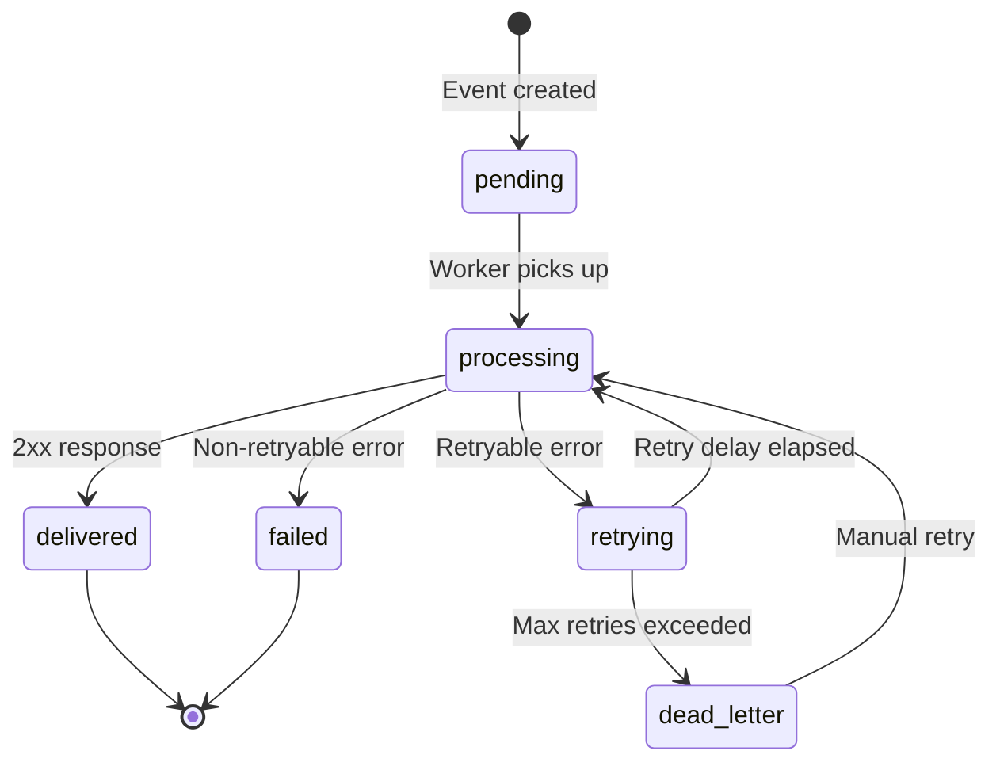
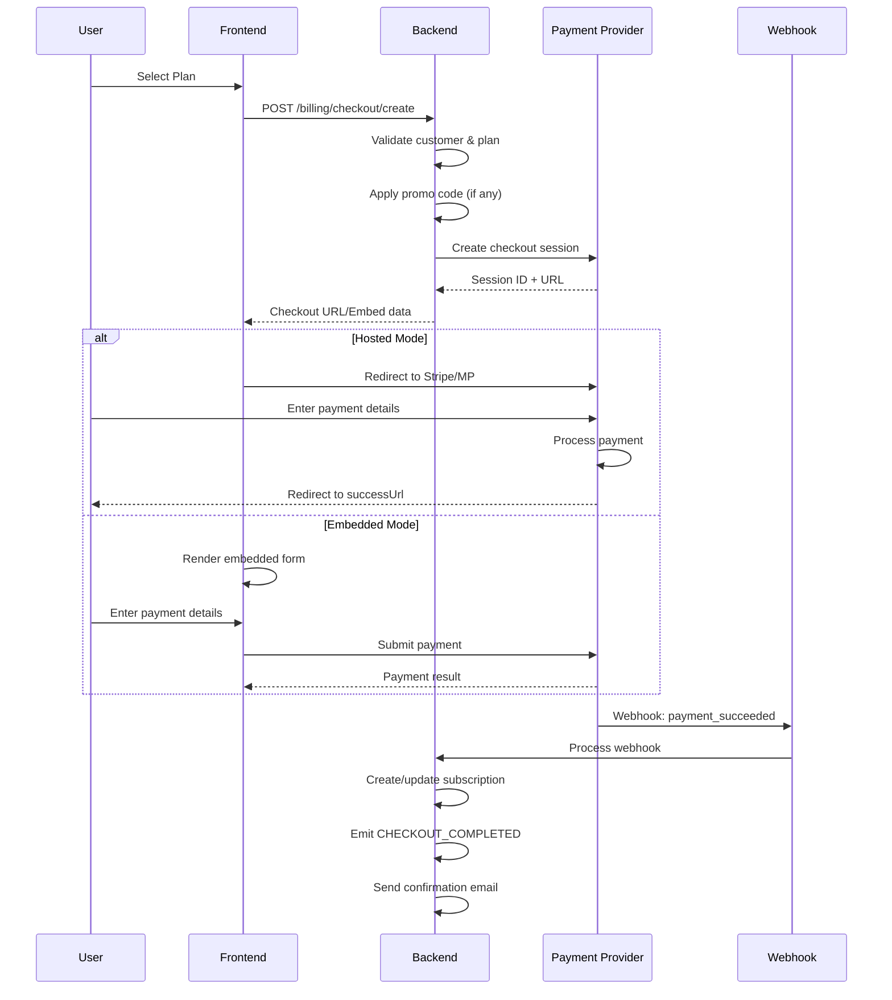
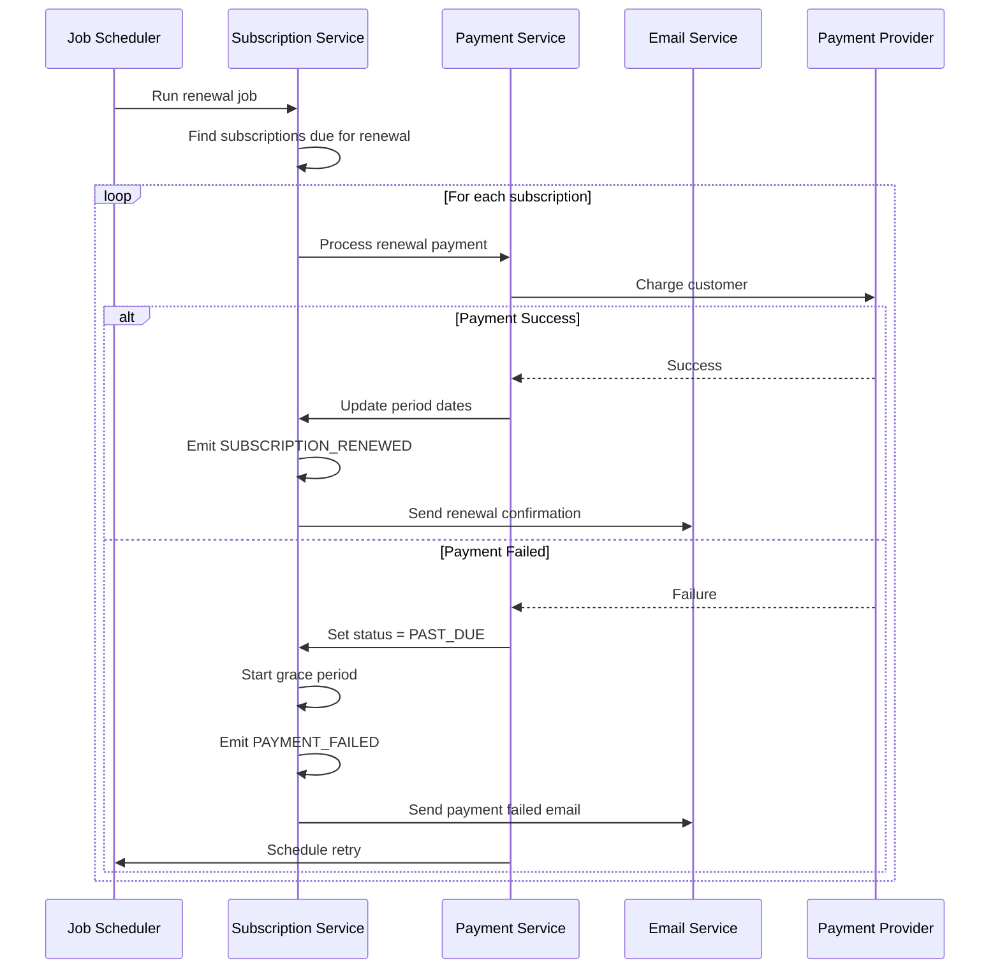
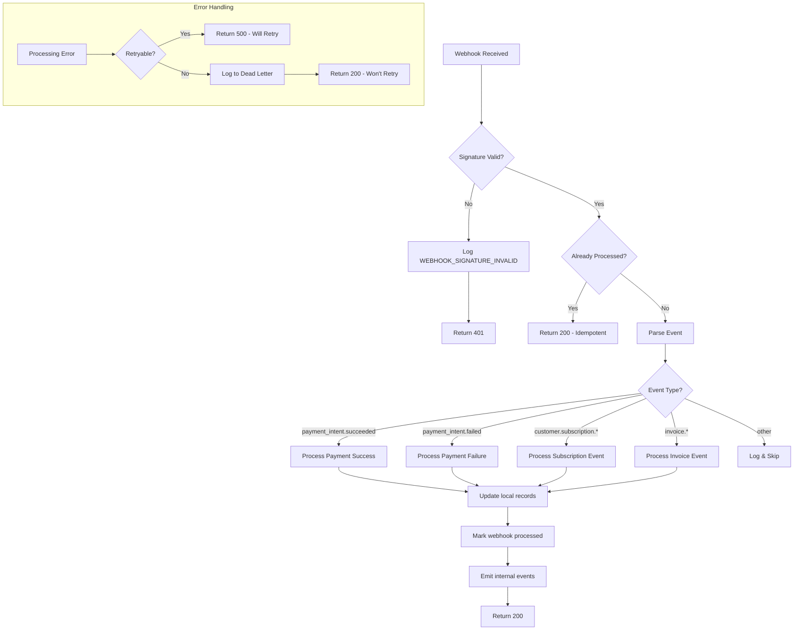

# Product Design Requirements (PDR)

## Document Information

| Field | Value |
|-------|-------|
| **Product** | @qazuor/qzpay |
| **Version** | 2.0.0 |
| **Status** | Draft |
| **Author** | @qazuor |
| **Created** | 2024-12-26 |
| **Last Updated** | 2024-12-28 |

---

## Table of Contents

1. [Executive Summary](#1-executive-summary)
2. [User Personas](#2-user-personas)
3. [Functional Requirements](#3-functional-requirements)
4. [Non-Functional Requirements](#4-non-functional-requirements)
5. [User Stories](#5-user-stories)
   - 5.1 [Customer Management Stories](#51-customer-management-stories)
   - 5.2 [Subscription Stories](#52-subscription-stories)
   - 5.3 [Payment Stories](#53-payment-stories)
   - 5.4 [Marketplace Stories](#54-marketplace-stories)
   - 5.5 [Admin Stories](#55-admin-stories)
   - 5.6 [Advanced Subscription Stories](#56-advanced-subscription-stories)
   - 5.7 [Analytics & Monitoring Stories](#57-analytics--monitoring-stories)
   - 5.8 [Data & Financial Stories](#58-data--financial-stories)
   - 5.9 [Internationalization & Developer Tools Stories](#59-internationalization--developer-tools-stories)
   - 5.10 [Customer & Promo P2 Stories](#510-customer--promo-p2-stories)
   - 5.11 [Observability & Testing P2 Stories](#511-observability--testing-p2-stories)
   - 5.12 [Security & Edge Cases P2 Stories](#512-security--edge-cases-p2-stories)
   - 5.13 [Architecture & Data P2 Stories](#513-architecture--data-p2-stories)
   - 5.14 [Error Recovery Stories](#514-error-recovery-stories)
6. [UI Components Specification](#6-ui-components-specification)
7. [API Specification](#7-api-specification)
8. [Event Specification](#8-event-specification)
   - 8.1 [Event Naming Convention](#81-event-naming-convention)
   - 8.2 [Event Master Table](#82-event-master-table)
   - 8.3 [Event Usage](#83-event-usage)
   - 8.4 [Event Payloads](#84-event-payloads)
9. [Configuration Reference](#9-configuration-reference)
10. [Exported Constants](#10-exported-constants)
11. [Environment Variables](#11-environment-variables)
12. [Acceptance Criteria](#12-acceptance-criteria)
13. [Architecture Decision Records (ADRs)](#13-architecture-decision-records-adrs)

---

## 1. Executive Summary

### 1.1 Product Purpose

@qazuor/qzpay is a comprehensive billing and payments library designed for Node.js applications. It provides a unified API for handling payments, subscriptions, and marketplace scenarios across multiple payment providers.

### 1.2 Target Market

- Individual developers building multiple SaaS products
- Development agencies building client projects
- Startups needing robust billing without vendor lock-in
- Teams managing multiple products with different tech stacks

### 1.3 Key Value Propositions

1. **Universal Compatibility**: Works with any Node.js framework and database
2. **Provider Agnostic**: Single API for Stripe, Mercado Pago, and future providers
3. **Highly Configurable**: Every aspect can be customized per project
4. **Production Ready**: Built-in handling for trials, grace periods, retries, and edge cases
5. **Developer Experience**: TypeScript-first with excellent documentation
6. **No Magic Strings**: Exported constants and enums for all status checks and comparisons
7. **Rich Objects**: Subscription objects with helper methods for common operations

---

## 2. User Personas

### 2.1 Developer (Primary User)

**Name**: Carlos, Full-Stack Developer

**Background**:
- Builds 2-3 SaaS products simultaneously
- Uses different tech stacks per project (NestJS, Hono, etc.)
- Limited time for billing infrastructure
- Needs reliable, tested solutions

**Goals**:
- Integrate billing in under 30 minutes
- Not worry about payment edge cases
- Reuse billing logic across projects
- Have full control when needed
- Never use magic strings in comparisons

**Pain Points**:
- Every project needs billing code rewritten
- Stripe code doesn't work with Mercado Pago
- Testing payment flows is tedious
- Handling subscription edge cases is complex
- Comparing statuses with string literals is error-prone

### 2.2 End Customer

**Name**: Maria, SaaS User

**Background**:
- Subscribes to multiple online services
- Expects smooth payment experiences
- Uses various payment methods

**Goals**:
- Easy checkout process
- Clear pricing information
- Manage subscription easily
- Apply discount codes
- Start trials without entering credit card

**Pain Points**:
- Confusing checkout flows
- Hard to cancel subscriptions
- Unclear billing dates
- Missing payment notifications
- Forced to enter card for trials

### 2.3 Platform Vendor (Marketplace)

**Name**: Ana, Jewelry Store Owner on GEMFolio

**Background**:
- Sells products on a marketplace platform
- Needs to receive payments for sales
- Wants to track earnings

**Goals**:
- Easy payment account setup
- See sales and commissions clearly
- Reliable payouts
- Dispute resolution support

**Pain Points**:
- Complex onboarding processes
- Unclear commission structures
- Delayed payouts
- No visibility into disputes

---

## 3. Functional Requirements

### 3.1 Customer Management

#### FR-CUST-001: Create Customer
**Priority**: Critical
**Description**: Create a customer record linked to an external user ID

| Input | Type | Required | Description |
|-------|------|----------|-------------|
| externalId | string | Yes | User ID in the consuming application |
| email | string | Yes | Customer email address |
| name | string | No | Customer display name |
| metadata | object | No | Custom key-value data |

| Output | Type | Description |
|--------|------|-------------|
| customer | Customer | Created customer object |

**Business Rules**:
- externalId must be unique per project
- Customer is automatically created in payment providers when first payment is made
- Email must be valid format

#### FR-CUST-002: Sync Customer with User
**Priority**: High
**Description**: Ensure customer record is linked and synced with application user

```typescript
const customer = await billing.customers.syncUser({
  externalId: user.id,
  email: user.email,
  name: user.name,
});
```

**Business Rules**:
- Creates customer if not exists
- Updates customer data if exists and changed
- Syncs with payment providers if connected

#### FR-CUST-003: Get Customer
**Priority**: Critical
**Description**: Retrieve customer by ID or external ID

#### FR-CUST-004: Update Customer
**Priority**: High
**Description**: Update customer information

**Business Rules**:
- Changes to email must be synced with payment providers
- Metadata merge is additive (new keys added, existing keys updated)

#### FR-CUST-005: Delete Customer
**Priority**: Medium
**Description**: Soft-delete customer and cancel all active subscriptions

**Business Rules**:
- Must cancel all active subscriptions first
- Customer data retained for 7 years (compliance)
- Can be permanently deleted via admin action

---

### 3.2 Subscription Management

#### FR-SUB-001: Create Subscription
**Priority**: Critical
**Description**: Create a new subscription for a customer

| Input | Type | Required | Description |
|-------|------|----------|-------------|
| customerId | string | Yes | Customer to subscribe |
| planId | string | Yes | Plan identifier |
| interval | enum | Yes | weekly, monthly, quarterly, yearly, custom |
| trialDays | number | No | Trial period length (0 = no trial) |
| trialRequiresPaymentMethod | boolean | No | Whether trial requires card (default: true) |
| promoCode | string | No | Promo code to apply |
| startDate | Date | No | When to start (default: now) |
| metadata | object | No | Custom data |

| Output | Type | Description |
|--------|------|-------------|
| subscription | QZPaySubscriptionWithHelpers | Created subscription with helper methods |

**Business Rules**:
- Customer can have multiple subscriptions (to different plans)
- Trial period starts immediately or at startDate
- If `trialRequiresPaymentMethod: false`, subscription created without payment method
- If no payment method and trial requires it, subscription created in `incomplete` status
- Promo code validated before creation

**Billing Date Normalization**:

All subscription dates are normalized to UTC midnight to ensure consistent billing times:

| Input Field | Normalization | Stored Value |
|-------------|---------------|--------------|
| `startDate` | Truncated to 00:00:00 UTC | `2025-01-15T00:00:00Z` |
| `trial_end` | Set to 23:59:59 UTC of the day | `2025-01-29T23:59:59Z` |
| `current_period_start` | Always 00:00:00 UTC | `2025-01-15T00:00:00Z` |
| `current_period_end` | Always 00:00:00 UTC (exclusive) | `2025-02-15T00:00:00Z` |

**Example Normalization:**

```typescript
// Input from client (any timezone):
startDate = new Date('2025-01-15T14:30:00-05:00'); // 2:30 PM EST

// After normalization (stored in database):
current_period_start = new Date('2025-01-15T00:00:00Z'); // Midnight UTC

// NOT: '2025-01-15T19:30:00Z' (which would cause billing at 7:30 PM UTC)
```

**Implementation:**

```typescript
function normalizeToUtcMidnight(date: Date): Date {
  const utc = new Date(Date.UTC(
    date.getUTCFullYear(),
    date.getUTCMonth(),
    date.getUTCDate(),
    0, 0, 0, 0
  ));
  return utc;
}

function normalizeTrialEnd(date: Date): Date {
  const utc = new Date(Date.UTC(
    date.getUTCFullYear(),
    date.getUTCMonth(),
    date.getUTCDate(),
    23, 59, 59, 999
  ));
  return utc;
}

// Applied during subscription creation:
const subscription = {
  current_period_start: normalizeToUtcMidnight(input.startDate ?? new Date()),
  current_period_end: addMonths(normalizeToUtcMidnight(input.startDate ?? new Date()), 1),
  trial_end: input.trialDays > 0
    ? normalizeTrialEnd(addDays(new Date(), input.trialDays))
    : null,
};
```

**Why UTC Midnight:**
1. Consistent billing times regardless of customer timezone
2. Predictable batch processing (all renewals at same UTC time)
3. No confusion with DST transitions
4. Simple period calculations (add months, not hours)

#### FR-SUB-002: Get Subscription with Helpers
**Priority**: Critical
**Description**: Retrieve subscription by ID with helper methods

```typescript
const subscription = await billing.subscriptions.get(subscriptionId);

// Helper methods
subscription.isActive();        // true if status is active
subscription.isTrial();         // true if status is trialing
subscription.hasAccess();       // true if active, trialing, or in grace period
subscription.hasPaymentMethod;   // true if payment method attached (pre-calculated property)
subscription.getEntitlements(); // returns typed entitlements
subscription.getLimits();       // returns typed limits
subscription.isInGracePeriod(); // true if past_due but within grace period
subscription.willCancel();      // true if cancelAt is set
subscription.daysUntilRenewal(); // days until next billing
subscription.daysUntilTrialEnd(); // days until trial ends (null if not trialing)
```

#### FR-SUB-003: Get Active Subscription by Customer External ID
**Priority**: Critical
**Description**: Get active subscription using the application's user ID

```typescript
const subscription = await billing.subscriptions.getActiveByCustomerExternalId(userId);
```

**Business Rules**:
- Returns the active subscription for the customer
- Returns null if no active subscription
- Includes all helper methods

#### FR-SUB-004: List Customer Subscriptions
**Priority**: Critical
**Description**: List all subscriptions for a customer

| Input | Type | Required | Description |
|-------|------|----------|-------------|
| customerId | string | Yes | Customer ID |
| status | QZPaySubscriptionStatus[] | No | Filter by status using constants |
| includeEnded | boolean | No | Include canceled/expired |

#### FR-SUB-005: Change Subscription Plan
**Priority**: High
**Description**: Upgrade or downgrade subscription plan

| Input | Type | Required | Description |
|-------|------|----------|-------------|
| subscriptionId | string | Yes | Subscription to change |
| newPlanId | string | Yes | Target plan |
| newInterval | QZPayBillingInterval | No | New billing interval |
| proration | QZPayProrationBehaviorType | No | QZPayProrationBehavior.IMMEDIATELY, .NEXT_PERIOD, .NONE |

**Business Rules**:
- Proration calculated automatically
- Upgrade: charge difference immediately
- Downgrade: credit applied to next invoice
- Change can happen mid-period

#### FR-SUB-005.1: Proration Edge Cases and Calculations

**Proration Formula**:

```typescript
// Days remaining in current period
const daysRemaining = differenceInDays(subscription.currentPeriodEnd, new Date());
const totalDaysInPeriod = differenceInDays(subscription.currentPeriodEnd, subscription.currentPeriodStart);

// Unused value from current plan
const unusedRatio = daysRemaining / totalDaysInPeriod;
const unusedCredit = Math.round(currentPlanPrice * unusedRatio);

// Value of new plan for remaining days
const newPlanProrated = Math.round(newPlanPrice * unusedRatio);

// Net charge or credit
const netAmount = newPlanProrated - unusedCredit;
// Positive = charge customer
// Negative = credit to customer
```

**Edge Cases**:

| Scenario | Behavior | Example |
|----------|----------|---------|
| **Same-day change** | Full proration for remaining period | Day 1 of 30: prorate 29/30 of difference |
| **Last day of period** | Minimal proration, change applies next period | Day 30 of 30: charge 1/30 of difference |
| **Period end exactly** | No proration, new plan starts fresh | At 00:00 of period end: full new plan price |
| **Free trial active** | No proration (no value to credit) | Trial day 5: new plan starts after trial |
| **Paused subscription** | No proration during pause, applies at resume | Paused: proration calculated from resume date |
| **Same plan, different interval** | Treat as plan change with proration | Monthly→Annual: credit remaining monthly, charge annual |
| **Plan price is $0** | Credit unused amount, no charge | Downgrade to free: credit unused paid period |
| **New plan is $0** | Full unused credit, zero charge | Upgrade to free tier: credit only |

**Mid-Cycle Plan Change with Proration = IMMEDIATELY**:

```typescript
// Example: $30/month plan, change to $50/month on day 15 of 30-day period

const calculation = {
  currentPlan: { price: 3000, name: 'Basic' },  // $30
  newPlan: { price: 5000, name: 'Pro' },         // $50
  periodStart: new Date('2025-01-01'),
  periodEnd: new Date('2025-01-31'),
  changeDate: new Date('2025-01-16'),            // Day 16

  // Calculations
  daysUsed: 15,
  daysRemaining: 15,
  totalDays: 30,
  unusedRatio: 15 / 30,  // 0.5

  // Unused credit from Basic
  unusedCredit: Math.round(3000 * 0.5),  // $15.00 credit

  // Pro plan cost for remaining 15 days
  newPlanProrated: Math.round(5000 * 0.5),  // $25.00

  // Net charge
  netCharge: 2500 - 1500,  // $10.00 charge now

  // Next renewal: full Pro plan price
  nextRenewal: 5000,  // $50.00 on Jan 31
};
```

**Proration with Add-ons**:

When subscription has add-ons, proration includes them:

```typescript
interface ProrationWithAddons {
  // Base plan proration
  planCredit: number;
  planCharge: number;

  // Add-on handling
  addonsKept: Array<{
    addonId: string;
    credit: number;   // Unused portion of current period
    charge: number;   // If add-on price changes with new plan
  }>;
  addonsRemoved: Array<{
    addonId: string;
    credit: number;   // Full unused credit
  }>;

  // Totals
  totalCredit: number;
  totalCharge: number;
  netAmount: number;
}

// Add-on behavior on plan change:
// 1. Compatible add-ons: keep, prorate if price changed
// 2. Incompatible add-ons: remove, credit unused
// 3. New required add-ons: charge prorated amount
```

**Proration Rounding Rules**:

```typescript
// ALWAYS round to nearest cent (half-up)
function prorationRound(amount: number): number {
  return Math.round(amount);  // In cents
}

// For multi-step calculations, round ONLY at the end
// to avoid compounding rounding errors
function calculateProration(params: ProrationParams): number {
  const unusedRatio = params.daysRemaining / params.totalDays;

  // Don't round intermediate values
  const credit = params.currentPrice * unusedRatio;
  const charge = params.newPrice * unusedRatio;
  const net = charge - credit;

  // Round only final result
  return prorationRound(net);
}
```

**Zero and Negative Proration Handling**:

```typescript
// Minimum charge threshold (to avoid micro-transactions)
const MIN_PRORATION_CHARGE = 50;  // $0.50

if (netAmount > 0 && netAmount < MIN_PRORATION_CHARGE) {
  // Option 1: Waive small charge (configurable)
  if (config.proration.waiveSmallCharges) {
    netAmount = 0;
  }
  // Option 2: Add to next invoice
  else {
    addToNextInvoice(netAmount);
    netAmount = 0;
  }
}

if (netAmount < 0) {
  // Create credit for customer
  await createCustomerCredit({
    customerId: subscription.customerId,
    amount: Math.abs(netAmount),
    reason: 'plan_change_proration',
    subscriptionId: subscription.id,
    expiresAt: addMonths(new Date(), 12),  // Credits expire in 12 months
  });
}
```

**Concurrent Plan Change Prevention**:

```typescript
// Use SERIALIZABLE isolation to prevent race conditions
async function changePlan(subscriptionId: string, newPlanId: string): Promise<Subscription> {
  return await this.storage.transaction(async (tx) => {
    // Lock subscription row
    const subscription = await tx.subscriptions.findByIdForUpdate(subscriptionId);

    // Check for pending plan change
    if (subscription.scheduledPlanChange) {
      throw new QZPayPlanChangeAlreadyScheduledError(
        `Subscription already has pending plan change to ${subscription.scheduledPlanChange.planId}`
      );
    }

    // Check for recent plan change (cooldown)
    const lastChange = await tx.planChangeHistory.findMostRecent(subscriptionId);
    if (lastChange && differenceInHours(new Date(), lastChange.createdAt) < 24) {
      throw new QZPayPlanChangeCooldownError(
        'Plan changes are limited to once per 24 hours'
      );
    }

    // Proceed with plan change...
  }, { isolationLevel: 'serializable' });
}
```

#### FR-SUB-006: Cancel Subscription
**Priority**: Critical
**Description**: Cancel a subscription

| Input | Type | Required | Description |
|-------|------|----------|-------------|
| subscriptionId | string | Yes | Subscription to cancel |
| cancelAt | QZPayCancelAtType | Yes | QZPayCancelAt.IMMEDIATELY, .PERIOD_END, .TRIAL_END |
| reason | string | No | Cancellation reason |

**Business Rules**:
- `QZPayCancelAt.IMMEDIATELY`: Access ends now, prorated refund if configured
- `QZPayCancelAt.PERIOD_END`: Access until current period ends
- `QZPayCancelAt.TRIAL_END`: Access until trial ends (only valid during trial)
- Subscription moves to `canceled` status
- All future invoices deleted

**Trial Cancellation Special Cases**:

| Scenario | Behavior | Event |
|----------|----------|-------|
| Trial WITHOUT payment method | Immediate cancellation only. User loses access instantly. No charge ever occurs. | `TRIAL_CANCELED` with `reason: 'user_canceled'` |
| Trial WITH payment method + IMMEDIATELY | Immediate cancellation. User loses access instantly. No charge occurs. | `SUBSCRIPTION_CANCELED` with `isTrial: true`, `wasImmediate: true` |
| Trial WITH payment method + TRIAL_END | Cancel scheduled for trial end. User keeps access until trial ends. No charge occurs. | `SUBSCRIPTION_CANCELED` with `isTrial: true`, `cancelAt: trialEndDate` |

**Trial Cancellation Rules**:
1. During trial, no charge ever occurs regardless of cancellation timing
2. Trial without payment method ONLY supports immediate cancellation (no access to keep)
3. Trial with payment method can choose: immediate or at trial end
4. `subscription.willCancel()` returns true when cancelAt is set
5. Event payloads include `isTrial: true` for analytics differentiation
6. Email templates should use trial-specific copy ("Your trial has been canceled" vs "Your subscription has been canceled")

#### FR-SUB-007: Extend Trial
**Priority**: Medium
**Description**: Extend trial period (admin action)

| Input | Type | Required | Description |
|-------|------|----------|-------------|
| subscriptionId | string | Yes | Subscription ID |
| additionalDays | number | Yes | Days to add |

**Business Rules**:
- Only works if subscription is in `trialing` status
- Notifies customer of extension

#### FR-SUB-008: Grant Free Access
**Priority**: High
**Description**: Set subscription as free (admin action)

| Input | Type | Required | Description |
|-------|------|----------|-------------|
| subscriptionId | string | Yes | Subscription ID |
| reason | string | Yes | Reason for free access |
| expiresAt | Date | No | When free access ends |

**Business Rules**:
- Subscription marked as `free` with no billing
- If expiresAt set, reverts to normal billing after
- Logged for audit purposes

---

### 3.2.1 Usage-Based Billing

> **Architecture**: This package uses a **hybrid approach** for usage-based billing. The consuming project tracks usage in real-time (in its own storage for performance), and periodically reports aggregated usage to the package for billing. This follows industry patterns (Stripe, AWS, Twilio) and allows the package to remain agnostic to specific usage metrics.

> **Responsibility Split**:
> - **Project responsibility**: Real-time usage tracking, real-time limit enforcement, UI display
> - **Package responsibility**: Store reported usage, calculate overages, generate invoices, emit billing events

#### FR-USAGE-001: Report Usage
**Priority**: High
**Description**: Report aggregated usage from the consuming project to the package for billing purposes

| Input | Type | Required | Description |
|-------|------|----------|-------------|
| subscriptionId | string | Yes | Subscription ID |
| records | QZPayUsageRecord[] | Yes | Array of usage records to report |

```typescript
interface QZPayUsageRecord {
  /**
   * Metric name - completely defined by the consuming project.
   * Examples: 'messages', 'api_requests', 'llm_queries', 'storage_gb', 'calendar_events'
   * The package does NOT validate metric names - any string is valid.
   */
  metric: string;

  /**
   * Quantity to add to the current billing period.
   * Must be a positive number.
   */
  quantity: number;

  /**
   * Optional timestamp for when the usage occurred.
   * Defaults to now. Must be within current billing period.
   */
  timestamp?: Date;

  /**
   * Optional idempotency key to prevent duplicate reports.
   * If the same key is sent twice, the second report is ignored.
   * Recommended format: `${subscriptionId}:${metric}:${periodStart}:${batchId}`
   */
  idempotencyKey?: string;
}
```

**Example Usage**:

```typescript
// Project aggregates usage from its own storage and reports to package
const usageFromMyDb = await myApp.getUsageForBilling(subscriptionId, periodStart, periodEnd);

await billing.usage.report(subscriptionId, [
  { metric: 'messages', quantity: 1523, idempotencyKey: `${subId}:messages:${period}:batch1` },
  { metric: 'llm_queries', quantity: 89, idempotencyKey: `${subId}:llm:${period}:batch1` },
  { metric: 'calendar_events', quantity: 42, idempotencyKey: `${subId}:cal:${period}:batch1` },
]);
```

**Business Rules**:
- Package stores reported usage aggregated by billing period
- Idempotency keys prevent duplicate billing (key valid for 48 hours after period ends for late reports)
  - Note: General idempotency TTL is 24 hours; usage reporting has extended 48h window to allow late reports
- Usage can be reported multiple times per period (incremental reporting)
- Package aggregates all reports for the same metric in the same period
- Reporting does NOT trigger immediate billing (billing happens at period end)
- Event `USAGE_REPORTED` emitted after successful report

#### FR-USAGE-002: Get Reported Usage
**Priority**: High
**Description**: Get usage reported for a subscription in the current or specified billing period

| Input | Type | Required | Description |
|-------|------|----------|-------------|
| subscriptionId | string | Yes | Subscription ID |
| period | QZPayBillingPeriod | No | Period to query (default: current) |

| Output | Type | Description |
|--------|------|-------------|
| usage | Record<string, QZPayUsageMetricSummary> | Usage by metric name |
| periodStart | Date | Start of billing period |
| periodEnd | Date | End of billing period |

```typescript
interface QZPayUsageMetricSummary {
  /** Total quantity reported this period */
  quantity: number;

  /** Included quantity from plan (0 if metric not in plan) */
  included: number;

  /** Overage quantity (max(0, quantity - included)) */
  overage: number;

  /** Overage amount in cents (overage * overageRate / unit) */
  overageAmount: number;

  /** Percentage of included used (can exceed 100%) */
  percentUsed: number;
}

// Example response
{
  usage: {
    messages: { quantity: 1523, included: 1000, overage: 523, overageAmount: 523, percentUsed: 152.3 },
    llm_queries: { quantity: 89, included: 50, overage: 39, overageAmount: 1950, percentUsed: 178 },
    calendar_events: { quantity: 42, included: 100, overage: 0, overageAmount: 0, percentUsed: 42 },
  },
  periodStart: '2024-01-01T00:00:00Z',
  periodEnd: '2024-01-31T23:59:59Z',
}
```

**Business Rules**:
- Returns all metrics reported for the subscription, even if not defined in plan
- Metrics not defined in plan have `included: 0` and full quantity as overage
- `overageAmount` calculated using plan's overage rate configuration
- Past periods are read-only (usage already billed)

#### FR-USAGE-003: Configure Plan Usage Pricing
**Priority**: High
**Description**: Define usage-based pricing in plan configuration

```typescript
interface QZPayPlanUsageConfig {
  /**
   * Usage metrics configuration. Key is the metric name (string).
   * The package does NOT validate metric names - any string defined by
   * the consuming project is valid.
   */
  [metricName: string]: {
    /**
     * Quantity included in base plan price.
     * Usage up to this amount incurs no additional charge.
     */
    included: number;

    /**
     * Price in cents per unit of overage.
     * Example: 10 means $0.10 per unit over the included amount.
     */
    overageRate: number;

    /**
     * Unit size for overage calculation.
     * If unit is 100 and overage is 523, charge is: ceil(523/100) * overageRate = 6 * rate
     * Default: 1 (charge per single unit)
     */
    unit?: number;

    /**
     * How to handle limit enforcement. This is INFORMATIONAL for the consuming
     * project - the package does NOT enforce limits in real-time.
     *
     * - 'none': No limit, bill all usage as overage
     * - 'soft': Inform project of limit, allow overage, bill at overage rate
     * - 'hard': Inform project of limit, project should block when limit reached
     *
     * The consuming project is responsible for checking limits and blocking
     * operations if limitType is 'hard'.
     */
    limitType?: 'none' | 'soft' | 'hard';

    /**
     * Display name for invoices and UI.
     * Example: "API Requests", "Messages Sent", "Storage (GB)"
     */
    displayName?: string;
  };
}
```

**Example Plan Configuration**:

```typescript
const plans: QZPayPlan[] = [
  {
    id: 'starter',
    name: 'Starter Plan',
    prices: {
      [QZPayBillingInterval.MONTHLY]: 2900, // $29/month base
    },
    entitlements: ['basic_features', 'email_support'],
    limits: { team_members: 5 },
    usage: {
      messages: {
        included: 1000,
        overageRate: 1,      // $0.01 per message over 1000
        unit: 1,
        limitType: 'soft',
        displayName: 'Messages',
      },
      llm_queries: {
        included: 50,
        overageRate: 50,     // $0.50 per query over 50
        unit: 1,
        limitType: 'hard',   // Project should block after 50
        displayName: 'AI Queries',
      },
      storage_gb: {
        included: 5,
        overageRate: 100,    // $1.00 per GB over 5GB
        unit: 1,
        limitType: 'soft',
        displayName: 'Storage (GB)',
      },
    },
  },
  {
    id: 'pro',
    name: 'Pro Plan',
    prices: {
      [QZPayBillingInterval.MONTHLY]: 9900, // $99/month base
    },
    entitlements: ['all_features', 'priority_support', 'api_access'],
    limits: { team_members: 25 },
    usage: {
      messages: {
        included: 10000,
        overageRate: 1,
        unit: 100,           // Charge per 100 messages over limit
        limitType: 'none',   // Unlimited, just bill overage
        displayName: 'Messages',
      },
      llm_queries: {
        included: 500,
        overageRate: 25,     // $0.25 per query over 500
        unit: 1,
        limitType: 'soft',
        displayName: 'AI Queries',
      },
      api_requests: {
        included: 100000,
        overageRate: 10,     // $0.10 per 1000 requests over limit
        unit: 1000,
        limitType: 'none',
        displayName: 'API Requests',
      },
    },
  },
];
```

**Business Rules**:
- Metric names in plan are strings - package validates reported usage against plan
- Metrics reported but not in plan are logged with warning, not billed
- `included: 0` means pure usage-based pricing (no free tier for that metric)
- `overageRate: 0` means no overage charges (hard cap at included)
- `limitType` is informational - consuming project enforces limits

#### FR-USAGE-004: Calculate Period Overages
**Priority**: High
**Description**: Calculate overage charges for a billing period (called internally at period end)

**Overage Calculation Formula**:

```typescript
// For each metric with reported usage:
const overage = Math.max(0, reportedQuantity - includedQuantity);
const billableUnits = Math.ceil(overage / unit);
const overageCharge = billableUnits * overageRate;

// Example:
// Plan includes 1000 messages, reported 1523, rate $0.01/message, unit 1
// overage = max(0, 1523 - 1000) = 523
// billableUnits = ceil(523 / 1) = 523
// overageCharge = 523 * 1 = 523 cents = $5.23

// Example with unit bundling:
// Plan includes 10000 messages, reported 12500, rate $0.10/100 messages, unit 100
// overage = max(0, 12500 - 10000) = 2500
// billableUnits = ceil(2500 / 100) = 25
// overageCharge = 25 * 10 = 250 cents = $2.50
```

**Business Rules**:
- Overage calculated at billing period end
- Added as line items to the period's invoice
- Each metric appears as separate invoice line item
- Event `USAGE_OVERAGE_CALCULATED` emitted before invoice generation
- Event `USAGE_OVERAGE_BILLED` emitted after invoice paid
- Zero overage metrics do not appear on invoice

#### FR-USAGE-004.1: Usage Reporting Synchronization

**Problem**: Race conditions can occur when usage is reported concurrently with overage calculation at period end.

**Period Boundary Lock**:

When overage calculation starts (at `current_period_end`), the system implements a period lock:

```typescript
interface PeriodLockState {
  subscriptionId: string;
  periodEnd: Date;
  lockStartedAt: Date;
  lockExpiresAt: Date;  // lockStartedAt + 60 seconds (max)
  status: 'locking' | 'calculating' | 'completed';
}

// Sequence at period end:
// 1. Set lock status = 'locking'
// 2. Wait for in-flight reports (max 30 seconds)
// 3. Set lock status = 'calculating'
// 4. Calculate overages
// 5. Set lock status = 'completed'
// 6. Release lock for new period
```

**In-Flight Report Handling**:

```typescript
// When usage.report() is called:
async function reportUsage(subscriptionId: string, records: UsageRecord[]) {
  const lock = await getPeriodLock(subscriptionId);

  if (lock?.status === 'calculating') {
    // Period is being calculated, reject report
    throw new QZPayPeriodClosedError(
      'PERIOD_CLOSED',
      'Billing period is being calculated. Retry in 60 seconds.'
    );
  }

  if (lock?.status === 'locking') {
    // Wait for lock to resolve (max 30s)
    await waitForLockResolution(lock, { timeoutMs: 30000 });
  }

  // Process report normally
  return await processUsageReport(subscriptionId, records);
}
```

**Late Report Handling**:

Reports that arrive after period end are handled based on invoice status:

| Report Timing | Invoice Status | Behavior |
|---------------|----------------|----------|
| During period | N/A | Add to current period usage |
| After period end, before calculation | draft | Add to period (included in calculation) |
| During calculation (status='calculating') | draft | Reject with `PERIOD_CLOSED` error |
| After calculation, invoice still draft | draft | Add to period, recalculate overage |
| After calculation, invoice finalized | open/paid | Queue for supplemental invoice |
| > 7 days after period end | any | Reject with `PERIOD_TOO_OLD` error |

**Supplemental Invoice Handling**:

```typescript
// When late usage is reported after invoice finalized:
interface SupplementalInvoiceData {
  originalInvoiceId: string;
  subscriptionId: string;
  periodStart: Date;
  periodEnd: Date;
  lateUsage: UsageRecord[];
  reason: 'late_usage_report';
}

// Supplemental invoices:
// - Linked to original invoice via metadata
// - Created as separate invoice with line items for late usage
// - Subject to minimum threshold (e.g., $1.00) to avoid micro-invoices
// - Batched daily if multiple late reports for same period
```

**Timestamp Validation**:

All usage reports include timestamp validation:

```typescript
interface UsageTimestampValidation {
  // Report timestamp must be:
  // 1. Not in the future (> NOW() + 5 minutes tolerance)
  // 2. Within a valid billing period for this subscription
  // 3. Not older than 7 days from current time

  validateTimestamp(timestamp: Date, subscription: Subscription): ValidationResult;
}

// Validation uses SERVER time, not client time
// Timezone is always UTC for comparison
// 5-minute tolerance for clock skew between client and server
```

#### FR-USAGE-005: Usage Period Reset
**Priority**: High
**Description**: Reset usage counters at billing period start

**Business Rules**:
- Usage resets to 0 at the start of each billing period
- Previous period's usage is archived for historical queries
- Event `USAGE_PERIOD_RESET` emitted at period start
- Archived usage retained per data retention policy (configurable, default 24 months)

#### FR-USAGE-006: Usage Alerts (Optional)
**Priority**: Medium
**Description**: Optional alerts when usage approaches or exceeds limits

**Configuration**:

```typescript
interface QZPayUsageAlertConfig {
  /** Enable usage alerts (default: true) */
  enabled: boolean;

  /** Thresholds as percentages of included amount */
  thresholds: {
    warning?: number;   // Default: 80 (80%)
    critical?: number;  // Default: 100 (100%)
    overage?: number;   // Default: 150 (150% - significant overage)
  };
}
```

**Events Emitted** (when enabled):

| Event | When | Payload |
|-------|------|---------|
| `USAGE_THRESHOLD_WARNING` | Usage reaches warning threshold | `{ subscription, metric, percentUsed, threshold }` |
| `USAGE_THRESHOLD_CRITICAL` | Usage reaches critical threshold | `{ subscription, metric, percentUsed, threshold }` |
| `USAGE_THRESHOLD_OVERAGE` | Usage reaches overage threshold | `{ subscription, metric, percentUsed, threshold, overageAmount }` |

**Business Rules**:
- Alerts are evaluated when usage is reported
- Each threshold fires only once per period per metric
- Consuming project can use these events to notify users
- Thresholds are optional - only configured thresholds emit events

#### FR-USAGE-007: Get Plan Usage Configuration
**Priority**: Medium
**Description**: Get usage configuration for a plan (for UI display)

```typescript
const planUsage = await billing.plans.getUsageConfig(planId);

// Returns:
{
  planId: 'pro',
  metrics: {
    messages: { included: 10000, overageRate: 1, unit: 100, limitType: 'none', displayName: 'Messages' },
    llm_queries: { included: 500, overageRate: 25, unit: 1, limitType: 'soft', displayName: 'AI Queries' },
  }
}
```

**Business Rules**:
- Returns only usage-related configuration
- Useful for displaying usage limits in pricing pages and user dashboards
- Returns empty object if plan has no usage-based pricing

---

**Implementation Notes for Consuming Projects**:

```typescript
// ============================================================
// REAL-TIME TRACKING (Project's responsibility - fast, own storage)
// ============================================================

// Option A: Redis for high-frequency metrics
const redis = new Redis();

async function trackUsage(userId: string, metric: string, quantity: number = 1) {
  const key = `usage:${userId}:${metric}:${getCurrentPeriod()}`;
  await redis.incrby(key, quantity);

  // Check limit in real-time (if you need to block)
  const current = await redis.get(key);
  const limit = await getPlanLimit(userId, metric);

  if (limit.type === 'hard' && current >= limit.included) {
    throw new UsageLimitExceededError(metric);
  }
}

// Option B: Database counter for lower-frequency metrics
async function trackUsage(userId: string, metric: string, quantity: number = 1) {
  await db.usageCounters.upsert({
    where: { userId, metric, period: getCurrentPeriod() },
    update: { quantity: { increment: quantity } },
    create: { userId, metric, period: getCurrentPeriod(), quantity },
  });
}

// ============================================================
// PERIODIC REPORTING (Sync to qzpay for billing)
// ============================================================

// Cron job: Report usage to qzpay (e.g., every hour or daily)
async function syncUsageToQZPay() {
  const subscriptions = await getActiveSubscriptions();

  for (const sub of subscriptions) {
    const usage = await aggregateUsageFromMyStorage(sub.customerId);

    await billing.usage.report(sub.id, usage.map(u => ({
      metric: u.metric,
      quantity: u.quantity,
      idempotencyKey: `${sub.id}:${u.metric}:${getCurrentPeriod()}:${Date.now()}`,
    })));
  }
}

// Schedule: Run hourly
cron.schedule('0 * * * *', syncUsageToQZPay);
```

---

### 3.3 Entitlements and Limits System

#### FR-ENT-001: Define Plan Entitlements
**Priority**: High
**Description**: Boolean features included in a plan

```typescript
// Project defines its entitlements interface
interface MyAppEntitlements extends QZPayEntitlements {
  canAccessAnalytics: boolean;
  canExportData: boolean;
  canCustomBranding: boolean;
  hasAPIAccess: boolean;
  hasPrioritySupport: boolean;
}
```

**Business Rules**:
- Entitlements are boolean (feature access: yes/no)
- Each plan defines which entitlements are true
- Subscription helpers return typed entitlements

#### FR-ENT-002: Define Plan Limits
**Priority**: High
**Description**: Numeric limits for plans

```typescript
// Project defines its limits interface
interface MyAppLimits extends QZPayLimits {
  maxProjects: number;      // -1 = unlimited
  maxUsersPerProject: number;
  monthlyAPIRequests: number;
  storageGB: number;
}
```

**Business Rules**:
- Limits are numeric restrictions
- `-1` means unlimited
- Subscription helpers return typed limits
- Usage tracking validates against limits

#### FR-ENT-003: Access Entitlements and Limits
**Priority**: High
**Description**: Access typed entitlements and limits from subscription

```typescript
const subscription = await billing.subscriptions.getActiveByCustomerExternalId(userId);

// Get typed entitlements
const entitlements = subscription.getEntitlements<MyAppEntitlements>();
if (entitlements.canAccessAnalytics) {
  // Show analytics
}

// Get typed limits
const limits = subscription.getLimits<MyAppLimits>();
if (limits.maxProjects === -1 || currentProjects < limits.maxProjects) {
  // Allow creating project
}
```

#### FR-ENT-004: Validate Against Limits
**Priority**: High
**Description**: Check if an operation is allowed based on subscription limits

> **Architecture Note (Hybrid Approach)**: The consuming project is responsible for tracking
> current resource counts (e.g., how many projects exist). The package provides helpers to
> compare against plan limits and returns structured results. The package does NOT track
> resource counts internally.

| Input | Type | Required | Description |
|-------|------|----------|-------------|
| subscriptionId | string | Yes | Subscription ID to check |
| limitKey | string | Yes | Limit key to check (e.g., 'maxProjects') |
| currentCount | number | Yes | Current count of resources (provided by project) |
| increment | number | No | Amount to add (default: 1) |

| Output | Type | Description |
|--------|------|-------------|
| allowed | boolean | Whether the operation is allowed |
| current | number | Current count (echo of input) |
| limit | number | Plan limit value (-1 if unlimited) |
| remaining | number | Remaining capacity (Infinity if unlimited) |
| percentUsed | number | Percentage of limit used (0 if unlimited) |
| reason | string \| null | Reason if not allowed |

**Business Rules**:
- Returns `allowed: true` if limit is `-1` (unlimited)
- Compares `currentCount + increment` against limit
- Does NOT modify any data (read-only check)
- Does NOT track resource counts (project responsibility)
- Returns clear, user-friendly reason if blocked
- Emits `LIMIT_CHECK_FAILED` event if `allowed: false`

**Example**:
```typescript
// Project tracks how many projects the user has
const currentProjects = await db.projects.countByUserId(userId);

// Package checks against plan limit
const result = await billing.subscriptions.checkLimit({
  subscriptionId: 'sub_123',
  limitKey: 'maxProjects',
  currentCount: currentProjects,
  increment: 1,
});

// result = {
//   allowed: true,
//   current: 9,
//   limit: 10,
//   remaining: 1,
//   percentUsed: 90,
//   reason: null,
// }

if (!result.allowed) {
  throw new QZPayLimitExceededError(
    'maxProjects',
    result.current,
    result.limit
  );
}

// Safe to create project
await db.projects.create({ userId, name: 'New Project' });
```

**Subscription Helper Method**:
```typescript
// Alternative: use subscription helper directly
const subscription = await billing.subscriptions.get(subId);

// Type-safe check
const result = subscription.checkLimit<MyAppLimits>({
  limitKey: 'maxProjects',
  currentCount: 9,
  increment: 1,
});
```

#### FR-ENT-005: Check Overage After Plan Change
**Priority**: High
**Description**: Detect if current resource usage exceeds new plan limits (for downgrades)

> **Architecture Note (Hybrid Approach)**: The consuming project provides current resource
> counts for all relevant limits. The package compares against the new plan's limits and
> returns which resources are over limit. The project decides how to handle overage
> (grace period, archive, block creation, etc.).

| Input | Type | Required | Description |
|-------|------|----------|-------------|
| subscriptionId | string | Yes | Subscription ID |
| newPlanId | string | Conditional | New plan ID (required if not using current plan) |
| currentCounts | object | Yes | Current resource counts by limit key |

| Output | Type | Description |
|--------|------|-------------|
| hasOverage | boolean | Whether any limit is exceeded |
| metrics | object | Detailed overage by limit key |
| totalOverage | number | Sum of all overage amounts |
| affectedLimits | string[] | List of limit keys with overage |

**Business Rules**:
- Compares provided counts against target plan limits
- Returns detailed breakdown per limit
- Does NOT block the plan change (informational only)
- Emits `LIMIT_OVERAGE_DETECTED` event if `hasOverage: true`
- Can be called before changePlan() to show user impact

**Example**:
```typescript
// Before allowing downgrade, check impact
const overage = await billing.subscriptions.checkOverage({
  subscriptionId: 'sub_123',
  newPlanId: 'starter',  // Downgrading from Pro to Starter
  currentCounts: {
    maxProjects: 15,      // User currently has 15 projects
    maxTeamMembers: 8,    // User currently has 8 team members
    maxStorageGB: 50,     // User currently using 50GB
  },
});

// overage = {
//   hasOverage: true,
//   totalOverage: 17,    // Total items over limit
//   affectedLimits: ['maxProjects', 'maxTeamMembers'],
//   metrics: {
//     maxProjects: {
//       current: 15,
//       limit: 5,         // Starter allows 5
//       overage: 10,      // 10 projects over
//       percentOver: 200, // 200% of limit
//     },
//     maxTeamMembers: {
//       current: 8,
//       limit: 1,         // Starter allows 1
//       overage: 7,       // 7 members over
//       percentOver: 700,
//     },
//     maxStorageGB: {
//       current: 50,
//       limit: 100,       // Starter allows 100GB
//       overage: 0,       // Within limit
//       percentOver: 0,
//     },
//   },
// }

if (overage.hasOverage) {
  // Show warning to user before proceeding
  const message = `Downgrading will affect: ${overage.affectedLimits.join(', ')}`;
  // User must acknowledge before proceeding
}
```

#### FR-ENT-006: Overage Handling Configuration
**Priority**: High
**Description**: Configure how to handle limit overages after downgrades

| Config | Type | Default | Description |
|--------|------|---------|-------------|
| mode | QZPayOverageHandlingMode | 'grace_period' | How to handle overage |
| gracePeriodDays | number | 7 | Days to resolve overage (if mode='grace_period') |
| notifyDaysBeforeEnforcement | number[] | [5, 3, 1] | Days before enforcement to notify |
| autoArchiveOldest | boolean | false | Auto-archive oldest resources when enforced |
| blockCreationDuringOverage | boolean | true | Block new resource creation while in overage |

**Overage Handling Modes**:

| Mode | Behavior | Use Case |
|------|----------|----------|
| `grace_period` | User has N days to reduce usage. Notifications sent. After period, enforcement applied. | Default, user-friendly |
| `immediate_block` | Block creation immediately. Allow deletion/archival. | Strict enforcement |
| `soft_limit` | Allow continued access, show upgrade prompts. No enforcement. | Growth-focused products |
| `enforce_archive` | Auto-archive oldest over-limit resources. Not deleted. | Last resort, use carefully |

**Events Emitted**:

| Event | When | Payload |
|-------|------|---------|
| `LIMIT_OVERAGE_DETECTED` | Overage detected on plan change | subscriptionId, affectedLimits, overageDetails |
| `LIMIT_OVERAGE_GRACE_STARTED` | Grace period begins | subscriptionId, gracePeriodDays, enforcementDate |
| `LIMIT_OVERAGE_REMINDER` | Reminder during grace period | subscriptionId, daysRemaining, affectedLimits |
| `LIMIT_OVERAGE_ENFORCED` | Grace period ended, enforcement applied | subscriptionId, action, affectedResources |
| `LIMIT_OVERAGE_RESOLVED` | User resolved overage manually | subscriptionId, resolvedLimits |

**Configuration Example**:
```typescript
const billing = new QZPayBilling({
  // ... other config
  entitlements: {
    overageHandling: {
      mode: 'grace_period',
      gracePeriodDays: 7,
      notifyDaysBeforeEnforcement: [5, 3, 1],
      blockCreationDuringOverage: true,
      autoArchiveOldest: false,
    },
  },
});
```

**Grace Period Flow**:
```
Day 0: Downgrade detected, overage exists
       → LIMIT_OVERAGE_DETECTED emitted
       → LIMIT_OVERAGE_GRACE_STARTED emitted
       → Block creation if configured

Day 2: Reminder sent (5 days remaining)
       → LIMIT_OVERAGE_REMINDER emitted

Day 4: Reminder sent (3 days remaining)
       → LIMIT_OVERAGE_REMINDER emitted

Day 6: Final reminder (1 day remaining)
       → LIMIT_OVERAGE_REMINDER emitted

Day 7: Grace period ends
       → If resolved: LIMIT_OVERAGE_RESOLVED emitted
       → If not: LIMIT_OVERAGE_ENFORCED emitted
         → Action depends on configuration
```

**Helper Methods**:
```typescript
// Check if subscription is in overage state
subscription.hasOverage(); // boolean

// Get overage details
subscription.getOverageDetails(); // QZPayOverageDetails | null

// Check if in grace period
subscription.isInOverageGracePeriod(); // boolean

// Get days remaining in grace period
subscription.getOverageGraceDaysRemaining(); // number | null
```

---

### 3.4 Payment Processing

#### FR-PAY-001: Create One-Time Payment
**Priority**: Critical
**Description**: Process a single payment

| Input | Type | Required | Description |
|-------|------|----------|-------------|
| customerId | string | Yes | Customer ID |
| amount | number | Yes | Amount in smallest currency unit |
| currency | QZPayCurrency | Yes | Currency constant (QZPayCurrency.USD, etc.) |
| description | string | No | Payment description |
| metadata | object | No | Custom data |
| paymentSplit | object | No | Marketplace split config |

| Output | Type | Description |
|--------|------|-------------|
| payment | QZPayPayment | Payment record |
| checkoutUrl | string | URL for hosted/embedded checkout |

**Business Rules**:
- Amount must be positive
- Currency validated using QZPayCurrency constants
- If marketplace split, vendor must be onboarded

#### FR-PAY-002: Create Checkout Session
**Priority**: Critical
**Description**: Create checkout session for payment

| Input | Type | Required | Description |
|-------|------|----------|-------------|
| customerId | string | Yes | Customer ID |
| items | QZPayCheckoutItem[] | Yes | Items to purchase |
| mode | QZPayCheckoutMode | No | QZPayCheckoutMode.HOSTED, QZPayCheckoutMode.EMBEDDED |
| successUrl | string | Yes (hosted) | Redirect after success |
| cancelUrl | string | Yes (hosted) | Redirect after cancel |
| promoCode | string | No | Promo code to apply |

#### FR-PAY-003: Process Subscription Payment
**Priority**: Critical
**Description**: Internal - process recurring payment

**Business Rules**:
- Called automatically by jobs system
- Retry logic based on configuration
- Grace period handling
- Failure notifications

#### FR-PAY-004: Refund Payment
**Priority**: High
**Description**: Refund a payment (full or partial)

| Input | Type | Required | Description |
|-------|------|----------|-------------|
| paymentId | string | Yes | Payment to refund |
| amount | number | No | Refund amount (default: full) |
| reason | string | Yes | Refund reason |
| idempotencyKey | string | Yes | Prevents duplicate refunds |

**Business Rules**:
- Only payments with status `QZPayPaymentStatus.SUCCEEDED` can be refunded
- Partial refunds tracked cumulatively
- Refund cannot exceed original amount
- Logged for audit purposes
- Idempotency key required to prevent duplicate refunds

#### FR-PAY-004.1: Refund Edge Cases (P0 - QA Critical)

**Time Limits**:

| Provider | Refund Window | Partial Refund Limit |
|----------|---------------|----------------------|
| Stripe | 180 days | Unlimited partials within window |
| MercadoPago | 180 days | Max 10 partial refunds per payment |

**Multi-Currency Refunds**:

```typescript
interface MultiCurrencyRefundRules {
  // Refund is ALWAYS in the original payment currency
  refundCurrency: 'original_payment_currency';

  // Exchange rate handling
  exchangeRate: {
    // Use rate at time of original payment (not current rate)
    rateSource: 'payment_time';
    // Store original rate for audit
    rateStoredIn: 'payments.exchange_rate';
  };
}

// Example: Customer paid $100 USD (converted from €90 EUR at 1.11 rate)
// Refund of $50 USD:
// - Provider refunds $50 USD to customer
// - For accounting: €45.05 EUR (using original 1.11 rate, not current)
```

**Concurrent Refund Prevention**:

```typescript
// Two admins attempting refund at same time
async function refundPayment(params: RefundParams): Promise<Refund> {
  return await db.transaction(async (tx) => {
    // 1. Acquire lock on payment
    const payment = await tx.select()
      .from(payments)
      .where(eq(payments.id, params.paymentId))
      .for('update'); // SELECT FOR UPDATE

    // 2. Check current refund state
    const totalRefunded = payment.refundedAmount ?? 0;
    const maxRefundable = payment.amount - totalRefunded;

    if (params.amount > maxRefundable) {
      throw new QZPayRefundExceedsAvailableError({
        requested: params.amount,
        available: maxRefundable,
        alreadyRefunded: totalRefunded,
      });
    }

    // 3. Process refund with provider
    const providerRefund = await provider.refund({
      paymentId: payment.providerPaymentId,
      amount: params.amount,
      idempotencyKey: params.idempotencyKey,
    });

    // 4. Update payment record atomically
    await tx.update(payments)
      .set({
        refundedAmount: sql`refunded_amount + ${params.amount}`,
        status: totalRefunded + params.amount >= payment.amount
          ? QZPayPaymentStatus.REFUNDED
          : QZPayPaymentStatus.PARTIALLY_REFUNDED,
        version: sql`version + 1`,
      })
      .where(and(
        eq(payments.id, params.paymentId),
        eq(payments.version, payment.version), // Optimistic lock
      ));

    return providerRefund;
  }, { isolationLevel: 'serializable' });
}
```

**Marketplace Refund Edge Cases**:

| Scenario | Platform Behavior | Vendor Behavior |
|----------|-------------------|-----------------|
| Full refund, vendor has balance | Refund platform commission | Deduct from vendor balance |
| Full refund, vendor has NO balance | Refund platform commission | Create negative balance, block payouts |
| Partial refund | Proportional commission refund | Proportional balance deduction |
| Refund after payout | Platform absorbs loss OR | Recovery invoice to vendor |
| Disputed payment | Reserve from vendor balance | Block payouts until resolved |

**Refund During Subscription Lifecycle**:

| Subscription State | Refund Behavior |
|--------------------|-----------------|
| Active | Refund allowed, subscription continues |
| Canceled | Refund allowed if within window |
| Trial (no payment) | No refund possible (nothing charged) |
| Past Due | Refund allowed, may trigger cancellation |

**Refund Audit Requirements**:

```typescript
interface RefundAuditRecord {
  refundId: string;
  paymentId: string;
  amount: number;
  currency: string;
  reason: string;

  // Who initiated
  initiatedBy: 'customer_request' | 'admin' | 'system' | 'dispute';
  adminId?: string;

  // State at refund time
  paymentAmountAtRefund: number;
  previouslyRefundedAmount: number;
  refundedAmountAfter: number;

  // Marketplace (if applicable)
  vendorId?: string;
  vendorBalanceBefore?: number;
  vendorBalanceAfter?: number;
  platformCommissionRefunded?: number;

  // Provider response
  providerRefundId: string;
  providerStatus: string;

  // Timestamps
  requestedAt: Date;
  processedAt: Date;
}
```

#### FR-PAY-005: Retry Failed Payment
**Priority**: High
**Description**: Retry a failed payment

| Input | Type | Required | Description |
|-------|------|----------|-------------|
| paymentId | string | Yes | Failed payment ID |

**Business Rules**:
- Only payments with status `QZPayPaymentStatus.FAILED` can be retried
- Respects retry limits in configuration
- Updates payment status accordingly

---

### 3.5 Bank Transfer Support

#### FR-BANK-001: Generate Bank Transfer Instructions
**Priority**: High
**Description**: Generate instructions for bank transfer payment

| Input | Type | Required | Description |
|-------|------|----------|-------------|
| customerId | string | Yes | Customer ID |
| amount | number | Yes | Amount to pay |
| currency | QZPayCurrency | Yes | Currency constant |
| reference | string | No | Custom reference |

| Output | Type | Description |
|--------|------|-------------|
| instructions | QZPayBankInstructions | Bank details and reference |
| pendingPayment | QZPayPayment | Payment in pending status |
| expiresAt | Date | When transfer must be received |

**Business Rules**:
- Reference generated automatically if not provided
- Payment expires after 7 days (configurable)
- Instructions include bank details from configuration

#### FR-BANK-002: Validate Bank Transfer
**Priority**: High
**Description**: Admin validates a bank transfer

| Input | Type | Required | Description |
|-------|------|----------|-------------|
| paymentId | string | Yes | Pending payment ID |
| validated | boolean | Yes | Whether transfer received |
| actualAmount | number | No | Amount received (if different) |
| notes | string | No | Admin notes |

**Business Rules**:
- If validated, payment status changes to `QZPayPaymentStatus.SUCCEEDED`
- If not validated, payment status changes to `QZPayPaymentStatus.FAILED`
- Partial payments handled (customer notified of remaining)
- Triggers same events as card payments

---

### 3.6 Promo Codes

#### FR-PROMO-001: Create Promo Code
**Priority**: High
**Description**: Create a new promotional code

| Input | Type | Required | Description |
|-------|------|----------|-------------|
| code | string | Yes | The promo code |
| type | QZPayPromoCodeType | Yes | QZPayPromoCodeType.PERCENTAGE, etc. |
| value | number | Yes | Discount value |
| config | object | No | Type-specific configuration |
| restrictions | object | No | Usage restrictions |

**Discount Type Hierarchy Clarification**:

```
┌─────────────────────────────────────────────────────────────────────────────┐
│                       DISCOUNT TYPE HIERARCHY                                │
└─────────────────────────────────────────────────────────────────────────────┘

  QZPayDiscount (abstract)
      │
      ├── QZPayPromoCode (customer-entered codes)
      │   │
      │   └── Uses: QZPayPromoCodeType
      │       ├── PERCENTAGE         → X% off
      │       ├── FIXED_AMOUNT       → $X off
      │       ├── FREE_PERIOD        → N free billing periods
      │       ├── REDUCED_PERIOD     → N periods at reduced price
      │       └── TRIAL_EXTENSION    → Extend trial by N days
      │
      └── QZPayAutomaticDiscount (system-applied based on rules)
          │
          └── Uses: QZPayAutomaticDiscountType
              ├── PERCENTAGE         → X% off (same as promo)
              ├── FIXED_AMOUNT       → $X off (same as promo)
              ├── VOLUME             → Tiered discount by quantity
              ├── AMOUNT_THRESHOLD   → Discount when cart > $X
              └── FREE_SHIPPING      → Free shipping (marketplace only)

  Key Differences:
  ┌─────────────────────┬────────────────────────┬───────────────────────────┐
  │                     │ QZPayPromoCodeType     │ QZPayAutomaticDiscountType│
  ├─────────────────────┼────────────────────────┼───────────────────────────┤
  │ Trigger             │ Customer enters code   │ System evaluates rules    │
  │ Storage             │ billing_promo_codes    │ billing_auto_discounts    │
  │ Unique Types        │ FREE_PERIOD,           │ VOLUME, AMOUNT_THRESHOLD, │
  │                     │ REDUCED_PERIOD,        │ FREE_SHIPPING             │
  │                     │ TRIAL_EXTENSION        │                           │
  │ Stacking            │ Max 1 per transaction  │ Multiple can apply        │
  │ Visibility          │ Customer sees code     │ Customer sees "discount"  │
  └─────────────────────┴────────────────────────┴───────────────────────────┘
```

**Promo Code Types** (using `QZPayPromoCodeType` constant):

| Constant | Value Meaning | Config |
|----------|---------------|--------|
| QZPayPromoCodeType.PERCENTAGE | Percentage off (0-100) | - |
| QZPayPromoCodeType.FIXED_AMOUNT | Fixed amount off | currency |
| QZPayPromoCodeType.FREE_PERIOD | Number of free billing periods | - |
| QZPayPromoCodeType.REDUCED_PERIOD | Reduced price for N periods | periods, reducedPrice |
| QZPayPromoCodeType.TRIAL_EXTENSION | Extend trial period | additionalDays |

> **IMPORTANT**: `QZPayPromoCodeType` is ONLY for manual promo codes (customer-entered).
> For automatic discounts (system-applied based on rules), use `QZPayAutomaticDiscountType`.
> See Section 3.14 for automatic discount configuration.

**Restriction Options**:

| Field | Type | Description |
|-------|------|-------------|
| maxUses | number | Total uses allowed |
| maxUsesPerCustomer | number | Uses per customer |
| validPlans | string[] | Plans code applies to |
| newCustomersOnly | boolean | Only new customers |
| existingCustomersOnly | boolean | Only existing customers |
| startsAt | Date | When code becomes valid |
| expiresAt | Date | When code expires |
| combinable | boolean | Can combine with others |

#### FR-PROMO-002: Validate Promo Code
**Priority**: High
**Description**: Check if promo code is valid for customer/purchase

| Input | Type | Required | Description |
|-------|------|----------|-------------|
| code | string | Yes | Promo code |
| customerId | string | Yes | Customer ID |
| planId | string | No | Plan being purchased |
| amount | number | No | Purchase amount |
| quantity | number | No | Item quantity |

| Output | Type | Description |
|--------|------|-------------|
| valid | boolean | Whether code is valid |
| discount | number | Calculated discount amount |
| reason | string | Reason if invalid |
| type | QZPayPromoCodeType | Type of discount |

**Security: Enumeration Attack Prevention**

Promo code validation endpoints are prime targets for enumeration attacks. The following measures MUST be implemented:

**1. Rate Limiting (Per IP + Per Customer)**

```typescript
// Rate limit configuration for promo code validation
const PROMO_CODE_RATE_LIMITS = {
  // Per IP address (unauthenticated requests)
  perIp: {
    maxRequests: 10,
    windowSeconds: 60,
    blockDurationSeconds: 300, // 5 minute block after limit exceeded
  },
  // Per customer ID (authenticated requests)
  perCustomer: {
    maxRequests: 20,
    windowSeconds: 60,
    blockDurationSeconds: 60,
  },
  // Global circuit breaker
  global: {
    maxRequestsPerSecond: 100,
    cooldownSeconds: 30,
  },
} as const;
```

**2. Generic Error Response**

NEVER reveal whether a code exists. Always return the same error for:
- Code doesn't exist
- Code expired
- Code not yet active
- Code exhausted (max uses reached)

```typescript
// ❌ BAD: Reveals information about code existence
{ valid: false, reason: 'Code has expired' }
{ valid: false, reason: 'Code not found' }
{ valid: false, reason: 'Maximum uses reached' }

// ✅ GOOD: Generic response for ALL invalid scenarios
{ valid: false, reason: 'PROMO_CODE_INVALID' }

// Only reveal specific errors for codes that ARE valid but have restrictions:
{ valid: false, reason: 'PROMO_INVALID_FOR_PLAN' } // Code exists but not for this plan
{ valid: false, reason: 'PROMO_CUSTOMER_LIMIT_REACHED' } // Customer already used their limit
```

**3. Response Timing Normalization**

Prevent timing attacks by ensuring all responses take the same time:

```typescript
async function validatePromoCode(code: string, ...): Promise<PromoValidationResult> {
  const startTime = Date.now();

  // Always perform a database lookup, even if code format is obviously invalid
  // This prevents timing differences between "format invalid" and "code not found"
  const result = await performActualValidation(code, ...);

  // Normalize response time to 200ms minimum
  const elapsed = Date.now() - startTime;
  const delay = Math.max(0, 200 - elapsed);
  await sleep(delay);

  return result;
}
```

**4. Audit Logging for Suspicious Activity**

```typescript
// Log failed validation attempts for security monitoring
interface PromoValidationAudit {
  code: string;           // The code attempted (for pattern detection)
  customerId?: string;    // If authenticated
  ipAddress: string;      // For rate limiting
  userAgent: string;      // For bot detection
  timestamp: Date;
  valid: boolean;
  blockedByRateLimit: boolean;
}

// Alert thresholds:
// - 50+ unique codes from same IP in 1 hour → Potential enumeration attack
// - 10+ sequential codes (CODE001, CODE002...) → Automated attack
// - Same invalid code from 10+ IPs → Targeted brute force
```

#### FR-PROMO-003: Apply Promo Code
**Priority**: High
**Description**: Apply promo code to subscription/payment

**Business Rules**:
- Validated before application
- Usage count incremented
- Discount details stored on payment/subscription

#### FR-PROMO-004: List Promo Codes
**Priority**: Medium
**Description**: List all promo codes with filters

#### FR-PROMO-005: Deactivate Promo Code
**Priority**: Medium
**Description**: Disable a promo code

---

### 3.6.2 Automatic Discounts

> **Definition**: Automatic discounts are rule-based discounts that apply automatically when conditions are met, without requiring a code from the customer.

> **V1 Stacking Rules**: Maximum 1 automatic discount + maximum 1 promo code per transaction. Multiple automatic discount stacking planned for future version.

#### FR-AUTO-000.1: Discount Stacking Rules (V1)

**Scope**: This section defines how discounts combine when both a promo code AND an automatic discount apply to the same transaction.

**Stacking Limits (V1)**:

| Discount Type | Maximum per Transaction |
|---------------|------------------------|
| Promo Code | 1 |
| Automatic Discount | 1 |
| **Total Combined** | 2 |

**Application Order**:

When both discount types apply, they are calculated in this FIXED order:

```
1. Calculate subtotal (base price)
2. Apply AUTOMATIC discount (if any)
3. Apply PROMO CODE discount (if any)
4. Calculate tax on final amount
5. Calculate total
```

**Example**:

```typescript
// Subtotal: $100.00
// Automatic discount: 10% off (PERCENTAGE)
// Promo code: $15 off (FIXED_AMOUNT)

Step 1: subtotal = 10000 // cents
Step 2: afterAuto = 10000 * 0.90 = 9000 // -10%
Step 3: afterPromo = 9000 - 1500 = 7500 // -$15
Step 4: tax = calculateTax(7500) // e.g., 10% = 750
Step 5: total = 7500 + 750 = 8250 // $82.50
```

**Type Combination Matrix**:

| Automatic Type | Promo Type | Combined Behavior |
|----------------|------------|-------------------|
| PERCENTAGE | PERCENTAGE | Apply auto % first, then promo % on reduced amount |
| PERCENTAGE | FIXED_AMOUNT | Apply auto %, then subtract fixed amount |
| FIXED_AMOUNT | PERCENTAGE | Subtract auto fixed, then apply promo % |
| FIXED_AMOUNT | FIXED_AMOUNT | Subtract both amounts (auto first) |
| FREE_PERIOD | PERCENTAGE | Free period takes precedence for that duration |
| FREE_PERIOD | FREE_PERIOD | Use LONGER free period (not additive) |
| PERCENTAGE | FREE_PERIOD | Apply % to non-free periods, skip free period billing |

**Stacking Calculation Implementation**:

```typescript
interface DiscountStackResult {
  subtotal: number;
  automaticDiscount: {
    applied: boolean;
    id: string | null;
    name: string | null;
    type: DiscountType | null;
    amount: number; // Amount discounted in cents
  };
  promoCode: {
    applied: boolean;
    code: string | null;
    type: DiscountType | null;
    amount: number; // Amount discounted in cents
  };
  totalDiscount: number;
  finalAmount: number;
  freePeriods: number; // For FREE_PERIOD types
}

async function calculateStackedDiscounts(
  subtotal: number,
  automaticDiscount: AutomaticDiscount | null,
  promoCode: PromoCode | null
): Promise<DiscountStackResult> {
  let amount = subtotal;
  let totalDiscount = 0;
  let freePeriods = 0;

  const result: DiscountStackResult = {
    subtotal,
    automaticDiscount: { applied: false, id: null, name: null, type: null, amount: 0 },
    promoCode: { applied: false, code: null, type: null, amount: 0 },
    totalDiscount: 0,
    finalAmount: subtotal,
    freePeriods: 0,
  };

  // Step 1: Apply automatic discount (if any)
  if (automaticDiscount) {
    const autoAmount = calculateDiscountAmount(automaticDiscount.type, automaticDiscount.value, amount);
    amount -= autoAmount;
    totalDiscount += autoAmount;

    if (automaticDiscount.type === 'free_period') {
      freePeriods = automaticDiscount.value;
    }

    result.automaticDiscount = {
      applied: true,
      id: automaticDiscount.id,
      name: automaticDiscount.name,
      type: automaticDiscount.type,
      amount: autoAmount,
    };
  }

  // Step 2: Apply promo code (if any)
  if (promoCode) {
    // For free_period, compare and take longer
    if (promoCode.type === 'free_period') {
      if (promoCode.value > freePeriods) {
        freePeriods = promoCode.value;
      }
      // No additional monetary discount for free_period
      result.promoCode = {
        applied: true,
        code: promoCode.code,
        type: promoCode.type,
        amount: 0, // Tracked in freePeriods instead
      };
    } else {
      const promoAmount = calculateDiscountAmount(promoCode.type, promoCode.value, amount);
      amount -= promoAmount;
      totalDiscount += promoAmount;

      result.promoCode = {
        applied: true,
        code: promoCode.code,
        type: promoCode.type,
        amount: promoAmount,
      };
    }
  }

  // Ensure we don't go negative
  result.finalAmount = Math.max(0, amount);
  result.totalDiscount = totalDiscount;
  result.freePeriods = freePeriods;

  return result;
}

function calculateDiscountAmount(type: DiscountType, value: number, amount: number): number {
  switch (type) {
    case 'percentage':
      return Math.round(amount * (value / 100));
    case 'fixed_amount':
      return Math.min(value, amount); // Can't discount more than the amount
    case 'free_period':
    case 'reduced_period':
      return 0; // Handled separately
    default:
      return 0;
  }
}
```

**Maximum Discount Limits**:

To prevent over-discounting, apply these limits:

```typescript
const STACKING_LIMITS = {
  // Maximum combined discount as percentage of subtotal
  maxCombinedPercentage: 90, // Can't discount more than 90%

  // Minimum amount after discounts (to cover processing fees)
  minFinalAmount: 50, // $0.50 minimum

  // When combined discounts exceed limit, behavior:
  overLimitBehavior: 'cap_at_max', // or 'reject_second_discount'
} as const;

async function applyWithLimits(
  subtotal: number,
  stackResult: DiscountStackResult
): Promise<DiscountStackResult> {
  const maxDiscount = Math.round(subtotal * (STACKING_LIMITS.maxCombinedPercentage / 100));
  const minAmount = STACKING_LIMITS.minFinalAmount;

  if (stackResult.totalDiscount > maxDiscount) {
    // Cap the discount
    stackResult.totalDiscount = maxDiscount;
    stackResult.finalAmount = subtotal - maxDiscount;
  }

  if (stackResult.finalAmount < minAmount) {
    stackResult.finalAmount = minAmount;
    stackResult.totalDiscount = subtotal - minAmount;
  }

  return stackResult;
}
```

**Conflict Resolution Rules**:

| Conflict Scenario | Resolution |
|-------------------|------------|
| Both are FREE_PERIOD | Use longer period (not additive) |
| Promo says "not combinable" | Reject automatic discount for this transaction |
| Total discount > 90% | Cap at 90% (configurable) |
| Final amount < $0.50 | Set minimum $0.50 (configurable) |
| Both target same period | Only one FREE_PERIOD applies per period |

**Invoice Display**:

When stacked discounts apply, invoice shows them as separate line items:

```
Subtotal:                    $100.00
  Automatic Discount (VIP):  -$10.00  (10% VIP discount)
  Promo Code (SAVE15):       -$13.50  (15% off remaining $90)
Subtotal after discounts:     $76.50
Tax (10%):                    + $7.65
Total:                        $84.15
```

#### FR-AUTO-001: Create Automatic Discount
**Priority**: High
**Description**: Create a new automatic discount rule

| Input | Type | Required | Description |
|-------|------|----------|-------------|
| name | string | Yes | Display name for the discount |
| description | string | No | Optional description |
| type | QZPayAutomaticDiscountType | Yes | Discount type (percentage, fixed_amount, etc.) |
| value | number | Yes | Discount value (percentage 0-100 or fixed amount in cents) |
| condition | QZPayDiscountCondition | Yes | Single condition that triggers this discount |
| priority | number | No | Priority for HIGHEST_PRIORITY strategy (lower = higher priority, default: 100) |
| startsAt | Date | No | When discount becomes active |
| expiresAt | Date | No | When discount expires |
| maxTotalUses | number | No | Maximum total uses across all customers |
| maxUsesPerCustomer | number | No | Maximum uses per customer |

| Output | Type | Description |
|--------|------|-------------|
| discount | QZPayAutomaticDiscount | Created discount object |

**Business Rules**:
1. Discount is evaluated automatically at checkout/subscription creation
2. Only ONE automatic discount can apply per transaction (V1)
3. Automatic discount CAN stack with ONE promo code
4. Condition must be fully satisfied for discount to apply
5. Inactive or expired discounts are not evaluated

#### FR-AUTO-002: Automatic Discount Conditions
**Priority**: High
**Description**: Available condition types for automatic discounts

**Condition Types**:

| Condition Type | Field | Value Type | Description | Example |
|----------------|-------|------------|-------------|---------|
| **Cart/Purchase** |
| `MIN_AMOUNT` | minAmount | number | Minimum purchase amount (cents) | `{ type: 'MIN_AMOUNT', minAmount: 10000 }` = $100+ |
| `MIN_QUANTITY` | minQuantity | number | Minimum total items in cart | `{ type: 'MIN_QUANTITY', minQuantity: 3 }` = 3+ items |
| `SPECIFIC_PRODUCTS` | productIds | string[] | Only for listed products | `{ type: 'SPECIFIC_PRODUCTS', productIds: ['prod_123'] }` |
| `SPECIFIC_CATEGORIES` | categoryIds | string[] | Only for listed categories | `{ type: 'SPECIFIC_CATEGORIES', categoryIds: ['cat_rings'] }` |
| **Customer** |
| `FIRST_PURCHASE` | - | - | Customer's first purchase ever | `{ type: 'FIRST_PURCHASE' }` |
| `CUSTOMER_SEGMENTS` | segments | string[] | Customer belongs to segment | `{ type: 'CUSTOMER_SEGMENTS', segments: ['vip', 'wholesale'] }` |
| `CUSTOMER_TENURE` | minDays | number | Customer account age in days | `{ type: 'CUSTOMER_TENURE', minDays: 365 }` = 1+ year |
| **Subscription** |
| `BILLING_INTERVAL` | interval | string | Subscription billing interval | `{ type: 'BILLING_INTERVAL', interval: 'year' }` = annual only |
| `SPECIFIC_PLANS` | planIds | string[] | Only for listed plans | `{ type: 'SPECIFIC_PLANS', planIds: ['plan_pro'] }` |
| **Time-based** |
| `DATE_RANGE` | startsAt, endsAt | Date | Active during date range | `{ type: 'DATE_RANGE', startsAt: '2024-11-29', endsAt: '2024-11-29' }` = Black Friday |
| `SCHEDULE` | days, startHour, endHour, timezone | object | Recurring time windows | `{ type: 'SCHEDULE', days: ['mon','tue'], startHour: 18, endHour: 20, timezone: 'America/Argentina/Buenos_Aires' }` = Happy Hour |
| `DAY_OF_WEEK` | days | string[] | Specific days of week | `{ type: 'DAY_OF_WEEK', days: ['tuesday'] }` = Martes de descuento |

**V1 Limitation**: Each discount has exactly ONE condition. Combining conditions with AND/OR planned for future version.

**Condition Interface**:

```typescript
type QZPayDiscountCondition =
  | { type: 'MIN_AMOUNT'; minAmount: number }
  | { type: 'MIN_QUANTITY'; minQuantity: number }
  | { type: 'SPECIFIC_PRODUCTS'; productIds: string[] }
  | { type: 'SPECIFIC_CATEGORIES'; categoryIds: string[] }
  | { type: 'FIRST_PURCHASE' }
  | { type: 'CUSTOMER_SEGMENTS'; segments: string[] }
  | { type: 'CUSTOMER_TENURE'; minDays: number }
  | { type: 'BILLING_INTERVAL'; interval: 'month' | 'year' }
  | { type: 'SPECIFIC_PLANS'; planIds: string[] }
  | { type: 'DATE_RANGE'; startsAt: Date; endsAt: Date }
  | { type: 'SCHEDULE'; days: string[]; startHour: number; endHour: number; timezone: string }
  | { type: 'DAY_OF_WEEK'; days: string[] };
```

#### FR-AUTO-003: Automatic Discount Selection Strategy
**Priority**: High
**Description**: Global configuration for selecting which discount applies when multiple qualify

**Configuration**:

```typescript
// Global billing configuration
const billing = createQZPayBilling({
  // ... other config
  automaticDiscounts: {
    enabled: true,
    selectionStrategy: 'FIRST_MATCH', // Default
  },
});
```

**Available Strategies**:

| Strategy | Behavior | When to Use |
|----------|----------|-------------|
| `FIRST_MATCH` | First discount that qualifies wins (by creation order) | Simple setup, predictable behavior. **Default.** |
| `BEST_FOR_CUSTOMER` | Discount that gives highest savings wins | Customer-friendly, maximizes perceived value |
| `HIGHEST_PRIORITY` | Discount with lowest `priority` number wins | Full admin control over which discounts take precedence |

**Strategy Details**:

**FIRST_MATCH** (Default):
- Discounts evaluated in creation order (oldest first)
- First discount whose condition is satisfied wins
- No additional configuration needed
- Predictable: admin controls order by creating discounts in desired sequence

**BEST_FOR_CUSTOMER**:
- All eligible discounts are evaluated
- Discount that produces the highest savings (in absolute value) wins
- Ties broken by creation order (oldest wins)
- Example: "10% off" on $200 = $20 savings vs "$15 off" = $15 savings → 10% wins

**HIGHEST_PRIORITY**:
- Each discount MUST have a `priority` field (number)
- Lower number = higher priority (priority 1 beats priority 10)
- Ties broken by creation order (oldest wins)
- Example: VIP discount (priority: 1) beats First Purchase (priority: 5)

#### FR-AUTO-004: Evaluate Automatic Discounts
**Priority**: High
**Description**: Evaluate eligible discounts for a transaction context

| Input | Type | Required | Description |
|-------|------|----------|-------------|
| context | QZPayDiscountEvaluationContext | Yes | Transaction context for evaluation |
| mode | 'preview' \| 'apply' | No | Preview shows eligible, apply commits (default: 'preview') |

| Output | Type | Description |
|--------|------|-------------|
| eligibleDiscounts | QZPayAutomaticDiscount[] | All discounts whose conditions match |
| selectedDiscount | QZPayAutomaticDiscount \| null | The one discount selected by strategy |
| discountAmount | number | Calculated discount amount in cents |
| originalAmount | number | Original amount before discount |
| finalAmount | number | Final amount after discount |

**Evaluation Context**:

```typescript
interface QZPayDiscountEvaluationContext {
  // Cart/Purchase context
  amount: number;              // Total amount in cents
  quantity: number;            // Total items
  productIds?: string[];       // Products in cart
  categoryIds?: string[];      // Categories in cart

  // Customer context
  customerId: string;
  isFirstPurchase: boolean;
  customerSegments: string[];
  customerCreatedAt: Date;

  // Subscription context (if applicable)
  planId?: string;
  billingInterval?: 'month' | 'year';

  // Time context (usually current time, but can be overridden for testing)
  evaluatedAt?: Date;
}
```

**Business Rules**:
1. All active, non-expired discounts are evaluated
2. Discounts that exceed `maxTotalUses` or `maxUsesPerCustomer` are skipped
3. Selection strategy determines which ONE discount is selected
4. If mode is 'apply', usage counters are incremented
5. Events are emitted based on evaluation result (see Section 8.2.10)

#### FR-AUTO-005: List Automatic Discounts
**Priority**: Medium
**Description**: List all automatic discounts with filters

| Input | Type | Required | Description |
|-------|------|----------|-------------|
| active | boolean | No | Filter by active status |
| type | QZPayAutomaticDiscountType | No | Filter by discount type |
| conditionType | string | No | Filter by condition type |

| Output | Type | Description |
|--------|------|-------------|
| discounts | QZPayAutomaticDiscount[] | List of discounts |

#### FR-AUTO-006: Update Automatic Discount
**Priority**: Medium
**Description**: Update an existing automatic discount

| Input | Type | Required | Description |
|-------|------|----------|-------------|
| id | string | Yes | Discount ID |
| updates | Partial<QZPayAutomaticDiscount> | Yes | Fields to update |

**Business Rules**:
1. Cannot change `type` after creation
2. Cannot change `condition.type` after creation (must create new discount)
3. Emits `AUTOMATIC_DISCOUNT_UPDATED` event

#### FR-AUTO-007: Deactivate Automatic Discount
**Priority**: Medium
**Description**: Deactivate an automatic discount

| Input | Type | Required | Description |
|-------|------|----------|-------------|
| id | string | Yes | Discount ID |
| reason | 'manual' \| 'expired' \| 'usage_limit_reached' | No | Deactivation reason |

**Business Rules**:
1. Sets `active: false`
2. Emits `AUTOMATIC_DISCOUNT_DEACTIVATED` event
3. Deactivated discounts are not evaluated

---

### 3.7 Marketplace Features

> **V1 Scope Note**: Marketplace V1 supports **single-vendor checkout** only. Each purchase is processed with items from one vendor. Multi-vendor cart (purchasing from multiple vendors in a single checkout with split payments across vendors) is planned for a future version. See FR-FUTURE-007 for details.

#### FR-MKT-001: Create Vendor
**Priority**: High
**Description**: Register a vendor for the marketplace

| Input | Type | Required | Description |
|-------|------|----------|-------------|
| externalId | string | Yes | Vendor ID in app |
| email | string | Yes | Vendor email |
| name | string | Yes | Vendor/business name |
| commissionRate | number | Yes | Platform commission (0-1) |
| paymentMode | QZPayVendorPaymentMode | No | QZPayVendorPaymentMode.CONNECT, QZPayVendorPaymentMode.TRANSFER |

#### FR-MKT-002: Create Onboarding Link
**Priority**: High
**Description**: Generate link for vendor to connect payment account

| Input | Type | Required | Description |
|-------|------|----------|-------------|
| vendorId | string | Yes | Vendor ID |
| provider | QZPayPaymentProvider | Yes | QZPayPaymentProvider.STRIPE, QZPayPaymentProvider.MERCADOPAGO |
| returnUrl | string | Yes | URL after completion |
| refreshUrl | string | Yes | URL if link expires |

| Output | Type | Description |
|--------|------|-------------|
| url | string | Onboarding URL |
| expiresAt | Date | Link expiration |

**Business Rules**:
- Stripe: Creates Connect account and returns OAuth link
- MP: Returns OAuth authorization link
- Vendor can have accounts on multiple providers

#### FR-MKT-003: Get Vendor Status
**Priority**: High
**Description**: Check vendor onboarding status

| Output | Type | Description |
|--------|------|-------------|
| status | QZPayVendorOnboardingStatus | QZPayVendorOnboardingStatus.PENDING, etc. |
| requirements | string[] | Pending requirements |
| canReceivePayments | boolean | Whether payouts enabled |

#### FR-MKT-004: Create Split Payment
**Priority**: High
**Description**: Process payment with vendor split

| Input | Type | Required | Description |
|-------|------|----------|-------------|
| vendorId | string | Yes | Vendor to pay |
| amount | number | Yes | Total amount |
| applicationFee | number | No | Override commission |

**Business Rules**:
- Commission deducted automatically if not specified
- Vendor receives (amount - commission)
- Platform receives commission
- Split handled by provider (Connect/MP Marketplace)

#### FR-MKT-005: Get Vendor Balance
**Priority**: Medium
**Description**: Get vendor's pending and available balance

#### FR-MKT-006: Create Vendor Payout
**Priority**: Medium
**Description**: Trigger payout to vendor (for transfer mode)

| Input | Type | Required | Description |
|-------|------|----------|-------------|
| vendorId | string | Yes | Vendor identifier |
| amount | number | No | Amount to payout (default: full available balance) |
| currency | string | No | Currency (default: vendor's default currency) |
| idempotencyKey | string | Yes | Prevents duplicate payouts |
| metadata | object | No | Custom metadata for audit |

| Output | Type | Description |
|--------|------|-------------|
| payout | QZPayVendorPayout | Created payout object |
| estimatedArrival | Date | Estimated arrival date |

**Business Rules**:
- Only available balance can be paid out (not pending balance)
- Vendor must have completed onboarding (`canReceivePayments: true`)
- Minimum payout amount enforced (configurable, default: $10 or currency equivalent)
- Idempotency key required to prevent duplicate payouts
- Event `VENDOR_PAYOUT_CREATED` emitted

**Fraud Prevention: Payout Security**

Vendor payouts are high-risk operations. The following multi-layer security MUST be implemented:

**1. Balance Integrity Protection**

```sql
-- Use transaction with SERIALIZABLE isolation for payout operations
-- This prevents race conditions where balance is read, then modified before payout commits

-- Step 1: Calculate actual available balance from transactions
SELECT
  COALESCE(SUM(CASE WHEN type = 'credit' THEN amount ELSE -amount END), 0) as calculated_balance
FROM billing_vendor_transactions
WHERE vendor_id = $1
  AND status = 'completed'
  AND livemode = $2;

-- Step 2: Compare with cached balance (detect manipulation)
SELECT available_balance FROM billing_vendors WHERE id = $1;

-- Step 3: If mismatch > 1 cent, BLOCK payout and alert
-- This detects if someone modified the balance directly in the database
```

**2. Payout Velocity Limits**

```typescript
const VENDOR_PAYOUT_LIMITS = {
  // Daily limits
  daily: {
    maxPayouts: 3,
    maxAmount: 10000_00,  // $10,000 in cents
  },
  // Per-payout limits
  perPayout: {
    maxAmount: 5000_00,   // $5,000 per payout
    minAmount: 10_00,     // $10 minimum
  },
  // Velocity detection
  velocity: {
    // If 5+ payouts in 1 hour, flag for review
    hourlyPayoutThreshold: 5,
    // If payout > 50% of all-time vendor earnings, flag for review
    percentageOfHistoricalThreshold: 0.50,
  },
} as const;
```

**3. Dual Control for Large Payouts**

Payouts exceeding threshold require admin approval:

```typescript
interface PayoutApprovalConfig {
  /** Payouts above this amount require admin approval */
  approvalThreshold: number; // Default: 1000_00 ($1,000)

  /** Number of approvers required */
  requiredApprovers: number; // Default: 1

  /** Timeout before auto-cancellation */
  approvalTimeoutHours: number; // Default: 24
}

// Flow for large payouts:
// 1. Payout created with status='pending_approval'
// 2. Admin notification sent
// 3. Admin approves/rejects via dashboard
// 4. If approved, payout proceeds
// 5. If rejected or timeout, payout cancelled
```

**4. Reconciliation Check Before Payout**

```typescript
async function validatePayoutIntegrity(vendorId: string, amount: number): Promise<void> {
  // Calculate expected balance from transaction history
  const calculatedBalance = await calculateVendorBalanceFromTransactions(vendorId);

  // Get cached balance from vendors table
  const vendor = await getVendor(vendorId);
  const cachedBalance = vendor.availableBalance;

  // Allow small rounding differences (< $0.01)
  const difference = Math.abs(calculatedBalance - cachedBalance);
  if (difference > 1) { // > 1 cent
    throw new QZPayBalanceIntegrityError(
      `Balance mismatch detected for vendor ${vendorId}. ` +
      `Calculated: ${calculatedBalance}, Cached: ${cachedBalance}. ` +
      `Payout blocked. Investigation required.`,
      { vendorId, calculatedBalance, cachedBalance }
    );
  }

  // Verify payout doesn't exceed available balance
  if (amount > calculatedBalance) {
    throw new QZPayInsufficientBalanceError(
      `Payout amount ${amount} exceeds available balance ${calculatedBalance}`,
      { vendorId, requestedAmount: amount, availableBalance: calculatedBalance }
    );
  }
}
```

**5. Audit Trail Requirements**

Every payout operation MUST record:

```typescript
interface PayoutAuditRecord {
  payoutId: string;
  vendorId: string;
  amount: number;
  currency: string;

  // Integrity check results
  calculatedBalance: number;
  cachedBalance: number;
  balanceMatchedAtCreation: boolean;

  // Authorization
  initiatedBy: 'system' | 'admin' | 'vendor_request';
  adminId?: string;
  approvedBy?: string[];

  // Context
  ipAddress?: string;
  userAgent?: string;

  // Timestamps
  createdAt: Date;
  approvedAt?: Date;
  processedAt?: Date;
  failedAt?: Date;

  // Results
  providerPayoutId?: string;
  errorMessage?: string;
}
```

**6. Negative Balance Handling**

When refunds cause negative vendor balance:

```typescript
// On refund that affects vendor balance:
if (newVendorBalance < 0) {
  // 1. Block all future payouts for this vendor
  await blockVendorPayouts(vendorId, 'negative_balance');

  // 2. Emit event for platform to handle
  emit(QZPayBillingEvent.VENDOR_BALANCE_NEGATIVE, {
    vendorId,
    newBalance: newVendorBalance,
    refundId,
    paymentId,
  });

  // 3. Create recovery invoice (optional, if configured)
  if (config.marketplace.createRecoveryInvoices) {
    await createVendorRecoveryInvoice(vendorId, Math.abs(newVendorBalance));
  }
}
```

**7. Cooling-Off Period (Self-Dealing Fraud Prevention)** (CRIT-009)

The cooling-off period prevents vendor fraud where a vendor:
1. Creates a fake purchase to themselves
2. Receives the vendor payout
3. Issues a chargeback/refund on the original payment

**Balance Flow Diagram**:

```
┌──────────────────────────────────────────────────────────────────────────────┐
│                        VENDOR BALANCE FLOW                                    │
│                                                                               │
│  Payment Received                                                             │
│        │                                                                      │
│        ▼                                                                      │
│  ┌─────────────────┐                                                          │
│  │ balance_pending │ ◄── Funds held for cooling-off period                   │
│  │   (not payable) │     Default: 14 days                                    │
│  └────────┬────────┘                                                          │
│           │                                                                   │
│           │ After cooling_off_days elapsed                                    │
│           │ (Background job runs daily)                                       │
│           ▼                                                                   │
│  ┌─────────────────────┐                                                      │
│  │ balance_available   │ ◄── Funds ready for payout                          │
│  │   (payable)         │                                                      │
│  └────────┬────────────┘                                                      │
│           │                                                                   │
│           │ Dispute/Chargeback received                                       │
│           ▼                                                                   │
│  ┌─────────────────────┐                                                      │
│  │ balance_reserved    │ ◄── Funds held pending dispute resolution           │
│  │   (blocked)         │     Released back or deducted based on outcome      │
│  └─────────────────────┘                                                      │
│                                                                               │
└──────────────────────────────────────────────────────────────────────────────┘
```

**Balance Field Definitions**:

| Field | Description | Payable? |
|-------|-------------|----------|
| `balance_pending` | Funds in cooling-off period, not yet available | ❌ No |
| `balance_available` | Funds ready for payout request | ✅ Yes |
| `balance_reserved` | Funds held for active disputes | ❌ No |

**Cooling-Off Period Configuration**:

```typescript
interface VendorCoolingOffConfig {
  /** Days before pending becomes available (minimum: 7, default: 14) */
  coolingOffDays: number;

  /** Override per vendor tier (optional) */
  tierOverrides?: {
    [tierId: string]: number; // e.g., 'trusted': 7, 'new': 21
  };
}

// Applied during payment split processing:
async function creditVendorBalance(vendorId: string, amount: number): Promise<void> {
  const vendor = await getVendor(vendorId);
  const coolingOffDays = vendor.coolingOffDays ?? config.marketplace.defaultCoolingOffDays;

  await db.transaction(async (tx) => {
    // Add to pending balance (NOT available)
    await tx.update(vendors)
      .set({
        balance_pending: sql`balance_pending + ${amount}`,
      })
      .where(eq(vendors.id, vendorId));

    // Create pending balance record with release date
    await tx.insert(vendorPendingBalances).values({
      vendorId,
      amount,
      currency: vendor.balanceCurrency,
      paymentId,
      releasesAt: addDays(new Date(), coolingOffDays),
      status: 'pending',
    });
  }, { isolationLevel: 'serializable' });
}
```

**Background Job: Release Pending Balances**:

```typescript
// Runs daily at 00:00 UTC
async function releasePendingBalances(): Promise<void> {
  const now = new Date();

  // Find all pending balances ready for release
  const pendingRecords = await db.select()
    .from(vendorPendingBalances)
    .where(and(
      eq(vendorPendingBalances.status, 'pending'),
      lte(vendorPendingBalances.releasesAt, now),
    ));

  for (const record of pendingRecords) {
    await db.transaction(async (tx) => {
      // Move from pending to available
      await tx.update(vendors)
        .set({
          balance_pending: sql`balance_pending - ${record.amount}`,
          balance_available: sql`balance_available + ${record.amount}`,
        })
        .where(eq(vendors.id, record.vendorId));

      // Mark record as released
      await tx.update(vendorPendingBalances)
        .set({ status: 'released', releasedAt: now })
        .where(eq(vendorPendingBalances.id, record.id));

    }, { isolationLevel: 'serializable' });
  }

  emit(QZPayBillingEvent.JOB_COMPLETED, {
    jobName: 'releasePendingBalances',
    recordsProcessed: pendingRecords.length,
  });
}
```

**Dispute Handling with Reserved Balance**:

```typescript
// When dispute is opened:
async function onDisputeOpened(disputeId: string, paymentId: string): Promise<void> {
  const payment = await getPayment(paymentId);
  if (!payment.vendorId) return; // Not a marketplace payment

  const vendorAmount = payment.amount - payment.platformFee;

  await db.transaction(async (tx) => {
    // Check if funds are in pending or available
    const vendor = await tx.select().from(vendors).where(eq(vendors.id, payment.vendorId));

    if (vendor.balance_available >= vendorAmount) {
      // Move from available to reserved
      await tx.update(vendors).set({
        balance_available: sql`balance_available - ${vendorAmount}`,
        balance_reserved: sql`balance_reserved + ${vendorAmount}`,
      });
    } else if (vendor.balance_pending >= vendorAmount) {
      // Move from pending to reserved
      await tx.update(vendors).set({
        balance_pending: sql`balance_pending - ${vendorAmount}`,
        balance_reserved: sql`balance_reserved + ${vendorAmount}`,
      });
    } else {
      // Not enough balance - flag for recovery
      emit(QZPayBillingEvent.VENDOR_BALANCE_NEGATIVE, { vendorId, disputeId });
    }
  }, { isolationLevel: 'serializable' });
}

// When dispute is resolved:
async function onDisputeResolved(disputeId: string, outcome: 'won' | 'lost'): Promise<void> {
  const dispute = await getDispute(disputeId);
  const vendorAmount = dispute.reservedAmount;

  if (outcome === 'won') {
    // Return funds to available balance
    await db.update(vendors).set({
      balance_reserved: sql`balance_reserved - ${vendorAmount}`,
      balance_available: sql`balance_available + ${vendorAmount}`,
    });
  } else {
    // Funds lost - just reduce reserved
    await db.update(vendors).set({
      balance_reserved: sql`balance_reserved - ${vendorAmount}`,
    });
  }
}
```

#### FR-MKT-007: Update Vendor Commission Rate
**Priority**: High
**Description**: Change a vendor's commission rate with audit trail and scheduling

| Input | Type | Required | Description |
|-------|------|----------|-------------|
| vendorId | string | Yes | Vendor identifier |
| newRate | number | Yes | New commission rate (0-1, e.g., 0.15 for 15%) |
| reason | string | Yes | Reason for change (for audit trail) |
| effectiveDate | Date | No | When to apply (default: now) |

| Output | Type | Description |
|--------|------|-------------|
| vendor | QZPayVendor | Updated vendor |
| previousRate | number | Rate before change |
| scheduledChange | object \| null | If future date, scheduled change details |

**Business Rules**:
- Rate must be between 0 and 1 (0% to 100%)
- Rate change logged to audit trail with reason and admin ID
- If effectiveDate is in the future, change is scheduled (not immediate)
- Pending/processing transactions continue using the old rate
- New transactions after effectiveDate use the new rate
- Vendor is notified of rate change via email
- Event `VENDOR_COMMISSION_CHANGED` emitted
- Rate history is preserved for reporting

**Commission Rate Priority** (highest to lowest):
1. **Transaction-level override**: `paymentSplit.commissionRateOverride`
2. **Vendor-level rate**: `vendor.defaultCommissionRate`
3. **Plan-level rate**: Vendor's subscription tier (from plan metadata)
4. **Platform default**: `marketplace.defaultCommission` config

**Example**:
```typescript
// Change vendor's commission rate
const result = await billing.vendors.updateCommissionRate({
  vendorId: 'vendor_123',
  newRate: 0.10,  // 10%
  reason: 'Promotional rate for high-volume seller',
  effectiveDate: new Date('2025-02-01'),
});

// result = {
//   vendor: { id: 'vendor_123', defaultCommissionRate: 0.10, ... },
//   previousRate: 0.15,
//   scheduledChange: {
//     effectiveDate: '2025-02-01',
//     oldRate: 0.15,
//     newRate: 0.10,
//     status: 'scheduled',
//   },
// }

// Transaction-level override (for specific deals)
const payment = await billing.payments.createSplit({
  amount: 10000,
  vendorId: 'vendor_123',
  commissionRateOverride: 0.05,  // 5% for this transaction only
});
```

#### FR-MKT-008: Commission on Refunds
**Priority**: High
**Description**: Handle commission when payments are refunded

**Refund Commission Rules**:

| Refund Type | Platform Behavior | Vendor Behavior |
|-------------|-------------------|-----------------|
| Full refund | Platform refunds its commission portion | Vendor balance reduced by their portion |
| Partial refund | Commission refunded proportionally | Balance reduced proportionally |
| Disputed/chargeback | Platform may absorb or split fees | Depends on dispute resolution |

**Business Rules**:
- **Full Refund**: Both platform and vendor refund their portions
  - Customer receives full amount
  - Vendor's available balance reduced by their share
  - Platform absorbs its commission portion
- **Partial Refund**: Commission refunded proportionally
  - Refund amount split using same commission ratio as original sale
  - Vendor balance reduced by `refundAmount * (1 - commissionRate)`
  - Platform refunds `refundAmount * commissionRate`
- **Refund Fees**: If provider charges refund fee, split by commission ratio
  - Vendor pays `refundFee * (1 - commissionRate)`
  - Platform pays `refundFee * commissionRate`
- **Pending Payouts**: If refund occurs before payout, deducted from pending balance
- **Negative Balance**: If refund causes negative balance, vendor owes platform
- Event `VENDOR_REFUND_PROCESSED` emitted with breakdown

**Example**:
```
Original Sale:
  Amount: $100
  Commission Rate: 15%
  Vendor receives: $85
  Platform receives: $15

Full Refund ($100):
  Customer refunded: $100
  Vendor balance reduced: $85
  Platform absorbs: $15

Partial Refund ($30):
  Customer refunded: $30
  Vendor balance reduced: $25.50 ($30 × 0.85)
  Platform refunds: $4.50 ($30 × 0.15)

Refund with $2 fee:
  Customer refunded: $30
  Refund fee: $2
  Vendor pays: $1.70 ($2 × 0.85)
  Platform pays: $0.30 ($2 × 0.15)
```

**API**:
```typescript
// Refund with commission handling (automatic)
const refund = await billing.payments.refund({
  paymentId: 'pay_123',
  amount: 3000,  // $30 partial refund
  reason: 'Customer request',
});

// refund.vendorAdjustment = {
//   vendorId: 'vendor_123',
//   originalPayment: 10000,
//   refundAmount: 3000,
//   vendorPortion: 2550,  // $25.50
//   platformPortion: 450, // $4.50
//   newVendorBalance: 15000,
// }
```

#### FR-MKT-009: Commission Tier Changes
**Priority**: High
**Description**: Handle commission when vendor's subscription tier changes

**Tier Change Scenarios**:

| Scenario | Commission Behavior |
|----------|---------------------|
| Upgrade (lower commission) | New rate applies to new transactions only |
| Downgrade (higher commission) | New rate applies at period end |
| Mid-period upgrade | Prorated or immediate based on config |
| Vendor churns | Platform default rate applies |

**Business Rules**:
- **Upgrade (e.g., Basic 15% → Pro 12%)**:
  - New lower rate applies immediately to new transactions
  - Pending transactions keep old rate
  - Event `VENDOR_TIER_UPGRADED` emitted
- **Downgrade (e.g., Pro 12% → Basic 15%)**:
  - New higher rate applies at end of billing period
  - Current period continues with old rate
  - Vendor notified of upcoming rate change
  - Event `VENDOR_TIER_DOWNGRADED` emitted
- **Vendor Subscription Canceled**:
  - Platform default commission applies (`marketplace.defaultCommission`)
  - Vendor can still receive payouts for pending balance
  - New sales use default rate
- **Grace Period for Rate Changes**:
  - Vendors notified 7 days before tier-based rate changes
  - Rate locked for in-flight transactions

**Configuration**:
```typescript
const billing = new QZPayBilling({
  marketplace: {
    defaultCommission: 0.20,  // 20% for vendors without subscription
    tierCommissionChanges: {
      upgradeAppliesImmediately: true,   // Lower rate immediately
      downgradeAppliesAtPeriodEnd: true, // Higher rate at renewal
      notifyDaysBeforeChange: 7,
    },
  },
});
```

**Example Plan Configuration**:
```typescript
// GEMFolio vendor plans with commission tiers
const GEMFOLIO_VENDOR_PLANS = [
  {
    id: 'vendor-basic',
    name: 'Vendedor Básico',
    prices: { month: { amount: 0, currency: 'USD' } },
    metadata: {
      commissionRate: 0.15,  // 15%
      tier: 'basic',
    },
  },
  {
    id: 'vendor-pro',
    name: 'Vendedor Pro',
    prices: { month: { amount: 2900, currency: 'USD' } },
    metadata: {
      commissionRate: 0.12,  // 12%
      tier: 'pro',
    },
  },
  {
    id: 'vendor-premium',
    name: 'Vendedor Premium',
    prices: { month: { amount: 7900, currency: 'USD' } },
    metadata: {
      commissionRate: 0.08,  // 8%
      tier: 'premium',
    },
  },
];
```

---

### 3.8 Invoice Management

#### FR-INV-001: Generate Invoice
**Priority**: High
**Description**: Generate invoice for payment/subscription

**Business Rules**:
- Automatically generated for all payments
- Includes line items, taxes, discounts
- PDF generation available

#### FR-INV-001.1: Invoice Finalization

**Description**: Transition invoice from `draft` to `open` status, locking it for payment.

**Invoice Status Flow**:

```
draft → open → paid
         ↓
       void
         ↓
    uncollectible
```

| Status | Can Add Line Items | Can Edit | Can Delete | Can Finalize |
|--------|-------------------|----------|------------|--------------|
| `draft` | ✅ Yes | ✅ Yes | ✅ Yes | ✅ Yes |
| `open` | ❌ No | ❌ No | ❌ No | N/A (already final) |
| `paid` | ❌ No | ❌ No | ❌ No | N/A |
| `void` | ❌ No | ❌ No | ❌ No | N/A |

**Finalization Race Condition Prevention**:

When finalizing an invoice, concurrent operations that modify the invoice MUST be blocked:

```typescript
/**
 * Finalize invoice - prevents line items being added during calculation
 *
 * Uses SERIALIZABLE isolation to prevent:
 * 1. Line items added after total is calculated
 * 2. Discounts applied after total is calculated
 * 3. Tax recalculation during finalization
 */
async function finalizeInvoice(invoiceId: string): Promise<Invoice> {
  return await this.storage.transaction(async (tx) => {
    // Step 1: Lock invoice row with SELECT FOR UPDATE
    const invoice = await tx.invoices.findByIdForUpdate(invoiceId);

    if (!invoice) {
      throw new QZPayInvoiceNotFoundError(invoiceId);
    }

    if (invoice.status !== 'draft') {
      throw new QZPayInvoiceAlreadyFinalizedError(invoiceId);
    }

    // Step 2: Get all line items (now locked)
    const lineItems = await tx.invoiceLineItems.findByInvoiceId(invoiceId);

    // Step 3: Calculate totals
    const subtotal = lineItems.reduce((sum, item) => sum + item.amount, 0);
    const discountAmount = await this.calculateDiscounts(invoice, subtotal, tx);
    const taxAmount = await this.calculateTax(invoice, subtotal - discountAmount, tx);
    const total = subtotal - discountAmount + taxAmount;

    // Step 4: Update invoice with final totals and status
    const finalizedInvoice = await tx.invoices.update(invoiceId, {
      status: 'open',
      subtotal,
      discountAmount,
      taxAmount,
      total,
      finalizedAt: new Date(),
    });

    return finalizedInvoice;
  }, { isolationLevel: 'serializable' });
}
```

**Row Locking Pattern**:

```sql
-- SELECT FOR UPDATE prevents concurrent modifications
-- Any other transaction trying to modify this invoice will WAIT

SELECT * FROM billing_invoices
WHERE id = $1
FOR UPDATE;

-- Concurrent ADD LINE ITEM will block here until finalization commits
-- If finalization commits first, ADD LINE ITEM will fail with "invoice already finalized"
```

**Handling Concurrent Requests**:

| Scenario | Behavior |
|----------|----------|
| `addLineItem()` during `finalize()` | `addLineItem()` waits, then fails with `INVOICE_ALREADY_FINALIZED` |
| Two concurrent `finalize()` calls | Second call waits, then succeeds (idempotent) or fails if status changed |
| `finalize()` during `addLineItem()` | `finalize()` waits for `addLineItem()` to complete, includes new item |
| `applyDiscount()` during `finalize()` | `applyDiscount()` waits, then fails with `INVOICE_ALREADY_FINALIZED` |

**Pre-Finalization Validation**:

Before finalizing, validate invoice integrity:

```typescript
async function validateBeforeFinalize(invoice: Invoice, lineItems: LineItem[]): Promise<void> {
  // Must have at least one line item
  if (lineItems.length === 0) {
    throw new QZPayInvoiceEmptyError(invoice.id);
  }

  // All amounts must be positive (or zero for free items)
  for (const item of lineItems) {
    if (item.amount < 0) {
      throw new QZPayInvoiceInvalidAmountError(invoice.id, item.id);
    }
  }

  // Currency must be consistent across all line items
  const currencies = new Set(lineItems.map(item => item.currency));
  if (currencies.size > 1) {
    throw new QZPayInvoiceMixedCurrencyError(invoice.id);
  }

  // Customer must exist and not be soft-deleted
  const customer = await this.storage.customers.findById(invoice.customerId);
  if (!customer) {
    throw new QZPayCustomerNotFoundError(invoice.customerId);
  }
}
```

#### FR-INV-002: Get Invoice
**Priority**: High
**Description**: Retrieve invoice by ID

#### FR-INV-003: List Customer Invoices
**Priority**: High
**Description**: List all invoices for a customer

#### FR-INV-004: Download Invoice PDF
**Priority**: Medium
**Description**: Generate downloadable PDF

---

### 3.9 Background Jobs

#### FR-JOB-001: Auto-Registered Jobs
**Priority**: Critical
**Description**: Jobs are auto-registered based on configuration

```typescript
// Package provides job definitions
const jobs = billing.jobs.getAll();
// Returns array of job definitions with handlers

// Framework adapter auto-registers routes
app.route('/', createQZPayBillingRoutes(billing, {
  basePath: '/billing',
}));
// Creates: POST /billing/jobs/run-due
```

**Job Definitions**:

| Job | Description | Default Schedule |
|-----|-------------|------------------|
| processExpiredSubscriptions | Mark expired subs, cut access | Every hour |
| sendPaymentReminders | Send upcoming payment notices | Daily 9am |
| retryFailedPayments | Retry failed recurring payments | Every 4 hours |
| processTrialExpirations | Handle ended trials | Every hour |
| sendExpirationWarnings | Warn about expiring subs | Daily 10am |
| cleanupPendingPayments | Expire old pending bank transfers | Daily |
| sendTrialReminders | Send trial ending reminders | Daily |
| reconcileProviderState | Sync with payment provider | Every 6 hours |
| releasePendingBalances | Move vendor pending → available | Daily midnight |
| cleanupExpiredIdempotency | Remove expired idempotency keys | Daily 3am |

#### FR-JOB-002.1: Reconciliation Jobs (P2)
**Priority**: Medium (P2)
**Description**: Jobs that ensure data consistency between package and payment providers

**State Reconciliation Strategy**:

```typescript
interface ReconciliationConfig {
  /** How far back to check for discrepancies */
  lookbackPeriod: '24h' | '7d' | '30d';

  /** Actions to take on discrepancy */
  onDiscrepancy: 'log' | 'alert' | 'auto_fix';

  /** Provider polling interval */
  pollingInterval: number; // ms

  /** Max records per reconciliation run */
  batchSize: number;
}

// Default config
const reconciliationDefaults: ReconciliationConfig = {
  lookbackPeriod: '24h',
  onDiscrepancy: 'alert',
  pollingInterval: 6 * 60 * 60 * 1000, // 6 hours
  batchSize: 100,
};
```

**Reconciliation Jobs:**

| Job | Checks | Auto-Fix Action |
|-----|--------|-----------------|
| `reconcileSubscriptions` | Status matches provider | Update local status |
| `reconcilePayments` | Amount, status match | Create missing records |
| `reconcileRefunds` | All refunds synced | Import missing refunds |
| `reconcileDisputes` | Dispute status current | Update dispute state |
| `reconcileInvoices` | Invoice status accurate | Sync invoice state |

**Provider Polling**:

```typescript
// Job: reconcileProviderState
// Runs: Every 6 hours (configurable)
async function reconcileProviderState(): Promise<ReconciliationResult> {
  const result: ReconciliationResult = {
    checked: 0,
    discrepancies: [],
    autoFixed: 0,
    requiresManualReview: 0,
  };

  // 1. Get subscriptions updated in last 24h from provider
  const providerSubs = await provider.subscriptions.list({
    updatedAfter: subHours(new Date(), 24),
  });

  // 2. Compare with local state
  for (const providerSub of providerSubs) {
    const localSub = await db.subscriptions.findByProviderId(providerSub.id);

    if (!localSub) {
      result.discrepancies.push({
        type: 'missing_local',
        providerId: providerSub.id,
        action: config.onDiscrepancy === 'auto_fix' ? 'created' : 'logged',
      });
      continue;
    }

    if (localSub.status !== mapProviderStatus(providerSub.status)) {
      result.discrepancies.push({
        type: 'status_mismatch',
        localStatus: localSub.status,
        providerStatus: providerSub.status,
        action: config.onDiscrepancy === 'auto_fix' ? 'updated' : 'logged',
      });

      if (config.onDiscrepancy === 'auto_fix') {
        await db.subscriptions.update(localSub.id, {
          status: mapProviderStatus(providerSub.status),
        });
        result.autoFixed++;
      }
    }

    result.checked++;
  }

  // 3. Emit reconciliation event
  emit(QZPayBillingEvent.RECONCILIATION_COMPLETED, result);

  return result;
}
```

**Manual Reconciliation Tools**:

```typescript
// Admin can trigger manual reconciliation
await billing.admin.reconcile({
  type: 'subscription',
  id: 'sub_123',
});

// Force sync from provider
await billing.admin.forceSync({
  type: 'payment',
  providerId: 'pi_123',
});

// Get reconciliation report
const report = await billing.admin.getReconciliationReport({
  period: '7d',
  includeAutoFixed: true,
});
```

**Reconciliation Events**:

| Event | Payload | When |
|-------|---------|------|
| `RECONCILIATION_STARTED` | `{ jobId, type, batchSize }` | Job begins |
| `RECONCILIATION_DISCREPANCY` | `{ type, localState, providerState }` | Mismatch found |
| `RECONCILIATION_AUTO_FIXED` | `{ type, entityId, oldState, newState }` | Auto-fix applied |
| `RECONCILIATION_COMPLETED` | `{ checked, discrepancies, autoFixed }` | Job finishes |

#### FR-JOB-002: Run Due Jobs Endpoint
**Priority**: High
**Description**: HTTP endpoint to trigger due jobs

```typescript
// POST /billing/jobs/run-due
// Called by external cron (Vercel, Render, etc.)
// Returns which jobs ran and their results
```

---

### 3.10 Auto-Registered Routes

#### FR-ROUTE-001: Dynamic Route Registration
**Priority**: High
**Description**: Routes registered based on configured adapters

```typescript
const routes = createQZPayBillingRoutes(billing, {
  basePath: '/billing',
  authMiddleware: requireAuth,
  adminMiddleware: requireAdmin,
});
```

**Registered Routes** (based on config):

| Route | Condition | Description |
|-------|-----------|-------------|
| POST /billing/webhooks/stripe | Stripe adapter configured | Stripe webhook handler |
| POST /billing/webhooks/mercadopago | MP adapter configured | MP webhook handler |
| POST /billing/checkout/create | Always | Create checkout session |
| GET /billing/subscription | Always | Get customer subscription |
| POST /billing/subscription/cancel | Always | Cancel subscription |
| GET /billing/invoices | Always | List invoices |
| POST /billing/admin/promo-codes | Admin middleware | Create promo code |
| POST /billing/admin/validate-transfer | Bank transfer enabled | Validate bank transfer |
| POST /billing/jobs/run-due | Always | Run due background jobs |

---

### 3.11 Notification System

#### FR-NOT-001: Email Notifications with Control
**Priority**: High
**Description**: Configurable email notification system

```typescript
const billing = createQZPayBilling({
  // ...
  notifications: {
    emailAdapter: new ResendAdapter({ apiKey: '...' }),

    // Events the PROJECT will handle (suppress package emails)
    suppress: [
      QZPayBillingEvent.TRIAL_EXPIRING,
      QZPayBillingEvent.SUBSCRIPTION_EXPIRING,
    ],

    // Template overrides
    templates: {
      [QZPayBillingEvent.SUBSCRIPTION_CREATED]: 'my-welcome-template',
    },
  },
});
```

**Business Rules**:
- Events in `suppress` array won't trigger package emails
- Project should handle those emails themselves
- All events still emitted regardless of suppress
- `emailSentByPackage` field in event payload indicates if email was sent

#### FR-NOT-002: Event Payload with Email Indicator
**Priority**: High
**Description**: Events indicate if package sent email

```typescript
billing.on(QZPayBillingEvent.TRIAL_EXPIRING, async (event) => {
  const { subscription, customer, daysLeft, emailSentByPackage } = event;

  if (!emailSentByPackage) {
    // Package didn't send email, project should handle
    await sendCustomTrialExpiringEmail(customer, daysLeft);
  }
});
```

---

### 3.12 Metrics and Reporting

#### FR-MET-001: Get Revenue Metrics
**Priority**: High
**Description**: Get revenue-related metrics

| Output | Type | Description |
|--------|------|-------------|
| mrr | number | Monthly Recurring Revenue |
| arr | number | Annual Recurring Revenue |
| totalRevenue | number | All-time revenue |
| revenueByPeriod | object | Revenue by month/week |
| revenueByPlan | object | Revenue breakdown by plan |

#### FR-MET-002: Get Subscription Metrics
**Priority**: High
**Description**: Get subscription-related metrics

| Output | Type | Description |
|--------|------|-------------|
| totalActive | number | Active subscriptions |
| totalTrialing | number | Subscriptions in trial |
| churnRate | number | Monthly churn rate |
| conversionRate | number | Trial to paid rate |
| avgSubscriptionLength | number | Average days subscribed |

#### FR-MET-003: Get Payment Metrics
**Priority**: High
**Description**: Get payment-related metrics

| Output | Type | Description |
|--------|------|-------------|
| successRate | number | Successful payment rate |
| failureRate | number | Failed payment rate |
| avgPaymentValue | number | Average payment amount |
| refundRate | number | Refund rate |
| paymentsByProvider | object | Breakdown by provider |

#### FR-MET-004: Get Customer Metrics
**Priority**: Medium
**Description**: Get customer-related metrics

| Output | Type | Description |
|--------|------|-------------|
| totalCustomers | number | Total customers |
| activeCustomers | number | Customers with active subs |
| ltv | number | Average Lifetime Value |
| avgRevenuePerCustomer | number | ARPU |

---

### 3.13 Advanced Subscription Features

#### FR-SUB-PAUSE-001: Pause Subscription
**Priority**: High
**Description**: Pause a subscription temporarily

| Input | Type | Required | Description |
|-------|------|----------|-------------|
| subscriptionId | string | Yes | Subscription to pause |
| pauseDays | number | No | Days to pause (max: config.maxDurationDays) |
| pauseUntil | Date | No | Auto-resume date (alternative to pauseDays) |
| reason | string | No | Reason for pause (stored for analytics) |

| Output | Type | Description |
|--------|------|-------------|
| subscription | QZPaySubscriptionWithHelpers | Updated subscription with paused status |
| pauseDetails | QZPayPauseDetails | Details of the pause (see below) |

```typescript
interface QZPayPauseDetails {
  pauseId: string;              // Unique pause identifier
  startDate: Date;              // When pause started
  scheduledEndDate: Date;       // When pause will auto-end
  actualEndDate?: Date;         // When pause actually ended (if resumed early)
  reason?: string;              // Reason provided
  pauseNumber: number;          // Which pause this is (1, 2, etc.) for the year
  pausesRemainingThisYear: number; // How many pauses left
  canResumeEarly: boolean;      // Whether early resume is allowed
}
```

**Business Rules**:
1. Only `active` subscriptions can be paused
2. Plan must allow pausing (`pause.allowed: true` in config)
3. Maximum pause duration enforced (`pause.maxDurationDays`)
4. Maximum pauses per year enforced (`pause.maxPausesPerYear`)
5. Minimum days between pauses enforced (`pause.minDaysBetweenPauses`)
6. No billing during pause period
7. Pause counts toward subscription cycle (billing date shifts by pause duration)
8. During pause: user loses access but data/configs are preserved
9. Early resume allowed if `pause.canResumeEarly: true`

**Error Handling When Limits Exceeded**:

| Condition | Error Code | Message Example |
|-----------|------------|-----------------|
| Pause not allowed on plan | `PAUSE_NOT_ALLOWED_PLAN` | "Tu plan no permite pausar la suscripción." |
| Max pauses reached | `PAUSE_LIMIT_REACHED` | "Ya utilizaste tu pausa anual. Próxima pausa disponible a partir del 1 de enero de 2026." |
| Cooldown active | `PAUSE_COOLDOWN_ACTIVE` | "Debes esperar 30 días entre pausas. Próxima pausa disponible el 15 de marzo de 2025." |
| Duration exceeds max | `PAUSE_DURATION_EXCEEDED` | "La duración máxima de pausa es 90 días. Solicitaste 120 días." |
| Already paused | `SUBSCRIPTION_ALREADY_PAUSED` | "La suscripción ya está pausada hasta el 15 de abril de 2025." |

**Pause Configuration** (configurable per instance):
```typescript
/**
 * Configuration for subscription pause feature.
 * All values are configurable per project instance.
 */
interface QZPayPauseConfig {
  /**
   * Whether pause is allowed for subscriptions.
   * @default false
   */
  allowed: boolean;

  /**
   * Maximum duration of a single pause in days.
   * @default 90
   */
  maxDurationDays: number;

  /**
   * Maximum number of pauses allowed per year.
   * @default 1
   */
  maxPausesPerYear: number;

  /**
   * How to calculate "per year" for pause limits.
   * - 'calendar': Resets on January 1st each year
   * - 'rolling': Looks at the last 365 days from today
   * @default 'calendar'
   */
  yearDefinition: 'calendar' | 'rolling';

  /**
   * Whether user retains access during pause.
   * - true: User can still use the product (rare, for goodwill)
   * - false: User loses access but data/configs are preserved
   * @default false
   */
  retainAccessDuringPause: boolean;

  /**
   * Minimum days that must pass between pauses.
   * Prevents abuse of pause/resume cycles.
   * @default 30
   */
  minDaysBetweenPauses: number;

  /**
   * Whether user can resume early before pauseUntil date.
   * @default true
   */
  canResumeEarly: boolean;
}

// Default configuration
const DEFAULT_PAUSE_CONFIG: QZPayPauseConfig = {
  allowed: false,
  maxDurationDays: 90,
  maxPausesPerYear: 1,
  yearDefinition: 'calendar',
  retainAccessDuringPause: false,
  minDaysBetweenPauses: 30,
  canResumeEarly: true,
};
```

**Configuration Example**:
```typescript
const billing = createQZPayBilling({
  subscriptions: {
    pause: {
      allowed: true,              // Enable pause feature
      maxDurationDays: 60,        // This project allows max 60 days
      maxPausesPerYear: 2,        // This project allows 2 pauses per year
      yearDefinition: 'rolling',  // Use rolling year instead of calendar
      retainAccessDuringPause: false, // No access during pause
      minDaysBetweenPauses: 14,   // Only 14 days cooldown
      canResumeEarly: true,       // Allow early resume
    },
  },
});
```

**Year Reset Behavior**:

| yearDefinition | Behavior | Example |
|----------------|----------|---------|
| `'calendar'` | Pause counter resets on January 1st | Paused Dec 2024 → Can pause again Jan 1, 2025 |
| `'rolling'` | Pause counter looks at last 365 days | Paused Mar 15, 2024 → Can pause again Mar 16, 2025 |

**Event**: `SUBSCRIPTION_PAUSED` emitted with full pause details

#### FR-SUB-PAUSE-002: Resume Subscription
**Priority**: High
**Description**: Resume a paused subscription (early or at scheduled date)

| Input | Type | Required | Description |
|-------|------|----------|-------------|
| subscriptionId | string | Yes | Subscription to resume |

| Output | Type | Description |
|--------|------|-------------|
| subscription | QZPaySubscriptionWithHelpers | Updated subscription with active status |
| resumeDetails | QZPayResumeDetails | Details of the resume (see below) |

```typescript
interface QZPayResumeDetails {
  pauseId: string;              // The pause that was ended
  resumeType: 'early' | 'scheduled' | 'auto'; // How resume happened
  pauseStartDate: Date;         // When pause started
  pauseEndDate: Date;           // When pause ended (now)
  totalPauseDays: number;       // Actual days paused
  scheduledPauseDays: number;   // Originally scheduled days
  newBillingDate: Date;         // Next billing date (shifted)
}
```

**Business Rules**:
1. Only `paused` subscriptions can be resumed
2. Early resume only allowed if `pause.canResumeEarly: true`
3. Billing cycle adjusted: next billing date = original date + actual pause days
4. Status changes from `paused` to `active`
5. Access is restored immediately upon resume
6. Auto-resume happens via scheduled job at `pauseUntil` date

**Resume Types**:

| Type | Description | Trigger |
|------|-------------|---------|
| `'early'` | User resumed before scheduled date | User action via API |
| `'scheduled'` | Resumed at scheduled `pauseUntil` date | Scheduled job |
| `'auto'` | Resumed at max duration limit | Scheduled job (safety) |

**Error Handling**:

| Condition | Error Code | Message |
|-----------|------------|---------|
| Not paused | `SUBSCRIPTION_NOT_PAUSED` | "La suscripción no está pausada." |
| Early resume not allowed | `EARLY_RESUME_NOT_ALLOWED` | "No se permite reanudar antes de la fecha programada." |

**Event**: `SUBSCRIPTION_RESUMED` emitted with full resume details

#### FR-SUB-PAUSE-003: Pause Helper Methods
**Priority**: High
**Description**: Helper methods for pause status checking

```typescript
// Check if subscription is currently paused
subscription.isPaused(): boolean;
// Returns: true if status === 'paused'

// Check if subscription can be paused right now
subscription.canPause(): {
  allowed: boolean;
  reason?: string;  // If not allowed, explains why
  nextAvailableDate?: Date; // When pause will be available
};
// Checks: plan allows pause, within limits, cooldown passed

// Get remaining pauses for current year
subscription.pausesRemaining(): number;
// Returns: maxPausesPerYear - pausesUsedThisYear
// Respects yearDefinition (calendar vs rolling)

// Get scheduled resume date
subscription.pausedUntil(): Date | null;
// Returns: scheduledEndDate if paused, null if not paused

// Get pause history
subscription.getPauseHistory(): QZPayPauseDetails[];
// Returns: Array of all pauses for this subscription

// Get current pause details
subscription.getCurrentPause(): QZPayPauseDetails | null;
// Returns: Current pause if paused, null if not paused

// Check if can resume early
subscription.canResumeEarly(): boolean;
// Returns: true if paused AND config.canResumeEarly === true

// Get days until pause ends
subscription.daysUntilResume(): number | null;
// Returns: Days remaining in pause, null if not paused

// Get cooldown status
subscription.getPauseCooldown(): {
  active: boolean;
  daysRemaining?: number;
  availableDate?: Date;
};
// Returns: Whether cooldown is active and when it ends
```

#### FR-PAUSE-VALIDATION: Pause Cooldown and Limit Validation

**CRITICAL**: Pause operations MUST validate cooldowns and limits before execution. This prevents abuse and ensures fair usage.

**Pause Limit Configuration**:

```typescript
interface PauseLimitConfig {
  /** Maximum pauses per year */
  maxPausesPerYear: number;  // Default: 2

  /** How to count the year */
  yearDefinition: 'calendar' | 'rolling';
  // 'calendar': Jan 1 - Dec 31, resets each year
  // 'rolling': 365 days from first pause

  /** Minimum days between pauses (cooldown) */
  cooldownDays: number;  // Default: 30

  /** Maximum pause duration in days */
  maxDurationDays: number;  // Default: 90

  /** Minimum pause duration in days */
  minDurationDays: number;  // Default: 7
}
```

**Validation Flow**:

```typescript
async function validatePauseRequest(
  subscription: Subscription,
  durationDays: number
): Promise<PauseValidationResult> {
  const errors: string[] = [];
  const config = this.config.subscriptions.pause;

  // 1. Check plan allows pause
  const plan = await this.storage.plans.findById(subscription.planId);
  if (!plan.features.allowPause) {
    errors.push('PAUSE_NOT_ALLOWED_ON_PLAN');
  }

  // 2. Check subscription status
  if (subscription.status !== 'active') {
    errors.push('PAUSE_ONLY_ACTIVE_SUBSCRIPTIONS');
  }

  // 3. Check pause count limit
  const pauseHistory = await this.getPauseHistoryForYear(subscription.id, config.yearDefinition);
  if (pauseHistory.length >= config.maxPausesPerYear) {
    errors.push('MAX_PAUSES_REACHED');
  }

  // 4. Check cooldown period
  const lastPause = pauseHistory[0];  // Most recent
  if (lastPause) {
    const daysSinceLastPause = differenceInDays(new Date(), lastPause.endedAt);
    if (daysSinceLastPause < config.cooldownDays) {
      errors.push('COOLDOWN_ACTIVE');
    }
  }

  // 5. Check duration limits
  if (durationDays < config.minDurationDays) {
    errors.push('DURATION_TOO_SHORT');
  }
  if (durationDays > config.maxDurationDays) {
    errors.push('DURATION_TOO_LONG');
  }

  // 6. Check for pending operations
  if (subscription.cancelAt) {
    errors.push('CANNOT_PAUSE_PENDING_CANCEL');
  }
  if (subscription.scheduledPlanChange) {
    errors.push('CANNOT_PAUSE_PENDING_PLAN_CHANGE');
  }

  return {
    valid: errors.length === 0,
    errors,
    pausesRemaining: config.maxPausesPerYear - pauseHistory.length,
    cooldown: lastPause ? {
      active: differenceInDays(new Date(), lastPause.endedAt) < config.cooldownDays,
      availableDate: addDays(lastPause.endedAt, config.cooldownDays),
      daysRemaining: Math.max(0, config.cooldownDays - differenceInDays(new Date(), lastPause.endedAt)),
    } : { active: false },
  };
}
```

**Cooldown Calculation Rules**:

| Scenario | Cooldown Starts From | Notes |
|----------|----------------------|-------|
| Normal pause ends | `pause.scheduledEndDate` | Standard cooldown |
| Early resume | `pause.actualEndDate` (resume date) | Cooldown from actual end |
| Pause auto-expires | `pause.maxEndDate` | System-enforced end |
| Pause canceled (never started) | N/A | No cooldown (pause didn't happen) |

**Year Boundary Handling**:

```typescript
// Calendar year definition
function getPausesForCalendarYear(subscriptionId: string): Promise<Pause[]> {
  const startOfYear = new Date(new Date().getFullYear(), 0, 1);  // Jan 1
  const endOfYear = new Date(new Date().getFullYear(), 11, 31, 23, 59, 59);  // Dec 31

  return this.storage.pauses.find({
    subscriptionId,
    startedAt: { gte: startOfYear, lte: endOfYear },
    status: 'completed',  // Only count completed pauses
  });
}

// Rolling year definition
function getPausesForRollingYear(subscriptionId: string): Promise<Pause[]> {
  const oneYearAgo = addDays(new Date(), -365);

  return this.storage.pauses.find({
    subscriptionId,
    startedAt: { gte: oneYearAgo },
    status: 'completed',
  });
}
```

**Error Messages**:

| Error Code | User-Friendly Message |
|------------|----------------------|
| `PAUSE_NOT_ALLOWED_ON_PLAN` | "Tu plan actual no permite pausar la suscripción." |
| `PAUSE_ONLY_ACTIVE_SUBSCRIPTIONS` | "Solo puedes pausar suscripciones activas." |
| `MAX_PAUSES_REACHED` | "Has alcanzado el límite de {max} pausas por año. Próximo período disponible: {date}." |
| `COOLDOWN_ACTIVE` | "Debes esperar {days} días más antes de pausar nuevamente. Disponible el {date}." |
| `DURATION_TOO_SHORT` | "La pausa debe ser de al menos {min} días." |
| `DURATION_TOO_LONG` | "La pausa no puede exceder {max} días." |
| `CANNOT_PAUSE_PENDING_CANCEL` | "No puedes pausar una suscripción con cancelación pendiente." |
| `CANNOT_PAUSE_PENDING_PLAN_CHANGE` | "No puedes pausar una suscripción con cambio de plan pendiente." |

**Database Constraints**:

```sql
-- Ensure cooldown is enforced at database level
CREATE OR REPLACE FUNCTION validate_pause_cooldown()
RETURNS TRIGGER AS $$
DECLARE
  last_pause_end TIMESTAMP;
  cooldown_days INTEGER := 30;  -- From config
BEGIN
  -- Get most recent completed pause end date
  SELECT ended_at INTO last_pause_end
  FROM billing_subscription_pauses
  WHERE subscription_id = NEW.subscription_id
    AND status = 'completed'
  ORDER BY ended_at DESC
  LIMIT 1;

  -- Check cooldown
  IF last_pause_end IS NOT NULL THEN
    IF NEW.started_at < (last_pause_end + INTERVAL '1 day' * cooldown_days) THEN
      RAISE EXCEPTION 'Pause cooldown not met. Must wait until %',
        (last_pause_end + INTERVAL '1 day' * cooldown_days);
    END IF;
  END IF;

  RETURN NEW;
END;
$$ LANGUAGE plpgsql;

CREATE TRIGGER trg_pause_cooldown_check
BEFORE INSERT ON billing_subscription_pauses
FOR EACH ROW
EXECUTE FUNCTION validate_pause_cooldown();
```

**Usage Example**:
```typescript
const sub = await billing.subscriptions.get(subscriptionId);

// Before showing pause button
const pauseCheck = sub.canPause();
if (!pauseCheck.allowed) {
  showMessage(pauseCheck.reason);
  // "Ya utilizaste tu pausa anual. Próxima disponible: 1 de enero 2026"
  return;
}

// Show pause UI with limits
showPauseDialog({
  maxDays: billing.config.subscriptions.pause.maxDurationDays,
  pausesRemaining: sub.pausesRemaining(),
});

// After pausing, show resume option if allowed
if (sub.isPaused() && sub.canResumeEarly()) {
  showResumeButton();
  showCountdown(sub.daysUntilResume());
}
```

---

#### FR-SANDBOX-001: Sandbox/Test Mode
**Priority**: High
**Description**: Support for test/sandbox environments

```typescript
const billing = createQZPayBilling({
  environment: 'test', // 'test' | 'production'
  // ...
});
```

**Business Rules**:
- All entities have `livemode` boolean field
- Test data completely isolated from production
- Test data uses provider test credentials
- Test subscriptions don't charge real money

#### FR-SANDBOX-002: Livemode Field
**Priority**: High
**Description**: All entities track test vs production

| Entity | Field | Description |
|--------|-------|-------------|
| customers | livemode | true if production customer |
| subscriptions | livemode | true if production subscription |
| payments | livemode | true if production payment |
| invoices | livemode | true if production invoice |
| promo_codes | livemode | true if production promo code |
| vendors | livemode | true if production vendor |

**Business Rules**:
- Cannot mix livemode data (test customer can't have production subscription)
- Queries automatically filter by current environment
- Admin can view both with explicit flag

#### FR-SANDBOX-003: Test Provider Credentials
**Priority**: High
**Description**: Automatic provider credential switching

**Business Rules**:
- Stripe: Use `sk_test_*` keys in test mode
- Mercado Pago: Use sandbox credentials in test mode
- Webhooks validated with test secrets in test mode

---

#### FR-TENANT-001: Multi-Tenancy Support
**Priority**: High
**Description**: Support for both single-tenant and multi-tenant deployments

**Deployment Models**:

| Mode | Description | Use Case |
|------|-------------|----------|
| `single` | One installation per organization | Self-hosted, Enterprise on-prem |
| `multi` | Shared installation, isolated data | SaaS platforms, Agencies |

**Configuration**:

Single-tenant mode (default):
```typescript
const billing = createQZPayBilling({
  tenancy: {
    mode: 'single', // Default - no tenant_id required
  },
});
```

Multi-tenant mode:
```typescript
const billing = createQZPayBilling({
  tenancy: {
    mode: 'multi',
    tenantColumn: 'tenant_id',
    tenantResolver: async (ctx) => ctx.headers['x-tenant-id'],
    enableRLS: true,
  },
});
```

**Business Rules**:
- Single-tenant: No `tenant_id` field in tables, simpler schema
- Multi-tenant: `tenant_id` added to all relevant tables automatically
- Multi-tenant: All queries automatically filtered by current tenant
- Multi-tenant: RLS policies enforce tenant isolation at database level
- Both modes: `livemode` provides test/production isolation

#### FR-TENANT-002: Tenant Isolation
**Priority**: High
**Description**: Data isolation between tenants in multi-tenant mode

| Entity | tenant_id | Description |
|--------|-----------|-------------|
| customers | Yes | Customer belongs to tenant |
| subscriptions | Yes | Subscription scoped to tenant |
| payments | Yes | Payment scoped to tenant |
| invoices | Yes | Invoice scoped to tenant |
| promo_codes | Yes | Promo code owned by tenant |
| vendors | Yes | Vendor belongs to tenant |
| payment_methods | Yes | Payment method scoped to tenant |

**Business Rules**:
- Cross-tenant queries blocked by default
- Tenant context required for all operations
- RLS as defense-in-depth (not sole protection)
- Audit logs track tenant context
- Admin APIs can access cross-tenant with explicit flag

#### FR-TENANT-003: Tenant Context Middleware
**Priority**: High
**Description**: Automatic tenant context from request

**Configuration**:

```typescript
interface QZPayTenancyConfig {
  mode: 'single' | 'multi';
  tenantColumn?: string;                    // @default 'tenant_id'
  tenantResolver?: (ctx: QZPayContext) => Promise<string | null>;
  enableRLS?: boolean;                      // @default true
  onMissingTenant: QZPayMissingTenantAction; // @default 'reject'
  defaultTenantId?: string;                 // Required if onMissingTenant: 'default'
  publicEndpoints?: string[];               // Endpoints that don't require tenant
}

type QZPayMissingTenantAction = 'reject' | 'default' | 'public';
```

**Tenant Resolution Priority**:

The `tenantResolver` function should check sources in this order:
1. `x-tenant-id` header (explicit)
2. JWT claim `tenantId` (authenticated user)
3. Subdomain extraction (e.g., `acme.app.com` → `acme`)
4. Return `null` if not found

```typescript
tenantResolver: async (ctx) => {
  // 1. Explicit header
  const headerTenant = ctx.headers['x-tenant-id'];
  if (headerTenant) return headerTenant;

  // 2. JWT claim
  const jwtTenant = ctx.auth?.tenantId;
  if (jwtTenant) return jwtTenant;

  // 3. Subdomain
  const host = ctx.headers['host'];
  const subdomain = extractSubdomain(host);
  if (subdomain && subdomain !== 'www') return subdomain;

  // 4. Not found
  return null;
},
```

**onMissingTenant Behavior**:

| Mode | HTTP Response | Behavior |
|------|---------------|----------|
| `'reject'` | 401 Unauthorized | Request blocked. All endpoints require tenant. **This is the default.** |
| `'default'` | 200 OK | Uses `defaultTenantId`. For shared/public resources. |
| `'public'` | 200 OK | Allows only endpoints in `publicEndpoints[]`. Others return 401. |

**Error Response when Rejected**:

```typescript
{
  error: {
    code: 'TENANT_REQUIRED',
    message: 'Tenant context is required for this operation',
    details: {
      checkedSources: ['header', 'jwt', 'subdomain'],
      hint: 'Provide x-tenant-id header or authenticate with a tenant-scoped token'
    }
  }
}
```

**Business Rules**:
- Tenant context set at beginning of request lifecycle
- All billing operations use current tenant context automatically
- Tenant context stored in async local storage (available in all nested calls)
- `getCurrentTenant()` helper available to get current tenant anywhere
- `setTenantContext(tenantId)` for programmatic context setting (background jobs)

---

#### FR-TENANT-004: Background Jobs Tenant Context
**Priority**: High
**Description**: Tenant context handling for background jobs and scheduled tasks

**Problem**: Background jobs run outside HTTP request context, so there's no header/JWT/subdomain to resolve tenant.

**Solution**: Jobs MUST include `tenantId` in payload and set context before processing.

**Job Types**:

| Type | tenantId Required | Use Case |
|------|-------------------|----------|
| `'tenant'` | Yes | Default. Job runs for a specific tenant. |
| `'global'` | No | Platform-wide jobs (cleanup, metrics aggregation). |

**Configuration**:

```typescript
interface QZPayJobConfig {
  type: 'tenant' | 'global';  // @default 'tenant'
  tenantId?: string;          // Required if type: 'tenant'
  // ... other job config
}
```

**Tenant Job Example**:

```typescript
// Enqueueing a job - tenantId is REQUIRED
await billing.jobs.enqueue({
  type: 'tenant',
  name: 'sendTrialReminders',
  tenantId: 'acme-corp',       // ← Explicit tenant
  payload: { daysBeforeEnd: 3 },
});

// Job processor - context is set automatically
billing.jobs.process('sendTrialReminders', async (job) => {
  // Tenant context already set from job.tenantId
  const tenant = getCurrentTenant(); // 'acme-corp'

  // All queries automatically filtered by tenant
  const subscriptions = await billing.subscriptions.list({
    status: 'trialing',
  });
  // Returns only 'acme-corp' subscriptions
});
```

**Global Job Example**:

```typescript
// Platform-wide job - no tenantId needed
await billing.jobs.enqueue({
  type: 'global',
  name: 'cleanupExpiredTokens',
  payload: { olderThanDays: 30 },
});

// Global job processor - iterates tenants if needed
billing.jobs.process('cleanupExpiredTokens', async (job) => {
  // Option A: Process without tenant context (global tables only)
  await db.delete(expiredTokens).where(lt(createdAt, thirtyDaysAgo));

  // Option B: Iterate all tenants
  const tenants = await billing.tenants.list();
  for (const tenant of tenants) {
    await billing.withTenant(tenant.id, async () => {
      await processCleanupForTenant();
    });
  }
});
```

**Error Handling**:

```typescript
// If tenant job is enqueued without tenantId:
{
  error: {
    code: 'JOB_TENANT_REQUIRED',
    message: 'Tenant jobs require tenantId in payload',
    details: {
      jobName: 'sendTrialReminders',
      jobType: 'tenant',
      hint: 'Either provide tenantId or set job type to "global"'
    }
  }
}
```

**Business Rules**:
- Tenant jobs MUST have `tenantId` in payload - error if missing
- Global jobs MUST be marked explicitly with `type: 'global'`
- Job execution logs include `tenantId` for audit trail
- Failed tenant jobs are retried only for that tenant
- `billing.withTenant(id, fn)` helper for programmatic tenant switching

---

#### FR-TENANT-005: Superadmin Impersonation
**Priority**: High
**Description**: Platform administrators can access any tenant's data for support purposes

**Configuration**:

```typescript
interface QZPayTenancyConfig {
  // ... other config ...
  superadmin?: {
    enabled: boolean;                           // @default false
    isSuperadmin: (ctx: QZPayContext) => Promise<boolean>;
    allowedOperations?: QZPaySuperadminOperation[]; // @default ['read', 'impersonate']
    auditAllAccess: boolean;                    // @default true
  };
}

type QZPaySuperadminOperation = 'read' | 'write' | 'delete' | 'impersonate';
```

**Impersonation Flow**:

```typescript
// 1. Superadmin authenticates normally
// 2. Superadmin requests impersonation
const session = await billing.admin.impersonate({
  targetTenantId: 'acme-corp',
  reason: 'Customer support ticket #12345',  // Required for audit
});

// 3. All subsequent operations are in target tenant context
const subscriptions = await billing.subscriptions.list();
// Returns acme-corp subscriptions

// 4. End impersonation
await billing.admin.endImpersonation();
```

**Audit Event**:

Every impersonation action emits `ADMIN_IMPERSONATION_STARTED` and `ADMIN_IMPERSONATION_ENDED`:

```typescript
{
  type: 'ADMIN_IMPERSONATION_STARTED',
  timestamp: '2024-01-15T10:30:00Z',
  payload: {
    adminId: 'admin_123',
    adminEmail: 'support@platform.com',
    targetTenantId: 'acme-corp',
    reason: 'Customer support ticket #12345',
    sessionId: 'imp_session_abc123',
    allowedOperations: ['read', 'impersonate'],
    expiresAt: '2024-01-15T11:30:00Z',  // Auto-expires after 1 hour
  }
}
```

**Cross-Tenant Query (Alternative)**:

For read-only cross-tenant queries without full impersonation:

```typescript
// Query across all tenants (superadmin only)
const allSubscriptions = await billing.admin.crossTenantQuery({
  entity: 'subscriptions',
  filter: { status: 'past_due' },
  reason: 'Monthly past-due report',
});

// Emits ADMIN_CROSS_TENANT_QUERY event
```

**Business Rules**:
- Impersonation disabled by default - must be explicitly enabled
- `reason` is REQUIRED for all impersonation/cross-tenant access (audit trail)
- Impersonation sessions auto-expire (configurable, default 1 hour)
- All actions during impersonation are logged with `impersonatedBy` field
- `allowedOperations` restricts what superadmin can do (default: read + impersonate only)
- Superadmin cannot impersonate another superadmin's session
- Webhooks sent during impersonation include `impersonatedBy` metadata

---

#### FR-TENANT-006: Tenant Context in Events
**Priority**: High
**Description**: All events include tenant context for proper event handling

**Event Payload Structure**:

All events in multi-tenant mode include `tenantId`:

```typescript
interface QZPayEventPayload<T> {
  type: QZPayEventType;
  timestamp: string;
  tenantId: string | null;  // null only for global/platform events
  livemode: boolean;
  payload: T;
  metadata?: {
    impersonatedBy?: string;    // If action was during impersonation
    jobId?: string;             // If triggered by background job
    requestId?: string;         // HTTP request correlation ID
  };
}
```

**Example Event**:

```typescript
{
  type: 'SUBSCRIPTION_CREATED',
  timestamp: '2024-01-15T10:30:00Z',
  tenantId: 'acme-corp',           // ← Always present
  livemode: true,
  payload: {
    subscription: { id: 'sub_123', ... },
    customer: { id: 'cus_456', ... },
  },
  metadata: {
    requestId: 'req_abc123',
  }
}
```

**Global Events (No Tenant)**:

Some platform-level events don't have tenant context:

| Event | tenantId | Description |
|-------|----------|-------------|
| `TENANT_CREATED` | null | New tenant onboarded |
| `TENANT_SUSPENDED` | null | Tenant suspended by platform |
| `PLATFORM_MAINTENANCE` | null | Platform-wide maintenance |
| `ADMIN_IMPERSONATION_*` | null | Superadmin audit events |

**Event Handler Tenant Context**:

```typescript
// Event handler automatically has tenant context set
billing.on('subscription_created', async (event) => {
  const tenantId = event.tenantId;  // Always available

  // Or use helper
  const tenant = getCurrentTenant(); // Same value

  // All operations within handler are tenant-scoped
  await sendWelcomeEmail(event.payload.customer);
});
```

**Webhook Delivery**:

Webhooks include tenant context for receiver to identify:

```typescript
// Webhook HTTP request
POST /webhooks/billing HTTP/1.1
X-QZPay-Tenant-Id: acme-corp          // ← Header for easy routing
X-QZPay-Signature: sha256=abc123...

{
  "type": "SUBSCRIPTION_CREATED",
  "tenantId": "acme-corp",            // ← Also in payload
  "payload": { ... }
}
```

**Business Rules**:
- All tenant-scoped events MUST include `tenantId`
- Event handlers receive tenant context automatically
- Webhooks include `X-QZPay-Tenant-Id` header AND `tenantId` in body
- Global events have `tenantId: null`
- `metadata.impersonatedBy` present if event triggered during impersonation

---

#### FR-ADDON-001: Create Subscription Add-on
**Priority**: Medium
**Description**: Add optional extras to a subscription

| Input | Type | Required | Description |
|-------|------|----------|-------------|
| subscriptionId | string | Yes | Parent subscription |
| addonId | string | Yes | Add-on identifier |
| quantity | number | No | Quantity (default: 1) |

| Output | Type | Description |
|--------|------|-------------|
| subscription | QZPaySubscriptionWithHelpers | Updated subscription |
| addon | QZPaySubscriptionAddon | Created add-on |

**Business Rules**:
- Add-on must be compatible with current plan
- Proration applied immediately or next cycle
- Add-on price added to subscription total

#### FR-ADDON-002: Add-on Configuration
**Priority**: Medium
**Description**: Define add-ons per plan

```typescript
interface QZPayAddonConfig {
  id: string;
  name: string;
  description?: string;
  price: number;
  pricingModel: 'flat' | 'per_unit';
  compatiblePlans: string[];
  metadata?: Record<string, unknown>;
}
```

#### FR-ADDON-003: List Subscription Add-ons
**Priority**: Medium
**Description**: Get all add-ons for a subscription

```typescript
const addons = subscription.getAddons();
// Returns: QZPaySubscriptionAddon[]
```

#### FR-ADDON-004: Remove Add-on
**Priority**: Medium
**Description**: Remove an add-on from subscription

| Input | Type | Required | Description |
|-------|------|----------|-------------|
| subscriptionId | string | Yes | Parent subscription |
| addonId | string | Yes | Add-on to remove |
| proration | QZPayProrationBehaviorType | No | QZPayProrationBehavior.IMMEDIATELY, .NEXT_PERIOD |

**Business Rules**:
- Credit issued for remaining period if `QZPayProrationBehavior.IMMEDIATELY`
- Add-on removed at period end if `QZPayProrationBehavior.NEXT_PERIOD`

---

#### FR-SEAT-001: Per-Seat Pricing
**Priority**: Medium
**Description**: Quantity-based subscription pricing

| Input | Type | Required | Description |
|-------|------|----------|-------------|
| subscriptionId | string | Yes | Subscription ID |
| quantity | number | Yes | New seat count |
| proration | QZPayProrationBehaviorType | No | QZPayProrationBehavior.IMMEDIATELY, .NEXT_PERIOD, .NONE |

**Business Rules**:
- Plan must have `pricingModel: 'per_seat'`
- Price = base_price * quantity
- Minimum and maximum quantities per plan
- Proration calculated automatically

#### FR-SEAT-002: Seat Configuration
**Priority**: Medium
**Description**: Configure per-seat pricing for plans

```typescript
interface QZPayPerSeatConfig {
  enabled: boolean;
  minQuantity: number;    // Minimum seats (default: 1)
  maxQuantity?: number;   // Maximum seats (null = unlimited)
  includedQuantity: number; // Seats included in base price
  perSeatPrice: number;   // Price per additional seat
}
```

**Example Configuration**:
```typescript
{
  id: 'team',
  name: 'Team Plan',
  prices: { month: 2900 }, // $29/month base (includes 3 seats)
  perSeat: {
    enabled: true,
    minQuantity: 3,
    maxQuantity: 50,
    includedQuantity: 3,
    perSeatPrice: 900, // $9/month per additional seat
  },
}
```

#### FR-SEAT-003: Seat Helper Methods
**Priority**: Medium
**Description**: Helper methods for seat management

```typescript
subscription.getQuantity();       // Current seat count
subscription.getIncludedQuantity(); // Included in base price
subscription.getAdditionalSeats(); // quantity - includedQuantity
subscription.getSeatPrice();      // Price per additional seat
subscription.canAddSeats(n);      // true if within limits
```

---

### 3.14 Analytics & Monitoring

#### FR-ANALYTICS-001: Promo Code Analytics
**Priority**: High
**Description**: Get performance analytics for promo codes

| Output | Type | Description |
|--------|------|-------------|
| totalUses | number | Total times code was used |
| totalDiscountGiven | number | Total discount amount given |
| revenueGenerated | number | Revenue from subscriptions using code |
| roi | number | Return on investment (revenue/discount) |
| conversionRate | number | Conversion rate of code usage |
| topPlans | array | Most popular plans with this code |
| customerSegments | object | Breakdown by new vs existing customers |

**Business Rules**:
- Analytics available for any promo code
- Date range filtering supported
- ROI calculated as revenue / discount given

#### FR-ANALYTICS-002: Customer Discounts
**Priority**: High
**Description**: Assign permanent discounts to specific customers

| Input | Type | Required | Description |
|-------|------|----------|-------------|
| customerId | string | Yes | Customer to discount |
| type | 'percentage' \| 'fixed_amount' | Yes | Discount type |
| value | number | Yes | Discount value |
| reason | string | Yes | Reason for discount |
| validUntil | Date | No | Expiration date |
| applicablePlans | string[] | No | Limit to specific plans |

**Business Rules**:
- Discounts applied automatically on renewal
- Multiple discounts can stack
- Percentage discounts must be 0-100
- VIP, loyalty, and negotiated rates supported

#### FR-ANALYTICS-003: Vendor Analytics (Marketplace)
**Priority**: High
**Description**: Performance analytics for marketplace vendors

| Output | Type | Description |
|--------|------|-------------|
| totalSales | number | Total sales amount |
| totalCommission | number | Total commission paid |
| netEarnings | number | Earnings after commission |
| transactionCount | number | Number of transactions |
| averageOrderValue | number | Average order value |
| topProducts | array | Best selling products |
| refundRate | number | Percentage of refunds |
| payoutHistory | array | Recent payout records |

**Business Rules**:
- Date range filtering required
- Vendors can only see their own data
- Admin can see all vendor analytics

#### FR-JOB-001: Job Status Monitoring
**Priority**: High
**Description**: Monitor background job execution status

| Output | Type | Description |
|--------|------|-------------|
| name | string | Job name |
| schedule | string | Cron schedule |
| isEnabled | boolean | Whether job is enabled |
| isRunning | boolean | Currently running |
| lastRun | object | Last execution details |
| nextScheduledRun | Date | Next scheduled execution |
| stats | object | 24h and 7d statistics |

**Business Rules**:
- All registered jobs tracked
- Execution history retained 30 days
- Alerts on job failures

#### FR-JOB-002: Manual Job Execution
**Priority**: High
**Description**: Run specific jobs manually

| Input | Type | Required | Description |
|-------|------|----------|-------------|
| jobName | string | Yes | Job to execute |
| dryRun | boolean | No | Preview without executing |
| params | object | No | Custom parameters |
| force | boolean | No | Run even if not due |

| Output | Type | Description |
|--------|------|-------------|
| executionId | string | Execution tracking ID |
| status | string | success, failed, partial |
| duration | number | Execution time (ms) |
| processedCount | number | Items processed |
| errorCount | number | Errors encountered |

**Business Rules**:
- Only admin can run jobs manually
- Dry run mode shows what would happen
- Execution recorded in job history

#### FR-JOB-003: Job Health Check
**Priority**: High
**Description**: Overall health status of job system

| Output | Type | Description |
|--------|------|-------------|
| status | 'healthy' \| 'degraded' \| 'unhealthy' | Overall status |
| jobs | array | Status per job |
| lastCheck | Date | Last health check time |

**Business Rules**:
- Healthy: All jobs running successfully
- Degraded: Some jobs failing
- Unhealthy: Most jobs failing or stale

---

### 3.15 Data & Financial Features

#### FR-CURRENCY-001: Multi-Currency Pricing
**Priority**: High
**Description**: Support multiple currencies with per-currency pricing and exchange rate management

| Input | Type | Required | Description |
|-------|------|----------|-------------|
| planId | string | Yes | Plan identifier |
| currency | string | Yes | Target currency |
| lockRate | boolean | No | Lock exchange rate for checkout |

| Output | Type | Description |
|--------|------|-------------|
| originalAmount | number | Price in base currency |
| displayAmount | number | Price in target currency |
| exchangeRate | number | Applied exchange rate |
| rateLockedAt | Date | When rate was locked |
| rateExpiresAt | Date | Rate expiration time |

**Business Rules**:
- Plans can have per-currency pricing or use conversion
- Exchange rates locked for 30 minutes at checkout
- OpenExchangeRates as primary provider with manual overrides
- Fallback behavior configurable: convert_from_base or error

#### FR-CURRENCY-002: Exchange Rate Management
**Priority**: High
**Description**: Manage exchange rates and overrides

| Input | Type | Required | Description |
|-------|------|----------|-------------|
| from | string | Yes | Source currency |
| to | string | Yes | Target currency |
| rate | number | Conditional | Manual rate override |

| Output | Type | Description |
|--------|------|-------------|
| rate | number | Current exchange rate |
| source | string | Rate source (api, manual, provider) |
| fetchedAt | Date | When rate was fetched |
| expiresAt | Date | Cache expiration |

**Business Rules**:
- Rates cached for configurable TTL
- Manual overrides take precedence
- Provider rates as fallback

#### FR-CREDIT-001: Credit Note Creation
**Priority**: High
**Description**: Create credit notes for refunds and adjustments

| Input | Type | Required | Description |
|-------|------|----------|-------------|
| customerId | string | Yes | Customer identifier |
| amount | number | Yes | Credit amount |
| currency | string | Yes | Currency code |
| type | string | Yes | refund, adjustment, goodwill, billing_error |
| reason | string | Yes | Reason for credit |
| invoiceId | string | No | Related invoice |
| paymentId | string | No | Related payment |

| Output | Type | Description |
|--------|------|-------------|
| id | string | Credit note ID |
| number | string | Formatted number (CN-2025-00001) |
| status | string | draft, issued, applied, void |
| remainingAmount | number | Unapplied balance |

**Business Rules**:
- Auto-generated on refunds
- Sequential numbering per year
- Cannot exceed original payment amount for refunds
- Partial application supported

#### FR-CREDIT-002: Apply Credit to Invoice
**Priority**: High
**Description**: Apply credit note balance to outstanding invoice

| Input | Type | Required | Description |
|-------|------|----------|-------------|
| creditNoteId | string | Yes | Credit note to apply |
| invoiceId | string | Yes | Target invoice |
| amount | number | No | Partial amount (default: full) |

| Output | Type | Description |
|--------|------|-------------|
| creditNote | object | Updated credit note |
| invoice | object | Updated invoice |
| appliedAmount | number | Amount applied |

**Business Rules**:
- Only issued credit notes can be applied
- Currencies must match
- Invoice balance reduced by applied amount
- Credit note status updated to applied/partially_applied

#### FR-EXPORT-001: Data Export Request
**Priority**: High
**Description**: Export billing data in multiple formats

| Input | Type | Required | Description |
|-------|------|----------|-------------|
| entity | string | Yes | customers, subscriptions, payments, invoices, audit_logs |
| format | string | Yes | csv, xlsx, json |
| filters | object | No | Status, date range, etc. |
| fields | array | No | Specific fields to include |
| dateRange | object | No | From/to date filter |

| Output | Type | Description |
|--------|------|-------------|
| id | string | Export job ID |
| status | string | pending, processing, completed, failed |
| fileUrl | string | Download URL when ready |
| rowCount | number | Number of exported rows |
| expiresAt | Date | Download link expiration |

**Business Rules**:
- Async processing for large exports
- Download links expire after 24 hours
- Admin only access
- PII fields excluded by default

#### FR-AUDIT-001: Audit Log Recording
**Priority**: Critical
**Description**: Record all significant billing events

| Input | Type | Required | Description |
|-------|------|----------|-------------|
| action | string | Yes | Event action (customer.create, subscription.cancel) |
| category | string | Yes | Event category |
| actorType | string | Yes | user, admin, system, api, webhook |
| actorId | string | No | Actor identifier |
| entityType | string | Yes | Affected entity type |
| entityId | string | Yes | Affected entity ID |
| changes | array | No | Field changes (old/new values) |

**Business Rules**:
- All audit logs are immutable (no UPDATE/DELETE)
- Database trigger prevents modification
- Retention: minimum 7 years for compliance
- Indexed for efficient querying

#### FR-AUDIT-002: Audit Log Query
**Priority**: High
**Description**: Query audit logs with filters

| Input | Type | Required | Description |
|-------|------|----------|-------------|
| entityType | string | No | Filter by entity type |
| entityId | string | No | Filter by entity ID |
| actorId | string | No | Filter by actor |
| category | string | No | Filter by category |
| dateRange | object | No | From/to date filter |
| limit | number | No | Max results |
| offset | number | No | Pagination offset |

| Output | Type | Description |
|--------|------|-------------|
| logs | array | Matching audit logs |
| total | number | Total matching count |
| hasMore | boolean | More results available |

**Business Rules**:
- Admin only access
- Efficient indexed queries
- Entity history view available

#### FR-RECONCILE-001: State Reconciliation
**Priority**: High
**Description**: Detect and resolve DB/provider inconsistencies

| Input | Type | Required | Description |
|-------|------|----------|-------------|
| entities | array | Yes | Entity types to check |
| providers | array | Yes | Providers to check against |
| dateRange | object | No | Check period |

| Output | Type | Description |
|--------|------|-------------|
| issues | array | Found inconsistencies |
| issueCount | number | Total issues found |

**Business Rules**:
- Daily reconciliation job recommended
- Manual resolution available
- Strategies: provider_wins, db_wins, manual
- Issues logged for audit

---

### 3.16 Internationalization & Developer Tools

#### FR-I18N-001: Customer Language Preference
**Priority**: High
**Description**: Customers can set preferred language for email communications

| Input | Type | Required | Description |
|-------|------|----------|-------------|
| customerId | string | Yes | Customer identifier |
| preferredLanguage | string | Yes | Locale code (en-US, es-ES, pt-BR) |

**Business Rules**:
- Language stored on customer record
- Used for all automated emails
- Falls back to system default if unsupported

#### FR-I18N-002: Localized Email Templates
**Priority**: High
**Description**: Send emails in customer's preferred language

| Input | Type | Required | Description |
|-------|------|----------|-------------|
| customerId | string | Yes | Customer to notify |
| event | string | Yes | Email event type |
| data | object | Yes | Template variables |

**Business Rules**:
- Templates organized by language
- Fallback chain: exact locale → language → default
- Interpolation for dynamic values
- Currency and date formatting per locale

#### FR-WEBHOOK-001: Webhook Event Listing
**Priority**: High
**Description**: List webhook events with filtering for debugging

| Input | Type | Required | Description |
|-------|------|----------|-------------|
| provider | string | No | Filter by provider |
| type | string | No | Filter by event type |
| status | string | No | pending, succeeded, failed |
| limit | number | No | Max results |
| dateFrom | Date | No | Start date |
| dateTo | Date | No | End date |

| Output | Type | Description |
|--------|------|-------------|
| events | array | Webhook events |
| total | number | Total count |
| hasMore | boolean | More results available |

**Business Rules**:
- Admin only access
- Events retained for 30 days
- Includes payload and error details

#### FR-WEBHOOK-002: Webhook Event Retry
**Priority**: High
**Description**: Manually retry a failed webhook event

| Input | Type | Required | Description |
|-------|------|----------|-------------|
| eventId | string | Yes | Event to retry |

| Output | Type | Description |
|--------|------|-------------|
| success | boolean | Retry succeeded |
| error | string | Error if failed |

**Business Rules**:
- Only failed events can be retried
- Retry count incremented
- New attempt logged
- Original payload reprocessed

#### FR-HELPER-001: Subscription Helper Properties
**Priority**: High
**Description**: Computed properties for subscription state without DB calls

| Output | Type | Description |
|--------|------|-------------|
| isActive | boolean | Status is active |
| isTrialing | boolean | Status is trialing |
| isPaused | boolean | Status is paused |
| canCancel | boolean | Can be canceled |
| canPause | boolean | Can be paused |
| daysUntilRenewal | number | Days to next billing |
| isInGracePeriod | boolean | Currently in grace period |

**Business Rules**:
- Sync properties use readonly getters
- Async methods prefixed with fetch*
- No DB calls for sync properties

#### FR-GRACE-001: Grace Period Configuration
**Priority**: High
**Description**: Configurable grace period with cascading overrides

| Level | Priority | Description |
|-------|----------|-------------|
| Global | 3 | System default (7 days) |
| Plan | 2 | Plan-specific override |
| Subscription | 1 | Admin override for specific subscription |

**Business Rules**:
- Default: 7 days, full access
- Entitlements modes: full, limited, none
- Calculated on payment failure
- Status transitions: active → past_due → expired

### 3.17 Customer & Promo Features (P2 - v1.1)

#### FR-MERGE-001: Customer Duplicate Detection
**Priority**: Medium (P2)
**Description**: Detect potential duplicate customer records

| Input | Type | Required | Description |
|-------|------|----------|-------------|
| matchBy | string[] | Yes | Fields to match: email, name, metadata |
| threshold | number | No | Match confidence threshold (0-1) |

| Output | Type | Description |
|--------|------|-------------|
| groups | array | Grouped potential duplicates |
| matchScore | number | Confidence score per group |

**Business Rules**:
- Fuzzy matching on name fields
- Exact matching on email
- Configurable threshold
- Groups returned with confidence score

#### FR-MERGE-002: Customer Merge
**Priority**: Medium (P2)
**Description**: Merge duplicate customer records

| Input | Type | Required | Description |
|-------|------|----------|-------------|
| sourceCustomerId | string | Yes | Customer to merge from |
| targetCustomerId | string | Yes | Customer to merge into |
| strategy | object | Yes | Merge strategy for each entity type |
| dryRun | boolean | No | Preview without executing |

| Output | Type | Description |
|--------|------|-------------|
| movedSubscriptions | number | Subscriptions moved |
| movedPayments | number | Payments moved |
| mergedMetadata | object | Combined metadata |
| conflicts | array | Any merge conflicts found |

**Business Rules**:
- Dry run available for preview
- Conflict detection before merge
- Provider customer IDs migrated
- Audit log of merge action
- Source optionally deleted after merge

#### FR-PROMO-003: Product-Specific Restrictions
**Priority**: Medium (P2)
**Description**: Restrict promo codes to specific products/vendors

| Input | Type | Required | Description |
|-------|------|----------|-------------|
| productIds | string[] | No | Valid products |
| categoryIds | string[] | No | Valid categories |
| vendorIds | string[] | No | Valid vendors |
| excludeProductIds | string[] | No | Excluded products |
| minimumOrderAmount | Money | No | Minimum order value |

**Business Rules**:
- Inclusion takes precedence over exclusion
- Multiple restrictions AND together
- Vendor restrictions for marketplace
- Order amount validation at checkout

#### FR-PLAN-001: Plan Versioning
**Priority**: Medium (P2)
**Description**: Version control for plan changes

| Input | Type | Required | Description |
|-------|------|----------|-------------|
| planId | string | Yes | Plan to version |
| changes | object | Yes | Price, feature changes |
| effectiveFrom | Date | Yes | When changes apply |

| Output | Type | Description |
|--------|------|-------------|
| versionId | string | New version ID |
| changeType | string | Type of change detected |
| affectedSubscriptions | number | Subscriptions affected |

**Business Rules**:
- Price increases maintain current period
- Feature improvements apply immediately
- Feature reductions grandfathered
- 30-day notice for price increases
- Subscriptions lock to version at creation

#### FR-WEBHOOK-003: Webhook Replay
**Priority**: Medium (P2)
**Description**: Replay failed webhook events

| Input | Type | Required | Description |
|-------|------|----------|-------------|
| webhookId | string | Yes (single) | Webhook to replay |
| provider | string | No | Filter for bulk replay |
| eventType | string | No | Filter for bulk replay |

| Output | Type | Description |
|--------|------|-------------|
| success | boolean | Replay succeeded |
| total | number | Total replayed (bulk) |
| succeeded | number | Successful replays (bulk) |
| failed | number | Failed replays (bulk) |

**Business Rules**:
- All webhooks stored for replay
- Dead letter queue for exhausted retries
- Bulk replay with filters
- Retry count incremented
- Attempt history preserved

### 3.18 Observability & Testing (P2 - v1.1)

#### FR-OBS-001: Structured Logging
**Priority**: Medium (P2)
**Description**: Configurable structured logging with redaction

| Input | Type | Required | Description |
|-------|------|----------|-------------|
| level | string | Yes | debug, info, warn, error |
| format | string | Yes | json, pretty |
| redactFields | string[] | No | Fields to redact |

**Business Rules**:
- Automatic PCI data redaction
- Request ID correlation
- Child logger support
- Configurable output format

#### FR-OBS-002: Metrics Collection
**Priority**: Medium (P2)
**Description**: Built-in metrics for monitoring

| Metric Type | Examples |
|-------------|----------|
| Counters | payments_total, subscriptions_created_total |
| Histograms | payment_amount, api_duration_seconds |
| Gauges | active_subscriptions, pending_webhooks |

**Business Rules**:
- Prometheus/Datadog support
- Configurable prefix
- Custom label support
- Endpoint for scraping

#### FR-CLI-001: Interactive Setup
**Priority**: Medium (P2)
**Description**: CLI command for project setup

| Command | Description |
|---------|-------------|
| install | Interactive setup wizard |
| validate | Check configuration |
| health | Test connectivity |
| studio | Launch dev dashboard |
| sync:plans | Sync with providers |

**Business Rules**:
- Creates config file
- Generates env template
- Tests provider credentials
- Validates database connection

#### FR-CLI-002: Development Studio
**Priority**: Medium (P2)
**Description**: Local web UI for development

| Feature | Description |
|---------|-------------|
| Customers | List, create, view |
| Subscriptions | Create, cancel, change plan |
| Webhooks | Trigger, view history, replay |
| Events | Realtime log, filter, search |

**Business Rules**:
- Test mode only
- Local port configurable
- Auto-open browser option
- Live event streaming

#### FR-EVENT-001: Event Store
**Priority**: Medium (P2)
**Description**: Store all domain events for audit and replay

| Input | Type | Required | Description |
|-------|------|----------|-------------|
| aggregateType | string | Yes | Entity type |
| aggregateId | string | Yes | Entity ID |
| eventType | string | Yes | Event name |
| eventData | object | Yes | Event payload |

**Business Rules**:
- Append-only storage
- Optimistic concurrency via version
- Correlation ID tracking
- Actor information captured

#### FR-EVENT-002: Event Replay
**Priority**: Medium (P2)
**Description**: Rebuild state from event history

| Input | Type | Required | Description |
|-------|------|----------|-------------|
| aggregateType | string | Yes | Entity type |
| aggregateId | string | Yes | Entity ID |
| reducer | function | Yes | State reducer |

| Output | Type | Description |
|--------|------|-------------|
| state | T | Rebuilt state |

**Business Rules**:
- All events applied in order
- Custom reducer function
- From/to version support
- Correlation query available

#### FR-TEST-001: Mock Payment Adapter
**Priority**: Medium (P2)
**Description**: Mock adapter for unit tests

| Feature | Description |
|---------|-------------|
| State management | In-memory customer/subscription storage |
| Failure simulation | Configurable errors |
| State inspection | Access internal state |
| Reset | Clear all state |

**Business Rules**:
- All adapter methods implemented
- Controllable behavior
- State accessible for assertions
- Webhook simulation support

#### FR-TEST-002: Test Clock
**Priority**: Medium (P2)
**Description**: Time manipulation for subscription tests

| Method | Description |
|--------|-------------|
| now() | Get current test time |
| advance() | Move time forward |
| advanceToTrialEnd() | Jump to trial expiry |
| advanceToRenewal() | Jump to renewal date |

**Business Rules**:
- Injected via config
- All time-based logic uses clock
- Enables testing time-sensitive flows
- Works with background jobs

#### FR-TEST-003: Test Data Factories (P1)
**Priority**: High (P1)
**Description**: Factory functions for creating test data with sensible defaults

```typescript
import { createTestFactory } from '@qazuor/qzpay-core/testing';

const factory = createTestFactory(billing);

// Customer factory with defaults
const customer = await factory.customer({
  email: 'test@example.com', // optional override
  // All other fields have sensible defaults
});

// Subscription factory - creates customer + plan if needed
const subscription = await factory.subscription({
  status: QZPaySubscriptionStatus.ACTIVE,
  planId: 'plan_pro',           // uses existing or creates
  trialDays: 14,                // optional
});

// Payment factory - creates customer if needed
const payment = await factory.payment({
  amount: 9900,
  status: QZPayPaymentStatus.SUCCEEDED,
});

// Full scenario with related entities
const scenario = await factory.scenario('subscription_with_usage', {
  planType: 'usage_based',
  metrics: ['api_calls', 'storage_gb'],
  initialUsage: { api_calls: 5000 },
});
```

**Available Factories:**

| Factory | Creates | Auto-creates |
|---------|---------|--------------|
| `factory.customer()` | Customer | - |
| `factory.plan()` | Plan | - |
| `factory.subscription()` | Subscription | Customer, Plan |
| `factory.payment()` | Payment | Customer |
| `factory.invoice()` | Invoice | Customer, Subscription |
| `factory.promoCode()` | Promo Code | - |
| `factory.vendor()` | Vendor | - |
| `factory.dispute()` | Dispute | Payment, Customer |

**Scenario Presets:**

| Scenario | Description | Entities Created |
|----------|-------------|------------------|
| `subscription_active` | Active subscription | Customer, Plan, Subscription |
| `subscription_past_due` | Past due with failed payment | Customer, Plan, Subscription, Payment (failed) |
| `subscription_with_usage` | Usage-based subscription | Customer, Plan, Subscription, Usage Records |
| `trial_ending_soon` | Trial ending in 3 days | Customer, Plan, Subscription (trial) |
| `marketplace_order` | Vendor payment split | Customer, Vendor, Payment |
| `disputed_payment` | Payment with open dispute | Customer, Payment, Dispute |

#### FR-TEST-004: Webhook Test Helpers (P1)
**Priority**: High (P1)
**Description**: Utilities for testing webhook handling

```typescript
import { WebhookTestHelper } from '@qazuor/qzpay-core/testing';

const webhookHelper = new WebhookTestHelper(billing);

// Create a properly signed webhook payload
const signedPayload = webhookHelper.createSignedPayload({
  type: 'payment_intent.succeeded',
  data: { id: 'pi_123', amount: 9900 },
});

// Simulate duplicate webhook (same ID sent twice)
await webhookHelper.simulateDuplicate({
  webhookId: 'wh_123',
  payload: signedPayload,
  delayMs: 100, // Delay between duplicates
});

// Simulate out-of-order delivery
await webhookHelper.simulateOutOfOrder([
  { type: 'invoice.paid', delay: 0 },
  { type: 'invoice.created', delay: 50 }, // Arrives after paid
]);

// Simulate invalid signature
const invalidPayload = webhookHelper.createCorruptedSignature(signedPayload);

// Simulate provider-specific webhooks
const stripeWebhook = webhookHelper.stripe.createCheckoutCompleted({
  sessionId: 'cs_123',
  customerId: 'cus_123',
});

const mpWebhook = webhookHelper.mercadoPago.createPaymentApproved({
  paymentId: 'mp_123',
});
```

**Simulation Methods:**

| Method | Simulates | Use Case |
|--------|-----------|----------|
| `createSignedPayload()` | Valid webhook | Normal processing tests |
| `createCorruptedSignature()` | Invalid signature | Security tests |
| `simulateDuplicate()` | Same webhook twice | Idempotency tests |
| `simulateOutOfOrder()` | Wrong order delivery | Event ordering tests |
| `simulateDelayed()` | Late webhook (>5min) | Timestamp validation tests |
| `simulateReplay()` | Replayed old webhook | Replay attack tests |

#### FR-TEST-005: Invariant Checkers (P1)
**Priority**: High (P1)
**Description**: Runtime assertions for data consistency in tests

```typescript
import { InvariantChecker } from '@qazuor/qzpay-core/testing';

const checker = new InvariantChecker(billing);

// After any operation, verify all invariants hold
await billing.subscriptions.cancel(subscriptionId);
await checker.assertAllInvariants(subscriptionId);

// Check specific invariants
await checker.assertBalanceIntegrity(customerId);
await checker.assertNoOrphanedRecords();
await checker.assertIdempotencyConsistency();
await checker.assertStatusTransitionsValid();
```

**Available Invariant Checks:**

| Check | Validates |
|-------|-----------|
| `assertBalanceIntegrity()` | Vendor balance matches transaction history |
| `assertNoOrphanedRecords()` | All FKs point to existing records |
| `assertIdempotencyConsistency()` | No duplicate operations with same key |
| `assertStatusTransitionsValid()` | All status changes follow allowed transitions |
| `assertInvoiceTotals()` | Invoice total = sum of line items |
| `assertRefundBounds()` | Refunds don't exceed original payment |
| `assertUsageWithinLimits()` | Reported usage matches period boundaries |
| `assertWebhookDeduplication()` | No duplicate webhook processing |
| `assertAuditTrailComplete()` | All financial operations have audit records |

**Usage in Tests:**

```typescript
describe('Subscription Lifecycle', () => {
  const checker = new InvariantChecker(billing);

  afterEach(async () => {
    // Always verify invariants after each test
    await checker.assertAllInvariants();
  });

  it('should cancel subscription correctly', async () => {
    const sub = await factory.subscription({ status: 'active' });
    await billing.subscriptions.cancel(sub.id);

    // Invariant checker will run after test
  });
});
```

#### FR-TEST-006: Scenario Test Helpers (P1)
**Priority**: High (P1)
**Description**: Pre-built test scenarios for common workflows

```typescript
import { ScenarioRunner } from '@qazuor/qzpay-core/testing';

const runner = new ScenarioRunner(billing, testClock);

// Run complete subscription lifecycle
const result = await runner.runSubscriptionLifecycle({
  planId: 'plan_pro',
  trialDays: 14,
  billingCycles: 3,
  includeUpgrade: true,
  includePause: true,
  endWithCancel: true,
});

// Verify all events were emitted correctly
expect(result.events).toContainEqual(
  expect.objectContaining({ type: 'subscription.created' })
);

// Run payment failure and recovery scenario
const recoveryResult = await runner.runPaymentFailureRecovery({
  failAttempts: 2,
  recoverOnAttempt: 3,
});

expect(recoveryResult.finalStatus).toBe('active');
expect(recoveryResult.retryCount).toBe(3);
```

**Available Scenarios:**

| Scenario | Steps | Verifies |
|----------|-------|----------|
| `runSubscriptionLifecycle()` | Create → Trial → Active → Renew → Cancel | Full lifecycle events |
| `runPaymentFailureRecovery()` | Fail → Retry → Retry → Success | Dunning flow |
| `runUpgradeDowngrade()` | Create → Upgrade → Downgrade | Proration calculations |
| `runTrialConversion()` | Trial → Add Card → Convert | Trial to paid flow |
| `runPauseResume()` | Active → Pause → Resume | Pause cooldown logic |
| `runDisputeFlow()` | Payment → Dispute → Evidence → Win/Lose | Dispute handling |
| `runMarketplaceSplit()` | Order → Split → Vendor Payout | Commission calculations |

---

### 3.19 Security & Edge Cases (P2 - v1.1)

#### FR-SEC-010: Row-Level Security (RLS)
**Priority**: Medium (P2)
**Description**: Mandatory RLS policies on all billing tables

| Aspect | Requirement |
|--------|-------------|
| Tenant isolation | tenant_id column filtering |
| Livemode isolation | livemode flag filtering |
| CI validation | Automated RLS policy check |
| Bypass roles | Configurable admin bypass |

**Business Rules**:
- All tables must have RLS enabled
- CI fails if RLS missing
- Direct SQL without tenant context blocked

#### FR-EDGE-001: Timezone & DST Handling
**Priority**: Medium (P2)
**Description**: Edge case handling for dates and timezones

**User Story**:
> **As a** subscription customer
> **I want** my billing to work correctly regardless of calendar quirks
> **So that** leap years, month lengths, and DST transitions don't affect my service

##### FR-EDGE-001.1: Month-End Billing (Anchor Day Preservation)

When a subscription starts on day 29, 30, or 31, subsequent months may not have that day.

| Start Day | February | April/June/Sep/Nov | Other Months |
|-----------|----------|---------------------|--------------|
| 29 | Feb 28 (or 29 if leap) | 29 | 29 |
| 30 | Feb 28 (or 29 if leap) | 30 | 30 |
| 31 | Feb 28 (or 29 if leap) | 30 | 31 |

```typescript
// Anchor day algorithm
function getNextBillingDate(anchorDay: number, currentDate: Date): Date {
  const nextMonth = addMonths(currentDate, 1);
  const daysInNextMonth = getDaysInMonth(nextMonth);

  // Use anchor day if possible, otherwise last day of month
  const billingDay = Math.min(anchorDay, daysInNextMonth);

  return new Date(
    nextMonth.getFullYear(),
    nextMonth.getMonth(),
    billingDay,
    0, 0, 0, 0 // Always midnight UTC
  );
}

// Example: Subscription started Jan 31
// Feb billing: Feb 28 (or 29)
// Mar billing: Mar 31 (anchor restored)
// Apr billing: Apr 30 (last day)
// May billing: May 31 (anchor restored)
```

**Anchor Restoration**: When a month with the original anchor day returns, billing reverts to that day.

##### FR-EDGE-001.2: Leap Year Handling

| Scenario | Behavior |
|----------|----------|
| Trial starts Feb 29 | In non-leap year, ends Feb 28 |
| Subscription renews Feb 29 | In non-leap year, renews Feb 28 |
| Annual plan purchased Feb 29 | Next year renews Feb 28, then Feb 29 if leap |
| Usage period spans Feb 28-29 | Both days included in leap year period |

```typescript
// Trial end date calculation
function calculateTrialEndDate(startDate: Date, trialDays: number): Date {
  const endDate = addDays(startDate, trialDays);

  // No special handling needed - addDays handles Feb 29 correctly
  // Feb 28 + 1 day = Feb 29 (leap) or Mar 1 (non-leap)
  return endDate;
}

// Annual subscription renewal
function calculateAnnualRenewal(startDate: Date): Date {
  const nextYear = addYears(startDate, 1);

  // Handle Feb 29 -> Feb 28 in non-leap years
  if (startDate.getMonth() === 1 && startDate.getDate() === 29) {
    const daysInFeb = getDaysInMonth(new Date(nextYear.getFullYear(), 1, 1));
    return new Date(nextYear.getFullYear(), 1, Math.min(29, daysInFeb));
  }

  return nextYear;
}
```

##### FR-EDGE-001.3: DST Transition Handling

**Problem**: DST transitions create non-existent times (spring forward) or duplicate times (fall back).

| Timezone | Spring Forward | Fall Back |
|----------|---------------|-----------|
| US (most) | 2:00 AM → 3:00 AM | 2:00 AM → 1:00 AM |
| EU | 2:00 AM → 3:00 AM | 3:00 AM → 2:00 AM |
| Brazil | Varies by year | Varies by year |

**Solution**: All billing times normalized to UTC midnight.

```typescript
// CORRECT: Use UTC for all billing calculations
const billingTime = new Date(Date.UTC(year, month, day, 0, 0, 0, 0));

// INCORRECT: Local time can hit DST gaps
const localTime = new Date(year, month, day, 2, 30, 0, 0); // May not exist!
```

**Job Scheduling**:
```typescript
// Jobs scheduled in UTC, avoiding DST entirely
const JOB_SCHEDULE = {
  // Daily billing run at 00:05 UTC (not local time)
  billingRun: '5 0 * * *',      // cron: minute 5, hour 0 UTC

  // Never schedule between 1-4 AM local time for notifications
  // Instead, use customer's preferred notification window
  notificationWindow: {
    default: { utcHour: 14 },   // 2 PM UTC = safe for most timezones
    customerPreference: true    // Allow customer to set their own
  }
};

// For customer-facing times, convert at display time only
function formatBillingDate(utcDate: Date, customerTimezone: string): string {
  return formatInTimeZone(utcDate, customerTimezone, 'PPP');
}
```

##### FR-EDGE-001.4: Customer Timezone Change

When a customer changes their timezone mid-billing period:

| Scenario | Behavior |
|----------|----------|
| Timezone change mid-cycle | No immediate impact (billing in UTC) |
| Display dates | Recalculated to new timezone |
| Notifications | Sent at new timezone's preferred hours |
| Usage reporting | Remains in original period (UTC boundaries) |

```typescript
// Timezone change handling
async function handleTimezoneChange(
  customerId: string,
  newTimezone: string
): Promise<void> {
  // 1. Validate timezone
  if (!isValidTimezone(newTimezone)) {
    throw new QZPayInvalidTimezoneError(newTimezone);
  }

  // 2. Update customer record
  await updateCustomer(customerId, { timezone: newTimezone });

  // 3. Recalculate notification schedules
  await rescheduleNotifications(customerId, newTimezone);

  // 4. NO changes to:
  // - Current billing period boundaries (already in UTC)
  // - Upcoming invoice dates (calculated in UTC)
  // - Usage reporting periods (UTC boundaries)

  emit(CUSTOMER_TIMEZONE_CHANGED, { customerId, newTimezone });
}
```

##### FR-EDGE-001.5: Billing Mode Configuration

| Mode | Description | Use Case |
|------|-------------|----------|
| `calendar_month` | Always bill on same calendar day | SaaS subscriptions |
| `30_day` | Bill every 30 days exactly | Simple recurring |
| `anniversary` | Bill on signup anniversary | Annual plans |

```typescript
interface BillingModeConfig {
  mode: 'calendar_month' | '30_day' | 'anniversary';

  // For calendar_month mode
  anchorDay?: number;           // 1-31, fallback for short months
  endOfMonth?: boolean;         // true = always last day of month

  // For 30_day mode
  exactDays?: number;           // Default 30, can be 7, 14, etc.

  // For anniversary mode
  anniversaryDate?: Date;       // Original signup date
}

// Calendar month example (Jan 15 signup):
// Feb 15, Mar 15, Apr 15, May 15...

// 30-day example (Jan 15 signup):
// Feb 14, Mar 16, Apr 15, May 15...

// Anniversary example (Feb 29 signup):
// Year 1: Feb 29 (leap)
// Year 2: Feb 28 (non-leap)
// Year 3: Feb 28 (non-leap)
// Year 4: Feb 29 (leap)
```

##### FR-EDGE-001.6: Edge Case Test Scenarios

```typescript
// Required test cases for timezone handling
const TIMEZONE_TEST_CASES = [
  // Leap year
  { name: 'feb_29_to_non_leap', start: '2024-02-29', months: 12, expected: '2025-02-28' },
  { name: 'feb_29_to_leap', start: '2024-02-29', months: 24, expected: '2026-02-28' }, // 2026 not leap

  // Month-end
  { name: 'jan_31_to_feb', start: '2024-01-31', months: 1, expected: '2024-02-29' }, // leap year
  { name: 'jan_31_to_apr', start: '2024-01-31', months: 3, expected: '2024-04-30' },
  { name: 'aug_31_to_sep', start: '2024-08-31', months: 1, expected: '2024-09-30' },
  { name: 'anchor_restored', start: '2024-01-31', months: 2, expected: '2024-03-31' },

  // DST transitions (US Eastern)
  { name: 'dst_spring_forward', date: '2024-03-10', timezone: 'America/New_York', billingHour: 2, valid: false },
  { name: 'dst_fall_back', date: '2024-11-03', timezone: 'America/New_York', duplicateHour: true },

  // Trial calculations
  { name: 'trial_across_feb', start: '2024-02-15', trialDays: 30, expected: '2024-03-16' },
  { name: 'trial_feb_29_start', start: '2024-02-29', trialDays: 7, expected: '2024-03-07' },

  // Timezone changes
  { name: 'tz_change_mid_cycle', originalTz: 'America/New_York', newTz: 'Asia/Tokyo', billingUnchanged: true }
];
```

**Business Rules**:
- All billing calculations use UTC midnight
- Anchor day preserved when month length allows
- DST transitions never affect billing times
- Customer timezone only affects display and notifications
- 30-day mode uses exact days, calendar mode uses calendar dates

#### FR-EDGE-002: Chargebacks & Disputes
**Priority**: Medium (P2)
**Description**: Handle payment disputes and chargebacks

**User Story**:
> **As a** platform operator
> **I want to** automatically handle payment disputes and chargebacks
> **So that** subscriptions are protected and fraud is tracked without manual intervention

##### FR-EDGE-002.1: Dispute Status Machine

```
┌──────────┐    webhook     ┌──────────────────┐
│ (none)   │───────────────►│     opened       │
└──────────┘                └────────┬─────────┘
                                     │
                       ┌─────────────┴─────────────┐
                       ▼                           ▼
              ┌────────────────┐         ┌─────────────────┐
              │evidence_required│         │ needs_response  │
              └───────┬────────┘         └────────┬────────┘
                      │                           │
                      │ evidence_submitted        │ response_submitted
                      ▼                           ▼
              ┌────────────────┐         ┌─────────────────┐
              │  under_review  │◄────────│   under_review  │
              └───────┬────────┘         └─────────────────┘
                      │
           ┌─────────┴──────────┐
           ▼                    ▼
    ┌──────────┐         ┌──────────┐
    │   won    │         │   lost   │
    └──────────┘         └──────────┘
```

| Status | Description | Actions Available |
|--------|-------------|-------------------|
| `opened` | Dispute just created | Submit evidence, pause subscription |
| `evidence_required` | Provider requests evidence | Upload documents, respond |
| `needs_response` | Response required | Submit counter-argument |
| `under_review` | Provider reviewing | Wait (read-only) |
| `won` | Dispute resolved in favor | Resume subscription, release funds |
| `lost` | Chargeback finalized | Mark fraud, update balance |

##### FR-EDGE-002.2: Subscription Auto-Pause Logic

**Trigger**: When `PAYMENT_DISPUTED` webhook received for a subscription payment

```typescript
// Auto-pause decision matrix
interface DisputeAutoPauseConfig {
  enabled: boolean;                    // Default: true
  disputeAmountThreshold?: number;     // Only pause if amount >= threshold
  excludeReasons?: DisputeReason[];    // Don't pause for these reasons
  gracePeriodDays?: number;            // Days before pause takes effect (default: 0)
}

// Decision flow
async function handleDisputeOpened(dispute: Dispute): Promise<void> {
  const subscription = await getSubscriptionByPayment(dispute.paymentId);
  if (!subscription) return; // One-time payment, no pause needed

  const config = await getDisputeConfig(subscription.tenantId);

  // Check if auto-pause should apply
  const shouldPause =
    config.enabled &&
    (!config.disputeAmountThreshold || dispute.amount >= config.disputeAmountThreshold) &&
    (!config.excludeReasons || !config.excludeReasons.includes(dispute.reason));

  if (shouldPause) {
    await pauseSubscription(subscription.id, {
      reason: 'dispute_opened',
      pausedBy: 'system',
      disputeId: dispute.id,
      autoResume: false, // Manual resume required after dispute resolution
      metadata: {
        disputeReason: dispute.reason,
        disputeAmount: dispute.amount,
        originalPaymentId: dispute.paymentId
      }
    });

    emit(SUBSCRIPTION_PAUSED, {
      subscriptionId: subscription.id,
      reason: 'dispute_opened',
      disputeId: dispute.id
    });
  }

  // Always track the dispute regardless of pause
  emit(PAYMENT_DISPUTED, { paymentId: dispute.paymentId, disputeId: dispute.id });
}
```

**Resume Logic**:
```typescript
// Auto-resume only when dispute WON
async function handleDisputeResolved(dispute: Dispute): Promise<void> {
  const subscription = await getSubscriptionByPayment(dispute.paymentId);

  if (dispute.outcome === 'won') {
    // Check if subscription was paused due to THIS dispute
    if (subscription?.pauseReason === 'dispute_opened' &&
        subscription?.metadata?.disputeId === dispute.id) {

      await resumeSubscription(subscription.id, {
        resumedBy: 'system',
        reason: 'dispute_won'
      });

      emit(SUBSCRIPTION_RESUMED, {
        subscriptionId: subscription.id,
        reason: 'dispute_won'
      });
    }
  } else if (dispute.outcome === 'lost') {
    // Subscription remains paused, requires manual intervention
    emit(DISPUTE_LOST_ACTION_REQUIRED, {
      subscriptionId: subscription?.id,
      disputeId: dispute.id,
      recommendedActions: ['review_fraud', 'contact_customer', 'cancel_subscription']
    });
  }
}
```

##### FR-EDGE-002.3: Refund Blocking Rules

| Scenario | Refund Allowed? | Reason |
|----------|-----------------|--------|
| Active dispute on payment | ❌ No | Funds frozen by provider |
| Dispute under review | ❌ No | Cannot modify disputed amount |
| Dispute won (merchant) | ✅ Yes | Funds released |
| Dispute lost (customer) | ❌ No | Already refunded via chargeback |
| Related payment (same invoice) | ⚠️ Partial | Only non-disputed line items |

```typescript
// Refund validation
async function validateRefund(payment: Payment, amount: number): Promise<ValidationResult> {
  // Check for active disputes
  const activeDispute = await getActiveDisputeForPayment(payment.id);

  if (activeDispute) {
    return {
      allowed: false,
      error: {
        code: 'REFUND_BLOCKED_ACTIVE_DISPUTE',
        message: 'Cannot refund payment with active dispute',
        details: {
          disputeId: activeDispute.id,
          disputeStatus: activeDispute.status,
          blockedUntil: 'dispute_resolution'
        }
      }
    };
  }

  // Check for lost disputes (already charged back)
  const lostDispute = await getLostDisputeForPayment(payment.id);

  if (lostDispute) {
    return {
      allowed: false,
      error: {
        code: 'REFUND_BLOCKED_CHARGEBACK_COMPLETED',
        message: 'Payment already charged back to customer',
        details: {
          disputeId: lostDispute.id,
          chargebackDate: lostDispute.resolvedAt
        }
      }
    };
  }

  return { allowed: true };
}
```

##### FR-EDGE-002.4: Evidence Submission

```typescript
interface DisputeEvidence {
  // Required fields
  productDescription: string;

  // Conditional fields (based on dispute reason)
  customerSignature?: File;           // For "product_not_received"
  deliveryProof?: File;               // Tracking, signature
  serviceDocumentation?: File;        // For "service_not_rendered"
  refundPolicyUrl?: string;           // For "refund_not_processed"
  customerCommunication?: File[];     // Email threads, chat logs
  priorChargeHistory?: ChargeInfo[];  // For "duplicate_charge"

  // Optional supporting evidence
  invoicePdf?: File;
  termsOfServiceUrl?: string;
  billingAgreement?: File;
}

// Evidence submission flow
async function submitDisputeEvidence(
  disputeId: string,
  evidence: DisputeEvidence
): Promise<EvidenceSubmissionResult> {
  const dispute = await getDispute(disputeId);

  // Validate status allows evidence
  if (!['opened', 'evidence_required', 'needs_response'].includes(dispute.status)) {
    throw new QZPayInvalidOperationError('Cannot submit evidence in current status');
  }

  // Check evidence deadline
  if (dispute.evidenceDeadline && new Date() > dispute.evidenceDeadline) {
    throw new QZPayDeadlineExceededError('Evidence submission deadline passed');
  }

  // Submit to provider
  const result = await providerAdapter.submitDisputeEvidence(dispute.providerDisputeId, evidence);

  // Update local status
  await updateDisputeStatus(disputeId, 'under_review');

  emit(DISPUTE_EVIDENCE_SUBMITTED, { disputeId, evidenceTypes: Object.keys(evidence) });

  return result;
}
```

##### FR-EDGE-002.5: Notification Requirements

| Event | Recipients | Channel | Timing |
|-------|-----------|---------|--------|
| Dispute opened | Admin, Finance | Email, Webhook | Immediate |
| Evidence deadline approaching | Admin | Email | 3 days, 1 day before |
| Dispute won | Admin, Customer (optional) | Email | Immediate |
| Dispute lost | Admin, Finance | Email, Webhook | Immediate |
| Subscription paused (dispute) | Customer | Email | Immediate |

**Business Rules**:
- Track all dispute reasons (fraud, unrecognized, product_not_received, etc.)
- Notify on dispute opened (configurable recipients)
- Fraud tracking integration (mark customer, track patterns)
- Evidence deadline enforcement (warn at 72h, 24h before)
- Lost disputes increment customer fraud_score
- 3+ lost disputes in 90 days triggers account review

#### FR-EDGE-003: Promo Code Race Conditions
**Priority**: Medium (P2)
**Description**: Atomic promo code redemption

| Scenario | Handling |
|----------|----------|
| Expiration during checkout | Check at redemption time |
| Single-use race | Row-level locking |
| Max redemptions | Atomic count check |
| Checkout reservation | TTL-based reservation |

**Business Rules**:
- FOR UPDATE NOWAIT for locking
- Reservation expires after 15 minutes
- Atomic redemption counter

#### FR-EDGE-004: Trial Edge Cases
**Priority**: Medium (P2)
**Description**: Handle trial lifecycle edge cases

| Scenario | Handling |
|----------|----------|
| Upgrade during trial | Preserve remaining trial days |
| Same-day cancel/reactivate | Restore without charge if in period |
| Trial abuse | Track by email/device/card hash |
| Extension limits | Configurable max extensions |

**Business Rules**:
- Trial history tracked per plan
- Cooldown period between trials
- Device fingerprint optional

#### FR-EDGE-005: Concurrency Protection
**Priority**: Medium (P2)
**Description**: Handle concurrent operations

| Scenario | Handling |
|----------|----------|
| Simultaneous cancel | Subscription-level locks |
| Duplicate webhooks | Idempotency table |
| Webhook before response | Entity polling with timeout |
| Duplicate jobs | Job-level locking |

**Business Rules**:
- Lock TTL prevents deadlocks
- Webhook processing tracked
- 5-minute stale lock timeout

#### FR-EDGE-006: Data Validation & Sanitization
**Priority**: Medium (P2)
**Description**: Input validation and XSS prevention

| Aspect | Requirement |
|--------|-------------|
| Email length | Max 254 chars (RFC 5321) |
| Name sanitization | Strip HTML, control chars |
| Unicode handling | NFC normalization |
| Metadata sanitization | Key validation, value limits |

**Business Rules**:
- XSS prevention on output
- Emoji handling configurable
- Plus addressing normalization

---

### 3.20 Architecture & Data Improvements (P2 - v1.1)

#### FR-ARCH-009: Status Mapping with Fallback
**Priority**: Medium (P2)
**Description**: Handle unknown provider statuses gracefully

| Aspect | Requirement |
|--------|-------------|
| Unknown status handling | Fallback to UNKNOWN status |
| Automatic reporting | Log and emit event for unknown |
| Provider coverage | Stripe and MercadoPago mappings |
| Configurable handler | Custom unknown status callback |

**Business Rules**:
- Never crash on unknown status
- Report for monitoring/alerting
- UNKNOWN status usable in queries

#### FR-ARCH-010: Query Builder Pattern
**Priority**: Medium (P2)
**Description**: Flexible query API for all entities

| Feature | Requirement |
|---------|-------------|
| Where clauses | Operators: equals, in, gt, lt, contains |
| Include relations | Nested entity loading |
| Order by | Multi-field sorting |
| Pagination | Limit, offset, cursor support |

**Business Rules**:
- Fluent and object-based APIs
- Type-safe query building
- Efficient SQL generation

#### FR-DATA-011: Data Integrity Constraints
**Priority**: Medium (P2)
**Description**: CHECK constraints for data consistency

| Constraint | Purpose |
|------------|---------|
| Payment customer match | customer_id matches subscription |
| Positive amounts | Invoice/payment amounts >= 0 |
| Logical dates | period_end > period_start |
| Promo code limits | times_redeemed <= max_redemptions |

**Business Rules**:
- Enforce at database level
- Use triggers for cross-table checks
- Prevent invalid data insertion

#### FR-DATA-012: Covering Indexes
**Priority**: Medium (P2)
**Description**: Optimized indexes for frequent queries

| Query Pattern | Index Coverage |
|---------------|----------------|
| Active subscriptions by customer | customer_id, status + plan, dates |
| Expiring subscriptions | period_end + customer, plan |
| Customer invoice history | customer_id, created_at DESC |
| Unpaid invoices | due_date + amounts |

**Business Rules**:
- INCLUDE clause for covered columns
- Partial indexes where applicable
- Monitor index usage

---

### 3.21 Future Considerations (P3 - v2.0+)

The following features are **explicitly out of scope for v1.x** but documented for future planning. Development decisions should consider these potential extensions.

#### FR-FUTURE-001: Customer Lifecycle States
**Priority**: Future (P3)
**Description**: Extended customer states (leads, onboarding, churn, win-back)
**Current Workaround**: Use metadata or external CRM
**Design Consideration**: Keep customer metadata schema extensible

#### FR-FUTURE-002: Multiple Payment Accounts
**Priority**: Future (P3)
**Description**: One customer with multiple billing accounts
**Current Workaround**: Create separate customer accounts
**Design Consideration**: Maintain flexible customer-subscription relationship

#### FR-FUTURE-003: Installment Payments
**Priority**: Future (P3)
**Description**: Track installment (cuotas) details from providers
**Current Workaround**: Providers handle natively, single payment recorded
**Design Consideration**: Store provider installment data in payment metadata

#### FR-FUTURE-004: Partial Payments
**Priority**: Future (P3)
**Description**: Allow partial invoice payments
**Current Workaround**: Use credit notes for adjustments
**Design Consideration**: amount_due field already supports partial tracking

#### FR-FUTURE-005: Scheduled Plan Changes
**Priority**: Future (P3)
**Description**: Schedule plan changes for future date
**Current Workaround**: Changes are immediate or at period end
**Design Consideration**: Reserve subscription fields for scheduled changes

#### FR-FUTURE-006: Dynamic Commission Tiers
**Priority**: Future (P3)
**Description**: Volume-based commission tiers for vendors
**Current Workaround**: Fixed commission, manual updates
**Design Consideration**: Vendor model extensible for commission history

#### FR-FUTURE-007: Multi-Vendor Split Payments
**Priority**: Future (P3)
**Description**: Single payment split across multiple vendors
**Current Workaround**: One vendor per purchase
**Design Consideration**: Checkout vendor_id could become array

#### FR-FUTURE-008: Cohort Analysis
**Priority**: Future (P3)
**Description**: Built-in retention and cohort metrics
**Current Workaround**: Export to Mixpanel, Amplitude
**Design Consideration**: Capture all relevant timestamps

#### FR-FUTURE-009: Revenue Recognition
**Priority**: Future (P3)
**Description**: GAAP-compliant recognized vs deferred revenue
**Current Workaround**: Export to external accounting system
**Design Consideration**: Invoice captures service period dates

#### FR-FUTURE-010: Jurisdiction-Based Taxes
**Priority**: Future (P3)
**Description**: Automatic tax calculation by location
**Current Workaround**: Manual tax rates or external services
**Design Consideration**: Tax interface supports external integrations

#### FR-FUTURE-011: Custom Background Jobs
**Priority**: Future (P3)
**Description**: Register custom jobs in billing job system
**Current Workaround**: Projects manage own cron jobs
**Design Consideration**: Job system could expose registration hooks

#### FR-FUTURE-012: Migration Tools
**Priority**: Future (P3)
**Description**: Tools to migrate from other billing systems
**Current Workaround**: Manual migration documented
**Design Consideration**: Provide bulk import API

#### FR-FUTURE-013: Provider Fallback
**Priority**: Future (P3)
**Description**: Automatic fallback to secondary provider
**Current Workaround**: Use one provider at a time
**Design Consideration**: Adapter interface supports multi-provider

#### FR-FUTURE-014: Graceful Degradation
**Priority**: Future (P3)
**Description**: Continue operations when provider is down
**Current Workaround**: Fail with descriptive error, app-layer retry
**Design Consideration**: Circuit breaker (P1) provides foundation

#### FR-FUTURE-015: PCI Documentation
**Priority**: Future (P3)
**Description**: Formal PCI compliance documentation
**Current Workaround**: Providers handle PCI compliance
**Design Consideration**: Document scope and responsibilities

#### FR-FUTURE-016: GDPR-Specific Export
**Priority**: Future (P3)
**Description**: Dedicated GDPR data export endpoint
**Current Workaround**: Generic export API or direct DB access
**Design Consideration**: Customer export includes all related entities

---

## 4. Non-Functional Requirements

### 4.1 Performance

| Requirement | Target | Measurement |
|-------------|--------|-------------|
| API Response Time | < 200ms | 95th percentile |
| Webhook Processing | < 500ms | Average |
| Checkout Load Time | < 1s | Time to interactive |
| Database Queries | < 50ms | Average query time |

### 4.2 Reliability

| Requirement | Target |
|-------------|--------|
| Uptime | 99.9% |
| Data Durability | 99.999% |
| Webhook Delivery | At least once |
| Payment Accuracy | 100% |

### 4.3 Security

#### Core Security Requirements

| Requirement | Implementation |
|-------------|----------------|
| PCI Compliance | No card data handled (provider elements) |
| API Authentication | JWT/API key per project |
| Webhook Verification | Signature validation with timing-safe comparison |
| Sensitive Data | AES-256-GCM encryption at rest |
| Audit Logging | All financial operations logged (immutable) |

#### Authorization Requirements

| Requirement | Implementation |
|-------------|----------------|
| IDOR Protection | Ownership validation on all resource endpoints |
| Input Validation | Zod schemas for all API inputs |
| Admin Routes | Require admin middleware when enabled |
| Resource Isolation | Users can only access their own billing data |

#### Input Validation Schemas (P0 - QA Critical)

All public API inputs MUST be validated using Zod schemas. The following schemas define validation rules for critical operations:

**Common Validation Rules:**

```typescript
import { z } from 'zod';

// Shared validators
const QZPayValidators = {
  // UUID format
  uuid: z.string().uuid(),

  // Currency code (ISO 4217)
  currency: z.string().length(3).toUpperCase(),

  // Amount in cents (positive integer)
  amountCents: z.number().int().positive().max(999999999999), // Max ~$10B

  // Email
  email: z.string().email().max(255),

  // External ID (alphanumeric with common separators)
  externalId: z.string().min(1).max(255).regex(/^[a-zA-Z0-9_-]+$/),

  // Idempotency key
  idempotencyKey: z.string().min(16).max(255),

  // Metadata object (limited depth and size)
  metadata: z.record(z.string(), z.unknown()).refine(
    (obj) => JSON.stringify(obj).length <= 65536,
    { message: 'Metadata must be less than 64KB' }
  ),

  // Date (ISO 8601)
  isoDate: z.string().datetime(),

  // Promo code format
  promoCode: z.string().min(3).max(50).regex(/^[A-Z0-9_-]+$/i),

  // Reason text
  reason: z.string().min(1).max(500),
} as const;
```

**Operation-Specific Schemas:**

```typescript
// Customer creation
const CreateCustomerSchema = z.object({
  externalId: QZPayValidators.externalId,
  email: QZPayValidators.email,
  name: z.string().min(1).max(255).optional(),
  metadata: QZPayValidators.metadata.optional(),
});

// Subscription creation
const CreateSubscriptionSchema = z.object({
  customerId: QZPayValidators.uuid,
  planId: QZPayValidators.uuid,
  paymentMethodId: QZPayValidators.uuid.optional(),
  promoCode: QZPayValidators.promoCode.optional(),
  trialDays: z.number().int().min(0).max(365).optional(),
  billingAnchor: z.number().int().min(1).max(28).optional(),
  metadata: QZPayValidators.metadata.optional(),
  idempotencyKey: QZPayValidators.idempotencyKey,
});

// Payment creation
const CreatePaymentSchema = z.object({
  customerId: QZPayValidators.uuid,
  amount: QZPayValidators.amountCents,
  currency: QZPayValidators.currency,
  paymentMethodId: QZPayValidators.uuid.optional(),
  description: z.string().max(500).optional(),
  metadata: QZPayValidators.metadata.optional(),
  idempotencyKey: QZPayValidators.idempotencyKey,
});

// Refund
const RefundPaymentSchema = z.object({
  paymentId: QZPayValidators.uuid,
  amount: QZPayValidators.amountCents.optional(), // Full refund if omitted
  reason: QZPayValidators.reason,
  idempotencyKey: QZPayValidators.idempotencyKey,
});

// Usage report
const ReportUsageSchema = z.object({
  subscriptionId: QZPayValidators.uuid,
  records: z.array(z.object({
    metric: z.string().min(1).max(100),
    quantity: z.number().positive(),
    timestamp: QZPayValidators.isoDate.optional(),
  })).min(1).max(1000),
  idempotencyKey: QZPayValidators.idempotencyKey,
});

// Promo code validation
const ValidatePromoCodeSchema = z.object({
  code: QZPayValidators.promoCode,
  customerId: QZPayValidators.uuid.optional(),
  planId: QZPayValidators.uuid.optional(),
});

// Vendor payout
const CreatePayoutSchema = z.object({
  vendorId: QZPayValidators.uuid,
  amount: QZPayValidators.amountCents.optional(), // Full balance if omitted
  currency: QZPayValidators.currency.optional(),
  idempotencyKey: QZPayValidators.idempotencyKey,
  metadata: QZPayValidators.metadata.optional(),
});
```

**Validation Error Response:**

```typescript
// All validation errors return consistent format
interface QZPayValidationError {
  code: 'VALIDATION_ERROR';
  message: 'Input validation failed';
  details: {
    field: string;      // e.g., "amount", "email", "records[0].quantity"
    code: string;       // e.g., "too_small", "invalid_type", "invalid_string"
    message: string;    // Human-readable message
    expected?: string;  // Expected type/format
    received?: string;  // Actual value type
  }[];
}

// Example error response
{
  "code": "VALIDATION_ERROR",
  "message": "Input validation failed",
  "details": [
    {
      "field": "amount",
      "code": "too_small",
      "message": "Amount must be positive",
      "expected": "number > 0",
      "received": "-100"
    },
    {
      "field": "email",
      "code": "invalid_string",
      "message": "Invalid email format",
      "expected": "email",
      "received": "not-an-email"
    }
  ]
}
```

**Validation Enforcement:**

| Layer | Validation | Purpose |
|-------|------------|---------|
| API Route | Zod schema | Reject malformed requests early |
| Service Layer | Business rules | Domain-specific validation |
| Database | Constraints | Last line of defense |

#### Webhook Security Requirements

| Requirement | Implementation |
|-------------|----------------|
| Signature Validation | Timing-safe HMAC comparison |
| Replay Protection | Timestamp validation (5 min tolerance) |
| Idempotency | Check/mark before processing |
| Dead Letter Queue | Store failed webhooks for replay |

#### Webhook Retry Strategy

Outbound webhooks (events sent to your application) use an exponential backoff retry strategy with configurable parameters.

**Default Retry Schedule (Configurable):**

| Attempt | Delay | Cumulative Time | Configurable |
|---------|-------|-----------------|--------------|
| 1st retry | 1 min | 1 min | `webhooks.retry.delays[0]` |
| 2nd retry | 5 min | 6 min | `webhooks.retry.delays[1]` |
| 3rd retry | 30 min | 36 min | `webhooks.retry.delays[2]` |
| 4th retry | 2 hours | ~2.5 hours | `webhooks.retry.delays[3]` |
| 5th retry | 6 hours | ~8.5 hours | `webhooks.retry.delays[4]` |
| 6th retry | 24 hours | ~32.5 hours | `webhooks.retry.delays[5]` |

After all retries fail, the webhook is moved to the Dead Letter Queue.

**Retry Conditions:**

| HTTP Status | Retry? | Reason |
|-------------|--------|--------|
| 2xx | No | Success |
| 3xx | No | Redirects not followed |
| 4xx (except 408, 429) | No | Client error, won't retry |
| 408 (Timeout) | Yes | Request timeout |
| 429 (Too Many) | Yes | Rate limited, uses Retry-After header |
| 5xx | Yes | Server error |
| Connection Error | Yes | Network issue |
| Timeout | Yes | Request timeout |

**Webhook Event Lifecycle:**



**Webhook Configuration:**

```typescript
webhooks: {
  // Outbound webhook settings
  outbound: {
    enabled: true,
    timeout: 30000, // Request timeout in ms
    retry: {
      enabled: true,
      maxAttempts: 6,
      delays: [60000, 300000, 1800000, 7200000, 21600000, 86400000], // ms
      backoffMultiplier: 2, // Used if delays not specified
      maxDelay: 86400000, // 24 hours cap
    },
    deadLetter: {
      enabled: true,
      retentionDays: 30,
      alertThreshold: 100, // Alert when DLQ reaches this size
    },
  },

  // Inbound webhook settings (from providers)
  inbound: {
    timestampTolerance: 300, // 5 minutes
    requireIdempotency: true,
    signatureAlgorithm: 'sha256', // 'sha256' | 'sha512'
  },

  // Endpoint settings
  endpoints: {
    maxPerProject: 10,
    requireHttps: true,
    allowLocalhost: false, // Set true for development
    headerSecrets: {
      enabled: true,
      header: 'X-Webhook-Secret',
    },
  },

  // Event filtering per endpoint
  filtering: {
    enabled: true,
    allowPatterns: true, // e.g., "subscription.*"
  },
}
```

**Webhook Payload Structure:**

```typescript
interface WebhookPayload {
  id: string;           // Unique event ID (for idempotency)
  type: string;         // Event type (e.g., "subscription.created")
  livemode: boolean;    // true for production, false for test
  created: number;      // Unix timestamp
  attempt: number;      // Current delivery attempt (1-based)
  data: {
    object: object;     // The affected object
    previous?: object;  // Previous state (for updates)
  };
}
```

**Webhook Response Requirements:**

| Requirement | Description |
|-------------|-------------|
| Status Code | Must return 2xx to confirm receipt |
| Response Time | Must respond within configured timeout |
| Idempotency | Must handle duplicate deliveries gracefully |
| Body | Optional, not processed by qzpay |

#### Data Protection Requirements

| Requirement | Implementation |
|-------------|----------------|
| Metadata Sanitization | Reject/redact PCI patterns in metadata |
| Field Encryption | AES-256-GCM for email, bank_account |
| Encryption Key | 32-byte key via environment variable |
| Sensitive Patterns | Luhn check, SSN patterns detection |

#### Rate Limiting Requirements

All rate limits are configurable with sensible defaults. Limits use a sliding window algorithm.

**Default Rate Limits (Configurable):**

| Endpoint | Per User | Per IP | Window | Configurable Key |
|----------|----------|--------|--------|------------------|
| promo-codes:validate | 10 | 20 | 1 min | `rateLimiting.endpoints.promoCodes` |
| payments:refund | 5 | 10 | 1 hour | `rateLimiting.endpoints.refunds` |
| subscriptions:create | 20 | 50 | 1 hour | `rateLimiting.endpoints.subscriptions` |
| checkout:create | 30 | 100 | 1 hour | `rateLimiting.endpoints.checkout` |
| customers:* | 100 | 200 | 1 min | `rateLimiting.endpoints.customers` |
| webhooks:* | 1000 | 2000 | 1 min | `rateLimiting.endpoints.webhooks` |
| * (global) | 500 | 1000 | 1 min | `rateLimiting.global` |

**Rate Limit Response:**

When a rate limit is exceeded, the API returns:

```json
{
  "error": {
    "code": "RATE_LIMIT_EXCEEDED",
    "message": "Too many requests. Please try again later.",
    "retryAfter": 45
  }
}
```

Response headers included:
- `X-RateLimit-Limit`: Maximum requests allowed in window
- `X-RateLimit-Remaining`: Requests remaining in current window
- `X-RateLimit-Reset`: Unix timestamp when window resets
- `Retry-After`: Seconds until next request allowed (when limited)

**Rate Limit Configuration:**

```typescript
rateLimiting: {
  enabled: true,
  algorithm: 'sliding_window', // 'fixed_window' | 'sliding_window' | 'token_bucket'
  store: 'memory', // 'memory' | 'redis' | 'database'
  keyPrefix: 'qzpay:ratelimit:',

  // Identification strategy
  identification: {
    byUser: true,      // Use authenticated user ID
    byIp: true,        // Use client IP address
    byApiKey: false,   // Use API key (for server-to-server)
    ipHeader: 'x-forwarded-for', // Header for IP behind proxy
  },

  // Global limits (applied to all endpoints)
  global: {
    perUser: 500,
    perIp: 1000,
    windowMs: 60000, // 1 minute
  },

  // Per-endpoint overrides
  endpoints: {
    promoCodes: {
      perUser: 10,
      perIp: 20,
      windowMs: 60000,
    },
    refunds: {
      perUser: 5,
      perIp: 10,
      windowMs: 3600000, // 1 hour
    },
    subscriptions: {
      perUser: 20,
      perIp: 50,
      windowMs: 3600000,
    },
    checkout: {
      perUser: 30,
      perIp: 100,
      windowMs: 3600000,
    },
    customers: {
      perUser: 100,
      perIp: 200,
      windowMs: 60000,
    },
    webhooks: {
      perUser: 1000,
      perIp: 2000,
      windowMs: 60000,
    },
  },

  // Exempt certain users/IPs
  whitelist: {
    users: [],       // User IDs exempt from limits
    ips: [],         // IP addresses exempt from limits
    apiKeys: [],     // API keys exempt from limits
  },

  // Custom handler for exceeded limits
  onLimitExceeded: async (context) => {
    // Optional: Log, alert, or custom handling
  },
}

#### Fraud Detection Requirements

| Attack Type | Detection Method |
|-------------|------------------|
| Card Testing | Track failed payments by customer/IP |
| Promo Code Abuse | Block temp emails, check device fingerprint |
| Trial Cycling | Email normalization, device fingerprint |
| Account Enumeration | Rate limiting on customer endpoints |

#### Security Configuration (Required)

```typescript
security: {
  ownership: { enabled: true, strictMode: true },
  validation: { enabled: true, strictMetadata: true },
  webhooks: { timestampTolerance: 300, requireIdempotency: true },
  encryption: {
    enabled: true,
    key: process.env.QZPAY_ENCRYPTION_KEY,
    fields: { customers: ['email'], vendors: ['bank_account', 'email'] }
  },
  rateLimiting: { enabled: true }, // Full config in "Rate Limit Configuration" section
  fraudDetection: {
    cardTesting: { enabled: true, maxFailedAttempts: 5, windowMs: 900000 },
    promoCodeAbuse: { enabled: true, blockTempEmails: true },
    trialCycling: { enabled: true, normalizeEmails: true }
  }
}
```

### 4.4 Scalability

| Requirement | Target |
|-------------|--------|
| Concurrent Subscriptions | 100,000+ per project |
| Transactions per Second | 100+ |
| Storage Growth | Linear with customers |

### 4.5 Compatibility

| Requirement | Support |
|-------------|---------|
| Node.js Versions | 18, 20, 22 |
| TypeScript | 5.0+ |
| React | 18+ |
| Databases | PostgreSQL, MySQL (via adapters) |

### 4.6 Resilience

#### Idempotency Requirements

| Requirement | Implementation |
|-------------|----------------|
| Client Operations | Idempotency key required for create operations |
| Webhook Processing | Check before process, mark before execute |
| Key Storage | Store in `billing_idempotency_keys` table |
| Key Expiration | 24-hour TTL with automatic cleanup (exception: usage reporting = 48h for late reports) |
| Conflict Handling | Return cached response if same request hash |

#### Transaction Requirements

| Operation | Transaction Scope |
|-----------|-------------------|
| subscription.create | validatePromo + incrementUsage + createSubscription + createInvoice |
| subscription.cancel | updateSubscription + cancelProvider + createCancellationRecord |
| payment.refund | updatePayment + refundProvider + updateInvoice + adjustVendorBalance |
| checkout.complete | createPayment + updateInvoice + updateSubscription + applyPromo |

#### Optimistic Locking Requirements

| Requirement | Implementation |
|-------------|----------------|
| Version Field | All main entities have `version INTEGER DEFAULT 1` |
| Update Validation | Check version in WHERE clause, increment on success |
| Conflict Response | HTTP 409 with `OPTIMISTIC_LOCK_CONFLICT` code |
| Retry Strategy | Auto-retry up to 3 times with fresh data |

#### Provider Retry Requirements

| Parameter | Default Value | Description |
|-----------|---------------|-------------|
| maxRetries | 3 | Maximum retry attempts |
| initialDelayMs | 1000 | First retry delay |
| maxDelayMs | 30000 | Maximum delay cap |
| backoffMultiplier | 2 | Exponential multiplier |
| retryableStatuses | 408, 429, 500, 502, 503, 504 | HTTP status codes to retry |
| jitter | 0-30% | Random jitter to prevent thundering herd |

#### Circuit Breaker Requirements

| Parameter | Default Value | Description |
|-----------|---------------|-------------|
| failureThreshold | 5 | Consecutive failures to open circuit |
| successThreshold | 3 | Successes in half-open to close |
| timeout | 30000ms | Time in open state before half-open |
| volumeThreshold | 10 | Minimum requests before evaluation |
| errorRateThreshold | 50% | Error rate to trigger circuit open |

**Circuit States:**
- **CLOSED**: Normal operation, all requests pass through
- **OPEN**: Circuit tripped, requests fail fast with 503
- **HALF_OPEN**: Testing recovery, limited requests allowed

#### Event Queue Requirements

| Requirement | Implementation |
|-------------|----------------|
| Sync Handlers | Fast operations (< 100ms) processed inline |
| Async Handlers | Slow operations queued for background processing |
| Retry Strategy | Exponential backoff with max 5 attempts |
| Dead Letter | Failed events stored for manual review |
| Processing Job | `processEventQueue` runs on schedule |

**Default Handler Classification:**
```typescript
{
  // Sync (fast, inline processing)
  'payment.succeeded': 'sync',
  'subscription.created': 'sync',
  'subscription.updated': 'sync',

  // Async (slow, queued processing)
  'invoice.created': 'async',     // PDF generation
  'invoice.paid': 'async',        // Email sending
  'vendor.onboarding_completed': 'async', // External notifications
}
```

#### Resilience Configuration

```typescript
resilience: {
  idempotency: {
    enabled: true,
    ttlMs: 86400000, // 24 hours
    requiredOperations: ['subscriptions.create', 'payments.create', 'checkout.create'],
  },
  transactions: {
    isolationLevel: 'READ_COMMITTED',
    timeout: 30000,
  },
  optimisticLocking: {
    enabled: true,
    maxRetries: 3,
  },
  providers: {
    retry: {
      maxRetries: 3,
      initialDelayMs: 1000,
      maxDelayMs: 30000,
      backoffMultiplier: 2,
    },
    circuitBreaker: {
      enabled: true,
      failureThreshold: 5,
      successThreshold: 3,
      timeout: 30000,
    },
  },
  eventQueue: {
    enabled: true,
    maxAttempts: 5,
    retryDelayMs: 5000,
  },
}
```

---

### 4.5 System Flow Diagrams

#### Checkout Flow



#### Subscription Renewal Flow



#### Webhook Processing Flow



#### Promo Code Application Flow

```mermaid
flowchart TD
    A[User Enters Promo Code] --> B[POST /billing/promo-codes/validate]
    B --> C{Code Exists?}
    C -->|No| D[Error: PROMO_NOT_FOUND]

    C -->|Yes| E{Code Active?}
    E -->|No| F[Error: PROMO_EXPIRED]

    E -->|Yes| G{Within Date Range?}
    G -->|No| H[Error: PROMO_NOT_YET_VALID]

    G -->|Yes| I{Usage Limit OK?}
    I -->|No| J[Error: PROMO_LIMIT_REACHED]

    I -->|Yes| K{Customer Eligible?}
    K -->|No - Used Before| L[Error: PROMO_ALREADY_USED]
    K -->|No - Wrong Plan| M[Error: PROMO_INVALID_FOR_PLAN]
    K -->|No - New Only| N[Error: PROMO_NEW_CUSTOMERS_ONLY]

    K -->|Yes| O[Calculate Discount]
    O --> P{Discount Type?}

    P -->|PERCENTAGE| Q[amount * (percent/100)]
    P -->|FIXED_AMOUNT| R[Fixed amount off]
    P -->|FREE_PERIOD| S[N months free]
    P -->|REDUCED_PERIOD| T[Reduced price for N months]

    Q --> U[Return Discount Preview]
    R --> U
    S --> U
    T --> U
```

---

## 5. User Stories

### 5.1 Customer Management Stories

#### US-CUST-001: Register Customer for Billing
**As a** developer
**I want to** register a user as a billing customer
**So that** they can make purchases and subscribe to plans

**Acceptance Criteria**:
- [ ] Can create customer with external ID and email
- [ ] Customer ID returned for future operations
- [ ] Duplicate external ID rejected with clear error
- [ ] Customer created but not charged until first payment

**Given/When/Then Scenarios**:
```gherkin
Scenario: Successfully register a new customer
  Given a user with ID "user_123" and email "user@example.com"
  When I call billing.customers.create with externalId and email
  Then a new customer record is created
  And the customer ID is returned
  And no charge is made to the customer

Scenario: Reject duplicate external ID
  Given a customer with externalId "user_123" already exists
  When I try to create another customer with externalId "user_123"
  Then error CUSTOMER_ALREADY_EXISTS is returned
  And no new customer is created

Scenario: Validate email format
  Given an invalid email "not-an-email"
  When I try to create a customer with this email
  Then error INVALID_EMAIL_FORMAT is returned
```

#### US-CUST-002: Link Customer to Payment Provider
**As a** developer
**I want to** customer to be created in Stripe/MP on first payment
**So that** I don't have to manage provider customer IDs

**Acceptance Criteria**:
- [ ] Provider customer created on first checkout
- [ ] Provider customer ID stored internally
- [ ] Same customer used for future payments

**Given/When/Then Scenarios**:
```gherkin
Scenario: Create provider customer on first checkout
  Given a customer "cust_123" without a Stripe customer ID
  When the customer initiates their first checkout
  Then a Stripe customer is created with matching email
  And the Stripe customer ID is stored in providerCustomerIds
  And the checkout proceeds normally

Scenario: Reuse existing provider customer
  Given a customer "cust_123" with Stripe customer ID "cus_stripe_abc"
  When the customer initiates a new checkout
  Then the existing Stripe customer "cus_stripe_abc" is used
  And no new Stripe customer is created

Scenario: Handle multiple providers
  Given a customer with Stripe ID but no MercadoPago ID
  When checkout is initiated with MercadoPago
  Then a new MercadoPago customer is created
  And both provider IDs are stored
```

#### US-CUST-003: Sync Customer Data
**As a** developer
**I want to** sync user data changes to billing customer
**So that** billing records stay current

**Acceptance Criteria**:
- [ ] Can call syncUser to create or update customer
- [ ] Email changes synced to payment providers
- [ ] Metadata merged correctly

**Given/When/Then Scenarios**:
```gherkin
Scenario: Sync creates customer if not exists
  Given no billing customer for externalId "user_456"
  When I call billing.customers.syncUser with user data
  Then a new customer is created
  And the customer data matches the provided values

Scenario: Sync updates existing customer
  Given a customer exists with email "old@example.com"
  When I call syncUser with email "new@example.com"
  Then the customer email is updated locally
  And the email is updated in connected payment providers

Scenario: Sync merges metadata additively
  Given a customer with metadata { tier: "gold" }
  When I call syncUser with metadata { region: "us" }
  Then the customer metadata is { tier: "gold", region: "us" }
  And existing keys are preserved
```

---

### 5.2 Subscription Stories

#### US-SUB-001: Subscribe to a Plan
**As a** customer
**I want to** subscribe to a monthly plan
**So that** I can access premium features

**Acceptance Criteria**:
- [ ] Can select a plan and billing cycle
- [ ] See clear pricing before confirming
- [ ] Enter payment method through secure form
- [ ] Receive confirmation email after subscribing
- [ ] Access granted immediately after payment

**Given/When/Then Scenarios**:
```gherkin
Scenario: Successfully subscribe to a plan
  Given I am a registered customer
  And I have selected the "Pro" plan with monthly billing
  When I complete payment with a valid credit card
  Then my subscription is created with status "active"
  And I receive a confirmation email
  And subscription.hasAccess() returns true

Scenario: Subscribe with annual billing
  Given I am selecting the "Pro" plan
  When I choose annual billing cycle
  Then I see the annual price with discount
  And my subscription is set to renew yearly

Scenario: Handle payment failure during subscription
  Given I am subscribing to a plan
  When my payment method is declined
  Then my subscription is created with status "incomplete"
  And I see a clear error message
  And I can retry with a different payment method
```

#### US-SUB-002: Start Free Trial Without Card
**As a** customer
**I want to** start a free trial without entering a credit card
**So that** I can try the service risk-free

**Acceptance Criteria**:
- [ ] Can start trial without payment method when plan allows
- [ ] See clearly when trial ends
- [ ] Receive reminder emails before trial ends
- [ ] Prompted to add payment method before trial ends
- [ ] Subscription expires if no payment method after trial

**Given/When/Then Scenarios**:
```gherkin
Scenario: Start trial without card when allowed
  Given the plan allows trials without payment method
  And trialRequiresPaymentMethod is false
  When I start the trial
  Then my subscription is created with status "trialing"
  And subscription.hasPaymentMethod is false
  And subscription.daysUntilTrialEnd() returns trial days

Scenario: Receive trial end reminders
  Given I am on a 14-day trial without card
  When 7 days have passed
  Then I receive a reminder email about trial ending
  And the email prompts me to add a payment method

Scenario: Trial expires without payment method
  Given I am on trial without a payment method
  When my trial period ends
  Then my subscription status changes to "expired"
  And subscription.hasAccess() returns false
  And event TRIAL_EXPIRED_NO_PAYMENT_METHOD is emitted

Scenario: Cancel trial without payment method (immediate cancellation)
  Given I am on a 14-day trial without payment method
  And 5 days have passed
  When I cancel my trial
  Then my subscription status changes to "canceled"
  And subscription.hasAccess() returns false immediately
  And I lose access to trial features immediately
  And I receive cancellation confirmation email
  And event TRIAL_CANCELED is emitted with:
    | Field | Value |
    | reason | user_canceled |
    | hadPaymentMethod | false |
    | daysUsed | 5 |
    | daysRemaining | 9 |

Scenario: Cancel trial with payment method (cancel at trial end)
  Given I am on a 14-day trial with payment method added
  And I want to prevent automatic charge at trial end
  When I cancel my subscription
  Then subscription.cancelAt is set to trial end date
  And subscription.willCancel() returns true
  And subscription.hasAccess() returns true (until trial ends)
  And I keep access until trial ends
  And No charge occurs at trial end
  And I receive "subscription will end" confirmation email
  And event SUBSCRIPTION_CANCELED is emitted with:
    | Field | Value |
    | reason | canceled_during_trial |
    | cancelAt | trialEndDate |
    | isTrial | true |
    | hadPaymentMethod | true |

Scenario: Immediately cancel trial with payment method
  Given I am on a 14-day trial with payment method added
  And I want to cancel immediately (not wait for trial end)
  When I cancel my subscription with immediate: true
  Then my subscription status changes to "canceled"
  And subscription.hasAccess() returns false immediately
  And I receive cancellation confirmation email
  And event SUBSCRIPTION_CANCELED is emitted with:
    | Field | Value |
    | reason | canceled_during_trial |
    | cancelAt | now |
    | isTrial | true |
    | wasImmediate | true |
```

#### US-SUB-003: Start Trial With Card
**As a** customer
**I want to** start a trial with card on file
**So that** my subscription continues automatically

**Acceptance Criteria**:
- [ ] Can start trial with payment method
- [ ] Card not charged during trial
- [ ] See clearly when first charge will occur
- [ ] Receive reminder before first charge
- [ ] Card charged automatically at trial end

**Given/When/Then Scenarios**:
```gherkin
Scenario: Start trial with card on file
  Given I enter a valid payment method
  And I start a 14-day trial
  When the trial is created
  Then my subscription status is "trialing"
  And subscription.hasPaymentMethod is true
  And no charge is made to my card

Scenario: Automatic conversion after trial
  Given I am on trial with a payment method
  When my trial period ends
  Then my card is charged for the first billing period
  And my subscription status changes to "active"
  And I receive a payment confirmation email

Scenario: Receive pre-charge reminder
  Given I am on trial ending in 3 days
  When the reminder job runs
  Then I receive an email about upcoming charge
  And the email shows the amount and date
```

#### US-SUB-004: Check Subscription Access
**As a** developer
**I want to** easily check if a user has access
**So that** I can gate features appropriately

**Acceptance Criteria**:
- [ ] Can use `subscription.hasAccess()` for simple check
- [ ] hasAccess returns true for active, trialing, and grace period
- [ ] Can use `subscription.getEntitlements()` for feature checks
- [ ] Can use `subscription.getLimits()` for usage checks
- [ ] All methods are type-safe

**Given/When/Then Scenarios**:
```gherkin
Scenario: Check access for active subscription
  Given a subscription with status "active"
  When I call subscription.hasAccess()
  Then it returns true

Scenario: Check access during trial
  Given a subscription with status "trialing"
  When I call subscription.hasAccess()
  Then it returns true
  And subscription.isTrial() returns true

Scenario: Check access during grace period
  Given a subscription with status "past_due"
  And the subscription is within grace period
  When I call subscription.hasAccess()
  Then it returns true
  And subscription.isInGracePeriod() returns true

Scenario: Check entitlements
  Given a "Pro" plan with entitlement canExportData: true
  When I call subscription.getEntitlements<MyAppEntitlements>()
  Then entitlements.canExportData is true
  And the return type is MyAppEntitlements
```

#### US-SUB-005: Upgrade Plan
**As a** customer
**I want to** upgrade to a higher plan
**So that** I can access more features

**Acceptance Criteria**:
- [ ] Can upgrade from current plan
- [ ] See prorated charge before confirming
- [ ] Charged difference immediately
- [ ] Access upgraded features immediately
- [ ] Receive confirmation email

**Given/When/Then Scenarios**:
```gherkin
Scenario: Upgrade with immediate proration
  Given I am on the "Basic" plan at $10/month
  And 15 days have passed in the current billing period
  When I upgrade to "Pro" at $30/month
  Then I am charged ~$10 for the remaining 15 days difference
  And my subscription plan is updated immediately
  And I can access Pro features right away

Scenario: Preview upgrade cost
  Given I want to upgrade from "Basic" to "Pro"
  When I request the upgrade preview
  Then I see the prorated amount to be charged
  And I see the new recurring amount
  And I can confirm or cancel

Scenario: Upgrade during trial
  Given I am on a trial for "Basic" plan
  When I upgrade to "Pro" plan
  Then my trial continues on the "Pro" plan
  And no immediate charge is made
  And I get Pro entitlements immediately
```

#### US-SUB-006: Downgrade Plan
**As a** customer
**I want to** downgrade to a lower plan
**So that** I can reduce my costs

**Acceptance Criteria**:
- [ ] Can downgrade from current plan
- [ ] See credit to be applied
- [ ] Credit applied to next invoice
- [ ] Keep current features until period end
- [ ] Downgrade takes effect at renewal

**Given/When/Then Scenarios**:
```gherkin
Scenario: Schedule downgrade for end of period
  Given I am on the "Pro" plan
  When I downgrade to "Basic" plan
  Then my subscription shows pendingPlanChange with new plan
  And subscription.willDowngrade() returns true
  And I keep Pro features until current period ends

Scenario: Apply credit on downgrade
  Given I am on "Pro" at $30/month
  And 10 days have passed
  When I downgrade to "Basic" at $10/month
  Then a credit is calculated for unused Pro days
  And the credit is applied to next invoice
  And I receive confirmation of scheduled change

Scenario: Cancel pending downgrade
  Given I have a pending downgrade scheduled
  When I cancel the pending change
  Then the downgrade is cancelled
  And my subscription continues on current plan
```

#### US-SUB-007: Cancel Subscription
**As a** customer
**I want to** cancel my subscription
**So that** I'm not charged anymore

**Acceptance Criteria**:
- [ ] Can cancel with option for immediate or end of period
- [ ] Shown what I'll lose
- [ ] Asked for cancellation reason
- [ ] Receive confirmation email
- [ ] Access continues until period end (if selected)

**Given/When/Then Scenarios**:
```gherkin
Scenario: Cancel at end of period
  Given I have an active subscription
  When I cancel with cancelAt: QZPayCancelAt.PERIOD_END
  Then my subscription continues until current period ends
  And subscription.willCancel() returns true
  And subscription.cancelAt contains the end date
  And I receive confirmation email

Scenario: Cancel immediately
  Given I have an active subscription
  When I cancel with cancelAt: QZPayCancelAt.IMMEDIATELY
  Then my subscription status changes to "canceled"
  And subscription.hasAccess() returns false immediately
  And all future scheduled invoices are deleted
  And prorated refund is processed if configured

Scenario: Provide cancellation reason
  Given I am cancelling my subscription
  When I provide reason "too_expensive"
  Then the reason is stored with the subscription
  And event SUBSCRIPTION_CANCELED includes the reason
```

#### US-SUB-008: Handle Failed Payment
**As a** system
**I want to** handle failed subscription payments
**So that** customers have chance to fix payment issues

**Acceptance Criteria**:
- [ ] Customer notified of failed payment
- [ ] Payment retried per configuration
- [ ] Grace period before access cut
- [ ] Clear communication about status
- [ ] Easy way to update payment method

**Given/When/Then Scenarios**:
```gherkin
Scenario: Enter grace period on payment failure
  Given I have an active subscription
  And my renewal payment fails
  When the payment failure is processed
  Then my subscription status changes to "past_due"
  And subscription.isInGracePeriod() returns true
  And subscription.hasAccess() returns true (within grace)
  And I receive payment failed notification email

Scenario: Automatic payment retry
  Given my payment failed and I am in grace period
  When the configured retry interval passes (e.g., 3 days)
  Then the payment is automatically retried
  And if successful, subscription returns to "active"
  And if failed, retry count is incremented

Scenario: Grace period expires
  Given my payment has failed
  And all retry attempts have been exhausted
  When the grace period ends
  Then my subscription status changes to "canceled"
  And subscription.hasAccess() returns false
  And event SUBSCRIPTION_CANCELED_PAYMENT_FAILED is emitted
```

---

### 5.2.1 Usage-Based Billing Stories

> **Architecture Reminder**: Usage-based billing uses a hybrid approach:
> - **Project responsibility**: Real-time usage tracking in project's own storage
> - **Package responsibility**: Store reported usage, calculate overages, bill customers

#### US-USAGE-001: Track Usage in Real-Time
**As a** developer integrating qzpay
**I want to** track user usage in my own application storage
**So that** I have low-latency access to current usage for limit enforcement

**Acceptance Criteria**:
- [ ] Track usage in my application's database or Redis
- [ ] Check limits in real-time before allowing operations
- [ ] Block operations when hard limits are reached
- [ ] Display current usage to users instantly

**Given/When/Then Scenarios**:
```gherkin
Scenario: Track message usage in real-time
  Given my user sends a message
  When I increment the usage counter
  Then the counter updates instantly in my storage
  And I can check against limits immediately
  And no network call to qzpay is required

Scenario: Enforce hard limit in real-time
  Given user has used 50 of 50 included LLM queries
  When user attempts another LLM query
  Then I block the operation immediately
  And show "AI query limit reached" error
  And suggest upgrading plan

Scenario: Allow soft limit overage
  Given user has used 1200 of 1000 included messages
  When user attempts to send another message
  Then I allow the operation
  And display "200 messages over limit, overage charges apply"
```

**Implementation Example**:
```typescript
// In your application (NOT in qzpay)
async function trackMessageUsage(userId: string): Promise<void> {
  const key = `usage:${userId}:messages:${getCurrentPeriod()}`;
  const newCount = await redis.incr(key);

  const plan = await getUserPlan(userId);
  const limit = plan.usage.messages;

  if (limit.limitType === 'hard' && newCount > limit.included) {
    await redis.decr(key); // Rollback
    throw new UsageLimitExceededError('messages');
  }
}
```

---

#### US-USAGE-002: Report Usage for Billing
**As a** developer integrating qzpay
**I want to** report aggregated usage to qzpay periodically
**So that** qzpay can calculate overages and bill customers

**Acceptance Criteria**:
- [ ] Report usage via `billing.usage.report()` API
- [ ] Use idempotency keys to prevent duplicate billing
- [ ] Run reporting as cron job (hourly or daily)
- [ ] Handle partial failures gracefully

**Given/When/Then Scenarios**:
```gherkin
Scenario: Report hourly usage
  Given my cron job runs every hour
  When I aggregate usage from my storage
  And call billing.usage.report() with usage records
  Then qzpay stores the reported usage
  And event USAGE_REPORTED is emitted
  And usage is ready for period-end billing

Scenario: Prevent duplicate billing with idempotency
  Given I already reported usage for this period
  When I accidentally report the same usage again with same idempotencyKey
  Then qzpay ignores the duplicate report
  And no double-billing occurs
  And response indicates "already processed"

Scenario: Handle reporting failure
  Given qzpay is temporarily unavailable
  When my reporting job fails
  Then I retry with exponential backoff
  And usage is eventually reported
  And billing period ends correctly
```

**Implementation Example**:
```typescript
// Cron job: runs every hour
async function syncUsageToQZPay(): Promise<void> {
  const subscriptions = await getActiveSubscriptions();

  for (const sub of subscriptions) {
    try {
      const usage = await aggregateUsageFromMyDb(sub.customerId);
      const period = getCurrentBillingPeriod(sub);

      await billing.usage.report(sub.id, usage.map(u => ({
        metric: u.metric,
        quantity: u.quantity,
        idempotencyKey: `${sub.id}:${u.metric}:${period}:hourly`,
      })));
    } catch (error) {
      logger.error(`Usage report failed for ${sub.id}`, error);
      // Will retry next hour
    }
  }
}
```

---

#### US-USAGE-003: View Current Usage
**As a** end user
**I want to** see my current usage and limits
**So that** I know how much I've used and when I'll be charged extra

**Acceptance Criteria**:
- [ ] See usage for each tracked metric
- [ ] See included amount vs actual usage
- [ ] See percentage of limit used
- [ ] See projected overage charges
- [ ] Visual indicators for approaching limits

**Given/When/Then Scenarios**:
```gherkin
Scenario: View usage dashboard
  Given I am on my account dashboard
  When I view my usage section
  Then I see each metric with:
    | Metric     | Used  | Included | Overage | Projected Charge |
    | Messages   | 1,523 | 1,000    | 523     | $5.23            |
    | AI Queries | 45    | 50       | 0       | $0.00            |
  And usage bars show visual percentage

Scenario: See usage warning
  Given I have used 80% of my AI queries
  When I view my usage
  Then I see a warning indicator on AI Queries
  And message says "Approaching limit - 5 queries remaining"

Scenario: See overage projection
  Given I have exceeded my message limit
  When I view my usage
  Then I see overage highlighted in yellow/orange
  And projected charge shown based on current overage rate
```

---

#### US-USAGE-004: Receive Usage Alerts
**As a** end user
**I want to** receive alerts when approaching or exceeding limits
**So that** I can manage my usage or upgrade before unexpected charges

**Acceptance Criteria**:
- [ ] Email/notification at 80% usage (warning)
- [ ] Email/notification at 100% usage (limit reached)
- [ ] Email/notification for significant overage (e.g., 150%)
- [ ] Alerts show current usage and next steps

**Given/When/Then Scenarios**:
```gherkin
Scenario: Receive warning at 80%
  Given I have used 800 of 1000 messages
  When usage reaches 80% threshold
  Then event USAGE_THRESHOLD_WARNING is emitted
  And I receive email "You've used 80% of your messages this month"
  And email includes link to usage dashboard

Scenario: Receive critical alert at 100%
  Given I have reached my message limit
  When usage reaches 100%
  Then event USAGE_THRESHOLD_CRITICAL is emitted
  And I receive email "You've reached your message limit"
  And email explains overage charges will apply

Scenario: Receive overage alert at 150%
  Given I have used 1500 of 1000 messages
  When usage reaches 150%
  Then event USAGE_THRESHOLD_OVERAGE is emitted
  And I receive email "Significant overage - $5.00 in additional charges"
  And email includes projected monthly total
```

---

#### US-USAGE-005: Pay Usage Overages
**As a** end user
**I want** usage overages billed at period end
**So that** I know exactly what I'll pay before the charge

**Acceptance Criteria**:
- [ ] Overages calculated at billing period end
- [ ] Each metric appears as line item on invoice
- [ ] Clear breakdown of: included, used, overage, charge
- [ ] Single charge for base subscription + all overages

**Given/When/Then Scenarios**:
```gherkin
Scenario: Pay period end invoice with overages
  Given my billing period ends
  And I used 1523 messages (523 overage at $0.01 each)
  And I used 89 AI queries (39 overage at $0.50 each)
  When invoice is generated
  Then invoice shows:
    | Line Item               | Amount  |
    | Pro Plan (monthly)      | $99.00  |
    | Messages overage (523)  | $5.23   |
    | AI Queries overage (39) | $19.50  |
    | Total                   | $123.73 |
  And event USAGE_OVERAGE_BILLED is emitted
  And I receive invoice email

Scenario: No overage charges when under limits
  Given my billing period ends
  And I used 800 of 1000 messages (no overage)
  And I used 30 of 50 AI queries (no overage)
  When invoice is generated
  Then invoice shows only base subscription price
  And no overage line items appear
```

---

#### US-USAGE-006: View Usage History
**As a** end user
**I want to** view my usage history for past billing periods
**So that** I can understand my usage patterns

**Acceptance Criteria**:
- [ ] See usage by metric for each past period
- [ ] Compare usage across periods
- [ ] See which periods had overage charges
- [ ] Export usage data (optional)

**Given/When/Then Scenarios**:
```gherkin
Scenario: View past period usage
  Given I want to see last month's usage
  When I select the previous billing period
  Then I see usage summary for each metric
  And I see total overage charged
  And I can compare to current period

Scenario: Identify usage trends
  Given I'm viewing usage history
  When I look at past 6 months
  Then I see usage trend charts
  And I can identify if usage is growing
  And I can decide if I need to upgrade
```

---

### 5.2.2 Entitlements and Limits Stories

#### US-ENT-001: Check Limit Before Creating Resource
**As a** developer
**I want to** check if a user can create a new resource within their plan limits
**So that** I can show appropriate UI or block the action

**Acceptance Criteria**:
- [ ] Call `billing.subscriptions.checkLimit()` with current count
- [ ] Receive structured response with allowed/blocked status
- [ ] Get remaining capacity for UI display
- [ ] Receive clear reason if blocked
- [ ] Handle unlimited limits (-1) correctly

**Given/When/Then Scenarios**:
```gherkin
Scenario: Create resource within limit
  Given user is on Pro plan with maxProjects: 10
  And user currently has 7 projects
  When I call checkLimit with currentCount: 7, increment: 1
  Then result.allowed is true
  And result.remaining is 2
  And result.percentUsed is 80
  And I allow project creation

Scenario: Block creation at limit
  Given user is on Starter plan with maxProjects: 5
  And user currently has 5 projects
  When I call checkLimit with currentCount: 5, increment: 1
  Then result.allowed is false
  And result.reason is "Project limit reached. Upgrade to create more projects."
  And I show upgrade prompt to user
  And event LIMIT_CHECK_FAILED is emitted

Scenario: Unlimited limit
  Given user is on Enterprise plan with maxProjects: -1
  And user currently has 500 projects
  When I call checkLimit with currentCount: 500, increment: 1
  Then result.allowed is true
  And result.limit is -1
  And result.remaining is Infinity
  And result.percentUsed is 0
```

**Code Example**:
```typescript
// In project code (e.g., project creation endpoint)
async function createProject(userId: string, projectData: ProjectInput) {
  // 1. Get subscription
  const subscription = await billing.subscriptions.getActiveByCustomerExternalId(userId);
  if (!subscription) {
    throw new Error('No active subscription');
  }

  // 2. Get current count (project's responsibility)
  const currentProjects = await db.projects.countByUserId(userId);

  // 3. Check limit (package's responsibility)
  const limitCheck = await billing.subscriptions.checkLimit({
    subscriptionId: subscription.id,
    limitKey: 'maxProjects',
    currentCount: currentProjects,
    increment: 1,
  });

  if (!limitCheck.allowed) {
    throw new QZPayLimitExceededError('maxProjects', limitCheck.current, limitCheck.limit);
  }

  // 4. Create the project
  return await db.projects.create(projectData);
}
```

---

#### US-ENT-002: Check Entitlement Before Showing Feature
**As a** developer
**I want to** check if a user has access to a specific feature
**So that** I can show or hide UI elements accordingly

**Acceptance Criteria**:
- [ ] Access typed entitlements from subscription
- [ ] Check boolean feature access
- [ ] Handle missing subscriptions gracefully
- [ ] Use type-safe entitlement keys

**Given/When/Then Scenarios**:
```gherkin
Scenario: Show feature for entitled user
  Given user is on Pro plan with canAccessAnalytics: true
  When I check entitlements.canAccessAnalytics
  Then it returns true
  And I show the analytics dashboard

Scenario: Hide feature for non-entitled user
  Given user is on Free plan with canAccessAnalytics: false
  When I check entitlements.canAccessAnalytics
  Then it returns false
  And I show upgrade prompt instead of analytics

Scenario: Check entitlement via helper method
  Given user has a subscription
  When I call subscription.hasEntitlement('canAccessAnalytics')
  Then it returns the boolean value for that entitlement
```

**Code Example**:
```typescript
// In project code (e.g., analytics page)
async function renderAnalyticsPage(userId: string) {
  const subscription = await billing.subscriptions.getActiveByCustomerExternalId(userId);

  if (!subscription) {
    return renderUpgradePage();
  }

  // Type-safe entitlements check
  const entitlements = subscription.getEntitlements<MyAppEntitlements>();

  if (!entitlements.canAccessAnalytics) {
    return renderUpgradePage('analytics');
  }

  // Or use helper method
  if (!subscription.hasEntitlement('canAccessAnalytics')) {
    return renderUpgradePage('analytics');
  }

  return renderAnalyticsDashboard();
}
```

---

#### US-ENT-003: Warn User Before Downgrade With Overage
**As a** end user
**I want to** see what resources will be affected if I downgrade
**So that** I can make an informed decision

**Acceptance Criteria**:
- [ ] See list of resources that exceed new plan limits
- [ ] See specific counts (e.g., "15 projects, but new plan allows 5")
- [ ] Understand what will happen to over-limit resources
- [ ] Be able to proceed or cancel downgrade
- [ ] Receive confirmation email with details

**Given/When/Then Scenarios**:
```gherkin
Scenario: Show downgrade impact warning
  Given I am on Pro plan and want to downgrade to Starter
  And I have 15 projects (Pro allows 20, Starter allows 5)
  And I have 8 team members (Pro allows 10, Starter allows 1)
  When I click "Downgrade to Starter"
  Then I see a warning dialog with:
    | Resource      | Current | New Limit | Over By |
    | Projects      | 15      | 5         | 10      |
    | Team Members  | 8       | 1         | 7       |
  And I see message "You have 7 days to reduce usage after downgrade"
  And I can click "Proceed" or "Cancel"

Scenario: No warning when within limits
  Given I am on Pro plan and want to downgrade to Starter
  And I have 3 projects (within Starter limit of 5)
  And I have 1 team member (within Starter limit of 1)
  When I click "Downgrade to Starter"
  Then I proceed directly to confirmation
  And no warning is shown

Scenario: Proceed with downgrade despite overage
  Given I see the overage warning
  When I click "Proceed with downgrade"
  Then my subscription is scheduled to change at period end
  And I receive email explaining the grace period
  And event LIMIT_OVERAGE_DETECTED is emitted
```

**API Call**:
```typescript
// In frontend, before showing downgrade confirmation
const overage = await billing.subscriptions.checkOverage({
  subscriptionId: subscription.id,
  newPlanId: 'starter',
  currentCounts: {
    maxProjects: await db.projects.countByUserId(userId),
    maxTeamMembers: await db.teamMembers.countByUserId(userId),
    maxStorageGB: await storage.getUsedGB(userId),
  },
});

if (overage.hasOverage) {
  showOverageWarningDialog(overage);
} else {
  proceedToDowngrade();
}
```

---

#### US-ENT-004: Handle Grace Period After Downgrade
**As a** end user
**I want to** have time to reduce my resources after a downgrade
**So that** I don't lose data unexpectedly

**Acceptance Criteria**:
- [ ] See grace period countdown in dashboard
- [ ] Receive reminder emails during grace period
- [ ] Understand what happens when grace period ends
- [ ] Be able to resolve overage before enforcement
- [ ] See which resources are over limit

**Given/When/Then Scenarios**:
```gherkin
Scenario: View grace period status
  Given I downgraded and have overage
  And I am in a 7-day grace period
  When I view my account dashboard
  Then I see "5 days remaining to reduce Projects (15 → 5)"
  And I see a list of my projects with option to archive/delete
  And I see "After grace period: oldest 10 projects will be archived"

Scenario: Receive grace period reminder
  Given I am in grace period with 3 days remaining
  When the reminder job runs
  Then I receive email: "3 days left to reduce your projects"
  And email lists specific resources I need to reduce
  And event LIMIT_OVERAGE_REMINDER is emitted

Scenario: Resolve overage during grace period
  Given I have 15 projects and limit is 5
  When I archive 10 projects
  Then I see "Overage resolved! You're now within your plan limits."
  And event LIMIT_OVERAGE_RESOLVED is emitted
  And no enforcement action is taken

Scenario: Grace period ends with unresolved overage
  Given I have 15 projects and limit is 5
  And I did not reduce during 7-day grace period
  When grace period ends
  Then oldest 10 projects are archived (not deleted)
  And I can still access archived projects (read-only)
  And I receive email listing archived projects
  And event LIMIT_OVERAGE_ENFORCED is emitted
```

---

#### US-ENT-005: Block Creation During Overage
**As a** developer
**I want to** block resource creation while user is in overage
**So that** they don't make the situation worse

**Acceptance Criteria**:
- [ ] Check if subscription has overage before creation
- [ ] Block creation with clear message
- [ ] Allow deletion/archival of resources
- [ ] Respect configuration (blockCreationDuringOverage setting)

**Given/When/Then Scenarios**:
```gherkin
Scenario: Block creation during overage
  Given user downgraded and is in overage grace period
  And blockCreationDuringOverage is true (default)
  When user tries to create a new project
  Then creation is blocked
  And user sees "You cannot create new projects while over limit. Please reduce from 15 to 5."

Scenario: Allow deletion during overage
  Given user is in overage grace period
  When user tries to delete a project
  Then deletion is allowed
  And remaining overage count is updated

Scenario: Allow creation if configured
  Given user downgraded and is in overage grace period
  And blockCreationDuringOverage is false (soft_limit mode)
  When user tries to create a new project
  Then creation is allowed
  And user sees upgrade prompt but can dismiss
```

**Code Example**:
```typescript
async function createProject(userId: string, projectData: ProjectInput) {
  const subscription = await billing.subscriptions.getActiveByCustomerExternalId(userId);

  // Check if in overage state (blocks creation by default)
  if (subscription.hasOverage()) {
    const details = subscription.getOverageDetails();
    throw new QZPayOverageBlockedError(
      'Cannot create new resources while in limit overage.',
      details.affectedLimits,
      details.graceDaysRemaining
    );
  }

  // Normal limit check
  const currentCount = await db.projects.countByUserId(userId);
  const limitCheck = subscription.checkLimit({
    limitKey: 'maxProjects',
    currentCount,
    increment: 1,
  });

  if (!limitCheck.allowed) {
    throw new QZPayLimitExceededError('maxProjects', limitCheck.current, limitCheck.limit);
  }

  return await db.projects.create(projectData);
}
```

---

### 5.3 Payment Stories

#### US-PAY-001: Make One-Time Purchase
**As a** customer
**I want to** make a one-time purchase
**So that** I can buy a product or service

**Acceptance Criteria**:
- [ ] See order summary before payment
- [ ] Enter payment method securely
- [ ] Receive confirmation immediately
- [ ] Get receipt via email
- [ ] Order reflected in purchase history

**Given/When/Then Scenarios**:
```gherkin
Scenario: Complete one-time purchase
  Given I have items totaling $50 in checkout
  When I complete payment with valid credit card
  Then payment is processed successfully
  And I see confirmation with order details
  And I receive receipt email
  And event PAYMENT_SUCCEEDED is emitted

Scenario: Failed one-time purchase
  Given I am at checkout
  When my payment method is declined
  Then I see clear error message explaining the issue
  And payment status is "failed"
  And I can retry with different payment method

Scenario: View purchase history
  Given I have made previous purchases
  When I view my purchase history
  Then I see all completed payments with dates and amounts
```

#### US-PAY-002: Apply Promo Code
**As a** customer
**I want to** apply a promo code at checkout
**So that** I can get a discount

**Acceptance Criteria**:
- [ ] Enter promo code field available
- [ ] Invalid code shows clear error message
- [ ] Valid code shows discount applied
- [ ] Final price updated immediately
- [ ] Discount shown on receipt

**Given/When/Then Scenarios**:
```gherkin
Scenario: Apply valid promo code
  Given I am at checkout with total $100
  When I enter promo code "SAVE20" (20% off)
  Then the code is validated successfully
  And I see discount of $20 applied
  And final total shows $80
  And event PROMO_CODE_APPLIED is emitted

Scenario: Reject invalid promo code
  Given I am at checkout
  When I enter non-existent promo code "INVALID"
  Then I see error "Invalid promo code"
  And no discount is applied
  And original price remains

Scenario: Reject expired promo code
  Given promo code "EXPIRED20" has passed its validUntil date
  When I try to apply "EXPIRED20"
  Then I see error "This promo code has expired"
  And no discount is applied
```

#### US-PAY-003: Pay via Bank Transfer
**As a** customer
**I want to** pay via bank transfer
**So that** I can pay without a card

**Acceptance Criteria**:
- [ ] See bank transfer option at checkout
- [ ] Receive clear instructions with reference
- [ ] Order marked as pending
- [ ] Receive reminder emails
- [ ] Access granted after admin validation

**Given/When/Then Scenarios**:
```gherkin
Scenario: Initiate bank transfer payment
  Given I am at checkout
  When I select bank transfer as payment method
  Then I receive bank account details
  And I receive a unique payment reference code
  And payment is created with status "pending"
  And I receive email with payment instructions

Scenario: Receive bank transfer reminder
  Given I have a pending bank transfer older than 3 days
  When the reminder job runs
  Then I receive reminder email with instructions
  And payment reference is included

Scenario: Admin validates bank transfer
  Given admin confirms bank transfer received
  When admin marks payment as validated
  Then payment status changes to "succeeded"
  And subscription/order is activated
  And I receive confirmation email
```

#### US-PAY-004: Request Refund
**As an** admin
**I want to** refund a customer's payment
**So that** I can resolve disputes or returns

**Acceptance Criteria**:
- [ ] Can refund full or partial amount
- [ ] Must provide reason
- [ ] Customer notified of refund
- [ ] Refund reflected in their account
- [ ] Logged for audit

**Given/When/Then Scenarios**:
```gherkin
Scenario: Process full refund
  Given a payment of $100 with status "succeeded"
  When admin issues full refund with reason "customer_request"
  Then $100 is refunded to customer's payment method
  And payment status changes to "refunded"
  And customer receives refund notification
  And credit note is created automatically

Scenario: Process partial refund
  Given a payment of $100 with status "succeeded"
  When admin issues $30 partial refund
  Then $30 is refunded to customer's payment method
  And payment status changes to "partially_refunded"
  And refundedAmount is updated to $30
  And remaining $70 can still be refunded later

Scenario: Reject refund exceeding payment
  Given a payment of $100
  When admin tries to refund $150
  Then error "Refund amount exceeds payment" is returned
  And no refund is processed
```

---

### 5.4 Marketplace Stories

#### US-MKT-001: Vendor Onboarding
**As a** vendor
**I want to** connect my payment account
**So that** I can receive payments for sales

**Acceptance Criteria**:
- [ ] Clear call to action to connect
- [ ] Redirected to Stripe/MP for setup
- [ ] Can complete identity verification
- [ ] Status updated when complete
- [ ] Can start receiving payments

**Given/When/Then Scenarios**:
```gherkin
Scenario: Start vendor onboarding
  Given I am registered as a vendor
  When I click "Connect payment account"
  Then I am redirected to Stripe Connect onboarding
  And my vendor status is "pending_verification"
  And onboardingUrl is stored for resume

Scenario: Complete vendor onboarding
  Given I am in the middle of Stripe Connect onboarding
  When I complete all verification steps
  Then webhook VENDOR_ONBOARDING_COMPLETED is received
  And my vendor status changes to "active"
  And I receive confirmation email
  And I can now receive payments

Scenario: Resume incomplete onboarding
  Given I started but didn't complete onboarding
  When I return to onboarding page
  Then I am redirected to continue where I left off
  And my progress is preserved
```

#### US-MKT-002: Receive Split Payment
**As a** vendor
**I want to** receive my share of sales
**So that** I'm paid for my products

**Acceptance Criteria**:
- [ ] Correct amount after commission
- [ ] See breakdown in dashboard
- [ ] Funds in my account (Connect) or pending payout (transfer)
- [ ] Clear record of all transactions

**Given/When/Then Scenarios**:
```gherkin
Scenario: Process split payment (Stripe Connect)
  Given platform commission is 15%
  And customer purchases $100 product from me
  When payment is processed
  Then $85 is deposited to my Stripe account
  And $15 is retained by platform
  And I see transaction in my dashboard

Scenario: Process split payment (Transfer mode)
  Given platform commission is 15%
  And customer purchases $100 product
  When payment is processed
  Then full $100 goes to platform
  And $85 is scheduled for next payout cycle
  And I see pending balance in dashboard

Scenario: View earnings breakdown
  Given I have completed sales
  When I view my vendor dashboard
  Then I see gross sales, commissions, and net earnings
  And I can filter by date range
```

#### US-MKT-003: View Sales Dashboard
**As a** vendor
**I want to** see my sales and earnings
**So that** I can track my business

**Acceptance Criteria**:
- [ ] See total sales, commissions, net earnings
- [ ] Filter by date range
- [ ] See individual transactions
- [ ] Export data

**Given/When/Then Scenarios**:
```gherkin
Scenario: View sales summary
  Given I have made sales this month
  When I open my vendor dashboard
  Then I see total sales amount
  And I see total commission deducted
  And I see net earnings
  And I see comparison to previous period

Scenario: Filter by date range
  Given I have sales history
  When I select date range "Last 7 days"
  Then dashboard shows only sales from last 7 days
  And totals are recalculated for that period

Scenario: Export transaction data
  Given I have transactions to export
  When I click "Export to CSV"
  Then I download a CSV file with all transactions
  And file includes date, amount, commission, net
```

---

#### US-MKT-004: View Commission Rate and History
**As a** vendor
**I want to** see my current commission rate and rate history
**So that** I understand how much I pay and when rates changed

**Acceptance Criteria**:
- [ ] See current commission rate prominently displayed
- [ ] See commission rate history with effective dates
- [ ] See reason for each rate change
- [ ] Understand tier-based rates if applicable
- [ ] See scheduled rate changes (if any)

**Given/When/Then Scenarios**:
```gherkin
Scenario: View current commission rate
  Given I am a Pro tier vendor with 12% commission
  When I view my billing settings
  Then I see "Current Commission Rate: 12%"
  And I see "Tier: Pro"

Scenario: View rate change history
  Given my rate was changed from 15% to 12%
  When I view commission history
  Then I see a timeline showing:
    | Date       | Rate | Reason            |
    | 2025-01-15 | 12%  | Upgraded to Pro   |
    | 2024-06-01 | 15%  | Basic tier        |

Scenario: See scheduled rate change
  Given I am downgrading from Pro to Basic
  When I view my billing settings
  Then I see "Upcoming rate change: 15% on 2025-02-01"
  And I see link to upgrade to keep lower rate
```

---

#### US-MKT-005: Understand Refund Impact on Earnings
**As a** vendor
**I want to** understand how refunds affect my earnings
**So that** I can plan my finances accordingly

**Acceptance Criteria**:
- [ ] See refund breakdown (customer, vendor, platform portions)
- [ ] See balance adjustment after refund
- [ ] Understand partial vs full refund impact
- [ ] Get notification when refund affects balance

**Given/When/Then Scenarios**:
```gherkin
Scenario: Full refund processed
  Given I made a $100 sale with 15% commission ($85 net)
  When customer requests full refund
  Then I see refund details:
    | Field            | Value   |
    | Refund Amount    | $100    |
    | My Portion       | $85     |
    | Platform Portion | $15     |
  And my available balance is reduced by $85
  And I receive email explaining the refund

Scenario: Partial refund processed
  Given I made a $100 sale with 15% commission
  When customer requests $30 partial refund
  Then I see refund breakdown:
    | Field            | Value   |
    | Refund Amount    | $30     |
    | My Portion       | $25.50  |
    | Platform Portion | $4.50   |
  And my available balance is reduced by $25.50

Scenario: Refund causes negative balance
  Given my available balance is $20
  And I have a $50 refund due (my portion: $42.50)
  When refund is processed
  Then my balance becomes -$22.50
  And I see "Balance Due: $22.50"
  And I receive email about negative balance
```

---

#### US-MKT-006: Platform Admin Changes Vendor Commission
**As a** platform admin
**I want to** change a vendor's commission rate with audit trail
**So that** I can offer promotional rates or adjust for high-volume sellers

**Acceptance Criteria**:
- [ ] Change rate immediately or schedule for future date
- [ ] Must provide reason for change
- [ ] Vendor notified of rate change
- [ ] Change logged to audit trail
- [ ] See history of rate changes

**Given/When/Then Scenarios**:
```gherkin
Scenario: Change rate immediately
  Given vendor "vendor_123" has 15% commission
  When I change rate to 10% with reason "High-volume discount"
  Then vendor's rate is updated to 10%
  And event VENDOR_COMMISSION_CHANGED is emitted
  And vendor receives email about rate change
  And change is logged with my admin ID and reason

Scenario: Schedule rate change
  Given vendor "vendor_123" has 15% commission
  When I change rate to 10% effective 2025-02-01
  Then current rate remains 15%
  And scheduled change is created for 2025-02-01
  And event VENDOR_COMMISSION_SCHEDULED is emitted
  And vendor receives email about upcoming change

Scenario: View commission change history
  When I view vendor "vendor_123" details
  Then I see commission rate history:
    | Date       | Rate | Admin    | Reason                |
    | 2025-01-15 | 10%  | admin_1  | High-volume discount  |
    | 2024-06-01 | 15%  | system   | Default tier rate     |
```

---

#### US-MKT-007: Vendor Upgrades Tier for Lower Commission
**As a** vendor
**I want to** upgrade my subscription tier to get lower commission
**So that** I can keep more of my sales

**Acceptance Criteria**:
- [ ] See comparison of tiers and commission rates
- [ ] Upgrade applies immediately to new transactions
- [ ] Pending transactions keep old rate
- [ ] Receive confirmation of new rate

**Given/When/Then Scenarios**:
```gherkin
Scenario: Upgrade from Basic to Pro
  Given I am on Basic tier with 15% commission
  And I have $100 in pending sales at 15%
  When I upgrade to Pro tier (12% commission)
  Then my new commission rate is 12%
  And event VENDOR_TIER_UPGRADED is emitted
  And new sales immediately use 12% rate
  And pending $100 sale is processed at 15% (old rate)

Scenario: View tier comparison
  Given I am on Basic tier
  When I view upgrade options
  Then I see:
    | Tier    | Price   | Commission | Monthly Savings (at $10k sales) |
    | Basic   | Free    | 15%        | -                               |
    | Pro     | $29/mo  | 12%        | $300                            |
    | Premium | $79/mo  | 8%         | $700                            |
```

---

### 5.5 Admin Stories

#### US-ADM-001: Grant Free Access
**As an** admin
**I want to** grant a user free access
**So that** I can provide complimentary service

**Acceptance Criteria**:
- [ ] Can select customer and duration
- [ ] Must provide reason
- [ ] Customer notified
- [ ] Access granted immediately
- [ ] Logged for audit

**Given/When/Then Scenarios**:
```gherkin
Scenario: Grant free access with expiration
  Given customer "cust_123" has no active subscription
  When admin grants free access for 30 days with reason "VIP customer"
  Then subscription is created with status "free"
  And subscription.hasAccess() returns true
  And expiresAt is set to 30 days from now
  And customer receives notification email
  And action is logged in audit trail

Scenario: Grant permanent free access
  Given customer "cust_123" exists
  When admin grants free access without expiration
  Then subscription is created with status "free"
  And expiresAt is null
  And subscription continues until manually revoked

Scenario: Revoke free access
  Given customer has free access subscription
  When admin revokes free access
  Then subscription status changes to "canceled"
  And customer is notified of change
```

#### US-ADM-002: Manage Promo Codes
**As an** admin
**I want to** create and manage promo codes
**So that** I can run promotions

**Acceptance Criteria**:
- [ ] Create codes with various discount types using QZPayPromoCodeType constants
- [ ] Set restrictions and limits
- [ ] View usage statistics
- [ ] Deactivate codes
- [ ] See which customers used which codes

**Given/When/Then Scenarios**:
```gherkin
Scenario: Create percentage promo code
  Given I want to run a 20% discount promotion
  When I create promo code with type QZPayPromoCodeType.PERCENTAGE and value 20
  Then promo code is created with unique code
  And I can set validFrom, validUntil, maxRedemptions
  And I can restrict to specific plans

Scenario: View promo code usage
  Given promo code "SUMMER20" has been used
  When I view the promo code details
  Then I see total redemptions count
  And I see total discount given
  And I see list of customers who used it

Scenario: Deactivate promo code
  Given promo code "EXPIRED" is active
  When I deactivate the promo code
  Then isActive becomes false
  And new redemptions are rejected
  And existing applied discounts remain valid
```

#### US-ADM-003: View Billing Metrics
**As an** admin
**I want to** see billing metrics and reports
**So that** I can understand business performance

**Acceptance Criteria**:
- [ ] See MRR, ARR, churn
- [ ] Filter by date range
- [ ] See trends over time
- [ ] Export reports
- [ ] Break down by plan/product

**Given/When/Then Scenarios**:
```gherkin
Scenario: View revenue metrics
  Given the billing system has subscription data
  When I open the metrics dashboard
  Then I see current MRR (Monthly Recurring Revenue)
  And I see current ARR (Annual Recurring Revenue)
  And I see churn rate for current period
  And I see net revenue retention

Scenario: View metrics trend
  Given I am viewing metrics dashboard
  When I select "Last 12 months"
  Then I see MRR trend chart over time
  And I see new vs churned subscriptions
  And I can identify growth patterns

Scenario: Break down by plan
  Given I want to analyze per-plan performance
  When I view breakdown by plan
  Then I see subscriber count per plan
  And I see revenue per plan
  And I see churn rate per plan
```

#### US-ADM-004: Validate Bank Transfer
**As an** admin
**I want to** validate bank transfer payments
**So that** customers can complete orders

**Acceptance Criteria**:
- [ ] See list of pending transfers
- [ ] See customer and order details
- [ ] Mark as validated or rejected
- [ ] Customer notified
- [ ] Order processed if validated

**Given/When/Then Scenarios**:
```gherkin
Scenario: View pending bank transfers
  Given there are pending bank transfer payments
  When I open the bank transfer validation page
  Then I see list of pending transfers
  And I see customer name, amount, reference, and date
  And transfers are sorted by oldest first

Scenario: Validate bank transfer
  Given a pending bank transfer for $100
  When I mark it as validated
  Then payment status changes to "succeeded"
  And associated subscription/order is activated
  And customer receives confirmation email
  And validation is logged with admin ID

Scenario: Reject bank transfer
  Given a pending bank transfer
  When I mark it as rejected with reason "Payment not received"
  Then payment status changes to "failed"
  And customer is notified of rejection
  And order remains unfulfilled
```

#### US-ADM-005: Process Manual Refund
**As an** admin
**I want to** process refunds manually
**So that** I can handle customer complaints and billing issues

**Acceptance Criteria**:
- [ ] See refund history for customer
- [ ] Process full or partial refunds
- [ ] Must provide reason for refund
- [ ] Customer notified of refund
- [ ] Refund reflected in invoices and reports
- [ ] Logged in audit trail

**Given/When/Then Scenarios**:
```gherkin
Scenario: Process full refund
  Given payment "pay_123" for $100 is successful
  When admin processes full refund with reason "Customer complaint"
  Then refund is created for $100
  And payment status changes to "refunded"
  And customer is notified via email
  And vendor balance is adjusted (if marketplace)
  And action is logged in audit trail

Scenario: Process partial refund
  Given payment "pay_123" for $100 is successful
  When admin processes partial refund of $30
  Then refund is created for $30
  And payment status changes to "partially_refunded"
  And remaining amount ($70) stays on record

Scenario: Reject refund over limit
  Given payment "pay_123" for $100 has $50 already refunded
  When admin tries to refund $60
  Then error "Refund amount exceeds remaining balance" is returned
```

#### US-ADM-006: Override Subscription
**As an** admin
**I want to** manually modify subscription details
**So that** I can handle special cases and exceptions

**Acceptance Criteria**:
- [ ] Change subscription plan
- [ ] Modify billing dates
- [ ] Adjust quantity/seats
- [ ] Add/remove addons
- [ ] Must provide reason
- [ ] Customer optionally notified
- [ ] All changes logged

**Given/When/Then Scenarios**:
```gherkin
Scenario: Change subscription plan
  Given customer is on "basic" plan
  When admin changes to "pro" plan with proration "now"
  Then subscription plan is updated immediately
  And prorated invoice is created
  And reason is logged in audit trail

Scenario: Extend subscription period
  Given subscription expires in 5 days
  When admin extends by 30 days
  Then currentPeriodEnd is updated
  And customer receives notification (if configured)
  And no immediate billing occurs

Scenario: Modify seat count
  Given subscription has 10 seats
  When admin changes to 15 seats
  Then seat count is updated
  And prorated charge is calculated
  And all changes are logged
```

#### US-ADM-007: Manage Customer Account
**As an** admin
**I want to** manage customer accounts comprehensively
**So that** I can resolve issues and maintain data integrity

**Acceptance Criteria**:
- [ ] View complete customer profile
- [ ] Update customer information
- [ ] View all subscriptions and payments
- [ ] Merge duplicate accounts
- [ ] Delete customer (with data retention policy)
- [ ] Impersonate customer (view-only)

**Given/When/Then Scenarios**:
```gherkin
Scenario: View customer 360 profile
  Given customer "cust_123" exists
  When admin opens customer management
  Then admin sees customer details (name, email, metadata)
  And sees all subscriptions (active and past)
  And sees all payments and invoices
  And sees all events related to customer

Scenario: Merge duplicate customers
  Given customer A and customer B are duplicates
  When admin merges B into A
  Then all subscriptions from B move to A
  And all payments from B move to A
  And customer B is marked as merged
  And external IDs are preserved for reference

Scenario: Impersonate customer
  Given admin needs to see customer view
  When admin starts impersonation session
  Then admin sees billing portal as customer would
  And all actions are logged as impersonation
  And no modifications allowed in impersonation mode
```

#### US-ADM-008: Manage Invoices
**As an** admin
**I want to** manage invoices manually
**So that** I can handle billing corrections and special cases

**Acceptance Criteria**:
- [ ] View all invoices with filters
- [ ] Mark invoice as paid manually
- [ ] Void unpaid invoices
- [ ] Issue credit notes
- [ ] Regenerate invoice PDF
- [ ] Send invoice to customer

**Given/When/Then Scenarios**:
```gherkin
Scenario: Mark invoice as paid
  Given invoice "inv_123" is unpaid
  And customer paid via external method
  When admin marks as paid with reference
  Then invoice status changes to "paid"
  And subscription is activated if applicable
  And external payment reference is stored

Scenario: Void invoice
  Given invoice "inv_123" is unpaid
  When admin voids invoice with reason
  Then invoice status changes to "void"
  And associated subscription is not affected
  And action is logged

Scenario: Issue credit note
  Given invoice "inv_123" was paid but disputed
  When admin issues credit note for $50
  Then credit note is created linked to invoice
  And customer credit balance increases by $50
  And credit can be applied to future invoices
```

#### US-ADM-009: Review Audit Logs
**As an** admin
**I want to** review audit logs and activity
**So that** I can investigate issues and ensure compliance

**Acceptance Criteria**:
- [ ] Search logs by entity, action, date
- [ ] Filter by admin vs user actions
- [ ] See full event details
- [ ] Export logs for compliance
- [ ] Set up alerts for suspicious activity

**Given/When/Then Scenarios**:
```gherkin
Scenario: Search audit logs
  Given multiple admin actions have occurred
  When admin searches for "refund" actions in last 7 days
  Then all refund-related events are listed
  And each shows timestamp, actor, action, details
  And results can be exported to CSV

Scenario: View detailed event
  Given audit log entry exists
  When admin clicks to view details
  Then full before/after state is shown
  And IP address and user agent are visible
  And related events are linked

Scenario: Set up security alert
  Given admin wants to monitor suspicious activity
  When admin creates alert for "3+ refunds by same admin in 1 hour"
  Then alert is configured
  And notifications sent when threshold met
```

#### US-ADM-010: Monitor System Health
**As an** admin
**I want to** monitor billing system health
**So that** I can ensure reliable service and catch issues early

**Acceptance Criteria**:
- [ ] See payment success rates
- [ ] See webhook delivery status
- [ ] See job execution status
- [ ] See provider health (Stripe, Mercado Pago)
- [ ] Receive alerts for anomalies

**Given/When/Then Scenarios**:
```gherkin
Scenario: View payment health
  Given payments are being processed
  When admin opens health dashboard
  Then admin sees payment success rate (last 24h, 7d, 30d)
  And sees failure breakdown by reason
  And sees average processing time

Scenario: View webhook delivery status
  Given webhooks are being sent
  When admin opens webhook health
  Then admin sees delivery success rate
  And sees list of failing endpoints
  And sees dead letter queue size

Scenario: Receive health alert
  Given payment failure rate threshold is 5%
  When failure rate reaches 8%
  Then admin receives alert notification
  And dashboard shows warning state
  And suggested actions are displayed
```

#### US-ADM-011: Manage Webhook Endpoints
**As an** admin
**I want to** manage webhook endpoints
**So that** I can configure event delivery and troubleshoot issues

**Acceptance Criteria**:
- [ ] Add/edit/delete webhook endpoints
- [ ] Filter events per endpoint
- [ ] View delivery history
- [ ] Retry failed deliveries
- [ ] View dead letter queue
- [ ] Test endpoint connectivity

**Given/When/Then Scenarios**:
```gherkin
Scenario: Add webhook endpoint
  Given admin wants to receive subscription events
  When admin adds endpoint "https://api.example.com/webhooks"
  And selects events ["subscription.created", "subscription.canceled"]
  Then endpoint is registered
  And signing secret is generated
  And test event is optionally sent

Scenario: View delivery history
  Given webhook endpoint is active
  When admin views delivery history
  Then admin sees recent deliveries with status
  And sees request/response for each
  And can filter by success/failure

Scenario: Retry failed webhook
  Given webhook delivery to endpoint failed
  When admin clicks retry
  Then webhook is re-queued for delivery
  And retry attempt is logged
  And admin sees new delivery status
```

#### US-ADM-012: Manage Background Jobs
**As an** admin
**I want to** monitor and manage background jobs
**So that** I can ensure automated processes run correctly

**Acceptance Criteria**:
- [ ] See list of scheduled jobs
- [ ] View job execution history
- [ ] Manually trigger jobs
- [ ] Pause/resume job schedules
- [ ] View failed job details
- [ ] Retry failed jobs

**Given/When/Then Scenarios**:
```gherkin
Scenario: View job status
  Given scheduled jobs are configured
  When admin opens job management
  Then admin sees all jobs with last run status
  And sees next scheduled run time
  And sees average execution time

Scenario: Manually trigger job
  Given renewal job is scheduled for midnight
  When admin manually triggers renewal job
  Then job executes immediately
  And results are shown
  And scheduled run remains unchanged

Scenario: Retry failed job
  Given invoice generation job failed for customer
  When admin views failed job details
  And clicks retry
  Then job is re-executed for that specific item
  And success/failure is reported
```

---

### 5.6 Advanced Subscription Stories

#### US-PAUSE-001: Pause My Subscription
**As a** customer
**I want to** pause my subscription temporarily
**So that** I can take a break without canceling

**Acceptance Criteria**:
- [ ] See pause option when plan allows (`pause.allowed: true`)
- [ ] Select pause duration within limits (`maxDurationDays`)
- [ ] See clear messaging about what happens during pause
- [ ] See remaining pauses for the year
- [ ] Receive confirmation email with resume date
- [ ] Access suspended during pause (data/configs preserved)
- [ ] Billing paused during pause period
- [ ] Billing date shifts by actual pause duration

**Given/When/Then Scenarios**:
```gherkin
Scenario: Pause subscription successfully
  Given my plan allows pausing (pause.allowed: true)
  And I haven't exceeded yearly pause limit (maxPausesPerYear: 1)
  And cooldown period has passed (minDaysBetweenPauses: 30)
  When I pause for 30 days
  Then my subscription status changes to "paused"
  And subscription.isPaused() returns true
  And pausedUntil is set to 30 days from now
  And no billing occurs during pause
  And I receive email with pause details
  And event SUBSCRIPTION_PAUSED is emitted with pauseDetails

Scenario: Access during pause
  Given my subscription is paused
  And plan has retainAccessDuringPause: false (default)
  When I check subscription.hasAccess()
  Then it returns false
  But my data and configs are preserved
  And I can view my account (read-only)

Scenario: Reject pause when yearly limit exceeded
  Given I have used my 1 pause this year (maxPausesPerYear: 1)
  And yearDefinition is 'calendar'
  When I try to pause again
  Then error PAUSE_LIMIT_REACHED is returned
  And message shows "Ya utilizaste tu pausa anual. Próxima disponible: 1 de enero 2026"
  And subscription.canPause() returns { allowed: false, reason: "...", nextAvailableDate: Date }

Scenario: Reject pause when cooldown active
  Given I resumed my pause 15 days ago
  And minDaysBetweenPauses is 30 days
  When I try to pause again
  Then error PAUSE_COOLDOWN_ACTIVE is returned
  And message shows "Debes esperar 30 días entre pausas. Próxima disponible: {date}"
  And subscription.getPauseCooldown() returns { active: true, daysRemaining: 15, availableDate: Date }

Scenario: Reject pause when duration exceeds max
  Given maxDurationDays is 90
  When I try to pause for 120 days
  Then error PAUSE_DURATION_EXCEEDED is returned
  And message shows "La duración máxima de pausa es 90 días. Solicitaste 120 días."
```

#### US-PAUSE-002: Resume My Subscription
**As a** customer
**I want to** resume my paused subscription early
**So that** I can get back to using the service

**Acceptance Criteria**:
- [ ] See resume option on paused subscription (if canResumeEarly: true)
- [ ] See countdown of days remaining in pause
- [ ] Billing cycle adjusted for actual pause duration (not scheduled)
- [ ] Access restored immediately upon resume
- [ ] Receive confirmation email
- [ ] Resume type tracked (early, scheduled, auto)

**Given/When/Then Scenarios**:
```gherkin
Scenario: Resume subscription early (allowed)
  Given my subscription is paused for 30 days
  And 10 days have passed
  And canResumeEarly is true (default)
  When I click "Resume Now"
  Then subscription status changes to "active"
  And subscription.isPaused() returns false
  And subscription.hasAccess() returns true
  And next billing date adjusted by 10 days (actual pause used)
  And event SUBSCRIPTION_RESUMED emitted with resumeType: 'early'
  And I receive confirmation email

Scenario: Early resume not allowed
  Given my subscription is paused
  And canResumeEarly is false (configured by project)
  When I try to resume early
  Then error EARLY_RESUME_NOT_ALLOWED is returned
  And message shows "No se permite reanudar antes de la fecha programada"
  And I must wait until scheduledEndDate

Scenario: Auto-resume at scheduled time
  Given my subscription is paused until January 15
  When January 15 arrives
  Then scheduled job resumes subscription
  And subscription status changes to "active"
  And event SUBSCRIPTION_RESUMED emitted with resumeType: 'scheduled'
  And I receive notification email

Scenario: Safety auto-resume at max duration
  Given my subscription was paused without explicit pauseUntil
  And maxDurationDays is 90
  When 90 days pass
  Then subscription automatically resumes
  And event SUBSCRIPTION_RESUMED emitted with resumeType: 'auto'
  And billing resumes immediately
```

#### US-PAUSE-003: Check Pause Status
**As a** developer
**I want to** check if subscription is paused and pause limits
**So that** I can handle access and UI appropriately

**Acceptance Criteria**:
- [ ] `subscription.isPaused()` returns boolean
- [ ] `subscription.hasAccess()` respects retainAccess config
- [ ] `subscription.pausedUntil()` returns scheduled resume date
- [ ] `subscription.canPause()` returns object with allowed, reason, nextAvailableDate
- [ ] `subscription.pausesRemaining()` respects yearDefinition
- [ ] `subscription.canResumeEarly()` checks config
- [ ] `subscription.daysUntilResume()` returns countdown
- [ ] `subscription.getPauseCooldown()` returns cooldown status
- [ ] `subscription.getPauseHistory()` returns all pauses

**Given/When/Then Scenarios**:
```gherkin
Scenario: Check all pause helper methods
  Given a paused subscription
  When I check the helper methods
  Then subscription.isPaused() returns true
  And subscription.pausedUntil() returns scheduledEndDate
  And subscription.pausesRemaining() returns 0 (used 1 of 1)
  And subscription.canResumeEarly() returns true (config default)
  And subscription.daysUntilResume() returns days left
  And subscription.getCurrentPause() returns QZPayPauseDetails

Scenario: Check canPause with detailed response
  Given an active subscription
  And I have already used my yearly pause
  When I call subscription.canPause()
  Then it returns:
    {
      allowed: false,
      reason: "Ya utilizaste tu pausa anual",
      nextAvailableDate: new Date('2026-01-01')
    }

Scenario: Check cooldown status
  Given I resumed my pause 15 days ago
  And minDaysBetweenPauses is 30
  When I call subscription.getPauseCooldown()
  Then it returns:
    {
      active: true,
      daysRemaining: 15,
      availableDate: Date (15 days from now)
    }

Scenario: Calendar year reset
  Given yearDefinition is 'calendar'
  And I used my 1 pause in December 2024
  When January 1, 2025 arrives
  Then subscription.pausesRemaining() returns 1 (reset)
  And subscription.canPause().allowed returns true

Scenario: Rolling year calculation
  Given yearDefinition is 'rolling'
  And I used my 1 pause on March 15, 2024
  When I check on March 14, 2025
  Then subscription.pausesRemaining() returns 0
  When I check on March 16, 2025
  Then subscription.pausesRemaining() returns 1 (365 days passed)
```

#### US-PAUSE-004: Admin Manages Customer Pauses
**As an** admin
**I want to** view and manage customer pause history
**So that** I can provide support and grant exceptions

**Acceptance Criteria**:
- [ ] View customer's pause history
- [ ] See current pause status and details
- [ ] Grant pause exception (bypass limits)
- [ ] Force resume a paused subscription
- [ ] Adjust pause limits for specific customer

**Given/When/Then Scenarios**:
```gherkin
Scenario: View customer pause history
  Given customer has paused 3 times over 2 years
  When admin views customer's subscription
  Then admin sees all 3 pauses with dates, durations, reasons
  And sees current pause status if paused

Scenario: Grant pause exception
  Given customer has used their yearly pause
  And customer has valid reason for another pause
  When admin grants pause exception
  Then customer can pause again (one-time bypass)
  And exception is logged with admin ID and reason

Scenario: Force resume subscription
  Given customer is paused but unresponsive
  When admin force resumes subscription
  Then subscription resumes immediately
  And event logged as admin action
  And customer is notified
```

---

#### US-SANDBOX-001: Test Billing Integration
**As a** developer
**I want to** test billing flows in sandbox mode
**So that** I can develop without real charges

**Acceptance Criteria**:
- [ ] Can configure `environment: 'test'`
- [ ] All operations use test provider credentials
- [ ] Test data isolated from production
- [ ] Can see both test and production in admin

**Given/When/Then Scenarios**:
```gherkin
Scenario: Configure test environment
  Given I am setting up the billing system
  When I set environment: 'test'
  Then all entities are created with livemode: false
  And Stripe test API keys (sk_test_*) are used
  And no real charges are made

Scenario: Test data isolation
  Given I have test and production data
  When I query subscriptions in test mode
  Then only livemode: false subscriptions are returned
  And production data is not accessible
```

#### US-SANDBOX-002: Switch to Production
**As a** developer
**I want to** switch to production mode
**So that** I can start accepting real payments

**Acceptance Criteria**:
- [ ] Change `environment: 'production'`
- [ ] Production credentials validated
- [ ] Test data remains separate
- [ ] Clear error if credentials invalid

**Given/When/Then Scenarios**:
```gherkin
Scenario: Switch to production mode
  Given I have configured production API keys
  When I set environment: 'production'
  Then all entities are created with livemode: true
  And real payment processing begins
  And production credentials are validated on startup

Scenario: Invalid production credentials
  Given I have invalid production API keys
  When I try to start with environment: 'production'
  Then error INVALID_PROVIDER_CREDENTIALS is thrown
  And the application does not start
```

---

#### US-ADDON-001: Add Extra Features
**As a** customer
**I want to** add optional features to my subscription
**So that** I can customize my plan

**Acceptance Criteria**:
- [ ] See available add-ons for my plan
- [ ] See add-on pricing clearly
- [ ] Add add-on with proration
- [ ] See updated total on subscription
- [ ] Receive confirmation email

**Given/When/Then Scenarios**:
```gherkin
Scenario: Add compatible add-on
  Given I am on "Pro" plan
  And add-on "Priority Support" is compatible with "Pro"
  When I add the add-on
  Then add-on is attached to my subscription
  And I am charged prorated amount for current period
  And subscription.getAddons() includes the new add-on

Scenario: Reject incompatible add-on
  Given I am on "Basic" plan
  And add-on "Enterprise Features" requires "Pro" or higher
  When I try to add the add-on
  Then error "Add-on not compatible with current plan" is returned
```

#### US-ADDON-002: Remove Add-on
**As a** customer
**I want to** remove an add-on from my subscription
**So that** I can reduce my costs

**Acceptance Criteria**:
- [ ] See my current add-ons
- [ ] Option to remove each add-on
- [ ] Credit applied for remaining period
- [ ] Receive confirmation email

**Given/When/Then Scenarios**:
```gherkin
Scenario: Remove add-on immediately
  Given I have add-on "Priority Support" at $10/month
  And 10 days remain in current period
  When I remove the add-on with proration: QZPayProrationBehavior.IMMEDIATELY
  Then add-on is removed immediately
  And I receive credit for ~$3.33 unused portion
  And subscription.getAddons() no longer includes it

Scenario: Remove add-on at period end
  Given I have an active add-on
  When I remove with proration: QZPayProrationBehavior.NEXT_PERIOD
  Then add-on remains active until period end
  And no credit is issued
  And add-on is removed at next renewal
```

---

#### US-SEAT-001: Add Team Members
**As a** team admin
**I want to** add seats to my team plan
**So that** more team members can use the service

**Acceptance Criteria**:
- [ ] See current seat count and limit
- [ ] Add seats within plan limits
- [ ] Proration charged immediately
- [ ] New seats available immediately
- [ ] See updated subscription price

**Given/When/Then Scenarios**:
```gherkin
Scenario: Add seats within limit
  Given I have 5 seats on Team plan (max 50)
  And per-seat price is $9/month
  When I add 3 more seats
  Then subscription quantity becomes 8
  And I am charged prorated amount for 3 seats
  And subscription.getQuantity() returns 8

Scenario: Reject seats exceeding max
  Given I have 48 seats (max 50)
  When I try to add 5 more seats
  Then error "Cannot exceed maximum seat count" is returned
  And subscription.canAddSeats(5) returns false
```

#### US-SEAT-002: Remove Team Members
**As a** team admin
**I want to** remove seats from my team plan
**So that** I can reduce costs when team shrinks

**Acceptance Criteria**:
- [ ] See current seat count
- [ ] Cannot go below minimum
- [ ] Credit applied for remaining period
- [ ] Price reduced at next billing

**Given/When/Then Scenarios**:
```gherkin
Scenario: Remove seats with credit
  Given I have 10 seats at $9/seat
  When I remove 3 seats mid-period
  Then subscription quantity becomes 7
  And credit is issued for unused portion of 3 seats
  And next invoice reflects new price

Scenario: Reject going below minimum
  Given I have 3 seats (minimum is 3)
  When I try to remove 1 seat
  Then error "Cannot go below minimum seat count" is returned
  And quantity remains at 3
```

#### US-SEAT-003: Check Seat Usage
**As a** developer
**I want to** check seat usage programmatically
**So that** I can enforce limits in my application

**Acceptance Criteria**:
- [ ] `subscription.getQuantity()` returns seat count
- [ ] `subscription.canAddSeats(n)` checks limits
- [ ] `subscription.getAdditionalSeats()` returns extra seats
- [ ] Limits respected when adding users

**Given/When/Then Scenarios**:
```gherkin
Scenario: Check seat helper methods
  Given subscription with 8 seats (3 included, 5 additional)
  When I call seat helper methods
  Then subscription.getQuantity() returns 8
  And subscription.getIncludedQuantity() returns 3
  And subscription.getAdditionalSeats() returns 5
  And subscription.getSeatPrice() returns per-seat price

Scenario: Check seat availability
  Given 8 seats used (max 10)
  When I call subscription.canAddSeats(2)
  Then it returns true
  When I call subscription.canAddSeats(5)
  Then it returns false
```

---

### 5.7 Analytics & Monitoring Stories

#### US-ANALYTICS-001: View Promo Code Performance
**As a** marketing manager
**I want to** see how my promo codes are performing
**So that** I can optimize my promotions

**Acceptance Criteria**:
- [ ] See total uses and discount given
- [ ] See revenue generated from code users
- [ ] See ROI calculation
- [ ] Filter by date range
- [ ] See top plans using the code

**Given/When/Then Scenarios**:
```gherkin
Scenario: View promo code analytics
  Given promo code "SUMMER20" has been used 50 times
  When I view analytics for "SUMMER20"
  Then I see totalUses: 50
  And I see totalDiscountGiven in currency
  And I see revenueGenerated from those subscriptions
  And I see ROI (revenue / discount)

Scenario: Filter by date range
  Given promo analytics are available
  When I filter by "Last 30 days"
  Then metrics only include usage from that period
  And comparison to previous period is shown
```

#### US-ANALYTICS-002: Assign VIP Discount
**As an** admin
**I want to** give a permanent discount to a VIP customer
**So that** they get preferential pricing without promo codes

**Acceptance Criteria**:
- [ ] Set discount type (percentage or fixed)
- [ ] Set reason for discount
- [ ] Optionally set expiration date
- [ ] Discount applied automatically on renewal
- [ ] Can remove discount at any time

**Given/When/Then Scenarios**:
```gherkin
Scenario: Assign permanent VIP discount
  Given customer "cust_123" is a VIP client
  When I assign 15% permanent discount with reason "Enterprise deal"
  Then discount is saved to customer record
  And all future renewals apply 15% off
  And discount appears on invoices

Scenario: Assign expiring discount
  Given customer requests temporary discount
  When I assign 20% discount expiring in 6 months
  Then discount applies for next 6 months
  And after expiration, normal pricing resumes
```

#### US-ANALYTICS-003: View Vendor Performance
**As a** marketplace vendor
**I want to** see my sales performance
**So that** I can track my earnings

**Acceptance Criteria**:
- [ ] See total sales and commissions
- [ ] See net earnings
- [ ] See top selling products
- [ ] See refund rate
- [ ] See payout history

**Given/When/Then Scenarios**:
```gherkin
Scenario: View vendor analytics
  Given I am an active marketplace vendor
  When I view my performance dashboard
  Then I see totalSales for the period
  And I see totalCommission paid to platform
  And I see netEarnings (sales - commission)
  And I see refundRate percentage

Scenario: View payout history
  Given I have received payouts
  When I view payout history
  Then I see list of payouts with dates and amounts
  And I see payout status (pending, completed, failed)
```

---

#### US-JOB-001: Monitor Job Status
**As an** admin
**I want to** see the status of background jobs
**So that** I know the system is healthy

**Acceptance Criteria**:
- [ ] See all registered jobs
- [ ] See last run status and time
- [ ] See next scheduled run
- [ ] See success rate over time
- [ ] Get alerts on failures

**Given/When/Then Scenarios**:
```gherkin
Scenario: View job status dashboard
  Given background jobs are registered
  When I open the job monitoring page
  Then I see list of all jobs
  And for each job I see: name, schedule, lastRun, nextRun, isRunning
  And jobs with recent failures are highlighted

Scenario: Receive alert on job failure
  Given job "process_renewals" fails
  When the failure is detected
  Then alert is sent to configured channels
  And event JOB_FAILED is emitted
  And failure is recorded in job history
```

#### US-JOB-002: Run Job Manually
**As an** admin
**I want to** run a specific job manually
**So that** I can test or recover from issues

**Acceptance Criteria**:
- [ ] Select job to run
- [ ] Option for dry run mode
- [ ] See execution results
- [ ] Execution recorded in history

**Given/When/Then Scenarios**:
```gherkin
Scenario: Run job in dry run mode
  Given I want to test job execution
  When I run job with dryRun: true
  Then job executes without making changes
  And I see what would have been processed
  And no database/provider changes are made

Scenario: Run job for real
  Given I need to manually trigger renewals
  When I run "process_renewals" with force: true
  Then job executes immediately
  And results show processedCount and errorCount
  And execution is recorded in job history
```

#### US-JOB-003: Check System Health
**As an** admin
**I want to** see overall job system health
**So that** I can quickly identify problems

**Acceptance Criteria**:
- [ ] Single health status indicator
- [ ] Per-job status breakdown
- [ ] Clear error messages
- [ ] Last check timestamp

**Given/When/Then Scenarios**:
```gherkin
Scenario: Check healthy system
  Given all jobs are running successfully
  When I check system health
  Then status is "healthy"
  And all job indicators are green

Scenario: Check degraded system
  Given 1 out of 5 jobs has failures
  When I check system health
  Then status is "degraded"
  And failing job is highlighted with error details
  And other jobs show as healthy
```

---

### 5.8 Data & Financial Stories

#### US-CURRENCY-001: View Price in My Currency
**As a** customer
**I want to** see prices in my local currency
**So that** I understand the actual cost

**Acceptance Criteria**:
- [ ] Prices displayed in customer's preferred currency
- [ ] Exchange rate shown when converted
- [ ] Rate locked at checkout for 30 minutes
- [ ] Final charge in locked currency

**Given/When/Then Scenarios**:
```gherkin
Scenario: View price in local currency
  Given plan is $100 USD
  And my preferred currency is EUR
  When I view the plan pricing
  Then I see price in EUR (e.g., €92)
  And I see exchange rate used
  And I see disclaimer about rate locking

Scenario: Rate locked at checkout
  Given I start checkout with rate 1 USD = 0.92 EUR
  When I complete checkout within 30 minutes
  Then I am charged at the locked rate
  Even if exchange rate changes during checkout
```

#### US-CURRENCY-002: Set Per-Currency Pricing
**As a** product manager
**I want to** set specific prices per currency
**So that** I can optimize for local markets

**Acceptance Criteria**:
- [ ] Set price for each supported currency
- [ ] Define fallback behavior for unsupported currencies
- [ ] Preview prices in all currencies
- [ ] Changes apply to new subscriptions only

**Given/When/Then Scenarios**:
```gherkin
Scenario: Set explicit currency price
  Given plan has base price of $100 USD
  When I set EUR price as €89
  Then EUR customers see €89 (not converted)
  And USD customers still see $100
  And conversion only used for currencies without explicit prices

Scenario: Fallback for unsupported currency
  Given plan has USD and EUR prices only
  And fallback is "convert_from_base"
  When customer with BRL currency views pricing
  Then price is converted from USD using exchange rate
```

#### US-CREDIT-001: Issue Credit Note
**As an** admin
**I want to** issue a credit note to a customer
**So that** I can record refunds and adjustments

**Acceptance Criteria**:
- [ ] Create credit note with amount and reason
- [ ] Select type (refund, adjustment, goodwill, billing_error)
- [ ] Link to original invoice/payment if applicable
- [ ] Issue or void before finalization

**Given/When/Then Scenarios**:
```gherkin
Scenario: Create credit note for refund
  Given a refund was issued for payment "pay_123"
  When credit note is created with type "refund"
  Then credit note is linked to payment
  And credit note number is generated (CN-2025-00001)
  And status is "issued"

Scenario: Create goodwill credit
  Given customer experienced service issues
  When I create credit note with type "goodwill" for $50
  Then credit note is created without linked invoice
  And can be applied to future invoices
```

#### US-CREDIT-002: Apply Credit to Invoice
**As an** admin
**I want to** apply a credit note to an invoice
**So that** the customer's balance is reduced

**Acceptance Criteria**:
- [ ] Select credit note and target invoice
- [ ] Apply full or partial amount
- [ ] See remaining credit balance
- [ ] Invoice status updated accordingly

**Given/When/Then Scenarios**:
```gherkin
Scenario: Apply full credit to invoice
  Given credit note CN-001 has $100 balance
  And invoice INV-001 has $80 outstanding
  When I apply CN-001 to INV-001
  Then invoice INV-001 is marked as paid
  And CN-001 remaining balance is $20
  And application is recorded in credit note history

Scenario: Apply partial credit
  Given credit note has $50 balance
  And invoice has $100 outstanding
  When I apply $30 of credit
  Then invoice outstanding becomes $70
  And credit note remaining is $20
```

#### US-CREDIT-003: View Credit Balance
**As a** customer
**I want to** see my credit balance
**So that** I know what credits I have available

**Acceptance Criteria**:
- [ ] See total credit issued
- [ ] See credit applied
- [ ] See remaining balance
- [ ] See credit history

**Given/When/Then Scenarios**:
```gherkin
Scenario: View credit balance summary
  Given I have received credits
  When I view my credit balance page
  Then I see total credit issued
  And I see credit applied to invoices
  And I see remaining available balance

Scenario: View credit history
  Given I have credit history
  When I view credit details
  Then I see list of credit notes with dates
  And I see applications to invoices
```

#### US-EXPORT-001: Export Customer Data
**As an** admin
**I want to** export customer data to CSV/Excel
**So that** I can analyze it externally

**Acceptance Criteria**:
- [ ] Select entity type to export
- [ ] Choose format (CSV, XLSX, JSON)
- [ ] Apply filters (status, date range)
- [ ] Select fields to include
- [ ] Receive download link when ready

**Given/When/Then Scenarios**:
```gherkin
Scenario: Export subscriptions to CSV
  Given there are subscriptions in the system
  When I export subscriptions with status filter "active"
  And I choose CSV format
  Then export job is queued
  And I receive download link when ready
  And CSV contains filtered subscriptions only

Scenario: Export with custom fields
  Given I want specific fields only
  When I select fields: id, customer.email, status, planId
  Then exported file contains only those columns
```

#### US-AUDIT-001: View Entity History
**As an** admin
**I want to** see the history of changes to an entity
**So that** I can audit what happened

**Acceptance Criteria**:
- [ ] See all changes with timestamps
- [ ] See who made each change
- [ ] See old and new values
- [ ] Filter by date range

**Given/When/Then Scenarios**:
```gherkin
Scenario: View subscription history
  Given subscription "sub_123" has been modified
  When I view its history
  Then I see all changes in chronological order
  And each entry shows: timestamp, actor, action, changes

Scenario: Compare old and new values
  Given a status change occurred
  When I view the change details
  Then I see old value: "active", new value: "canceled"
  And I see who made the change and when
```

#### US-AUDIT-002: Search Audit Logs
**As a** compliance officer
**I want to** search audit logs
**So that** I can investigate specific events

**Acceptance Criteria**:
- [ ] Search by entity type/ID
- [ ] Search by actor
- [ ] Search by action type
- [ ] Export results for reporting

**Given/When/Then Scenarios**:
```gherkin
Scenario: Search by entity
  Given I need to investigate customer "cust_123"
  When I search audit logs for entity "cust_123"
  Then I see all actions on that customer
  And results include related subscriptions and payments

Scenario: Search by actor
  Given I need to audit admin actions
  When I search by actor "admin@example.com"
  Then I see all changes made by that admin
  And can filter by date range
```

#### US-RECONCILE-001: View Inconsistencies
**As an** admin
**I want to** see DB/provider inconsistencies
**So that** I can fix data issues

**Acceptance Criteria**:
- [ ] See list of mismatched records
- [ ] See DB state vs provider state
- [ ] Choose resolution strategy
- [ ] Apply fix with audit trail

**Given/When/Then Scenarios**:
```gherkin
Scenario: Detect subscription status mismatch
  Given DB shows subscription as "active"
  And Stripe shows subscription as "canceled"
  When reconciliation job runs
  Then inconsistency is flagged
  And I see both states side by side

Scenario: Resolve inconsistency
  Given detected mismatch exists
  When I choose "sync from provider" strategy
  Then DB is updated to match provider
  And change is logged in audit trail
```

---

### 5.9 Internationalization & Developer Tools Stories

#### US-I18N-001: Set Language Preference
**As a** customer
**I want to** set my preferred language
**So that** I receive emails in my language

**Acceptance Criteria**:
- [ ] Select from supported languages
- [ ] Preference saved to profile
- [ ] Future emails use selected language
- [ ] Can change at any time

**Given/When/Then Scenarios**:
```gherkin
Scenario: Set language preference
  Given supported languages are [en, es, pt]
  When I set my preference to "es"
  Then preference is saved to customer record
  And future emails are sent in Spanish

Scenario: Fallback to default language
  Given customer has no language preference
  When email needs to be sent
  Then system uses default language from config
```

#### US-I18N-002: Configure Email Templates
**As an** admin
**I want to** configure email templates per language
**So that** customers receive localized communications

**Acceptance Criteria**:
- [ ] Upload templates for each language
- [ ] Map events to templates
- [ ] Set fallback language
- [ ] Preview templates before saving

**Given/When/Then Scenarios**:
```gherkin
Scenario: Configure template for event
  Given I want to customize payment confirmation email
  When I upload template for PAYMENT_SUCCEEDED in Spanish
  Then template is saved and mapped to event
  And Spanish customers receive this template

Scenario: Preview template
  Given I have uploaded a template
  When I click preview with sample data
  Then I see rendered email with placeholders filled
```

#### US-WEBHOOK-001: View Webhook Events
**As an** admin
**I want to** see webhook events received
**So that** I can debug integration issues

**Acceptance Criteria**:
- [ ] List all recent events
- [ ] Filter by provider and status
- [ ] See payload details
- [ ] See error messages for failures

**Given/When/Then Scenarios**:
```gherkin
Scenario: View recent webhooks
  Given webhooks have been received
  When I open webhook events page
  Then I see list of events with timestamp, type, status
  And I can filter by provider (Stripe, MercadoPago)
  And I can filter by status (success, failed)

Scenario: Debug failed webhook
  Given a webhook failed processing
  When I click on the failed event
  Then I see full payload
  And I see error message and stack trace
```

#### US-WEBHOOK-002: Retry Failed Webhook
**As an** admin
**I want to** retry a failed webhook
**So that** I can recover from transient failures

**Acceptance Criteria**:
- [ ] Select failed event
- [ ] Click retry button
- [ ] See success/failure result
- [ ] Attempt recorded in history

**Given/When/Then Scenarios**:
```gherkin
Scenario: Retry failed webhook successfully
  Given webhook failed due to temporary DB issue
  When I click retry on the failed event
  Then webhook is reprocessed
  And status changes to "success"
  And retry is recorded in history

Scenario: Retry still fails
  Given webhook has permanent processing error
  When I retry the webhook
  Then processing fails again
  And new error is recorded
  And retry count is incremented
```

#### US-HELPER-001: Use Subscription Helpers
**As a** developer
**I want to** use helper properties on subscriptions
**So that** I don't need to write status checks

**Acceptance Criteria**:
- [ ] Access isActive, isTrialing, etc.
- [ ] Properties are sync (no await)
- [ ] fetchInvoices() for async data
- [ ] Type definitions available

**Given/When/Then Scenarios**:
```gherkin
Scenario: Use sync helper methods
  Given I have a subscription object
  When I call subscription.isActive()
  Then it returns boolean synchronously (no await needed)
  And same for isTrial(), hasAccess(), etc.

Scenario: Use async helpers for related data
  Given I need subscription invoices
  When I call await subscription.fetchInvoices()
  Then invoices are fetched from database
  And returned as typed array
```

#### US-GRACE-001: Configure Grace Period
**As an** admin
**I want to** configure grace period per plan
**So that** different plans have different policies

**Acceptance Criteria**:
- [ ] Set days per plan
- [ ] Set access mode during grace
- [ ] Override for specific subscriptions
- [ ] See effective configuration

**Given/When/Then Scenarios**:
```gherkin
Scenario: Configure plan-level grace period
  Given plan "Pro" exists
  When I set grace period to 7 days with full access
  Then Pro plan subscribers get 7 days to fix payment
  And they retain access during grace period

Scenario: Override grace for specific subscription
  Given VIP customer needs extended grace
  When I set subscription-level grace to 14 days
  Then this subscription has 14 day grace
  And other Pro subscriptions use default 7 days
```

### 5.10 Customer & Promo P2 Stories

#### US-MERGE-001: Find Duplicate Customers
**As an** admin
**I want to** find potential duplicate customer accounts
**So that** I can clean up duplicate records

**Acceptance Criteria**:
- [ ] Search by email, name, or metadata
- [ ] See grouped potential duplicates
- [ ] View match confidence score
- [ ] Compare records side by side

**Given/When/Then Scenarios**:
```gherkin
Scenario: Find duplicates by email
  Given multiple customers have similar emails
  When I run duplicate detection
  Then I see grouped potential matches
  And each match shows confidence score (0-100)

Scenario: Compare duplicate records
  Given potential duplicates are identified
  When I select two records to compare
  Then I see side-by-side comparison
  And differences are highlighted
```

#### US-MERGE-002: Merge Customers
**As an** admin
**I want to** merge duplicate customer records
**So that** a single customer has unified history

**Acceptance Criteria**:
- [ ] Preview merge before executing
- [ ] Choose strategy per entity type
- [ ] Handle conflicts gracefully
- [ ] Subscriptions and payments transferred
- [ ] Audit trail of merge action

**Given/When/Then Scenarios**:
```gherkin
Scenario: Preview merge operation
  Given two duplicate customers identified
  When I initiate merge preview
  Then I see what will be transferred (subscriptions, payments)
  And I see any conflicts to resolve
  And nothing is changed yet

Scenario: Execute merge
  Given merge preview approved
  When I execute merge
  Then all entities transferred to primary customer
  And secondary customer marked as merged
  And audit trail records the action
```

#### US-PROMO-001: Product-Restricted Promo Codes
**As a** marketer
**I want to** create promo codes valid for specific products
**So that** promotions target specific inventory

**Acceptance Criteria**:
- [ ] Select products for promo code
- [ ] Optionally select categories
- [ ] Set minimum order amount
- [ ] Validation at checkout
- [ ] Clear error messages if invalid

**Given/When/Then Scenarios**:
```gherkin
Scenario: Create product-specific promo
  Given I want to promote specific plans
  When I create promo restricted to ["Pro", "Enterprise"]
  Then code only applies to those plans
  And error shown if used with other plans

Scenario: Minimum order validation
  Given promo has minimum order $50
  When customer tries to apply to $30 order
  Then error "Minimum order $50 required" shown
```

#### US-PLAN-001: Version Plan Changes
**As an** admin
**I want to** change plan prices with versioning
**So that** existing subscribers are grandfathered

**Acceptance Criteria**:
- [ ] Create new version with price change
- [ ] Set effective date
- [ ] Existing subscribers keep current price
- [ ] New subscribers get new price
- [ ] Notification sent if required

**Given/When/Then Scenarios**:
```gherkin
Scenario: Create new plan version
  Given plan "Pro" costs $29/month
  When I create new version at $39/month effective Jan 1
  Then existing subscribers continue at $29
  And new subscribers after Jan 1 pay $39

Scenario: Notify affected customers
  Given price increase configured to notify
  When I publish plan version
  Then existing customers notified of upcoming changes
  And email explains their rate is grandfathered
```

#### US-WEBHOOK-003: Replay Dead Letter Webhooks
**As an** admin
**I want to** replay webhooks from dead letter queue
**So that** I can recover from processing failures

**Acceptance Criteria**:
- [ ] View dead letter queue
- [ ] Replay individual webhooks
- [ ] Bulk replay with filters
- [ ] See replay results

**Given/When/Then Scenarios**:
```gherkin
Scenario: View dead letter queue
  Given some webhooks failed permanently
  When I view dead letter queue
  Then I see list of failed webhooks
  And I see failure reason for each

Scenario: Bulk replay after fix
  Given bug was fixed and deployedWhen I bulk replay all failed webhooks from last 24h
  Then each webhook is reprocessed
  And I see success/failure count
```

### 5.11 Observability & Testing P2 Stories

#### US-OBS-001: Configure Logging
**As a** developer
**I want to** configure structured logging
**So that** I can debug issues in production

**Acceptance Criteria**:
- [ ] Set log level
- [ ] Choose output format
- [ ] Sensitive data automatically redacted
- [ ] Request ID included in logs

**Given/When/Then Scenarios**:
```gherkin
Scenario: Configure structured logging
  Given I am setting up the billing system
  When I configure logging with level "debug" and format "json"
  Then logs are output in JSON format
  And all logs include request correlation ID

Scenario: Sensitive data redaction
  Given logging is configured
  When a log contains credit card number or API key
  Then sensitive fields are automatically redacted
  And [REDACTED] appears in their place
```

#### US-OBS-002: View Metrics
**As an** operator
**I want to** monitor billing metrics
**So that** I can detect issues proactively

**Acceptance Criteria**:
- [ ] Prometheus endpoint available
- [ ] Payment metrics visible
- [ ] Subscription metrics visible
- [ ] Custom labels supported

**Given/When/Then Scenarios**:
```gherkin
Scenario: Expose Prometheus metrics
  Given billing system is running
  When I query /metrics endpoint
  Then I see payment_total, payment_failed_total, etc.
  And subscription_active_total is available
  And metrics have configurable labels

Scenario: Alert on metric threshold
  Given payment failure rate exceeds 5%
  When Prometheus alert evaluates
  Then alert fires for billing_payment_failure_rate
```

#### US-CLI-001: Setup Project
**As a** developer
**I want to** run interactive setup
**So that** I can quickly configure billing

**Acceptance Criteria**:
- [ ] Select providers interactively
- [ ] Config file created
- [ ] Env template generated
- [ ] Connection tested

**Given/When/Then Scenarios**:
```gherkin
Scenario: Run interactive setup
  Given I am starting a new project
  When I run "npx qzpay init"
  Then wizard prompts for provider selection
  And config file is generated
  And .env.example is created

Scenario: Test provider connection
  Given I have entered API keys
  When setup tests connection
  Then success/failure is reported
  And troubleshooting tips shown if failed
```

#### US-CLI-002: Use Development Studio
**As a** developer
**I want to** use a local dashboard
**So that** I can test billing flows easily

**Acceptance Criteria**:
- [ ] Launch with single command
- [ ] Create test customers
- [ ] Trigger test webhooks
- [ ] View event log in realtime

**Given/When/Then Scenarios**:
```gherkin
Scenario: Launch dev studio
  Given qzpay is configured
  When I run "npx qzpay studio"
  Then local dashboard opens at localhost:4000
  And I can browse entities and trigger events

Scenario: Simulate webhook
  Given I am in dev studio
  When I trigger "payment.succeeded" webhook
  Then webhook is sent to local endpoint
  And processing result is displayed
```

#### US-EVENT-001: View Event History
**As an** admin
**I want to** see all events for an entity
**So that** I can understand what happened

**Acceptance Criteria**:
- [ ] Query by entity type/ID
- [ ] Events in chronological order
- [ ] Actor information visible
- [ ] Correlation ID linkable

**Given/When/Then Scenarios**:
```gherkin
Scenario: View events for subscription
  Given subscription "sub_123" has activity history
  When I query events for entity "sub_123"
  Then I see all events chronologically
  And each event shows actor and timestamp

Scenario: Link correlated events
  Given payment created subscription
  When I view payment event
  Then correlation ID links to subscription events
```

#### US-TEST-001: Test Subscription Lifecycle
**As a** developer
**I want to** test subscription time-based flows
**So that** I can verify trial and renewal logic

**Acceptance Criteria**:
- [ ] Inject test clock
- [ ] Advance time to trial end
- [ ] Advance time to renewal
- [ ] Verify status transitions

**Given/When/Then Scenarios**:
```gherkin
Scenario: Test trial expiration
  Given test clock is injected
  And subscription is in trial ending tomorrow
  When I advance time by 2 days
  Then trial end job triggers
  And subscription status changes appropriately

Scenario: Test renewal processing
  Given subscription renews in 5 days
  When I advance time by 6 days
  Then renewal payment is processed
  And subscription period is extended
```

---

### 5.12 Security & Edge Cases P2 Stories

#### US-SEC-010: Verify RLS Protection
**As a** platform operator
**I want to** ensure data isolation via RLS
**So that** tenant data is protected from cross-tenant access

**Acceptance Criteria**:
- [ ] All tables have RLS enabled
- [ ] CI validates RLS policies
- [ ] Direct SQL blocked without tenant context
- [ ] Admin bypass configurable

**Given/When/Then Scenarios**:
```gherkin
Scenario: RLS blocks cross-tenant access
  Given tenant A's context is set
  When query attempts to access tenant B's data
  Then no rows are returned
  And no error reveals tenant B exists

Scenario: CI validates RLS policies
  Given a new table is added
  When CI runs RLS validation
  Then test fails if RLS not enabled
  And policy coverage is verified
```

#### US-EDGE-001: Handle Billing Date Edge Cases
**As a** subscriber
**I want to** my billing dates handled correctly
**So that** leap years and DST don't affect my billing

**Acceptance Criteria**:
- [ ] Feb 29 subscriptions work in non-leap years
- [ ] DST transitions don't skip/duplicate bills
- [ ] Timezone changes recalculate dates
- [ ] Monthly anchor day preserved

**Given/When/Then Scenarios**:
```gherkin
Scenario: Feb 29 subscription in non-leap year
  Given subscription started Feb 29, 2024
  When 2025 arrives (non-leap year)
  Then renewal happens on Feb 28
  And next renewal in leap year returns to Feb 29

Scenario: DST transition handling
  Given subscription renews at 2:30 AM
  When DST "springs forward"
  Then renewal is not skipped
  And no duplicate billing occurs
```

#### US-EDGE-002: Manage Disputes
**As an** admin
**I want to** handle chargebacks and disputes
**So that** I can respond with evidence and track outcomes

**Acceptance Criteria**:
- [ ] Disputes tracked with status
- [ ] Subscription paused on dispute
- [ ] Evidence submission supported
- [ ] Refunds blocked during dispute

**Given/When/Then Scenarios**:
```gherkin
Scenario: Dispute received from provider
  Given customer disputes payment
  When dispute webhook is received
  Then dispute is tracked with status "pending"
  And subscription is paused
  And event DISPUTE_OPENED is emitted

Scenario: Submit dispute evidence
  Given dispute exists
  When admin submits evidence
  Then evidence is sent to provider
  And dispute status updated
```

#### US-EDGE-003: Atomic Promo Redemption
**As a** customer
**I want to** my promo code redemption to be atomic
**So that** race conditions don't cause errors

**Acceptance Criteria**:
- [ ] Expiration checked at redemption
- [ ] Single-use codes locked during redemption
- [ ] Max redemptions atomic
- [ ] Checkout reservation supported

**Given/When/Then Scenarios**:
```gherkin
Scenario: Single-use code race condition
  Given promo code is single-use
  When two customers attempt to use it simultaneously
  Then only one succeeds
  And the other receives "Code already used" error

Scenario: Max redemptions atomic check
  Given promo has 1 redemption remaining
  When 3 concurrent checkout attempts use it
  Then only 1 checkout applies the discount
  And others get immediate rejection
```

#### US-EDGE-004: Trial Management
**As a** subscriber
**I want to** upgrade during trial without losing trial time
**So that** I can test higher plans risk-free

**Acceptance Criteria**:
- [ ] Trial days preserved on upgrade
- [ ] Same-day cancel/reactivate works
- [ ] Trial abuse prevented
- [ ] Extension limits enforced

**Given/When/Then Scenarios**:
```gherkin
Scenario: Upgrade during trial
  Given I am on 14-day trial with 7 days remaining
  When I upgrade to higher plan
  Then I still have 7 days trial remaining
  And trial applies to new plan

Scenario: Prevent trial abuse
  Given customer had trial and cancelled
  When they try to start new trial on same email
  Then trial is not granted
  And customer must pay immediately or use different email
```

#### US-EDGE-005: Concurrent Operations
**As a** user
**I want to** concurrent operations handled safely
**So that** double-clicks don't cause duplicate charges

**Acceptance Criteria**:
- [ ] Subscription locks prevent race conditions
- [ ] Duplicate webhooks deduplicated
- [ ] Jobs run only once
- [ ] Webhook timing handled

**Given/When/Then Scenarios**:
```gherkin
Scenario: Prevent double charge on double-click
  Given user clicks "Subscribe" twice quickly
  When both requests reach the server
  Then only one subscription is created
  And second request returns existing subscription

Scenario: Deduplicate webhooks
  Given webhook with event_id "evt_123" was processed
  When same webhook arrives again
  Then it returns 200 OK immediately
  And no duplicate processing occurs
```

#### US-EDGE-006: Safe Data Input
**As a** platform operator
**I want to** all input validated and sanitized
**So that** XSS and injection attacks are prevented

**Acceptance Criteria**:
- [ ] Email length validated
- [ ] HTML stripped from names
- [ ] Unicode normalized
- [ ] Metadata sanitized

**Given/When/Then Scenarios**:
```gherkin
Scenario: Strip HTML from input
  Given user enters "<script>alert('xss')</script>" in name field
  When input is processed
  Then HTML tags are stripped
  And only plain text is stored

Scenario: Sanitize metadata
  Given metadata contains malicious content
  When customer is created
  Then metadata values are sanitized
  And dangerous content is escaped
```

---

### 5.13 Architecture & Data P2 Stories

#### US-ARCH-009: Handle Unknown Statuses
**As a** developer
**I want to** unknown provider statuses handled gracefully
**So that** the system doesn't crash on new provider states

**Acceptance Criteria**:
- [ ] Unknown status maps to UNKNOWN
- [ ] Warning logged with details
- [ ] Event emitted for monitoring
- [ ] Custom handler supported

**Given/When/Then Scenarios**:
```gherkin
Scenario: Handle unknown provider status
  Given Stripe introduces new status "on_hold"
  When webhook arrives with this status
  Then status is mapped to UNKNOWN
  And warning is logged with original status
  And UNKNOWN_STATUS_RECEIVED event is emitted

Scenario: Custom handler for unknown status
  Given custom handler is registered for UNKNOWN
  When unknown status is encountered
  Then custom handler is called with original value
```

#### US-ARCH-010: Flexible Queries
**As a** developer
**I want to** query entities with flexible filters
**So that** I don't need a new method for each query pattern

**Acceptance Criteria**:
- [ ] Where clause with operators
- [ ] Include related entities
- [ ] Order by multiple fields
- [ ] Cursor-based pagination

**Given/When/Then Scenarios**:
```gherkin
Scenario: Query with flexible where clause
  Given I need subscriptions created after Jan 1
  When I query with where: { createdAt: { gt: date } }
  Then only matching subscriptions are returned

Scenario: Include related entities
  Given I need subscription with customer details
  When I query with include: { customer: true }
  Then subscription includes customer object
  And no additional queries needed
```

#### US-DATA-011: Data Consistency
**As a** platform operator
**I want to** data integrity enforced at database level
**So that** invalid data cannot be inserted

**Acceptance Criteria**:
- [ ] Payment customer matches subscription
- [ ] Amounts are positive
- [ ] Dates are logical
- [ ] Promo limits enforced

**Given/When/Then Scenarios**:
```gherkin
Scenario: Reject mismatched payment
  Given subscription belongs to customer A
  When payment is created for different customer
  Then database constraint rejects the insert
  And error clearly identifies the mismatch

Scenario: Enforce positive amounts
  Given I try to create payment with negative amount
  When insert is attempted
  Then check constraint rejects it
  And error indicates amount must be positive
```

#### US-DATA-012: Fast Queries
**As a** developer
**I want to** common queries to be fast
**So that** the API is responsive

**Acceptance Criteria**:
- [ ] Covering indexes for subscriptions
- [ ] Covering indexes for invoices
- [ ] Covering indexes for payments
- [ ] Index usage monitored

**Given/When/Then Scenarios**:
```gherkin
Scenario: Fast subscription lookup by customer
  Given index exists on (customer_id, status, livemode)
  When I query active subscriptions for customer
  Then query uses covering index
  And response time is under 50ms

Scenario: Monitor index usage
  Given indexes are defined
  When query patterns are analyzed
  Then unused indexes are identified
  And missing indexes are recommended
```

---

### 5.14 Error Recovery Stories

Esta sección documenta cómo el sistema debe comportarse ante errores y situaciones excepcionales. Cada escenario incluye el comportamiento esperado, la comunicación al usuario, y las acciones de recuperación.

---

#### 5.14.1 Provider Errors (Stripe/MercadoPago)

##### US-ERR-PROV-001: Payment Provider Unavailable

**As a** system
**I want to** handle payment provider outages gracefully
**So that** users have a clear experience and no data is lost

**Acceptance Criteria**:
- [ ] Circuit breaker opens after 5 consecutive failures or 50% error rate in 60 seconds
- [ ] While circuit is open, checkout returns `PROVIDER_TEMPORARILY_UNAVAILABLE` error
- [ ] User sees friendly message: "Payment service temporarily unavailable. Please try again in a few minutes."
- [ ] Pending checkouts are NOT cancelled, remain valid for 30 minutes
- [ ] Circuit breaker enters half-open state after 30 seconds
- [ ] If half-open request succeeds, circuit closes
- [ ] Event `CIRCUIT_BREAKER_OPENED` emitted with provider name and reason
- [ ] Event `CIRCUIT_BREAKER_CLOSED` emitted when recovered
- [ ] Admin dashboard shows circuit breaker status

**Given/When/Then Scenarios**:
```gherkin
Given Stripe API is returning 503 errors
When a customer attempts to checkout
Then the circuit breaker opens after 5 failures
And the customer sees "Payment service temporarily unavailable"
And the checkout session remains valid
And event CIRCUIT_BREAKER_OPENED is emitted

Given the circuit breaker is open for Stripe
When 30 seconds have passed
Then the circuit enters half-open state
And the next request is attempted

Given the circuit is half-open and request succeeds
When the success is recorded
Then the circuit closes
And normal operation resumes
And event CIRCUIT_BREAKER_CLOSED is emitted
```

---

##### US-ERR-PROV-002: Provider Rate Limit Exceeded

**As a** system
**I want to** handle provider rate limits
**So that** requests are retried without losing data

**Acceptance Criteria**:
- [ ] 429 responses from provider trigger automatic retry with exponential backoff
- [ ] Retry delays: 1s → 2s → 4s → 8s → 16s (max 5 retries)
- [ ] Jitter of ±20% applied to prevent thundering herd
- [ ] If all retries fail, return `PROVIDER_RATE_LIMITED` error
- [ ] User sees: "High demand. Please try again in a moment."
- [ ] Log includes rate limit headers from provider (X-RateLimit-Remaining, Retry-After)
- [ ] Metric `provider.rate_limit.hit` incremented

**Given/When/Then Scenarios**:
```gherkin
Given Stripe returns 429 with Retry-After: 5
When the system receives this response
Then it waits 5 seconds (with jitter)
And retries the request
And logs the rate limit event

Given all 5 retries have failed with 429
When the final retry fails
Then error PROVIDER_RATE_LIMITED is returned
And user sees friendly rate limit message
And metric is recorded
```

---

##### US-ERR-PROV-003: Provider Credentials Invalid or Expired

**As a** system
**I want to** detect and report invalid credentials
**So that** operators can fix configuration issues quickly

**Acceptance Criteria**:
- [ ] 401/403 from provider returns `PROVIDER_AUTH_FAILED` error
- [ ] Error NOT retried (credentials won't magically become valid)
- [ ] Event `PROVIDER_AUTH_FAILED` emitted with provider name
- [ ] Email alert sent to configured admin email
- [ ] User sees: "Payment configuration error. Our team has been notified."
- [ ] Subsequent requests fail fast (no retry) until credentials fixed
- [ ] Health check endpoint returns unhealthy status

**Given/When/Then Scenarios**:
```gherkin
Given Stripe API key has been revoked
When any request is made to Stripe
Then error PROVIDER_AUTH_FAILED is returned immediately
And no retry is attempted
And admin email alert is sent
And health check returns unhealthy
```

---

##### US-ERR-PROV-004: Provider Request Timeout

**As a** system
**I want to** handle slow provider responses
**So that** users aren't stuck waiting indefinitely

**Acceptance Criteria**:
- [ ] Provider requests timeout after 30 seconds (configurable)
- [ ] Timeout triggers retry with same backoff as rate limit
- [ ] After 3 timeout retries, return `PROVIDER_TIMEOUT` error
- [ ] User sees: "The payment service is slow. Please try again."
- [ ] If operation was payment creation, mark as `UNKNOWN` status
- [ ] Background job attempts to reconcile unknown payments every 5 minutes
- [ ] Metric `provider.timeout` recorded with duration

**Given/When/Then Scenarios**:
```gherkin
Given a payment request to Stripe
When no response is received within 30 seconds
Then the request is retried up to 3 times
And if all retries timeout, PROVIDER_TIMEOUT is returned
And payment is marked as UNKNOWN status
And reconciliation job will check actual status later
```

---

#### 5.14.2 Webhook Errors

##### US-ERR-WH-001: Duplicate Webhook Received

**As a** system
**I want to** handle duplicate webhooks idempotently
**So that** operations aren't executed twice

**Acceptance Criteria**:
- [ ] Webhook event ID stored in database with TTL of 7 days
- [ ] Before processing, check if event ID already exists
- [ ] If duplicate, return 200 OK immediately (to stop provider retries)
- [ ] Log duplicate with level INFO (not error, this is normal)
- [ ] Original response cached and returned for duplicate
- [ ] Metric `webhook.duplicate` incremented

**Given/When/Then Scenarios**:
```gherkin
Given webhook event evt_123 was processed 5 minutes ago
When the same webhook evt_123 is received again
Then the system returns 200 OK immediately
And no business logic is executed
And INFO log is recorded
And duplicate metric is incremented
```

---

##### US-ERR-WH-002: Webhook Signature Invalid

**As a** system
**I want to** reject webhooks with invalid signatures
**So that** malicious requests are blocked

**Acceptance Criteria**:
- [ ] Signature verified using timing-safe comparison
- [ ] Invalid signature returns 401 Unauthorized
- [ ] Event NOT processed
- [ ] Log includes: IP address, attempted event type, timestamp
- [ ] Event `WEBHOOK_SIGNATURE_INVALID` emitted
- [ ] After 10 invalid signatures from same IP in 5 minutes, IP blocked for 1 hour
- [ ] Metric `webhook.signature.invalid` incremented

**Given/When/Then Scenarios**:
```gherkin
Given a webhook request with invalid signature
When the signature is verified
Then verification fails with timing-safe comparison
And 401 Unauthorized is returned
And security event is logged with IP
And WEBHOOK_SIGNATURE_INVALID event is emitted

Given 10 invalid signatures from IP 1.2.3.4 in 5 minutes
When the 11th request arrives from same IP
Then the request is blocked immediately
And IP is blocked for 1 hour
```

---

##### US-ERR-WH-003: Webhook Timestamp Too Old

**As a** system
**I want to** reject stale webhooks
**So that** replay attacks are prevented

**Acceptance Criteria**:
- [ ] Webhook timestamp must be within 5 minutes of current time
- [ ] Stale webhook returns 400 Bad Request
- [ ] Log includes: event ID, timestamp, age in seconds
- [ ] Metric `webhook.stale` incremented
- [ ] Event NOT processed

**Given/When/Then Scenarios**:
```gherkin
Given a webhook with timestamp from 10 minutes ago
When timestamp validation is performed
Then the webhook is rejected as stale
And 400 Bad Request is returned
And log shows age of 600 seconds
```

---

##### US-ERR-WH-004: Webhook Entity Not Found

**As a** system
**I want to** handle webhooks for unknown entities
**So that** data isn't corrupted

**Acceptance Criteria**:
- [ ] If webhook references unknown customer/subscription, log warning
- [ ] Return 200 OK (to prevent infinite retries from provider)
- [ ] Store webhook in dead letter queue for manual review
- [ ] Event `WEBHOOK_ENTITY_NOT_FOUND` emitted with entity type and ID
- [ ] Admin can view and replay dead letter webhooks

**Given/When/Then Scenarios**:
```gherkin
Given a webhook for subscription sub_unknown that doesn't exist locally
When the webhook is processed
Then a warning is logged
And 200 OK is returned to provider
And webhook is stored in dead letter queue
And WEBHOOK_ENTITY_NOT_FOUND event is emitted
```

---

##### US-ERR-WH-005: Webhook Processing Failure

**As a** system
**I want to** retry failed webhook processing
**So that** temporary failures don't cause data loss

**Acceptance Criteria**:
- [ ] If processing throws error, return 500 (triggers provider retry)
- [ ] Stripe retries: 1 hour, 2 hours, 4 hours, 8 hours, 24 hours (up to 3 days)
- [ ] MercadoPago retries: similar schedule
- [ ] Internal retry queue as backup if provider retries exhausted
- [ ] After 5 internal retries, move to dead letter queue
- [ ] Admin notification for dead letter items

**Given/When/Then Scenarios**:
```gherkin
Given webhook processing throws a database error
When the error is caught
Then 500 is returned to trigger provider retry
And error is logged with full context
And metric webhook.processing.failed is incremented

Given webhook has been retried 5 times internally
When the 6th attempt also fails
Then webhook is moved to dead letter queue
And admin notification is sent
```

---

#### 5.14.3 Payment Errors

##### US-ERR-PAY-001: Card Declined by Bank

**As a** customer
**I want to** understand why my card was declined
**So that** I can fix the issue

**Acceptance Criteria**:
- [ ] Decline code translated to user-friendly message
- [ ] Mapping of common decline codes:
  - `card_declined` → "Your card was declined. Please try a different card."
  - `insufficient_funds` → "Insufficient funds. Please try a different card."
  - `expired_card` → "Your card has expired. Please update your card."
  - `incorrect_cvc` → "Incorrect security code. Please check and try again."
  - `processing_error` → "Processing error. Please try again."
  - `lost_card` / `stolen_card` → "Card cannot be used. Please contact your bank."
- [ ] Payment record created with status `FAILED` and decline reason
- [ ] Event `PAYMENT_FAILED` emitted with decline code
- [ ] For subscription payments, grace period starts
- [ ] Customer can retry with different card immediately

**Given/When/Then Scenarios**:
```gherkin
Given a customer attempts payment with a card with insufficient funds
When Stripe returns decline_code: insufficient_funds
Then user sees "Insufficient funds. Please try a different card."
And payment is recorded as FAILED with reason
And PAYMENT_FAILED event is emitted
And customer can immediately try another card
```

---

##### US-ERR-PAY-002: Expired Card on Subscription Renewal

**As a** system
**I want to** handle expired cards on renewal
**So that** customers can update their card before losing access

**Acceptance Criteria**:
- [ ] Expired card detected, payment NOT attempted
- [ ] Customer email sent with link to update payment method
- [ ] Grace period of 7 days (configurable) starts
- [ ] Reminder emails at: immediately, day 3, day 5, day 7
- [ ] Event `CARD_EXPIRING` emitted 30 days before expiry (proactive)
- [ ] Event `CARD_EXPIRED` emitted when renewal attempted
- [ ] Subscription status changes to `PAST_DUE`
- [ ] If card updated, immediate retry of payment

**Given/When/Then Scenarios**:
```gherkin
Given a subscription renews on January 15
And the card expired on January 1
When renewal is attempted
Then payment is NOT attempted (would fail anyway)
And CARD_EXPIRED event is emitted
And email is sent with update payment link
And grace period of 7 days starts
And subscription status changes to PAST_DUE
```

---

##### US-ERR-PAY-003: Payment Requires Additional Authentication (3DS)

**As a** customer
**I want to** complete 3D Secure authentication
**So that** my payment can be processed

**Acceptance Criteria**:
- [ ] Payment intent returns `requires_action` status
- [ ] Frontend redirects to 3DS authentication
- [ ] After successful 3DS, payment automatically confirmed
- [ ] If 3DS fails/cancelled, payment marked as `FAILED`
- [ ] 3DS failure reason logged
- [ ] For subscription, customer can retry immediately
- [ ] For checkout, session remains valid for 30 minutes

**Given/When/Then Scenarios**:
```gherkin
Given a payment requires 3D Secure authentication
When payment intent is created
Then status requires_action is returned
And frontend handles redirect to 3DS
And user completes authentication

Given 3DS authentication is successful
When callback is received
Then payment is automatically confirmed
And subscription/checkout completes normally

Given 3DS authentication is cancelled
When callback is received
Then payment is marked as FAILED with reason "3ds_cancelled"
And user can retry with same or different card
```

---

##### US-ERR-PAY-004: Currency Mismatch

**As a** system
**I want to** handle currency mismatches
**So that** payments are processed correctly

**Acceptance Criteria**:
- [ ] If customer currency differs from plan currency, auto-convert
- [ ] Exchange rate locked at checkout start (valid 30 minutes)
- [ ] If rate expired, re-fetch and show updated price
- [ ] If provider doesn't support currency, show error with supported currencies
- [ ] Payment recorded in both customer currency and base currency

**Given/When/Then Scenarios**:
```gherkin
Given a customer in Argentina (ARS) checking out a plan priced in USD
When checkout is initiated
Then exchange rate is fetched and locked
And customer sees price in ARS
And payment is processed in ARS
And records show both ARS and USD amounts

Given exchange rate lock has expired (>30 minutes)
When customer confirms payment
Then new rate is fetched
And customer is shown updated price for confirmation
```

---

##### US-ERR-PAY-005: Fraud Detection Block

**As a** system
**I want to** block suspected fraudulent payments
**So that** the platform is protected from fraud

**Acceptance Criteria**:
- [ ] Fraud score calculated for each payment attempt
- [ ] Thresholds: score > 80 = block, 60-80 = review, < 60 = allow
- [ ] Blocked payment returns `PAYMENT_BLOCKED_FRAUD` error
- [ ] User sees: "Payment could not be processed. Please contact support."
- [ ] DO NOT reveal fraud detection to user
- [ ] Event `FRAUD_DETECTED` emitted with score and signals
- [ ] Admin can review and approve/deny blocked payments
- [ ] Approved payments bypass fraud check for that customer (1 hour)

**Fraud Detection Signals**:
- Multiple failed payments in short time (card testing)
- IP geolocation mismatch with billing address
- Velocity: multiple customers from same IP
- Device fingerprint seen with multiple cards
- Email domain in blocklist
- Amount significantly higher than account average

**Given/When/Then Scenarios**:
```gherkin
Given a customer has 10 failed $1 payments in 5 minutes (card testing)
When the 11th payment is attempted
Then fraud score exceeds 80
And payment is blocked
And user sees generic "could not be processed" message
And FRAUD_DETECTED event is emitted
And admin is notified for review
```

---

#### 5.14.4 Checkout Errors

##### US-ERR-CHK-001: Checkout Session Expired

**As a** customer
**I want to** know when my checkout has expired
**So that** I can start a new checkout

**Acceptance Criteria**:
- [ ] Checkout sessions expire after 30 minutes (configurable)
- [ ] Expired checkout returns `CHECKOUT_EXPIRED` error
- [ ] User sees: "Your checkout session has expired. Please start again."
- [ ] Promo code remains valid (if not expired independently)
- [ ] Cart contents are NOT lost (stored in customer metadata)
- [ ] New checkout can be started immediately

**Given/When/Then Scenarios**:
```gherkin
Given a checkout session started 35 minutes ago
When customer attempts to complete payment
Then CHECKOUT_EXPIRED error is returned
And user sees expiration message
And "Start New Checkout" button is shown
And previous cart items are pre-filled
```

---

##### US-ERR-CHK-002: Price Changed During Checkout

**As a** customer
**I want to** be informed if prices changed
**So that** I'm not surprised by different charges

**Acceptance Criteria**:
- [ ] Price locked at checkout session creation
- [ ] If plan price changed by admin, existing sessions use old price
- [ ] If customer abandons and returns, show price change notification
- [ ] New checkout uses new price
- [ ] Log shows original vs. new price for audit

**Given/When/Then Scenarios**:
```gherkin
Given a checkout session was created when Pro plan was $49
And admin changes Pro plan to $59
When customer completes the existing checkout
Then they are charged $49 (locked price)
And log shows "price_at_checkout: 4900, current_price: 5900"

Given customer abandons checkout and returns next day
When they start new checkout
Then they see notification "Price has changed from $49 to $59"
And new checkout uses $59 price
```

---

##### US-ERR-CHK-003: Plan Deactivated During Checkout

**As a** customer
**I want to** know if a plan is no longer available
**So that** I can choose an alternative

**Acceptance Criteria**:
- [ ] Deactivated plan returns `PLAN_NOT_AVAILABLE` error
- [ ] User sees: "This plan is no longer available."
- [ ] Alternative plans suggested based on price similarity
- [ ] Existing subscribers on deactivated plan continue normally
- [ ] Checkout session invalidated for deactivated plans

**Given/When/Then Scenarios**:
```gherkin
Given customer has checkout for "Starter" plan
And admin deactivates "Starter" plan
When customer attempts to complete checkout
Then PLAN_NOT_AVAILABLE error is returned
And user sees "This plan is no longer available"
And similar plans are suggested (e.g., "Pro" plan)
```

---

##### US-ERR-CHK-004: Promo Code Expired During Checkout

**As a** customer
**I want to** know if my promo code expired
**So that** I can decide whether to proceed

**Acceptance Criteria**:
- [ ] Promo code validated at checkout start AND at payment
- [ ] If expired between start and payment, show `PROMO_CODE_EXPIRED` warning
- [ ] User sees: "Your promo code has expired. Continue without discount?"
- [ ] User can choose to: proceed without discount, or cancel
- [ ] New price shown clearly before confirmation

**Given/When/Then Scenarios**:
```gherkin
Given checkout started with promo "SUMMER20" (20% off)
And promo expired while user was filling payment form
When payment is submitted
Then PROMO_CODE_EXPIRED warning is shown
And user sees "Your promo code has expired"
And new price without discount is shown
And user can choose to proceed or cancel
```

---

##### US-ERR-CHK-005: Double Submit Prevention

**As a** system
**I want to** prevent double checkout submissions
**So that** customers aren't charged twice

**Acceptance Criteria**:
- [ ] Idempotency key required for checkout completion
- [ ] Key format: `checkout_{session_id}_{timestamp}`
- [ ] Duplicate submission returns original result (not new charge)
- [ ] Key expires after 24 hours
- [ ] Log duplicate attempts for monitoring

**Given/When/Then Scenarios**:
```gherkin
Given customer clicks "Pay Now" button
And network is slow, so they click again
When both requests arrive at server
Then first request creates payment
And second request returns same result (no new payment)
And log shows "duplicate_checkout_attempt"
```

---

#### 5.14.5 Subscription Lifecycle Errors

##### US-ERR-SUB-001: Upgrade During Grace Period

**As a** customer
**I want to** upgrade even during grace period
**So that** I can continue using the service

**Acceptance Criteria**:
- [ ] Upgrade allowed during grace period
- [ ] Outstanding balance must be paid first
- [ ] User sees: "You have an outstanding balance of $X. Pay now to upgrade."
- [ ] After balance paid, upgrade proceeds normally
- [ ] Grace period ends, status changes to ACTIVE
- [ ] If upgrade to cheaper plan, outstanding balance still required

**Given/When/Then Scenarios**:
```gherkin
Given subscription is in grace period with $49 outstanding
When customer attempts to upgrade to Enterprise ($99)
Then user sees outstanding balance of $49
And must pay $49 + prorated upgrade difference
And after payment, subscription becomes ACTIVE on Enterprise plan
```

---

##### US-ERR-SUB-002: Downgrade Exceeds New Plan Limits

**As a** customer
**I want to** understand what happens when I downgrade
**So that** I don't lose important data

**Acceptance Criteria**:
- [ ] Before downgrade, check current usage vs new plan limits
- [ ] If over limit, show warning with specific items:
  - "You have 15 properties but Starter allows 3"
  - "You'll need to delete 12 properties before downgrade"
- [ ] User must either: delete items, or cancel downgrade
- [ ] Downgrade takes effect at period end (time to clean up)
- [ ] Reminder email sent 3 days before downgrade with action needed
- [ ] On downgrade date, if still over limit, oldest items are deactivated (not deleted)

**Given/When/Then Scenarios**:
```gherkin
Given customer has 15 properties on Pro plan (limit: 20)
When customer requests downgrade to Starter (limit: 3)
Then warning is shown: "You have 15 properties but Starter allows 3"
And options to delete properties or cancel downgrade are shown

Given customer confirmed downgrade but still has 10 properties at period end
When period ends and downgrade takes effect
Then 7 oldest properties are deactivated (marked inactive)
And customer notified which properties were deactivated
And customer can reactivate by upgrading
```

---

##### US-ERR-SUB-003: Concurrent Subscription Modification

**As a** system
**I want to** prevent race conditions on subscription changes
**So that** subscription state is always consistent

**Acceptance Criteria**:
- [ ] Optimistic locking with version number
- [ ] Concurrent update returns `SUBSCRIPTION_MODIFIED` error
- [ ] User sees: "Subscription was just modified. Please refresh and try again."
- [ ] All subscription operations use version check
- [ ] Log shows both attempted and current versions

**Given/When/Then Scenarios**:
```gherkin
Given subscription is at version 5
And user A loads subscription (version 5)
And user B loads subscription (version 5)
When user A submits upgrade (version 5 → 6)
Then upgrade succeeds, version is now 6

When user B submits cancel (expecting version 5)
Then SUBSCRIPTION_MODIFIED error is returned
And user B sees "Subscription was just modified"
And user B must refresh to see new state
```

---

##### US-ERR-SUB-004: Trial Abuse Detection

**As a** system
**I want to** detect and prevent trial abuse
**So that** users can't get unlimited free access

**Acceptance Criteria**:
- [ ] Track trial usage by: email, payment method fingerprint, device ID
- [ ] If previous trial detected, return `TRIAL_ALREADY_USED` error
- [ ] User sees: "You've already used a free trial. Subscribe to continue."
- [ ] Admin can grant exception for specific customers
- [ ] Log trial abuse attempts for monitoring
- [ ] After 3 abuse attempts, customer flagged for review

**Detection Methods**:
- Same email used trial before
- Same card fingerprint used trial before (even different email)
- Same device ID used trial before
- Similar email patterns (john+1@gmail.com, john+2@gmail.com)

**Given/When/Then Scenarios**:
```gherkin
Given customer john@example.com used trial 3 months ago
When john@example.com tries to start new trial
Then TRIAL_ALREADY_USED error is returned
And user sees "You've already used a free trial"

Given john+promo@example.com tries to start trial
And email normalization detects same base email
Then TRIAL_ALREADY_USED error is returned
And attempt is logged as potential abuse
```

---

##### US-ERR-SUB-005: Pause Not Allowed

**As a** customer
**I want to** know when I can't pause my subscription
**So that** I understand my options

**Acceptance Criteria**:
- [ ] Pause denied if: plan doesn't allow, max pauses reached, cooldown active
- [ ] Specific error codes:
  - `PAUSE_NOT_ALLOWED_PLAN` → "Pause is not available on your plan."
  - `PAUSE_LIMIT_REACHED` → "You've used all your pauses this year."
  - `PAUSE_COOLDOWN_ACTIVE` → "You can pause again on {date}."
- [ ] Show alternative: cancel and resubscribe later
- [ ] Admin can grant exception

**Given/When/Then Scenarios**:
```gherkin
Given customer has already paused 2 times this year (limit: 2)
When customer requests to pause again
Then PAUSE_LIMIT_REACHED error is returned
And user sees "You've used all your pauses this year"
And cancellation option is offered as alternative
```

---

##### US-ERR-SUB-006: Resume Expired Subscription

**As a** customer
**I want to** know what happens when I try to resume an expired subscription
**So that** I can resubscribe if needed

**Acceptance Criteria**:
- [ ] Expired subscription cannot be resumed
- [ ] Return `SUBSCRIPTION_EXPIRED` error
- [ ] User sees: "This subscription has expired. Start a new subscription to continue."
- [ ] Previous plan and pricing shown for quick resubscribe
- [ ] Data retention period shown if applicable

**Given/When/Then Scenarios**:
```gherkin
Given subscription expired 10 days ago
When customer attempts to resume
Then SUBSCRIPTION_EXPIRED error is returned
And user sees expiration message
And "Resubscribe to Pro ($49/month)" button is shown
And message shows "Your data will be retained for 30 more days"
```

---

#### 5.14.6 Invoice Errors

##### US-ERR-INV-001: Invoice Number Collision

**As a** system
**I want to** handle invoice number collisions
**So that** every invoice has a unique number

**Acceptance Criteria**:
- [ ] Invoice numbers use format: `INV-{YEAR}-{SEQUENCE}`
- [ ] Sequence is database-backed atomic counter
- [ ] If collision detected (unique constraint), retry with next number
- [ ] Max 5 retries before failing
- [ ] Log collision for monitoring (shouldn't happen often)

**Given/When/Then Scenarios**:
```gherkin
Given race condition causes two invoices to get same number
When unique constraint violation occurs
Then system retries with next sequence number
And invoice is created successfully
And collision is logged for monitoring
```

---

##### US-ERR-INV-002: Invoice for Cancelled Subscription

**As a** system
**I want to** prevent invoices for cancelled subscriptions
**So that** customers aren't billed after cancellation

**Acceptance Criteria**:
- [ ] Subscription status checked before invoice creation
- [ ] Cancelled/expired subscriptions cannot have new invoices
- [ ] If attempted, return `SUBSCRIPTION_NOT_ACTIVE` error
- [ ] Log attempt for audit
- [ ] Exception: final invoice for remaining balance is allowed

**Given/When/Then Scenarios**:
```gherkin
Given subscription was cancelled yesterday
When system attempts to create renewal invoice
Then subscription status is checked
And SUBSCRIPTION_NOT_ACTIVE error is returned
And no invoice is created
And attempt is logged
```

---

#### 5.14.7 Promo Code Errors

##### US-ERR-PROMO-001: Promo Code Already Used by Customer

**As a** customer
**I want to** know when I've already used a promo code
**So that** I can try a different code

**Acceptance Criteria**:
- [ ] Usage tracked per customer per promo code
- [ ] If already used, return `PROMO_ALREADY_USED` error
- [ ] User sees: "You've already used this promo code."
- [ ] Suggest: "Try another code or proceed without discount."
- [ ] Usage tracked even for free period promos

**Given/When/Then Scenarios**:
```gherkin
Given customer used "WELCOME20" 6 months ago
When customer tries to apply "WELCOME20" again
Then PROMO_ALREADY_USED error is returned
And user sees "You've already used this promo code"
And input field cleared for new code
```

---

##### US-ERR-PROMO-002: Promo Code Usage Limit Reached

**As a** customer
**I want to** know when a promo code is no longer available
**So that** I understand why it didn't work

**Acceptance Criteria**:
- [ ] Global usage limit checked before applying
- [ ] If limit reached, return `PROMO_LIMIT_REACHED` error
- [ ] User sees: "This promo code has reached its usage limit."
- [ ] DO NOT reveal how many people used it
- [ ] Admin can increase limit if desired

**Given/When/Then Scenarios**:
```gherkin
Given promo "FLASH50" has max_uses: 100
And 100 customers have already used it
When customer 101 tries to apply it
Then PROMO_LIMIT_REACHED error is returned
And user sees "This promo code has reached its usage limit"
```

---

##### US-ERR-PROMO-003: Promo Code Not Valid for Plan

**As a** customer
**I want to** know when a promo code doesn't apply to my plan
**So that** I can choose a different plan or code

**Acceptance Criteria**:
- [ ] Plan restrictions checked when applying promo
- [ ] If not valid for plan, return `PROMO_INVALID_FOR_PLAN` error
- [ ] User sees: "This promo code is not valid for the {plan_name} plan."
- [ ] Show which plans the promo IS valid for
- [ ] Customer can change plan or remove promo

**Given/When/Then Scenarios**:
```gherkin
Given promo "ENTERPRISEONLY" is only valid for Enterprise plan
When customer on Pro plan tries to apply it
Then PROMO_INVALID_FOR_PLAN error is returned
And user sees "This promo code is not valid for the Pro plan"
And user sees "Valid for: Enterprise plan"
```

---

#### 5.14.8 Concurrency & Data Consistency Errors

##### US-ERR-CONC-001: Optimistic Lock Conflict

**As a** system
**I want to** detect concurrent modifications
**So that** data integrity is maintained

**Acceptance Criteria**:
- [ ] All entities have `version` field (integer, starts at 1)
- [ ] Update operations include `WHERE version = expected_version`
- [ ] If 0 rows updated, return `OPTIMISTIC_LOCK_CONFLICT` error
- [ ] Error includes: entity type, entity ID, expected version, current version
- [ ] Retry logic: up to 3 retries with fresh data fetch
- [ ] If all retries fail, escalate to user

**Given/When/Then Scenarios**:
```gherkin
Given subscription version is 5
And two concurrent update requests arrive
When first request updates (version 5 → 6)
Then second request fails optimistic lock check

When system retries with fresh fetch (version 6)
Then update succeeds (version 6 → 7)
```

---

##### US-ERR-CONC-002: Orphaned Payment Record

**As a** system
**I want to** handle payments without linked subscriptions
**So that** data consistency is maintained

**Acceptance Criteria**:
- [ ] Background job checks for orphaned payments daily
- [ ] Orphan defined as: payment with subscription_id that doesn't exist
- [ ] Orphans logged and admin notified
- [ ] Admin can: link to correct subscription, or mark as standalone payment
- [ ] Orphan check also runs on payment creation (FK check)

**Given/When/Then Scenarios**:
```gherkin
Given a payment record references subscription sub_123
And subscription sub_123 was hard deleted (shouldn't happen but edge case)
When daily orphan check job runs
Then orphan is detected
And admin is notified
And payment is flagged for manual review
```

---

##### US-ERR-CONC-003: Subscription Without Active Customer

**As a** system
**I want to** handle subscriptions with deleted customers
**So that** billing operations don't fail

**Acceptance Criteria**:
- [ ] Soft delete customers (never hard delete)
- [ ] Subscriptions for soft-deleted customers: auto-cancel
- [ ] Event `SUBSCRIPTION_AUTO_CANCELLED` emitted with reason
- [ ] Admin can restore customer if needed
- [ ] FK constraints prevent hard delete of customer with subscriptions

**Given/When/Then Scenarios**:
```gherkin
Given customer has active subscription
When customer is soft-deleted (deleted_at set)
Then subscription is automatically cancelled
And SUBSCRIPTION_AUTO_CANCELLED event is emitted
And reason is "customer_deleted"
```

---

#### 5.14.9 Network & Infrastructure Errors

##### US-ERR-INFRA-001: Database Connection Lost

**As a** system
**I want to** handle database outages gracefully
**So that** users see appropriate errors and data is preserved

**Acceptance Criteria**:
- [ ] Database connections use pool with auto-reconnect
- [ ] Connection timeout: 5 seconds
- [ ] Query timeout: 30 seconds
- [ ] If connection lost mid-transaction, auto-rollback
- [ ] Return `DATABASE_UNAVAILABLE` error
- [ ] User sees: "Service temporarily unavailable. Please try again."
- [ ] Health check endpoint returns unhealthy
- [ ] No data should be partially committed

**Given/When/Then Scenarios**:
```gherkin
Given database connection is lost during subscription creation
When transaction fails
Then all changes are rolled back
And DATABASE_UNAVAILABLE error is returned
And user sees service unavailable message
And health check returns unhealthy
```

---

##### US-ERR-INFRA-002: Email Service Unavailable

**As a** system
**I want to** handle email service outages
**So that** critical operations still complete

**Acceptance Criteria**:
- [ ] Email sending is async (queued)
- [ ] If email service down, queue retry with exponential backoff
- [ ] Critical operations (payment, subscription) complete even if email fails
- [ ] Event `EMAIL_SEND_FAILED` emitted
- [ ] Admin dashboard shows email queue status
- [ ] After 24 hours of failures, admin alerted

**Given/When/Then Scenarios**:
```gherkin
Given email service (Resend) is down
When subscription is created
Then subscription is created successfully
And confirmation email is queued
And EMAIL_SEND_FAILED event is emitted
And email will be retried automatically

Given email has been failing for 24 hours
When retry continues to fail
Then admin alert is sent
And manual intervention is required
```

---

##### US-ERR-INFRA-003: Cache Service Unavailable

**As a** system
**I want to** function without cache
**So that** users aren't blocked by cache outages

**Acceptance Criteria**:
- [ ] Cache (Redis) failures are non-fatal
- [ ] Fall back to database for all cached data
- [ ] Log cache failures at WARN level
- [ ] Performance degradation expected but functionality maintained
- [ ] Rate limiting falls back to in-memory (per-instance)

**Given/When/Then Scenarios**:
```gherkin
Given Redis is unavailable
When subscription access is checked
Then database is queried directly (no cache)
And response is slower but correct
And WARN log is recorded

Given Redis is unavailable
When rate limit check is performed
Then in-memory rate limiter is used
And limits are per-instance (less accurate but functional)
```

---

#### 5.14.10 Administrative Error Handling

##### US-ERR-ADMIN-001: Invalid Admin Operation

**As a** system
**I want to** validate admin operations
**So that** accidental damage is prevented

**Acceptance Criteria**:
- [ ] Dangerous operations require confirmation parameter
- [ ] Dangerous operations: delete customer, force cancel, clear all data
- [ ] Without confirmation, return `CONFIRMATION_REQUIRED` error
- [ ] With confirmation, operation proceeds
- [ ] Audit log records admin ID and confirmation

**Given/When/Then Scenarios**:
```gherkin
Given admin calls deleteCustomer without confirm=true
When operation is attempted
Then CONFIRMATION_REQUIRED error is returned
And customer is NOT deleted

Given admin calls deleteCustomer with confirm=true
When operation is attempted
Then customer is soft-deleted
And audit log records admin ID and timestamp
```

---

##### US-ERR-ADMIN-002: Rate Limit on Admin Actions

**As a** system
**I want to** rate limit administrative actions
**So that** runaway scripts don't cause damage

**Acceptance Criteria**:
- [ ] Admin APIs have separate rate limits (higher than user APIs)
- [ ] Default: 100 requests/minute per admin
- [ ] Bulk operations count as multiple requests
- [ ] If exceeded, return 429 with `ADMIN_RATE_LIMITED`
- [ ] Cooldown: 60 seconds

**Given/When/Then Scenarios**:
```gherkin
Given admin has made 100 requests in the last minute
When admin makes another request
Then 429 ADMIN_RATE_LIMITED is returned
And Retry-After: 60 header is included
```

---

### Error Code Reference Table (Complete Catalog)

All QZPay errors follow a consistent format for easy handling and localization:

```typescript
// packages/core/src/errors/types.ts

export interface QZPayErrorResponse {
  code: string;           // Machine-readable code (e.g., 'PAYMENT_DECLINED')
  message: string;        // User-friendly message (localized)
  httpStatus: number;     // HTTP status code
  category: QZPayErrorCategory;
  details?: Record<string, unknown>; // Additional context
  retryable: boolean;     // Whether client should retry
  retryAfterMs?: number;  // If retryable, suggested wait time
}

export type QZPayErrorCategory =
  | 'validation'      // Client input errors (400)
  | 'authentication'  // Auth/authorization errors (401/403)
  | 'payment'         // Payment processing errors (400)
  | 'provider'        // External provider errors (502/503/504)
  | 'concurrency'     // Race condition errors (409)
  | 'limit'           // Rate/usage limit errors (429)
  | 'infrastructure'  // System errors (500/503)
  | 'webhook'         // Webhook processing (internal)
  | 'tenant'          // Multi-tenant errors (401/403)
  | 'subscription'    // Subscription lifecycle errors (400)
  | 'promo'           // Promo code errors (400)
  | 'invoice'         // Invoice errors (400)
  | 'usage'           // Usage tracking errors (400)
  | 'vendor'          // Marketplace vendor errors (400);
```

#### Validation Errors (400 Bad Request)

| Code | Message | Details | Retryable |
|------|---------|---------|-----------|
| `VALIDATION_FAILED` | Invalid input data | `{ fields: { [fieldName]: errorMessage } }` | No |
| `MISSING_REQUIRED_FIELD` | Required field missing: {field} | `{ field: string }` | No |
| `INVALID_CURRENCY` | Invalid currency code: {code} | `{ code: string, valid: string[] }` | No |
| `INVALID_AMOUNT` | Amount must be positive integer | `{ amount: number }` | No |
| `INVALID_EMAIL` | Invalid email address | `{ email: string }` | No |
| `INVALID_DATE_RANGE` | End date must be after start date | `{ start: Date, end: Date }` | No |
| `INVALID_IDEMPOTENCY_KEY` | Idempotency key expired or invalid | `{ key: string, expiresAt?: Date }` | No |

#### Authentication/Authorization Errors (401/403)

| Code | HTTP | Message | Details | Retryable |
|------|------|---------|---------|-----------|
| `TENANT_REQUIRED` | 401 | Tenant context required | `{ checkedSources: string[] }` | No |
| `UNAUTHORIZED` | 401 | Authentication required | - | No |
| `FORBIDDEN` | 403 | Access denied to this resource | `{ resource: string }` | No |
| `IMPERSONATION_NOT_ALLOWED` | 403 | Impersonation not authorized | `{ tenantId: string }` | No |
| `IMPERSONATION_REASON_REQUIRED` | 400 | Reason required for impersonation | - | No |
| `WEBHOOK_SIGNATURE_INVALID` | 401 | Invalid webhook signature | `{ provider: string }` | No |
| `API_KEY_INVALID` | 401 | Invalid API key | - | No |
| `API_KEY_EXPIRED` | 401 | API key has expired | `{ expiredAt: Date }` | No |

#### Payment Errors (400 Bad Request)

| Code | Message | Details | Retryable |
|------|---------|---------|-----------|
| `PAYMENT_DECLINED` | Card was declined | `{ declineCode?: string }` | No |
| `CARD_EXPIRED` | Card has expired | `{ expMonth: number, expYear: number }` | No |
| `INSUFFICIENT_FUNDS` | Insufficient funds | - | No |
| `INVALID_CARD_NUMBER` | Invalid card number | - | No |
| `INVALID_CVC` | Invalid security code | - | No |
| `CARD_NOT_SUPPORTED` | Card type not supported | `{ brand: string }` | No |
| `PAYMENT_BLOCKED_FRAUD` | Payment blocked for security | - | No |
| `PAYMENT_REQUIRES_ACTION` | Additional authentication required | `{ actionUrl: string }` | No |
| `REFUND_AMOUNT_EXCEEDED` | Refund exceeds payment amount | `{ max: number, requested: number }` | No |
| `PAYMENT_ALREADY_REFUNDED` | Payment already fully refunded | `{ refundedAt: Date }` | No |
| `PAYMENT_METHOD_REQUIRED` | Payment method required | - | No |

#### Provider Errors (502/503/504)

| Code | HTTP | Message | Retryable | RetryAfter |
|------|------|---------|-----------|------------|
| `PROVIDER_TEMPORARILY_UNAVAILABLE` | 503 | Payment service temporarily unavailable | Yes | 30000ms |
| `PROVIDER_RATE_LIMITED` | 503 | Provider rate limit reached | Yes | 60000ms |
| `PROVIDER_AUTH_FAILED` | 502 | Provider authentication failed | No | - |
| `PROVIDER_TIMEOUT` | 504 | Provider request timed out | Yes | 5000ms |
| `PROVIDER_UNKNOWN_ERROR` | 502 | Unknown provider error | Yes | 10000ms |
| `PROVIDER_NOT_CONFIGURED` | 500 | Payment provider not configured | No | - |

#### Concurrency Errors (409 Conflict)

| Code | Message | Details | Retryable |
|------|---------|---------|-----------|
| `OPTIMISTIC_LOCK_CONFLICT` | Resource was modified | `{ expectedVersion: number, actualVersion: number }` | Yes |
| `SUBSCRIPTION_MODIFIED` | Subscription was just modified | `{ subscriptionId: string }` | Yes |
| `TRANSACTION_IN_PROGRESS` | Operation already in progress | `{ operationId: string }` | Yes (after 5s) |
| `INVOICE_ALREADY_FINALIZED` | Invoice already finalized | `{ invoiceId: string, status: string }` | No |
| `DUPLICATE_REQUEST` | Duplicate request detected | `{ idempotencyKey: string }` | No |

#### Rate/Usage Limit Errors (429)

| Code | Message | Details | Retryable | RetryAfter |
|------|---------|---------|-----------|------------|
| `RATE_LIMITED` | Too many requests | `{ limit: number, window: string }` | Yes | 60000ms |
| `ADMIN_RATE_LIMITED` | Admin rate limit exceeded | - | Yes | 300000ms |
| `PROMO_VALIDATION_RATE_LIMITED` | Too many promo code attempts | - | Yes | 60000ms |
| `USAGE_LIMIT_EXCEEDED` | Usage limit exceeded | `{ metric: string, limit: number, current: number }` | No |

#### Subscription Errors (400 Bad Request)

| Code | Message | Details | Retryable |
|------|---------|---------|-----------|
| `SUBSCRIPTION_NOT_FOUND` | Subscription not found | `{ subscriptionId: string }` | No |
| `SUBSCRIPTION_ALREADY_CANCELED` | Subscription already canceled | `{ canceledAt: Date }` | No |
| `SUBSCRIPTION_EXPIRED` | Subscription has expired | `{ expiredAt: Date }` | No |
| `INVALID_STATUS_TRANSITION` | Invalid status transition | `{ from: string, to: string, allowed: string[] }` | No |
| `TRIAL_ALREADY_USED` | Trial already used | `{ previousTrialEndedAt: Date }` | No |
| `PLAN_NOT_AVAILABLE` | Plan not available | `{ planId: string }` | No |
| `PLAN_CHANGE_NOT_ALLOWED` | Plan change not allowed | `{ reason: string }` | No |
| `PAUSE_NOT_ALLOWED_PLAN` | Pause not available on plan | `{ planId: string }` | No |
| `PAUSE_LIMIT_REACHED` | Yearly pause limit reached | `{ used: number, max: number }` | No |
| `PAUSE_COOLDOWN_ACTIVE` | Pause cooldown active | `{ eligibleAt: Date }` | No |
| `PAUSE_DURATION_INVALID` | Invalid pause duration | `{ min: number, max: number, requested: number }` | No |

#### Promo Code Errors (400 Bad Request)

| Code | Message | Details | Retryable |
|------|---------|---------|-----------|
| `PROMO_CODE_INVALID` | Invalid promo code | - | No |
| `PROMO_CODE_EXPIRED` | Promo code has expired | `{ expiredAt: Date }` | No |
| `PROMO_ALREADY_USED` | Promo code already used | `{ usedAt: Date }` | No |
| `PROMO_LIMIT_REACHED` | Promo code usage limit reached | `{ limit: number }` | No |
| `PROMO_INVALID_FOR_PLAN` | Promo code not valid for plan | `{ planId: string, validPlans: string[] }` | No |
| `PROMO_MIN_AMOUNT_NOT_MET` | Minimum amount not met | `{ min: number, current: number }` | No |
| `PROMO_FIRST_TIME_ONLY` | Promo for first-time customers only | - | No |

#### Invoice Errors (400 Bad Request)

| Code | Message | Details | Retryable |
|------|---------|---------|-----------|
| `INVOICE_NOT_FOUND` | Invoice not found | `{ invoiceId: string }` | No |
| `INVOICE_ALREADY_PAID` | Invoice already paid | `{ paidAt: Date }` | No |
| `INVOICE_VOIDED` | Invoice has been voided | `{ voidedAt: Date }` | No |
| `INVOICE_FINALIZATION_FAILED` | Failed to finalize invoice | `{ reason: string }` | Yes |
| `CREDIT_NOTE_EXCEEDS_INVOICE` | Credit exceeds invoice total | `{ invoiceTotal: number, creditAmount: number }` | No |

#### Usage Errors (400 Bad Request)

| Code | Message | Details | Retryable |
|------|---------|---------|-----------|
| `USAGE_PERIOD_CLOSED` | Billing period closed | `{ periodEnd: Date }` | No |
| `USAGE_REPORT_DUPLICATE` | Duplicate usage report | `{ idempotencyKey: string }` | No |
| `USAGE_TIMESTAMP_INVALID` | Timestamp outside billing period | `{ timestamp: Date, periodStart: Date, periodEnd: Date }` | No |
| `USAGE_METRIC_UNKNOWN` | Unknown usage metric | `{ metric: string }` | No |
| `USAGE_QUANTITY_INVALID` | Invalid quantity (must be positive) | `{ quantity: number }` | No |

#### Vendor/Marketplace Errors (400 Bad Request)

| Code | Message | Details | Retryable |
|------|---------|---------|-----------|
| `VENDOR_NOT_FOUND` | Vendor not found | `{ vendorId: string }` | No |
| `VENDOR_NOT_ONBOARDED` | Vendor onboarding incomplete | `{ status: string }` | No |
| `VENDOR_PAYOUT_FAILED` | Payout failed | `{ reason: string }` | Yes |
| `VENDOR_INSUFFICIENT_BALANCE` | Insufficient vendor balance | `{ available: number, requested: number }` | No |
| `VENDOR_PAYOUT_COOLDOWN` | Payout cooldown active | `{ eligibleAt: Date }` | No |
| `VENDOR_VELOCITY_LIMIT` | Payout velocity limit exceeded | `{ limit: number, period: string }` | No |

#### Infrastructure Errors (500/503)

| Code | HTTP | Message | Retryable | RetryAfter |
|------|------|---------|-----------|------------|
| `INTERNAL_ERROR` | 500 | Internal server error | Yes | 5000ms |
| `DATABASE_UNAVAILABLE` | 503 | Database temporarily unavailable | Yes | 10000ms |
| `DATABASE_TIMEOUT` | 504 | Database query timed out | Yes | 5000ms |
| `CONFIGURATION_ERROR` | 500 | Configuration error | No | - |
| `FEATURE_DISABLED` | 400 | Feature is disabled | No | - |

#### Error Response Examples

```typescript
// Payment declined response
{
  code: 'PAYMENT_DECLINED',
  message: 'Your card was declined. Please try a different payment method.',
  httpStatus: 400,
  category: 'payment',
  details: { declineCode: 'insufficient_funds' },
  retryable: false
}

// Rate limited response
{
  code: 'RATE_LIMITED',
  message: 'Too many requests. Please wait before trying again.',
  httpStatus: 429,
  category: 'limit',
  details: { limit: 100, window: '1 minute' },
  retryable: true,
  retryAfterMs: 60000
}

// Optimistic lock conflict
{
  code: 'OPTIMISTIC_LOCK_CONFLICT',
  message: 'This resource was modified by another request. Please refresh and try again.',
  httpStatus: 409,
  category: 'concurrency',
  details: { expectedVersion: 5, actualVersion: 6 },
  retryable: true,
  retryAfterMs: 1000
}
```

#### Error Localization

Errors support i18n via message keys:

```typescript
// Error is thrown with code
throw new QZPayPaymentDeclinedError({ declineCode: 'insufficient_funds' });

// Frontend translates using code
const messages = {
  en: { PAYMENT_DECLINED: 'Your card was declined.' },
  es: { PAYMENT_DECLINED: 'Tu tarjeta fue rechazada.' },
};

const userMessage = messages[locale][error.code] || error.message;
```

---

### 5.14.1 Standardized Pagination Patterns

All list operations MUST use consistent cursor-based pagination for performance and reliability.

#### Pagination Types

| Type | Use Case | Pros | Cons |
|------|----------|------|------|
| **Cursor-based** | Default for all lists | Stable, efficient | Can't jump to page N |
| **Offset-based** | Admin dashboards | Jump to any page | Drift with concurrent changes |
| **Keyset** | Time-series data | Very efficient | Requires sortable unique key |

#### Standard Pagination Interface

```typescript
// packages/core/src/interfaces/pagination.ts

/**
 * Input for paginated requests
 */
export interface QZPayPaginationInput {
  /**
   * Number of items to return per page
   * @default 20
   * @max 100
   */
  limit?: number;

  /**
   * Cursor for next page (from previous response)
   * Mutually exclusive with `offset`
   */
  cursor?: string;

  /**
   * Offset for offset-based pagination (admin only)
   * Mutually exclusive with `cursor`
   */
  offset?: number;

  /**
   * Sort field
   * @default 'createdAt'
   */
  sortBy?: string;

  /**
   * Sort direction
   * @default 'desc'
   */
  sortOrder?: 'asc' | 'desc';
}

/**
 * Output for paginated responses
 */
export interface QZPayPaginatedResult<T> {
  /** The items for this page */
  data: T[];

  /** Total count of items matching the query */
  total: number;

  /** Whether more items exist after this page */
  hasMore: boolean;

  /** Cursor for next page (null if no more pages) */
  nextCursor: string | null;

  /** Cursor for previous page (null if first page) */
  previousCursor: string | null;

  /** Pagination metadata */
  pagination: {
    limit: number;
    offset?: number;
    currentPage?: number;
    totalPages?: number;
  };
}
```

#### Cursor Encoding

```typescript
// packages/core/src/utils/cursor.ts

/**
 * Cursor format: base64(JSON({ id, sortValue, sortField }))
 *
 * Example decoded: { id: "sub_123", sortValue: "2025-01-15T00:00:00Z", sortField: "createdAt" }
 */
export function encodeCursor(item: unknown, sortField: string): string {
  const payload = {
    id: item.id,
    sortValue: item[sortField],
    sortField,
  };
  return Buffer.from(JSON.stringify(payload)).toString('base64url');
}

export function decodeCursor(cursor: string): CursorPayload {
  try {
    const json = Buffer.from(cursor, 'base64url').toString('utf-8');
    return JSON.parse(json);
  } catch {
    throw new QZPayValidationError('Invalid pagination cursor');
  }
}
```

#### List Operations with Pagination

**Subscriptions List:**

```typescript
// GET /v1/billing/subscriptions

// Request
{
  limit: 20,
  cursor: "eyJpZCI6InN1Yl8xMjMiLCJzb3J0VmFsdWUiOiIyMDI1LTAxLTE1VDAwOjAwOjAwWiIsInNvcnRGaWVsZCI6ImNyZWF0ZWRBdCJ9",
  sortBy: "createdAt",
  sortOrder: "desc",
  // Filters
  status: ["active", "trialing"],
  planId: "plan_pro"
}

// Response
{
  "data": [
    { "id": "sub_456", "status": "active", "createdAt": "2025-01-14T00:00:00Z" },
    { "id": "sub_789", "status": "active", "createdAt": "2025-01-13T00:00:00Z" }
  ],
  "total": 150,
  "hasMore": true,
  "nextCursor": "eyJpZCI6InN1Yl83ODkiLCJzb3J0VmFsdWUiOiIyMDI1LTAxLTEzVDAwOjAwOjAwWiIsInNvcnRGaWVsZCI6ImNyZWF0ZWRBdCJ9",
  "previousCursor": "eyJpZCI6InN1Yl80NTYiLCJzb3J0VmFsdWUiOiIyMDI1LTAxLTE0VDAwOjAwOjAwWiIsInNvcnRGaWVsZCI6ImNyZWF0ZWRBdCJ9",
  "pagination": {
    "limit": 20
  }
}
```

**Invoices List:**

```typescript
// GET /v1/billing/invoices

// Request
{
  limit: 50,
  sortBy: "dueDate",
  sortOrder: "asc",
  // Filters
  status: "unpaid",
  dueBefore: "2025-02-01"
}

// Response
{
  "data": [...],
  "total": 25,
  "hasMore": false,
  "nextCursor": null,
  "previousCursor": null,
  "pagination": {
    "limit": 50
  }
}
```

#### Admin Offset Pagination (Dashboard Only)

```typescript
// GET /v1/billing/admin/customers?offset=100&limit=50

// Request (admin only)
{
  limit: 50,
  offset: 100,  // Skip first 100 items
  sortBy: "createdAt",
  sortOrder: "desc"
}

// Response
{
  "data": [...],
  "total": 5000,
  "hasMore": true,
  "nextCursor": null,  // Not provided for offset pagination
  "previousCursor": null,
  "pagination": {
    "limit": 50,
    "offset": 100,
    "currentPage": 3,
    "totalPages": 100
  }
}
```

#### Storage Adapter Implementation

```typescript
// packages/core/src/interfaces/storage.ts

export interface QZPaySubscriptionCollection {
  list(filter: QZPaySubscriptionFilter): Promise<QZPayPaginatedResult<QZPaySubscription>>;
  // ... other methods
}

export interface QZPaySubscriptionFilter extends QZPayPaginationInput {
  customerId?: string;
  status?: QZPaySubscriptionStatus[];
  planId?: string;
  createdAfter?: Date;
  createdBefore?: Date;
}

// Drizzle implementation
// packages/drizzle/src/collections/subscriptions.ts

async list(filter: QZPaySubscriptionFilter): Promise<QZPayPaginatedResult<QZPaySubscription>> {
  const limit = Math.min(filter.limit ?? 20, 100);
  const sortField = filter.sortBy ?? 'createdAt';
  const sortOrder = filter.sortOrder ?? 'desc';

  // Build base query
  let query = this.db
    .select()
    .from(subscriptions)
    .where(this.buildWhereClause(filter));

  // Apply cursor if provided
  if (filter.cursor) {
    const cursor = decodeCursor(filter.cursor);
    query = query.where(
      sortOrder === 'desc'
        ? or(
            lt(subscriptions[sortField], cursor.sortValue),
            and(
              eq(subscriptions[sortField], cursor.sortValue),
              lt(subscriptions.id, cursor.id)
            )
          )
        : or(
            gt(subscriptions[sortField], cursor.sortValue),
            and(
              eq(subscriptions[sortField], cursor.sortValue),
              gt(subscriptions.id, cursor.id)
            )
          )
    );
  }

  // Apply sort and limit
  query = query
    .orderBy(sortOrder === 'desc'
      ? desc(subscriptions[sortField])
      : asc(subscriptions[sortField])
    )
    .limit(limit + 1); // Fetch one extra to check hasMore

  const [results, countResult] = await Promise.all([
    query,
    this.db.select({ count: sql<number>`count(*)` }).from(subscriptions).where(this.buildWhereClause(filter)),
  ]);

  const hasMore = results.length > limit;
  const data = hasMore ? results.slice(0, limit) : results;

  return {
    data,
    total: countResult[0].count,
    hasMore,
    nextCursor: hasMore ? encodeCursor(data[data.length - 1], sortField) : null,
    previousCursor: filter.cursor ? encodeCursor(data[0], sortField) : null,
    pagination: { limit },
  };
}
```

#### Pagination Validation

```typescript
// packages/core/src/validation/pagination.ts

export function validatePaginationInput(input: QZPayPaginationInput): void {
  if (input.limit !== undefined) {
    if (input.limit < 1 || input.limit > 100) {
      throw new QZPayValidationError('Limit must be between 1 and 100');
    }
  }

  if (input.cursor && input.offset) {
    throw new QZPayValidationError('Cannot use both cursor and offset pagination');
  }

  if (input.offset !== undefined && input.offset < 0) {
    throw new QZPayValidationError('Offset must be non-negative');
  }

  const allowedSortFields = ['createdAt', 'updatedAt', 'id'];
  if (input.sortBy && !allowedSortFields.includes(input.sortBy)) {
    throw new QZPayValidationError(`Sort field must be one of: ${allowedSortFields.join(', ')}`);
  }
}
```

#### Pagination for All List Endpoints

| Endpoint | Default Sort | Allowed Sorts | Max Limit |
|----------|--------------|---------------|-----------|
| `GET /subscriptions` | `createdAt DESC` | createdAt, updatedAt, currentPeriodEnd | 100 |
| `GET /invoices` | `createdAt DESC` | createdAt, dueDate, total | 100 |
| `GET /payments` | `createdAt DESC` | createdAt, amount | 100 |
| `GET /customers` | `createdAt DESC` | createdAt, updatedAt, email | 100 |
| `GET /promo-codes` | `createdAt DESC` | createdAt, expiresAt, redemptionCount | 50 |
| `GET /usage-records` | `timestamp DESC` | timestamp, quantity | 500 |
| `GET /audit-logs` | `createdAt DESC` | createdAt | 100 |

---

### 5.15 Multi-Tenancy Stories

Esta sección documenta las user stories relacionadas con el soporte multi-tenant de la plataforma.

---

#### US-TENANT-001: Tenant Context Resolution

**As a** developer integrating qzpay
**I want to** configure how tenant context is resolved from requests
**So that** each tenant's data is properly isolated

**Acceptance Criteria**:
- [ ] Tenant resolver function receives request context (headers, auth, host)
- [ ] Resolution priority: x-tenant-id header → JWT claim → subdomain → null
- [ ] If tenant not resolved and `onMissingTenant: 'reject'`, return 401 with `TENANT_REQUIRED` error
- [ ] If tenant not resolved and `onMissingTenant: 'default'`, use `defaultTenantId`
- [ ] If tenant not resolved and `onMissingTenant: 'public'`, allow only `publicEndpoints`
- [ ] `getCurrentTenant()` helper returns current tenant from any nested call
- [ ] Tenant context stored in async local storage for automatic propagation

**Given/When/Then Scenarios**:
```gherkin
Given multi-tenant mode is enabled with onMissingTenant: 'reject'
When a request arrives without x-tenant-id header, JWT claim, or subdomain
Then response is 401 Unauthorized
And error code is TENANT_REQUIRED
And error message is "Tenant context is required for this operation"
And error details include checkedSources: ['header', 'jwt', 'subdomain']

Given multi-tenant mode with onMissingTenant: 'default' and defaultTenantId: 'public'
When a request arrives without tenant context
Then request proceeds with tenant context set to 'public'
And getCurrentTenant() returns 'public'

Given multi-tenant mode with publicEndpoints: ['/health', '/pricing']
When a request to /pricing arrives without tenant context
Then request is allowed to proceed
And tenant context is null for this request
```

---

#### US-TENANT-002: Tenant Data Isolation

**As a** platform operator
**I want to** guarantee data isolation between tenants
**So that** no tenant can access another tenant's data

**Acceptance Criteria**:
- [ ] All tenant-scoped tables have `tenant_id` column
- [ ] All queries automatically filtered by current tenant context
- [ ] Cross-tenant queries blocked by default (return empty results, not error)
- [ ] RLS policies enforce isolation at database level (defense-in-depth)
- [ ] Attempting to access entity with different tenant_id returns 404 (not 403, to avoid tenant enumeration)
- [ ] Audit logs include tenant_id for all operations

**Given/When/Then Scenarios**:
```gherkin
Given tenant "acme" has subscription "sub_123"
And current tenant context is "other-corp"
When querying subscription by ID "sub_123"
Then result is null (not found)
And no error is thrown (not 403 Forbidden)
And audit log records: tenant=other-corp, action=subscription.get, target=sub_123, result=not_found

Given developer tries to query subscriptions.list() without tenant context
When tenancy mode is 'multi' and onMissingTenant is 'reject'
Then error TENANT_REQUIRED is thrown before query executes
And no database query is made
```

---

#### US-TENANT-003: Background Job Tenant Context

**As a** developer
**I want to** run background jobs with proper tenant context
**So that** jobs process data for the correct tenant

**Acceptance Criteria**:
- [ ] Tenant jobs MUST include `tenantId` in payload
- [ ] Enqueueing tenant job without `tenantId` throws `JOB_TENANT_REQUIRED` error
- [ ] Job processor automatically sets tenant context from payload before execution
- [ ] `getCurrentTenant()` works correctly within job processor
- [ ] All database queries within job are automatically filtered by tenant
- [ ] Global jobs must be explicitly marked with `type: 'global'`
- [ ] Global jobs can iterate tenants using `billing.withTenant(id, fn)`
- [ ] Job execution logs include `tenantId` for audit trail
- [ ] Failed tenant jobs are retried only for that tenant (not all tenants)

**Given/When/Then Scenarios**:
```gherkin
Given I want to enqueue a trial reminder job
When I call billing.jobs.enqueue({ name: 'sendTrialReminders', payload: {} })
And tenantId is not provided
Then error JOB_TENANT_REQUIRED is thrown
And error message is "Tenant jobs require tenantId in payload"
And error hint is "Either provide tenantId or set job type to 'global'"

Given I enqueue job with tenantId: 'acme'
When the job processor runs
Then getCurrentTenant() returns 'acme'
And billing.subscriptions.list() returns only 'acme' subscriptions
And job execution log includes tenantId: 'acme'

Given a global cleanup job is running
When it needs to process data for each tenant
Then it uses billing.tenants.list() to get all tenants
And billing.withTenant(id, fn) to set context for each
And each tenant's cleanup is isolated
```

---

#### US-TENANT-004: Superadmin Impersonation

**As a** platform superadmin
**I want to** access any tenant's data for support purposes
**So that** I can help customers troubleshoot issues

**Acceptance Criteria**:
- [ ] Impersonation disabled by default - must enable in config
- [ ] `isSuperadmin` function determines who can impersonate
- [ ] `reason` parameter REQUIRED for all impersonation (audit trail)
- [ ] `ADMIN_IMPERSONATION_STARTED` event emitted when impersonation begins
- [ ] `ADMIN_IMPERSONATION_ENDED` event emitted when impersonation ends
- [ ] Impersonation sessions auto-expire (default 1 hour, configurable)
- [ ] All actions during impersonation include `impersonatedBy` in metadata
- [ ] `allowedOperations` restricts what superadmin can do (default: read, impersonate)
- [ ] Webhooks sent during impersonation include `impersonatedBy` metadata
- [ ] Superadmin cannot impersonate another superadmin's active session

**Given/When/Then Scenarios**:
```gherkin
Given I am authenticated as superadmin
When I call billing.admin.impersonate({ targetTenantId: 'acme', reason: 'Ticket #123' })
Then impersonation session is created with 1-hour expiry
And event ADMIN_IMPERSONATION_STARTED is emitted with adminId, targetTenantId, reason
And all subsequent operations run in 'acme' tenant context
And getCurrentTenant() returns 'acme'

Given I am impersonating tenant 'acme'
When I create a subscription for a customer
Then subscription is created in 'acme' tenant
And subscription metadata includes impersonatedBy: my_admin_id
And webhook for subscription_created includes impersonatedBy in metadata

Given impersonation session started 1 hour ago
When I try to perform any operation
Then error IMPERSONATION_SESSION_EXPIRED is thrown
And I must start a new impersonation session

Given impersonation is disabled in config (superadmin.enabled: false)
When I call billing.admin.impersonate(...)
Then error IMPERSONATION_NOT_ALLOWED is thrown
```

---

#### US-TENANT-005: Cross-Tenant Reporting

**As a** platform superadmin
**I want to** query data across all tenants
**So that** I can generate platform-wide reports

**Acceptance Criteria**:
- [ ] `billing.admin.crossTenantQuery()` available for superadmins only
- [ ] `reason` parameter REQUIRED (audit trail)
- [ ] `ADMIN_CROSS_TENANT_QUERY` event emitted for each query
- [ ] Query returns results with `tenantId` field for each record
- [ ] Only read operations allowed (no mutations)
- [ ] Results can be filtered and paginated
- [ ] Query execution time and row count logged

**Given/When/Then Scenarios**:
```gherkin
Given I am authenticated as superadmin
When I call billing.admin.crossTenantQuery({
  entity: 'subscriptions',
  filter: { status: 'past_due' },
  reason: 'Monthly past-due report'
})
Then all past-due subscriptions across all tenants are returned
And each result includes tenantId field
And event ADMIN_CROSS_TENANT_QUERY is emitted with query details
And audit log records: admin_id, entity, filter, reason, row_count, execution_time

Given I am not a superadmin
When I call billing.admin.crossTenantQuery(...)
Then error UNAUTHORIZED is thrown
And no query is executed
```

---

#### US-TENANT-006: Tenant Context in Events

**As a** developer handling billing events
**I want to** know which tenant an event belongs to
**So that** I can process events correctly

**Acceptance Criteria**:
- [ ] All tenant-scoped events include `tenantId` in payload
- [ ] Event handlers receive tenant context automatically set
- [ ] `getCurrentTenant()` works within event handlers
- [ ] Webhooks include `X-QZPay-Tenant-Id` header
- [ ] Webhooks include `tenantId` in JSON body
- [ ] Global events (TENANT_CREATED, PLATFORM_MAINTENANCE) have `tenantId: null`
- [ ] Events triggered during impersonation include `metadata.impersonatedBy`
- [ ] Events triggered by background jobs include `metadata.jobId`

**Given/When/Then Scenarios**:
```gherkin
Given a subscription is created for tenant 'acme'
When subscription_created event is emitted
Then event.tenantId is 'acme'
And webhook POST includes header X-QZPay-Tenant-Id: acme
And webhook body includes "tenantId": "acme"

Given event handler is registered for subscription_created
When event is received
Then getCurrentTenant() within handler returns 'acme'
And any database queries are filtered by 'acme'

Given subscription is created during superadmin impersonation
When subscription_created event is emitted
Then event.metadata.impersonatedBy is set to admin_id
And webhook includes impersonatedBy in metadata
```

---

## 6. UI Components Specification

### 6.1 Component Overview

| Component | Description | Props |
|-----------|-------------|-------|
| PricingTable | Display plans with prices | plans, currentPlan, onSelect |
| CheckoutButton | Trigger checkout flow | items, mode, customerId |
| CheckoutForm | Embedded payment form | sessionId, onComplete, onError |
| SubscriptionCard | Show subscription status | subscriptionId |
| PaymentHistory | List past payments | customerId, limit |
| PaymentMethodManager | Manage saved cards | customerId |
| InvoiceList | List invoices | customerId |
| UsageDisplay | Show usage metrics | customerId, metric |
| UpgradeModal | Plan change dialog | subscriptionId, availablePlans |
| CancelSubscriptionFlow | Cancellation wizard | subscriptionId |
| PromoCodeInput | Promo code field | onApply, onRemove |
| TrialBanner | Trial status banner | subscriptionId |
| PaymentDueBanner | Payment due alert | subscriptionId |
| QuotaUsageBar | Usage progress bar | current, limit, label |
| BillingPortal | Full billing page | customerId |
| ReceiptView | Receipt for printing | paymentId |
| RefundRequestForm | Request refund | paymentId |
| VendorOnboarding | Vendor setup flow | vendorId |
| VendorDashboard | Vendor metrics | vendorId |
| VendorPayoutHistory | Vendor payouts | vendorId |
| AdminCustomerList | Customer management | filters |
| AdminSubscriptionManager | Manage subscription | subscriptionId |
| AdminPromoCodeManager | Promo code CRUD | - |
| AdminRevenueChart | Revenue visualization | dateRange |
| AdminPaymentList | Payment management | filters |
| AdminRefundManager | Refund management | filters |
| AdminManualPayment | Record bank transfer | customerId |
| CartSummary | Order summary | items, discounts |
| OrderConfirmation | Post-purchase confirmation | orderId |

### 6.2 Styling System

All components use CSS custom properties for theming:

```css
/* Core colors */
--payments-primary: #6366f1;
--payments-primary-hover: #4f46e5;
--payments-secondary: #64748b;
--payments-success: #22c55e;
--payments-warning: #f59e0b;
--payments-error: #ef4444;

/* Background */
--payments-bg: #ffffff;
--payments-bg-secondary: #f8fafc;
--payments-bg-elevated: #ffffff;

/* Text */
--payments-text: #1e293b;
--payments-text-secondary: #64748b;
--payments-text-muted: #94a3b8;

/* Borders */
--payments-border: #e2e8f0;
--payments-border-focus: #6366f1;

/* Sizing */
--payments-radius-sm: 4px;
--payments-radius-md: 8px;
--payments-radius-lg: 12px;

/* Typography */
--payments-font-family: system-ui, sans-serif;
--payments-font-size-sm: 0.875rem;
--payments-font-size-md: 1rem;
--payments-font-size-lg: 1.125rem;

/* Spacing */
--payments-space-xs: 0.25rem;
--payments-space-sm: 0.5rem;
--payments-space-md: 1rem;
--payments-space-lg: 1.5rem;
--payments-space-xl: 2rem;
```

### 6.3 Component Architecture

```
@qazuor/qzpay-react
├── components/
│   ├── customer/
│   │   ├── PricingTable.tsx
│   │   ├── CheckoutButton.tsx
│   │   ├── CheckoutForm.tsx
│   │   ├── SubscriptionCard.tsx
│   │   ├── PaymentHistory.tsx
│   │   ├── PaymentMethodManager.tsx
│   │   ├── InvoiceList.tsx
│   │   ├── UsageDisplay.tsx
│   │   ├── UpgradeModal.tsx
│   │   ├── CancelSubscriptionFlow.tsx
│   │   ├── PromoCodeInput.tsx
│   │   ├── TrialBanner.tsx
│   │   ├── PaymentDueBanner.tsx
│   │   ├── QuotaUsageBar.tsx
│   │   ├── BillingPortal.tsx
│   │   ├── ReceiptView.tsx
│   │   └── RefundRequestForm.tsx
│   ├── vendor/
│   │   ├── VendorOnboarding.tsx
│   │   ├── VendorDashboard.tsx
│   │   └── VendorPayoutHistory.tsx
│   ├── admin/
│   │   ├── AdminCustomerList.tsx
│   │   ├── AdminSubscriptionManager.tsx
│   │   ├── AdminPromoCodeManager.tsx
│   │   ├── AdminRevenueChart.tsx
│   │   ├── AdminPaymentList.tsx
│   │   ├── AdminRefundManager.tsx
│   │   └── AdminManualPayment.tsx
│   └── checkout/
│       ├── CartSummary.tsx
│       └── OrderConfirmation.tsx
├── hooks/
│   ├── usePayments.ts
│   ├── useSubscription.ts
│   ├── useCheckout.ts
│   ├── useCustomer.ts
│   └── useVendor.ts
├── context/
│   └── PaymentsProvider.tsx
└── styles/
    └── variables.css
```

---

## 7. API Specification

### 7.1 API Versioning

@qazuor/qzpay uses URL-based versioning as the default strategy with optional header-based versioning for advanced use cases.

#### 7.1.1 URL-Based Versioning (Default)

All API routes include the version in the URL path:

```
/billing/v1/customers
/billing/v1/subscriptions
/billing/v1/payments
```

**Configuration:**

```typescript
const billing = createQZPayBilling({
  api: {
    version: 'v1',
    basePath: '/billing',
    // Routes will be: /billing/v1/...
  },
});
```

#### 7.1.2 Header-Based Versioning (Optional)

For consumers who prefer header-based versioning, enable via configuration:

```typescript
const billing = createQZPayBilling({
  api: {
    version: 'v1',
    basePath: '/billing',
    versioning: {
      strategy: 'header', // 'url' | 'header' | 'both'
      header: 'X-API-Version', // Header name
      defaultVersion: 'v1', // Used when header missing
    },
  },
});
```

With header versioning:
```
GET /billing/customers
X-API-Version: v1
```

#### 7.1.3 Version Lifecycle

| Phase | Duration | Description |
|-------|----------|-------------|
| **Current** | Ongoing | Latest stable version, full support |
| **Supported** | 12 months | Previous version, bug fixes only |
| **Deprecated** | 6 months | Sunset warning, migration required |
| **Retired** | N/A | No longer available |

**Deprecation Headers:**

When using a deprecated version, responses include:

```
X-API-Deprecated: true
X-API-Sunset: 2025-06-01
X-API-Upgrade-To: v2
```

#### 7.1.4 Breaking Changes Policy

**Breaking Changes (require major version bump):**
- Removing endpoints
- Removing required fields from responses
- Adding required fields to requests
- Changing field types
- Changing error response formats

**Non-Breaking Changes (minor/patch versions):**
- Adding new endpoints
- Adding optional fields to requests
- Adding fields to responses
- Adding new enum values
- Improving error messages

#### 7.1.5 Migration Support

```typescript
// Version configuration with migration helpers
const billing = createQZPayBilling({
  api: {
    version: 'v2',
    migrations: {
      // Transform v1 requests to v2 format
      'v1-to-v2': {
        enabled: true,
        logWarnings: true,
        transforms: {
          'subscriptions.create': (v1Request) => ({
            ...v1Request,
            billingCycle: v1Request.interval, // Renamed field
          }),
        },
      },
    },
  },
});
```

#### 7.1.6 Version Discovery

```
GET /billing/versions
```

Response:
```json
{
  "current": "v1",
  "supported": ["v1"],
  "deprecated": [],
  "documentation": {
    "v1": "https://docs.qzpay.dev/api/v1"
  }
}
```

---

### 7.2 Core API

```typescript
// Main entry point
import { createQZPayBilling } from '@qazuor/qzpay-core';

const billing = createQZPayBilling(config);

// Modules
billing.customers    // CustomerService
billing.subscriptions // SubscriptionService
billing.payments     // PaymentService
billing.invoices     // InvoiceService
billing.promoCodes   // PromoCodeService
billing.marketplace  // MarketplaceService
billing.checkout     // CheckoutService
billing.metrics      // MetricsService
billing.jobs         // JobsService

// Events (using constants)
billing.on(QZPayBillingEvent.SUBSCRIPTION_CREATED, handler)
billing.off(QZPayBillingEvent.PAYMENT_FAILED, handler)
```

### 7.3 Configuration

```typescript
interface QZPayBillingConfig {
  // Project identification
  projectId: string;

  // Storage adapter (required)
  storage: QZPayStorageAdapter;

  // Payment adapters (at least one required)
  paymentAdapters: QZPayPaymentAdapter[];

  // Notifications config
  notifications?: {
    emailAdapter?: QZPayEmailAdapter;
    suppress?: QZPayBillingEvent[];  // Events to not send emails for
    templates?: Partial<Record<QZPayBillingEvent, string>>;
  };

  // Currency config
  currency?: {
    base: QZPayCurrency;  // QZPayCurrency.USD, etc.
    strategy: QZPayCurrencyStrategy;  // QZPayCurrencyStrategy.PROVIDER, etc.
    rates?: Record<string, number>;
    provider?: QZPayExchangeRateProvider;
  };

  // Subscription config
  subscriptions?: {
    gracePeriodDays: number;
    retryAttempts: number;
    retryIntervalHours: number;
    trialReminderDays: number[];
    expirationWarningDays: number[];
  };

  // Checkout config
  checkout?: {
    mode: QZPayCheckoutMode;  // QZPayCheckoutMode.HOSTED, etc.
  };

  // Plans config
  plans: QZPayPlanConfig[];

  // Tax config (prepared for future)
  taxes?: {
    enabled: boolean;
    defaultRate: number;
    ratesByRegion?: Record<string, number>;
  };

  // Marketplace config
  marketplace?: {
    enabled: boolean;
    defaultCommissionRate: number;
  };
}
```

### 7.4 Type Definitions

```typescript
// Core entities
interface QZPayCustomer {
  id: string;
  externalId: string;
  email: string;
  name?: string;
  stripeCustomerId?: string;
  mpCustomerId?: string;
  metadata?: Record<string, unknown>;
  createdAt: Date;
  updatedAt: Date;
}

interface QZPaySubscription {
  id: string;
  customerId: string;
  planId: string;
  status: QZPaySubscriptionStatus;
  interval: QZPayBillingInterval;
  currentPeriodStart: Date;
  currentPeriodEnd: Date;
  trialStart?: Date;
  trialEnd?: Date;
  canceledAt?: Date;
  cancelAt?: Date;
  endedAt?: Date;
  isFree: boolean;
  freeReason?: string;
  freeExpiresAt?: Date;
  promoCodeId?: string;
  metadata?: Record<string, unknown>;
  createdAt: Date;
  updatedAt: Date;
}

// Subscription with helper methods and pre-calculated properties
interface QZPaySubscriptionWithHelpers extends QZPaySubscription {
  // Helper methods
  isActive(): boolean;
  isTrial(): boolean;
  hasAccess(): boolean;
  isInGracePeriod(): boolean;
  willCancel(): boolean;
  daysUntilRenewal(): number;
  daysUntilTrialEnd(): number | null;
  getEntitlements<T extends QZPayEntitlements>(): T;
  getLimits<T extends QZPayLimits>(): T;

  // Pre-calculated properties (not methods - avoids async issues)
  hasPaymentMethod: boolean;
  defaultPaymentMethod: QZPayPaymentMethodSummary | null;
}

interface QZPayPaymentMethodSummary {
  id: string;
  type: 'card' | 'bank_account' | 'other';
  lastFour?: string;
  brand?: string;
  expiresAt?: Date;
}

interface QZPayPayment {
  id: string;
  customerId: string;
  subscriptionId?: string;
  invoiceId?: string;
  amount: number;
  currency: string;
  baseAmount: number;
  baseCurrency: string;
  exchangeRate?: number;
  exchangeRateSource?: string;
  status: QZPayPaymentStatus;
  provider: QZPayPaymentProvider;
  providerPaymentId?: string;
  refundedAmount: number;
  metadata?: Record<string, unknown>;
  createdAt: Date;
  updatedAt: Date;
}

interface QZPayInvoice {
  id: string;
  customerId: string;
  subscriptionId?: string;
  paymentId?: string;
  number: string;
  status: QZPayInvoiceStatus;
  subtotal: number;
  discount: number;
  tax: number;
  total: number;
  currency: string;
  lineItems: QZPayInvoiceLineItem[];
  paidAt?: Date;
  dueDate?: Date;
  metadata?: Record<string, unknown>;
  createdAt: Date;
  updatedAt: Date;
}

interface QZPayPromoCode {
  id: string;
  code: string;
  type: QZPayPromoCodeType;
  value: number;
  config?: Record<string, unknown>;
  maxUses?: number;
  usedCount: number;
  maxUsesPerCustomer?: number;
  validPlans?: string[];
  newCustomersOnly: boolean;
  existingCustomersOnly: boolean;
  startsAt?: Date;
  expiresAt?: Date;
  combinable: boolean;
  active: boolean;
  createdAt: Date;
  updatedAt: Date;
}

/**
 * Automatic Discount - Rule-based discount applied automatically when conditions are met.
 * V1: One condition per discount, max 1 automatic discount per transaction.
 * See Section 3.6.2 for full specification.
 */
interface QZPayAutomaticDiscount {
  id: string;
  name: string;
  description?: string;
  type: QZPayAutomaticDiscountType;
  value: number;  // Percentage (0-100) or fixed amount in cents, depending on type

  /**
   * Single condition that triggers this discount.
   * V1 Limitation: One condition per discount. AND/OR combinations planned for future.
   */
  condition: QZPayDiscountCondition;

  /**
   * Priority for HIGHEST_PRIORITY selection strategy.
   * Lower number = higher priority (1 beats 10).
   * Only used when global strategy is HIGHEST_PRIORITY.
   * Default: 100
   */
  priority: number;

  // Usage limits
  maxTotalUses?: number;       // Max uses across all customers (null = unlimited)
  usedCount: number;           // Current usage count
  maxUsesPerCustomer?: number; // Max uses per customer (null = unlimited)

  // Validity period
  startsAt?: Date;   // When discount becomes active (null = immediately)
  expiresAt?: Date;  // When discount expires (null = never)

  active: boolean;
  createdAt: Date;
  updatedAt: Date;
}

/**
 * Condition types for automatic discounts.
 * V1: Each discount has exactly ONE condition.
 */
type QZPayDiscountCondition =
  // Cart/Purchase conditions
  | { type: 'MIN_AMOUNT'; minAmount: number }          // Minimum purchase amount in cents
  | { type: 'MIN_QUANTITY'; minQuantity: number }      // Minimum total items
  | { type: 'SPECIFIC_PRODUCTS'; productIds: string[] }
  | { type: 'SPECIFIC_CATEGORIES'; categoryIds: string[] }
  // Customer conditions
  | { type: 'FIRST_PURCHASE' }                         // Customer's first purchase ever
  | { type: 'CUSTOMER_SEGMENTS'; segments: string[] }  // Customer belongs to segment
  | { type: 'CUSTOMER_TENURE'; minDays: number }       // Customer account age in days
  // Subscription conditions
  | { type: 'BILLING_INTERVAL'; interval: 'month' | 'year' }
  | { type: 'SPECIFIC_PLANS'; planIds: string[] }
  // Time-based conditions
  | { type: 'DATE_RANGE'; startsAt: Date; endsAt: Date }
  | { type: 'SCHEDULE'; days: string[]; startHour: number; endHour: number; timezone: string }
  | { type: 'DAY_OF_WEEK'; days: string[] };

/**
 * Selection strategy for choosing which automatic discount applies
 * when multiple discounts qualify for the same transaction.
 */
export const QZPayDiscountSelectionStrategy = {
  /** First discount that qualifies wins (by creation order). Default. */
  FIRST_MATCH: 'first_match',
  /** Discount that gives highest savings to customer wins. */
  BEST_FOR_CUSTOMER: 'best_for_customer',
  /** Discount with lowest priority number wins. */
  HIGHEST_PRIORITY: 'highest_priority',
} as const;

/**
 * Context for evaluating automatic discounts.
 * Passed to the evaluation function to determine eligibility.
 */
interface QZPayDiscountEvaluationContext {
  // Cart/Purchase context
  amount: number;              // Total amount in cents
  quantity: number;            // Total items
  productIds?: string[];       // Products in cart
  categoryIds?: string[];      // Categories in cart

  // Customer context
  customerId: string;
  isFirstPurchase: boolean;
  customerSegments: string[];
  customerCreatedAt: Date;

  // Subscription context (if applicable)
  planId?: string;
  billingInterval?: 'month' | 'year';

  // Time context (usually current time, can be overridden for testing)
  evaluatedAt?: Date;
}

/**
 * Result of automatic discount evaluation.
 */
interface QZPayDiscountEvaluationResult {
  eligibleDiscounts: QZPayAutomaticDiscount[];     // All discounts whose conditions match
  selectedDiscount: QZPayAutomaticDiscount | null; // The ONE discount selected by strategy
  discountAmount: number;                          // Calculated discount in cents
  originalAmount: number;                          // Original amount before discount
  finalAmount: number;                             // Final amount after discount
}

interface QZPayVendor {
  id: string;
  externalId: string;
  email: string;
  name: string;
  commissionRate: number;
  paymentMode: QZPayVendorPaymentMode;
  stripeConnectAccountId?: string;
  mpMerchantId?: string;
  onboardingStatus: QZPayVendorOnboardingStatus;
  canReceivePayments: boolean;
  metadata?: Record<string, unknown>;
  createdAt: Date;
  updatedAt: Date;
}

// Entitlements and Limits base types
interface QZPayEntitlements {
  [key: string]: boolean;
}

interface QZPayLimits {
  [key: string]: number;  // -1 = unlimited
}

interface QZPayPlan {
  id: string;
  name: string;
  description?: string;
  prices: Record<QZPayBillingInterval, number>;
  currency: QZPayCurrency;
  features: string[];
  entitlements: QZPayEntitlements;
  limits: QZPayLimits;
  trial?: {
    days: number;
    requiresPaymentMethod: boolean;
  };
  metadata?: Record<string, unknown>;
}
```

---

## 8. Event Specification

### 8.1 Event Naming Convention

Todos los eventos siguen la convención de nomenclatura:

```
{DOMAIN}_{ACTION}
```

Donde:
- **DOMAIN**: La entidad o área del sistema (CUSTOMER, SUBSCRIPTION, PAYMENT, etc.)
- **ACTION**: La acción que ocurrió (CREATED, UPDATED, EXPIRED, etc.)

**Reglas de nomenclatura:**
1. Usar UPPER_SNAKE_CASE
2. Usar verbos en pasado para acciones completadas (CREATED, UPDATED, EXPIRED)
3. Usar verbos en presente continuo para estados (EXPIRING, PROCESSING)
4. Usar el prefijo `QZPayBillingEvent.` para acceder a las constantes

```typescript
import { QZPayBillingEvent } from '@qazuor/qzpay-core';

// ✅ Correcto - usar constante
billing.on(QZPayBillingEvent.SUBSCRIPTION_CREATED, handler);

// ❌ Incorrecto - no usar strings directos
billing.on('subscription.created', handler);
```

---

### 8.2 Event Master Table

Esta tabla es la referencia autoritativa para todos los eventos del sistema.

#### 8.2.1 Customer Events

| Constant | String Value | Description | Emitter | Default Email |
|----------|--------------|-------------|---------|---------------|
| `CUSTOMER_CREATED` | `customer.created` | Customer registered in billing | CustomerService.create | No |
| `CUSTOMER_UPDATED` | `customer.updated` | Customer data modified | CustomerService.update | No |
| `CUSTOMER_DELETED` | `customer.deleted` | Customer soft-deleted | CustomerService.delete | No |
| `CUSTOMER_MERGED` | `customer.merged` | Two customer records merged | CustomerService.merge | No |
| `CUSTOMER_DISCOUNT_SET` | `customer.discount.set` | Permanent discount applied | DiscountService.set | No |
| `CUSTOMER_DISCOUNT_REMOVED` | `customer.discount.removed` | Permanent discount removed | DiscountService.remove | No |

#### 8.2.2 Subscription Events

| Constant | String Value | Description | Emitter | Default Email |
|----------|--------------|-------------|---------|---------------|
| `SUBSCRIPTION_CREATED` | `subscription.created` | New subscription created | SubscriptionService.create | Yes |
| `SUBSCRIPTION_ACTIVATED` | `subscription.activated` | Subscription became active | SubscriptionService.activate | Yes |
| `SUBSCRIPTION_RENEWED` | `subscription.renewed` | Subscription renewed successfully | RenewalJob | Yes |
| `SUBSCRIPTION_CANCELED` | `subscription.canceled` | Subscription cancellation requested | SubscriptionService.cancel | Yes |
| `SUBSCRIPTION_EXPIRED` | `subscription.expired` | Subscription ended | ExpirationJob | Yes |
| `SUBSCRIPTION_EXPIRING` | `subscription.expiring` | Subscription will expire soon | ExpirationWarningJob | Yes |
| `SUBSCRIPTION_PAUSED` | `subscription.paused` | Subscription paused by customer | SubscriptionService.pause | Yes |
| `SUBSCRIPTION_RESUMED` | `subscription.resumed` | Subscription resumed after pause | SubscriptionService.resume | Yes |
| `SUBSCRIPTION_AUTO_CANCELLED` | `subscription.auto_cancelled` | Auto-cancelled (customer deleted, etc.) | System | Yes |
| `QUANTITY_UPDATED` | `subscription.quantity_updated` | Seat count changed | SubscriptionService.updateQuantity | No |

**Plan Change Events** (2 events always fire together):

| Constant | String Value | Description | Emitter | Default Email |
|----------|--------------|-------------|---------|---------------|
| `PLAN_CHANGED` | `subscription.plan_changed` | ALWAYS fires on any plan change (generic tracking) | SubscriptionService.changePlan | No |
| `SUBSCRIPTION_UPGRADED` | `subscription.upgraded` | Fires WITH PLAN_CHANGED when new plan price > old | SubscriptionService.changePlan | Yes |
| `SUBSCRIPTION_DOWNGRADED` | `subscription.downgraded` | Fires WITH PLAN_CHANGED when new plan price < old | SubscriptionService.changePlan | Yes |
| `SUBSCRIPTION_PLAN_LATERAL` | `subscription.plan_lateral` | Fires WITH PLAN_CHANGED when same price, different features | SubscriptionService.changePlan | No |

> **Note**: Plan change always fires 2 events: `PLAN_CHANGED` + one of (`UPGRADED`, `DOWNGRADED`, or `PLAN_LATERAL`). Price comparison uses monthly equivalent (yearly plans / 12).

#### 8.2.3 Trial Events

| Constant | String Value | Description | Emitter | Default Email |
|----------|--------------|-------------|---------|---------------|
| `TRIAL_STARTED` | `subscription.trial.started` | Trial period began | SubscriptionService.create | Yes |
| `TRIAL_EXPIRING` | `subscription.trial.expiring` | Trial ending soon (configurable days) | TrialExpiringJob | Yes |
| `TRIAL_EXPIRED` | `subscription.trial.expired` | Trial ended without conversion | TrialExpiredJob | Yes |
| `TRIAL_CONVERTED` | `subscription.trial.converted` | Trial converted to paid | PaymentService | Yes |
| `TRIAL_CANCELED` | `subscription.trial.canceled` | User canceled trial without payment method | SubscriptionService.cancel | Yes |

> **Trial Cancellation Note**:
> - `TRIAL_CANCELED` fires only when user cancels trial WITHOUT payment method (immediate cancellation, loses access).
> - When user cancels trial WITH payment method, `SUBSCRIPTION_CANCELED` fires with `isTrial: true` in payload.
> - See FR-SUB-006 for complete trial cancellation business rules.

#### 8.2.4 Add-on Events

| Constant | String Value | Description | Emitter | Default Email |
|----------|--------------|-------------|---------|---------------|
| `ADDON_ADDED` | `subscription.addon.added` | Add-on attached to subscription | AddonService.add | No |
| `ADDON_REMOVED` | `subscription.addon.removed` | Add-on removed from subscription | AddonService.remove | No |

#### 8.2.5 Usage Events

> **Hybrid Architecture**: Usage events reflect the package's role in the hybrid approach. Real-time tracking is the project's responsibility. The package handles reported usage for billing.

| Constant | String Value | Description | Emitter | Default Email |
|----------|--------------|-------------|---------|---------------|
| `USAGE_REPORTED` | `usage.reported` | Usage reported from consuming project | UsageService.report | No |
| `USAGE_THRESHOLD_WARNING` | `usage.threshold.warning` | Reported usage reached warning threshold (default 80%) | UsageService.report | Yes |
| `USAGE_THRESHOLD_CRITICAL` | `usage.threshold.critical` | Reported usage reached critical threshold (default 100%) | UsageService.report | Yes |
| `USAGE_THRESHOLD_OVERAGE` | `usage.threshold.overage` | Reported usage reached overage threshold (default 150%) | UsageService.report | Yes |
| `USAGE_PERIOD_RESET` | `usage.period.reset` | Usage counters reset for new billing period | BillingPeriodJob | No |
| `USAGE_OVERAGE_CALCULATED` | `usage.overage.calculated` | Overage charges calculated at period end | InvoiceService | No |
| `USAGE_OVERAGE_BILLED` | `usage.overage.billed` | Overage charges successfully billed | PaymentService | Yes |

> **Note on Threshold Events**:
> - Threshold events fire when usage is reported, not in real-time
> - Each threshold fires only once per period per metric
> - Projects can configure thresholds in `usageAlerts` config
> - Real-time limit enforcement is the project's responsibility

#### 8.2.6 Payment Events

| Constant | String Value | Description | Emitter | Default Email |
|----------|--------------|-------------|---------|---------------|
| `PAYMENT_PENDING` | `payment.pending` | Payment initiated, awaiting | CheckoutService | No |
| `PAYMENT_PROCESSING` | `payment.processing` | Payment being processed | WebhookService | No |
| `PAYMENT_SUCCEEDED` | `payment.succeeded` | Payment completed successfully | WebhookService | Yes |
| `PAYMENT_FAILED` | `payment.failed` | Payment failed | WebhookService | Yes |
| `PAYMENT_REFUNDED` | `payment.refunded` | Full refund processed | PaymentService.refund | Yes |
| `PAYMENT_PARTIALLY_REFUNDED` | `payment.partially_refunded` | Partial refund processed | PaymentService.refund | Yes |
| `PAYMENT_RETRY_SCHEDULED` | `payment.retry_scheduled` | Retry scheduled for failed payment | RetryJob | Yes |
| `PAYMENT_DISPUTED` | `payment.disputed` | Chargeback/dispute opened | WebhookService | Yes |

#### 8.2.7 Invoice Events

| Constant | String Value | Description | Emitter | Default Email |
|----------|--------------|-------------|---------|---------------|
| `INVOICE_CREATED` | `invoice.created` | Invoice generated | InvoiceService.create | Yes |
| `INVOICE_PAID` | `invoice.paid` | Invoice marked as paid | PaymentService | Yes |
| `INVOICE_OVERDUE` | `invoice.overdue` | Invoice past due date | OverdueJob | Yes |
| `INVOICE_VOIDED` | `invoice.voided` | Invoice voided/cancelled | InvoiceService.void | No |

#### 8.2.8 Checkout Events

| Constant | String Value | Description | Emitter | Default Email |
|----------|--------------|-------------|---------|---------------|
| `CHECKOUT_STARTED` | `checkout.started` | Checkout session created | CheckoutService.create | No |
| `CHECKOUT_COMPLETED` | `checkout.completed` | Checkout completed successfully | CheckoutService.complete | No |
| `CHECKOUT_ABANDONED` | `checkout.abandoned` | Checkout session expired unused | AbandonedCheckoutJob | Yes |
| `CHECKOUT_EXPIRED` | `checkout.expired` | Checkout session timed out | CheckoutService | No |

#### 8.2.9 Promo Code Events

| Constant | String Value | Description | Emitter | Default Email |
|----------|--------------|-------------|---------|---------------|
| `PROMO_CODE_CREATED` | `promo_code.created` | New promo code created | PromoCodeService.create | No |
| `PROMO_CODE_APPLIED` | `promo_code.applied` | Promo code used at checkout | CheckoutService | No |
| `PROMO_CODE_EXPIRED` | `promo_code.expired` | Promo code passed expiry date | ExpirationJob | No |
| `PROMO_CODE_LIMIT_REACHED` | `promo_code.limit_reached` | Promo code max uses reached | PromoCodeService | No |

#### 8.2.10 Automatic Discount Events

| Constant | String Value | Description | Emitter | Default Email |
|----------|--------------|-------------|---------|---------------|
| `AUTOMATIC_DISCOUNT_CREATED` | `automatic_discount.created` | Admin creates new discount rule | AutomaticDiscountService.create | No |
| `AUTOMATIC_DISCOUNT_APPLIED` | `automatic_discount.applied` | Discount applied to purchase | CheckoutService | No |
| `AUTOMATIC_DISCOUNT_EVALUATED` | `automatic_discount.evaluated` | Discount evaluated but not applied (conditions not met) | CheckoutService | No |
| `AUTOMATIC_DISCOUNT_UPDATED` | `automatic_discount.updated` | Admin updates discount rule | AutomaticDiscountService.update | No |
| `AUTOMATIC_DISCOUNT_DEACTIVATED` | `automatic_discount.deactivated` | Discount deactivated (manual or expired) | AutomaticDiscountService / ExpirationJob | No |
| `DISCOUNT_STACKING_CONFLICT` | `discount.stacking_conflict` | Multiple discounts conflict due to stacking rules | CheckoutService | No |

> **Note**: `AUTOMATIC_DISCOUNT_EVALUATED` is useful for analytics to understand why discounts didn't apply (e.g., minimum cart value not met).

#### 8.2.11 Bank Transfer Events

| Constant | String Value | Description | Emitter | Default Email |
|----------|--------------|-------------|---------|---------------|
| `BANK_TRANSFER_PENDING` | `bank_transfer.pending` | Transfer instructions sent | CheckoutService | Yes |
| `BANK_TRANSFER_REMINDER` | `bank_transfer.reminder` | Reminder for pending transfer | ReminderJob | Yes |
| `BANK_TRANSFER_VALIDATED` | `bank_transfer.validated` | Transfer confirmed by admin | PaymentService.validate | Yes |
| `BANK_TRANSFER_EXPIRED` | `bank_transfer.expired` | Transfer window expired | ExpirationJob | Yes |

#### 8.2.11 Vendor/Marketplace Events

| Constant | String Value | Description | Emitter | Default Email |
|----------|--------------|-------------|---------|---------------|
| `VENDOR_CREATED` | `vendor.created` | Vendor account created | VendorService.create | Yes |
| `VENDOR_ONBOARDING_STARTED` | `vendor.onboarding.started` | Vendor began onboarding | VendorService.startOnboarding | No |
| `VENDOR_ONBOARDING_COMPLETED` | `vendor.onboarding.completed` | Vendor completed onboarding | WebhookService | Yes |
| `VENDOR_ONBOARDING_FAILED` | `vendor.onboarding.failed` | Vendor onboarding failed | WebhookService | Yes |
| `VENDOR_PAYOUT_CREATED` | `vendor.payout.created` | Payout to vendor initiated | PayoutService | Yes |
| `VENDOR_PAYOUT_PAID` | `vendor.payout.paid` | Payout completed | WebhookService | Yes |
| `VENDOR_PAYOUT_FAILED` | `vendor.payout.failed` | Payout failed | WebhookService | Yes |
| `VENDOR_COMMISSION_CHANGED` | `vendor.commission.changed` | Vendor's commission rate changed | VendorService.updateCommissionRate | Yes |
| `VENDOR_COMMISSION_SCHEDULED` | `vendor.commission.scheduled` | Commission rate change scheduled | VendorService.updateCommissionRate | Yes |
| `VENDOR_REFUND_PROCESSED` | `vendor.refund.processed` | Refund processed with vendor adjustment | PaymentService.refund | Yes |
| `VENDOR_TIER_UPGRADED` | `vendor.tier.upgraded` | Vendor upgraded to lower commission tier | SubscriptionService.changePlan | Yes |
| `VENDOR_TIER_DOWNGRADED` | `vendor.tier.downgraded` | Vendor downgraded to higher commission tier | SubscriptionService.changePlan | Yes |
| `VENDOR_BALANCE_NEGATIVE` | `vendor.balance.negative` | Vendor balance went negative (refunds) | PaymentService.refund | Yes |

> **Note on Commission Events**:
> - `VENDOR_COMMISSION_CHANGED` fires when rate change applies immediately
> - `VENDOR_COMMISSION_SCHEDULED` fires when rate change is for a future date
> - `VENDOR_REFUND_PROCESSED` includes breakdown of vendor and platform portions
> - Tier events only fire when subscription tier affects commission rate

#### 8.2.12 Card/Payment Method Events

| Constant | String Value | Description | Emitter | Default Email |
|----------|--------------|-------------|---------|---------------|
| `CARD_EXPIRING` | `card.expiring` | Card will expire soon (30 days) | CardExpiryJob | Yes |
| `CARD_EXPIRED` | `card.expired` | Card has expired | RenewalJob | Yes |
| `PAYMENT_METHOD_ADDED` | `payment_method.added` | New payment method saved | PaymentMethodService | No |
| `PAYMENT_METHOD_REMOVED` | `payment_method.removed` | Payment method deleted | PaymentMethodService | No |
| `PAYMENT_METHOD_DEFAULT_CHANGED` | `payment_method.default_changed` | Default payment method changed | PaymentMethodService | No |

#### 8.2.13 Background Job Events

| Constant | String Value | Description | Emitter | Default Email |
|----------|--------------|-------------|---------|---------------|
| `JOB_STARTED` | `job.started` | Background job began execution | JobsService | No |
| `JOB_COMPLETED` | `job.completed` | Background job finished | JobsService | No |
| `JOB_FAILED` | `job.failed` | Background job failed | JobsService | No |

#### 8.2.14 Webhook Events

| Constant | String Value | Description | Emitter | Default Email |
|----------|--------------|-------------|---------|---------------|
| `WEBHOOK_RECEIVED` | `webhook.received` | Webhook received from provider | WebhookService | No |
| `WEBHOOK_PROCESSED` | `webhook.processed` | Webhook processed successfully | WebhookService | No |
| `WEBHOOK_FAILED` | `webhook.failed` | Webhook processing failed | WebhookService | No |
| `WEBHOOK_SIGNATURE_INVALID` | `webhook.signature_invalid` | Invalid webhook signature | WebhookService | No |
| `WEBHOOK_ENTITY_NOT_FOUND` | `webhook.entity_not_found` | Referenced entity doesn't exist | WebhookService | No |
| `WEBHOOK_REPLAYED` | `webhook.replayed` | Webhook manually replayed | WebhookService.replay | No |
| `WEBHOOK_REPLAY_FAILED` | `webhook.replay_failed` | Webhook replay failed | WebhookService.replay | No |

#### 8.2.15 Security & Fraud Events

| Constant | String Value | Description | Emitter | Default Email |
|----------|--------------|-------------|---------|---------------|
| `FRAUD_DETECTED` | `security.fraud_detected` | Potential fraud detected | FraudDetectionService | No |
| `FRAUD_REVIEW_REQUIRED` | `security.fraud_review_required` | Manual review needed | FraudDetectionService | No |
| `FRAUD_CLEARED` | `security.fraud_cleared` | Payment cleared after review | FraudDetectionService | No |
| `RATE_LIMIT_EXCEEDED` | `security.rate_limit_exceeded` | Rate limit hit | RateLimiterService | No |

#### 8.2.16 Infrastructure Events

| Constant | String Value | Description | Emitter | Default Email |
|----------|--------------|-------------|---------|---------------|
| `CIRCUIT_BREAKER_OPENED` | `infra.circuit_breaker.opened` | Circuit breaker opened | CircuitBreaker | No |
| `CIRCUIT_BREAKER_CLOSED` | `infra.circuit_breaker.closed` | Circuit breaker closed | CircuitBreaker | No |
| `CIRCUIT_BREAKER_HALF_OPEN` | `infra.circuit_breaker.half_open` | Circuit breaker testing | CircuitBreaker | No |
| `EMAIL_SEND_FAILED` | `infra.email.send_failed` | Email sending failed | NotificationService | No |
| `PROVIDER_ERROR` | `infra.provider.error` | Payment provider error | ProviderAdapter | No |

#### 8.2.17 Free Access Events

| Constant | String Value | Description | Emitter | Default Email |
|----------|--------------|-------------|---------|---------------|
| `FREE_ACCESS_GRANTED` | `subscription.free_access.granted` | Free access given to customer | AdminService | Yes |
| `FREE_ACCESS_REVOKED` | `subscription.free_access.revoked` | Free access removed | AdminService | Yes |
| `FREE_ACCESS_EXPIRING` | `subscription.free_access.expiring` | Free access ending soon | ExpirationWarningJob | Yes |

#### 8.2.18 Entitlement and Limit Events

| Constant | String Value | Description | Emitter | Default Email |
|----------|--------------|-------------|---------|---------------|
| `LIMIT_CHECK_FAILED` | `limit.check.failed` | Limit check returned allowed: false | SubscriptionService.checkLimit | No |
| `LIMIT_OVERAGE_DETECTED` | `limit.overage.detected` | Resources exceed plan limits (on downgrade) | SubscriptionService.changePlan | Yes |
| `LIMIT_OVERAGE_GRACE_STARTED` | `limit.overage.grace_started` | Grace period began for overage | SubscriptionService.changePlan | Yes |
| `LIMIT_OVERAGE_REMINDER` | `limit.overage.reminder` | Reminder during grace period | OverageGraceJob | Yes |
| `LIMIT_OVERAGE_RESOLVED` | `limit.overage.resolved` | User resolved overage manually | SubscriptionService.checkOverage | Yes |
| `LIMIT_OVERAGE_ENFORCED` | `limit.overage.enforced` | Grace period ended, enforcement applied | OverageEnforcementJob | Yes |
| `ENTITLEMENT_CHECK_DENIED` | `entitlement.check.denied` | Feature access denied | SubscriptionService.hasEntitlement | No |

> **Note on Limit Events**:
> - `LIMIT_CHECK_FAILED` fires when checkLimit() returns allowed: false
> - `LIMIT_OVERAGE_*` events are for downgrade scenarios only
> - Projects should listen to these events for audit logging and notifications
> - Grace period events fire based on `entitlements.overageHandling` configuration
> - `ENTITLEMENT_CHECK_DENIED` is optional, enable via config for audit purposes

#### 8.2.19 Multi-Tenancy Events

| Constant | String Value | Description | Emitter | Default Email |
|----------|--------------|-------------|---------|---------------|
| `TENANT_CREATED` | `tenant.created` | New tenant onboarded | TenantService | No |
| `TENANT_SUSPENDED` | `tenant.suspended` | Tenant suspended by platform | AdminService | No |
| `TENANT_REACTIVATED` | `tenant.reactivated` | Suspended tenant reactivated | AdminService | No |
| `ADMIN_IMPERSONATION_STARTED` | `admin.impersonation.started` | Superadmin started impersonating tenant | AdminService | No |
| `ADMIN_IMPERSONATION_ENDED` | `admin.impersonation.ended` | Superadmin ended impersonation | AdminService | No |
| `ADMIN_CROSS_TENANT_QUERY` | `admin.cross_tenant.query` | Superadmin queried across tenants | AdminService | No |

> **Note on Tenancy Events**:
> - All tenancy events are for **audit purposes** and should be logged to a secure audit trail
> - `ADMIN_IMPERSONATION_*` events include: adminId, adminEmail, targetTenantId, reason, sessionId
> - `ADMIN_CROSS_TENANT_QUERY` includes: adminId, entity, filter, reason, rowCount, executionTime
> - These events have `tenantId: null` because they are platform-level (not tenant-scoped)
> - Projects MUST store these events for compliance and security auditing

#### 8.2.20 Event Emission Order and Guarantees

**CRITICAL**: When an operation emits multiple events, the order is guaranteed and deterministic. Handlers depending on data from previous events MUST respect this order.

##### Multi-Event Operations

The following operations emit multiple events. The order listed is the GUARANTEED emission order:

| Operation | Events (in order) | Notes |
|-----------|-------------------|-------|
| `subscription.changePlan()` | 1. `PLAN_CHANGED` <br> 2. `SUBSCRIPTION_UPGRADED` OR `SUBSCRIPTION_DOWNGRADED` OR `SUBSCRIPTION_PLAN_LATERAL` | Always emits 2 events |
| `subscription.create()` with trial | 1. `SUBSCRIPTION_CREATED` <br> 2. `TRIAL_STARTED` | Trial event follows creation |
| `subscription.cancel()` during trial | 1. `TRIAL_CANCELED` OR `SUBSCRIPTION_CANCELED` | Single event, type depends on payment method |
| `payment.refund()` in marketplace | 1. `REFUND_CREATED` <br> 2. `VENDOR_REFUND_PROCESSED` <br> 3. `VENDOR_BALANCE_NEGATIVE` (if applicable) | Balance event only if negative |
| `checkout.complete()` | 1. `CHECKOUT_COMPLETED` <br> 2. `SUBSCRIPTION_CREATED` <br> 3. `PAYMENT_SUCCEEDED` <br> 4. `INVOICE_PAID` | Full chain for checkout flow |
| `subscription.pause()` | 1. `SUBSCRIPTION_PAUSED` <br> 2. `INVOICE_UPDATED` (if prorated credit) | Invoice event only if credit applies |
| Trial conversion | 1. `TRIAL_CONVERTED` <br> 2. `SUBSCRIPTION_ACTIVATED` <br> 3. `PAYMENT_SUCCEEDED` <br> 4. `INVOICE_PAID` | Automatic on first successful charge |

##### Emission Timing

```typescript
// Events are emitted AFTER the database transaction commits.
// This ensures listeners see consistent data.

async function changePlan(subscriptionId: string, newPlanId: string): Promise<Subscription> {
  const result = await this.storage.transaction(async (tx) => {
    // All database changes happen here
    const subscription = await tx.subscriptions.update(...);
    const invoice = await tx.invoices.create(...);
    return { subscription, invoice };
  });

  // Events emitted AFTER transaction commits
  // If transaction fails, NO events are emitted
  this.emit(QZPayBillingEvent.PLAN_CHANGED, { subscription: result.subscription });
  this.emit(QZPayBillingEvent.SUBSCRIPTION_UPGRADED, { subscription: result.subscription });

  return result.subscription;
}
```

##### Event Handler Execution Order

Within a single event, handlers execute in registration order:

```typescript
// Handler A registered first
billing.on(QZPayBillingEvent.PAYMENT_SUCCEEDED, handlerA);
// Handler B registered second
billing.on(QZPayBillingEvent.PAYMENT_SUCCEEDED, handlerB);

// When PAYMENT_SUCCEEDED fires:
// 1. handlerA executes (and completes)
// 2. handlerB executes
```

##### Async Handler Behavior

By default, handlers are executed **sequentially** within an event:

```typescript
// Sequential (default): handlerA completes before handlerB starts
billing.on(event, async () => {
  await asyncOperation(); // Takes 1 second
});
billing.on(event, async () => {
  await anotherOperation(); // Waits for first handler
});
// Total time: ~2 seconds

// Parallel (explicit): Use for independent handlers
billing.onParallel(event, [handlerA, handlerB]);
// Total time: ~1 second (max of both)
```

##### Cross-Event Dependencies

When handler B depends on handler A from a PREVIOUS event:

```typescript
// ❌ WRONG: Assumes PLAN_CHANGED handler finished before UPGRADED handler runs
billing.on(QZPayBillingEvent.PLAN_CHANGED, async (e) => {
  await storeInCache(e.subscription); // Handler A
});
billing.on(QZPayBillingEvent.SUBSCRIPTION_UPGRADED, async (e) => {
  const cached = await getFromCache(e.subscription.id); // May not exist yet!
});

// ✅ CORRECT: Both events have same data, no cross-event dependency
billing.on(QZPayBillingEvent.PLAN_CHANGED, async (e) => {
  await logPlanChange(e.subscription);
});
billing.on(QZPayBillingEvent.SUBSCRIPTION_UPGRADED, async (e) => {
  await sendUpgradeEmail(e.subscription); // Uses event payload directly
});
```

##### Error Handling in Event Chains

If a handler throws an error:

| Scenario | Behavior |
|----------|----------|
| Handler throws in first event | Subsequent events still fire, error logged |
| Handler throws in second event | First event handlers completed, error logged |
| Transaction already committed | Data persisted, only event handling failed |
| Critical handler failure | Use `onCritical()` to abort remaining events |

```typescript
// Critical handler - aborts event chain on failure
billing.onCritical(QZPayBillingEvent.PAYMENT_SUCCEEDED, async (e) => {
  await recordPaymentForCompliance(e); // If this fails, stop event chain
});

// Non-critical handler (default) - logs error, continues
billing.on(QZPayBillingEvent.PAYMENT_SUCCEEDED, async (e) => {
  await sendThankYouEmail(e); // If this fails, log and continue
});
```

---

### 8.3 Event Usage

All events use the `QZPayBillingEvent` constant:

```typescript
import { QZPayBillingEvent } from '@qazuor/qzpay-core';

// Event handler with typed payload
billing.on(QZPayBillingEvent.SUBSCRIPTION_CREATED, async (event) => {
  const { subscription, customer, emailSentByPackage } = event;
  // ...
});

// Multiple events with same handler
billing.on([
  QZPayBillingEvent.SUBSCRIPTION_UPGRADED,
  QZPayBillingEvent.SUBSCRIPTION_DOWNGRADED,
], async (event) => {
  // Handle plan changes
});

// Wildcard for all events (debugging/logging)
billing.on('*', async (event) => {
  console.log(`Event: ${event.type}`, event);
});
```

---

### 8.4 Event Payloads

```typescript
/**
 * Payload for all plan change events.
 * Used by: PLAN_CHANGED, SUBSCRIPTION_UPGRADED, SUBSCRIPTION_DOWNGRADED, SUBSCRIPTION_PLAN_LATERAL
 * Note: Plan change always fires 2 events: PLAN_CHANGED + one specific event
 */
interface PlanChangedEventPayload {
  subscription: QZPaySubscriptionWithHelpers;
  customer: QZPayCustomer;
  subscriptionId: string;
  customerId: string;
  oldPlanId: string;
  newPlanId: string;
  oldPlanName: string;
  newPlanName: string;
  oldMonthlyPrice: number;  // Monthly equivalent (yearly/12)
  newMonthlyPrice: number;  // Monthly equivalent (yearly/12)
  direction: 'upgrade' | 'downgrade' | 'lateral';
  prorationBehavior: QZPayProrationBehaviorType;
  effectiveAt: Date;
  proratedAmount?: number;
  emailSentByPackage: boolean;
}

interface QZPayBillingEventPayloads {
  // Customer events
  [QZPayBillingEvent.CUSTOMER_CREATED]: {
    customer: QZPayCustomer;
    emailSentByPackage: boolean;
  };
  [QZPayBillingEvent.CUSTOMER_UPDATED]: {
    customer: QZPayCustomer;
    changes: Partial<QZPayCustomer>;
    emailSentByPackage: boolean;
  };
  [QZPayBillingEvent.CUSTOMER_DELETED]: {
    customer: QZPayCustomer;
    emailSentByPackage: boolean;
  };

  // Subscription events
  [QZPayBillingEvent.SUBSCRIPTION_CREATED]: {
    subscription: QZPaySubscriptionWithHelpers;
    customer: QZPayCustomer;
    emailSentByPackage: boolean;
  };
  [QZPayBillingEvent.SUBSCRIPTION_ACTIVATED]: {
    subscription: QZPaySubscriptionWithHelpers;
    customer: QZPayCustomer;
    emailSentByPackage: boolean;
  };
  [QZPayBillingEvent.TRIAL_STARTED]: {
    subscription: QZPaySubscriptionWithHelpers;
    customer: QZPayCustomer;
    endsAt: Date;
    requiresPaymentMethod: boolean;
    emailSentByPackage: boolean;
  };
  [QZPayBillingEvent.TRIAL_EXPIRING]: {
    subscription: QZPaySubscriptionWithHelpers;
    customer: QZPayCustomer;
    daysLeft: number;
    hasPaymentMethod: boolean;
    emailSentByPackage: boolean;
  };
  [QZPayBillingEvent.TRIAL_EXPIRED]: {
    subscription: QZPaySubscriptionWithHelpers;
    customer: QZPayCustomer;
    hadPaymentMethod: boolean;
    emailSentByPackage: boolean;
  };
  /**
   * Fired when user cancels trial WITHOUT payment method.
   * Results in immediate cancellation - user loses access instantly.
   */
  [QZPayBillingEvent.TRIAL_CANCELED]: {
    subscription: QZPaySubscriptionWithHelpers;
    customer: QZPayCustomer;
    reason: 'user_canceled';
    hadPaymentMethod: false;  // Always false for this event
    daysUsed: number;         // Days of trial used before cancellation
    daysRemaining: number;    // Days remaining when canceled
    emailSentByPackage: boolean;
  };
  [QZPayBillingEvent.SUBSCRIPTION_EXPIRING]: {
    subscription: QZPaySubscriptionWithHelpers;
    customer: QZPayCustomer;
    daysLeft: number;
    emailSentByPackage: boolean;
  };
  [QZPayBillingEvent.SUBSCRIPTION_EXPIRED]: {
    subscription: QZPaySubscriptionWithHelpers;
    customer: QZPayCustomer;
    emailSentByPackage: boolean;
  };
  [QZPayBillingEvent.SUBSCRIPTION_RENEWED]: {
    subscription: QZPaySubscriptionWithHelpers;
    customer: QZPayCustomer;
    payment: QZPayPayment;
    emailSentByPackage: boolean;
  };
  /**
   * Fired when subscription is canceled.
   * For trial cancellation WITH payment method, isTrial will be true.
   * For trial without payment method, use TRIAL_CANCELED instead.
   */
  [QZPayBillingEvent.SUBSCRIPTION_CANCELED]: {
    subscription: QZPaySubscriptionWithHelpers;
    customer: QZPayCustomer;
    reason?: string;
    cancelAt: QZPayCancelAtType;  // 'immediately' | 'period_end' | 'trial_end'
    isTrial: boolean;             // true if canceled during trial period
    hadPaymentMethod: boolean;    // true if payment method was on file
    wasImmediate: boolean;        // true if cancelAt was 'immediately'
    emailSentByPackage: boolean;
  };
  // Plan Change Events - All use same payload structure
  // Note: PLAN_CHANGED always fires + ONE of (UPGRADED, DOWNGRADED, PLAN_LATERAL)
  [QZPayBillingEvent.PLAN_CHANGED]: PlanChangedEventPayload;
  [QZPayBillingEvent.SUBSCRIPTION_UPGRADED]: PlanChangedEventPayload;
  [QZPayBillingEvent.SUBSCRIPTION_DOWNGRADED]: PlanChangedEventPayload;
  [QZPayBillingEvent.SUBSCRIPTION_PLAN_LATERAL]: PlanChangedEventPayload;
  [QZPayBillingEvent.SUBSCRIPTION_AUTO_CANCELLED]: {
    subscription: QZPaySubscriptionWithHelpers;
    customer: QZPayCustomer;
    reason: 'customer_deleted' | 'payment_failed_max_retries' | 'grace_period_expired' | 'fraud_detected';
    emailSentByPackage: boolean;
  };
  [QZPayBillingEvent.TRIAL_CONVERTED]: {
    subscription: QZPaySubscriptionWithHelpers;
    customer: QZPayCustomer;
    payment: QZPayPayment;
    trialDays: number;
    emailSentByPackage: boolean;
  };
  [QZPayBillingEvent.FREE_ACCESS_GRANTED]: {
    subscription: QZPaySubscriptionWithHelpers;
    customer: QZPayCustomer;
    reason: string;
    expiresAt?: Date;
    emailSentByPackage: boolean;
  };
  [QZPayBillingEvent.FREE_ACCESS_REVOKED]: {
    subscription: QZPaySubscriptionWithHelpers;
    customer: QZPayCustomer;
    emailSentByPackage: boolean;
  };
  [QZPayBillingEvent.SUBSCRIPTION_PAUSED]: {
    subscription: QZPaySubscriptionWithHelpers;
    customer: QZPayCustomer;
    pauseDetails: {
      pauseId: string;              // Unique pause identifier
      startDate: Date;              // When pause started
      scheduledEndDate: Date;       // When pause will auto-end
      reason?: string;              // Reason provided by user
      pauseNumber: number;          // Which pause this year (1, 2, etc.)
      pausesRemainingThisYear: number; // Pauses left after this one
      canResumeEarly: boolean;      // Whether early resume is allowed
      retainAccess: boolean;        // Whether user keeps access
    };
    emailSentByPackage: boolean;
  };
  [QZPayBillingEvent.SUBSCRIPTION_RESUMED]: {
    subscription: QZPaySubscriptionWithHelpers;
    customer: QZPayCustomer;
    resumeDetails: {
      pauseId: string;              // The pause that was ended
      resumeType: 'early' | 'scheduled' | 'auto'; // How resume happened
      pauseStartDate: Date;         // When pause started
      pauseEndDate: Date;           // When pause ended (now)
      totalPauseDays: number;       // Actual days paused
      scheduledPauseDays: number;   // Originally scheduled days
      newBillingDate: Date;         // Next billing date (shifted)
    };
    emailSentByPackage: boolean;
  };
  [QZPayBillingEvent.ADDON_ADDED]: {
    subscription: QZPaySubscriptionWithHelpers;
    customer: QZPayCustomer;
    addon: QZPaySubscriptionAddon;
    proratedAmount: number;
    emailSentByPackage: boolean;
  };
  [QZPayBillingEvent.ADDON_REMOVED]: {
    subscription: QZPaySubscriptionWithHelpers;
    customer: QZPayCustomer;
    addon: QZPaySubscriptionAddon;
    creditAmount: number;
    emailSentByPackage: boolean;
  };
  [QZPayBillingEvent.QUANTITY_UPDATED]: {
    subscription: QZPaySubscriptionWithHelpers;
    customer: QZPayCustomer;
    oldQuantity: number;
    newQuantity: number;
    proratedAmount: number;
    emailSentByPackage: boolean;
  };
  [QZPayBillingEvent.CUSTOMER_DISCOUNT_SET]: {
    customer: QZPayCustomer;
    discount: QZPayCustomerDiscount;
    emailSentByPackage: boolean;
  };
  [QZPayBillingEvent.CUSTOMER_DISCOUNT_REMOVED]: {
    customer: QZPayCustomer;
    discountId: string;
    emailSentByPackage: boolean;
  };
  [QZPayBillingEvent.JOB_STARTED]: {
    jobName: string;
    executionId: string;
    dryRun: boolean;
    params?: Record<string, unknown>;
  };
  [QZPayBillingEvent.JOB_COMPLETED]: {
    jobName: string;
    executionId: string;
    status: 'success' | 'failed' | 'partial';
    duration: number;
    processedCount: number;
    errorCount: number;
  };

  // ============================================================
  // Usage Events (Hybrid Architecture)
  // ============================================================
  // Note: Usage events fire when project reports usage to package,
  // NOT in real-time. Real-time tracking is project's responsibility.
  // ============================================================

  /**
   * Fired when project reports usage via billing.usage.report().
   * Contains all metrics reported in the batch.
   */
  [QZPayBillingEvent.USAGE_REPORTED]: {
    subscription: QZPaySubscriptionWithHelpers;
    customer: QZPayCustomer;
    /** Records that were reported */
    records: Array<{
      metric: string;
      quantity: number;
      idempotencyKey?: string;
    }>;
    /** Metrics that were duplicates (already reported) */
    duplicatesSkipped: Array<{
      metric: string;
      idempotencyKey: string;
    }>;
    /** Period this usage was reported for */
    periodStart: Date;
    periodEnd: Date;
  };

  /**
   * Fired when reported usage reaches warning threshold (default 80%).
   * Fires only once per period per metric.
   */
  [QZPayBillingEvent.USAGE_THRESHOLD_WARNING]: {
    subscription: QZPaySubscriptionWithHelpers;
    customer: QZPayCustomer;
    metric: string;
    /** Current quantity reported */
    currentQuantity: number;
    /** Included in plan */
    includedQuantity: number;
    /** Percentage of included used */
    percentUsed: number;
    /** Threshold that was crossed (e.g., 80) */
    threshold: number;
    emailSentByPackage: boolean;
  };

  /**
   * Fired when reported usage reaches critical threshold (default 100%).
   * Fires only once per period per metric.
   */
  [QZPayBillingEvent.USAGE_THRESHOLD_CRITICAL]: {
    subscription: QZPaySubscriptionWithHelpers;
    customer: QZPayCustomer;
    metric: string;
    currentQuantity: number;
    includedQuantity: number;
    percentUsed: number;
    threshold: number;
    emailSentByPackage: boolean;
  };

  /**
   * Fired when reported usage reaches significant overage threshold (default 150%).
   * Fires only once per period per metric.
   */
  [QZPayBillingEvent.USAGE_THRESHOLD_OVERAGE]: {
    subscription: QZPaySubscriptionWithHelpers;
    customer: QZPayCustomer;
    metric: string;
    currentQuantity: number;
    includedQuantity: number;
    percentUsed: number;
    threshold: number;
    /** Current overage amount in cents */
    overageAmount: number;
    emailSentByPackage: boolean;
  };

  /**
   * Fired when usage counters reset for new billing period.
   * Previous period's usage is archived.
   */
  [QZPayBillingEvent.USAGE_PERIOD_RESET]: {
    subscription: QZPaySubscriptionWithHelpers;
    customer: QZPayCustomer;
    /** Period that just ended */
    previousPeriodStart: Date;
    previousPeriodEnd: Date;
    /** Summary of previous period usage */
    previousPeriodUsage: Record<string, {
      quantity: number;
      included: number;
      overage: number;
      overageAmount: number;
    }>;
    /** New period that just started */
    newPeriodStart: Date;
    newPeriodEnd: Date;
  };

  /**
   * Fired when overage charges are calculated at period end.
   * Fires before invoice is generated.
   */
  [QZPayBillingEvent.USAGE_OVERAGE_CALCULATED]: {
    subscription: QZPaySubscriptionWithHelpers;
    customer: QZPayCustomer;
    periodStart: Date;
    periodEnd: Date;
    /** Overage by metric */
    overages: Record<string, {
      metric: string;
      displayName: string;
      quantity: number;
      included: number;
      overage: number;
      overageRate: number;
      unit: number;
      overageAmount: number;
    }>;
    /** Total overage amount across all metrics */
    totalOverageAmount: number;
  };

  /**
   * Fired when overage charges are successfully billed.
   * Fires after invoice is paid.
   */
  [QZPayBillingEvent.USAGE_OVERAGE_BILLED]: {
    subscription: QZPaySubscriptionWithHelpers;
    customer: QZPayCustomer;
    invoice: QZPayInvoice;
    periodStart: Date;
    periodEnd: Date;
    /** Overage line items on invoice */
    overageLineItems: Array<{
      metric: string;
      displayName: string;
      overage: number;
      amount: number;
    }>;
    totalOverageAmount: number;
    emailSentByPackage: boolean;
  };

  // Entitlement and Limit Events
  /**
   * Fired when checkLimit() returns allowed: false.
   * Use for audit logging and analytics.
   */
  [QZPayBillingEvent.LIMIT_CHECK_FAILED]: {
    subscription: QZPaySubscriptionWithHelpers;
    customer: QZPayCustomer;
    /** The limit key that was checked (e.g., 'maxProjects') */
    limitKey: string;
    /** Current resource count provided by project */
    currentCount: number;
    /** Increment that was attempted */
    attemptedIncrement: number;
    /** Plan limit value */
    limit: number;
    /** Human-readable reason for blocking */
    reason: string;
  };

  /**
   * Fired when overage is detected during plan change (usually downgrade).
   * Project should listen to this to start grace period handling.
   */
  [QZPayBillingEvent.LIMIT_OVERAGE_DETECTED]: {
    subscription: QZPaySubscriptionWithHelpers;
    customer: QZPayCustomer;
    /** Previous plan ID (higher tier) */
    previousPlanId: string;
    /** New plan ID (lower tier) */
    newPlanId: string;
    /** List of limit keys with overage */
    affectedLimits: string[];
    /** Detailed overage information */
    overageDetails: Record<string, {
      limitKey: string;
      displayName?: string;
      current: number;
      limit: number;
      overage: number;
      percentOver: number;
    }>;
    /** Total resources over limit */
    totalOverage: number;
    emailSentByPackage: boolean;
  };

  /**
   * Fired when grace period starts for limit overage.
   * Only fires if entitlements.overageHandling.mode is 'grace_period'.
   */
  [QZPayBillingEvent.LIMIT_OVERAGE_GRACE_STARTED]: {
    subscription: QZPaySubscriptionWithHelpers;
    customer: QZPayCustomer;
    /** Number of days in grace period */
    gracePeriodDays: number;
    /** When enforcement will occur if not resolved */
    enforcementDate: Date;
    /** Limits that need to be resolved */
    affectedLimits: string[];
    /** Enforcement action that will occur */
    enforcementAction: QZPayOverageHandlingModeType;
    emailSentByPackage: boolean;
  };

  /**
   * Fired during grace period as reminder.
   * Fires at configured intervals (e.g., 5, 3, 1 days before enforcement).
   */
  [QZPayBillingEvent.LIMIT_OVERAGE_REMINDER]: {
    subscription: QZPaySubscriptionWithHelpers;
    customer: QZPayCustomer;
    /** Days remaining until enforcement */
    daysRemaining: number;
    /** When enforcement will occur */
    enforcementDate: Date;
    /** Current overage status (may have changed since detection) */
    affectedLimits: string[];
    /** Current overage by limit */
    currentOverage: Record<string, {
      current: number;
      limit: number;
      overage: number;
    }>;
    emailSentByPackage: boolean;
  };

  /**
   * Fired when user resolves overage manually (before enforcement).
   * Good news event - user reduced resources to within limits.
   */
  [QZPayBillingEvent.LIMIT_OVERAGE_RESOLVED]: {
    subscription: QZPaySubscriptionWithHelpers;
    customer: QZPayCustomer;
    /** Limits that were previously in overage */
    resolvedLimits: string[];
    /** How the overage was resolved */
    resolution: 'user_reduced' | 'plan_upgraded' | 'admin_override';
    emailSentByPackage: boolean;
  };

  /**
   * Fired when grace period ends and enforcement is applied.
   * Project should handle actual resource archival/disabling.
   */
  [QZPayBillingEvent.LIMIT_OVERAGE_ENFORCED]: {
    subscription: QZPaySubscriptionWithHelpers;
    customer: QZPayCustomer;
    /** Action that was taken */
    action: QZPayOverageHandlingModeType;
    /** Limits that were enforced */
    enforcedLimits: string[];
    /** Resources that were affected (if auto-archive) */
    affectedResources?: Array<{
      limitKey: string;
      resourceIds: string[];
      action: 'archived' | 'disabled' | 'marked_for_deletion';
    }>;
    emailSentByPackage: boolean;
  };

  /**
   * Fired when entitlement check returns false (optional, for audit).
   * Enable via config: entitlements.emitDeniedEvents: true
   */
  [QZPayBillingEvent.ENTITLEMENT_CHECK_DENIED]: {
    subscription: QZPaySubscriptionWithHelpers;
    customer: QZPayCustomer;
    /** The entitlement that was checked */
    entitlement: string;
    /** User's plan ID */
    planId: string;
  };

  // Payment events
  [QZPayBillingEvent.PAYMENT_PENDING]: {
    payment: QZPayPayment;
    customer: QZPayCustomer;
    emailSentByPackage: boolean;
  };
  [QZPayBillingEvent.PAYMENT_PROCESSING]: {
    payment: QZPayPayment;
    customer: QZPayCustomer;
    emailSentByPackage: boolean;
  };
  [QZPayBillingEvent.PAYMENT_SUCCEEDED]: {
    payment: QZPayPayment;
    customer: QZPayCustomer;
    invoice?: QZPayInvoice;
    emailSentByPackage: boolean;
  };
  [QZPayBillingEvent.PAYMENT_FAILED]: {
    payment: QZPayPayment;
    customer: QZPayCustomer;
    error: string;
    willRetry: boolean;
    nextRetryAt?: Date;
    emailSentByPackage: boolean;
  };
  [QZPayBillingEvent.PAYMENT_REFUNDED]: {
    payment: QZPayPayment;
    customer: QZPayCustomer;
    amount: number;
    reason: string;
    emailSentByPackage: boolean;
  };
  [QZPayBillingEvent.PAYMENT_RETRY_SCHEDULED]: {
    payment: QZPayPayment;
    customer: QZPayCustomer;
    retryAt: Date;
    attempt: number;
    emailSentByPackage: boolean;
  };

  // Invoice events
  [QZPayBillingEvent.INVOICE_CREATED]: {
    invoice: QZPayInvoice;
    customer: QZPayCustomer;
    emailSentByPackage: boolean;
  };
  [QZPayBillingEvent.INVOICE_PAID]: {
    invoice: QZPayInvoice;
    customer: QZPayCustomer;
    emailSentByPackage: boolean;
  };
  [QZPayBillingEvent.INVOICE_OVERDUE]: {
    invoice: QZPayInvoice;
    customer: QZPayCustomer;
    daysPastDue: number;
    emailSentByPackage: boolean;
  };

  // Promo code events
  [QZPayBillingEvent.PROMO_CODE_APPLIED]: {
    code: QZPayPromoCode;
    customer: QZPayCustomer;
    discount: number;
    emailSentByPackage: boolean;
  };
  [QZPayBillingEvent.PROMO_CODE_EXPIRED]: {
    code: QZPayPromoCode;
    emailSentByPackage: boolean;
  };
  [QZPayBillingEvent.PROMO_CODE_LIMIT_REACHED]: {
    code: QZPayPromoCode;
    emailSentByPackage: boolean;
  };

  // Automatic discount events
  [QZPayBillingEvent.AUTOMATIC_DISCOUNT_CREATED]: {
    discount: QZPayAutomaticDiscount;
    createdBy: string; // Admin user ID
    emailSentByPackage: boolean;
  };
  [QZPayBillingEvent.AUTOMATIC_DISCOUNT_APPLIED]: {
    discount: QZPayAutomaticDiscount;
    customer: QZPayCustomer;
    appliedAmount: number;
    originalAmount: number;
    finalAmount: number;
    emailSentByPackage: boolean;
  };
  [QZPayBillingEvent.AUTOMATIC_DISCOUNT_EVALUATED]: {
    discount: QZPayAutomaticDiscount;
    customer: QZPayCustomer;
    reason: 'conditions_not_met' | 'excluded_product' | 'customer_ineligible' | 'stacking_blocked';
    evaluatedConditions: Record<string, boolean>;
    emailSentByPackage: boolean;
  };
  [QZPayBillingEvent.AUTOMATIC_DISCOUNT_UPDATED]: {
    discount: QZPayAutomaticDiscount;
    previousValues: Partial<QZPayAutomaticDiscount>;
    updatedBy: string; // Admin user ID
    emailSentByPackage: boolean;
  };
  [QZPayBillingEvent.AUTOMATIC_DISCOUNT_DEACTIVATED]: {
    discount: QZPayAutomaticDiscount;
    reason: 'manual' | 'expired' | 'usage_limit_reached';
    deactivatedBy?: string; // Admin user ID (only for manual)
    emailSentByPackage: boolean;
  };
  [QZPayBillingEvent.DISCOUNT_STACKING_CONFLICT]: {
    attemptedDiscounts: QZPayAutomaticDiscount[];
    appliedDiscount: QZPayAutomaticDiscount | null;
    customer: QZPayCustomer;
    resolution: 'best_discount_applied' | 'first_discount_applied' | 'all_blocked';
    emailSentByPackage: boolean;
  };

  // Vendor events
  [QZPayBillingEvent.VENDOR_CREATED]: {
    vendor: QZPayVendor;
    emailSentByPackage: boolean;
  };
  [QZPayBillingEvent.VENDOR_ONBOARDING_STARTED]: {
    vendor: QZPayVendor;
    emailSentByPackage: boolean;
  };
  [QZPayBillingEvent.VENDOR_ONBOARDING_COMPLETED]: {
    vendor: QZPayVendor;
    emailSentByPackage: boolean;
  };
  [QZPayBillingEvent.VENDOR_ONBOARDING_FAILED]: {
    vendor: QZPayVendor;
    reason: string;
    emailSentByPackage: boolean;
  };
  [QZPayBillingEvent.VENDOR_PAYOUT_CREATED]: {
    vendor: QZPayVendor;
    amount: number;
    emailSentByPackage: boolean;
  };
  [QZPayBillingEvent.VENDOR_PAYOUT_PAID]: {
    vendor: QZPayVendor;
    amount: number;
    emailSentByPackage: boolean;
  };

  // Checkout events
  [QZPayBillingEvent.CHECKOUT_STARTED]: {
    sessionId: string;
    customer: QZPayCustomer;
    emailSentByPackage: boolean;
  };
  [QZPayBillingEvent.CHECKOUT_COMPLETED]: {
    sessionId: string;
    customer: QZPayCustomer;
    payment: QZPayPayment;
    emailSentByPackage: boolean;
  };
  [QZPayBillingEvent.CHECKOUT_ABANDONED]: {
    sessionId: string;
    customer: QZPayCustomer;
    emailSentByPackage: boolean;
  };

  // Bank transfer events
  [QZPayBillingEvent.BANK_TRANSFER_PENDING]: {
    payment: QZPayPayment;
    customer: QZPayCustomer;
    expiresAt: Date;
    instructions: QZPayBankInstructions;
    emailSentByPackage: boolean;
  };
  [QZPayBillingEvent.BANK_TRANSFER_REMINDER]: {
    payment: QZPayPayment;
    customer: QZPayCustomer;
    daysLeft: number;
    emailSentByPackage: boolean;
  };
  [QZPayBillingEvent.BANK_TRANSFER_VALIDATED]: {
    payment: QZPayPayment;
    customer: QZPayCustomer;
    emailSentByPackage: boolean;
  };
  [QZPayBillingEvent.BANK_TRANSFER_EXPIRED]: {
    payment: QZPayPayment;
    customer: QZPayCustomer;
    emailSentByPackage: boolean;
  };

  // Checkout additional events
  [QZPayBillingEvent.CHECKOUT_EXPIRED]: {
    sessionId: string;
    customer?: QZPayCustomer;
    plan: string;
    emailSentByPackage: boolean;
  };

  // Customer merge event
  [QZPayBillingEvent.CUSTOMER_MERGED]: {
    targetCustomer: QZPayCustomer;
    sourceCustomerId: string;
    mergedSubscriptions: number;
    mergedPayments: number;
    emailSentByPackage: boolean;
  };

  // Card/Payment method events
  [QZPayBillingEvent.CARD_EXPIRING]: {
    customer: QZPayCustomer;
    paymentMethodId: string;
    last4: string;
    expiryMonth: number;
    expiryYear: number;
    daysUntilExpiry: number;
    emailSentByPackage: boolean;
  };
  [QZPayBillingEvent.CARD_EXPIRED]: {
    customer: QZPayCustomer;
    paymentMethodId: string;
    last4: string;
    emailSentByPackage: boolean;
  };
  [QZPayBillingEvent.PAYMENT_METHOD_ADDED]: {
    customer: QZPayCustomer;
    paymentMethodId: string;
    type: 'card' | 'bank_account' | 'other';
    isDefault: boolean;
  };
  [QZPayBillingEvent.PAYMENT_METHOD_REMOVED]: {
    customer: QZPayCustomer;
    paymentMethodId: string;
  };
  [QZPayBillingEvent.PAYMENT_METHOD_DEFAULT_CHANGED]: {
    customer: QZPayCustomer;
    oldDefaultId?: string;
    newDefaultId: string;
  };

  // Payment additional events
  [QZPayBillingEvent.PAYMENT_PARTIALLY_REFUNDED]: {
    payment: QZPayPayment;
    customer: QZPayCustomer;
    refundedAmount: number;
    remainingAmount: number;
    reason: string;
    emailSentByPackage: boolean;
  };
  [QZPayBillingEvent.PAYMENT_DISPUTED]: {
    payment: QZPayPayment;
    customer: QZPayCustomer;
    disputeId: string;
    reason: string;
    amount: number;
    emailSentByPackage: boolean;
  };

  // Invoice additional events
  [QZPayBillingEvent.INVOICE_VOIDED]: {
    invoice: QZPayInvoice;
    customer: QZPayCustomer;
    reason: string;
  };

  // Promo code additional events
  [QZPayBillingEvent.PROMO_CODE_CREATED]: {
    code: QZPayPromoCode;
    createdBy: string;
  };

  // Vendor additional events
  [QZPayBillingEvent.VENDOR_PAYOUT_FAILED]: {
    vendor: QZPayVendor;
    amount: number;
    reason: string;
    emailSentByPackage: boolean;
  };

  // Free access additional events
  [QZPayBillingEvent.FREE_ACCESS_EXPIRING]: {
    subscription: QZPaySubscriptionWithHelpers;
    customer: QZPayCustomer;
    daysLeft: number;
    emailSentByPackage: boolean;
  };

  // Job additional events
  [QZPayBillingEvent.JOB_FAILED]: {
    jobName: string;
    executionId: string;
    error: string;
    duration: number;
    processedCount: number;
    errorCount: number;
  };

  // Webhook events
  [QZPayBillingEvent.WEBHOOK_RECEIVED]: {
    provider: 'stripe' | 'mercadopago';
    eventType: string;
    eventId: string;
  };
  [QZPayBillingEvent.WEBHOOK_PROCESSED]: {
    provider: 'stripe' | 'mercadopago';
    eventType: string;
    eventId: string;
    processingTime: number;
  };
  [QZPayBillingEvent.WEBHOOK_FAILED]: {
    provider: 'stripe' | 'mercadopago';
    eventType: string;
    eventId: string;
    error: string;
    willRetry: boolean;
  };
  [QZPayBillingEvent.WEBHOOK_SIGNATURE_INVALID]: {
    provider: 'stripe' | 'mercadopago';
    ipAddress: string;
    attemptedEventType?: string;
  };
  [QZPayBillingEvent.WEBHOOK_ENTITY_NOT_FOUND]: {
    provider: 'stripe' | 'mercadopago';
    eventType: string;
    eventId: string;
    entityType: string;
    entityId: string;
  };
  [QZPayBillingEvent.WEBHOOK_REPLAYED]: {
    eventId: string;
    originalTimestamp: Date;
    replayedBy: string;
  };
  [QZPayBillingEvent.WEBHOOK_REPLAY_FAILED]: {
    eventId: string;
    error: string;
    replayedBy: string;
  };

  // Security & fraud events
  [QZPayBillingEvent.FRAUD_DETECTED]: {
    customer: QZPayCustomer;
    payment?: QZPayPayment;
    score: number;
    signals: string[];
    action: 'blocked' | 'review' | 'flagged';
  };
  [QZPayBillingEvent.FRAUD_REVIEW_REQUIRED]: {
    customer: QZPayCustomer;
    payment: QZPayPayment;
    score: number;
    signals: string[];
  };
  [QZPayBillingEvent.FRAUD_CLEARED]: {
    customer: QZPayCustomer;
    payment: QZPayPayment;
    clearedBy: string;
  };
  [QZPayBillingEvent.RATE_LIMIT_EXCEEDED]: {
    identifier: string;
    identifierType: 'ip' | 'customer' | 'api_key';
    endpoint: string;
    limit: number;
    windowSeconds: number;
  };

  /**
   * Usage Threshold Events
   * NOTE: These use USAGE_THRESHOLD_* naming (not USAGE_LIMIT_*)
   * See event naming clarification in Section 10.3
   */
  [QZPayBillingEvent.USAGE_THRESHOLD_WARNING]: {
    customer: QZPayCustomer;
    subscription: QZPaySubscriptionWithHelpers;
    metric: string;
    currentUsage: number;
    includedQuantity: number;
    percentage: number; // e.g., 80
    emailSentByPackage: boolean;
  };
  [QZPayBillingEvent.USAGE_THRESHOLD_CRITICAL]: {
    customer: QZPayCustomer;
    subscription: QZPaySubscriptionWithHelpers;
    metric: string;
    currentUsage: number;
    includedQuantity: number;
    overage?: number;
    emailSentByPackage: boolean;
  };
  [QZPayBillingEvent.USAGE_REPORTED]: {
    customer: QZPayCustomer;
    subscription: QZPaySubscriptionWithHelpers;
    metric: string;
    quantity: number;
    timestamp: Date;
  };
  [QZPayBillingEvent.OVERAGE_BILLED]: {
    customer: QZPayCustomer;
    subscription: QZPaySubscriptionWithHelpers;
    metric: string;
    overageQuantity: number;
    unitPrice: number;
    totalAmount: number;
    emailSentByPackage: boolean;
  };

  // Infrastructure events
  [QZPayBillingEvent.CIRCUIT_BREAKER_OPENED]: {
    provider: 'stripe' | 'mercadopago';
    reason: string;
    failureCount: number;
    errorRate: number;
  };
  [QZPayBillingEvent.CIRCUIT_BREAKER_CLOSED]: {
    provider: 'stripe' | 'mercadopago';
    openDuration: number;
    successfulProbe: boolean;
  };
  [QZPayBillingEvent.CIRCUIT_BREAKER_HALF_OPEN]: {
    provider: 'stripe' | 'mercadopago';
    testingStartedAt: Date;
  };
  [QZPayBillingEvent.EMAIL_SEND_FAILED]: {
    eventType: string;
    recipient: string;
    error: string;
    willRetry: boolean;
    retryCount: number;
  };
  [QZPayBillingEvent.PROVIDER_ERROR]: {
    provider: 'stripe' | 'mercadopago';
    operation: string;
    error: string;
    statusCode?: number;
    isRetryable: boolean;
  };

  // ============================================================
  // Multi-Tenancy Events
  // ============================================================
  // These events are for audit purposes and security compliance.
  // All have tenantId: null because they are platform-level.
  // ============================================================

  /**
   * Fired when a new tenant is created on the platform.
   */
  [QZPayBillingEvent.TENANT_CREATED]: {
    /** Unique identifier for the new tenant */
    tenantId: string;
    /** Display name of the tenant */
    tenantName: string;
    /** Admin user who created the tenant */
    createdBy: string;
    /** Timestamp of creation */
    createdAt: Date;
    /** Initial configuration for the tenant */
    initialConfig?: {
      plan?: string;
      settings?: Record<string, unknown>;
    };
  };

  /**
   * Fired when a tenant is suspended by platform admin.
   */
  [QZPayBillingEvent.TENANT_SUSPENDED]: {
    tenantId: string;
    tenantName: string;
    /** Admin who suspended the tenant */
    suspendedBy: string;
    /** Reason for suspension (required for audit) */
    reason: string;
    /** When suspension takes effect */
    effectiveAt: Date;
    /** Whether existing subscriptions are paused */
    pauseSubscriptions: boolean;
  };

  /**
   * Fired when a suspended tenant is reactivated.
   */
  [QZPayBillingEvent.TENANT_REACTIVATED]: {
    tenantId: string;
    tenantName: string;
    /** Admin who reactivated the tenant */
    reactivatedBy: string;
    /** Reason for reactivation */
    reason: string;
    /** Duration of suspension */
    suspensionDuration: number; // in days
  };

  /**
   * Fired when superadmin starts impersonating a tenant.
   * CRITICAL: Must be logged to secure audit trail.
   */
  [QZPayBillingEvent.ADMIN_IMPERSONATION_STARTED]: {
    /** ID of the admin performing impersonation */
    adminId: string;
    /** Email of the admin for identification */
    adminEmail: string;
    /** Tenant being impersonated */
    targetTenantId: string;
    /** Required reason for audit trail */
    reason: string;
    /** Unique session ID for correlating actions */
    sessionId: string;
    /** What operations admin is allowed to perform */
    allowedOperations: Array<'read' | 'write' | 'delete' | 'impersonate'>;
    /** When this impersonation session expires */
    expiresAt: Date;
    /** IP address of the admin */
    ipAddress?: string;
    /** User agent of the admin */
    userAgent?: string;
  };

  /**
   * Fired when superadmin ends impersonation session.
   */
  [QZPayBillingEvent.ADMIN_IMPERSONATION_ENDED]: {
    adminId: string;
    adminEmail: string;
    targetTenantId: string;
    sessionId: string;
    /** How session ended */
    endReason: 'manual' | 'expired' | 'logout';
    /** Duration of impersonation session in seconds */
    sessionDuration: number;
    /** Number of operations performed during session */
    operationsPerformed: number;
  };

  /**
   * Fired when superadmin queries data across tenants.
   * CRITICAL: Must be logged to secure audit trail.
   */
  [QZPayBillingEvent.ADMIN_CROSS_TENANT_QUERY]: {
    adminId: string;
    adminEmail: string;
    /** Entity type being queried */
    entity: 'customers' | 'subscriptions' | 'payments' | 'invoices';
    /** Filter applied to query */
    filter: Record<string, unknown>;
    /** Required reason for audit trail */
    reason: string;
    /** Number of rows returned */
    rowCount: number;
    /** Query execution time in milliseconds */
    executionTime: number;
    /** Tenants included in results */
    tenantsQueried: string[];
    ipAddress?: string;
  };
}
```

---

## 9. Configuration Reference

### 9.1 Plan Configuration

```typescript
interface QZPayPlanConfig {
  id: string;
  name: string;
  description?: string;
  prices: {
    week?: number;
    month?: number;
    quarter?: number;
    year?: number;
    custom?: {
      amount: number;
      intervalDays: number;
    };
  };
  currency: QZPayCurrency;
  features?: string[];

  // Entitlements (boolean features)
  entitlements: QZPayEntitlements;

  // Limits (numeric, -1 = unlimited)
  limits: QZPayLimits;

  // Trial configuration
  trial?: {
    days: number;
    requiresPaymentMethod: boolean;  // true = card required, false = no card needed
  };

  metadata?: Record<string, unknown>;
}
```

### 9.2 Default Email Templates

| Event | Subject | Description |
|-------|---------|-------------|
| SUBSCRIPTION_CREATED | Welcome to {plan} | Subscription confirmation |
| TRIAL_STARTED | Your trial has started | Trial welcome |
| TRIAL_EXPIRING | Your trial ends in {days} days | Trial reminder |
| TRIAL_EXPIRED | Your trial has ended | Trial ended |
| SUBSCRIPTION_EXPIRING | Subscription renews in {days} days | Renewal reminder |
| SUBSCRIPTION_RENEWED | Payment received | Renewal confirmation |
| SUBSCRIPTION_CANCELED | Subscription canceled | Cancellation confirmation |
| PAYMENT_SUCCEEDED | Payment receipt | Payment confirmation |
| PAYMENT_FAILED | Payment failed | Payment failure notice |
| PAYMENT_RETRY_SCHEDULED | We'll retry your payment | Retry notice |
| BANK_TRANSFER_PENDING | Bank transfer instructions | Transfer details |
| BANK_TRANSFER_REMINDER | Pending bank transfer | Transfer reminder |

---

## 10. Exported Constants

### 10.1 Status Constants

```typescript
// Subscription statuses
export const QZPaySubscriptionStatus = {
  INCOMPLETE: 'incomplete',
  TRIALING: 'trialing',
  ACTIVE: 'active',
  PAUSED: 'paused',
  PAST_DUE: 'past_due',
  CANCELED: 'canceled',
  EXPIRED: 'expired',
} as const;
```

#### 10.1.1 Subscription Status State Machine

**CRITICAL**: Subscription status transitions are validated at runtime. Invalid transitions throw `QZPayInvalidStatusTransitionError`.

**State Transition Diagram**:

```
                    ┌──────────────────────────────────────────────────────────┐
                    │                         INCOMPLETE                        │
                    │  (Created, awaiting payment method or first payment)      │
                    └─────────────────────────────┬────────────────────────────┘
                                                  │
                    ┌─────────────────────────────┼─────────────────────────────┐
                    │                             │                             │
                    ▼                             ▼                             ▼
            ┌──────────────┐              ┌─────────────┐               ┌──────────────┐
            │   TRIALING   │              │   ACTIVE    │◄──────────────│   PAUSED     │
            │ (Free trial) │──────────────►│ (Paying)   │───────────────►│ (Temp hold) │
            └──────┬───────┘   Convert    └──────┬──────┘    Pause      └──────────────┘
                   │                             │    ▲                        │
                   │                             │    │ Resume/Retry           │
                   │                             ▼    │                        │
                   │                      ┌─────────────┐                      │
                   │                      │  PAST_DUE   │                      │
                   │                      │ (Payment    │                      │
                   │                      │  failed)    │                      │
                   │                      └──────┬──────┘                      │
                   │                             │                             │
                   │         ┌───────────────────┼───────────────────┐         │
                   │         │                   │                   │         │
                   ▼         ▼                   ▼                   ▼         ▼
            ┌─────────────────────────────────────────────────────────────────────┐
            │                           CANCELED                                   │
            │               (User requested or auto-cancelled)                     │
            └─────────────────────────────────────────────────────────────────────┘
                                                  │
                                                  │ Grace period ends
                                                  ▼
            ┌─────────────────────────────────────────────────────────────────────┐
            │                           EXPIRED                                    │
            │                 (Final state, no access)                            │
            └─────────────────────────────────────────────────────────────────────┘
```

**Valid Transitions Matrix**:

| From Status | To Status | Trigger | Notes |
|-------------|-----------|---------|-------|
| `incomplete` | `trialing` | `activate()` with trial | Payment method optional based on config |
| `incomplete` | `active` | `activate()` + first payment | Payment succeeded |
| `incomplete` | `canceled` | `cancel()` | User cancels before completion |
| `trialing` | `active` | First payment succeeds | Trial converted |
| `trialing` | `past_due` | Trial ends, payment fails | No grace for trial conversion failure |
| `trialing` | `canceled` | `cancel()` | User cancels during trial |
| `active` | `past_due` | Renewal payment fails | Enters dunning flow |
| `active` | `paused` | `pause()` | User-initiated pause |
| `active` | `canceled` | `cancel()` | Scheduled cancellation at period end |
| `paused` | `active` | `resume()` | Pause period ends |
| `paused` | `canceled` | `cancel()` | Cancel while paused |
| `past_due` | `active` | Payment retry succeeds | Recovered from dunning |
| `past_due` | `canceled` | Max retries exceeded or `cancel()` | Auto-cancel or user cancel |
| `canceled` | `expired` | Cancel date reached | Access revoked |
| `canceled` | `active` | `reactivate()` before expiry | User reactivates (requires payment) |

**INVALID Transitions (throw error)**:

| From Status | To Status | Why Invalid |
|-------------|-----------|-------------|
| `expired` | `*` | Terminal state, cannot change |
| `*` | `incomplete` | Initial state only, cannot return |
| `canceled` | `paused` | Cannot pause a canceled subscription |
| `paused` | `past_due` | Paused subs skip billing, no payment to fail |
| `incomplete` | `paused` | Cannot pause before activation |
| `trialing` | `paused` | Cannot pause during trial (cancel instead) |

**Implementation**:

```typescript
// packages/core/src/utils/subscription-state-machine.ts

const VALID_TRANSITIONS: Record<SubscriptionStatus, SubscriptionStatus[]> = {
  incomplete: ['trialing', 'active', 'canceled'],
  trialing: ['active', 'past_due', 'canceled'],
  active: ['past_due', 'paused', 'canceled'],
  paused: ['active', 'canceled'],
  past_due: ['active', 'canceled'],
  canceled: ['expired', 'active'],
  expired: [], // Terminal state
};

export function validateStatusTransition(
  currentStatus: SubscriptionStatus,
  targetStatus: SubscriptionStatus
): void {
  const validTargets = VALID_TRANSITIONS[currentStatus];

  if (!validTargets.includes(targetStatus)) {
    throw new QZPayInvalidStatusTransitionError(
      `Cannot transition subscription from '${currentStatus}' to '${targetStatus}'. ` +
      `Valid transitions from '${currentStatus}': [${validTargets.join(', ')}]`,
      { currentStatus, targetStatus, validTargets }
    );
  }
}

// Usage in SubscriptionService
async function pause(subscriptionId: string): Promise<Subscription> {
  const subscription = await this.storage.subscriptions.findById(subscriptionId);

  // Validate transition BEFORE any DB changes
  validateStatusTransition(subscription.status, 'paused');

  // Now safe to proceed
  return await this.storage.subscriptions.update(subscriptionId, {
    status: 'paused',
    pausedAt: new Date(),
  });
}
```

**Database Constraint (Optional)**:

For additional safety, a CHECK constraint can enforce valid transitions:

```sql
-- Trigger to validate status transitions
CREATE OR REPLACE FUNCTION validate_subscription_status_transition()
RETURNS TRIGGER AS $$
BEGIN
  -- Skip if status unchanged
  IF OLD.status = NEW.status THEN
    RETURN NEW;
  END IF;

  -- Validate transition
  IF NOT (
    (OLD.status = 'incomplete' AND NEW.status IN ('trialing', 'active', 'canceled')) OR
    (OLD.status = 'trialing' AND NEW.status IN ('active', 'past_due', 'canceled')) OR
    (OLD.status = 'active' AND NEW.status IN ('past_due', 'paused', 'canceled')) OR
    (OLD.status = 'paused' AND NEW.status IN ('active', 'canceled')) OR
    (OLD.status = 'past_due' AND NEW.status IN ('active', 'canceled')) OR
    (OLD.status = 'canceled' AND NEW.status IN ('expired', 'active'))
  ) THEN
    RAISE EXCEPTION 'Invalid status transition from % to %', OLD.status, NEW.status;
  END IF;

  RETURN NEW;
END;
$$ LANGUAGE plpgsql;

CREATE TRIGGER trg_subscription_status_transition
BEFORE UPDATE ON billing_subscriptions
FOR EACH ROW
WHEN (OLD.status IS DISTINCT FROM NEW.status)
EXECUTE FUNCTION validate_subscription_status_transition();
```

```typescript
// Payment statuses
export const QZPayPaymentStatus = {
  PENDING: 'pending',
  PROCESSING: 'processing',
  SUCCEEDED: 'succeeded',
  FAILED: 'failed',
  REFUNDED: 'refunded',
  PARTIALLY_REFUNDED: 'partially_refunded',
} as const;

// Invoice statuses
export const QZPayInvoiceStatus = {
  DRAFT: 'draft',
  OPEN: 'open',
  PAID: 'paid',
  VOID: 'void',
  UNCOLLECTIBLE: 'uncollectible',
} as const;

// Vendor onboarding statuses
export const QZPayVendorOnboardingStatus = {
  PENDING: 'pending',
  IN_PROGRESS: 'in_progress',
  COMPLETE: 'complete',
  RESTRICTED: 'restricted',
} as const;
```

### 10.2 Type Constants

```typescript
// Billing intervals
export const QZPayBillingInterval = {
  WEEK: 'week',
  MONTH: 'month',
  QUARTER: 'quarter',
  YEAR: 'year',
  CUSTOM: 'custom',
} as const;

// Discount Types - Hierarchical structure for type safety
// Base - shared by both promo codes and automatic discounts
export const QZPayDiscountTypeBase = {
  PERCENTAGE: 'percentage',
  FIXED_AMOUNT: 'fixed_amount',
  FREE_PERIOD: 'free_period',
  REDUCED_PERIOD: 'reduced_period',
} as const;

// For manual promo codes applied by customers
export const QZPayPromoCodeType = {
  ...QZPayDiscountTypeBase,
  TRIAL_EXTENSION: 'trial_extension',
} as const;

// For system-applied automatic discounts
export const QZPayAutomaticDiscountType = {
  ...QZPayDiscountTypeBase,
  VOLUME: 'volume',
  AMOUNT_THRESHOLD: 'amount_threshold',
  FREE_SHIPPING: 'free_shipping',
} as const;

// Unified type for generic discount handling
export const QZPayDiscountType = {
  ...QZPayPromoCodeType,
  ...QZPayAutomaticDiscountType,
} as const;

// Checkout modes
export const QZPayCheckoutMode = {
  HOSTED: 'hosted',
  EMBEDDED: 'embedded',
  ELEMENTS: 'elements',
} as const;

// Payment providers
export const QZPayPaymentProvider = {
  STRIPE: 'stripe',
  MERCADOPAGO: 'mercadopago',
  BANK_TRANSFER: 'bank_transfer',
} as const;

// Vendor payment modes
export const QZPayVendorPaymentMode = {
  CONNECT: 'connect',
  TRANSFER: 'transfer',
} as const;

/**
 * Currency Constants
 *
 * IMPORTANT: Currency Validation Source of Truth
 * ───────────────────────────────────────────────
 * The `billing_currencies` database table is the authoritative source for valid currencies.
 * These constants are PROVIDED AS CONVENIENCE for type-safe development.
 *
 * Validation behavior:
 * 1. All currency inputs are validated against `billing_currencies` table
 * 2. If a currency code exists in QZPayCurrency but NOT in the table, it will be REJECTED
 * 3. Currencies can be added to the table without updating these constants
 * 4. These constants represent the RECOMMENDED/COMMON currencies
 *
 * To add a new currency:
 * 1. Insert into `billing_currencies` table (required)
 * 2. Optionally add to QZPayCurrency constants (for type safety)
 *
 * See DATA-MODEL.md Section 1.1 for `billing_currencies` table definition.
 */
export const QZPayCurrency = {
  // Core currencies (seeded in migration 001)
  USD: 'USD',
  EUR: 'EUR',
  GBP: 'GBP',
  ARS: 'ARS',
  BRL: 'BRL',
  MXN: 'MXN',
  // Latin America currencies
  CLP: 'CLP',
  COP: 'COP',
  PEN: 'PEN',
  UYU: 'UYU',
} as const;

export type QZPayCurrencyCode = typeof QZPayCurrency[keyof typeof QZPayCurrency];

/**
 * Currency validation helper (uses database as source of truth)
 */
export async function validateCurrency(
  code: string,
  storage: QZPayStorageAdapter
): Promise<boolean> {
  const currency = await storage.currencies.get(code);
  return currency !== null && currency.isActive;
}
```

### 10.3 Event Constants

```typescript
export const QZPayBillingEvent = {
  // Customer events
  CUSTOMER_CREATED: 'customer.created',
  CUSTOMER_UPDATED: 'customer.updated',
  CUSTOMER_DELETED: 'customer.deleted',

  // Subscription events - General
  SUBSCRIPTION_CREATED: 'subscription.created',
  SUBSCRIPTION_ACTIVATED: 'subscription.activated',
  TRIAL_STARTED: 'subscription.trial.started',
  TRIAL_EXPIRING: 'subscription.trial.expiring',
  TRIAL_EXPIRED: 'subscription.trial.expired',
  TRIAL_CANCELED: 'subscription.trial.canceled',
  SUBSCRIPTION_EXPIRING: 'subscription.expiring',
  SUBSCRIPTION_EXPIRED: 'subscription.expired',
  SUBSCRIPTION_RENEWED: 'subscription.renewed',
  SUBSCRIPTION_CANCELED: 'subscription.canceled',
  FREE_ACCESS_GRANTED: 'subscription.free.granted',

  // Subscription events - Plan Changes (2 events always fire together)
  // PLAN_CHANGED fires ALWAYS + ONE of (UPGRADED, DOWNGRADED, PLAN_LATERAL)
  PLAN_CHANGED: 'subscription.plan_changed',        // Always fires
  SUBSCRIPTION_UPGRADED: 'subscription.upgraded',    // + when price increased
  SUBSCRIPTION_DOWNGRADED: 'subscription.downgraded', // + when price decreased
  SUBSCRIPTION_PLAN_LATERAL: 'subscription.plan_lateral', // + when same price
  FREE_ACCESS_REVOKED: 'subscription.free.revoked',
  SUBSCRIPTION_PAUSED: 'subscription.paused',
  SUBSCRIPTION_RESUMED: 'subscription.resumed',
  ADDON_ADDED: 'subscription.addon.added',
  ADDON_REMOVED: 'subscription.addon.removed',
  QUANTITY_UPDATED: 'subscription.quantity.updated',
  CUSTOMER_DISCOUNT_SET: 'customer.discount.set',
  CUSTOMER_DISCOUNT_REMOVED: 'customer.discount.removed',
  JOB_STARTED: 'job.started',
  JOB_COMPLETED: 'job.completed',

  /**
   * Usage Events (Hybrid Architecture)
   *
   * EVENT NAMING CLARIFICATION:
   * ─────────────────────────────────────────────────────────────────────────
   * USAGE_THRESHOLD_* events: Related to USAGE-BASED BILLING thresholds
   *   - Triggered when reported usage reaches percentage thresholds
   *   - Used for billing notifications (80%, 100%, 150% of included quantity)
   *   - String format: 'usage.threshold.{level}'
   *
   * LIMIT_* events: Related to ENTITLEMENT/FEATURE LIMITS (not billing)
   *   - Triggered when feature counts exceed plan limits
   *   - Used for enforcement notifications (team members, storage, etc.)
   *   - String format: 'limit.{action}'
   *
   * The events are INTENTIONALLY different because they serve different purposes:
   * - Usage thresholds → billing/overage warnings
   * - Limit events → feature access enforcement
   * ─────────────────────────────────────────────────────────────────────────
   */

  // Usage events (fires when project reports usage for billing purposes)
  USAGE_REPORTED: 'usage.reported',
  USAGE_THRESHOLD_WARNING: 'usage.threshold.warning',     // 80% of included (billing)
  USAGE_THRESHOLD_CRITICAL: 'usage.threshold.critical',   // 100% of included (billing)
  USAGE_THRESHOLD_OVERAGE: 'usage.threshold.overage',     // 150% of included (billing)
  USAGE_PERIOD_RESET: 'usage.period.reset',
  USAGE_OVERAGE_CALCULATED: 'usage.overage.calculated',
  USAGE_OVERAGE_BILLED: 'usage.overage.billed',

  // Entitlement and limit events (fires when project checks feature limits)
  LIMIT_CHECK_FAILED: 'limit.check.failed',
  LIMIT_OVERAGE_DETECTED: 'limit.overage.detected',
  LIMIT_OVERAGE_GRACE_STARTED: 'limit.overage.grace_started',
  LIMIT_OVERAGE_REMINDER: 'limit.overage.reminder',
  LIMIT_OVERAGE_RESOLVED: 'limit.overage.resolved',
  LIMIT_OVERAGE_ENFORCED: 'limit.overage.enforced',
  ENTITLEMENT_CHECK_DENIED: 'entitlement.check.denied',

  // Payment events
  PAYMENT_PENDING: 'payment.pending',
  PAYMENT_PROCESSING: 'payment.processing',
  PAYMENT_SUCCEEDED: 'payment.succeeded',
  PAYMENT_FAILED: 'payment.failed',
  PAYMENT_REFUNDED: 'payment.refunded',
  PAYMENT_RETRY_SCHEDULED: 'payment.retry.scheduled',

  // Invoice events
  INVOICE_CREATED: 'invoice.created',
  INVOICE_PAID: 'invoice.paid',
  INVOICE_OVERDUE: 'invoice.overdue',

  // Credit note events
  CREDIT_NOTE_CREATED: 'credit_note.created',
  CREDIT_NOTE_ISSUED: 'credit_note.issued',
  CREDIT_NOTE_APPLIED: 'credit_note.applied',
  CREDIT_NOTE_VOIDED: 'credit_note.voided',

  // Export events
  EXPORT_REQUESTED: 'export.requested',
  EXPORT_COMPLETED: 'export.completed',
  EXPORT_FAILED: 'export.failed',

  // Reconciliation events
  RECONCILIATION_ISSUE_FOUND: 'reconciliation.issue.found',
  RECONCILIATION_ISSUE_RESOLVED: 'reconciliation.issue.resolved',

  // Promo code events
  PROMO_CODE_APPLIED: 'promo_code.applied',
  PROMO_CODE_EXPIRED: 'promo_code.expired',
  PROMO_CODE_LIMIT_REACHED: 'promo_code.limit.reached',

  // Automatic discount events (rule-based discounts that apply automatically)
  AUTOMATIC_DISCOUNT_CREATED: 'automatic_discount.created',
  AUTOMATIC_DISCOUNT_APPLIED: 'automatic_discount.applied',
  AUTOMATIC_DISCOUNT_EVALUATED: 'automatic_discount.evaluated',
  AUTOMATIC_DISCOUNT_UPDATED: 'automatic_discount.updated',
  AUTOMATIC_DISCOUNT_DEACTIVATED: 'automatic_discount.deactivated',
  DISCOUNT_STACKING_CONFLICT: 'discount.stacking_conflict',

  // Vendor events
  VENDOR_CREATED: 'vendor.created',
  VENDOR_ONBOARDING_STARTED: 'vendor.onboarding.started',
  VENDOR_ONBOARDING_COMPLETED: 'vendor.onboarding.completed',
  VENDOR_ONBOARDING_FAILED: 'vendor.onboarding.failed',
  VENDOR_PAYOUT_CREATED: 'vendor.payout.created',
  VENDOR_PAYOUT_PAID: 'vendor.payout.paid',
  VENDOR_PAYOUT_FAILED: 'vendor.payout.failed',

  // Vendor commission events
  VENDOR_COMMISSION_CHANGED: 'vendor.commission.changed',
  VENDOR_COMMISSION_SCHEDULED: 'vendor.commission.scheduled',
  VENDOR_REFUND_PROCESSED: 'vendor.refund.processed',
  VENDOR_TIER_UPGRADED: 'vendor.tier.upgraded',
  VENDOR_TIER_DOWNGRADED: 'vendor.tier.downgraded',
  VENDOR_BALANCE_NEGATIVE: 'vendor.balance.negative',

  // Checkout events
  CHECKOUT_STARTED: 'checkout.started',
  CHECKOUT_COMPLETED: 'checkout.completed',
  CHECKOUT_ABANDONED: 'checkout.abandoned',

  // Bank transfer events
  BANK_TRANSFER_PENDING: 'bank_transfer.pending',
  BANK_TRANSFER_REMINDER: 'bank_transfer.reminder',
  BANK_TRANSFER_VALIDATED: 'bank_transfer.validated',
  BANK_TRANSFER_EXPIRED: 'bank_transfer.expired',
} as const;
```

### 10.4 Overage Handling Constants

```typescript
/**
 * How to handle limit overages after downgrades.
 */
export const QZPayOverageHandlingMode = {
  /**
   * User has N days to reduce usage.
   * Notifications sent during period.
   * After period, enforcement action applied.
   * Default and recommended for most cases.
   */
  GRACE_PERIOD: 'grace_period',

  /**
   * Block new resource creation immediately.
   * Allow deletion/archival.
   * No grace period.
   */
  IMMEDIATE_BLOCK: 'immediate_block',

  /**
   * Allow continued access.
   * Show upgrade prompts.
   * No enforcement, no blocking.
   * Use for growth-focused products.
   */
  SOFT_LIMIT: 'soft_limit',

  /**
   * Auto-archive oldest over-limit resources.
   * Resources are NOT deleted, just archived.
   * Use carefully, last resort option.
   */
  ENFORCE_ARCHIVE: 'enforce_archive',
} as const;

export type QZPayOverageHandlingModeType =
  typeof QZPayOverageHandlingMode[keyof typeof QZPayOverageHandlingMode];
```

### 10.5 Limit Validation Interfaces

```typescript
/**
 * Input for checkLimit() method.
 * Project provides current resource count, package compares against plan limit.
 */
export interface QZPayLimitCheckInput {
  /** Subscription ID to check */
  subscriptionId: string;

  /** Limit key to check (e.g., 'maxProjects', 'maxTeamMembers') */
  limitKey: string;

  /** Current count of resources (provided by project) */
  currentCount: number;

  /** Amount to add (default: 1) */
  increment?: number;
}

/**
 * Result from checkLimit() method.
 */
export interface QZPayLimitCheckResult {
  /** Whether the operation is allowed */
  allowed: boolean;

  /** Current count (echo of input) */
  current: number;

  /** Plan limit value (-1 if unlimited) */
  limit: number;

  /** Remaining capacity (Infinity if unlimited) */
  remaining: number;

  /** Percentage of limit used (0 if unlimited) */
  percentUsed: number;

  /** Reason if not allowed (null if allowed) */
  reason: string | null;

  /** Suggested upgrade plan if blocked (optional) */
  suggestedPlan?: string;
}

/**
 * Input for checkOverage() method.
 * Used before/after downgrades to detect overage.
 */
export interface QZPayOverageCheckInput {
  /** Subscription ID */
  subscriptionId: string;

  /** New plan ID to check against (optional, uses current plan if not provided) */
  newPlanId?: string;

  /** Current resource counts by limit key */
  currentCounts: Record<string, number>;
}

/**
 * Result from checkOverage() method.
 */
export interface QZPayOverageCheckResult {
  /** Whether any limit is exceeded */
  hasOverage: boolean;

  /** Sum of all overage amounts */
  totalOverage: number;

  /** List of limit keys with overage */
  affectedLimits: string[];

  /** Detailed overage by limit key */
  metrics: Record<string, QZPayOverageMetric>;
}

/**
 * Overage detail for a single limit.
 */
export interface QZPayOverageMetric {
  /** The limit key */
  limitKey: string;

  /** Display name for the limit (for UI) */
  displayName?: string;

  /** Current resource count */
  current: number;

  /** Plan limit value */
  limit: number;

  /** Amount over limit (0 if within limit) */
  overage: number;

  /** Percentage over limit (0 if within limit) */
  percentOver: number;
}

/**
 * Overage details stored on subscription during grace period.
 */
export interface QZPayOverageDetails {
  /** When overage was detected */
  detectedAt: Date;

  /** When grace period started (if applicable) */
  graceStartedAt?: Date;

  /** When enforcement will occur (if in grace period) */
  enforcementDate?: Date;

  /** Days remaining in grace period */
  graceDaysRemaining: number | null;

  /** Limits that are in overage */
  affectedLimits: string[];

  /** Current overage by limit */
  metrics: Record<string, QZPayOverageMetric>;

  /** Configured handling mode */
  handlingMode: QZPayOverageHandlingModeType;
}

/**
 * Configuration for overage handling behavior.
 */
export interface QZPayOverageHandlingConfig {
  /** How to handle overage (default: 'grace_period') */
  mode: QZPayOverageHandlingModeType;

  /** Days in grace period (default: 7) */
  gracePeriodDays: number;

  /** Days before enforcement to send reminders (default: [5, 3, 1]) */
  notifyDaysBeforeEnforcement: number[];

  /** Auto-archive oldest resources when enforced (default: false) */
  autoArchiveOldest: boolean;

  /** Block creation while in overage (default: true) */
  blockCreationDuringOverage: boolean;

  /** Emit ENTITLEMENT_CHECK_DENIED events (default: false) */
  emitDeniedEvents?: boolean;
}
```

### 10.6 Pause Configuration Constants

```typescript
/**
 * How to calculate "year" for pause limits (maxPausesPerYear).
 */
export const QZPayYearDefinition = {
  /**
   * Calendar year: counter resets on January 1st.
   * Default. Simple to understand for users.
   */
  CALENDAR: 'calendar',

  /**
   * Rolling year: counter looks at last 365 days from today.
   * Prevents abuse at year boundaries.
   */
  ROLLING: 'rolling',
} as const;

export type QZPayYearDefinitionType = typeof QZPayYearDefinition[keyof typeof QZPayYearDefinition];

/**
 * How a subscription was resumed from pause.
 */
export const QZPayResumeType = {
  /**
   * User manually resumed before scheduled end date.
   */
  EARLY: 'early',

  /**
   * Resumed automatically at scheduled pauseUntil date.
   */
  SCHEDULED: 'scheduled',

  /**
   * Resumed automatically when maxDurationDays limit reached.
   * Safety mechanism.
   */
  AUTO: 'auto',
} as const;

export type QZPayResumeTypeType = typeof QZPayResumeType[keyof typeof QZPayResumeType];

/**
 * Default pause configuration.
 * Projects can override any of these values.
 */
export const QZPayDefaultPauseConfig = {
  allowed: false,
  maxDurationDays: 90,
  maxPausesPerYear: 1,
  yearDefinition: QZPayYearDefinition.CALENDAR,
  retainAccessDuringPause: false,
  minDaysBetweenPauses: 30,
  canResumeEarly: true,
} as const;
```

### 10.7 Pause Interfaces

```typescript
/**
 * Configuration for subscription pause feature.
 * All values are configurable per project instance.
 */
export interface QZPayPauseConfig {
  /** Whether pause is allowed for subscriptions. @default false */
  allowed: boolean;

  /** Maximum duration of a single pause in days. @default 90 */
  maxDurationDays: number;

  /** Maximum number of pauses allowed per year. @default 1 */
  maxPausesPerYear: number;

  /** How to calculate "per year" for pause limits. @default 'calendar' */
  yearDefinition: QZPayYearDefinitionType;

  /** Whether user retains access during pause. @default false */
  retainAccessDuringPause: boolean;

  /** Minimum days that must pass between pauses. @default 30 */
  minDaysBetweenPauses: number;

  /** Whether user can resume early before pauseUntil date. @default true */
  canResumeEarly: boolean;
}

/**
 * Details of a pause action.
 */
export interface QZPayPauseDetails {
  /** Unique pause identifier */
  pauseId: string;

  /** When pause started */
  startDate: Date;

  /** When pause will auto-end */
  scheduledEndDate: Date;

  /** When pause actually ended (if resumed early) */
  actualEndDate?: Date;

  /** Reason provided by user */
  reason?: string;

  /** Which pause this is for the year (1, 2, etc.) */
  pauseNumber: number;

  /** How many pauses remain for the year after this one */
  pausesRemainingThisYear: number;

  /** Whether early resume is allowed */
  canResumeEarly: boolean;
}

/**
 * Details of a resume action.
 */
export interface QZPayResumeDetails {
  /** The pause that was ended */
  pauseId: string;

  /** How resume happened */
  resumeType: QZPayResumeTypeType;

  /** When pause started */
  pauseStartDate: Date;

  /** When pause ended (now) */
  pauseEndDate: Date;

  /** Actual days paused */
  totalPauseDays: number;

  /** Originally scheduled days */
  scheduledPauseDays: number;

  /** Next billing date (shifted by pause duration) */
  newBillingDate: Date;
}

/**
 * Result of canPause() check.
 */
export interface QZPayCanPauseResult {
  /** Whether pause is allowed right now */
  allowed: boolean;

  /** If not allowed, explains why */
  reason?: string;

  /** When pause will be available (if not allowed) */
  nextAvailableDate?: Date;
}

/**
 * Cooldown status between pauses.
 */
export interface QZPayPauseCooldownStatus {
  /** Whether cooldown is currently active */
  active: boolean;

  /** Days remaining in cooldown */
  daysRemaining?: number;

  /** Date when pause will be available */
  availableDate?: Date;
}
```

### 10.8 Multi-Tenancy Constants

```typescript
/**
 * Tenancy mode - single or multi-tenant deployment.
 */
export const QZPayTenancyMode = {
  SINGLE: 'single',
  MULTI: 'multi',
} as const;

export type QZPayTenancyModeType = typeof QZPayTenancyMode[keyof typeof QZPayTenancyMode];

/**
 * Action when tenant cannot be resolved from request.
 */
export const QZPayMissingTenantAction = {
  /** Return 401 Unauthorized - all requests must have tenant */
  REJECT: 'reject',
  /** Use defaultTenantId - for shared/public resources */
  DEFAULT: 'default',
  /** Allow only publicEndpoints - mixed access */
  PUBLIC: 'public',
} as const;

export type QZPayMissingTenantActionType = typeof QZPayMissingTenantAction[keyof typeof QZPayMissingTenantAction];

/**
 * Job type - tenant-scoped or global.
 */
export const QZPayJobType = {
  /** Job runs for a specific tenant - tenantId required */
  TENANT: 'tenant',
  /** Job runs at platform level - no tenant context */
  GLOBAL: 'global',
} as const;

export type QZPayJobTypeType = typeof QZPayJobType[keyof typeof QZPayJobType];

/**
 * Operations allowed for superadmin during impersonation.
 */
export const QZPaySuperadminOperation = {
  READ: 'read',
  WRITE: 'write',
  DELETE: 'delete',
  IMPERSONATE: 'impersonate',
} as const;

export type QZPaySuperadminOperationType = typeof QZPaySuperadminOperation[keyof typeof QZPaySuperadminOperation];

/**
 * How impersonation session ended.
 */
export const QZPayImpersonationEndReason = {
  /** Admin manually ended session */
  MANUAL: 'manual',
  /** Session expired automatically */
  EXPIRED: 'expired',
  /** Admin logged out */
  LOGOUT: 'logout',
} as const;

export type QZPayImpersonationEndReasonType = typeof QZPayImpersonationEndReason[keyof typeof QZPayImpersonationEndReason];

/**
 * Default tenancy configuration.
 */
export const QZPayDefaultTenancyConfig = {
  mode: 'single' as const,
  tenantColumn: 'tenant_id',
  enableRLS: true,
  onMissingTenant: 'reject' as const,
  publicEndpoints: [] as string[],
  superadmin: {
    enabled: false,
    allowedOperations: ['read', 'impersonate'] as const,
    auditAllAccess: true,
    sessionDuration: 3600, // 1 hour in seconds
  },
};
```

### 10.9 Multi-Tenancy Interfaces

```typescript
/**
 * Complete tenancy configuration.
 */
export interface QZPayTenancyConfig {
  /** Deployment mode */
  mode: QZPayTenancyModeType;

  /** Column name for tenant ID in database (multi-tenant only) */
  tenantColumn?: string; // @default 'tenant_id'

  /** Function to resolve tenant from request context */
  tenantResolver?: (ctx: QZPayContext) => Promise<string | null>;

  /** Enable Row-Level Security policies */
  enableRLS?: boolean; // @default true

  /** What to do when tenant cannot be resolved */
  onMissingTenant: QZPayMissingTenantActionType; // @default 'reject'

  /** Default tenant ID when onMissingTenant is 'default' */
  defaultTenantId?: string;

  /** Endpoints that don't require tenant context */
  publicEndpoints?: string[];

  /** Superadmin impersonation configuration */
  superadmin?: QZPaySuperadminConfig;
}

/**
 * Superadmin impersonation configuration.
 */
export interface QZPaySuperadminConfig {
  /** Whether impersonation is enabled */
  enabled: boolean; // @default false

  /** Function to check if current user is superadmin */
  isSuperadmin: (ctx: QZPayContext) => Promise<boolean>;

  /** Operations allowed during impersonation */
  allowedOperations?: QZPaySuperadminOperationType[]; // @default ['read', 'impersonate']

  /** Whether to emit audit events for all access */
  auditAllAccess: boolean; // @default true

  /** Session duration in seconds before auto-expiry */
  sessionDuration?: number; // @default 3600 (1 hour)
}

/**
 * Job configuration with tenant context.
 */
export interface QZPayJobConfig {
  /** Job type - determines if tenantId is required */
  type: QZPayJobTypeType; // @default 'tenant'

  /** Job name for identification */
  name: string;

  /** Tenant ID - required if type is 'tenant' */
  tenantId?: string;

  /** Job payload */
  payload: Record<string, unknown>;

  /** Optional scheduling options */
  schedule?: {
    runAt?: Date;
    repeat?: {
      cron?: string;
      every?: number; // milliseconds
    };
  };
}

/**
 * Impersonation session details.
 */
export interface QZPayImpersonationSession {
  /** Unique session identifier */
  sessionId: string;

  /** Admin performing impersonation */
  adminId: string;
  adminEmail: string;

  /** Target tenant being impersonated */
  targetTenantId: string;

  /** Reason for impersonation (audit) */
  reason: string;

  /** Allowed operations in this session */
  allowedOperations: QZPaySuperadminOperationType[];

  /** When session started */
  startedAt: Date;

  /** When session will expire */
  expiresAt: Date;

  /** Whether session is still active */
  isActive: boolean;
}

/**
 * Cross-tenant query options.
 */
export interface QZPayCrossTenantQueryOptions {
  /** Entity to query */
  entity: 'customers' | 'subscriptions' | 'payments' | 'invoices';

  /** Filter conditions */
  filter?: Record<string, unknown>;

  /** Required reason for audit */
  reason: string;

  /** Pagination */
  limit?: number;
  offset?: number;

  /** Specific tenants to query (empty = all) */
  tenantIds?: string[];
}

/**
 * Error thrown when tenant context is missing.
 */
export interface QZPayTenantRequiredError {
  code: 'TENANT_REQUIRED';
  message: 'Tenant context is required for this operation';
  details: {
    /** Sources checked for tenant */
    checkedSources: Array<'header' | 'jwt' | 'subdomain'>;
    /** Hint for resolution */
    hint: string;
  };
}

/**
 * Error thrown when job requires tenant but none provided.
 */
export interface QZPayJobTenantRequiredError {
  code: 'JOB_TENANT_REQUIRED';
  message: 'Tenant jobs require tenantId in payload';
  details: {
    jobName: string;
    jobType: 'tenant';
    hint: string;
  };
}
```

---

## 11. Environment Variables

### 11.1 CLI Generation

```bash
# Generate .env.example for your project
npx @qazuor/qzpay-core init:env

# Output creates .env.example with all required variables
```

### 11.2 Required Variables

```bash
# Core (required)
BILLING_PROJECT_ID=my-project

# Stripe (if using Stripe adapter)
STRIPE_SECRET_KEY=sk_...
STRIPE_WEBHOOK_SECRET=whsec_...
STRIPE_PUBLISHABLE_KEY=pk_...

# Mercado Pago (if using MP adapter)
MP_ACCESS_TOKEN=APP_USR-...
MP_PUBLIC_KEY=APP_USR-...

# Database (for Drizzle adapter)
DATABASE_URL=postgres://...

# Email (if using email notifications)
RESEND_API_KEY=re_...
EMAIL_FROM=billing@example.com
```

### 11.3 Optional Variables

```bash
# Bank Transfer
BANK_TRANSFER_ENABLED=true
BANK_ACCOUNT_NAME=My Company
BANK_ACCOUNT_NUMBER=1234567890
BANK_ROUTING_NUMBER=021000021

# Marketplace
MARKETPLACE_ENABLED=true
MARKETPLACE_COMMISSION_RATE=0.10

# URLs
APP_URL=https://myapp.com
BILLING_WEBHOOK_URL=https://myapp.com/billing/webhooks
```

### 11.4 Environment Validation

```typescript
// Package validates environment on initialization
const billing = createQZPayBilling({
  projectId: process.env.BILLING_PROJECT_ID!,  // Throws if missing
  // ...
});

// Validation happens automatically
// Missing required vars throw descriptive errors:
// Error: Missing required environment variable: STRIPE_SECRET_KEY
//        This is required because you configured a Stripe payment adapter.
```

---

## 12. Acceptance Criteria

### 12.1 Integration Acceptance

- [ ] Package installs without errors on Node.js 18, 20, 22
- [ ] TypeScript types work correctly with strict mode
- [ ] Can create billing instance with createQZPayBilling with minimal config
- [ ] Works with Drizzle PostgreSQL adapter
- [ ] Works with Stripe adapter
- [ ] Works with Mercado Pago adapter
- [ ] Routes integrate with Hono
- [ ] Routes integrate with NestJS
- [ ] React components render correctly
- [ ] CLI generates valid .env.example

### 12.2 Constants Acceptance

- [ ] All status comparisons use exported constants
- [ ] No magic strings in any comparison logic
- [ ] Type inference works with constants
- [ ] Constants are tree-shakeable

### 12.3 Subscription Helpers Acceptance

- [ ] `subscription.isActive()` returns correct value
- [ ] `subscription.isTrial()` returns correct value
- [ ] `subscription.hasAccess()` handles all access states
- [ ] `subscription.hasPaymentMethod` property is pre-calculated correctly
- [ ] `subscription.getEntitlements<T>()` returns typed object
- [ ] `subscription.getLimits<T>()` returns typed object
- [ ] Helper methods are available on all subscription returns

### 12.4 Trial Without Card Acceptance

- [ ] Can configure `trial.requiresPaymentMethod: false` on plans
- [ ] Subscription creates without payment method when allowed
- [ ] Trial reminders indicate payment method status
- [ ] Trial expires correctly without payment method
- [ ] Grace period not applied when no payment method

### 12.5 Functionality Acceptance

- [ ] Customer CRUD operations work
- [ ] Subscription lifecycle (create, trial, active, cancel) works
- [ ] Upgrade/downgrade with proration works
- [ ] One-time payments work
- [ ] Promo codes apply correctly with all types
- [ ] Webhooks from Stripe processed correctly
- [ ] Webhooks from Mercado Pago processed correctly
- [ ] Bank transfer flow works
- [ ] Marketplace split payments work
- [ ] All events emitted with emailSentByPackage field
- [ ] Email suppress array works correctly
- [ ] Routes auto-register based on config
- [ ] Jobs endpoint works for external cron
- [ ] Metrics calculations are accurate

### 12.6 Quality Acceptance

- [ ] 90%+ test coverage for core package
- [ ] No TypeScript errors in strict mode
- [ ] All public APIs documented
- [ ] Example projects work
- [ ] Performance benchmarks met

### 12.7 Subscription Pause Acceptance

- [ ] Can pause subscription when plan allows
- [ ] `subscription.isPaused()` returns correct value
- [ ] `subscription.canPause()` respects plan config and limits
- [ ] Pause duration respects maxDurationDays
- [ ] pausesRemaining decrements correctly
- [ ] Auto-resume works when pauseUntil is set
- [ ] Manual resume works for paused subscriptions
- [ ] Access suspended during pause (unless retainAccess)
- [ ] Billing stops during pause period
- [ ] Events emitted: SUBSCRIPTION_PAUSED, SUBSCRIPTION_RESUMED

### 12.8 Sandbox Mode Acceptance

- [ ] Can configure `environment: 'test'`
- [ ] All entities have `livemode` field
- [ ] Test data isolated from production data
- [ ] Provider credentials switch based on environment
- [ ] Cannot mix test and production data
- [ ] Queries filter by current environment
- [ ] Admin can view both with explicit flag

### 12.9 Add-ons Acceptance

- [ ] Can define add-ons per plan
- [ ] Can add add-on to subscription
- [ ] `subscription.getAddons()` returns correct list
- [ ] Proration calculated for add-on additions
- [ ] Can remove add-on from subscription
- [ ] Credit issued for removed add-on (remaining period)
- [ ] Add-on compatibility enforced
- [ ] Events emitted: ADDON_ADDED, ADDON_REMOVED

### 12.10 Per-Seat Pricing Acceptance

- [ ] Can configure per-seat pricing on plans
- [ ] `subscription.getQuantity()` returns seat count
- [ ] `subscription.canAddSeats(n)` enforces limits
- [ ] Proration calculated for quantity changes
- [ ] Min/max quantity enforced
- [ ] Included quantity handled correctly
- [ ] Per-seat price calculated correctly
- [ ] Event emitted: QUANTITY_UPDATED

### 12.11 Analytics Acceptance

- [ ] Promo code analytics returns correct metrics
- [ ] ROI calculated as revenue / discount given
- [ ] Date range filtering works correctly
- [ ] Customer discounts can be created and removed
- [ ] Discounts applied automatically on renewal
- [ ] Vendor analytics returns correct metrics
- [ ] Vendors can only see their own data
- [ ] Events emitted: CUSTOMER_DISCOUNT_SET, CUSTOMER_DISCOUNT_REMOVED

### 12.12 Job Monitoring Acceptance

- [ ] Job status endpoint returns all jobs
- [ ] Last run status correctly tracked
- [ ] Next scheduled run calculated correctly
- [ ] Manual job execution works
- [ ] Dry run mode previews without executing
- [ ] Health check returns correct status
- [ ] Execution history retained 30 days
- [ ] Events emitted: JOB_STARTED, JOB_COMPLETED

### 12.13 Multi-Currency Acceptance

- [ ] Plans support per-currency pricing
- [ ] Exchange rates fetched from configured provider
- [ ] Rates cached with configurable TTL
- [ ] Rate locked at checkout for 30 minutes
- [ ] Manual rate overrides work
- [ ] Fallback behavior handles missing rates
- [ ] Checkout shows original and display amounts
- [ ] Payment charged in locked currency

### 12.14 Credit Notes Acceptance

- [ ] Credit note created on refund automatically
- [ ] Manual credit note creation works
- [ ] Sequential numbering (CN-YYYY-NNNNN)
- [ ] Credit note types: refund, adjustment, goodwill, billing_error, proration
- [ ] Status transitions: draft → issued → applied/void
- [ ] Apply to invoice reduces balance
- [ ] Partial application supported
- [ ] Customer credit balance calculated correctly
- [ ] Events emitted: CREDIT_NOTE_CREATED, CREDIT_NOTE_ISSUED, CREDIT_NOTE_APPLIED, CREDIT_NOTE_VOIDED

### 12.15 Data Export Acceptance

- [ ] Export request returns job ID
- [ ] Async processing for large datasets
- [ ] CSV format correct with headers
- [ ] XLSX format with proper formatting
- [ ] JSON format valid
- [ ] Field selection works
- [ ] Filters applied correctly
- [ ] Download URL provided when ready
- [ ] Links expire after 24 hours
- [ ] Events emitted: EXPORT_REQUESTED, EXPORT_COMPLETED, EXPORT_FAILED

### 12.16 Audit Logging Acceptance

- [ ] All significant actions logged
- [ ] Changes include old/new values
- [ ] Actor type and ID captured
- [ ] IP address and user agent captured
- [ ] Request ID for correlation
- [ ] Audit logs immutable (trigger prevents UPDATE/DELETE)
- [ ] Query by entity type/ID works
- [ ] Query by actor works
- [ ] Date range filtering works
- [ ] Entity history view shows all changes

### 12.17 Admin Middleware Acceptance

- [ ] Error thrown if adminRoutes enabled without adminMiddleware
- [ ] Warning logged if adminRoutes disabled
- [ ] Admin routes protected by middleware
- [ ] Non-admin users rejected with 403
- [ ] Valid admins can access all admin endpoints

### 12.18 State Reconciliation Acceptance

- [ ] Inconsistencies detected between DB and provider
- [ ] Status mismatches identified
- [ ] Missing records identified (both directions)
- [ ] Manual resolution available
- [ ] provider_wins strategy syncs from provider
- [ ] db_wins strategy syncs to provider
- [ ] Resolution logged in audit
- [ ] Events emitted: RECONCILIATION_ISSUE_FOUND, RECONCILIATION_ISSUE_RESOLVED

### 12.19 Email Localization Acceptance

- [ ] Templates support multiple locales (en, es, pt minimum)
- [ ] Customer preferredLanguage used when available
- [ ] Fallback to defaultLanguage when customer preference unavailable
- [ ] All email events localized (payment_received, subscription_created, etc.)
- [ ] Date/time/currency formatted per locale
- [ ] Custom templates can be provided per locale
- [ ] Template inheritance: custom > locale-specific > default

### 12.20 Webhook UI Testing Acceptance

- [ ] Dashboard shows webhook event history
- [ ] Manual event sending available in test mode
- [ ] Payload inspection for each event
- [ ] Response status and body visible
- [ ] Retry mechanism for failed deliveries
- [ ] Event filtering by type and status
- [ ] Test endpoint validation before saving
- [ ] Delivery timestamps and latency displayed

### 12.21 Unified Constants Acceptance

- [ ] Single source of truth for all status values
- [ ] QZPaySubscriptionStatus exported with all states
- [ ] Discount type hierarchy exported:
  - [ ] QZPayDiscountTypeBase (shared base types)
  - [ ] QZPayPromoCodeType (base + trial_extension)
  - [ ] QZPayAutomaticDiscountType (base + volume, threshold, shipping)
  - [ ] QZPayDiscountType (unified, all types)
- [ ] QZPayPaymentStatus exported with all states
- [ ] No magic strings in library code
- [ ] TypeScript const assertions for type safety
- [ ] Helper methods use exported constants internally
- [ ] Documentation references constants, not string literals

### 12.22 Grace Period Configuration Acceptance

- [ ] Global grace period configurable in QZPayConfig
- [ ] Per-plan grace period overrides global
- [ ] Per-subscription grace period overrides plan
- [ ] Cascading resolution: subscription > plan > global
- [ ] getEffectiveGracePeriod() helper available
- [ ] Grace period changes apply to future billing cycles
- [ ] isInGracePeriod() helper returns correct state
- [ ] Grace period expiry triggers subscription status change

### 12.23 Customer Merge Acceptance (P2)

- [ ] findDuplicates() returns grouped potential duplicates
- [ ] Match score calculated correctly
- [ ] Fuzzy matching works on name fields
- [ ] Exact matching on email
- [ ] Configurable threshold filters results
- [ ] Dry run preview shows merge effects
- [ ] Merge moves subscriptions to target
- [ ] Merge moves payments to target
- [ ] Merge moves invoices to target
- [ ] Metadata merge strategy applied correctly
- [ ] Provider customer IDs updated
- [ ] Conflicts detected before merge
- [ ] Source customer optionally deleted
- [ ] Audit log records merge action
- [ ] Events emitted: CUSTOMER_MERGED

### 12.24 Product-Specific Promo Codes Acceptance (P2)

- [ ] Product restriction validated at checkout
- [ ] Category restriction validated at checkout
- [ ] Vendor restriction validated at checkout
- [ ] Product exclusion works correctly
- [ ] Minimum order amount enforced
- [ ] Maximum order amount enforced
- [ ] Multiple restrictions AND together
- [ ] Clear error message on invalid product
- [ ] Validation includes all restriction types

### 12.25 Plan Versioning Acceptance (P2)

- [ ] New version created with changes
- [ ] Version number incremented
- [ ] Effective date respected
- [ ] Change type detected automatically
- [ ] Price increase maintains current period price
- [ ] Price decrease takes effect on renewal
- [ ] Feature improvements apply immediately
- [ ] Feature reductions grandfathered
- [ ] Notification sent for required changes
- [ ] Subscription locks to version at creation
- [ ] getEffectivePlan() returns correct version
- [ ] Version history queryable

### 12.26 Webhook Replay Acceptance (P2)

- [ ] All incoming webhooks stored
- [ ] Attempt history recorded
- [ ] Dead letter queue for exhausted retries
- [ ] Single webhook replay works
- [ ] Bulk replay with filters works
- [ ] Replay increments retry count
- [ ] Replay attempt recorded in history
- [ ] Dead letter webhooks queryable
- [ ] Admin API endpoints available
- [ ] Events emitted: WEBHOOK_REPLAYED, WEBHOOK_REPLAY_FAILED

### 12.27 Observability Acceptance (P2)

- [ ] Logger configurable with level and format
- [ ] PCI data automatically redacted from logs
- [ ] Request ID included in all log entries
- [ ] Child loggers inherit parent context
- [ ] Prometheus metrics endpoint available
- [ ] Counter metrics increment correctly
- [ ] Histogram metrics observe values
- [ ] Gauge metrics track current state
- [ ] Custom metric labels supported
- [ ] Configurable metric prefix

### 12.28 Enhanced CLI Acceptance (P2)

- [ ] install command runs interactively
- [ ] Provider selection works
- [ ] Config file generated correctly
- [ ] Env template created
- [ ] validate command checks all configuration
- [ ] health command tests connectivity
- [ ] studio command launches web UI
- [ ] Studio shows customers list
- [ ] Studio triggers test webhooks
- [ ] Studio shows realtime events
- [ ] sync:plans pushes to providers

### 12.29 Event Sourcing Acceptance (P2)

- [ ] Events stored with aggregate info
- [ ] Version incremented on each event
- [ ] Optimistic concurrency enforced
- [ ] Correlation ID tracked
- [ ] Actor information captured
- [ ] Events queryable by aggregate
- [ ] Events queryable by correlation
- [ ] replay() rebuilds state correctly
- [ ] getByCorrelation() returns related events
- [ ] Append-only storage enforced

### 12.30 Integration Testing Acceptance (P2)

- [ ] Mock adapter implements all methods
- [ ] Mock adapter state inspectable
- [ ] Mock adapter can simulate failures
- [ ] Mock adapter reset clears state
- [ ] WebhookTestHelper creates signed payloads
- [ ] WebhookTestHelper sends to billing system
- [ ] simulateSubscriptionLifecycle works
- [ ] TestClock injects into config
- [ ] TestClock advance moves time forward
- [ ] advanceToTrialEnd works correctly
- [ ] advanceToRenewal works correctly

### 12.31 Row-Level Security Acceptance (P2)

- [ ] RLS enabled on all billing_* tables
- [ ] tenant_isolation policy on customer tables
- [ ] livemode_isolation policy on all tables
- [ ] CI script validates RLS policies exist
- [ ] CI fails if RLS missing on any table
- [ ] Bypass roles configurable in config

### 12.32 Timezone & DST Acceptance (P2)

- [ ] Feb 29 billing falls back to Feb 28
- [ ] Monthly anchor day preserved when possible
- [ ] DST transition day avoids 2-3am scheduling
- [ ] Timezone change recalculates billing dates
- [ ] Monthly vs every-30-days mode configurable
- [ ] All dates stored in UTC

### 12.33 Chargebacks & Disputes Acceptance (P2)

- [ ] Dispute statuses tracked (opened, evidence_required, won, lost)
- [ ] DISPUTE_OPENED event emitted
- [ ] Subscription auto-paused on dispute
- [ ] Evidence submission via provider API
- [ ] Refund blocked during active dispute
- [ ] Dispute reason tracked for fraud analysis

### 12.34 Promo Code Race Conditions Acceptance (P2)

- [ ] FOR UPDATE NOWAIT locks promo code row
- [ ] Expiration checked at redemption time
- [ ] Max redemptions checked atomically
- [ ] Single-use codes properly locked
- [ ] Checkout reservation with TTL
- [ ] Expired reservations cleaned up

### 12.35 Trial Edge Cases Acceptance (P2)

- [ ] Upgrade during trial preserves remaining days
- [ ] Same-day cancel/reactivate works without charge
- [ ] Trial history tracked by email hash
- [ ] Device fingerprint tracking optional
- [ ] Trial extension limits enforced
- [ ] Cooldown period between trials

### 12.36 Concurrency Protection Acceptance (P2)

- [ ] Subscription-level locks prevent simultaneous operations
- [ ] Lock TTL prevents deadlocks (30s default)
- [ ] Stale locks released after 5 minutes
- [ ] Webhook processing tracked in idempotency table
- [ ] Duplicate webhooks return cached result
- [ ] Jobs use locking to prevent duplicate execution

### 12.37 Data Validation Acceptance (P2)

- [ ] Email max length 254 chars enforced
- [ ] Customer name max length 255 chars
- [ ] HTML tags stripped from input
- [ ] Control characters removed
- [ ] Unicode normalized to NFC form
- [ ] Metadata keys alphanumeric only
- [ ] Metadata values limited to 1000 chars
- [ ] XSS escaping on output

### 12.38 Status Mapping Acceptance (P2)

- [ ] QZPaySubscriptionStatus.UNKNOWN exists
- [ ] QZPayPaymentStatus.UNKNOWN exists
- [ ] Unknown Stripe statuses map to UNKNOWN
- [ ] Unknown MP statuses map to UNKNOWN
- [ ] Warning logged for unknown status
- [ ] UNKNOWN_STATUS_RECEIVED event emitted
- [ ] Custom handler callback supported

### 12.39 Query Builder Acceptance (P2)

- [ ] findMany() accepts where clause
- [ ] Where supports equals, in, not, gt, lt operators
- [ ] Include loads related entities
- [ ] OrderBy supports multiple fields
- [ ] Limit and offset work correctly
- [ ] Cursor-based pagination supported
- [ ] Fluent query() builder available
- [ ] Type-safe query building

### 12.40 Data Integrity Acceptance (P2)

- [ ] Payment customer_id matches subscription
- [ ] Trigger validates cross-table constraint
- [ ] Invoice amounts >= 0 enforced
- [ ] Subscription period_end > period_start
- [ ] Promo times_redeemed <= max_redemptions
- [ ] Payment amount precision enforced

### 12.41 Covering Indexes Acceptance (P2)

- [ ] idx_subscriptions_customer_status_covering exists
- [ ] idx_subscriptions_period_end_covering exists
- [ ] idx_invoices_customer_covering exists
- [ ] idx_invoices_unpaid_covering exists
- [ ] idx_payments_customer_covering exists
- [ ] idx_promo_codes_active_covering exists
- [ ] Index usage monitoring query available
- [ ] Partial indexes use WHERE clause

---

## 13. Architecture Decision Records (ADRs)

This section documents key architectural decisions made for @qazuor/qzpay. Each ADR follows a standard format explaining context, decision, and consequences.

### ADR-001: Provider-Agnostic Adapter Pattern

**Status**: Accepted
**Date**: 2024-12-26
**Context**:
We need to support multiple payment providers (Stripe, Mercado Pago, future providers) with a unified API. Direct integration with each provider would lead to duplicated code and provider-specific logic throughout the codebase.

**Decision**:
Implement an adapter pattern where each payment provider implements a common interface. The core library interacts only with this interface, and provider-specific logic is encapsulated in adapters.

```typescript
interface PaymentProviderAdapter {
  createCustomer(data: CustomerInput): Promise<ProviderCustomer>;
  createCheckout(data: CheckoutInput): Promise<CheckoutSession>;
  createSubscription(data: SubscriptionInput): Promise<ProviderSubscription>;
  processWebhook(payload: unknown, signature: string): Promise<WebhookEvent>;
  // ... other methods
}
```

**Consequences**:
- **Positive**: Easy to add new providers without changing core logic
- **Positive**: Consumers can use same API regardless of provider
- **Positive**: Testing is simplified with mock adapters
- **Negative**: Slight overhead in maintaining adapter interfaces
- **Negative**: Lowest common denominator features across providers

**Alternatives Considered**:
1. Direct provider SDKs: Rejected due to tight coupling
2. Provider-specific packages: Rejected due to inconsistent APIs

---

### ADR-002: Database-Agnostic Design with Drizzle Adapters

**Status**: Accepted
**Date**: 2024-12-26
**Context**:
Different projects use different databases and ORMs. We need to support PostgreSQL, MySQL, and potentially others without forcing a specific database choice.

**Decision**:
Use Drizzle ORM with database-specific adapters. The core library defines schema and queries using Drizzle's type-safe API, and database adapters handle dialect-specific features.

**Consequences**:
- **Positive**: Works with PostgreSQL, MySQL, SQLite
- **Positive**: Type-safe queries with full TypeScript support
- **Positive**: Migration generation built-in
- **Negative**: Dependency on Drizzle ORM
- **Negative**: Some advanced database features may not be available

**Alternatives Considered**:
1. Raw SQL: Rejected due to lack of type safety
2. Prisma: Rejected due to code generation requirements
3. TypeORM: Rejected due to decorator-based approach

---

### ADR-003: Configuration-Over-Convention Pattern

**Status**: Accepted
**Date**: 2024-12-26
**Context**:
Different projects have different requirements. Some need marketplace features, others simple subscriptions. Some want trials with cards, others without.

**Decision**:
Make every behavior configurable with sensible defaults. All configuration is explicit and type-checked. Features are enabled/disabled via configuration.

```typescript
const billing = createQZPayBilling({
  features: {
    marketplace: false,
    trials: { requiresPaymentMethod: true },
    pause: { enabled: true, maxDays: 30 },
  },
});
```

**Consequences**:
- **Positive**: Maximum flexibility for consumers
- **Positive**: No hidden behavior, everything explicit
- **Positive**: Easy to understand what's enabled
- **Negative**: Configuration can be verbose
- **Negative**: More options mean more documentation needed

---

### ADR-004: Event-Driven Architecture for Side Effects

**Status**: Accepted
**Date**: 2024-12-26
**Context**:
Payment operations have side effects (emails, notifications, syncs). Coupling these directly makes code harder to test and extend.

**Decision**:
Emit events for all significant operations. Consumers subscribe to events for custom handling. Package provides default handlers for common operations (emails, notifications).

**Event Types**:
- `SUBSCRIPTION_CREATED`, `SUBSCRIPTION_CANCELED`, `SUBSCRIPTION_RENEWED`
- `PAYMENT_SUCCEEDED`, `PAYMENT_FAILED`
- `TRIAL_ENDING`, `TRIAL_EXPIRED`
- etc.

**Consequences**:
- **Positive**: Loose coupling between operations and side effects
- **Positive**: Easy to add custom behavior without modifying core
- **Positive**: Testable in isolation
- **Negative**: Event handling adds complexity
- **Negative**: Debugging event flows can be challenging

---

### ADR-005: Exported Constants for Status Comparisons

**Status**: Accepted
**Date**: 2024-12-26
**Context**:
Magic strings for status comparisons (`if (status === 'active')`) are error-prone and don't benefit from TypeScript's type checking.

**Decision**:
Export all possible status values as constants with full TypeScript type inference. Require their use in all comparisons within the package.

```typescript
import { QZPaySubscriptionStatus, QZPayPaymentStatus } from '@qazuor/qzpay-core';

if (subscription.status === QZPaySubscriptionStatus.ACTIVE) { ... }
```

**Consequences**:
- **Positive**: TypeScript catches typos at compile time
- **Positive**: IDE autocomplete shows all possible values
- **Positive**: Refactoring-safe
- **Negative**: Slightly more verbose code
- **Negative**: Must import constants everywhere

---

### ADR-006: Rich Domain Objects with Helper Methods

**Status**: Accepted
**Date**: 2024-12-26
**Context**:
Checking subscription access requires understanding multiple fields (status, trial dates, grace period, pause state). Repeating this logic is error-prone.

**Decision**:
Return rich domain objects with helper methods that encapsulate business logic. Every subscription object has methods like `hasAccess()`, `isActive()`, `isTrial()`.

```typescript
const sub = await billing.subscriptions.get(id);
if (sub.hasAccess()) { /* grant access */ }
if (sub.isTrial()) { /* show trial banner */ }
```

**Consequences**:
- **Positive**: Business logic centralized and tested
- **Positive**: Consumers don't need to understand internal fields
- **Positive**: Easy to add new helper methods
- **Negative**: Objects are not plain JSON (methods not serializable)
- **Negative**: Helper behavior must be well-documented

---

### ADR-007: API Versioning Strategy

**Status**: Accepted
**Date**: 2024-12-26
**Context**:
APIs evolve over time. We need a strategy for versioning that allows evolution without breaking existing consumers.

**Decision**:
Use URL-based versioning as default (`/billing/v1/...`) with optional header-based versioning for advanced use cases. Maintain backward compatibility within major versions. Deprecate with 6-month warning period.

**Consequences**:
- **Positive**: Clear version boundaries
- **Positive**: Easy to run multiple versions side-by-side
- **Positive**: Explicit migration path for consumers
- **Negative**: Multiple code paths to maintain during transition
- **Negative**: URL-based versioning less RESTful

**See Also**: Section 7.1 API Versioning for implementation details

---

### ADR-008: Idempotency Key Pattern

**Status**: Accepted
**Date**: 2024-12-26
**Context**:
Network issues can cause duplicate requests. Payment operations must be idempotent to prevent double-charging customers.

**Decision**:
Require idempotency keys for all mutating operations. Store keys with request hash and response. Return cached response if same key/hash combination seen.

```typescript
await billing.subscriptions.create({
  // ... subscription data
}, {
  idempotencyKey: 'unique-request-id',
});
```

**Consequences**:
- **Positive**: Prevents duplicate payments
- **Positive**: Safe retries on network errors
- **Positive**: Standard pattern understood by developers
- **Negative**: Additional storage for idempotency records
- **Negative**: Requires consumer to generate unique keys

---

### ADR-009: Test Clock Injection for Time-Based Tests

**Status**: Accepted
**Date**: 2024-12-26
**Context**:
Subscription logic depends heavily on time (trials, renewals, grace periods). Testing time-dependent code with real clocks is unreliable.

**Decision**:
Allow test clock injection that controls all time-related operations. In test mode, time can be advanced programmatically.

```typescript
const billing = createQZPayBilling({
  testClock: {
    enabled: true,
    now: new Date('2024-01-01'),
  },
});

await billing.testClock.advance({ days: 30 }); // Triggers renewals
```

**Consequences**:
- **Positive**: Deterministic time-based tests
- **Positive**: Can test trial expiration, renewals, grace periods
- **Positive**: Matches Stripe's test clock pattern
- **Negative**: Additional complexity in time-aware code
- **Negative**: Must remember to use clock, not `new Date()`

---

### ADR-010: RLS-Based Multi-Tenancy

**Status**: Accepted
**Date**: 2024-12-26
**Context**:
Projects may have multiple tenants. Data isolation is critical for security and compliance.

**Decision**:
Use PostgreSQL Row-Level Security (RLS) for tenant isolation. All tables have `tenant_id` column. RLS policies enforce automatic filtering based on current tenant context.

**Consequences**:
- **Positive**: Database-enforced isolation (defense in depth)
- **Positive**: Transparent to application code
- **Positive**: Cannot accidentally access other tenant's data
- **Negative**: PostgreSQL-specific (not available in MySQL)
- **Negative**: Query performance impact (minimal with proper indexes)

**See Also**: Section 3.17 Multi-Tenancy Architecture for implementation details

---

## Appendix A: Glossary

| Term | Definition |
|------|------------|
| **Customer** | A person or entity that can make purchases |
| **Subscription** | Recurring payment agreement for a plan |
| **Plan** | A defined set of features and pricing |
| **Entitlement** | Boolean feature access (yes/no) |
| **Limit** | Numeric restriction (-1 = unlimited) |
| **Invoice** | Record of charges for a payment period |
| **Promo Code** | Discount code applied at checkout |
| **Vendor** | Seller in a marketplace model |
| **Split Payment** | Payment divided between platform and vendor |
| **Grace Period** | Time after failed payment before access cut |
| **Proration** | Adjusting charges for partial periods |

---

## Appendix B: Related Documents

- [IDEA-BASE.md](./IDEA-BASE.md) - Vision and concept
- [ARCHITECTURE.md](./architecture/ARCHITECTURE.md) - Technical architecture
- [DATA-MODEL.md](./architecture/DATA-MODEL.md) - Database schema
- [IMPLEMENTATION-PLAN.md](./planning/IMPLEMENTATION-PLAN.md) - Task breakdown

---

*Document Version: 2.0*
*Last Updated: 2025-12-28*
